```mermaid
flowchart TD
    task-scaffold["task-scaffold: project setup<br/>files: package.json +2 more"]
    task-core-ids["task-core-ids: ID types<br/>files: src/core/ids.ts"]
    task-core-value["task-core-value: JSON value<br/>files: src/core/value.ts"]
    task-core-time["task-core-time: temporal<br/>files: src/core/time.ts"]
    task-core-key["task-core-key: key validation<br/>files: src/core/key.ts"]
    task-core-scope["task-core-scope: scope hashing<br/>files: src/core/scope.ts"]
    task-core-confidence["task-core-confidence: confidence<br/>files: src/core/confidence.ts"]
    task-sl-bridge["task-sl-bridge: SL bridge<br/>files: src/distribution/subjective-logic.ts"]
    task-tiers["task-tiers: tier requirements<br/>files: src/catalog/tiers.ts"]
    task-core-evidence["task-core-evidence: evidence DAG<br/>files: src/core/evidence.ts"]
    task-core-claim["task-core-claim: claim aggregate<br/>files: src/core/claim.ts +1 more"]
    task-dist-protocol["task-dist-protocol: dist protocol<br/>files: src/distribution/protocol.ts"]
    task-dist-beta["task-dist-beta: Beta binding<br/>files: src/distribution/beta.ts"]
    task-dist-scalar["task-dist-scalar: scalar binding<br/>files: src/distribution/scalar.ts"]
    task-dist-registry["task-dist-registry: dist registry<br/>files: src/distribution/registry.ts"]
    task-schema["task-schema: claim schema<br/>files: src/catalog/schema.ts"]
    task-corpus["task-corpus: corpus types<br/>files: src/catalog/corpus.ts"]
    task-catalog["task-catalog: catalog store<br/>files: src/catalog/catalog.ts"]
    task-adapter-interface["task-adapter-interface: adapter iface<br/>files: src/adapters/adapter.ts"]
    task-sqlite["task-sqlite: SQLite adapter<br/>files: src/adapters/sqlite.ts"]
    task-algebra-types["task-algebra-types: algebra types<br/>files: src/algebra/types.ts"]
    task-selection["task-selection: selection σ<br/>files: src/algebra/predicate.ts +1 more"]
    task-value-predicate["task-value-predicate: value predicates<br/>files: src/algebra/value-predicate.ts"]
    task-projection["task-projection: projection π<br/>files: src/algebra/projection.ts"]
    task-temporal["task-temporal: temporal τ<br/>files: src/algebra/temporal.ts"]
    task-decay["task-decay: decay δ<br/>files: src/algebra/decay.ts"]
    task-similarity["task-similarity: similarity ρ<br/>files: src/algebra/similarity.ts"]
    task-provenance-traversal["task-provenance-traversal: provenance γ<br/>files: src/algebra/provenance-traversal.ts"]
    task-composition["task-composition: composition κ<br/>files: src/algebra/composition.ts"]
    task-expression["task-expression: expression evaluator<br/>files: src/algebra/expression.ts"]
    task-source-weight["task-source-weight: source weighting<br/>files: src/write/source-weight.ts"]
    task-contradiction["task-contradiction: contradiction policy<br/>files: src/write/contradiction.ts"]
    task-idempotency["task-idempotency: idempotency<br/>files: src/write/idempotency.ts"]
    task-write-pipeline["task-write-pipeline: write pipeline<br/>files: src/write/pipeline.ts"]
    task-facade["task-facade: library façade<br/>files: src/mneme.ts +1 more"]
    task-acceptance["task-acceptance: Worked Query 1<br/>files: test/acceptance/worked-query-1.test.ts"]

    task-scaffold --> task-core-ids
    task-scaffold --> task-core-value
    task-scaffold --> task-core-time
    task-scaffold --> task-core-key
    task-scaffold --> task-core-scope
    task-scaffold --> task-core-confidence
    task-scaffold --> task-sl-bridge
    task-scaffold --> task-tiers
    task-scaffold --> task-schema
    task-scaffold --> task-sqlite
    task-core-ids --> task-core-evidence
    task-core-ids --> task-core-claim
    task-core-value --> task-core-claim
    task-core-value --> task-value-predicate
    task-core-value --> task-similarity
    task-core-value --> task-write-pipeline
    task-core-time --> task-core-claim
    task-core-time --> task-selection
    task-core-time --> task-temporal
    task-core-key --> task-core-claim
    task-core-scope --> task-core-claim
    task-core-scope --> task-write-pipeline
    task-core-confidence --> task-core-claim
    task-core-confidence --> task-dist-protocol
    task-core-confidence --> task-dist-beta
    task-core-confidence --> task-dist-scalar
    task-core-confidence --> task-selection
    task-core-confidence --> task-decay
    task-core-confidence --> task-source-weight
    task-core-evidence --> task-core-claim
    task-core-evidence --> task-provenance-traversal
    task-core-claim --> task-schema
    task-core-claim --> task-adapter-interface
    task-core-claim --> task-algebra-types
    task-core-claim --> task-contradiction
    task-core-claim --> task-write-pipeline
    task-core-claim --> task-sqlite
    task-sl-bridge --> task-dist-protocol
    task-sl-bridge --> task-dist-beta
    task-dist-protocol --> task-dist-beta
    task-dist-protocol --> task-dist-scalar
    task-dist-protocol --> task-dist-registry
    task-dist-beta --> task-dist-registry
    task-dist-scalar --> task-dist-registry
    task-dist-registry --> task-sqlite
    task-tiers --> task-corpus
    task-tiers --> task-catalog
    task-schema --> task-corpus
    task-schema --> task-value-predicate
    task-schema --> task-source-weight
    task-schema --> task-write-pipeline
    task-corpus --> task-catalog
    task-corpus --> task-decay
    task-corpus --> task-contradiction
    task-catalog --> task-expression
    task-catalog --> task-facade
    task-adapter-interface --> task-sqlite
    task-adapter-interface --> task-provenance-traversal
    task-adapter-interface --> task-expression
    task-adapter-interface --> task-contradiction
    task-adapter-interface --> task-idempotency
    task-adapter-interface --> task-write-pipeline
    task-sqlite --> task-facade
    task-algebra-types --> task-selection
    task-algebra-types --> task-projection
    task-algebra-types --> task-temporal
    task-algebra-types --> task-decay
    task-algebra-types --> task-similarity
    task-algebra-types --> task-provenance-traversal
    task-algebra-types --> task-composition
    task-algebra-types --> task-expression
    task-selection --> task-value-predicate
    task-selection --> task-expression
    task-value-predicate --> task-expression
    task-projection --> task-expression
    task-temporal --> task-expression
    task-decay --> task-expression
    task-similarity --> task-composition
    task-similarity --> task-expression
    task-provenance-traversal --> task-expression
    task-composition --> task-expression
    task-expression --> task-facade
    task-source-weight --> task-write-pipeline
    task-contradiction --> task-write-pipeline
    task-idempotency --> task-write-pipeline
    task-write-pipeline --> task-facade
    task-facade --> task-acceptance

    classDef done fill:#90ee90,stroke:#333
    classDef ready fill:#fffacd,stroke:#333
    classDef running fill:#87ceeb,stroke:#333
    classDef failed fill:#ffb6c1,stroke:#333
    classDef skipped fill:#d3d3d3,stroke:#333,stroke-dasharray: 5 5
```

## Context

Implements the **MVP milestone** of the Mneme library per the approved design at
`docs/superpowers/specs/2026-05-25-mneme-mvp-design.md`, which is itself the thin slice of the
canonical spec `mneme-spec-v0.2-consolidated.md` (repo root). Section refs (§) point at the
canonical spec.

**MVP goal:** store typed claims in SQLite and answer the reduced Worked Query 1 end-to-end,
producing an LLM-ready `ComposedContext`. Core `[C]` tier only.

**Pipeline (reduced Worked Query 1):**
`τ_now → σ_subject → δ_exponential → σ_status∧confidence>0.7 → ρ_jaccard → γ_2 → κ_xml(12000)`.

**Stack:** TypeScript (ESM/NodeNext, strict), Vitest, Zod, better-sqlite3. Tests are co-located
(`*.test.ts`) so each task's `files:` stays within one subsystem. Operators are pure
`Corpus → Corpus` functions over an in-memory claim array; the adapter is touched only at the
leaf and by γ. Push-down/optimizer, ⊕/combination rules, read-time ⊥, aggregation,
subscriptions, access control, transactions/derived writes, multi-corpus, Postgres, and
Dirichlet/Gaussian are **deferred** (see design §11–§12).

**DAG shape:** wide. After `task-scaffold`, six core primitives + the SL bridge + tier types
fan out in parallel; the distribution, catalog, adapter, and algebra-operator bands run largely
in parallel; everything converges at `task-expression` (the evaluator) and `task-write-pipeline`,
then `task-facade` wires the library and `task-acceptance` is the end-to-end gate.

## Tasks

## Task: project setup

```yaml
id: task-scaffold
depends_on: []
files:
  - package.json
  - tsconfig.json
  - vitest.config.ts
status: pending
```

Root-level project configuration: declare dependencies, strict ESM/NodeNext TypeScript, and the
Vitest runner that every downstream task builds and tests against. (All three are repo-root
project-configuration files — one cohesive "project setup" concern.)

## Implementation

```json
// package.json
{
  "name": "mneme",
  "type": "module",
  "scripts": { "test": "vitest run", "typecheck": "tsc --noEmit" },
  "dependencies": { "zod": "^3.23.0", "better-sqlite3": "^11.0.0" },
  "devDependencies": {
    "typescript": "^5.5.0", "vitest": "^2.0.0",
    "@types/node": "^20.0.0", "@types/better-sqlite3": "^7.6.0"
  }
}
```

```typescript
// vitest.config.ts
import { defineConfig } from "vitest/config";
export default defineConfig({ test: { include: ["src/**/*.test.ts", "test/**/*.test.ts"] } });
```

## Acceptance criteria

- `npm install` succeeds; `npm run typecheck` runs `tsc --noEmit` against an empty `src/` with no error.
- `tsconfig.json` sets `"module": "NodeNext"`, `"moduleResolution": "NodeNext"`, `"strict": true`, `"target": "ES2022"`.
- `npm test` invokes Vitest and exits 0 with "no test files" (or runs co-located + `test/` specs once they exist).

Test file: `src/scaffold.smoke.test.ts` (a trivial `expect(true).toBe(true)` proving the runner boots).

## Task: core ID types

```yaml
id: task-core-ids
depends_on: [task-scaffold]
files:
  - src/core/ids.ts
  - src/core/ids.test.ts
status: pending
```

Branded nominal ID types and the UUID generator used on claim promotion (§2.1). Branding
prevents mixing a `CorpusId` where a `ClaimId` is expected.

## Implementation

```typescript
// src/core/ids.ts
declare const brand: unique symbol;
export type Branded<T, B extends string> = T & { readonly [brand]: B };
export type ClaimId = Branded<string, "ClaimId">;
export type CorpusId = Branded<string, "CorpusId">;
export type ProfileId = Branded<string, "ProfileId">;
export type WorkspaceId = Branded<string, "WorkspaceId">;
export const asCorpusId = (s: string): CorpusId => s as CorpusId;
export const newClaimId = (): ClaimId => crypto.randomUUID() as ClaimId;
```

```typescript
// src/core/ids.test.ts
import { newClaimId } from "./ids.js";
it("newClaimId returns a v4 UUID", () => {
  expect(newClaimId()).toMatch(/^[0-9a-f]{8}-[0-9a-f]{4}-4[0-9a-f]{3}-[89ab][0-9a-f]{3}-[0-9a-f]{12}$/);
});
```

## Acceptance criteria

- `newClaimId()` returns a syntactically valid UUIDv4 string; two calls differ.
- `asCorpusId` round-trips a string; branded types are assignable from constructors only (compile-time, verified by `tsc`).

Test file: `src/core/ids.test.ts`.

## Task: core JSON value type

```yaml
id: task-core-value
depends_on: [task-scaffold]
files:
  - src/core/value.ts
  - src/core/value.test.ts
status: pending
```

The JSON-shaped `Value` type plus a deterministic, key-order-insensitive `valueHash` used for
write-time identity and cheap contradiction checks (§7.1).

## Implementation

```typescript
// src/core/value.ts
import { createHash } from "node:crypto";
export type Value = null | boolean | number | string | Value[] | { [k: string]: Value };
export function canonicalizeValue(v: Value): string {
  if (v === null || typeof v !== "object") return JSON.stringify(v);
  if (Array.isArray(v)) return `[${v.map(canonicalizeValue).join(",")}]`;
  return `{${Object.keys(v).sort().map((k) => `${JSON.stringify(k)}:${canonicalizeValue(v[k])}`).join(",")}}`;
}
export const valueHash = (v: Value): string =>
  createHash("sha256").update(canonicalizeValue(v)).digest("hex").slice(0, 16);
```

```typescript
// src/core/value.test.ts
import { valueHash } from "./value.js";
it("is insensitive to object key order", () => {
  expect(valueHash({ a: 1, b: 2 })).toBe(valueHash({ b: 2, a: 1 }));
});
```

## Acceptance criteria

- `valueHash` is stable across object key order: `valueHash({a:1,b:2}) === valueHash({b:2,a:1})`.
- Distinct values hash differently: `valueHash("x") !== valueHash("y")`; array order is significant.

Test file: `src/core/value.test.ts`.

## Task: core temporal types

```yaml
id: task-core-time
depends_on: [task-scaffold]
files:
  - src/core/time.ts
  - src/core/time.test.ts
status: pending
```

Bitemporal primitives (§2.6): `Instant` (ms since epoch), a half-open valid-time `Interval`
`[from, to)` with `to` possibly `∞`, and a coverage predicate.

## Implementation

```typescript
// src/core/time.ts
export type Instant = number;
export const INFINITY: Instant = Number.POSITIVE_INFINITY;
export interface Interval { from: Instant; to: Instant } // [from, to)
export const covers = (iv: Interval, t: Instant): boolean => iv.from <= t && t < iv.to;
export const now = (): Instant => Date.now();
```

```typescript
// src/core/time.test.ts
import { covers, INFINITY } from "./time.js";
it("half-open interval includes from, excludes to", () => {
  expect(covers({ from: 10, to: 20 }, 10)).toBe(true);
  expect(covers({ from: 10, to: 20 }, 20)).toBe(false);
  expect(covers({ from: 10, to: INFINITY }, 1e15)).toBe(true);
});
```

## Acceptance criteria

- `covers([10,20), 10)` is true; `covers([10,20), 20)` is false (half-open).
- `to = INFINITY` covers any future instant.

Test file: `src/core/time.test.ts`.

## Task: core key validation

```yaml
id: task-core-key
depends_on: [task-scaffold]
files:
  - src/core/key.ts
  - src/core/key.test.ts
status: pending
```

`Subject`/`Key` types and validation (§2.2): keys are kebab-case dotted `{subject}.{domain}[.{property}]`;
subject is the first segment; dynamic-segment keys (e.g. `repo.{repoId}.test-command`) MUST be rejected.

## Implementation

```typescript
// src/core/key.ts
export type Subject = string;
export type Key = string;
const SEGMENT = /^[a-z0-9]+(-[a-z0-9]+)*$/;
export function subjectOf(key: Key): Subject {
  const segs = key.split(".");
  if (segs.length < 2 || !segs.every((s) => SEGMENT.test(s))) {
    throw new Error(`invalid key "${key}": must be kebab-case dotted {subject}.{domain}[...]`);
  }
  return segs[0];
}
```

```typescript
// src/core/key.test.ts
import { subjectOf } from "./key.js";
it("derives subject and rejects dynamic segments", () => {
  expect(subjectOf("repo.test-command")).toBe("repo");
  expect(() => subjectOf("repo.{repoId}.test-command")).toThrow();
});
```

## Acceptance criteria

- `subjectOf("user.preference.terseness")` returns `"user"`.
- Dynamic/templated segments (`{repoId}`), uppercase, and underscores are rejected with a typed error.

Test file: `src/core/key.test.ts`.

## Task: core scope hashing

```yaml
id: task-core-scope
depends_on: [task-scaffold]
files:
  - src/core/scope.ts
  - src/core/scope.test.ts
status: pending
```

The `Scope` record, canonicalization (sorted keys, dropped undefined, normalized strings), and
`scopeHash` (SHA-256, 16-char prefix) with the reserved empty-scope sentinel `"_"` (§2.3).

## Implementation

```typescript
// src/core/scope.ts
import { createHash } from "node:crypto";
export interface Scope { [field: string]: string | undefined }
export function canonicalScope(scope: Scope): string {
  const entries = Object.entries(scope).filter(([, v]) => v !== undefined).sort(([a], [b]) => a.localeCompare(b));
  return entries.map(([k, v]) => `${k}=${v}`).join("&");
}
export function scopeHash(scope: Scope): string {
  const canon = canonicalScope(scope);
  if (canon === "") return "_";
  return createHash("sha256").update(canon).digest("hex").slice(0, 16);
}
```

```typescript
// src/core/scope.test.ts
import { scopeHash } from "./scope.js";
it("empty scope hashes to the reserved underscore", () => {
  expect(scopeHash({})).toBe("_");
  expect(scopeHash({ a: undefined })).toBe("_");
});
it("is insensitive to field order", () => {
  expect(scopeHash({ runId: "r", teamId: "t" })).toBe(scopeHash({ teamId: "t", runId: "r" }));
});
```

## Acceptance criteria

- Empty scope (and a scope of only `undefined` values) → `"_"` exactly.
- Field-order-insensitive; membership-sensitive; deterministic 16-char hex for non-empty scopes.

Test file: `src/core/scope.test.ts`.

## Task: core confidence type

```yaml
id: task-core-confidence
depends_on: [task-scaffold]
files:
  - src/core/confidence.ts
  - src/core/confidence.test.ts
status: pending
```

The `Confidence` type (beta|scalar) with constructors, the pinned α,β prior convention (§0.3),
the Beta/scalar point estimate, and `scalarToBeta` (§3.2/§5.5). The point estimate is the value
read by the confidence predicate (§4.2) and the decay operator (§4.5).

## Implementation

```typescript
// src/core/confidence.ts
export interface Prior { W: number; a: number } // §0.3: default {W:2, a:0.5}
export const DEFAULT_PRIOR: Prior = { W: 2, a: 0.5 };
export type Confidence =
  | { distribution: "beta"; parameters: { alpha: number; beta: number }; raw: number; effective?: number }
  | { distribution: "scalar"; parameters: { p: number }; raw: number; effective?: number };
export function pointEstimate(c: Confidence): number {
  return c.distribution === "beta" ? c.parameters.alpha / (c.parameters.alpha + c.parameters.beta) : c.parameters.p;
}
export function scalarToBeta(scalar: number, pseudocount: number, prior: Prior = DEFAULT_PRIOR) {
  return { alpha: scalar * pseudocount + prior.a * prior.W, beta: (1 - scalar) * pseudocount + (1 - prior.a) * prior.W };
}
```

```typescript
// src/core/confidence.test.ts
import { pointEstimate, scalarToBeta } from "./confidence.js";
it("Beta mean is alpha/(alpha+beta)", () => {
  expect(pointEstimate({ distribution: "beta", parameters: { alpha: 3, beta: 2 }, raw: 0.6 })).toBeCloseTo(0.6);
});
it("scalarToBeta keeps prior-inclusive structure (alpha+beta = pseudocount+W)", () => {
  const { alpha, beta } = scalarToBeta(0.8, 8); // {W:2,a:0.5}
  expect(alpha + beta).toBeCloseTo(10);
});
```

## Acceptance criteria

- `pointEstimate(Beta(3,2)) ≈ 0.6`; scalar point estimate returns `p`.
- `scalarToBeta(0.8, 8)` → `α+β = pseudocount + W = 10` with mean ≈ 0.8 (prior-inclusive, NOT Laplace).
- `effective` is optional and unset by constructors (decay sets it later).

Test file: `src/core/confidence.test.ts`.

## Task: subjective-logic bridge

```yaml
id: task-sl-bridge
depends_on: [task-scaffold]
files:
  - src/distribution/subjective-logic.ts
  - src/distribution/subjective-logic.test.ts
status: pending
```

The binomial subjective-logic bridge (§2.5) under the pinned convention (§0.3): map Beta(α,β) ↔
opinion `(belief, disbelief, uncertainty, base_rate)`. Operates on raw numbers so it has no core
dependency. Carries the marquee correctness test: `Beta(1,1) → uncertainty 1`.

## Implementation

```typescript
// src/distribution/subjective-logic.ts
export interface SLOpinion { belief: number; disbelief: number; uncertainty: number; baseRate: number }
export function betaToOpinion(alpha: number, beta: number, W = 2, a = 0.5): SLOpinion {
  const total = alpha + beta;
  return { belief: (alpha - a * W) / total, disbelief: (beta - (1 - a) * W) / total, uncertainty: W / total, baseRate: a };
}
export function opinionToBeta(o: SLOpinion, W = 2): { alpha: number; beta: number } {
  const total = W / o.uncertainty;
  return { alpha: o.belief * total + o.baseRate * W, beta: o.disbelief * total + (1 - o.baseRate) * W };
}
```

```typescript
// src/distribution/subjective-logic.test.ts
import { betaToOpinion } from "./subjective-logic.js";
it("Beta(1,1) is the vacuous opinion (belief 0, uncertainty 1)", () => {
  const o = betaToOpinion(1, 1, 2, 0.5);
  expect(o.belief).toBeCloseTo(0);
  expect(o.disbelief).toBeCloseTo(0);
  expect(o.uncertainty).toBeCloseTo(1);
});
```

## Acceptance criteria

- `betaToOpinion(1,1)` → belief 0, disbelief 0, uncertainty 1, baseRate 0.5 (the pinned §2.5 example).
- `projected = α/(α+β)` equals belief + baseRate·uncertainty by construction.
- `opinionToBeta` is the inverse of `betaToOpinion` (round-trip within float tolerance).

Test file: `src/distribution/subjective-logic.test.ts`.

## Task: tier requirements

```yaml
id: task-tiers
depends_on: [task-scaffold]
files:
  - src/catalog/tiers.ts
  - src/catalog/tiers.test.ts
status: pending
```

`TierRequirement` discriminated union and startup validation (§0.2, §3.1): a corpus requiring a
protocol/profile tier the deployment doesn't provide MUST be rejected with a clear error.

## Implementation

```typescript
// src/catalog/tiers.ts
export type TierRequirement =
  | { kind: "core" }
  | { kind: "protocol"; name: string }
  | { kind: "profile"; name: string };
export const tierKey = (t: TierRequirement): string => (t.kind === "core" ? "core" : `${t.kind}:${t.name}`);
export function validateRequiredTiers(required: TierRequirement[], available: TierRequirement[]): void {
  const have = new Set(available.map(tierKey));
  const missing = required.filter((r) => !have.has(tierKey(r)));
  if (missing.length) throw new Error(`unavailable tiers: ${missing.map(tierKey).join(", ")}`);
}
```

```typescript
// src/catalog/tiers.test.ts
import { validateRequiredTiers } from "./tiers.js";
it("rejects a corpus requiring an unavailable protocol tier", () => {
  expect(() => validateRequiredTiers([{ kind: "protocol", name: "dirichlet" }], [{ kind: "core" }])).toThrow(/dirichlet/);
});
it("accepts core-only against a core deployment", () => {
  expect(() => validateRequiredTiers([{ kind: "core" }], [{ kind: "core" }])).not.toThrow();
});
```

## Acceptance criteria

- A corpus requiring `protocol("dirichlet")` against `["core"]` throws naming the missing tier.
- `core` against a core deployment passes; the error lists every missing tier, not just the first.

Test file: `src/catalog/tiers.test.ts`.

## Task: core evidence DAG

```yaml
id: task-core-evidence
depends_on: [task-core-ids]
files:
  - src/core/evidence.ts
  - src/core/evidence.test.ts
status: pending
```

The `EvidenceRef` union (§2.8) and write-time acyclicity enforcement: evidence forms a DAG;
self-citation and cycles MUST be rejected so γ traversal terminates.

## Implementation

```typescript
// src/core/evidence.ts
import type { ClaimId } from "./ids.js";
export type EvidenceRef =
  | { kind: "claim"; claimId: ClaimId }
  | { kind: "document"; sourceDocumentId: string; offsetStart?: number; offsetEnd?: number; extractionMethod: string }
  | { kind: "external"; uri: string; contentHash?: string };
// wouldCreateCycle: adding `edges` from `newId` must not reach `newId` through existing claim-edges.
export function wouldCreateCycle(newId: ClaimId, refs: EvidenceRef[], edgesOf: (id: ClaimId) => EvidenceRef[]): boolean {
  const seen = new Set<ClaimId>();
  const stack = refs.filter((r): r is { kind: "claim"; claimId: ClaimId } => r.kind === "claim").map((r) => r.claimId);
  while (stack.length) {
    const id = stack.pop()!;
    if (id === newId) return true;
    if (seen.has(id)) continue;
    seen.add(id);
    for (const e of edgesOf(id)) if (e.kind === "claim") stack.push(e.claimId);
  }
  return false;
}
```

```typescript
// src/core/evidence.test.ts
import { wouldCreateCycle } from "./evidence.js";
import type { ClaimId } from "./ids.js";
const id = (s: string) => s as ClaimId;
it("detects self-citation", () => {
  expect(wouldCreateCycle(id("A"), [{ kind: "claim", claimId: id("A") }], () => [])).toBe(true);
});
```

## Acceptance criteria

- Self-citation (`A` cites `A`) is detected as a cycle.
- A transitive cycle (`A`→`B`→`A`) is detected; an acyclic chain returns false.
- Document/external refs never participate in cycle detection.

Test file: `src/core/evidence.test.ts`.

## Task: core claim aggregate

```yaml
id: task-core-claim
depends_on: [task-core-ids, task-core-value, task-core-time, task-core-key, task-core-scope, task-core-confidence, task-core-evidence]
files:
  - src/core/claim.ts
  - src/core/claim.test.ts
  - src/core/provenance.ts
  - src/core/provenance.test.ts
status: pending
```

The `Claim` record (§2.1) composing every core type, plus its `Provenance`/`DerivationProvenance`
metadata (§2.7). In the MVP, provenance is *recorded* (not replayed), so `queryExpression` is a
loose serialized string. Includes `Status`/`Source` enums and a candidate-claim shape.

## Implementation

```typescript
// src/core/provenance.ts
import type { ClaimId } from "./ids.js";
export interface DerivationProvenance {
  queryExpression: string; corpusState: number; combinationRule?: string;
  inputClaims: ClaimId[]; similarityVersions: Record<string, string>;
  embeddingModelVersions: Record<string, string>; evaluationClock: number;
}
export interface Provenance { workflow?: string; runId?: string; nodeId?: string; persona?: string; artifactId?: string; derivedFrom?: DerivationProvenance }
```

```typescript
// src/core/claim.ts
import type { ClaimId, ProfileId, WorkspaceId } from "./ids.js";
import type { Value } from "./value.js";
import type { Interval, Instant } from "./time.js";
import type { Subject, Key } from "./key.js";
import type { Scope } from "./scope.js";
import type { Confidence } from "./confidence.js";
import type { EvidenceRef } from "./evidence.js";
import type { Provenance } from "./provenance.js";
export type Status = "candidate" | "provisional" | "validated" | "deprecated";
export type Source = "manual" | "verification" | "workflow" | "heuristic" | "llm" | "imported";
export interface Claim {
  id: ClaimId; profile: ProfileId; workspace: WorkspaceId; subject: Subject; key: Key;
  scope: Scope; scopeHash: string; value: Value; valueHash: string; confidence: Confidence;
  valid: Interval; recorded: Instant; recordedSeq: number; status: Status; source: Source;
  provenance: Provenance; evidence: EvidenceRef[]; tags: string[]; schema: string;
}
export type CandidateClaim = Omit<Claim, "id" | "recorded" | "recordedSeq" | "scopeHash" | "valueHash" | "status"> & { status?: Status };
```

```typescript
// src/core/claim.test.ts
import type { Claim } from "./claim.js";
it("a fully-populated claim satisfies the Claim shape", () => {
  const c = { id: "x", status: "validated" } as unknown as Claim;
  expect(c.status).toBe("validated");
});
```

## Acceptance criteria

- `Claim` and `CandidateClaim` compile against all imported core types (`tsc --noEmit` clean).
- `CandidateClaim` omits library-assigned fields (`id`, `recorded`, `recordedSeq`, `scopeHash`, `valueHash`) and makes `status` optional.
- `Provenance.derivedFrom` carries the mandatory version fields (§2.7) even though MVP does not replay.

Test file: `src/core/claim.test.ts` and `src/core/provenance.test.ts`.

## Task: distribution protocol interface

```yaml
id: task-dist-protocol
depends_on: [task-core-confidence, task-sl-bridge]
files:
  - src/distribution/protocol.ts
  - src/distribution/protocol.test.ts
status: pending
```

The `DistributionProtocol<T>` interface (§5.1) — the single seam between the algebra and
distribution-specific math — plus `assertSupportsRule`, the helper that rejects an unsupported
combination rule with a typed error before evaluation.

## Implementation

```typescript
// src/distribution/protocol.ts
import type { SLOpinion } from "./subjective-logic.js";
export interface DistributionProtocol<T> {
  serialize(d: T): string;
  deserialize(b: string): T;
  canonicalize(d: T): string;
  mean(d: T): number;
  variance(d: T): number;
  toOpinion?(d: T): SLOpinion;
  fromOpinion?(o: SLOpinion): T;
  combine(ruleId: string, a: T, b: T, params?: unknown): T;
  supportedRules(): Set<string>;
  isIdempotent(ruleId: string): boolean;
}
export function assertSupportsRule<T>(binding: DistributionProtocol<T>, ruleId: string): void {
  if (!binding.supportedRules().has(ruleId)) throw new Error(`rule "${ruleId}" not supported by this binding`);
}
```

```typescript
// src/distribution/protocol.test.ts
import { assertSupportsRule, type DistributionProtocol } from "./protocol.js";
it("assertSupportsRule throws for an unsupported rule", () => {
  const stub = { supportedRules: () => new Set<string>() } as DistributionProtocol<number>;
  expect(() => assertSupportsRule(stub, "rule_weighted_avg")).toThrow(/not supported/);
});
```

## Acceptance criteria

- `assertSupportsRule` throws a typed error naming the rule when `supportedRules()` excludes it, and is a no-op when included.
- The interface exposes all §5.1 members; `toOpinion`/`fromOpinion` are optional.

Test file: `src/distribution/protocol.test.ts`.

## Task: Beta distribution binding

```yaml
id: task-dist-beta
depends_on: [task-dist-protocol, task-sl-bridge, task-core-confidence]
files:
  - src/distribution/beta.ts
  - src/distribution/beta.test.ts
status: pending
```

The core `[C]` Beta binding (§5.2): mean, variance, serialize/canonicalize, and the SL bridge
hooks. `combine` is deferred in the MVP — `supportedRules()` returns ∅ and `combine` throws
(v1 fills in the five rules).

## Implementation

```typescript
// src/distribution/beta.ts
import type { DistributionProtocol } from "./protocol.js";
import { betaToOpinion, opinionToBeta } from "./subjective-logic.js";
type Beta = { alpha: number; beta: number };
export const betaBinding: DistributionProtocol<Beta> = {
  serialize: (d) => JSON.stringify(d),
  deserialize: (b) => JSON.parse(b) as Beta,
  canonicalize: (d) => `beta:${d.alpha}:${d.beta}`,
  mean: (d) => d.alpha / (d.alpha + d.beta),
  variance: (d) => (d.alpha * d.beta) / ((d.alpha + d.beta) ** 2 * (d.alpha + d.beta + 1)),
  toOpinion: (d) => betaToOpinion(d.alpha, d.beta),
  fromOpinion: (o) => opinionToBeta(o),
  combine: () => { throw new Error("combination rules are deferred to v1 (MVP supports no rules)"); },
  supportedRules: () => new Set<string>(),
  isIdempotent: () => { throw new Error("no rules in MVP"); },
};
```

```typescript
// src/distribution/beta.test.ts
import { betaBinding } from "./beta.js";
it("mean of Beta(3,2) is 0.6 and combine is deferred", () => {
  expect(betaBinding.mean({ alpha: 3, beta: 2 })).toBeCloseTo(0.6);
  expect(() => betaBinding.combine("rule_weighted_avg", { alpha: 3, beta: 2 }, { alpha: 3, beta: 2 })).toThrow(/deferred/);
});
```

## Acceptance criteria

- `mean(Beta(3,2)) ≈ 0.6`; `variance` matches `αβ/((α+β)²(α+β+1))`.
- `toOpinion(Beta(1,1))` is the vacuous opinion (delegates to the SL bridge).
- `supportedRules()` is empty and `combine` throws a "deferred to v1" error (no silent default).
- `serialize`/`deserialize` round-trip; `canonicalize` is stable and order-independent.

Test file: `src/distribution/beta.test.ts`.

## Task: scalar distribution binding

```yaml
id: task-dist-scalar
depends_on: [task-dist-protocol, task-core-confidence]
files:
  - src/distribution/scalar.ts
  - src/distribution/scalar.test.ts
status: pending
```

The core `[C]` scalar binding (§5.2): a bare point value with variance 0, no opinion (without an
explicit pseudocount — never fabricated), and no combination rules in the MVP.

## Implementation

```typescript
// src/distribution/scalar.ts
import type { DistributionProtocol } from "./protocol.js";
type Scalar = { p: number };
export const scalarBinding: DistributionProtocol<Scalar> = {
  serialize: (d) => JSON.stringify(d),
  deserialize: (b) => JSON.parse(b) as Scalar,
  canonicalize: (d) => `scalar:${d.p}`,
  mean: (d) => d.p,
  variance: () => 0,
  combine: () => { throw new Error("combination rules are deferred to v1 (MVP supports no rules)"); },
  supportedRules: () => new Set<string>(),
  isIdempotent: () => { throw new Error("no rules in MVP"); },
};
```

```typescript
// src/distribution/scalar.test.ts
import { scalarBinding } from "./scalar.js";
it("scalar mean is p and variance is 0", () => {
  expect(scalarBinding.mean({ p: 0.8 })).toBe(0.8);
  expect(scalarBinding.variance({ p: 0.8 })).toBe(0);
});
```

## Acceptance criteria

- `mean({p:0.8}) === 0.8`; `variance` is always 0 (point mass).
- `toOpinion`/`fromOpinion` are absent (no opinion without a pseudocount).
- `supportedRules()` empty; `combine` throws.

Test file: `src/distribution/scalar.test.ts`.

## Task: distribution registry

```yaml
id: task-dist-registry
depends_on: [task-dist-beta, task-dist-scalar, task-dist-protocol]
files:
  - src/distribution/registry.ts
  - src/distribution/registry.test.ts
status: pending
```

The `DistributionType → binding` registry (§5.1) and `Confidence` (de)serialization routed through
the bound protocol — the path the SQLite adapter uses to persist confidence parameters.

## Implementation

```typescript
// src/distribution/registry.ts
import type { DistributionProtocol } from "./protocol.js";
import { betaBinding } from "./beta.js";
import { scalarBinding } from "./scalar.js";
const registry: Record<string, DistributionProtocol<any>> = { beta: betaBinding, scalar: scalarBinding };
export function bindingFor(distribution: string): DistributionProtocol<any> {
  const b = registry[distribution];
  if (!b) throw new Error(`no distribution binding registered for "${distribution}"`);
  return b;
}
export const serializeParams = (distribution: string, params: unknown): string => bindingFor(distribution).serialize(params);
export const deserializeParams = (distribution: string, blob: string): unknown => bindingFor(distribution).deserialize(blob);
```

```typescript
// src/distribution/registry.test.ts
import { bindingFor, serializeParams, deserializeParams } from "./registry.js";
it("resolves beta and round-trips params; rejects unknown", () => {
  expect(bindingFor("beta").mean({ alpha: 3, beta: 2 })).toBeCloseTo(0.6);
  expect(deserializeParams("beta", serializeParams("beta", { alpha: 3, beta: 2 }))).toEqual({ alpha: 3, beta: 2 });
  expect(() => bindingFor("dirichlet")).toThrow(/no distribution binding/);
});
```

## Acceptance criteria

- `bindingFor("beta")` and `bindingFor("scalar")` resolve; `bindingFor("dirichlet")` throws (deferred to v2).
- `serializeParams`/`deserializeParams` round-trip Beta and scalar parameters via the bound protocol.

Test file: `src/distribution/registry.test.ts`.

## Task: claim schema validation

```yaml
id: task-schema
depends_on: [task-core-claim, task-scaffold]
files:
  - src/catalog/schema.ts
  - src/catalog/schema.test.ts
status: pending
```

`ClaimSchema` (§3.2) and write-time conformance: required fields, key-pattern, **strict scope**
(unknown fields rejected), value-type checks, and the per-source `scalarPseudocount` map (required,
no silent default). Uses Zod for value/scope field validation.

## Implementation

```typescript
// src/catalog/schema.ts
import type { Source } from "../core/claim.js";
import type { Scope } from "../core/scope.js";
export interface ClaimSchema {
  version: string;
  subjects: string[];
  scopeFields: Record<string, "string">;        // declared scope fields (strict)
  valueSchemas?: Record<string, unknown>;        // optional Zod schema per key
  required: string[];
  scalarPseudocount: Partial<Record<Source, number>>;
}
export function validateScope(scope: Scope, schema: ClaimSchema): void {
  for (const field of Object.keys(scope)) {
    if (scope[field] !== undefined && !(field in schema.scopeFields)) {
      throw new Error(`scope field "${field}" is not declared in the corpus schema (strict scope)`);
    }
  }
}
export function pseudocountFor(source: Source, schema: ClaimSchema): number {
  const pc = schema.scalarPseudocount[source];
  if (pc === undefined) throw new Error(`no scalarPseudocount declared for source "${source}" (required, no default)`);
  return pc;
}
```

```typescript
// src/catalog/schema.test.ts
import { validateScope, pseudocountFor, type ClaimSchema } from "./schema.js";
const schema: ClaimSchema = { version: "1.0.0", subjects: ["repo"], scopeFields: { runId: "string" }, required: [], scalarPseudocount: { llm: 2 } };
it("rejects undeclared scope fields and missing pseudocounts", () => {
  expect(() => validateScope({ entityId: "x" }, schema)).toThrow(/strict scope/);
  expect(() => pseudocountFor("manual", schema)).toThrow(/no scalarPseudocount/);
  expect(pseudocountFor("llm", schema)).toBe(2);
});
```

## Acceptance criteria

- An undeclared scope field is rejected (strict scope); a declared one passes.
- `pseudocountFor` returns the declared value and throws for an undeclared source (no silent default, §3.2 MUST).
- Value predicates against a declared `valueSchema` are type-checkable (the schema exposes the per-key value type).

Test file: `src/catalog/schema.test.ts`.

## Task: corpus catalog types

```yaml
id: task-corpus
depends_on: [task-tiers, task-schema]
files:
  - src/catalog/corpus.ts
  - src/catalog/corpus.test.ts
status: pending
```

The `Corpus` and `CorpusDefaults` types (§3.1, §3.3) and the policy *descriptor* unions
(`DecayPolicy`, `ContradictionPolicy`) that the decay operator and write pipeline consume. Descriptors
live here (data) so the algebra/write layers depend on the catalog for policy shape, not vice versa.

## Implementation

```typescript
// src/catalog/corpus.ts
import type { TierRequirement } from "./tiers.js";
import type { ClaimSchema } from "./schema.js";
import type { Status } from "../core/claim.js";
export type DecayPolicy =
  | { kind: "none" } | { kind: "exponential"; halfLifeDays: number }
  | { kind: "linear"; ratePerDay: number } | { kind: "step"; thresholdDays: number };
export type ContradictionPolicy =
  | { kind: "always_accept" } | { kind: "reject_on_contradiction" }
  | { kind: "accept_but_mark" } | { kind: "accept_and_resolve"; rule: "deprecate_lower" | "keep_newer" };
export interface CorpusDefaults {
  decayPolicy: DecayPolicy; confidenceThreshold: number;
  contradictionPolicy: ContradictionPolicy; defaultStatus: Status[];
}
export interface Corpus {
  id: string; displayName: string; schema: ClaimSchema; defaults: CorpusDefaults;
  requiredTiers: TierRequirement[]; metadata: Record<string, unknown>; createdAt: number; updatedAt: number;
}
```

```typescript
// src/catalog/corpus.test.ts
import type { DecayPolicy, Corpus } from "./corpus.js";
it("decay policy descriptors are a closed union", () => {
  const p: DecayPolicy = { kind: "exponential", halfLifeDays: 30 };
  expect(p.kind).toBe("exponential");
});
```

## Acceptance criteria

- `Corpus`, `CorpusDefaults`, `DecayPolicy`, `ContradictionPolicy` compile and are exported.
- `DecayPolicy`/`ContradictionPolicy` are exhaustive discriminated unions (verified by a `tsc` switch-exhaustiveness test).

Test file: `src/catalog/corpus.test.ts`.

## Task: in-memory catalog store

```yaml
id: task-catalog
depends_on: [task-corpus, task-tiers]
files:
  - src/catalog/catalog.ts
  - src/catalog/catalog.test.ts
status: pending
```

The in-memory single-corpus catalog (§6.1–6.2): `createCorpus` validates `requiredTiers` against
the deployment's available tiers at registration; `getCorpus`/`getCorpusSchema` look up by id.

## Implementation

```typescript
// src/catalog/catalog.ts
import type { Corpus } from "./corpus.js";
import type { ClaimSchema } from "./schema.js";
import { validateRequiredTiers, type TierRequirement } from "./tiers.js";
export class Catalog {
  private readonly corpora = new Map<string, Corpus>();
  constructor(private readonly availableTiers: TierRequirement[]) {}
  createCorpus(c: Corpus): Corpus {
    validateRequiredTiers(c.requiredTiers, this.availableTiers);
    this.corpora.set(c.id, c);
    return c;
  }
  getCorpus(id: string): Corpus {
    const c = this.corpora.get(id);
    if (!c) throw new Error(`unknown corpus "${id}"`);
    return c;
  }
  getCorpusSchema(id: string): ClaimSchema { return this.getCorpus(id).schema; }
}
```

```typescript
// src/catalog/catalog.test.ts
import { Catalog } from "./catalog.js";
it("rejects a corpus whose required tier is unavailable at create time", () => {
  const cat = new Catalog([{ kind: "core" }]);
  expect(() => cat.createCorpus({ requiredTiers: [{ kind: "protocol", name: "dirichlet" }] } as any)).toThrow(/dirichlet/);
});
```

## Acceptance criteria

- `createCorpus` with `requiredTiers=[core]` against a core deployment succeeds and is retrievable by `getCorpus`.
- `createCorpus` requiring an unavailable protocol/profile tier throws at create time (§3.1).
- `getCorpus`/`getCorpusSchema` throw a typed error for an unknown id.

Test file: `src/catalog/catalog.test.ts`.

## Task: storage adapter interface

```yaml
id: task-adapter-interface
depends_on: [task-core-claim]
files:
  - src/adapters/adapter.ts
  - src/adapters/adapter.test.ts
status: pending
```

The `StorageAdapter` protocol (§10), `AdapterCapabilities` with the per-`PredicateKind`
value-predicate matrix (§10.2), the `ExecutionPlan` shape for leaf/γ fetches, and idempotency-record
storage ops. Includes `valuePredicateLevel(caps, kind)` accessor.

## Implementation

```typescript
// src/adapters/adapter.ts
import type { Claim, ClaimId } from "../core/claim.js";
export type PredicateKind = "equality" | "range" | "set_membership" | "regex" | "structural_pattern" | "null_check";
export type ValuePredicateLevel = "native_indexed" | "native_unindexed" | "fallback_in_memory" | "unsupported";
export interface AdapterCapabilities { valuePredicateSupport: Record<PredicateKind, ValuePredicateLevel> }
export interface ExecutionPlan { corpusId: string; subject?: string; key?: string; status?: string[]; scopeHash?: string; recordedAtMost?: number }
export interface IdempotencyRecord { result: string; createdAt: number }
export interface StorageAdapter {
  insertClaim(claim: Claim): void;
  getClaim(id: ClaimId): Claim | undefined;
  deleteClaim(id: ClaimId): void;                 // soft delete (deprecation)
  insertBatch(claims: Claim[]): void;
  query(plan: ExecutionPlan): Claim[];
  getIdempotencyRecord(scope: string, key: string): IdempotencyRecord | undefined;
  putIdempotencyRecord(scope: string, key: string, rec: IdempotencyRecord): void;
  capabilities(): AdapterCapabilities;
}
export const valuePredicateLevel = (c: AdapterCapabilities, k: PredicateKind): ValuePredicateLevel => c.valuePredicateSupport[k];
```

```typescript
// src/adapters/adapter.test.ts
import { valuePredicateLevel, type AdapterCapabilities } from "./adapter.js";
it("reads the per-kind value-predicate level", () => {
  const caps = { valuePredicateSupport: { equality: "native_unindexed" } } as AdapterCapabilities;
  expect(valuePredicateLevel(caps, "equality")).toBe("native_unindexed");
});
```

## Acceptance criteria

- The `StorageAdapter` interface exposes claim CRUD, batch, `query(plan)`, idempotency get/put, and `capabilities()`.
- `valuePredicateLevel` returns the level for a given `PredicateKind` from the capability matrix.
- `ExecutionPlan` carries the pushable leaf filters (subject/key/status/scopeHash/recordedAtMost).

Test file: `src/adapters/adapter.test.ts`.

## Task: SQLite storage adapter

```yaml
id: task-sqlite
depends_on: [task-adapter-interface, task-core-claim, task-dist-registry, task-scaffold]
files:
  - src/adapters/sqlite.ts
  - src/adapters/sqlite.test.ts
status: pending
```

The `better-sqlite3` adapter (§10.1): one `claims` table (scalar columns + JSON1) with a
**non-unique** `(profile, key, scope_hash)` index, an `idempotency` table, and `capabilities()`
returning the SQLite row (all value predicates `native_unindexed`, §10.2). Confidence parameters are
(de)serialized via the distribution registry.

## Implementation

```typescript
// src/adapters/sqlite.ts
import Database from "better-sqlite3";
import type { StorageAdapter, ExecutionPlan, AdapterCapabilities, IdempotencyRecord } from "./adapter.js";
import type { Claim, ClaimId } from "../core/claim.js";
import { serializeParams, deserializeParams } from "../distribution/registry.js";
export function createSqliteAdapter(path = ":memory:"): StorageAdapter {
  const db = new Database(path);
  db.pragma("journal_mode = WAL");
  db.exec(`CREATE TABLE IF NOT EXISTS claims (id TEXT PRIMARY KEY, profile TEXT, workspace TEXT, subject TEXT,
    key TEXT, scope_hash TEXT, scope_json TEXT, value_json TEXT, value_hash TEXT, conf_distribution TEXT,
    conf_params TEXT, conf_raw REAL, conf_effective REAL, valid_from REAL, valid_to REAL, recorded REAL,
    recorded_seq INTEGER, status TEXT, source TEXT, provenance_json TEXT, evidence_json TEXT, tags_json TEXT, schema TEXT);
    CREATE INDEX IF NOT EXISTS idx_claims_pks ON claims(profile, key, scope_hash);
    CREATE INDEX IF NOT EXISTS idx_claims_subject ON claims(subject);
    CREATE TABLE IF NOT EXISTS idempotency (scope TEXT, key TEXT, result TEXT, created_at REAL, PRIMARY KEY(scope,key));`);
  // toRow uses serializeParams(claim.confidence.distribution, claim.confidence.parameters); fromRow uses deserializeParams.
  return {
    insertClaim(c) { /* INSERT serialized row */ },
    getClaim(id: ClaimId) { return undefined; },
    deleteClaim(id) { db.prepare("UPDATE claims SET status='deprecated' WHERE id=?").run(id); },
    insertBatch(cs) { const tx = db.transaction((rows: Claim[]) => rows.forEach((r) => this.insertClaim(r))); tx(cs); },
    query(plan: ExecutionPlan) { return []; /* WHERE built from pushable plan fields */ },
    getIdempotencyRecord(scope, key) { return undefined; },
    putIdempotencyRecord(scope, key, rec: IdempotencyRecord) { /* UPSERT */ },
    capabilities(): AdapterCapabilities {
      const lvl = "native_unindexed" as const;
      return { valuePredicateSupport: { equality: lvl, range: lvl, set_membership: lvl, regex: lvl, structural_pattern: lvl, null_check: lvl } };
    },
  };
}
```

```typescript
// src/adapters/sqlite.test.ts
import { createSqliteAdapter } from "./sqlite.js";
it("round-trips a claim and soft-deletes by id", () => {
  const a = createSqliteAdapter();
  const claim = makeValidatedClaim({ subject: "repo", key: "repo.test-command" }); // local helper in this test
  a.insertClaim(claim);
  expect(a.getClaim(claim.id)?.subject).toBe("repo");
  a.deleteClaim(claim.id);
  expect(a.getClaim(claim.id)?.status).toBe("deprecated");
});
```

## Acceptance criteria

- A round-tripped claim re-reads with identical fields; confidence params survive via the registry (`serializeParams`/`deserializeParams`).
- `deleteClaim` soft-deletes (sets `status='deprecated'`), leaving the row present (supersession history, §2.3).
- `query(plan)` honors pushed-down `subject`/`key`/`status`/`scopeHash`/`recordedAtMost` filters; the `(profile,key,scope_hash)` index is non-unique.
- `capabilities()` reports every `PredicateKind` as `native_unindexed` (§10.2 SQLite row).
- Idempotency get/put round-trip by `(scope, key)`.

Test file: `src/adapters/sqlite.test.ts`.

## Task: algebra corpus types

```yaml
id: task-algebra-types
depends_on: [task-core-claim]
files:
  - src/algebra/types.ts
  - src/algebra/types.test.ts
status: pending
```

The in-memory algebra value types (§4.1): `Corpus` (immutable claim array), `RankedCorpus`
(claims + similarity scores), `ScoredClaim`, and `ComposedContext` (terminal). Plus constructors that
keep the array immutable.

## Implementation

```typescript
// src/algebra/types.ts
import type { Claim } from "../core/claim.js";
export interface Corpus { readonly claims: readonly Claim[] }
export interface ScoredClaim { readonly claim: Claim; readonly score: number }
export interface RankedCorpus { readonly scored: readonly ScoredClaim[] }
export interface ComposedContext { readonly format: "xml" | "markdown" | "json" | "text"; readonly content: string; readonly tokenCount: number }
export const corpusOf = (claims: Claim[]): Corpus => ({ claims: Object.freeze([...claims]) });
export const mapCorpus = (c: Corpus, f: (cl: Claim) => Claim): Corpus => corpusOf(c.claims.map(f));
export const filterCorpus = (c: Corpus, p: (cl: Claim) => boolean): Corpus => corpusOf(c.claims.filter(p));
```

```typescript
// src/algebra/types.test.ts
import { corpusOf, filterCorpus } from "./types.js";
it("corpus is immutable and filterable", () => {
  const c = corpusOf([{ subject: "a" } as any, { subject: "b" } as any]);
  expect(Object.isFrozen(c.claims)).toBe(true);
  expect(filterCorpus(c, (x) => x.subject === "a").claims).toHaveLength(1);
});
```

## Acceptance criteria

- `corpusOf` returns a frozen claim array; `mapCorpus`/`filterCorpus` return new `Corpus` values (no mutation).
- `RankedCorpus`/`ScoredClaim`/`ComposedContext` compile and carry the documented fields.

Test file: `src/algebra/types.test.ts`.

## Task: selection operator

```yaml
id: task-selection
depends_on: [task-algebra-types, task-core-confidence, task-core-time]
files:
  - src/algebra/predicate.ts
  - src/algebra/predicate.test.ts
  - src/algebra/selection.ts
  - src/algebra/selection.test.ts
status: pending
```

The predicate language (§4.2) — relational, probabilistic (confidence via `pointEstimate`/`effective`),
temporal, tag, status, and compound (`∧`/`∨`/`¬`) — and the σ operator that filters a `Corpus` by a
predicate. Value predicates extend this in a separate task.

## Implementation

```typescript
// src/algebra/predicate.ts
import type { Claim } from "../core/claim.js";
import { pointEstimate } from "../core/confidence.js";
import { covers } from "../core/time.js";
export type Predicate =
  | { op: "subjectEq"; value: string } | { op: "subjectIn"; values: string[] }
  | { op: "keyEq"; value: string } | { op: "scopeEq"; field: string; value: string }
  | { op: "statusEq"; value: string } | { op: "statusIn"; values: string[] }
  | { op: "confidenceGt"; value: number } | { op: "tagIn"; values: string[] }
  | { op: "validAt"; t: number } | { op: "recordedAfter"; t: number }
  | { op: "and"; preds: Predicate[] } | { op: "or"; preds: Predicate[] } | { op: "not"; pred: Predicate };
export function matches(claim: Claim, p: Predicate): boolean {
  switch (p.op) {
    case "subjectEq": return claim.subject === p.value;
    case "statusEq": return claim.status === p.value;
    case "confidenceGt": return (claim.confidence.effective ?? pointEstimate(claim.confidence)) > p.value;
    case "validAt": return covers(claim.valid, p.t);
    case "and": return p.preds.every((q) => matches(claim, q));
    case "not": return !matches(claim, p.pred);
    default: return false; // remaining ops filled in by implementer
  }
}
```

```typescript
// src/algebra/selection.ts
import type { Corpus } from "./types.js";
import { filterCorpus } from "./types.js";
import { matches, type Predicate } from "./predicate.js";
export const sigma = (p: Predicate) => (c: Corpus): Corpus => filterCorpus(c, (cl) => matches(cl, p));
```

```typescript
// src/algebra/selection.test.ts
import { sigma } from "./selection.js";
import { corpusOf } from "./types.js";
it("confidenceGt reads effective when present", () => {
  const hi = { confidence: { distribution: "beta", parameters: { alpha: 9, beta: 1 }, raw: 0.9, effective: 0.9 } } as any;
  const lo = { confidence: { distribution: "beta", parameters: { alpha: 1, beta: 9 }, raw: 0.1, effective: 0.1 } } as any;
  expect(sigma({ op: "confidenceGt", value: 0.7 })(corpusOf([hi, lo])).claims).toHaveLength(1);
});
```

## Acceptance criteria

- `confidenceGt` uses `confidence.effective` when set, else `pointEstimate` — proving decay-before-filter semantics.
- Compound predicates (`and`/`or`/`not`) compose; `σ_{p1}(σ_{p2}(C)) = σ_{p2}(σ_{p1}(C))` (commutativity test).
- Relational/status/tag/temporal predicates each filter correctly.

Test file: `src/algebra/predicate.test.ts` and `src/algebra/selection.test.ts`.

## Task: value predicate type-checking

```yaml
id: task-value-predicate
depends_on: [task-selection, task-schema, task-core-value]
files:
  - src/algebra/value-predicate.ts
  - src/algebra/value-predicate.test.ts
status: pending
```

Value path/whole-value predicates (§4.2.1) with **parse-time type-checking** against a declared
`valueSchema`: references to absent fields, incompatible-type comparisons, and out-of-enum values
MUST be rejected; a runtime mismatch yields a typed error, never a silent empty result.

## Implementation

```typescript
// src/algebra/value-predicate.ts
import type { Value } from "../core/value.js";
import type { ClaimSchema } from "../catalog/schema.js";
export type ValuePredicate =
  | { op: "valueEq"; path: string; value: Value } | { op: "valueGt"; path: string; value: number }
  | { op: "valueIn"; path: string; values: Value[] } | { op: "valueExists"; path: string };
// JSON-path get with dotted/index access; recursive wildcards NOT supported.
export function getPath(value: Value, path: string): Value | undefined { /* dotted + [i] access */ return undefined; }
export function typecheckValuePredicate(p: ValuePredicate, key: string, schema: ClaimSchema): void {
  const vs = schema.valueSchemas?.[key];
  if (!vs) return; // dynamically typed when no schema declared
  // throw if p.path absent in vs, types incompatible, or enum value not declared
}
export const matchesValue = (value: Value, p: ValuePredicate): boolean => false; // filled in by implementer
```

```typescript
// src/algebra/value-predicate.test.ts
import { typecheckValuePredicate } from "./value-predicate.js";
import type { ClaimSchema } from "../catalog/schema.js";
it("rejects a predicate on a field absent from the declared value schema", () => {
  const schema = { valueSchemas: { "action.outcome": { won: "boolean" } } } as unknown as ClaimSchema;
  expect(() => typecheckValuePredicate({ op: "valueEq", path: "lost", value: true }, "action.outcome", schema)).toThrow();
});
```

## Acceptance criteria

- A path absent from the declared `valueSchema` is rejected at parse time; a type-incompatible comparison is rejected; an out-of-enum value is rejected.
- With no declared schema, predicates are dynamically typed; a runtime type mismatch throws a typed error (never silent empty).
- `getPath` supports dotted access and array indexing; recursive wildcards are unsupported.

Test file: `src/algebra/value-predicate.test.ts`.

## Task: projection operator

```yaml
id: task-projection
depends_on: [task-algebra-types]
files:
  - src/algebra/projection.ts
  - src/algebra/projection.test.ts
status: pending
```

The π operator (§4.3): restrict each claim to a subset of fields, with the idempotence and
field-set-intersection composition laws.

## Implementation

```typescript
// src/algebra/projection.ts
import type { Corpus } from "./types.js";
import { corpusOf } from "./types.js";
import type { Claim } from "../core/claim.js";
export type Field = keyof Claim;
export const pi = (fields: Field[]) => (c: Corpus): Corpus =>
  corpusOf(c.claims.map((cl) => {
    const out: Partial<Claim> = {};
    for (const f of fields) (out as any)[f] = cl[f];
    return out as Claim;
  }));
```

```typescript
// src/algebra/projection.test.ts
import { pi } from "./projection.js";
import { corpusOf } from "./types.js";
it("projection is idempotent over the same field set", () => {
  const c = corpusOf([{ subject: "a", key: "a.b", value: 1 } as any]);
  const once = pi(["subject", "key"])(c);
  expect(pi(["subject", "key"])(once)).toEqual(once);
});
```

## Acceptance criteria

- `π_f` keeps only the named fields; `π_f(π_f(C)) = π_f(C)` (idempotence).
- `π_f(π_g(C)) = π_{f∩g}(C)` when `f ⊆ g` (composition over the field-set intersection).

Test file: `src/algebra/projection.test.ts`.

## Task: temporal slicing operator

```yaml
id: task-temporal
depends_on: [task-algebra-types, task-core-time]
files:
  - src/algebra/temporal.ts
  - src/algebra/temporal.test.ts
status: pending
```

The τ operator (§4.4): `τ_valid(T)`, `τ_recorded(T)`, `τ_known(T)` = `τ_valid ∘ τ_recorded`, and the
`τ_now` shorthand over the in-memory corpus.

## Implementation

```typescript
// src/algebra/temporal.ts
import type { Corpus } from "./types.js";
import { filterCorpus } from "./types.js";
import { covers, now, type Instant } from "../core/time.js";
export const tauValid = (t: Instant) => (c: Corpus): Corpus => filterCorpus(c, (cl) => covers(cl.valid, t));
export const tauRecorded = (t: Instant) => (c: Corpus): Corpus => filterCorpus(c, (cl) => cl.recorded <= t);
export const tauKnown = (t: Instant) => (c: Corpus): Corpus => tauValid(t)(tauRecorded(t)(c));
export const tauNow = () => (c: Corpus): Corpus => tauKnown(now())(c);
```

```typescript
// src/algebra/temporal.test.ts
import { tauKnown, tauValid, tauRecorded } from "./temporal.js";
import { corpusOf } from "./types.js";
it("tauKnown equals tauValid composed with tauRecorded", () => {
  const c = corpusOf([{ valid: { from: 0, to: 100 }, recorded: 50 } as any, { valid: { from: 0, to: 100 }, recorded: 150 } as any]);
  expect(tauKnown(100)(c)).toEqual(tauValid(100)(tauRecorded(100)(c)));
});
```

## Acceptance criteria

- `τ_valid(T)` keeps claims whose interval covers T; `τ_recorded(T)` keeps `recorded ≤ T`.
- `τ_known(T) = τ_valid(T) ∘ τ_recorded(T)` (the §4.4 law).
- `τ_now` uses the current clock.

Test file: `src/algebra/temporal.test.ts`.

## Task: decay operator

```yaml
id: task-decay
depends_on: [task-algebra-types, task-core-confidence, task-corpus]
files:
  - src/algebra/decay.ts
  - src/algebra/decay.test.ts
status: pending
```

The δ operator (§4.5): apply a time-based multiplier to each claim's *effective* confidence without
mutating stored confidence. Policies: none/exponential/linear/step (`DecayPolicy` from the catalog).

## Implementation

```typescript
// src/algebra/decay.ts
import type { Corpus } from "./types.js";
import { mapCorpus } from "./types.js";
import { pointEstimate } from "../core/confidence.js";
import type { DecayPolicy } from "../catalog/corpus.js";
const DAY = 86_400_000;
export function multiplier(policy: DecayPolicy, ageMs: number): number {
  switch (policy.kind) {
    case "none": return 1;
    case "exponential": return Math.pow(0.5, ageMs / (policy.halfLifeDays * DAY));
    case "linear": return Math.max(0, 1 - policy.ratePerDay * (ageMs / DAY));
    case "step": return ageMs >= policy.thresholdDays * DAY ? 0 : 1;
  }
}
export const delta = (policy: DecayPolicy, nowMs: number) => (c: Corpus): Corpus =>
  mapCorpus(c, (cl) => ({ ...cl, confidence: { ...cl.confidence, effective: pointEstimate(cl.confidence) * multiplier(policy, nowMs - cl.recorded) } }));
```

```typescript
// src/algebra/decay.test.ts
import { multiplier, delta } from "./decay.js";
import { corpusOf } from "./types.js";
it("exponential decay halves effective confidence at one half-life and leaves stored params intact", () => {
  expect(multiplier({ kind: "exponential", halfLifeDays: 30 }, 30 * 86_400_000)).toBeCloseTo(0.5);
  const cl = { recorded: 0, confidence: { distribution: "beta", parameters: { alpha: 9, beta: 1 }, raw: 0.9 } } as any;
  const out = delta({ kind: "exponential", halfLifeDays: 30 }, 30 * 86_400_000)(corpusOf([cl])).claims[0];
  expect(out.confidence.effective).toBeCloseTo(0.45);
  expect(out.confidence.parameters).toEqual({ alpha: 9, beta: 1 }); // stored unchanged
});
```

## Acceptance criteria

- `δ_exponential` halves the multiplier at one half-life; `δ_none` is the identity; `δ_step` is full then zero.
- δ sets `confidence.effective` and leaves `confidence.parameters` (stored history) unchanged (§2.4, §4.5).
- After δ, a downstream `σ_{confidence>0.7}` sees the decayed effective values.

Test file: `src/algebra/decay.test.ts`.

## Task: similarity ranking operator

```yaml
id: task-similarity
depends_on: [task-algebra-types, task-core-value]
files:
  - src/algebra/similarity.ts
  - src/algebra/similarity.test.ts
status: pending
```

The `SimilarityFn` protocol (§4.6) with two pure deterministic bindings — `sim_jaccard` (token-set
overlap) and `sim_exact` (1/0) — a name→fn registry, and the ρ operator producing a `RankedCorpus`
sorted by score.

## Implementation

```typescript
// src/algebra/similarity.ts
import type { Corpus, RankedCorpus } from "./types.js";
import type { Value } from "../core/value.js";
export interface SimilarityFn { scoreOne(value: Value, query: Value): number; isPure: boolean }
const tokens = (v: Value): Set<string> => new Set(String(v).toLowerCase().split(/\W+/).filter(Boolean));
export const simJaccard: SimilarityFn = { isPure: true, scoreOne(v, q) {
  const a = tokens(v), b = tokens(q); if (!a.size && !b.size) return 1;
  const inter = [...a].filter((x) => b.has(x)).length; return inter / (a.size + b.size - inter);
} };
export const simExact: SimilarityFn = { isPure: true, scoreOne: (v, q) => (JSON.stringify(v) === JSON.stringify(q) ? 1 : 0) };
const registry: Record<string, SimilarityFn> = { jaccard: simJaccard, exact: simExact };
export const similarityFn = (name: string): SimilarityFn => { const f = registry[name]; if (!f) throw new Error(`no similarity fn "${name}"`); return f; };
export const rho = (name: string, query: Value) => (c: Corpus): RankedCorpus => {
  const fn = similarityFn(name);
  return { scored: c.claims.map((claim) => ({ claim, score: fn.scoreOne(claim.value, query) })).sort((a, b) => b.score - a.score) };
};
```

```typescript
// src/algebra/similarity.test.ts
import { simJaccard, rho } from "./similarity.js";
import { corpusOf } from "./types.js";
it("jaccard ranks the more token-overlapping claim higher", () => {
  expect(simJaccard.scoreOne("lineage block schema", "lineage block")).toBeGreaterThan(simJaccard.scoreOne("unrelated text", "lineage block"));
  const ranked = rho("jaccard", "lineage block schema")(corpusOf([{ value: "unrelated" } as any, { value: "lineage block schema design" } as any]));
  expect(ranked.scored[0].claim.value).toBe("lineage block schema design");
});
```

## Acceptance criteria

- `sim_jaccard` is symmetric, in [0,1], 1 for identical token sets; `sim_exact` returns 1/0.
- ρ returns a `RankedCorpus` sorted by descending score; the registry resolves by name and throws for unknown.
- Both fns declare `isPure: true` (replay/cacheability).

Test file: `src/algebra/similarity.test.ts`.

## Task: provenance traversal operator

```yaml
id: task-provenance-traversal
depends_on: [task-algebra-types, task-core-evidence, task-adapter-interface]
files:
  - src/algebra/provenance-traversal.ts
  - src/algebra/provenance-traversal.test.ts
status: pending
```

The γ operator (§4.7): for each claim, follow `claim`-kind evidence edges to depth `d`, fetching
cited claims by id via the adapter, returning the closure with no duplication. Operates on a
`RankedCorpus` (post-ρ in the pipeline), preserving scored claims and appending evidence at score 0.

## Implementation

```typescript
// src/algebra/provenance-traversal.ts
import type { RankedCorpus, ScoredClaim } from "./types.js";
import type { Claim, ClaimId } from "../core/claim.js";
export type ClaimLookup = (id: ClaimId) => Claim | undefined;
export const gamma = (depth: number, lookup: ClaimLookup) => (rc: RankedCorpus): RankedCorpus => {
  const byId = new Map<string, ScoredClaim>(rc.scored.map((s) => [s.claim.id, s]));
  let frontier = rc.scored.map((s) => s.claim);
  for (let d = 0; d < depth; d++) {
    const next: Claim[] = [];
    for (const cl of frontier) for (const e of cl.evidence) if (e.kind === "claim" && !byId.has(e.claimId)) {
      const cited = lookup(e.claimId);
      if (cited) { byId.set(cited.id, { claim: cited, score: 0 }); next.push(cited); }
    }
    frontier = next;
  }
  return { scored: [...byId.values()] };
};
```

```typescript
// src/algebra/provenance-traversal.test.ts
import { gamma } from "./provenance-traversal.js";
it("depth-1 pulls in directly-cited claims with no duplication", () => {
  const cited = { id: "B", evidence: [] } as any;
  const root = { id: "A", evidence: [{ kind: "claim", claimId: "B" }] } as any;
  const rc = { scored: [{ claim: root, score: 0.9 }] };
  const out = gamma(1, (id) => (id === "B" ? cited : undefined))(rc);
  expect(out.scored.map((s) => s.claim.id).sort()).toEqual(["A", "B"]);
});
```

## Acceptance criteria

- `γ_0` is the identity; `γ_d` adds the bounded evidence closure with no duplicate claims.
- `γ_{d1}(γ_{d2}(C)) = γ_{d1+d2}(C)` (composition law); `C ⊆ γ_d(C)` (monotonicity).
- Cited claims are fetched via the injected adapter lookup; missing citations are skipped, not fatal.

Test file: `src/algebra/provenance-traversal.test.ts`.

## Task: composition operator

```yaml
id: task-composition
depends_on: [task-algebra-types, task-similarity]
files:
  - src/algebra/composition.ts
  - src/algebra/composition.test.ts
status: pending
```

The terminal κ family (§4.12): `δ_dedup_content` (Jaccard-threshold near-duplicate removal),
`φ_format` (xml/markdown/json/text), `β_budget` (token-budget truncation keeping top-ranked, via a
pluggable counter defaulting to `ceil(chars/4)`), and `κ = β_budget ∘ φ_format ∘ δ_dedup_content`.

## Implementation

```typescript
// src/algebra/composition.ts
import type { RankedCorpus, ComposedContext } from "./types.js";
import { simJaccard } from "./similarity.js";
export type TokenCounter = (s: string) => number;
export const defaultCounter: TokenCounter = (s) => Math.ceil(s.length / 4);
export const dedupContent = (threshold: number) => (rc: RankedCorpus): RankedCorpus => {
  const kept: typeof rc.scored[number][] = [];
  for (const s of rc.scored) if (!kept.some((k) => simJaccard.scoreOne(k.claim.value, s.claim.value) >= threshold)) kept.push(s);
  return { scored: kept };
};
export type Format = "xml" | "markdown" | "json" | "text";
export const format = (fmt: Format) => (rc: RankedCorpus): ComposedContext => {
  const body = rc.scored.map((s) => fmt === "xml" ? `<claim score="${s.score}">${String(s.claim.value)}</claim>` : String(s.claim.value)).join("\n");
  const content = fmt === "xml" ? `<context>\n${body}\n</context>` : body;
  return { format: fmt, content, tokenCount: defaultCounter(content) };
};
export const budget = (max: number, count: TokenCounter = defaultCounter) => (cc: ComposedContext): ComposedContext => {
  if (count(cc.content) <= max) return cc;
  const sliced = cc.content.slice(0, max * 4);
  return { ...cc, content: sliced, tokenCount: count(sliced) };
};
export const kappa = (fmt: Format, maxTokens: number, dedupThreshold = 0.9) => (rc: RankedCorpus): ComposedContext =>
  budget(maxTokens)(format(fmt)(dedupContent(dedupThreshold)(rc)));
```

```typescript
// src/algebra/composition.test.ts
import { kappa } from "./composition.js";
it("kappa emits well-formed xml under the token budget", () => {
  const rc = { scored: [{ claim: { value: "alpha design note" } as any, score: 0.9 }, { claim: { value: "beta note" } as any, score: 0.5 }] };
  const cc = kappa("xml", 12000)(rc);
  expect(cc.format).toBe("xml");
  expect(cc.content.startsWith("<context>")).toBe(true);
  expect(cc.tokenCount).toBeLessThanOrEqual(12000);
});
```

## Acceptance criteria

- `φ_format("xml")` wraps claims in a `<context>` root with per-claim score; markdown/json/text variants produce their formats.
- `β_budget` keeps the document within the token budget (highest-ranked first) using the pluggable counter.
- `δ_dedup_content` removes claims above the Jaccard similarity threshold; `κ` chains dedup→format→budget.
- `ComposedContext` is terminal (no operator consumes it).

Test file: `src/algebra/composition.test.ts`.

## Task: algebra expression evaluator

```yaml
id: task-expression
depends_on: [task-algebra-types, task-selection, task-value-predicate, task-projection, task-temporal, task-decay, task-similarity, task-provenance-traversal, task-composition, task-adapter-interface, task-catalog]
files:
  - src/algebra/expression.ts
  - src/algebra/expression.test.ts
status: pending
```

The query-expression representation and evaluator (§4): a `pipe` builder over a leaf `corpus(id)` that
loads claims from the adapter (with trivially-safe push-down) and threads them through the operator
functions in memory, terminating in a `Corpus`, `RankedCorpus`, or `ComposedContext`.

## Implementation

```typescript
// src/algebra/expression.ts
import type { Corpus, RankedCorpus, ComposedContext } from "./types.js";
import { corpusOf } from "./types.js";
import type { StorageAdapter } from "../adapters/adapter.js";
import type { Catalog } from "../catalog/catalog.js";
export interface EvalContext { adapter: StorageAdapter; catalog: Catalog }
export type Stage<I, O> = (input: I, ctx: EvalContext) => O;
export function leaf(corpusId: string): Stage<void, Corpus> {
  return (_i, ctx) => { ctx.catalog.getCorpus(corpusId); return corpusOf(ctx.adapter.query({ corpusId })); };
}
// pipe composes a leaf with N operator stages; operators that ignore ctx are lifted via (c)=>op(c).
export function evaluate<O>(stages: Stage<any, any>[], ctx: EvalContext): O {
  return stages.reduce<any>((acc, stage) => stage(acc, ctx), undefined) as O;
}
```

```typescript
// src/algebra/expression.test.ts
import { leaf, evaluate } from "./expression.js";
import { sigma } from "./selection.js";
it("evaluates a leaf + selection against the adapter", () => {
  const claim = { subject: "lineage-block", value: "x" } as any;
  const ctx = { adapter: { query: () => [claim] } as any, catalog: { getCorpus: () => ({}) } as any };
  const out = evaluate<any>([leaf("workspace:canopy"), (c) => sigma({ op: "subjectEq", value: "lineage-block" })(c)], ctx);
  expect(out.claims).toHaveLength(1);
});
```

## Acceptance criteria

- `leaf(id)` checks the corpus exists in the catalog and loads its claims via `adapter.query`.
- `evaluate` threads a leaf through operator stages, preserving operator order (no optimizer reordering in MVP).
- A pipe of `leaf → σ → δ → σ → ρ → γ → κ` type-checks and yields a `ComposedContext`.

Test file: `src/algebra/expression.test.ts`.

## Task: source weighting

```yaml
id: task-source-weight
depends_on: [task-core-confidence, task-schema]
files:
  - src/write/source-weight.ts
  - src/write/source-weight.test.ts
status: pending
```

Appendix A source weights and decay half-lives, plus `betaFromRaw` — the promotion-time confidence
constructor. Per the design's flagged interpretation (§7): pseudocount comes from
`schema.scalarPseudocount[source]` (required, no silent default) and forms a Beta via `scalarToBeta`;
Appendix A's numeric weights are recorded for v1 combination, not re-applied at promotion.

## Implementation

```typescript
// src/write/source-weight.ts
import type { Source } from "../core/claim.js";
import type { Confidence } from "../core/confidence.js";
import { scalarToBeta, DEFAULT_PRIOR, type Prior } from "../core/confidence.js";
import { pseudocountFor, type ClaimSchema } from "../catalog/schema.js";
export const SOURCE_WEIGHT: Record<Source, number> = { manual: 1.3, verification: 1.2, workflow: 1.0, heuristic: 0.9, llm: 0.7, imported: 0.6 };
export const HALF_LIFE_DAYS: Record<Source, number> = { manual: 180, verification: 90, workflow: 60, heuristic: 30, llm: 14, imported: 60 };
export function betaFromRaw(raw: number, source: Source, schema: ClaimSchema, prior: Prior = DEFAULT_PRIOR): Confidence {
  const pseudocount = pseudocountFor(source, schema); // throws if undeclared
  return { distribution: "beta", parameters: scalarToBeta(raw, pseudocount, prior), raw };
}
```

```typescript
// src/write/source-weight.test.ts
import { betaFromRaw } from "./source-weight.js";
import type { ClaimSchema } from "../catalog/schema.js";
it("forms a prior-inclusive Beta and throws when pseudocount is undeclared", () => {
  const schema = { scalarPseudocount: { llm: 2 } } as unknown as ClaimSchema;
  const c = betaFromRaw(0.8, "llm", schema);
  expect(c.parameters).toEqual({ alpha: 0.8 * 2 + 1, beta: 0.2 * 2 + 1 }); // {W:2,a:0.5}
  expect(() => betaFromRaw(0.8, "manual", schema)).toThrow(/no scalarPseudocount/);
});
```

## Acceptance criteria

- `betaFromRaw(0.8, "llm", schema)` with `scalarPseudocount.llm = 2` → `Beta(2.6, 1.4)` (prior-inclusive, mean ≈ 0.65).
- An undeclared source pseudocount throws at write time (no silent default, §3.2 MUST).
- `SOURCE_WEIGHT`/`HALF_LIFE_DAYS` match Appendix A exactly.

Test file: `src/write/source-weight.test.ts`.

## Task: contradiction policy enforcement

```yaml
id: task-contradiction
depends_on: [task-core-claim, task-corpus, task-adapter-interface]
files:
  - src/write/contradiction.ts
  - src/write/contradiction.test.ts
status: pending
```

The cheap contradiction check (§7.3) and the four policies. The check matches `(subject, key, scopeHash)`
**filtered to `status=validated`** with a different `valueHash`; policies decide accept/reject/mark/resolve.

## Implementation

```typescript
// src/write/contradiction.ts
import type { Claim } from "../core/claim.js";
import type { ContradictionPolicy } from "../catalog/corpus.js";
import type { StorageAdapter } from "../adapters/adapter.js";
import { pointEstimate } from "../core/confidence.js";
export interface ContradictionOutcome { decision: "accept" | "reject"; markArtifact?: boolean; deprecateIds?: string[] }
export function findValidatedConflict(candidate: Claim, adapter: StorageAdapter): Claim | undefined {
  return adapter.query({ corpusId: candidate.workspace, subject: candidate.subject, key: candidate.key, status: ["validated"], scopeHash: candidate.scopeHash })
    .find((existing) => existing.valueHash !== candidate.valueHash);
}
export function enforce(candidate: Claim, policy: ContradictionPolicy, adapter: StorageAdapter): ContradictionOutcome {
  const conflict = findValidatedConflict(candidate, adapter);
  if (!conflict) return { decision: "accept" };
  switch (policy.kind) {
    case "always_accept": return { decision: "accept" };
    case "reject_on_contradiction": return pointEstimate(conflict.confidence) >= pointEstimate(candidate.confidence) ? { decision: "reject" } : { decision: "accept" };
    case "accept_but_mark": return { decision: "accept", markArtifact: true };
    case "accept_and_resolve": return { decision: "accept", deprecateIds: policy.rule === "deprecate_lower" && pointEstimate(candidate.confidence) > pointEstimate(conflict.confidence) ? [conflict.id] : [] };
  }
}
```

```typescript
// src/write/contradiction.test.ts
import { enforce } from "./contradiction.js";
it("reject_on_contradiction rejects when an equal/higher validated claim conflicts", () => {
  const existing = { id: "E", valueHash: "h1", status: "validated", confidence: { distribution: "beta", parameters: { alpha: 9, beta: 1 } } } as any;
  const candidate = { subject: "s", key: "s.k", scopeHash: "_", valueHash: "h2", confidence: { distribution: "beta", parameters: { alpha: 2, beta: 2 } } } as any;
  const adapter = { query: () => [existing] } as any;
  expect(enforce(candidate, { kind: "reject_on_contradiction" }, adapter).decision).toBe("reject");
});
```

## Acceptance criteria

- The cheap check only considers `status=validated` claims sharing `(subject, key, scopeHash)` with a different `valueHash` (ignores deprecated supersession history, §2.3).
- `always_accept` accepts; `reject_on_contradiction` rejects iff a conflicting validated claim has ≥ point estimate; `accept_but_mark` flags an artifact; `accept_and_resolve(deprecate_lower)` deprecates the loser.

Test file: `src/write/contradiction.test.ts`.

## Task: write idempotency

```yaml
id: task-idempotency
depends_on: [task-adapter-interface]
files:
  - src/write/idempotency.ts
  - src/write/idempotency.test.ts
status: pending
```

Idempotency-key computation and the 24h window (§7.7), backed by the adapter's idempotency-record
store. Keys are scoped to `(corpus, writer, key)`; a repeat within the window returns the original result.

## Implementation

```typescript
// src/write/idempotency.ts
import type { StorageAdapter } from "../adapters/adapter.js";
export const WINDOW_MS = 24 * 60 * 60 * 1000;
export const idempotencyScope = (corpus: string, writer: string, key: string): string => `${corpus}${writer}${key}`;
export function checkIdempotent(adapter: StorageAdapter, scope: string, idemKey: string, nowMs: number): string | undefined {
  const rec = adapter.getIdempotencyRecord(scope, idemKey);
  return rec && nowMs - rec.createdAt < WINDOW_MS ? rec.result : undefined;
}
export function recordIdempotent(adapter: StorageAdapter, scope: string, idemKey: string, result: string, nowMs: number): void {
  adapter.putIdempotencyRecord(scope, idemKey, { result, createdAt: nowMs });
}
```

```typescript
// src/write/idempotency.test.ts
import { checkIdempotent, recordIdempotent, WINDOW_MS } from "./idempotency.js";
it("returns the original result within the window, not after", () => {
  const store = new Map<string, any>();
  const adapter = { getIdempotencyRecord: (s: string, k: string) => store.get(`${s}|${k}`), putIdempotencyRecord: (s: string, k: string, r: any) => store.set(`${s}|${k}`, r) } as any;
  recordIdempotent(adapter, "scopeA", "k1", "claim-1", 0);
  expect(checkIdempotent(adapter, "scopeA", "k1", 1000)).toBe("claim-1");
  expect(checkIdempotent(adapter, "scopeA", "k1", WINDOW_MS + 1)).toBeUndefined();
});
```

## Acceptance criteria

- A repeated `(scope, idemKey)` within 24h returns the recorded result; outside the window it does not.
- Keys from different writers/keys/corpora do not collide (scope separator).

Test file: `src/write/idempotency.test.ts`.

## Task: immediate-promote write pipeline

```yaml
id: task-write-pipeline
depends_on: [task-source-weight, task-contradiction, task-idempotency, task-schema, task-adapter-interface, task-core-claim, task-core-scope, task-core-value]
files:
  - src/write/pipeline.ts
  - src/write/pipeline.test.ts
status: pending
```

The immediate-promote orchestrator (§7.1): hash scope+value → `betaFromRaw` → schema/scope validation
→ cheap contradiction enforcement → assign `id`/`recorded`(monotonic seq)/`status` → insert. Idempotency
wraps the whole call.

## Implementation

```typescript
// src/write/pipeline.ts
import type { CandidateClaim, Claim } from "../core/claim.js";
import { newClaimId } from "../core/ids.js";
import { scopeHash } from "../core/scope.js";
import { valueHash } from "../core/value.js";
import { validateScope, type ClaimSchema } from "../catalog/schema.js";
import { enforce } from "./contradiction.js";
import { checkIdempotent, recordIdempotent, idempotencyScope } from "./idempotency.js";
import type { ContradictionPolicy } from "../catalog/corpus.js";
import type { StorageAdapter } from "../adapters/adapter.js";
export class Promoter {
  private seq = 0; private lastRecorded = 0;
  constructor(private readonly adapter: StorageAdapter, private readonly schema: ClaimSchema) {}
  commit(candidate: CandidateClaim, opts: { policy: ContradictionPolicy; writer: string; idempotencyKey?: string }): { id: string; status: "committed" | "rejected" | "duplicate" } {
    const scope = idempotencyScope(candidate.workspace, opts.writer, candidate.key);
    if (opts.idempotencyKey) { const prior = checkIdempotent(this.adapter, scope, opts.idempotencyKey, Date.now()); if (prior) return { id: prior, status: "duplicate" }; }
    validateScope(candidate.scope, this.schema);
    const recorded = Math.max(Date.now(), this.lastRecorded); this.lastRecorded = recorded;
    const claim: Claim = { ...candidate, id: newClaimId(), scopeHash: scopeHash(candidate.scope), valueHash: valueHash(candidate.value), recorded, recordedSeq: this.seq++, status: candidate.status ?? "validated" };
    const outcome = enforce(claim, opts.policy, this.adapter);
    if (outcome.decision === "reject") return { id: claim.id, status: "rejected" };
    outcome.deprecateIds?.forEach((id) => this.adapter.deleteClaim(id as any));
    this.adapter.insertClaim(claim);
    if (opts.idempotencyKey) recordIdempotent(this.adapter, scope, opts.idempotencyKey, claim.id, Date.now());
    return { id: claim.id, status: "committed" };
  }
}
```

```typescript
// src/write/pipeline.test.ts
import { Promoter } from "./pipeline.js";
it("assigns id/recorded/scopeHash and inserts; recorded is monotonic", () => {
  const inserted: any[] = [];
  const adapter = { query: () => [], insertClaim: (c: any) => inserted.push(c), deleteClaim: () => {}, getIdempotencyRecord: () => undefined, putIdempotencyRecord: () => {} } as any;
  const p = new Promoter(adapter, { scopeFields: {}, scalarPseudocount: {} } as any);
  const r1 = p.commit({ workspace: "w", subject: "repo", key: "repo.x", scope: {}, value: 1, confidence: { distribution: "beta", parameters: { alpha: 9, beta: 1 }, raw: 0.9 } } as any, { policy: { kind: "always_accept" }, writer: "u" });
  expect(r1.status).toBe("committed");
  expect(inserted[0].scopeHash).toBe("_");
  expect(inserted[0].recordedSeq).toBe(0);
});
```

## Acceptance criteria

- A committed claim gets a UUID `id`, computed `scopeHash`/`valueHash`, monotonic `recorded` + incrementing `recordedSeq`, and default `status=validated`.
- Strict-scope validation runs before commit; undeclared scope fields are rejected.
- The contradiction policy is enforced (reject/mark/resolve); `accept_and_resolve` deprecates the loser before insert.
- An idempotency-key replay within the window returns the original id without re-inserting.

Test file: `src/write/pipeline.test.ts`.

## Task: library façade

```yaml
id: task-facade
depends_on: [task-catalog, task-sqlite, task-write-pipeline, task-expression]
files:
  - src/mneme.ts
  - src/index.ts
  - src/mneme.test.ts
is_wiring_task: true
status: pending
```

Wires the subsystems into the public library surface: `createMneme({ adapter, availableTiers })` returns
an object exposing `createCorpus`, `commit` (immediate-promote), and `query` (evaluate an expression),
and `src/index.ts` re-exports the public API.

## Acceptance criteria

- `createMneme({ adapter, availableTiers })` constructs a `Catalog` and a `Promoter`, and exposes `createCorpus`, `commit`, `query`.
- `commit` routes to the write pipeline; `query` evaluates an expression via the algebra evaluator against the catalog + adapter.
- `src/index.ts` re-exports `createMneme`, the algebra builders (σ/τ/δ/ρ/γ/κ), and the public core types.

Test file: `src/mneme.test.ts` (constructs a Mneme over an in-memory SQLite adapter, creates a corpus, commits one claim, queries it back).

## Task: acceptance — reduced Worked Query 1

```yaml
id: task-acceptance
depends_on: [task-facade]
files:
  - test/acceptance/worked-query-1.test.ts
status: pending
```

The end-to-end MVP gate: seed a corpus with lineage-block claims (varying subject/status/confidence/recency,
with evidence edges), run the reduced Worked Query 1, and assert the resulting `ComposedContext`.

## Implementation

```typescript
// test/acceptance/worked-query-1.test.ts — seed helper (inline, no shared fixture file)
function seed(m: ReturnType<typeof createMneme>) {
  // commit: validated high-confidence lineage-block claims (recent + stale), a low-confidence one,
  // an off-subject claim, and an evidence-cited claim — covering each pipeline stage's filter.
}
```

```typescript
// test/acceptance/worked-query-1.test.ts — the assertion
import { createMneme, pipe, leaf, sigma, delta, rho, gamma, kappa, tau } from "../../src/index.js";
it("reduced Worked Query 1 yields a budgeted XML context of the believed, similar claims", () => {
  const m = createMneme({ adapter: createSqliteAdapter(), availableTiers: [{ kind: "core" }] });
  // ...create corpus "workspace:canopy", seed(m)...
  const ctx = m.query("workspace:canopy", pipe(
    leaf("workspace:canopy"), tau.now(), sigma({ op: "subjectEq", value: "lineage-block" }),
    delta.exponential(30), sigma({ op: "and", preds: [{ op: "statusEq", value: "validated" }, { op: "confidenceGt", value: 0.7 }] }),
    rho.jaccard("lineage block schema considerations"), gamma(2), kappa.xml(12000),
  ));
  expect(ctx.format).toBe("xml");
  expect(ctx.tokenCount).toBeLessThanOrEqual(12000);
  expect(ctx.content).toContain("lineage"); // top-ranked believed claim survives
  expect(ctx.content).not.toContain("off-subject"); // σ_subject filtered it
});
```

## Acceptance criteria

- The off-subject claim, the deprecated/low-confidence claims, and the decayed-below-threshold stale claim are all absent from the output.
- The most token-similar believed claim ranks first; its depth-≤2 evidence is included.
- The output is well-formed XML within the 12000-token budget (`ctx.tokenCount ≤ 12000`).
- The whole pipeline runs through the public `createMneme` API against a real (in-memory) SQLite adapter.

Test file: `test/acceptance/worked-query-1.test.ts`.
