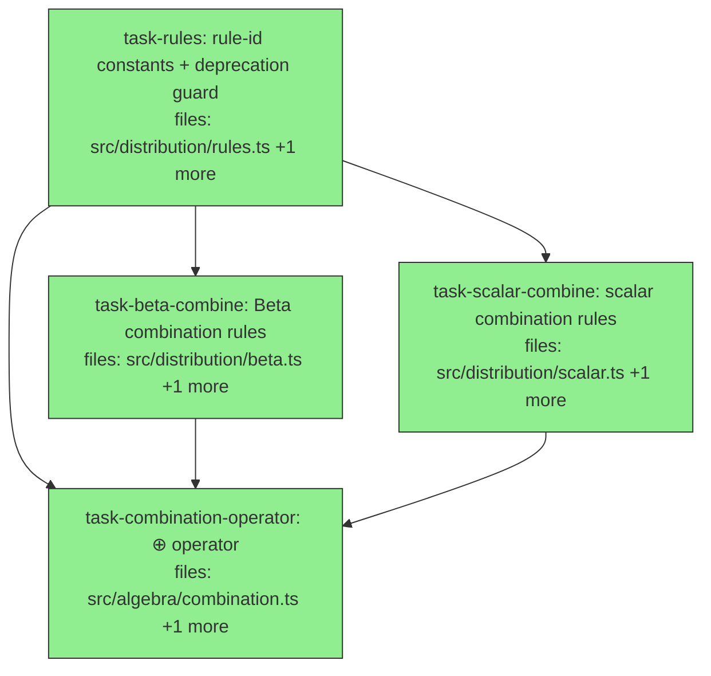

## Context

Implements **v1 sub-milestone 1 — combination rules `⊕`** per the approved design at
`docs/superpowers/specs/2026-05-25-mneme-v1-combination-rules-design.md`, the thin slice of the
canonical spec `mneme-spec-v0.2-consolidated.md` (§4.9 the `⊕` operators, §5.6 per-rule math +
idempotence table, §5.2 Beta binding, §0.3 the pinned α,β convention, §2.5 the subjective-logic
bridge).

**Goal:** the MVP stubbed `combine()`/`supportedRules()`/`isIdempotent()` in the Beta and scalar
bindings (`combine` throws "deferred to v1", `supportedRules` returns ∅). This slice fills them in
with the five core rules (Beta: all 5; scalar: 3) and adds the belief-combination operator `⊕`
(`oplusDedupe`, `oplusSynthesizeAs`). Core `[C]` tier only; `requiredTiers = {core}`.

**Builds on the green MVP** (326 tests). Pre-existing and reused: `DistributionProtocol` +
`assertSupportsRule` (`src/distribution/protocol.ts`); the SL bridge `betaToOpinion`/`opinionToBeta`
(`src/distribution/subjective-logic.ts`); `bindingFor` (`src/distribution/registry.ts`);
`SOURCE_WEIGHT` (Appendix A, `src/write/source-weight.ts`); the algebra `Corpus`/`Claim` types
(`src/algebra/types.ts`, `src/core/claim.ts`).

**DAG shape:** `task-rules` is the root (rule-id constants + the `rule_max_confidence` deprecation
guard that the bindings and operator reference). `task-beta-combine` and `task-scalar-combine` run
in parallel after it (disjoint files). `task-combination-operator` converges on all three. The
two binding tasks each also update their co-located MVP test that asserted the old "combine is
deferred" stub — that cascade is contained to those two files (grep-verified: no other consumer
asserts the stubbed behavior).

**Deferred (NOT this slice):** persisting synthesized claims (`commit_derived`/`evaluationClock`);
mixed-distribution combination (§5.5 — `combine` requires matching distribution types, mismatch
throws); per-corpus tie-breaker override (default lexicographic-on-claim-id only); Dirichlet/Gaussian
bindings and `rule_kalman`; the `⊳` join operator; aggregation α (§4.13).

## Tasks

## Task: rule-id constants and deprecation guard

```yaml
id: task-rules
depends_on: []
files:
  - src/distribution/rules.ts
  - src/distribution/rules.test.ts
status: done
```

Canonical rule-id string constants (referenced by both bindings and the operator) plus
`assertNotDeprecatedRule` — the guard enforcing the §5.6 MUST that the removed `rule_max_confidence`
is rejected with a typed error naming **both** replacements (silent migration is forbidden).

## Implementation

```typescript
// src/distribution/rules.ts
export const RULE = {
  WEIGHTED_AVG: "rule_weighted_avg",
  EVIDENCE_POOLED: "rule_evidence_pooled",
  MAX_MEAN: "rule_max_mean",
  MAX_CONCENTRATION: "rule_max_concentration",
  DEMPSTER: "rule_dempster",
} as const;
export type RuleId = (typeof RULE)[keyof typeof RULE];
// §5.6: rule_max_confidence is removed (ambiguous mean-vs-concentration). Referencing it MUST
// throw a typed error naming BOTH replacements and stating the distinction — no silent default.
export function assertNotDeprecatedRule(ruleId: string): void {
  if (ruleId === "rule_max_confidence") {
    throw new Error(
      `rule "rule_max_confidence" is removed (ambiguous): use "rule_max_mean" ` +
        `(select by point estimate) or "rule_max_concentration" (select by evidence weight) — choose explicitly`
    );
  }
}
```

```typescript
// src/distribution/rules.test.ts
import { assertNotDeprecatedRule, RULE } from "./rules.js";
it("rejects the removed rule_max_confidence naming both replacements", () => {
  expect(() => assertNotDeprecatedRule("rule_max_confidence")).toThrow(/rule_max_mean/);
  expect(() => assertNotDeprecatedRule("rule_max_confidence")).toThrow(/rule_max_concentration/);
  expect(() => assertNotDeprecatedRule(RULE.WEIGHTED_AVG)).not.toThrow();
});
```

## Acceptance criteria

- `RULE` exports the five canonical rule-id strings; `RuleId` is the union of their values.
- `assertNotDeprecatedRule("rule_max_confidence")` throws a typed error whose message names BOTH `rule_max_mean` AND `rule_max_concentration` and states they are different selections.
- `assertNotDeprecatedRule` is a no-op for any of the five valid rule ids (and any other string — it only guards the one removed name).

Test file: `src/distribution/rules.test.ts`.

## Task: Beta binding combination rules

```yaml
id: task-beta-combine
depends_on: [task-rules]
files:
  - src/distribution/beta.ts
  - src/distribution/beta.test.ts
status: done
```

Fill in `combine()` for all five rules in the Beta binding (§5.6), and make `supportedRules()`
return the five and `isIdempotent()` follow the §5.6 table. The MVP test asserting "combine is
deferred" is replaced by the real per-rule tests. Math uses the pinned prior `W=2, a=0.5` (§0.3).

## Implementation

```typescript
// src/distribution/beta.ts — combine() dispatches the 5 core rules (§5.6); W,a per §0.3
import { RULE } from "./rules.js";
import { betaToOpinion, opinionToBeta } from "./subjective-logic.js";
type Beta = { alpha: number; beta: number };
const W = 2, a = 0.5;
const mean = (d: Beta) => d.alpha / (d.alpha + d.beta);
const conc = (d: Beta) => d.alpha + d.beta;
// ...inside betaBinding:
combine(ruleId: string, x: Beta, y: Beta, params?: { weights?: [number, number] }): Beta {
  switch (ruleId) {
    case RULE.WEIGHTED_AVG: {                       // idempotent; one prior carried (Σw=1)
      const [wx, wy] = params?.weights ?? [1, 1];
      const s = wx + wy;
      return { alpha: (wx * x.alpha + wy * y.alpha) / s, beta: (wx * x.beta + wy * y.beta) / s };
    }
    case RULE.EVIDENCE_POOLED:                       // pairwise; exact by associativity
      return { alpha: x.alpha + y.alpha - a * W, beta: x.beta + y.beta - (1 - a) * W };
    case RULE.MAX_MEAN:                              // first-arg wins on tie (operator pre-sorts by id)
      return mean(x) >= mean(y) ? x : y;
    case RULE.MAX_CONCENTRATION:
      return conc(x) >= conc(y) ? x : y;
    case RULE.DEMPSTER:                              // via SL mass functions + conflict normalization
      return opinionToBeta(dempsterCombine(betaToOpinion(x.alpha, x.beta), betaToOpinion(y.alpha, y.beta)));
    default:
      throw new Error(`rule "${ruleId}" not supported by the Beta binding`);
  }
},
supportedRules: () => new Set<string>([RULE.WEIGHTED_AVG, RULE.EVIDENCE_POOLED, RULE.MAX_MEAN, RULE.MAX_CONCENTRATION, RULE.DEMPSTER]),
isIdempotent: (ruleId: string) => ruleId === RULE.WEIGHTED_AVG || ruleId === RULE.MAX_MEAN || ruleId === RULE.MAX_CONCENTRATION,
```

```typescript
// src/distribution/beta.test.ts — REPLACES the MVP "combine is deferred" assertion
import { betaBinding } from "./beta.js";
it("evidence_pooled of Beta(3,2) with itself is Beta(5,3) (one prior retained, §5.6)", () => {
  expect(betaBinding.combine("rule_evidence_pooled", { alpha: 3, beta: 2 }, { alpha: 3, beta: 2 }))
    .toEqual({ alpha: 5, beta: 3 });
});
```

## Acceptance criteria

- `combine("rule_evidence_pooled", Beta(3,2), Beta(3,2))` → `Beta(5,3)` (mean 0.625, concentration 8); NOT the naive `Beta(6,4)`.
- `combine("rule_weighted_avg", x, x, {weights:[w1,w2]})` returns `x` for any positive weights (idempotent); a 50/50 average of `Beta(2,2)` and `Beta(6,2)` is `Beta(4,2)`.
- `rule_max_mean` vs `rule_max_concentration` diverge: for `Beta(9,1)` (mean 0.9, conc 10) and `Beta(80,20)` (mean 0.8, conc 100), max_mean returns `Beta(9,1)`, max_concentration returns `Beta(80,20)`.
- `rule_dempster`: combining with the vacuous opinion `Beta(1,1)` is the identity; `combine(dempster, x, y) === combine(dempster, y, x)` (commutativity) within float tolerance.
- `supportedRules()` returns exactly the five rule ids; `isIdempotent` is true for weighted_avg/max_mean/max_concentration and false for evidence_pooled/dempster (the §5.6 table).
- The MVP test asserting `combine` throws "deferred" is removed/replaced; full suite stays green.

Test file: `src/distribution/beta.test.ts`.

## Task: scalar binding combination rules

```yaml
id: task-scalar-combine
depends_on: [task-rules]
files:
  - src/distribution/scalar.ts
  - src/distribution/scalar.test.ts
status: done
```

Fill in `combine()` for the three rules a bare point value supports (§5.6): `rule_weighted_avg`,
`rule_max_mean`, `rule_max_concentration`. `rule_evidence_pooled` and `rule_dempster` stay
NotSupported (both need an evidence total a scalar lacks). The MVP stub test is replaced.

## Implementation

```typescript
// src/distribution/scalar.ts — combine() supports the 3 evidence-free rules (§5.6)
import { RULE } from "./rules.js";
type Scalar = { p: number };
// ...inside scalarBinding:
combine(ruleId: string, x: Scalar, y: Scalar, params?: { weights?: [number, number] }): Scalar {
  switch (ruleId) {
    case RULE.WEIGHTED_AVG: {
      const [wx, wy] = params?.weights ?? [1, 1];
      return { p: (wx * x.p + wy * y.p) / (wx + wy) };
    }
    case RULE.MAX_MEAN:
      return x.p >= y.p ? x : y;
    case RULE.MAX_CONCENTRATION:           // degenerate: all scalars share variance 0 → tie;
      return x;                            // first-arg wins (operator pre-sorts by claim id)
    default:
      throw new Error(`rule "${ruleId}" not supported by the scalar binding (needs an evidence total)`);
  }
},
supportedRules: () => new Set<string>([RULE.WEIGHTED_AVG, RULE.MAX_MEAN, RULE.MAX_CONCENTRATION]),
isIdempotent: (ruleId: string) => ruleId === RULE.WEIGHTED_AVG || ruleId === RULE.MAX_MEAN || ruleId === RULE.MAX_CONCENTRATION,
```

```typescript
// src/distribution/scalar.test.ts — REPLACES the MVP supportedRules-empty / combine-throws stub
import { scalarBinding } from "./scalar.js";
it("weighted_avg averages point values; evidence_pooled is NotSupported", () => {
  expect(scalarBinding.combine("rule_weighted_avg", { p: 0.8 }, { p: 0.4 }, { weights: [1, 1] })).toEqual({ p: 0.6 });
  expect(() => scalarBinding.combine("rule_evidence_pooled", { p: 0.8 }, { p: 0.4 })).toThrow(/not supported/);
});
```

## Acceptance criteria

- `combine("rule_weighted_avg", {p:0.8}, {p:0.4}, {weights:[1,1]})` → `{p:0.6}`; idempotent (`x` with `x` → `x`).
- `combine("rule_max_mean", {p:0.8}, {p:0.4})` → `{p:0.8}`.
- `combine("rule_evidence_pooled", …)` and `combine("rule_dempster", …)` throw a typed "not supported" error.
- `supportedRules()` returns exactly `{weighted_avg, max_mean, max_concentration}`; `isIdempotent` is true for all three it supports.
- The MVP stub test (supportedRules empty / combine throws "deferred") is removed/replaced; full suite stays green.

Test file: `src/distribution/scalar.test.ts`.

## Task: belief combination operator ⊕

```yaml
id: task-combination-operator
depends_on: [task-rules, task-beta-combine, task-scalar-combine]
files:
  - src/algebra/combination.ts
  - src/algebra/combination.test.ts
status: done
```

The `⊕` algebra operator (§4.9): `oplusDedupe` collapses claims sharing `(subject, key, scopeHash)`
into one per group via the bound `combine()`; `oplusSynthesizeAs` combines all input claims into one
synthesized in-memory `Claim` (it does NOT persist). Both route the rule through
`assertNotDeprecatedRule` then `assertSupportsRule`, and fold each group through the pairwise
`combine()`.

## Implementation

```typescript
// src/algebra/combination.ts
import type { Corpus } from "./types.js";
import { corpusOf } from "./types.js";
import type { Claim } from "../core/claim.js";
import { bindingFor } from "../distribution/registry.js";
import { assertSupportsRule } from "../distribution/protocol.js";
import { assertNotDeprecatedRule, RULE } from "../distribution/rules.js";
import { SOURCE_WEIGHT } from "../write/source-weight.js";

// Fold a group's claims through the pairwise combine(). For weighted_avg, thread the accumulated
// source-weight so the fold equals the full normalized weighted average; max rules pre-sort by
// claim id so the first-arg-wins tie-break is lexicographic; evidence_pooled folds exactly.
export const oplusDedupe = (ruleId: string, params?: unknown) => (c: Corpus): Corpus => {
  assertNotDeprecatedRule(ruleId);
  const groups = new Map<string, Claim[]>(); // keyed by `${subject} ${key} ${scopeHash}`
  for (const cl of c.claims) { /* push into group */ }
  const out: Claim[] = [];
  for (const group of groups.values()) out.push(combineGroup(ruleId, group, params));
  return corpusOf(out);
};

// Returns an UNPERSISTED synthesized Claim: confidence from the rule, evidence = union of inputs',
// scope = inputs' shared scope fields. Persisting it (id/recorded/provenance) is the derived-writes slice.
export const oplusSynthesizeAs = (subject: string, key: string, ruleId: string, params?: unknown) =>
  (c: Corpus): Claim => {
    assertNotDeprecatedRule(ruleId);
    const synthesizedConfidence = /* combineGroup over all c.claims, take .confidence */ undefined;
    return { /* subject, key, confidence, evidence: unionEvidence(c.claims), scope: sharedScope(c.claims), ... */ } as Claim;
  };

function combineGroup(ruleId: string, claims: Claim[], params?: unknown): Claim {
  const binding = bindingFor(claims[0].confidence.distribution);
  assertSupportsRule(binding, ruleId);
  const sorted = ruleId === RULE.MAX_MEAN || ruleId === RULE.MAX_CONCENTRATION
    ? [...claims].sort((p, q) => p.id < q.id ? -1 : 1) : claims; // lexicographic claim-id tie-break
  // fold sorted via binding.combine(ruleId, accParams, nextParams, weights); weighted_avg threads SOURCE_WEIGHT
  return /* representative claim carrying the folded confidence */ sorted[0];
}
```

```typescript
// src/algebra/combination.test.ts
import { oplusDedupe } from "./combination.js";
import { corpusOf } from "./types.js";
const claim = (id: string, value: string, alpha: number, beta: number) => ({
  id, subject: "s", key: "s.k", scopeHash: "_", value,
  confidence: { distribution: "beta", parameters: { alpha, beta }, raw: alpha / (alpha + beta) },
} as any);
it("oplusDedupe collapses same-(subject,key,scope) claims via evidence_pooled", () => {
  const out = oplusDedupe("rule_evidence_pooled")(corpusOf([claim("a", "x", 3, 2), claim("b", "x", 3, 2)]));
  expect(out.claims).toHaveLength(1);
  expect(out.claims[0].confidence.parameters).toEqual({ alpha: 5, beta: 3 });
});
```

## Acceptance criteria

- `oplusDedupe` groups by `(subject, key, scopeHash)` and emits one claim per group; two `Beta(3,2)` claims on the same triple combine under `rule_evidence_pooled` to one `Beta(5,3)` (count drops from 2 to 1).
- `oplusDedupe` with `rule_weighted_avg` weights each claim by `SOURCE_WEIGHT[claim.source]` (normalized), and is idempotent (deduping an already-unique corpus is a no-op on confidence).
- `oplusDedupe` with `rule_max_mean`/`rule_max_concentration` selects per group with a deterministic lexicographic claim-id tie-break.
- `oplusSynthesizeAs(subject, key, rule)` returns a single `Claim` with the rule-combined confidence and the union of input evidence; it does not call any adapter/persist.
- An unsupported rule on a binding (e.g. `rule_dempster` on scalar claims) throws via `assertSupportsRule`; `rule_max_confidence` throws via `assertNotDeprecatedRule` naming both replacements.

Test file: `src/algebra/combination.test.ts`.
