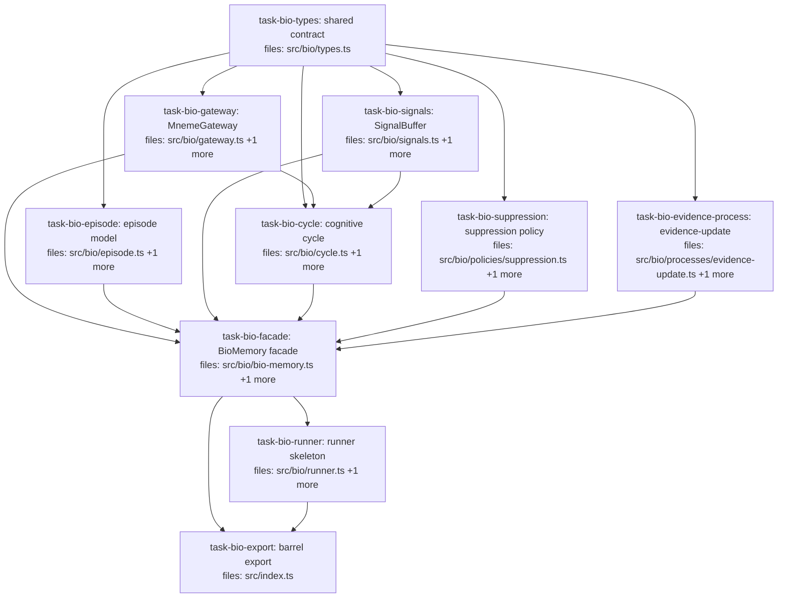

## Context

Implements **wave 1** of the bio cognitive layer described in `docs/superpowers/specs/2026-05-26-bio-layer-design.md`. Wave 1 is the subset buildable on today's Mneme substrate: **Reinforcement**, **Forgetting-as-suppression**, **Outcome-driven reweighting**, and the **runner skeleton**, plus their foundations (the append-only gateway, episode model, signals, cognitive cycle, facade).

**Out of scope (wave 2 / deferred):** Dreaming and Consolidation (gated on the unbuilt Mneme write model + synthesis `⊕` + contradiction `⊥`); all recall-shaping (salience, associative recall, working-memory assembly, memory-type, audience); prediction. The `AppendOp` union defines `derive` and `promote` for contract stability, but wave-1 *mechanisms* only emit `supersede`.

**Repo mapping.** Mneme is a single ESM package (`vitest`, colocated `*.test.ts`). The spec's conceptual `@mneme/bio` / `@mneme/bio-runner` packages map to `src/bio/` and `src/bio/runner.ts`. The bio layer reads and appends through the pre-existing SQLite adapter (`src/adapters/sqlite.ts`) and core types (`src/core/*`).

**Architecture (Approach A).** Read-side policies are pure `(Claim[], ctx) → Claim[]` transforms with no gateway access. Write-side processes are pure `(input) → AppendOp[]`; they never apply. The `MnemeGateway` is the single write path and exposes no mutate/delete surface — append-only is enforced structurally. The cognitive cycle composes processes, applies one atomic batch, and flushes signals.

**Decay seam.** Mneme's δ operator is not yet implemented. `RetrievalContext.decay` is therefore a pluggable `DecayPolicy` function the caller supplies (defaulting to a simple exponential over `pointEstimate`); when Mneme ships δ, the default is swapped for it without changing the bio interface.

## Tasks

## Task: shared bio contract

```yaml
id: task-bio-types
depends_on: []
files:
  - src/bio/types.ts
status: done
```

Defines every shared bio-layer contract symbol in one module so all consumers depend on a single definer (no drift between parallel implementers). Per spec §3–§8.

## Implementation

```typescript
// src/bio/types.ts
import type { Claim, CandidateClaim, Status } from "../core/claim.js";
import type { ClaimId } from "../core/ids.js";
import type { Instant } from "../core/time.js";
import type { ExecutionPlan } from "../adapters/adapter.js";

export type BioQuery = ExecutionPlan;                 // bio reads via Mneme's existing query spec

export type AppendOp =
  | { kind: "derive"; claim: CandidateClaim }                                   // wave-2/prediction; defined for contract stability
  | { kind: "supersede"; deprecate: ClaimId; with: CandidateClaim; reason: string }
  | { kind: "promote"; target: ClaimId; to: Status; reason: string };          // wave-2; defined for contract stability

export interface AppendResult { applied: number; skipped: number; }

export type EpisodeId = string;
export interface Episode { id: EpisodeId; runIds: string[]; startedAt: Instant; endedAt?: Instant; }

export type Signal =
  | { kind: "usage"; claimIds: ClaimId[]; episode: EpisodeId }
  | { kind: "outcome"; episode: EpisodeId; result: "success" | "failure"; weight?: number };

export type DecayPolicy = (claim: Claim, now: Instant) => number;               // effective confidence in [0,1]
export interface RetrievalContext { now: Instant; decay: DecayPolicy; episode?: Episode; persona?: string; }
export interface RetrievalPolicy { name: string; apply(claims: Claim[], ctx: RetrievalContext): Claim[]; }

export interface SignalView {                                                   // read-only slice a process sees
  usageFor(e: EpisodeId): ClaimId[];
  outcomesFor(e: EpisodeId): { result: "success" | "failure"; weight?: number }[];
  surfacedFor(e: EpisodeId): ClaimId[];
}
export interface ProcessInput { read: (q: BioQuery) => Claim[]; readByIds: (ids: ClaimId[]) => Claim[]; episode: Episode; signals: SignalView; now: Instant; }
export interface CognitiveProcess { name: string; run(input: ProcessInput): AppendOp[]; }
export interface CycleReport { opsApplied: number; claimsSuperseded: number; errors: string[]; }
```

```typescript
// src/bio/types.test.ts
import type { AppendOp } from "./types.js";

it("AppendOp discriminates its three kinds", () => {
  const ops: AppendOp[] = [
    { kind: "supersede", deprecate: "id-1" as any, with: {} as any, reason: "reinforce" },
  ];
  expect(ops[0].kind).toBe("supersede");
});
```

## Acceptance criteria

- `AppendOp` is a closed union of exactly `derive | supersede | promote`; the discriminant `kind` narrows each variant.
- `BioQuery` is a type alias of Mneme's `ExecutionPlan` (no new query language defined).
- `RetrievalPolicy.apply` and `CognitiveProcess.run` signatures match spec §6/§7; neither receives a gateway/apply handle.
- `tsc --noEmit` passes; the module exports no runtime values that perform side effects.

Test file: `src/bio/types.test.ts`.

## Task: MnemeGateway

```yaml
id: task-bio-gateway
depends_on: [task-bio-types]
files:
  - src/bio/gateway.ts
  - src/bio/gateway.test.ts
status: done
```

The single write path. `read` passes through to the Mneme adapter; `apply` translates `AppendOp`s into adapter calls with idempotency dedup. Exposes no mutate/delete method, enforcing append-only structurally (spec §1.1, §4). Hosts the centerpiece invariant property test.

## Implementation

```typescript
// src/bio/gateway.ts
import { createSqliteAdapter } from "../adapters/sqlite.js";
import type { StorageAdapter } from "../adapters/adapter.js";
import type { Claim, CandidateClaim } from "../core/claim.js";
import { newClaimId, type ClaimId } from "../core/ids.js";
import { scopeHash } from "../core/scope.js";
import { valueHash } from "../core/value.js";
import { now } from "../core/time.js";
import type { AppendOp, AppendResult, BioQuery } from "./types.js";

export interface MnemeGateway {
  read(query: BioQuery): Claim[];
  readByIds(ids: ClaimId[]): Claim[];
  apply(ops: AppendOp[], opKey: (op: AppendOp, i: number) => string): AppendResult;
  // NOTE: deliberately no update()/delete() — append-only is enforced by the type surface.
}

export function createMnemeGateway(adapter: StorageAdapter = createSqliteAdapter()): MnemeGateway {
  let seq = 0;
  const materialize = (c: CandidateClaim): Claim => ({
    ...c, id: newClaimId(), recorded: now(), recordedSeq: ++seq,
    scopeHash: scopeHash(c.scope), valueHash: valueHash(c.value), status: c.status ?? "validated",
  });
  return {
    read: (q) => adapter.query(q),
    readByIds: (ids) => ids.map((id) => adapter.getClaim(id)).filter((c): c is Claim => c !== undefined),
    apply(ops, opKey) {
      let applied = 0, skipped = 0;
      for (let i = 0; i < ops.length; i++) {
        const key = opKey(ops[i], i);
        if (adapter.getIdempotencyRecord("bio", key)) { skipped++; continue; }
        const op = ops[i];
        if (op.kind === "derive") adapter.insertClaim(materialize(op.claim));
        else if (op.kind === "supersede") { adapter.insertClaim(materialize(op.with)); adapter.deleteClaim(op.deprecate); }
        else /* promote */ { const c = adapter.getClaim(op.target); if (c) adapter.insertClaim({ ...c, status: op.to }); }
        adapter.putIdempotencyRecord("bio", key, { result: op.kind, createdAt: now() });
        applied++;
      }
      return { applied, skipped };
    },
  };
}
```

```typescript
// src/bio/gateway.test.ts
import { createMnemeGateway } from "./gateway.js";

it("supersede preserves the old version as deprecated and never mutates it in place", () => {
  const gw = createMnemeGateway();
  // arrange a validated claim via derive, then supersede it; assert old row still readable as 'deprecated'
  // and a NEW id holds the replacement (no in-place value mutation).
  expect(typeof gw.apply).toBe("function");
});
```

## Acceptance criteria

- `apply` translates `supersede` into insert-new (fresh `id`) + deprecate-old; both rows persist (old as `deprecated`, new with the replacement value).
- `apply` is idempotent: re-applying ops with the same `opKey` increments `skipped`, not `applied` (uses the adapter's idempotency records).
- `readByIds(ids)` returns the claims for those ids (missing ids omitted), backed by the adapter's `getClaim`.
- The `MnemeGateway` interface exposes no `update`/`delete` method (compile-time check).
- **Invariant property test (centerpiece, spec §11):** over a randomized sequence of `apply` calls, no claim row is ever physically removed and no existing row's `value`/`confidence`/`evidence` changes; only new `id`s appear and statuses transition.

Test file: `src/bio/gateway.test.ts`.

## Task: episode model

```yaml
id: task-bio-episode
depends_on: [task-bio-types]
files:
  - src/bio/episode.ts
  - src/bio/episode.test.ts
status: done
```

Manages session/episode boundaries that wave-2 dreaming/consolidation will operate on; in wave 1 it scopes reads and signal attribution. Per spec §5.

## Implementation

```typescript
// src/bio/episode.ts
import { now } from "../core/time.js";
import type { Episode, EpisodeId } from "./types.js";

export function createEpisodeRegistry() {
  const open = new Map<EpisodeId, Episode>();
  let n = 0;
  return {
    openEpisode(runId?: string): Episode {
      const ep: Episode = { id: `ep-${++n}`, runIds: runId ? [runId] : [], startedAt: now() };
      open.set(ep.id, ep);
      return ep;
    },
    attachRun(id: EpisodeId, runId: string) { open.get(id)?.runIds.push(runId); },
    closeEpisode(id: EpisodeId): Episode | undefined {
      const ep = open.get(id); if (!ep) return undefined;
      ep.endedAt = now(); open.delete(id); return ep;
    },
    get(id: EpisodeId) { return open.get(id); },
  };
}
```

```typescript
// src/bio/episode.test.ts
import { createEpisodeRegistry } from "./episode.js";

it("open then close stamps endedAt and removes from the open set", () => {
  const r = createEpisodeRegistry();
  const ep = r.openEpisode("run-1");
  const closed = r.closeEpisode(ep.id);
  expect(closed?.endedAt).toBeGreaterThanOrEqual(closed!.startedAt);
  expect(r.get(ep.id)).toBeUndefined();
});
```

## Acceptance criteria

- `openEpisode` returns a unique `id` and records `startedAt`; an optional `runId` seeds `runIds`.
- `attachRun` appends additional Mneme `runId`s to an open episode.
- `closeEpisode` stamps `endedAt >= startedAt` and removes the episode from the open set; closing an unknown id returns `undefined`.

Test file: `src/bio/episode.test.ts`.

## Task: SignalBuffer

```yaml
id: task-bio-signals
depends_on: [task-bio-types]
files:
  - src/bio/signals.ts
  - src/bio/signals.test.ts
status: done
```

Buffers usage and outcome signals plus the per-episode surfaced-claim set (the basis for bounded credit assignment), and flushes them per cycle. Implements the read-only `SignalView` contract. Per spec §7.3, §8.1, §10 (buffer cap).

## Implementation

```typescript
// src/bio/signals.ts
import type { ClaimId } from "../core/ids.js";
import type { EpisodeId, Signal, SignalView } from "./types.js";

export interface SignalBuffer extends SignalView {
  record(sig: Signal): void;
  recordSurfaced(episode: EpisodeId, claimIds: ClaimId[]): void;
  flush(episode: EpisodeId): void;
  size(): number;
}

export function createSignalBuffer(cap = 10_000): SignalBuffer {
  const usage = new Map<EpisodeId, ClaimId[]>();
  const outcomes = new Map<EpisodeId, { result: "success" | "failure"; weight?: number }[]>();
  const surfaced = new Map<EpisodeId, ClaimId[]>();
  let count = 0;
  const guard = () => { if (count >= cap) throw new Error(`SignalBuffer cap ${cap} exceeded — run a cycle to drain`); };
  return {
    record(sig) {
      guard(); count++;
      if (sig.kind === "usage") usage.set(sig.episode, [...(usage.get(sig.episode) ?? []), ...sig.claimIds]);
      else outcomes.set(sig.episode, [...(outcomes.get(sig.episode) ?? []), { result: sig.result, weight: sig.weight }]);
    },
    recordSurfaced(e, ids) { surfaced.set(e, [...(surfaced.get(e) ?? []), ...ids]); },
    usageFor: (e) => usage.get(e) ?? [],
    outcomesFor: (e) => outcomes.get(e) ?? [],
    surfacedFor: (e) => surfaced.get(e) ?? [],
    flush(e) { usage.delete(e); outcomes.delete(e); surfaced.delete(e); count = 0; },
    size: () => count,
  };
}
```

```typescript
// src/bio/signals.test.ts
import { createSignalBuffer } from "./signals.js";

it("buffers usage and exposes it via the SignalView, then flush clears it", () => {
  const b = createSignalBuffer();
  b.record({ kind: "usage", claimIds: ["c1" as any], episode: "ep-1" });
  expect(b.usageFor("ep-1")).toHaveLength(1);
  b.flush("ep-1");
  expect(b.usageFor("ep-1")).toHaveLength(0);
});
```

## Acceptance criteria

- `record` buffers usage and outcome signals keyed by episode; `recordSurfaced` accumulates the surfaced-claim set per episode.
- The `SignalView` accessors (`usageFor`/`outcomesFor`/`surfacedFor`) return buffered data without mutating it.
- `flush(episode)` clears all three maps for that episode.
- Exceeding the configured `cap` throws a clear error rather than growing unbounded (spec §10).

Test file: `src/bio/signals.test.ts`.

## Task: forgetting-as-suppression policy

```yaml
id: task-bio-suppression
depends_on: [task-bio-types]
files:
  - src/bio/policies/suppression.ts
  - src/bio/policies/suppression.test.ts
status: done
```

A pure read-side policy that drops claims whose effective (decayed) confidence is below a floor — without deleting them. Includes a `compose` helper for policy chaining. Per spec §6.

## Implementation

```typescript
// src/bio/policies/suppression.ts
import { pointEstimate } from "../../core/confidence.js";
import type { Claim } from "../../core/claim.js";
import type { DecayPolicy, RetrievalContext, RetrievalPolicy } from "../types.js";

// Default decay seam until Mneme ships δ: exponential over the Beta/scalar point estimate.
export function exponentialDecay(halfLifeMs: number): DecayPolicy {
  return (c: Claim, now) => pointEstimate(c.confidence) * Math.pow(0.5, (now - c.recorded) / halfLifeMs);
}

export function suppression(opts: { floor: number }): RetrievalPolicy {
  return {
    name: "suppression",
    apply: (claims, ctx: RetrievalContext) =>
      claims.filter((c) => ctx.decay(c, ctx.now) >= opts.floor),
  };
}

export function compose(policies: RetrievalPolicy[]): RetrievalPolicy {
  return { name: "compose", apply: (claims, ctx) => policies.reduce((acc, p) => p.apply(acc, ctx), claims) };
}
```

```typescript
// src/bio/policies/suppression.test.ts
import { suppression } from "./suppression.js";

it("drops claims whose decayed confidence is below the floor, keeps the rest", () => {
  const policy = suppression({ floor: 0.5 });
  const decay = (_c: any, _now: number) => 0.3;            // stub decay below floor
  const claims = [{ id: "c1" } as any];
  expect(policy.apply(claims, { now: 0, decay } as any)).toHaveLength(0);
});
```

## Acceptance criteria

- `suppression({floor})` returns only claims whose `ctx.decay(claim, now) >= floor`; it never calls a gateway and never mutates inputs.
- `compose([p1,p2])` applies policies left-to-right over the claim list.
- `exponentialDecay(halfLife)` returns a `DecayPolicy` computing `pointEstimate(confidence) * 0.5^(age/halfLife)`.
- A suppressed claim is absent from the policy output but unchanged in the input array (suppression is a lens, not a delete).

Test file: `src/bio/policies/suppression.test.ts`.

## Task: evidence-update process (reinforcement + outcome-reweighting)

```yaml
id: task-bio-evidence-process
depends_on: [task-bio-types]
files:
  - src/bio/processes/evidence-update.ts
  - src/bio/processes/evidence-update.test.ts
status: done
```

The single write-side process realizing both wave-1 write mechanisms as one append-evidence pathway: usage signals add weak positive evidence, outcome signals add stronger directed evidence (positive on success, disbelief on failure) to the **surfaced** claim set only. Emits one batched `supersede` per affected claim with `derivedFrom` provenance. Per spec §7.

## Implementation

```typescript
// src/bio/processes/evidence-update.ts
import type { Claim, CandidateClaim } from "../../core/claim.js";
import type { ClaimId } from "../../core/ids.js";
import { DEFAULT_PRIOR } from "../../core/confidence.js";
import type { AppendOp, CognitiveProcess, ProcessInput } from "../types.js";

const USAGE_WEIGHT = 0.5;
const OUTCOME_WEIGHT = 2.0;

export function evidenceUpdate(): CognitiveProcess {
  return {
    name: "evidence-update",
    run(input: ProcessInput): AppendOp[] {
      const { episode, signals } = input;
      const delta = new Map<string, { dAlpha: number; dBeta: number }>();
      const bump = (id: string, a: number, b: number) => {
        const d = delta.get(id) ?? { dAlpha: 0, dBeta: 0 };
        delta.set(id, { dAlpha: d.dAlpha + a, dBeta: d.dBeta + b });
      };
      for (const id of signals.usageFor(episode.id)) bump(id, USAGE_WEIGHT, 0);          // weak positive
      const surfaced = new Set(signals.surfacedFor(episode.id).map(String));             // bounded credit set
      for (const o of signals.outcomesFor(episode.id)) {
        const w = (o.weight ?? 1) * OUTCOME_WEIGHT;
        for (const id of surfaced) o.result === "success" ? bump(id, w, 0) : bump(id, 0, w);
      }
      const ids = [...delta.keys()] as unknown as ClaimId[];
      const ops: AppendOp[] = input.readByIds(ids).map((c) => {
        const d = delta.get(String(c.id))!;
        return { kind: "supersede", deprecate: c.id, with: reweighted(c, d, episode.id), reason: "evidence-update" } as AppendOp;
      });
      return ops;                                                                        // one supersede per claim, batched
    },
  };
}

function reweighted(c: Claim, d: { dAlpha: number; dBeta: number }, episode: string): CandidateClaim {
  const p = c.confidence.distribution === "beta" ? c.confidence.parameters : { alpha: DEFAULT_PRIOR.W / 2, beta: DEFAULT_PRIOR.W / 2 };
  const params = { alpha: p.alpha + d.dAlpha, beta: p.beta + d.dBeta };
  const { id, recorded, recordedSeq, scopeHash, valueHash, status, ...rest } = c;
  return { ...rest, confidence: { distribution: "beta", parameters: params, raw: params.alpha / (params.alpha + params.beta) },
           provenance: { ...c.provenance, derivedFrom: { queryExpression: "evidence-update", corpusState: recorded, inputClaims: [c.id], similarityVersions: {}, embeddingModelVersions: {}, evaluationClock: recorded, combinationRule: `episode:${episode}` } } };
}
```

```typescript
// src/bio/processes/evidence-update.test.ts
import { evidenceUpdate } from "./evidence-update.js";

it("a failure outcome adds disbelief evidence (β) to surfaced claims, never deletes", () => {
  const proc = evidenceUpdate();
  // stub read returns one beta claim; signals report it surfaced in an episode that failed.
  // assert the emitted op is a single supersede whose replacement has higher β than the original.
  expect(proc.name).toBe("evidence-update");
});
```

## Acceptance criteria

- Usage signals add `USAGE_WEIGHT` to `alpha` of each cited claim; outcome success adds to `alpha`, failure adds to `beta` — never deletes.
- Outcome credit is applied **only** to claims in `signals.surfacedFor(episode)` (bounded credit assignment; no causal inference).
- Emits exactly **one** `supersede` op per affected claim regardless of how many signals targeted it (batched).
- Each `supersede` replacement carries `derivedFrom` provenance naming the process, input claim, and episode.

Test file: `src/bio/processes/evidence-update.test.ts`.

## Task: cognitive cycle

```yaml
id: task-bio-cycle
depends_on: [task-bio-types, task-bio-gateway, task-bio-signals]
files:
  - src/bio/cycle.ts
  - src/bio/cycle.test.ts
status: done
```

Runs an ordered list of injected processes, collects their `AppendOp`s, applies them as one atomic batch through the gateway, then flushes consumed signals. Single-flight: refuses to run concurrently. Per spec §8.2, §10.

## Implementation

```typescript
// src/bio/cycle.ts
import type { MnemeGateway } from "./gateway.js";
import type { SignalBuffer } from "./signals.js";
import { now } from "../core/time.js";
import type { CognitiveProcess, CycleReport, Episode } from "./types.js";

export function createCycle(gateway: MnemeGateway, processes: CognitiveProcess[]) {
  let running = false;
  let cycleN = 0;
  return {
    run(episode: Episode, buffer: SignalBuffer): CycleReport {
      if (running) return { opsApplied: 0, claimsSuperseded: 0, errors: ["cycle already running (single-flight)"] };
      running = true;
      const cid = ++cycleN;
      try {
        const ops = processes.flatMap((p) => p.run({ read: gateway.read, readByIds: gateway.readByIds, episode, signals: buffer, now: now() }));
        const res = gateway.apply(ops, (op, i) => `${episode.id}:${cid}:${i}:${op.kind}`);
        buffer.flush(episode.id);
        return { opsApplied: res.applied, claimsSuperseded: ops.filter((o) => o.kind === "supersede").length, errors: [] };
      } catch (e) {
        return { opsApplied: 0, claimsSuperseded: 0, errors: [String(e)] };   // fail-safe: nothing applied, signals retained
      } finally { running = false; }
    },
  };
}
```

```typescript
// src/bio/cycle.test.ts
import { createCycle } from "./cycle.js";

it("applies process ops in one batch and flushes the buffer", () => {
  const applied: any[] = [];
  const gateway = { read: () => [], apply: (ops: any[]) => { applied.push(...ops); return { applied: ops.length, skipped: 0 }; } } as any;
  const flushed: string[] = [];
  const buffer = { flush: (e: string) => flushed.push(e) } as any;
  const proc = { name: "p", run: () => [{ kind: "supersede" } as any] };
  const report = createCycle(gateway, [proc]).run({ id: "ep-1" } as any, buffer);
  expect(report.opsApplied).toBe(1);
  expect(flushed).toContain("ep-1");
});
```

## Acceptance criteria

- Runs each process, concatenates their ops in process order, and calls `gateway.apply` exactly once per cycle.
- Flushes the episode's signals only after a successful `apply`.
- On any thrown error, returns a report with a non-empty `errors` array and applies nothing (fail-safe; signals not flushed).
- Single-flight: a `run` invoked while another is in progress returns immediately with an error and applies nothing.

Test file: `src/bio/cycle.test.ts`.

## Task: BioMemory facade

```yaml
id: task-bio-facade
depends_on: [task-bio-gateway, task-bio-episode, task-bio-signals, task-bio-cycle, task-bio-suppression, task-bio-evidence-process]
files:
  - src/bio/bio-memory.ts
  - src/bio/bio-memory.test.ts
status: done
```

The library entry point. Wires gateway + episode registry + signal buffer + cycle (with the evidence-update process) + suppression. `recall` reads, records the surfaced set, and applies policies; `recordUsage` buffers; `recordOutcome` buffers and fires an inline scoped cycle. Per spec §8.1.

## Implementation

```typescript
// src/bio/bio-memory.ts
import { createMnemeGateway, type MnemeGateway } from "./gateway.js";
import { createEpisodeRegistry } from "./episode.js";
import { createSignalBuffer } from "./signals.js";
import { createCycle } from "./cycle.js";
import { evidenceUpdate } from "./processes/evidence-update.js";
import { compose } from "./policies/suppression.js";
import type { BioQuery, CycleReport, EpisodeId, RetrievalContext, RetrievalPolicy } from "./types.js";
import type { ClaimId } from "../core/ids.js";

export function createBioMemory(gateway: MnemeGateway = createMnemeGateway()) {
  const episodes = createEpisodeRegistry();
  const buffer = createSignalBuffer();
  const cycle = createCycle(gateway, [evidenceUpdate()]);
  return {
    openEpisode: episodes.openEpisode, closeEpisode: episodes.closeEpisode,
    recall(q: BioQuery, policies: RetrievalPolicy[], ctx: RetrievalContext, episode?: EpisodeId) {
      const claims = compose(policies).apply(gateway.read(q), ctx);
      if (episode) buffer.recordSurfaced(episode, claims.map((c) => c.id));
      return claims;
    },
    recordUsage(claimIds: ClaimId[], episode: EpisodeId) { buffer.record({ kind: "usage", claimIds, episode }); },
    recordOutcome(episode: EpisodeId, result: "success" | "failure", weight?: number): CycleReport {
      buffer.record({ kind: "outcome", episode, result, weight });
      const ep = episodes.get(episode); return ep ? cycle.run(ep, buffer) : { opsApplied: 0, claimsSuperseded: 0, errors: ["unknown episode"] };
    },
    runCycle(episode: EpisodeId): CycleReport {
      const ep = episodes.get(episode); return ep ? cycle.run(ep, buffer) : { opsApplied: 0, claimsSuperseded: 0, errors: ["unknown episode"] };
    },
  };
}
```

```typescript
// src/bio/bio-memory.test.ts
import { createBioMemory } from "./bio-memory.js";

it("recordOutcome fires an inline cycle scoped to the episode", () => {
  const bio = createBioMemory();
  const ep = bio.openEpisode();
  const report = bio.recordOutcome(ep.id, "success");
  expect(report.errors).toHaveLength(0);
});
```

## Acceptance criteria

- `recall` returns policy-filtered claims and records their ids as the episode's surfaced set when an episode is given.
- `recordUsage` only buffers (no cycle); `recordOutcome` buffers and runs an inline cycle scoped to that episode.
- `recordOutcome`/`runCycle` against an unknown episode returns a report with an error and applies nothing.
- The facade works with no runner package present (pure library usage).

Test file: `src/bio/bio-memory.test.ts`.

## Task: runner skeleton

```yaml
id: task-bio-runner
depends_on: [task-bio-facade]
files:
  - src/bio/runner.ts
  - src/bio/runner.test.ts
status: done
```

A logic-less scheduler that drives `BioMemory.runCycle` on an optional interval and on explicit `runNow`. Owns no cognition. Per spec §9 (v1: one trigger + run-now; no daemon/idle/cron/event bus).

## Implementation

```typescript
// src/bio/runner.ts
import type { CycleReport, EpisodeId } from "./types.js";

interface CycleDriver { runCycle(episode: EpisodeId): CycleReport; }

export function createRunner(memory: CycleDriver, episode: EpisodeId) {
  let timer: ReturnType<typeof setInterval> | undefined;
  return {
    start(opts: { intervalMs?: number } = {}) { if (opts.intervalMs) timer = setInterval(() => memory.runCycle(episode), opts.intervalMs); },
    stop() { if (timer) clearInterval(timer); timer = undefined; },
    runNow(): CycleReport { return memory.runCycle(episode); },
  };
}
```

```typescript
// src/bio/runner.test.ts
import { createRunner } from "./runner.js";

it("runNow delegates to memory.runCycle and owns no logic", () => {
  let calls = 0;
  const memory = { runCycle: () => { calls++; return { opsApplied: 0, claimsSuperseded: 0, errors: [] }; } };
  createRunner(memory, "ep-1").runNow();
  expect(calls).toBe(1);
});
```

## Acceptance criteria

- `runNow` calls `memory.runCycle` exactly once and returns its report.
- `start({intervalMs})` schedules periodic `runCycle`; `start()` with no interval schedules nothing.
- `stop` clears any scheduled interval; calling `stop` when not started is a no-op.
- The runner contains no cognitive logic — it only calls `runCycle` (verified by the driver-call test).

Test file: `src/bio/runner.test.ts`.

## Task: barrel export

```yaml
id: task-bio-export
depends_on: [task-bio-facade, task-bio-runner]
files:
  - src/index.ts
status: done
is_wiring_task: true
```

Re-exports the bio layer's public surface from the package barrel so consumers can import it from the package root.

## Acceptance criteria

- `src/index.ts` re-exports `createBioMemory`, `createRunner`, `createMnemeGateway`, `suppression`/`compose`/`exponentialDecay`, and the public bio types.
- Importing these symbols from the package root resolves after this task (`tsc --noEmit` passes).
- No pre-existing exports in `src/index.ts` are removed or altered.

Test file: `src/index.test.ts`.
