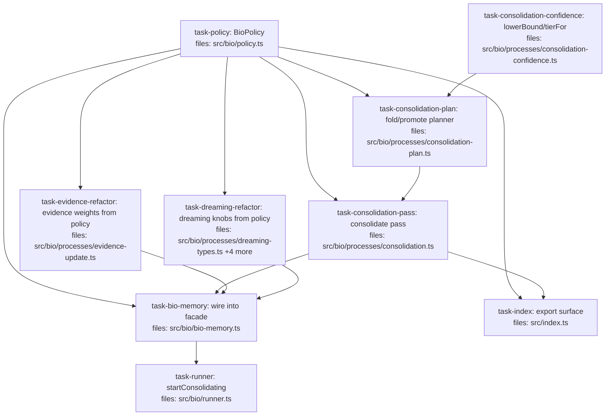

## Context

Implements the **Consolidation (model-free core) + unified `BioPolicy`** slice. Driving spec: `docs/superpowers/specs/2026-05-26-bio-layer-wave2-consolidation-design.md`.

Two deliverables, interleaved:
1. **Consolidation** — a synchronous `consolidate(episode)` pass over the Mneme-backed gateway: promotion on a Beta lower-bound threshold + corroboration ⊕ folding of ≥K agreeing claims. Closes the wave-2 loop (dreamed candidates graduate to `validated` and reseed dreaming).
2. **Unified `BioPolicy`** — one config object for all write/process tuning, exposing previously-hardcoded knobs (wave-1 keystone evidence weights; dreaming prior/depth) alongside consolidation's. **Behavior-preserving:** every default equals today's constant, so the existing wave-1 and dreaming test suites must stay green unchanged. That is the refactor's safety contract.

**Key construction decisions baked into the tasks:**
- `policy.ts` is the single source of default values (`DEFAULT_BIO_POLICY`). Mechanisms import the type + defaults from it (one-directional: mechanisms → policy, never the reverse — no cycle).
- `DREAM_PRIOR` / `MAX_DREAM_DEPTH` stay *exported* (4 test files assert them) but are re-derived from `DEFAULT_BIO_POLICY` so there is no drift.
- `evidenceUpdate()` and `createDreamPass(gw, fn)` keep working with no extra args (optional params, defaulted) — existing call sites and tests are untouched.
- `LIFECYCLE_ORDER` in `src/write/pipeline.ts` is **not exported**; consolidation defines its own local promotion-tier order (`candidate < provisional < validated`) rather than reach across into `src/write/`.
- End-to-end tests reuse the pre-existing `src/bio/test-support.ts` `makeBioMneme()` helper (no new helper task needed).

## Tasks

## Task: Unified BioPolicy config module

```yaml
id: task-policy
depends_on: []
files:
  - src/bio/policy.ts
  - src/bio/policy.test.ts
status: pending
```

The single home for every bio write/process tuning knob (spec §4). Defines the `BioPolicy` type, the canonical `DEFAULT_BIO_POLICY` values (equal to today's hardcoded constants), and `resolvePolicy(p?)` which deep-merges a partial policy onto the defaults. No imports from any bio mechanism — dependency flows mechanisms → policy only.

## Implementation

```typescript
// src/bio/policy.ts
import { RULE } from "../distribution/rules.js";

export interface BioPolicy {
  evidence?: { usageWeight?: number; outcomeWeight?: number; scalarPseudocount?: number };
  dreaming?: { prior?: { alpha: number; beta: number }; maxDepth?: number; maxInputClaims?: number };
  consolidation?: {
    promoteThresholds?: { provisional?: number; validated?: number };
    lowerBoundK?: number;
    foldRule?: string;
    foldThreshold?: number;
  };
}

export const DEFAULT_BIO_POLICY = {
  evidence: { usageWeight: 0.5, outcomeWeight: 2.0, scalarPseudocount: 2 },
  dreaming: { prior: { alpha: 1, beta: 3 }, maxDepth: 3, maxInputClaims: 200 },
  consolidation: {
    promoteThresholds: { provisional: 0.5, validated: 0.65 },
    lowerBoundK: 1.645,
    foldRule: RULE.WEIGHTED_AVG,
    foldThreshold: 3,
  },
} as const;

// Deep-merge each sub-policy so a partial override never drops sibling defaults.
export function resolvePolicy(p?: BioPolicy): typeof DEFAULT_BIO_POLICY {
  return {
    evidence: { ...DEFAULT_BIO_POLICY.evidence, ...p?.evidence },
    dreaming: {
      ...DEFAULT_BIO_POLICY.dreaming,
      ...p?.dreaming,
      prior: { ...DEFAULT_BIO_POLICY.dreaming.prior, ...p?.dreaming?.prior },
    },
    consolidation: {
      ...DEFAULT_BIO_POLICY.consolidation,
      ...p?.consolidation,
      promoteThresholds: {
        ...DEFAULT_BIO_POLICY.consolidation.promoteThresholds,
        ...p?.consolidation?.promoteThresholds,
      },
    },
  };
}
```

```typescript
// src/bio/policy.test.ts
import { resolvePolicy, DEFAULT_BIO_POLICY } from "./policy.js";

it("resolvePolicy(undefined) deep-equals the defaults", () => {
  expect(resolvePolicy()).toEqual(DEFAULT_BIO_POLICY);
});

it("a partial override keeps sibling defaults", () => {
  const r = resolvePolicy({ consolidation: { foldThreshold: 5 } });
  expect(r.consolidation.foldThreshold).toBe(5);
  expect(r.consolidation.promoteThresholds.validated).toBe(0.65); // sibling preserved
  expect(r.evidence.outcomeWeight).toBe(2.0);                     // sibling family preserved
});
```

## Acceptance criteria

- `resolvePolicy()` (no arg) deep-equals `DEFAULT_BIO_POLICY`.
- A nested partial (`{ consolidation: { foldThreshold: 5 } }`) overrides only that field; `promoteThresholds`, `lowerBoundK`, `foldRule`, and the `evidence`/`dreaming` families retain defaults.
- A `dreaming.prior` partial (`{ alpha: 2 }`) merges with the default `beta`, not replacing the whole prior object.
- `DEFAULT_BIO_POLICY` values equal the pre-refactor constants: `0.5`/`2.0`/`2`, `Beta(1,3)`, depth `3`, `maxInputClaims 200`, thresholds `0.5`/`0.65`, `k 1.645`, `foldRule = RULE.WEIGHTED_AVG`, `foldThreshold 3`.

Test file: `src/bio/policy.test.ts`.

## Task: Consolidation confidence helpers

```yaml
id: task-consolidation-confidence
depends_on: []
files:
  - src/bio/processes/consolidation-confidence.ts
  - src/bio/processes/consolidation-confidence.test.ts
status: pending
```

Pure, policy-agnostic confidence math (spec §5). `lowerBound(confidence, k)` returns the Beta lower bound via the `mean − k·σ` normal approximation (no quantile exists in the substrate); `tierFor(lowerBound, thresholds)` maps it to a promotion tier. Takes primitive args (a `number` k, a `{provisional, validated}` thresholds object) so it has no dependency on `BioPolicy`.

## Implementation

```typescript
// src/bio/processes/consolidation-confidence.ts
import type { Claim, Status } from "../../core/claim.js";
import { bindingFor } from "../../distribution/registry.js";

// Local promotion-tier ranking. The substrate's LIFECYCLE_ORDER (src/write/pipeline.ts)
// is NOT exported and includes "deprecated" (a fold/terminal concern); promotion only
// climbs candidate < provisional < validated.
export const PROMOTE_TIERS: Status[] = ["candidate", "provisional", "validated"];

export function lowerBound(confidence: Claim["confidence"], k: number): number {
  const b = bindingFor(confidence.distribution);
  const mean = b.mean(confidence.parameters as any);
  const variance = b.variance ? b.variance(confidence.parameters as any) : 0; // scalar → point belief
  return Math.max(0, mean - k * Math.sqrt(variance));
}

export function tierFor(lb: number, thresholds: { provisional: number; validated: number }): Status {
  if (lb >= thresholds.validated) return "validated";
  if (lb >= thresholds.provisional) return "provisional";
  return "candidate";
}

export const rankOf = (s: Status): number => PROMOTE_TIERS.indexOf(s);
```

```typescript
// src/bio/processes/consolidation-confidence.test.ts
import { lowerBound, tierFor } from "./consolidation-confidence.js";

it("a thin high-mean Beta does NOT clear validated (wide lower bound)", () => {
  const thin = { distribution: "beta", parameters: { alpha: 2, beta: 0.0001 }, raw: 1 } as any;
  expect(lowerBound(thin, 1.645)).toBeLessThan(0.65);
  expect(tierFor(lowerBound(thin, 1.645), { provisional: 0.5, validated: 0.65 })).not.toBe("validated");
});
```

## Acceptance criteria

- `lowerBound` of a thin Beta (e.g. `Beta(2, 0.0001)`, mean ≈ 1) is well below the mean and does not clear `validated@0.65`.
- `lowerBound` of a concentrated Beta (e.g. `Beta(40, 8)`) clears `validated@0.65`.
- `lowerBound` is monotonic in `k`: larger `k` ⇒ smaller (or equal) lower bound.
- `tierFor` returns `validated`/`provisional`/`candidate` at the correct threshold boundaries (`>=`).
- A scalar-distribution claim yields `lowerBound = mean` (variance treated as 0).

Test file: `src/bio/processes/consolidation-confidence.test.ts`.

## Task: Consolidation fold/promote planner

```yaml
id: task-consolidation-plan
depends_on: [task-policy, task-consolidation-confidence]
files:
  - src/bio/processes/consolidation-plan.ts
  - src/bio/processes/consolidation-plan.test.ts
status: pending
```

The pure planning core (spec §5–§6): given the episode's active claims and the resolved consolidation policy, emit `AppendOp[]`. Groups claims by `(subject, key, scopeHash, valueHash)`; groups of size ≥ `max(2, foldThreshold)` are folded (one `derive` of the ⊕-combined claim at its earned tier + a `promote(→deprecated)` per input); every other active claim is a promotion candidate (`promote` only on a strict forward tier advance). Fold xor promote — a claim is never both.

## Implementation

```typescript
// src/bio/processes/consolidation-plan.ts
import type { Claim } from "../../core/claim.js";
import type { Instant } from "../../core/time.js";
import type { AppendOp } from "../types.js";
import type { BioPolicy } from "../policy.js";
import { lowerBound, tierFor, rankOf } from "./consolidation-confidence.js";
import { oplusSynthesizeAs } from "../../algebra/combination.js";
import { corpusOf } from "../../algebra/types.js";

export const CONSOLIDATE_WORKFLOW = "consolidate";
type ConsPolicy = Required<NonNullable<BioPolicy["consolidation"]>>;

export function planConsolidation(claims: Claim[], pol: ConsPolicy, now: Instant): AppendOp[] {
  const active = claims.filter((c) => c.status !== "deprecated");
  const K = Math.max(2, pol.foldThreshold);
  const groups = new Map<string, Claim[]>();
  for (const c of active) {
    const key = `${c.subject}${c.key}${c.scopeHash}${c.valueHash}`;
    (groups.get(key) ?? groups.set(key, []).get(key)!).push(c);
  }
  const ops: AppendOp[] = [];
  const folded = new Set<string>();
  for (const group of groups.values()) {
    if (group.length < K) continue;
    const synth = oplusSynthesizeAs(group[0].subject, group[0].key, pol.foldRule)(corpusOf(group));
    const tier = tierFor(lowerBound(synth.confidence, pol.lowerBoundK), pol.promoteThresholds);
    ops.push({ kind: "derive", claim: buildConsolidated(synth, group, tier, pol.foldRule, now) });
    for (const c of group) {
      ops.push({ kind: "promote", target: c.id, to: "deprecated", reason: `folded into ${group[0].key}` });
      folded.add(String(c.id));
    }
  }
  for (const c of active) {
    if (folded.has(String(c.id))) continue;
    const tier = tierFor(lowerBound(c.confidence, pol.lowerBoundK), pol.promoteThresholds);
    if (rankOf(tier) > rankOf(c.status)) {
      ops.push({ kind: "promote", target: c.id, to: tier, reason: `consolidation: lowerBound>=${tier}` });
    }
  }
  return ops;
}
// buildConsolidated: sets status=tier, source:"workflow", provenance.workflow=CONSOLIDATE_WORKFLOW,
// derivedFrom.inputClaims=group ids, combinationRule=foldRule, evidence=union (implementer fills in).
```

```typescript
// src/bio/processes/consolidation-plan.test.ts
import { planConsolidation, CONSOLIDATE_WORKFLOW } from "./consolidation-plan.js";

it("folds a group of K agreeing claims into one derive + K deprecations", () => {
  const pol = { promoteThresholds: { provisional: 0.5, validated: 0.65 }, lowerBoundK: 1.645, foldRule: "weighted_avg", foldThreshold: 3 };
  const ops = planConsolidation(threeAgreeingClaims(), pol as any, 1000 as any);
  expect(ops.filter((o) => o.kind === "derive")).toHaveLength(1);
  expect(ops.filter((o) => o.kind === "promote" && o.to === "deprecated")).toHaveLength(3);
});
```

## Acceptance criteria

- A group of K agreeing claims (same subject/key/scopeHash/valueHash) emits exactly one `derive` (marked `workflow: CONSOLIDATE_WORKFLOW`, `combinationRule = foldRule`, `derivedFrom.inputClaims` = the group, status = `tierFor(folded confidence)`) plus one `promote(→deprecated)` per input.
- A group of K−1 is **not** folded; its members fall through to individual promotion.
- A non-folded claim earning a strictly higher tier than its current status emits one forward `promote`; one already at-or-above its earned tier emits nothing.
- A claim in a fold-eligible group is never also individually promoted (fold xor promote).
- `foldThreshold` is clamped to `max(2, ...)`: passing `1` behaves as `2`.
- `foldRule` is honored: `weighted_avg` vs `evidence_pooled` produce different folded confidence for the same group.
- Deprecated input claims are excluded from both fold grouping and promotion.

Test file: `src/bio/processes/consolidation-plan.test.ts`.

## Task: Consolidation pass orchestrator

```yaml
id: task-consolidation-pass
depends_on: [task-policy, task-consolidation-plan]
files:
  - src/bio/processes/consolidation.ts
  - src/bio/processes/consolidation.test.ts
status: pending
```

The effectful orchestrator (spec §3, §7, §8): `createConsolidatePass(gateway, policy?)` returns `{ consolidate(episode, opts?) }`. It reads the episode's claims by runId (fresh, post-reinforcement), calls `planConsolidation`, applies the ops in one atomic batch via `gateway.apply`, and returns a `ConsolidationReport`. Fail-safe (write nothing on any error) and single-flight per episode.

## Implementation

```typescript
// src/bio/processes/consolidation.ts
import type { MnemeGateway } from "../gateway.js";
import type { Episode, AppendOp } from "../types.js";
import type { BioPolicy } from "../policy.js";
import { resolvePolicy } from "../policy.js";
import { planConsolidation } from "./consolidation-plan.js";

export interface ConsolidationReport {
  promoted: number; folded: number; deprecated: number;
  dropped: { key?: string; reason: string }[]; errors: string[];
}

export function createConsolidatePass(gateway: MnemeGateway, policy?: BioPolicy) {
  const inflight = new Set<string>();
  const pol = resolvePolicy(policy).consolidation;
  return {
    consolidate(episode: Episode, opts?: { consolidation?: BioPolicy["consolidation"] }): ConsolidationReport {
      const empty = { promoted: 0, folded: 0, deprecated: 0, dropped: [], errors: [] as string[] };
      if (inflight.has(episode.id)) return { ...empty, errors: ["consolidate already in flight for episode"] };
      inflight.add(episode.id);
      try {
        const effective = { ...pol, ...opts?.consolidation };
        const claims = gateway.read({ runIds: episode.runIds } as any); // runId-filtered read
        const ops = planConsolidation(claims, effective as any, Date.now() as any);
        const res = gateway.apply(ops, (op, i) => `${episode.id}:consolidate:${i}`);
        return buildReport(ops, res); // counts promoted/folded/deprecated; surfaces res.rejected → dropped
      } catch (e) {
        return { ...empty, errors: [String(e)] };
      } finally {
        inflight.delete(episode.id);
      }
    },
  };
}
```

```typescript
// src/bio/processes/consolidation.test.ts
import { createConsolidatePass } from "./consolidation.js";
import { makeBioMneme } from "../test-support.js";

it("promotes a corroborated claim and is idempotent on re-run", () => {
  const { gateway, episode } = makeBioMneme(/* seed a high-confidence candidate under episode.runIds */);
  const pass = createConsolidatePass(gateway);
  const first = pass.consolidate(episode);
  expect(first.promoted).toBeGreaterThan(0);
  const second = pass.consolidate(episode);
  expect(second.promoted).toBe(0); // idempotent
});
```

## Acceptance criteria

- Seeding an episode with a corroborated candidate (lower bound ≥ `validated`) promotes it; the report's `promoted` count reflects it.
- Seeding K agreeing claims folds them: `folded` = 1, `deprecated` = K; the deprecated inputs disappear from the default read view but remain in a raw read (append-only honored).
- A re-run on unchanged state applies nothing (`promoted: 0, folded: 0`) — idempotent via the deterministic `opKey`.
- An empty / no-eligible episode returns `{ promoted: 0, folded: 0 }` with no error.
- `gateway.read` throwing or `gateway.apply` failing yields a report with `errors` and applies nothing.
- A concurrent `consolidate(episode)` re-entry (same episode in flight) returns immediately with an error and applies nothing.
- A per-call `opts.consolidation` override beats the construction-time policy.

Test file: `src/bio/processes/consolidation.test.ts`.

## Task: Thread evidence weights through BioPolicy

```yaml
id: task-evidence-refactor
depends_on: [task-policy]
files:
  - src/bio/processes/evidence-update.ts
  - src/bio/processes/evidence-update.test.ts
status: pending
```

Behavior-preserving refactor (spec §2, §4): replace the hardcoded `USAGE_WEIGHT`/`OUTCOME_WEIGHT`/`SCALAR_PSEUDOCOUNT` literals in `evidence-update.ts` with values sourced from an optional `BioPolicy["evidence"]` argument, falling back to `DEFAULT_BIO_POLICY.evidence`. `evidenceUpdate()` with no argument must produce byte-identical ops to today.

## Implementation

```typescript
// src/bio/processes/evidence-update.ts  (signature change only; body logic unchanged)
import type { BioPolicy } from "../policy.js";
import { DEFAULT_BIO_POLICY } from "../policy.js";
import type { CognitiveProcess, ProcessInput, AppendOp } from "../types.js";

export function evidenceUpdate(evidence?: BioPolicy["evidence"]): CognitiveProcess {
  const usageWeight = evidence?.usageWeight ?? DEFAULT_BIO_POLICY.evidence.usageWeight;
  const outcomeWeight = evidence?.outcomeWeight ?? DEFAULT_BIO_POLICY.evidence.outcomeWeight;
  const scalarPseudocount = evidence?.scalarPseudocount ?? DEFAULT_BIO_POLICY.evidence.scalarPseudocount;
  return {
    name: "evidence-update",
    run(input: ProcessInput): AppendOp[] {
      // ... existing logic, using usageWeight / outcomeWeight / scalarPseudocount ...
      return [];
    },
  };
}
```

```typescript
// src/bio/processes/evidence-update.test.ts  (ADD one case; existing cases stay unchanged & green)
import { evidenceUpdate } from "./evidence-update.js";

it("overriding outcomeWeight changes the emitted evidence bump", () => {
  const def = evidenceUpdate();
  const hot = evidenceUpdate({ outcomeWeight: 10 });
  // same seeded success outcome → hot's superseded claim gains strictly more alpha than def's
  expect(alphaOf(hot)).toBeGreaterThan(alphaOf(def));
});
```

## Acceptance criteria

- `evidenceUpdate()` (no arg) emits ops byte-identical to the pre-refactor implementation — all existing `evidence-update.test.ts` cases pass unchanged.
- `evidenceUpdate({ outcomeWeight: 10 })` produces a strictly larger α (success) / β (failure) bump than the default for the same seeded signals.
- `usageWeight` and `scalarPseudocount` overrides are likewise honored.
- Defaults come from `DEFAULT_BIO_POLICY.evidence` (no independent literal `0.5`/`2.0`/`2` left in `evidence-update.ts`).

Test file: `src/bio/processes/evidence-update.test.ts`.

## Task: Thread dreaming knobs through BioPolicy

```yaml
id: task-dreaming-refactor
depends_on: [task-policy]
files:
  - src/bio/processes/dreaming-types.ts
  - src/bio/processes/dreaming-select.ts
  - src/bio/processes/dreaming-admit.ts
  - src/bio/processes/dreaming.ts
  - src/bio/processes/dreaming-policy.test.ts
status: pending
```

Behavior-preserving refactor (spec §2, §4): thread `prior`/`maxDepth`/`maxInputClaims` from `BioPolicy["dreaming"]` through the dream pass instead of reading module constants directly. `DREAM_PRIOR`/`MAX_DREAM_DEPTH` remain exported (4 test files + the barrel assert/re-export them) but are re-derived from `DEFAULT_BIO_POLICY.dreaming` so there is a single source of truth and zero drift. All existing dreaming test files stay unchanged and green.

## Implementation

```typescript
// src/bio/processes/dreaming-types.ts  (constants now derived from policy defaults)
import { DEFAULT_BIO_POLICY } from "../policy.js";
export const DREAM_PRIOR = DEFAULT_BIO_POLICY.dreaming.prior;     // still { alpha:1, beta:3 }
export const MAX_DREAM_DEPTH = DEFAULT_BIO_POLICY.dreaming.maxDepth; // still 3
// dreaming-select.ts: selectDreamInput(read, episode, { maxDepth = MAX_DREAM_DEPTH, maxInputClaims = 200 })
// dreaming-admit.ts:  admit gains optional prior = DREAM_PRIOR
// dreaming.ts:        createDreamPass(gw, fn, dreaming?: BioPolicy["dreaming"]) threads prior→admit, maxDepth/maxInputClaims→select
```

```typescript
// src/bio/processes/dreaming-policy.test.ts  (NEW file — proves overrides flow through the pass)
import { createDreamPass } from "./dreaming.js";

it("a custom dreaming.prior is used as the admitted dream's confidence", async () => {
  // run a pass with { prior: { alpha: 5, beta: 5 } } and assert the admitted claim's Beta is (5,5), not (1,3)
  expect(true).toBe(true); // implementer fills in against a fake gateway + dreamFn
});
```

## Acceptance criteria

- `DREAM_PRIOR` still deep-equals `{ alpha: 1, beta: 3 }` and `MAX_DREAM_DEPTH` still equals `3` (existing `dreaming-types.test.ts`, `dreaming-select.test.ts`, `dreaming-admit.test.ts`, `dreaming.test.ts` pass unchanged).
- `createDreamPass(gw, fn)` with no dreaming policy behaves exactly as today (default prior, depth, input cap).
- Passing `{ prior: { alpha: 5, beta: 5 } }` makes admitted dreams use `Beta(5,5)`; passing `{ maxDepth: 1 }` tightens the collapse depth cap; passing `{ maxInputClaims: 10 }` tightens the select bound — each observable in the pass output.
- No hardcoded `1`/`3`/`200` literal for these knobs remains outside `DEFAULT_BIO_POLICY` (the constants are re-derived).

Test file: `src/bio/processes/dreaming-policy.test.ts`.

## Task: Wire Consolidation into the BioMemory facade

```yaml
id: task-bio-memory
depends_on: [task-policy, task-consolidation-pass, task-evidence-refactor, task-dreaming-refactor]
files:
  - src/bio/bio-memory.ts
  - src/bio/bio-memory.test.ts
status: pending
```

Facade wiring with one new method (spec §4, §10.2): `createBioMemory` accepts `policy?: BioPolicy` (replacing the old `dream?: DreamPassOpts` field — its knobs now live under `policy.dreaming`), threads `policy.evidence` into the cycle's `evidenceUpdate`, `policy.dreaming` into the dream pass, and `policy.consolidation` into a new consolidate pass; and exposes synchronous `consolidate(episode, opts?)`.

## Implementation

```typescript
// src/bio/bio-memory.ts  (additive)
import type { BioPolicy } from "./policy.js";
import { resolvePolicy } from "./policy.js";
import { createConsolidatePass, type ConsolidationReport } from "./processes/consolidation.js";

export interface BioMemoryOpts { mneme: Mneme; corpusId: string; dreamFn?: DreamFn; policy?: BioPolicy; }

export function createBioMemory(opts: BioMemoryOpts) {
  const pol = resolvePolicy(opts.policy);
  const gateway = createMnemeGateway(opts.mneme, opts.corpusId);
  const cycle = createCycle(gateway, [evidenceUpdate(pol.evidence)]);
  const dreamPass = opts.dreamFn ? createDreamPass(gateway, opts.dreamFn, pol.dreaming) : undefined;
  const consolidatePass = createConsolidatePass(gateway, opts.policy);
  return {
    // ... existing openEpisode/closeEpisode/recall/recordUsage/recordOutcome/runCycle/dream ...
    consolidate(episode: EpisodeId, opts2?: { consolidation?: BioPolicy["consolidation"] }): ConsolidationReport {
      const ep = episodes.get(episode);
      if (!ep) return { promoted: 0, folded: 0, deprecated: 0, dropped: [], errors: ["unknown episode"] };
      return consolidatePass.consolidate(ep, opts2);
    },
  };
}
```

```typescript
// src/bio/bio-memory.test.ts  (ADD; existing { mneme, corpusId } cases stay unchanged & green)
import { createBioMemory } from "./bio-memory.js";

it("consolidate(unknownEpisode) returns an unknown-episode error report", () => {
  const bio = createBioMemory({ mneme, corpusId });
  expect(bio.consolidate("nope").errors).toContain("unknown episode");
});
```

## Acceptance criteria

- `createBioMemory({ mneme, corpusId })` and `{ mneme, corpusId, dreamFn }` still construct and behave as today (existing `bio-memory.test.ts` cases pass unchanged).
- `consolidate(episode)` on a known episode delegates to the consolidate pass and returns its `ConsolidationReport`.
- `consolidate(unknownEpisode)` returns `{ …, errors: ["unknown episode"] }` (consistent with `runCycle`/`dream`).
- A `policy.consolidation` override at construction (e.g. `foldThreshold: 2`) is observable end-to-end through `consolidate`.
- A `policy.evidence` override at construction flows into the cycle (e.g. a larger `outcomeWeight` yields a larger evidence bump after `recordOutcome`).
- The old `dream?: DreamPassOpts` construction field is gone; dreaming tuning is supplied via `policy.dreaming`.

Test file: `src/bio/bio-memory.test.ts`.

## Task: Runner startConsolidating trigger

```yaml
id: task-runner
depends_on: [task-bio-memory]
files:
  - src/bio/runner.ts
  - src/bio/runner.test.ts
status: pending
```

Optional sleep-time scheduling (spec §10.2), mirroring `startDreaming`: a thin `startConsolidating({ intervalMs })` that calls `memory.consolidate` on an interval and guards a missing `consolidate` method (no-op if the facade lacks it). Owns no consolidation logic.

## Implementation

```typescript
// src/bio/runner.ts  (additive, mirrors startDreaming)
export function createRunner(memory: { runCycle?: Function; dream?: Function; consolidate?: Function }) {
  return {
    // ... existing start/stop/runNow/startDreaming ...
    startConsolidating(opts: { intervalMs: number }, episode: Episode) {
      if (typeof memory.consolidate !== "function") return () => {}; // no consolidate capability → no-op
      const h = setInterval(() => { try { memory.consolidate!(episode.id); } catch { /* fail-safe */ } }, opts.intervalMs);
      return () => clearInterval(h);
    },
  };
}
```

```typescript
// src/bio/runner.test.ts  (ADD)
it("startConsolidating calls memory.consolidate on each interval tick", () => {
  let calls = 0;
  const stop = createRunner({ consolidate: () => { calls++; } }).startConsolidating({ intervalMs: 10 }, fakeEpisode);
  // advance fake timers two ticks → calls === 2
  stop();
  expect(calls).toBeGreaterThanOrEqual(1);
});
```

## Acceptance criteria

- `startConsolidating({ intervalMs })` invokes `memory.consolidate` once per interval tick and returns a stop function that clears the interval.
- When the supplied memory has no `consolidate` method, `startConsolidating` is a no-op and does not throw (mirrors `startDreaming`'s missing-`dream` guard).
- A throw inside `consolidate` is swallowed (fail-safe) and does not kill the interval.

Test file: `src/bio/runner.test.ts`.

## Task: Export Consolidation surface from package root

```yaml
id: task-index
depends_on: [task-policy, task-consolidation-pass]
files:
  - src/index.ts
status: pending
is_wiring_task: true
```

Barrel re-exports (spec §10.2). Add the new public surface to the package root: `BioPolicy` + `DEFAULT_BIO_POLICY` (from `policy.ts`), and `ConsolidationReport` + `createConsolidatePass` (from `consolidation.ts`). Existing exports are untouched.

## Acceptance criteria

- `import { DEFAULT_BIO_POLICY, createConsolidatePass } from "<package root>"` resolves after this task.
- `import type { BioPolicy, ConsolidationReport } from "<package root>"` resolves.
- All pre-existing root exports (`createBioMemory`, `evidenceUpdate`, `createDreamPass`, `DreamPassOpts`, …) remain exported unchanged.
- `tsc`/typecheck passes for the barrel.

Test file: `src/index.test.ts` (extend the existing barrel/export smoke test if present; otherwise a minimal import-resolves assertion).
