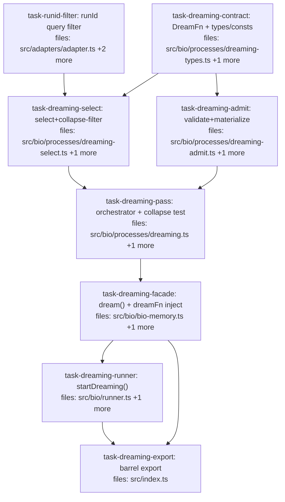

## Context

Implements **wave 2 — Dreaming** per `docs/superpowers/specs/2026-05-26-bio-layer-wave2-dreaming-design.md`. An async `dream(episode)` pass on the wave-1 append-only gateway: **select** (gather episode claims by runId → collapse filter → depth cap → token bound) → **dream** (injected model-free `DreamFn`) → **admit** (validate + materialize low-trust `derive` ops). Generates **insights/hypotheses only** (no summaries — that's the deferred Consolidation).

**Decomposition.** The dream pass is split by its real read/write seam (the split the whole design rests on): `dreaming-select.ts` (read-side, collapse-safety) and `dreaming-admit.ts` (write-side, materialization), sharing a `dreaming-types.ts` contract module, joined by a `dreaming.ts` orchestrator that hosts the **collapse property test** (the wave-2 centerpiece). This diverges from the spec's single-module sketch deliberately — for SoC, parallelism, and reviewability.

**Out of scope (per spec §13):** Consolidation; the pluggable admission gate; exact replay of dreams; a dedicated model-version provenance field; and the **bio↔substrate write-path reconciliation** (routing the bio layer through `Promoter`) — to be brainstormed after this ships.

**Substrate prerequisite:** Dreaming selects episode claims by `provenance.runId`, but `ExecutionPlan` has no runId filter today — `task-runid-filter` adds one (additive/optional, so no consumer breaks) before the select stage can use it.

## Tasks

## Task: runId query filter

```yaml
id: task-runid-filter
depends_on: []
files:
  - src/adapters/adapter.ts
  - src/adapters/sqlite.ts
  - src/adapters/sqlite.test.ts
status: pending
```

Add an optional `runIds` filter to the query plan so claims can be fetched by their `provenance.runId` efficiently (indexed), not by an O(corpus) in-memory scan. Additive and optional — existing consumers of `ExecutionPlan` are unaffected.

## Implementation

```typescript
// src/adapters/adapter.ts — add an optional field to ExecutionPlan (others unchanged)
export interface ExecutionPlan {
  corpusId: string;
  subject?: string;
  key?: string;
  status?: string[];
  scopeHash?: string;
  recordedAtMost?: number;
  runIds?: string[];   // NEW: match claims whose provenance.runId ∈ this set
}
```

```typescript
// src/adapters/sqlite.test.ts
import { createSqliteAdapter } from "./sqlite.js";

it("query filters by runIds (matches provenance.runId membership)", () => {
  const a = createSqliteAdapter();
  // insert two claims with provenance.runId "r1" and "r2"; query { runIds: ["r1"] }
  // returns only the r1 claim.
  expect(typeof a.query).toBe("function");
});
```

## Acceptance criteria

- `ExecutionPlan` gains an optional `runIds?: string[]`; omitting it preserves current behavior exactly (regression: existing adapter tests still pass).
- `query({ corpusId, runIds })` returns only claims whose `provenance.runId` is in `runIds`; empty/absent `runIds` means no runId constraint.
- The filter is backed by an indexed lookup (e.g. a `run_id` column populated from `provenance.runId` on insert, with an index) rather than scanning+JSON-parsing every row.
- Combines correctly with other filters (e.g. `runIds` + `status`).

Test file: `src/adapters/sqlite.test.ts`.

## Task: shared dreaming contract

```yaml
id: task-dreaming-contract
depends_on: []
files:
  - src/bio/processes/dreaming-types.ts
  - src/bio/processes/dreaming-types.test.ts
status: pending
```

The shared contract for Dreaming: the injected `DreamFn` port, the structured I/O types, and the bio-owned constants/helpers (`DREAM_WORKFLOW`, `MAX_DREAM_DEPTH`, `DREAM_PRIOR`, depth tag read/write, unvalidated-dream predicate) that `select` and `admit` both consume. Per spec §4/§5/§6.

## Implementation

```typescript
// src/bio/processes/dreaming-types.ts
import type { Claim } from "../../core/claim.js";
import type { ClaimId } from "../../core/ids.js";
import type { Key } from "../../core/key.js";
import type { Value } from "../../core/value.js";
import type { Scope } from "../../core/scope.js";
import type { Episode } from "../types.js";

export const DREAM_WORKFLOW = "dream";
export const MAX_DREAM_DEPTH = 3;
export const DREAM_PRIOR = { alpha: 1, beta: 3 };          // mean 0.25 — clearly subordinate

export type DreamFn = (input: DreamInput) => Promise<ProposedInsight[]>;
export interface DreamInput { episode: Episode; claims: Claim[]; maxInsights?: number; }
export interface ProposedInsight { key: Key; value: Value; scope?: Scope; cites: ClaimId[]; rationale?: string; }
export interface DreamReport { proposed: number; admitted: number; dropped: { key?: string; reason: string }[]; errors: string[]; }

export const depthTag = (n: number): string => `dream-depth:${n}`;
export function depthOf(claim: Claim): number {
  const t = claim.tags.find((x) => x.startsWith("dream-depth:"));
  return t ? Number(t.slice("dream-depth:".length)) : 0;   // non-dream claims = depth 0
}
export const isUnvalidatedDream = (c: Claim): boolean =>
  c.provenance.workflow === DREAM_WORKFLOW && c.status === "candidate";
```

```typescript
// src/bio/processes/dreaming-types.test.ts
import { depthTag, depthOf, isUnvalidatedDream } from "./dreaming-types.js";

it("depthOf round-trips depthTag and defaults to 0 for non-dream claims", () => {
  expect(depthOf({ tags: [depthTag(2)] } as any)).toBe(2);
  expect(depthOf({ tags: [] } as any)).toBe(0);
});
```

## Acceptance criteria

- Exports `DreamFn`, `DreamInput`, `ProposedInsight`, `DreamReport`, `DREAM_WORKFLOW`, `MAX_DREAM_DEPTH`, `DREAM_PRIOR`.
- `depthOf(depthTag(n))` round-trips `n`; a claim with no depth tag is depth `0`.
- `isUnvalidatedDream` is `true` iff `provenance.workflow === "dream"` AND `status === "candidate"` (validated/provisional dreams → false; non-dreams → false).
- `DREAM_PRIOR` is a low Beta with mean 0.25 (`alpha:1, beta:3`).

Test file: `src/bio/processes/dreaming-types.test.ts`.

## Task: select stage (collapse-safe input)

```yaml
id: task-dreaming-select
depends_on: [task-dreaming-contract, task-runid-filter]
files:
  - src/bio/processes/dreaming-select.ts
  - src/bio/processes/dreaming-select.test.ts
status: pending
```

Read-side, safety-critical: build the collapse-safe, bounded input set bio hands the model. Gather the episode's produced claims by runId, drop unvalidated dreams (primary collapse guard), drop over-depth claims (backstop), and token-bound to top-N. Per spec §5.

## Implementation

```typescript
// src/bio/processes/dreaming-select.ts
import type { Claim } from "../../core/claim.js";
import type { Episode, BioQuery } from "../types.js";
import { MAX_DREAM_DEPTH, depthOf, isUnvalidatedDream } from "./dreaming-types.js";

export interface SelectOpts { corpusId?: string; maxInputClaims?: number; }

export function selectDreamInput(
  read: (q: BioQuery) => Claim[],
  episode: Episode,
  opts: SelectOpts = {}
): Claim[] {
  if (episode.runIds.length === 0) return [];
  const pool = read({ corpusId: opts.corpusId ?? "bio", runIds: episode.runIds });
  const eligible = pool
    .filter((c) => !isUnvalidatedDream(c))          // collapse filter (primary)
    .filter((c) => depthOf(c) < MAX_DREAM_DEPTH);   // depth cap (backstop)
  const ranked = [...eligible].sort(
    (a, b) => b.recorded - a.recorded ||
      (b.confidence.raw ?? 0) - (a.confidence.raw ?? 0)
  );
  return ranked.slice(0, opts.maxInputClaims ?? 200);
}
```

```typescript
// src/bio/processes/dreaming-select.test.ts
import { selectDreamInput } from "./dreaming-select.js";

it("excludes unvalidated dreams from the dreamable set", () => {
  const candidateDream = { id: "d1", recorded: 2, tags: [], status: "candidate",
    provenance: { workflow: "dream" }, confidence: { raw: 0.9 } } as any;
  const grounded = { id: "g1", recorded: 1, tags: [], status: "validated",
    provenance: { workflow: "extract" }, confidence: { raw: 0.9 } } as any;
  const read = () => [candidateDream, grounded];
  const out = selectDreamInput(read, { id: "ep", runIds: ["r1"], startedAt: 0 } as any);
  expect(out.map((c) => c.id)).toEqual(["g1"]);
});
```

## Acceptance criteria

- Queries with `runIds: episode.runIds`; an episode with no runIds returns `[]` (no read).
- **Unvalidated dreams** (`isUnvalidatedDream`) are excluded; grounded and validated claims (incl. validated dreams) pass.
- Claims with `depthOf >= MAX_DREAM_DEPTH` are excluded.
- Result is bounded to `maxInputClaims` (default 200), ranked by recency then confidence; never mutates the input pool.

Test file: `src/bio/processes/dreaming-select.test.ts`.

## Task: admit stage

```yaml
id: task-dreaming-admit
depends_on: [task-dreaming-contract]
files:
  - src/bio/processes/dreaming-admit.ts
  - src/bio/processes/dreaming-admit.test.ts
status: pending
```

Write-side: turn validated `ProposedInsight`s into marked, low-trust `derive` AppendOps. Validate `cites ⊆ selected` and the key; compute depth; build a `candidate` / `source:"llm"` / `workflow:"dream"` claim with `DREAM_PRIOR`, `derivedFrom` provenance, evidence claim-refs, and a depth tag; `validateScope` if a schema is supplied. Per spec §6.

## Implementation

```typescript
// src/bio/processes/dreaming-admit.ts
import type { Claim, CandidateClaim } from "../../core/claim.js";
import { subjectOf } from "../../core/key.js";
import { validateScope, type ClaimSchema } from "../../catalog/schema.js";
import type { AppendOp } from "../types.js";
import { DREAM_WORKFLOW, DREAM_PRIOR, depthOf, depthTag, type ProposedInsight } from "./dreaming-types.js";

export interface AdmitResult { ops: AppendOp[]; dropped: { key?: string; reason: string }[]; }

export function admitInsights(
  insights: ProposedInsight[], selected: Claim[], nowMs: number, modelVersion: string, schema?: ClaimSchema
): AdmitResult {
  const byId = new Map(selected.map((c) => [String(c.id), c]));
  const ops: AppendOp[] = []; const dropped: AdmitResult["dropped"] = [];
  for (const ins of insights) {
    if (ins.cites.length === 0 || !ins.cites.every((id) => byId.has(String(id)))) {
      dropped.push({ key: ins.key, reason: "cites not in selected set" }); continue;
    }
    let subject: string;
    try { subject = subjectOf(ins.key); } catch { dropped.push({ key: ins.key, reason: "invalid key" }); continue; }
    const rep = byId.get(String(ins.cites[0]))!;                 // carry profile/workspace/valid from a cited input
    const depth = Math.max(...ins.cites.map((id) => depthOf(byId.get(String(id))!))) + 1;
    const claim: CandidateClaim = {
      profile: rep.profile, workspace: rep.workspace, subject, key: ins.key, scope: ins.scope ?? {},
      value: ins.value,
      confidence: { distribution: "beta", parameters: { ...DREAM_PRIOR },
        raw: DREAM_PRIOR.alpha / (DREAM_PRIOR.alpha + DREAM_PRIOR.beta) },
      valid: rep.valid, status: "candidate", source: "llm",
      provenance: { workflow: DREAM_WORKFLOW, derivedFrom: {
        queryExpression: "dream", corpusState: nowMs, combinationRule: `dream@${modelVersion}`,
        inputClaims: ins.cites, similarityVersions: {}, embeddingModelVersions: {}, evaluationClock: nowMs } },
      evidence: ins.cites.map((claimId) => ({ kind: "claim" as const, claimId })),
      tags: [depthTag(depth)], schema: rep.schema,
    };
    if (schema) { try { validateScope(claim.scope, schema); } catch (e) { dropped.push({ key: ins.key, reason: `scope: ${e}` }); continue; } }
    ops.push({ kind: "derive", claim });
  }
  return { ops, dropped };
}
```

```typescript
// src/bio/processes/dreaming-admit.test.ts
import { admitInsights } from "./dreaming-admit.js";

it("drops an insight that cites an id not in the selected set", () => {
  const selected = [{ id: "g1", profile: "p", workspace: "w", valid: { from: 0, to: Infinity },
    tags: [], schema: "1.0" } as any];
  const res = admitInsights([{ key: "lesson.x", value: "v", cites: ["nope" as any] }], selected, 1, "m1");
  expect(res.ops).toHaveLength(0);
  expect(res.dropped[0].reason).toMatch(/cites/);
});
```

## Acceptance criteria

- Insight with empty `cites` or any cite not in `selected` is dropped with a reason; valid insight yields exactly one `derive` op.
- Admitted claim is `status:"candidate"`, `source:"llm"`, `provenance.workflow:"dream"`, `confidence` = `DREAM_PRIOR` Beta, with `derivedFrom.inputClaims === cites`, `combinationRule === "dream@<modelVersion>"`, evidence claim-refs to the cites, and a `dream-depth:N` tag where `N = max(cited depth)+1`.
- An insight whose `key` fails `subjectOf` is dropped (invalid key).
- When a `ClaimSchema` is supplied, an insight whose scope fails `validateScope` is dropped; with no schema, scope validation is skipped.

Test file: `src/bio/processes/dreaming-admit.test.ts`.

## Task: dream pass orchestrator

```yaml
id: task-dreaming-pass
depends_on: [task-dreaming-select, task-dreaming-admit]
files:
  - src/bio/processes/dreaming.ts
  - src/bio/processes/dreaming.test.ts
status: pending
```

The async orchestrator: select → await `DreamFn` → admit → `gateway.apply`, fail-safe and single-flight per episode, returning a `DreamReport`. Hosts the wave-2 centerpiece: the collapse property test. Per spec §3/§7/§9.

## Implementation

```typescript
// src/bio/processes/dreaming.ts
import type { MnemeGateway } from "../gateway.js";
import type { Episode } from "../types.js";
import type { ClaimSchema } from "../../catalog/schema.js";
import { now } from "../../core/time.js";
import { selectDreamInput } from "./dreaming-select.js";
import { admitInsights } from "./dreaming-admit.js";
import type { DreamFn, DreamReport } from "./dreaming-types.js";

export interface DreamPassOpts { schema?: ClaimSchema; corpusId?: string; maxInputClaims?: number; }

export function createDreamPass(gateway: MnemeGateway, dreamFn: DreamFn, opts: DreamPassOpts = {}) {
  const running = new Set<string>();
  return {
    async dream(episode: Episode, run: { modelVersion: string; maxInsights?: number }): Promise<DreamReport> {
      if (running.has(episode.id))
        return { proposed: 0, admitted: 0, dropped: [], errors: ["dream already running for episode (single-flight)"] };
      running.add(episode.id);
      try {
        const selected = selectDreamInput(gateway.read, episode, opts);
        if (selected.length === 0) return { proposed: 0, admitted: 0, dropped: [], errors: [] };
        let insights;
        try { insights = await dreamFn({ episode, claims: selected, maxInsights: run.maxInsights }); }
        catch (e) { return { proposed: 0, admitted: 0, dropped: [], errors: [String(e)] }; }
        const { ops, dropped } = admitInsights(insights, selected, now(), run.modelVersion, opts.schema);
        const res = gateway.apply(ops, (_op, i) => `dream:${episode.id}:${i}`);
        return { proposed: insights.length, admitted: res.applied, dropped, errors: [] };
      } finally { running.delete(episode.id); }
    },
  };
}
```

```typescript
// src/bio/processes/dreaming.test.ts
import { createDreamPass } from "./dreaming.js";

it("a throwing DreamFn is fail-safe: errors reported, nothing applied", async () => {
  const gateway = { read: () => [{ id: "g1", recorded: 1, tags: [], status: "validated",
    provenance: { workflow: "x" }, confidence: { raw: 0.9 }, profile: "p", workspace: "w",
    valid: { from: 0, to: Infinity }, schema: "1.0" }], apply: () => ({ applied: 0, skipped: 0 }) } as any;
  const pass = createDreamPass(gateway, async () => { throw new Error("model down"); });
  const report = await pass.dream({ id: "ep", runIds: ["r1"], startedAt: 0 } as any, { modelVersion: "m1" });
  expect(report.errors).toHaveLength(1);
  expect(report.admitted).toBe(0);
});
```

## Acceptance criteria

- Happy path: selects, calls `DreamFn` once, admits returned insights via one `gateway.apply`, returns `{ proposed, admitted, dropped, errors:[] }`.
- Empty selected set → returns immediately without calling `DreamFn`.
- A throwing/rejecting `DreamFn` → `errors` non-empty, nothing applied (fail-safe).
- Single-flight per episode: a concurrent `dream(sameEpisode)` returns immediately with an error and applies nothing.
- **Collapse property test (centerpiece):** over repeated passes whose `DreamFn` tries to cite prior dreams, assert (a) no admitted claim's `dream-depth` exceeds `MAX_DREAM_DEPTH`, and (b) an unvalidated dream is never present in the set handed to `DreamFn` — the feedback loop is provably bounded.

Test file: `src/bio/processes/dreaming.test.ts`.

## Task: facade dream entry point

```yaml
id: task-dreaming-facade
depends_on: [task-dreaming-pass]
files:
  - src/bio/bio-memory.ts
  - src/bio/bio-memory.test.ts
status: pending
```

Wire Dreaming into `BioMemory`: accept an optional `dreamFn` (and dream opts) at construction, and add `async dream(episode, { modelVersion })` delegating to the dream pass. Additive to the wave-1 facade; absent `dreamFn` makes `dream()` a no-op error. Per spec §3/§11.

## Implementation

```typescript
// src/bio/bio-memory.ts — additive wiring (existing wave-1 surface unchanged)
import { createDreamPass, type DreamPassOpts } from "./processes/dreaming.js";
import type { DreamFn, DreamReport } from "./processes/dreaming-types.js";
// inside createBioMemory(opts): accept opts.dreamFn?: DreamFn and opts.dream?: DreamPassOpts
//   const dreamPass = opts.dreamFn ? createDreamPass(gateway, opts.dreamFn, opts.dream) : undefined;
//   async dream(episode, run): DreamReport {
//     const ep = episodes.get(episode); if (!ep) return { proposed:0, admitted:0, dropped:[], errors:["unknown episode"] };
//     if (!dreamPass) return { proposed:0, admitted:0, dropped:[], errors:["no dreamFn configured"] };
//     return dreamPass.dream(ep, run);
//   }
```

```typescript
// src/bio/bio-memory.test.ts
import { createBioMemory } from "./bio-memory.js";

it("dream() with no dreamFn configured returns a clear error and applies nothing", async () => {
  const bio = createBioMemory();
  const ep = bio.openEpisode("r1");
  const report = await bio.dream(ep.id, { modelVersion: "m1" });
  expect(report.errors).toContain("no dreamFn configured");
});
```

## Acceptance criteria

- `createBioMemory({ dreamFn })` accepts an optional `DreamFn` (+ optional dream opts) without changing any existing wave-1 method signatures.
- `dream(episodeId, { modelVersion })` resolves the open episode and delegates to the dream pass; unknown episode → error report; no `dreamFn` configured → error report; neither applies anything.
- With a fake `dreamFn`, `dream()` admits insights end-to-end against the default in-memory gateway.

Test file: `src/bio/bio-memory.test.ts`.

## Task: runner dreaming trigger

```yaml
id: task-dreaming-runner
depends_on: [task-dreaming-facade]
files:
  - src/bio/runner.ts
  - src/bio/runner.test.ts
status: pending
```

Add an optional `startDreaming({ intervalMs })` to the runner that periodically invokes `memory.dream(episode, …)` for sleep-time scheduling. Logic-less (scheduling only), mirroring the wave-1 runner; the library works without it. Per spec §3/§11.

## Implementation

```typescript
// src/bio/runner.ts — additive (existing runner surface unchanged)
import type { DreamReport } from "./processes/dreaming-types.js";
import type { EpisodeId } from "./types.js";
// interface DreamDriver { dream(episode: EpisodeId, run: { modelVersion: string }): Promise<DreamReport>; }
// add to createRunner(...): a separate startDreaming(opts: { intervalMs?: number; episode: EpisodeId; modelVersion: string }):
//   if (opts.intervalMs && opts.intervalMs > 0) dreamTimer = setInterval(() => void memory.dream(opts.episode, { modelVersion: opts.modelVersion }), opts.intervalMs);
//   stop() also clears dreamTimer.
```

```typescript
// src/bio/runner.test.ts
import { vi } from "vitest";
import { createRunner } from "./runner.js";

it("startDreaming schedules periodic memory.dream; stop() halts it", () => {
  vi.useFakeTimers();
  try {
    let calls = 0;
    const memory = {
      runCycle: () => ({ opsApplied: 0, claimsSuperseded: 0, errors: [] }),
      dream: async () => { calls++; return { proposed: 0, admitted: 0, dropped: [], errors: [] }; },
    } as any;
    const r = createRunner(memory, "ep-1");
    r.startDreaming({ intervalMs: 100, episode: "ep-1", modelVersion: "m1" });
    vi.advanceTimersByTime(250);   // fires at 100 and 200
    r.stop();
    vi.advanceTimersByTime(250);   // no further fires after stop
    expect(calls).toBe(2);
  } finally { vi.useRealTimers(); }
});
```

## Acceptance criteria

- `startDreaming({ intervalMs, episode, modelVersion })` schedules periodic `memory.dream(...)`; no/zero interval schedules nothing.
- `stop()` clears the dreaming timer too (no further dream calls after stop); double-start does not leak a timer (consistent with the wave-1 fix).
- The runner contains no dreaming logic — it only schedules the delegated call.

Test file: `src/bio/runner.test.ts`.

## Task: barrel export

```yaml
id: task-dreaming-export
depends_on: [task-dreaming-facade, task-dreaming-runner]
files:
  - src/index.ts
status: pending
is_wiring_task: true
```

Re-export the Dreaming public surface from the package barrel so consumers can implement a `DreamFn` and drive dreaming from the package root.

## Acceptance criteria

- `src/index.ts` re-exports the dreaming types (`DreamFn`, `DreamInput`, `ProposedInsight`, `DreamReport`) via `export type`, and any dreaming value surface (e.g. `DREAM_WORKFLOW`/`MAX_DREAM_DEPTH` if intended public).
- No pre-existing exports are removed or altered; no name collisions (mirror the wave-1 `BioDecayPolicy` aliasing discipline if any name clashes).
- `tsc --noEmit` passes and the full suite stays green after this task.

Test file: `src/index.test.ts` (not in scope to create; verify via `tsc --noEmit` + existing suite).
