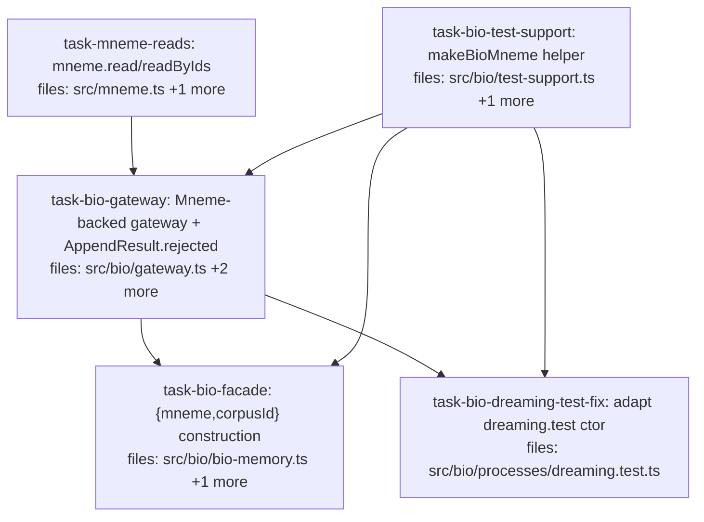

## Context

Implements the bio half of the write-path reconciliation per `docs/superpowers/specs/2026-05-26-bio-write-routing-design.md`: rewrite `createMnemeGateway` to be Mneme-backed (writes → `Mneme.commit/supersede/promote`), preserving the `MnemeGateway` interface so the bio stack above it is untouched.

**Cascade findings (from a pre-plan grep) that adjust the spec's stated 5-file blast radius:**
- The new construction removes the zero-config `createBioMemory()`/`createMnemeGateway()` forms (a `Mneme`+`corpusId` is now required). This breaks `processes/dreaming.test.ts` (builds a real gateway) in addition to the in-scope facade/gateway tests → `task-bio-dreaming-test-fix`.
- Every Mneme-backed test needs `createMneme` + `createCorpus` + a permissive schema. **DRY:** that setup lives in one shared helper, `src/bio/test-support.ts` (`makeBioMneme()`), owned by `task-bio-test-support` and reused by all three test files.
- `AppendResult.rejected` is made **optional** (not required as the spec wrote): this keeps `cycle.test.ts`'s stub gateways (`return { applied, skipped }`) valid with no change — truly additive, no cascade into the cycle/dream test stubs.

Production files above the gateway interface (`cycle.ts`, `dreaming.ts`, `evidence-update.ts`, `signals.ts`, `episode.ts`) are unchanged — the seam holds.

## Tasks

## Task: mneme read methods

```yaml
id: task-mneme-reads
depends_on: []
files:
  - src/mneme.ts
  - src/mneme.test.ts
status: pending
```

Add thin, existence-checked `read`/`readByIds` to `Mneme` so the Mneme-backed gateway can read via `ExecutionPlan` (incl. the `runIds` filter) without touching the adapter directly. Per spec §4.

## Implementation

```typescript
// src/mneme.ts — additive (commit/supersede/promote/createCorpus/query unchanged)
interface Mneme {
  read(corpusId: string, plan: ExecutionPlan): Claim[];
  readByIds(corpusId: string, ids: ClaimId[]): Claim[];
}
// createMneme return:
read(corpusId, plan) { catalog.getCorpus(corpusId); return adapter.query({ ...plan, corpusId }); },
readByIds(corpusId, ids) { catalog.getCorpus(corpusId); return ids.map(id => adapter.getClaim(id)).filter((c): c is Claim => c !== undefined); },
```

```typescript
// src/mneme.test.ts
it("read returns claims by ExecutionPlan and readByIds by id; unknown corpus throws", () => {
  // createMneme + createCorpus + commit; read({...}) returns it; readByIds([id]) returns it;
  // read("nope", {}) throws.
});
```

## Acceptance criteria

- `Mneme.read(corpusId, plan)` delegates to `adapter.query` (stamping `corpusId`); returns `Claim[]`.
- `Mneme.readByIds(corpusId, ids)` returns the claims for those ids (missing omitted).
- Both call `catalog.getCorpus(corpusId)` first → unknown corpus throws (like `commit`).
- Existing `commit`/`query`/`createCorpus`/`supersede`/`promote` unchanged.

Test file: `src/mneme.test.ts`.

## Task: bio test-support helper

```yaml
id: task-bio-test-support
depends_on: []
files:
  - src/bio/test-support.ts
  - src/bio/test-support.test.ts
status: pending
```

A single shared helper that builds a `Mneme` with a permissive registered corpus, so the gateway/facade/dreaming tests construct their Mneme-backed dependencies one DRY way instead of duplicating `createMneme`+`createCorpus`+schema setup. Owns the construction the cascade forces.

## Implementation

```typescript
// src/bio/test-support.ts
import { createMneme, type Mneme } from "../mneme.js";
import { createSqliteAdapter } from "../adapters/sqlite.js";

// Returns a Mneme with one permissive corpus registered, plus its corpusId — the
// canonical way bio tests obtain a Mneme-backed gateway/facade after write-routing.
export function makeBioMneme(): { mneme: Mneme; corpusId: string } {
  const mneme = createMneme({ adapter: createSqliteAdapter(), availableTiers: ["core"] });
  const corpusId = "bio-test";
  mneme.createCorpus({
    id: corpusId,
    // permissive schema: accept the subjects/keys/scope fields bio tests use; core tier only.
    /* ...minimal CorpusDef with a permissive ClaimSchema + default contradiction policy... */
  } as any);
  return { mneme, corpusId };
}
```

```typescript
// src/bio/test-support.test.ts
import { makeBioMneme } from "./test-support.js";

it("makeBioMneme yields a Mneme that can commit to its corpus", () => {
  const { mneme, corpusId } = makeBioMneme();
  const res = mneme.commit(corpusId, /* a minimal valid CandidateClaim */ {} as any, { writer: "t" });
  expect(res.status).toBe("committed");
});
```

## Acceptance criteria

- `makeBioMneme()` returns `{ mneme, corpusId }` where `mneme` has a registered corpus `corpusId` with a permissive schema (accepts the claims bio tests write) and `core` tier.
- A `commit`/`supersede`/`promote` against `corpusId` succeeds (smoke-tested).
- The helper is the single source of Mneme-backed test construction (no `createMneme`/`createCorpus` duplicated in the consuming test files).

Test file: `src/bio/test-support.test.ts`.

## Task: Mneme-backed gateway

```yaml
id: task-bio-gateway
depends_on: [task-mneme-reads, task-bio-test-support]
files:
  - src/bio/types.ts
  - src/bio/gateway.ts
  - src/bio/gateway.test.ts
status: pending
```

Rewrite `createMnemeGateway` to be Mneme-backed (`createMnemeGateway(mneme, corpusId)`), mapping `AppendOp` → `mneme.commit/supersede/promote`; remove `materialize` + the gateway's own idempotency; add an optional `rejected` channel to `AppendResult`. Interface unchanged. Per spec §3/§5/§6.

## Implementation

```typescript
// src/bio/types.ts — additive, OPTIONAL (keeps cycle.test.ts stubs valid)
export interface AppendResult { applied: number; skipped: number; rejected?: { key: string; status: string }[]; }
```

```typescript
// src/bio/gateway.ts
import type { Mneme } from "../mneme.js";
import type { Claim } from "../core/claim.js";
import type { ClaimId } from "../core/ids.js";
import type { AppendOp, AppendResult, BioQuery } from "./types.js";

const BIO_WRITER = "bio";
export interface MnemeGateway { read(q: BioQuery): Claim[]; readByIds(ids: ClaimId[]): Claim[];
  apply(ops: AppendOp[], opKey: (op: AppendOp, i: number) => string): AppendResult; }

export function createMnemeGateway(mneme: Mneme, corpusId: string): MnemeGateway {
  const applied = (s: string) => s === "committed" || s === "superseded" || s === "promoted";
  return {
    read: (q) => mneme.read(corpusId, q),
    readByIds: (ids) => mneme.readByIds(corpusId, ids),
    apply(ops, opKey) {
      let a = 0, s = 0; const rejected: { key: string; status: string }[] = [];
      for (let i = 0; i < ops.length; i++) {
        const key = opKey(ops[i], i), op = ops[i];
        const r = op.kind === "derive"   ? mneme.commit(corpusId, op.claim, { policy: { kind: "always_accept" }, writer: BIO_WRITER, idempotencyKey: key })
                : op.kind === "supersede"? mneme.supersede(corpusId, op.deprecate, op.with, { writer: BIO_WRITER, idempotencyKey: key })
                :                          mneme.promote(corpusId, op.target, op.to, { writer: BIO_WRITER, reason: op.reason, idempotencyKey: key });
        applied(r.status) ? a++ : r.status === "duplicate" ? s++ : rejected.push({ key, status: r.status });
      }
      return { applied: a, skipped: s, rejected };
    },
  };
}
```

```typescript
// src/bio/gateway.test.ts
import { createMnemeGateway } from "./gateway.js";
import { makeBioMneme } from "./test-support.js";

it("derive routes through mneme.commit and lands a claim in the corpus", () => {
  const { mneme, corpusId } = makeBioMneme();
  const gw = createMnemeGateway(mneme, corpusId);
  const res = gw.apply([{ kind: "derive", claim: /* valid candidate */ {} as any }], () => "k1");
  expect(res.applied).toBe(1);
});
```

## Acceptance criteria

- `createMnemeGateway(mneme, corpusId)` returns the unchanged `MnemeGateway` shape; no `update`/`delete`; no `adapter`/`materialize`/own-idempotency.
- `read`/`readByIds` delegate to `mneme.read`/`readByIds`.
- `apply` maps `derive`→`commit(always_accept)`, `supersede`→`supersede`, `promote`→`promote`, passing `opKey` as `idempotencyKey` and `BIO_WRITER`; aggregates `applied` (committed/superseded/promoted), `skipped` (duplicate), `rejected[]` (rejected/not_found/invalid_transition).
- `AppendResult.rejected` is optional; existing consumers reading only `applied`/`skipped` are unaffected.
- Mneme-backed tests (via `makeBioMneme`) verify: derive→committed claim, supersede→old deprecated + new replacement, promote→status change, `opKey` idempotency dedup (`skipped`), `read`/`readByIds` round-trip, and an invalid-scope claim surfaces as a thrown error.

Test file: `src/bio/gateway.test.ts`.

## Task: bio facade construction

```yaml
id: task-bio-facade
depends_on: [task-bio-gateway, task-bio-test-support]
files:
  - src/bio/bio-memory.ts
  - src/bio/bio-memory.test.ts
status: pending
```

Shift `createBioMemory` construction to `{ mneme, corpusId, dreamFn?, dream? }`, building the Mneme-backed gateway internally. The facade's `recall`/`record*`/`runCycle`/`dream` logic is unchanged. Per spec §7.

## Implementation

```typescript
// src/bio/bio-memory.ts — construction change only
import { createMnemeGateway } from "./gateway.js";
import type { Mneme } from "../mneme.js";
// interface BioMemoryOpts { mneme: Mneme; corpusId: string; dreamFn?: DreamFn; dream?: DreamPassOpts }
export function createBioMemory(opts: BioMemoryOpts) {
  const gateway = createMnemeGateway(opts.mneme, opts.corpusId);
  // ...rest UNCHANGED: episodes, buffer, cycle(gateway,[evidenceUpdate()]), dreamPass, recall/record*/runCycle/dream...
}
```

```typescript
// src/bio/bio-memory.test.ts
import { createBioMemory } from "./bio-memory.js";
import { makeBioMneme } from "./test-support.js";

it("recordOutcome fires an inline cycle scoped to the episode (Mneme-backed)", async () => {
  const { mneme, corpusId } = makeBioMneme();
  const bio = createBioMemory({ mneme, corpusId });
  const ep = bio.openEpisode();
  expect(bio.recordOutcome(ep.id, "success").errors).toHaveLength(0);
});
```

## Acceptance criteria

- `createBioMemory({ mneme, corpusId, dreamFn?, dream? })` builds the gateway via `createMnemeGateway(mneme, corpusId)`; no bare-adapter/zero-arg form remains.
- All existing facade behaviors (`openEpisode`/`closeEpisode`/`recall`/`recordUsage`/`recordOutcome`/`runCycle`/`dream`, incl. the no-`dreamFn` and unknown-episode error reports) still hold, re-verified against a `makeBioMneme()` Mneme.
- `bio-memory.test.ts` uses `makeBioMneme` (no duplicated `createMneme`/`createCorpus`).

Test file: `src/bio/bio-memory.test.ts`.

## Task: adapt dreaming test construction

```yaml
id: task-bio-dreaming-test-fix
depends_on: [task-bio-gateway, task-bio-test-support]
files:
  - src/bio/processes/dreaming.test.ts
status: pending
is_wiring_task: true
```

Cascade fix: `dreaming.test.ts`'s collapse property test builds a real gateway via the old `createMnemeGateway()` signature, which no longer exists. Update its construction to the Mneme-backed form via `makeBioMneme()`. The dream-pass production code and `createDreamPass(gateway, dreamFn)` are unchanged.

## Acceptance criteria

- Any `createMnemeGateway(...)`/`createBioMemory(...)` construction in `dreaming.test.ts` is updated to use `makeBioMneme()` → `createMnemeGateway(mneme, corpusId)` (and `{ mneme, corpusId }` for any `createBioMemory`).
- The collapse property test still genuinely exercises depth accumulation + no-unvalidated-reseed against the Mneme-backed gateway (its assertions unchanged in intent).
- The full `dreaming.test.ts` suite passes; no production `dreaming.ts`/`select`/`admit` changes.

Test file: `src/bio/processes/dreaming.test.ts`.
