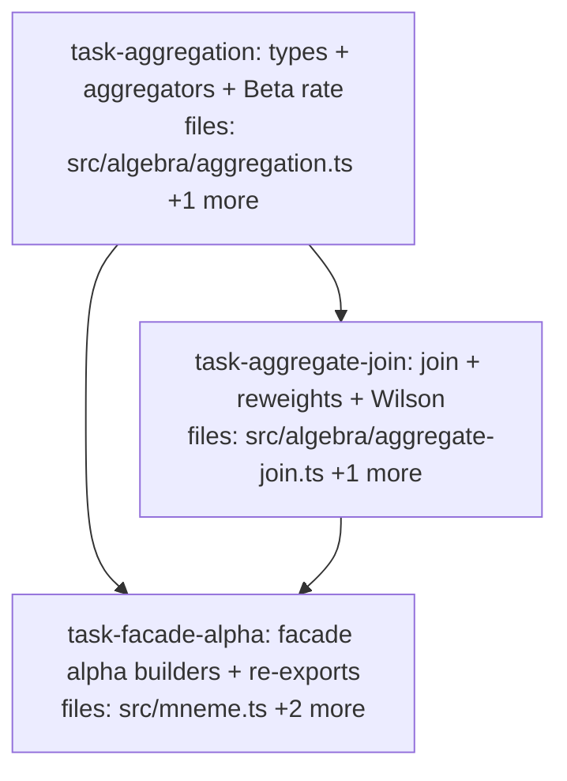

## Context

Implements **v1 sub-milestone 4 (last of the original four) — aggregation α + Beta-typed rate** per the
approved design at `docs/superpowers/specs/2026-05-26-mneme-v1-aggregation-design.md`, the §4.13 slice of
the canonical spec `mneme-spec-v0.2-consolidated.md`.

**Goal:** the concrete §4.13 `[C]` family — `AggregateResult` (a second terminal type alongside
`ComposedContext`), the α operators (count / group-by / sum-avg-min-max / Beta-typed rate), and the
`α_join_aggregate` bridge with Wilson-lower-bound reweighting. Core `[C]` tier.

**Builds on** the green v1 tree (485 tests). Additive only — no shipped-symbol changes. Reused
(pre-existing): `Corpus`/`RankedCorpus`/`ScoredClaim`/`corpusOf` (`src/algebra/types.ts`), `Claim`
(`src/core/claim.ts`), `DEFAULT_PRIOR`/`Confidence`/`pointEstimate` (`src/core/confidence.ts`), `getPath`
(`src/algebra/value-predicate.ts`), `Predicate`/`matches` (`src/algebra/predicate.ts`),
`Stage`/`evaluate`/`liftOp` (`src/algebra/expression.ts`), the façade builders + `query()` (`src/mneme.ts`),
the `index.ts` re-exports.

**Model fit:** the α aggregators are terminal stages `Corpus → AggregateResult` (like κ → `ComposedContext`);
`evaluate()` already returns the terminal stage's value, so no evaluator change is needed. `α_join_aggregate`
is a `RankedCorpus → RankedCorpus` stage that closes over a precomputed `AggregateResult`.

**DAG shape:** an inherent types → consumer → façade chain. `task-aggregation` (root) defines the types +
aggregators; `task-aggregate-join` consumes them for the bridge + Wilson; `task-facade-alpha` wires both
into the public surface. (Linear by nature — only 3 tasks.)

**Deferred (NOT this slice):** extension hooks (`α_custom`, `AggValue.custom`/`distribution(samples)`,
`reweight_custom`); aggregate→corpus conversion (§G); multi-level `α_groupBy` composition; configurable
Wilson confidence (fixed 95%, z=1.96).

## Tasks

## Task: aggregation types operators and Beta rate

```yaml
id: task-aggregation
depends_on: []
files:
  - src/algebra/aggregation.ts
  - src/algebra/aggregation.test.ts
status: pending
```

The §4.13 types and aggregators: `AggregateResult`/`GroupKey`/`AggValue`, a claim-path resolver, the simple
aggregators, `α_groupBy`, and the Beta-typed `α_rate`/`α_binary_rate` (pinned prior §0.3). Each aggregator
has a core `(Claim[]) => AggValue` form; the top-level α ops wrap it as an `AggregateResult`.

## Implementation

```typescript
// src/algebra/aggregation.ts
import type { Corpus } from "./types.js";
import type { Claim } from "../core/claim.js";
import { DEFAULT_PRIOR } from "../core/confidence.js";
import { getPath } from "./value-predicate.js";
import { matches, type Predicate } from "./predicate.js";

export type GroupKey = { kind: "scalar"; value: unknown } | { kind: "tuple"; values: unknown[] } | { kind: "none" };
export type AggValue =
  | { kind: "count"; n: number } | { kind: "sum"; value: number } | { kind: "avg"; value: number }
  | { kind: "min"; value: unknown } | { kind: "max"; value: unknown }
  | { kind: "rate"; beta: { alpha: number; beta: number } };
export interface AggregateResult { groups: Map<string, { key: GroupKey; value: AggValue }> }

// scope.<f> -> claim.scope[f]; value.<...> -> getPath(claim.value, rest); bare -> top-level claim field
export function claimPath(claim: Claim, path: string): unknown {
  if (path.startsWith("scope.")) return claim.scope[path.slice(6)];
  if (path === "value" ) return claim.value;
  if (path.startsWith("value.")) return getPath(claim.value, path.slice(6));
  return (claim as any)[path];
}

// core aggregators: (Claim[]) => AggValue
export const countCore = (claims: Claim[]): AggValue => ({ kind: "count", n: claims.length });
export const sumCore = (valuePath: string) => (claims: Claim[]): AggValue =>
  ({ kind: "sum", value: claims.reduce((t, c) => t + Number(claimPath(c, valuePath) ?? 0), 0) });
// avg/min/max analogous
export const rateCore = (numP: Predicate, denomP: Predicate) => (claims: Claim[]): AggValue => {
  const { W, a } = DEFAULT_PRIOR;
  const r = claims.filter((c) => matches(c, numP)).length;
  const s = claims.filter((c) => matches(c, denomP) && !matches(c, numP)).length;
  return { kind: "rate", beta: { alpha: r + a * W, beta: s + (1 - a) * W } };
};
// binaryRateCore(valuePath) = rateCore(value-path == true, value-path == true OR == false)

const wrapNone = (v: AggValue): AggregateResult => ({ groups: new Map([["__none__", { key: { kind: "none" }, value: v }]]) });
export const alphaCount = (c: Corpus): AggregateResult => wrapNone(countCore([...c.claims]));
export const alphaCountWhere = (p: Predicate) => (c: Corpus): AggregateResult =>
  wrapNone(countCore(c.claims.filter((cl) => matches(cl, p))));
// alphaSum/Avg/Min/Max, alphaRate, alphaBinaryRate similar (wrapNone(core(...)))
export const alphaGroupBy = (groupField: string, core: (claims: Claim[]) => AggValue) => (c: Corpus): AggregateResult => {
  const buckets = new Map<string, Claim[]>();
  for (const cl of c.claims) { const k = String(claimPath(cl, groupField)); (buckets.get(k) ?? buckets.set(k, []).get(k)!).push(cl); }
  const groups = new Map<string, { key: GroupKey; value: AggValue }>();
  for (const [k, claims] of buckets) groups.set(k, { key: { kind: "scalar", value: k }, value: core(claims) });
  return { groups };
};
```

```typescript
// src/algebra/aggregation.test.ts
import { alphaGroupBy, rateCore, alphaCount, alphaCountWhere } from "./aggregation.js";
import { corpusOf } from "./types.js";
const oc = (actionId: string, won: boolean) => ({ scope: { actionId }, value: { won }, subject: "action", key: "action.outcome" } as any);
it("groupBy + binary_rate emits a Beta(23,9) for 22 won / 8 lost", () => {
  const claims = [...Array(22)].map(() => oc("A", true)).concat([...Array(8)].map(() => oc("A", false)));
  const num = { op: "valueEqTrue" } as any; // implementer wires the real value-path predicate for value.won
  const res = alphaGroupBy("scope.actionId", rateCore(num, { op: "or", preds: [num, { op: "valueEqFalse" } as any] }))(corpusOf(claims));
  const g = res.groups.get("A")!.value;
  expect(g.kind).toBe("rate");
  if (g.kind === "rate") expect(g.beta).toEqual({ alpha: 23, beta: 9 });
});
```

## Acceptance criteria

- Types `AggregateResult`/`GroupKey`(scalar|tuple|none)/`AggValue`(count|sum|avg|min|max|rate) are exported; `AggValue.rate` carries `{ alpha, beta }`.
- `claimPath` resolves `scope.<field>` (from `claim.scope`), `value.<path>` (via `getPath(claim.value, …)`), and bare top-level claim fields.
- `α_count`/`α_count_where`/`α_sum`/`α_avg`/`α_min`/`α_max` produce the correct `AggValue` in a single `GroupKey.none` group; `α_count(σ_p(C)) = α_count_where<p>(C)` (the §4.13 law).
- `α_groupBy<group-field, core>` emits one group per distinct `claimPath` value, running the core aggregator over each group's claims.
- Beta rate: for 22 numerator-matches and 8 (denom∧¬num)-matches, `α_binary_rate`/`α_rate` emits `Beta(23, 9)` using `DEFAULT_PRIOR` (W=2, a=0.5; α=22+a·W, β=8+(1−a)·W); `α_rate`'s denominator excludes unresolved (only num∨false counted, never null/pending).

Test file: `src/algebra/aggregation.test.ts`.

## Task: aggregate join reweights and Wilson bound

```yaml
id: task-aggregate-join
depends_on: [task-aggregation]
files:
  - src/algebra/aggregate-join.ts
  - src/algebra/aggregate-join.test.ts
status: pending
```

The bridge back to ranking: `wilsonLowerBound`, the reweight functions, and `α_join_aggregate` — a
`RankedCorpus → RankedCorpus` stage that reweights each claim's score by its matching aggregate value and
re-sorts. Wilson penalizes small samples (the §4.13 marquee behavior).

## Implementation

```typescript
// src/algebra/aggregate-join.ts
import type { RankedCorpus } from "./types.js";
import { DEFAULT_PRIOR } from "../core/confidence.js";
import { claimPath, type AggregateResult, type AggValue } from "./aggregation.js";

type Beta = { alpha: number; beta: number };
const betaMean = (b: Beta) => b.alpha / (b.alpha + b.beta);

// recover raw counts from the prior-inclusive Beta, then Wilson score-interval lower bound (95%, z=1.96)
export function wilsonLowerBound(b: Beta, z = 1.96): number {
  const { W, a } = DEFAULT_PRIOR;
  const r = b.alpha - a * W;
  const s = b.beta - (1 - a) * W;
  const n = r + s;
  if (n <= 0) return 0;
  const p = r / n, z2 = z * z;
  const center = p + z2 / (2 * n);
  const margin = z * Math.sqrt((p * (1 - p) + z2 / (4 * n)) / n);
  return (center - margin) / (1 + z2 / n);
}

const aggNumber = (v: AggValue): number => {
  switch (v.kind) { case "count": return v.n; case "sum": case "avg": return v.value;
    case "rate": return betaMean(v.beta); default: return Number((v as any).value ?? 0); }
};
export type ReweightFn = (score: number, value: AggValue, allValues: AggValue[]) => number;
export const reweightMultiply: ReweightFn = (s, v) => s * aggNumber(v);
export const reweightMultiplyMean: ReweightFn = (s, v) => s * (v.kind === "rate" ? betaMean(v.beta) : aggNumber(v));
export const reweightWilsonFloor: ReweightFn = (s, v) => s * (v.kind === "rate" ? wilsonLowerBound(v.beta) : aggNumber(v));
export const reweightNormalize: ReweightFn = (s, v, all) => { const mx = Math.max(...all.map(aggNumber)); return mx === 0 ? s : aggNumber(v) / mx; };
export const reweightBoost = (factor: number): ReweightFn => (s, v) => s + aggNumber(v) * factor;

export const alphaJoinAggregate = (aggregate: AggregateResult, joinKey: string, reweight: ReweightFn) =>
  (rc: RankedCorpus): RankedCorpus => {
    const all = [...aggregate.groups.values()].map((g) => g.value);
    const scored = rc.scored.map((sc) => {
      const k = String(claimPath(sc.claim, joinKey));
      const hit = aggregate.groups.get(k);
      return hit ? { claim: sc.claim, score: reweight(sc.score, hit.value, all) } : sc; // unmatched: keep score
    });
    return { scored: [...scored].sort((x, y) => y.score - x.score) };
  };
```

```typescript
// src/algebra/aggregate-join.test.ts
import { wilsonLowerBound } from "./aggregate-join.js";
it("Wilson lower bound penalizes the small sample (22/30 outranks 1/1)", () => {
  const wide = wilsonLowerBound({ alpha: 23, beta: 9 });   // 22 won / 8 lost
  const tiny = wilsonLowerBound({ alpha: 2, beta: 1 });    // 1 won / 0 lost
  expect(wide).toBeCloseTo(0.555, 2);
  expect(tiny).toBeCloseTo(0.207, 2);
  expect(wide).toBeGreaterThan(tiny);
});
```

## Acceptance criteria

- `wilsonLowerBound(Beta(23,9)) ≈ 0.555` and `wilsonLowerBound(Beta(2,1)) ≈ 0.207` (95%, z=1.96); a Beta with recovered `n ≤ 0` returns 0.
- `reweight_multiply_mean` scales by the Beta mean; `reweight_wilson_floor` by `wilsonLowerBound`; `reweight_normalize` divides by the max aggregate; `reweight_boost(f)` adds `value·f`.
- `α_join_aggregate(aggregate, joinKey, reweightWilsonFloor)` reweights each ranked claim by its matching aggregate (looked up via `claimPath`) and re-sorts descending; the 22/30 action ranks **above** the 1/1 action even though 1/1 has the higher mean; a claim with no matching aggregate keeps its original score.

Test file: `src/algebra/aggregate-join.test.ts`.

## Task: facade alpha builders and re-exports

```yaml
id: task-facade-alpha
depends_on: [task-aggregation, task-aggregate-join]
files:
  - src/mneme.ts
  - src/mneme.test.ts
  - src/index.ts
status: pending
```

Expose the aggregation surface on the public façade: `alpha.*` stage builders (terminal `Corpus →
AggregateResult` for the aggregators; `RankedCorpus → RankedCorpus` for `joinAggregate`) and `reweight.*`
fns; re-export the aggregation types from `index.ts`. Additive — no existing façade symbol changes.

## Implementation

```typescript
// src/mneme.ts — additive aggregation builders (stages run by the existing evaluate())
import { alphaCount, alphaCountWhere, alphaGroupBy, alphaRate, alphaBinaryRate, alphaSum, alphaAvg, alphaMin, alphaMax, type AggregateResult } from "./algebra/aggregation.js";
import { alphaJoinAggregate, reweightMultiply, reweightMultiplyMean, reweightWilsonFloor, reweightNormalize, reweightBoost, type ReweightFn } from "./algebra/aggregate-join.js";
// terminal Corpus -> AggregateResult stages (lifted; ignore ctx):
export const alpha = {
  count: (): Stage<Corpus, AggregateResult> => liftOp(alphaCount),
  countWhere: (p: Predicate): Stage<Corpus, AggregateResult> => liftOp(alphaCountWhere(p)),
  sum: (path: string) => liftOp(alphaSum(path)), avg: (path: string) => liftOp(alphaAvg(path)),
  min: (path: string) => liftOp(alphaMin(path)), max: (path: string) => liftOp(alphaMax(path)),
  groupBy: (field: string, core: any) => liftOp(alphaGroupBy(field, core)),
  rate: (num: Predicate, denom: Predicate) => liftOp(alphaRate(num, denom)),
  binaryRate: (valuePath: string) => liftOp(alphaBinaryRate(valuePath)),
  // RankedCorpus -> RankedCorpus, closes over a precomputed aggregate:
  joinAggregate: (aggregate: AggregateResult, joinKey: string, fn: ReweightFn): Stage<RankedCorpus, RankedCorpus> => liftOp(alphaJoinAggregate(aggregate, joinKey, fn)),
};
export const reweight = { multiply: reweightMultiply, multiplyMean: reweightMultiplyMean, wilsonFloor: reweightWilsonFloor, normalize: reweightNormalize, boost: reweightBoost };
```

```typescript
// src/mneme.test.ts — aggregation through the public API
import { createMneme, createSqliteAdapter, pipe, leaf, alpha, reweight } from "./index.js";
it("computes a Beta-typed group rate through the public query API", () => {
  const m = createMneme({ adapter: createSqliteAdapter(), availableTiers: [{ kind: "core" }] });
  // ...create corpus, commit 22 won + 8 lost outcome claims for action A...
  const agg = m.query<any>("c", pipe(leaf("c"), alpha.binaryRate("value.won"))); // ungrouped here, or groupBy
  expect(agg.groups).toBeInstanceOf(Map);
});
```

## Acceptance criteria

- `src/index.ts` re-exports `alpha`, `reweight`, and the `AggregateResult`/`AggValue`/`GroupKey` types alongside the existing public API.
- `alpha.count/countWhere/sum/avg/min/max/groupBy/rate/binaryRate` are stage builders producing terminal `Corpus → AggregateResult` stages; `alpha.joinAggregate(aggregate, joinKey, fn)` produces a `RankedCorpus → RankedCorpus` stage.
- `m.query(corpusId, pipe(leaf(id), alpha.binaryRate("value.won")))` returns an `AggregateResult` (the existing `query()` already returns the terminal stage's value — unchanged).
- All existing façade/acceptance tests stay green (additive change only).

Test file: `src/mneme.test.ts`.
