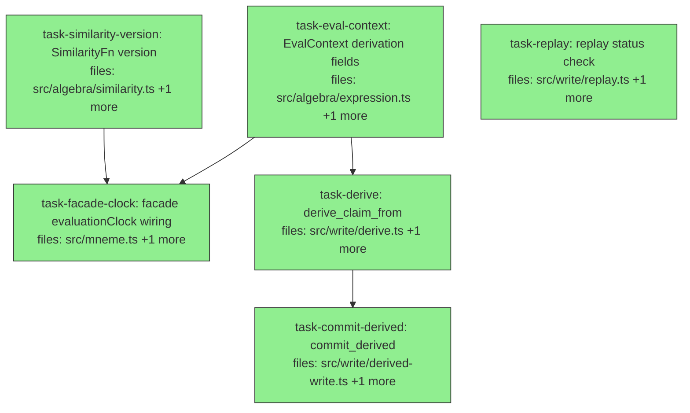

## Context

Implements **v1 sub-milestone 3 — derived writes + provenance + `evaluationClock`** per the approved
design at `docs/superpowers/specs/2026-05-26-mneme-v1-derived-writes-design.md`, the §7.6/§2.7 slice
of the canonical spec `mneme-spec-v0.2-consolidated.md`.

**Goal:** persist derived claims with full `DerivationProvenance`, pin a single `evaluationClock` so
δ/`τ_now` are deterministic, record similarity/embedding versions (the irreversible-at-write-time
§7.6 mandate), and report the four DEGRADED replay statuses from recorded metadata. Core `[C]` tier.

**Builds on** green slices 1+2 (400 tests). Reused (pre-existing): `evaluate`/`EvalContext`/`leaf`
(`src/algebra/expression.ts`), `Promoter` (`src/write/pipeline.ts`), `StorageAdapter`
(`src/adapters/adapter.ts`), `Catalog` (`src/catalog/catalog.ts`), `DerivationProvenance`/`Provenance`
(`src/core/provenance.ts`), `Claim`/`CandidateClaim` (`src/core/claim.ts`), `similarityFn` registry
(`src/algebra/similarity.ts`), `newClaimId` (`src/core/ids.ts`), `Instant` (`src/core/time.ts`).

**Contract changes (grep-verified consumers):** `EvalContext` is constructed only at `src/mneme.ts:129`
plus test stubs, so the new fields are added **optional** (purely additive — zero cascade; `query()`
always sets them, stages read with a `?? Date.now()` fallback). `SimilarityFn` is defined only in
`src/algebra/similarity.ts` (the two bindings); `composition.ts`/tests only call `.scoreOne`, so a new
required `version` is fully contained in that one file.

**DAG shape:** `task-eval-context`, `task-similarity-version`, `task-replay` are roots (file-disjoint).
`task-facade-clock` converges on the two contract tasks; `task-derive` follows `task-eval-context`;
`task-commit-derived` follows `task-derive`.

**Deferred (NOT this slice):** the `exact` replay re-execution engine (needs a serializable+executable
query AST — its own later slice, tracked); corpus-state snapshot retention (uses `recordedSeq` as the
logical `corpusState`); embedding models (none in v1 → `embeddingModelVersions` always `{}`).

## Tasks

## Task: EvalContext derivation fields

```yaml
id: task-eval-context
depends_on: []
files:
  - src/algebra/expression.ts
  - src/algebra/expression.test.ts
status: done
```

Extend `EvalContext` with an optional pinned `evaluationClock` and optional mutable version
accumulators, so time-dependent operators can be made deterministic and similarity versions captured
during evaluation. Additive only — `leaf`/`evaluate`/`pipe`/`liftOp`/`gammaStage` are unchanged.

## Implementation

```typescript
// src/algebra/expression.ts — EvalContext gains optional derivation fields
import type { Instant } from "../core/time.js";
export interface EvalContext {
  adapter: StorageAdapter;
  catalog: Catalog;
  // pinned evaluation time for time-dependent operators (δ, τ_now); when set, replaces wall-clock
  evaluationClock?: Instant;
  // mutable accumulators populated during evaluation (ρ records the similarity fn version it used)
  usedSimilarityVersions?: Record<string, string>;
  usedEmbeddingModelVersions?: Record<string, string>;
}
// leaf / liftOp / gammaStage / pipe / evaluate unchanged.
```

```typescript
// src/algebra/expression.test.ts — additive field is optional, existing ctx stubs still compile
import { evaluate, leaf, type EvalContext } from "./expression.js";
it("EvalContext accepts an optional pinned evaluationClock and version accumulators", () => {
  const ctx: EvalContext = { adapter: {} as any, catalog: {} as any, evaluationClock: 1000, usedSimilarityVersions: {} };
  expect(ctx.evaluationClock).toBe(1000);
  // a ctx WITHOUT the new fields still type-checks (optional)
  const bare: EvalContext = { adapter: {} as any, catalog: {} as any };
  expect(bare.evaluationClock).toBeUndefined();
});
```

## Acceptance criteria

- `EvalContext` exposes optional `evaluationClock?: Instant`, `usedSimilarityVersions?: Record<string,string>`, `usedEmbeddingModelVersions?: Record<string,string>`.
- A `ctx` literal WITHOUT the new fields still type-checks (the fields are optional — additive, no breakage).
- `leaf`, `evaluate`, `pipe`, `liftOp`, `gammaStage` signatures and behavior are unchanged; the existing expression tests still pass.

Test file: `src/algebra/expression.test.ts`.

## Task: SimilarityFn version

```yaml
id: task-similarity-version
depends_on: []
files:
  - src/algebra/similarity.ts
  - src/algebra/similarity.test.ts
status: done
```

Add a `version` identifier to the `SimilarityFn` protocol and the two core bindings, so derived-write
provenance can record which similarity function version produced a ranking (§7.6 mandatory version
provenance). Stable v1 identifiers; no behavior change to `scoreOne`/`rho`.

## Implementation

```typescript
// src/algebra/similarity.ts — SimilarityFn gains a version; the two bindings declare stable v1 ids
export interface SimilarityFn {
  scoreOne(value: Value, query: Value): number;
  isPure: boolean;
  version: string; // stable identifier recorded in derivation provenance
}
export const simJaccard: SimilarityFn = { isPure: true, version: "jaccard@1", scoreOne(v, q) { /* unchanged */ return 0; } };
export const simExact: SimilarityFn = { isPure: true, version: "exact@1", scoreOne(v, q) { /* unchanged */ return 0; } };
// registry + similarityFn(name) + rho unchanged
```

```typescript
// src/algebra/similarity.test.ts — version present and stable; lookup still returns the binding
import { simJaccard, simExact, similarityFn } from "./similarity.js";
it("similarity fns expose a stable version identifier", () => {
  expect(simJaccard.version).toBe("jaccard@1");
  expect(simExact.version).toBe("exact@1");
  expect(similarityFn("jaccard").version).toBe("jaccard@1");
});
```

## Acceptance criteria

- `SimilarityFn` declares `version: string`; `simJaccard.version === "jaccard@1"` and `simExact.version === "exact@1"`.
- `similarityFn(name)` resolves the same binding objects as before (now carrying `version`); `scoreOne`/`isPure`/`rho` behavior is unchanged.
- The existing similarity tests still pass.

Test file: `src/algebra/similarity.test.ts`.

## Task: facade evaluationClock wiring

```yaml
id: task-facade-clock
depends_on: [task-eval-context, task-similarity-version]
files:
  - src/mneme.ts
  - src/mneme.test.ts
status: done
```

Wire the pinned clock and version capture into the public façade: `query()` pins one `evaluationClock`
(default `Date.now()`, caller-overridable) and initializes the version accumulators in the `EvalContext`;
`delta.*`/`tau.now()` become ctx-aware (read `ctx.evaluationClock`); `rho.*` records its fn's `version`
into `ctx.usedSimilarityVersions`. Behavior for immediate queries is preserved (pinned clock ≈ wall clock).

## Implementation

```typescript
// src/mneme.ts — pin the clock + accumulators in query(); make δ/τ/ρ ctx-aware
import { similarityFn } from "./algebra/similarity.js";
// query() now pins one evaluation clock and inits accumulators:
query<O>(corpusId: string, pipeline: Stage<any, any>[], opts?: { evaluationClock?: number }): O {
  catalog.getCorpus(corpusId);
  const ctx: EvalContext = {
    adapter, catalog,
    evaluationClock: opts?.evaluationClock ?? Date.now(),
    usedSimilarityVersions: {}, usedEmbeddingModelVersions: {},
  };
  return evaluate<O>(pipeline, ctx);
}
// δ and τ_now read the pinned clock (ctx-aware stages, not liftOp of a build-time clock):
export const delta = {
  exponential: (halfLifeDays: number): Stage<Corpus, Corpus> =>
    (c, ctx) => deltaOp({ kind: "exponential", halfLifeDays }, ctx.evaluationClock ?? Date.now())(c),
  // none/linear/step likewise read ctx.evaluationClock ?? Date.now()
};
export const tau = {
  now: (): Stage<Corpus, Corpus> => (c, ctx) => tauNowOp(() => ctx.evaluationClock ?? Date.now())(c),
  // known/valid/recorded unchanged (explicit-time)
};
// ρ records the similarity fn version into the ctx accumulator when it runs:
export const rho = {
  jaccard: (query: Value): Stage<Corpus, RankedCorpus> =>
    (c, ctx) => { if (ctx.usedSimilarityVersions) ctx.usedSimilarityVersions["jaccard"] = similarityFn("jaccard").version; return rhoOp("jaccard", query)(c); },
  // exact likewise
};
```

```typescript
// src/mneme.test.ts — determinism + version capture through the public API
import { createMneme, createSqliteAdapter, pipe, leaf, delta, rho } from "./index.js";
it("query pins evaluationClock so repeated runs give identical decay (no wall-clock drift)", () => {
  const m = createMneme({ adapter: createSqliteAdapter(), availableTiers: [{ kind: "core" }] });
  // ...create corpus, commit a claim recorded in the past...
  const a = m.query("c", pipe(leaf("c"), delta.exponential(30)), { evaluationClock: 5_000_000_000 });
  const b = m.query("c", pipe(leaf("c"), delta.exponential(30)), { evaluationClock: 5_000_000_000 });
  expect((a as any).claims[0]?.confidence.effective).toBe((b as any).claims[0]?.confidence.effective);
});
```

## Acceptance criteria

- `query(corpusId, pipeline, opts?)` accepts an optional `opts.evaluationClock`; when omitted it defaults to `Date.now()`; the pinned value is placed on `ctx.evaluationClock` and the accumulators are initialized.
- Two `query()` calls with the same `opts.evaluationClock` produce identical δ-decayed effective confidences and identical `τ_now` slices (deterministic — no wall-clock drift).
- A pipeline containing `rho.jaccard(...)` leaves `ctx.usedSimilarityVersions["jaccard"] === "jaccard@1"` after evaluation; a pipeline with no similarity op leaves the accumulator empty.
- Existing façade/acceptance behavior is preserved: the full suite (incl. `test/acceptance/worked-query-1.test.ts`) stays green.

Test file: `src/mneme.test.ts`.

## Task: derive_claim_from

```yaml
id: task-derive
depends_on: [task-eval-context]
files:
  - src/write/derive.ts
  - src/write/derive.test.ts
status: done
```

`deriveClaimFrom` runs a query pipeline through a freshly pinned `EvalContext`, takes the synthesized
result claim, and assembles a partial `DerivationProvenance` (inputs, combination rule, evaluationClock,
captured versions). Produces an unpersisted `CandidateClaim`; persistence is `commit_derived`'s job.

## Implementation

```typescript
// src/write/derive.ts
import type { Corpus } from "../algebra/types.js";
import { evaluate, type EvalContext, type Stage } from "../algebra/expression.js";
import type { CandidateClaim, Claim } from "../core/claim.js";
import type { StorageAdapter } from "../adapters/adapter.js";
import type { Catalog } from "../catalog/catalog.js";

export interface DeriveOptions { subject: string; key: string; scope: Record<string, string | undefined>; combination?: string; evaluationClock?: number }

// Runs the pipeline (which must terminate in a Corpus of >=1 synthesized/selected claim), assembling
// the partial derivedFrom provenance from what the evaluation used. inputClaims = ids of the resulting
// corpus's claims that fed the derivation (the contributing leaf claims).
export function deriveClaimFrom(adapter: StorageAdapter, catalog: Catalog, pipeline: Stage<any, any>[], opts: DeriveOptions): CandidateClaim {
  const ctx: EvalContext = {
    adapter, catalog,
    evaluationClock: opts.evaluationClock ?? Date.now(),
    usedSimilarityVersions: {}, usedEmbeddingModelVersions: {},
  };
  const result = evaluate<Corpus>(pipeline, ctx);
  const inputClaims = result.claims.map((c) => c.id);
  // take the synthesized/representative claim's value+confidence (the derivation's output),
  // attach derivedFrom assembled from ctx + opts:
  return { /* subject, key, scope, value, confidence, evidence, ...,
    provenance: { derivedFrom: {
      queryExpression: "", corpusState: 0, combinationRule: opts.combination,
      inputClaims, similarityVersions: { ...ctx.usedSimilarityVersions },
      embeddingModelVersions: { ...ctx.usedEmbeddingModelVersions }, evaluationClock: ctx.evaluationClock!,
    } } } as CandidateClaim;
}
```

```typescript
// src/write/derive.test.ts
import { deriveClaimFrom } from "./derive.js";
it("captures inputClaims, evaluationClock, and similarity versions into derivedFrom", () => {
  const claim = { id: "in-1", subject: "s", key: "s.k", value: "v", confidence: { distribution: "beta", parameters: { alpha: 9, beta: 1 }, raw: 0.9 }, evidence: [] } as any;
  const adapter = { query: () => [claim] } as any;
  const catalog = { getCorpus: () => ({}) } as any;
  // a manual ctx-aware stage that records a similarity version (stands in for rho)
  const recordSim: any = (c: any, ctx: any) => { ctx.usedSimilarityVersions["jaccard"] = "jaccard@1"; return c; };
  const cand = deriveClaimFrom(adapter, catalog, [(_: any, ctx: any) => { ctx.catalog; return adapter.query(); }, recordSim], { subject: "t", key: "t.k", scope: {}, combination: "rule_weighted_avg", evaluationClock: 1234 });
  expect(cand.provenance.derivedFrom?.inputClaims).toEqual(["in-1"]);
  expect(cand.provenance.derivedFrom?.evaluationClock).toBe(1234);
  expect(cand.provenance.derivedFrom?.similarityVersions).toEqual({ jaccard: "jaccard@1" });
});
```

## Acceptance criteria

- `deriveClaimFrom` evaluates the pipeline through a ctx whose `evaluationClock` is `opts.evaluationClock ?? Date.now()`, and returns a `CandidateClaim` for the target `subject`/`key`/`scope`.
- The returned candidate's `provenance.derivedFrom` carries `inputClaims` (the contributing claim ids), `combinationRule` (= `opts.combination`), `evaluationClock` (the pinned clock), `similarityVersions`, and `embeddingModelVersions` (copied from the ctx accumulators).
- The candidate is unpersisted (no adapter write); `queryExpression`/`corpusState` are left for `commit_derived` to finalize.

Test file: `src/write/derive.test.ts`.

## Task: commit_derived

```yaml
id: task-commit-derived
depends_on: [task-derive]
files:
  - src/write/derived-write.ts
  - src/write/derived-write.test.ts
status: done
```

`commitDerived` finalizes the derivation provenance (serialized query string + corpus-state seq),
enforces mandatory similarity-version provenance (§7.6 MUST), then persists via the existing `Promoter`
so contradiction policy and idempotency still apply.

## Implementation

```typescript
// src/write/derived-write.ts
import type { CandidateClaim } from "../core/claim.js";
import type { Promoter } from "./pipeline.js";
import type { ContradictionPolicy } from "../catalog/corpus.js";

export interface CommitDerivedOptions { queryExpression: string; corpusState: number; writer: string; policy?: ContradictionPolicy; idempotencyKey?: string }

const SIMILARITY_MARKERS = ["rho", "jaccard", "exact", "cosine"];

export function commitDerived(promoter: Promoter, candidate: CandidateClaim, opts: CommitDerivedOptions): { id: string; status: string } {
  const derivedFrom = candidate.provenance?.derivedFrom;
  if (!derivedFrom) throw new Error("commitDerived: candidate has no derivedFrom provenance");
  // finalize the recorded query + corpus state
  derivedFrom.queryExpression = opts.queryExpression;
  derivedFrom.corpusState = opts.corpusState;
  // §7.6 mandatory version provenance: if the query referenced similarity ops, versions MUST be present
  const usesSimilarity = SIMILARITY_MARKERS.some((m) => opts.queryExpression.includes(m));
  if (usesSimilarity && Object.keys(derivedFrom.similarityVersions).length === 0) {
    throw new Error("commitDerived: query uses similarity operators but similarityVersions is empty (§7.6 mandatory version provenance)");
  }
  return promoter.commit(candidate, { policy: opts.policy ?? { kind: "always_accept" }, writer: opts.writer, idempotencyKey: opts.idempotencyKey });
}
```

```typescript
// src/write/derived-write.test.ts
import { commitDerived } from "./derived-write.js";
it("rejects when the query uses similarity but similarityVersions is empty", () => {
  const promoter = { commit: () => ({ id: "x", status: "committed" }) } as any;
  const candNoVer = { provenance: { derivedFrom: { similarityVersions: {}, embeddingModelVersions: {}, inputClaims: [] } } } as any;
  expect(() => commitDerived(promoter, candNoVer, { queryExpression: "leaf(c) | rho.jaccard(q)", corpusState: 1, writer: "w" })).toThrow(/mandatory version/);
  const candVer = { provenance: { derivedFrom: { similarityVersions: { jaccard: "jaccard@1" }, embeddingModelVersions: {}, inputClaims: [] } } } as any;
  expect(commitDerived(promoter, candVer, { queryExpression: "leaf(c) | rho.jaccard(q)", corpusState: 1, writer: "w" }).status).toBe("committed");
});
```

## Acceptance criteria

- `commitDerived` sets `derivedFrom.queryExpression` and `derivedFrom.corpusState`, then calls `Promoter.commit` (so contradiction policy + idempotency apply); returns the commit result.
- Mandatory version enforcement: a `queryExpression` containing a similarity marker (`rho`/`jaccard`/`exact`/`cosine`) with empty `similarityVersions` throws a typed error; the same with versions present commits; a `queryExpression` with no similarity marker and empty `similarityVersions` commits fine.
- A candidate lacking `derivedFrom` is rejected with a typed error.
- The persisted claim retains its full `derivedFrom` provenance (inputClaims, combinationRule, evaluationClock, versions, queryExpression, corpusState).

Test file: `src/write/derived-write.test.ts`.

## Task: replay status check

```yaml
id: task-replay
depends_on: []
files:
  - src/write/replay.ts
  - src/write/replay.test.ts
status: done
```

`replayStatus` reports the degraded replay statuses from recorded provenance metadata (§7.6): missing
inputs, unavailable model/similarity versions, or pre-v1 integrity-unknown. The `exact` re-execution
status is out of scope this slice (the serializable-query replay engine is a deferred later slice).

## Implementation

```typescript
// src/write/replay.ts
import type { Claim, ClaimId } from "../core/claim.js";
import type { StorageAdapter } from "../adapters/adapter.js";
import { similarityFn } from "../algebra/similarity.js";

export interface MissingDependency { kind: "input" | "similarity_version" | "embedding_version"; id: string }
export type ReplayStatus = "exact" | "unavailable_models" | "missing_inputs" | "integrity_unknown" | "failed";
export interface ReplayResult { status: ReplayStatus; result?: Claim; missingDependencies: MissingDependency[] }

// NOTE: "exact" requires re-EXECUTING the serialized query — deferred (serializable query AST is a
// later slice). This function reports the degraded statuses from recorded metadata only.
export function replayStatus(claim: Claim, adapter: StorageAdapter): ReplayResult {
  const d = claim.provenance?.derivedFrom;
  if (!d || d.evaluationClock === undefined) return { status: "integrity_unknown", missingDependencies: [] };
  const missing: MissingDependency[] = [];
  for (const id of d.inputClaims) if (!adapter.getClaim(id as ClaimId)) missing.push({ kind: "input", id });
  if (missing.length) return { status: "missing_inputs", missingDependencies: missing };
  for (const [name, ver] of Object.entries(d.similarityVersions)) {
    let available = false;
    try { available = similarityFn(name).version === ver; } catch { available = false; }
    if (!available) missing.push({ kind: "similarity_version", id: `${name}@${ver}` });
  }
  if (missing.length) return { status: "unavailable_models", missingDependencies: missing };
  return { status: "failed", missingDependencies: [] }; // cannot verify exact without re-execution (deferred)
}
```

```typescript
// src/write/replay.test.ts
import { replayStatus } from "./replay.js";
it("reports integrity_unknown for a claim with no derivedFrom, missing_inputs when an input is absent", () => {
  const adapter = { getClaim: (id: string) => (id === "present" ? ({ id } as any) : undefined) } as any;
  const plain = { provenance: {} } as any;
  expect(replayStatus(plain, adapter).status).toBe("integrity_unknown");
  const derived = { provenance: { derivedFrom: { evaluationClock: 1, inputClaims: ["gone"], similarityVersions: {}, embeddingModelVersions: {} } } } as any;
  expect(replayStatus(derived, adapter).status).toBe("missing_inputs");
});
```

## Acceptance criteria

- A claim with no `derivedFrom` (or no `evaluationClock`) → `integrity_unknown` (pre-v1 / unverifiable).
- A derived claim with a recorded `inputClaims` id absent from the adapter → `missing_inputs`, with that id in `missingDependencies`.
- A derived claim whose recorded `similarityVersions` entry no longer resolves in the registry → `unavailable_models`, with the version in `missingDependencies`.
- `exact` is never returned (documented: re-execution is the deferred replay-engine slice); a derived claim whose inputs and versions all resolve returns `failed` (cannot verify without re-execution) — this is the defined placeholder until the re-execution engine lands.

Test file: `src/write/replay.test.ts`.
