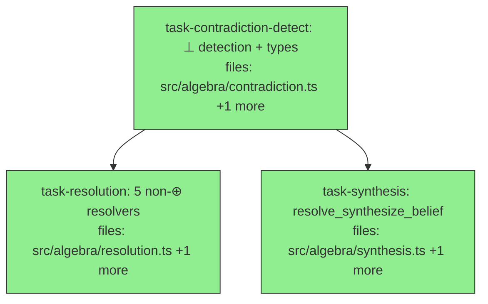

## Context

Implements **v1 sub-milestone 2 — read-time contradiction `⊥` + resolution** per the approved design at
`docs/superpowers/specs/2026-05-26-mneme-v1-read-time-contradiction-design.md`, the §4.8 slice of the
canonical spec `mneme-spec-v0.2-consolidated.md`.

**Goal:** detect contradictions within a queried `Corpus` (`⊥_clusters` primary, `⊥_pairs`/`derived_pairs`
projections) and resolve them as pure in-memory `Corpus → Corpus` transforms. Core `[C]` tier only.

**Builds on** the green slice-1 tree (360 tests). Reused (all pre-existing): `Corpus`/`mapCorpus`/`corpusOf`
(`src/algebra/types.ts`), `Claim`/`Status` (`src/core/claim.ts`), `pointEstimate`/`Confidence`
(`src/core/confidence.ts`), `newClaimId` (`src/core/ids.ts`), the `⊕` `combine` (`src/distribution/beta.ts`),
`RULE` (`src/distribution/rules.ts`), `bindingFor` (`src/distribution/registry.ts`), `SOURCE_WEIGHT`
(`src/write/source-weight.ts`). The write-time contradiction check (`src/write/contradiction.ts`) is a
SEPARATE concern and is untouched.

**DAG shape:** `task-contradiction-detect` is the root (types + detection that the resolvers consume).
`task-resolution` (the five non-`⊕` resolvers) and `task-synthesis` (`resolve_synthesize_belief`, which
consumes the shipped `⊕`) run in parallel after it — disjoint files.

**Deferred (NOT this slice):** `resolve_synthesize_belief_multi` `[P]` (Dirichlet, `k>2`); persisting
resolved/synthesized claims (`commit_derived`); subscription-state incremental cluster maintenance (§8);
mixed-distribution clusters (a triple mixing distribution types throws a typed error).

## Tasks

## Task: contradiction detection ⊥ + types

```yaml
id: task-contradiction-detect
depends_on: []
files:
  - src/algebra/contradiction.ts
  - src/algebra/contradiction.test.ts
status: done
```

The §4.8 detection layer and its meta-relation types: `clustersOf` (primary, n-way), with `pairsOf` and
`derivedPairs` as projections (the spec's `⊥_pairs ⊆ derived_pairs(⊥_clusters)` equality). Per-value
`combinedConfidences` pool agreeing claims via the shipped `⊕ rule_evidence_pooled`.

## Implementation

```typescript
// src/algebra/contradiction.ts
import type { Corpus } from "./types.js";
import type { Claim } from "../core/claim.js";
import { pointEstimate, type Confidence } from "../core/confidence.js";
import { bindingFor } from "../distribution/registry.js";
import { RULE } from "../distribution/rules.js";

export type ConflictReason = "value-difference"; // §4.8 binary criterion; only reason this detector emits
export interface Resolution { kind: string; resultClaimIds: string[] }
export interface ContradictionPair { left: Claim; right: Claim; conflictReason: ConflictReason; resolution?: Resolution }
export interface ContradictionCluster {
  triple: { subject: string; key: string; scopeHash: string };
  valueGroups: Map<string, Claim[]>;           // keyed by valueHash
  totalClaims: number;
  distinctValues: number;
  agreementRatio: number;                        // largestGroup / total (1.0 = consensus, 1/k = k-way split)
  highestConfidenceGroup?: string;               // valueHash with highest pooled point estimate
  combinedConfidences: Map<string, Confidence>;  // per-value pooled confidence (⊕ evidence_pooled)
}

const eff = (c: Claim) => c.confidence.effective ?? pointEstimate(c.confidence);

export function clustersOf(corpus: Corpus, threshold: number): ContradictionCluster[] {
  // 1. keep claims with eff(claim) > threshold
  // 2. group by `${subject} ${key} ${scopeHash}` → within each triple sub-group by valueHash
  // 3. a triple with >= 2 distinct valueHash groups is a cluster
  // 4. per group: pool params left-to-right via bindingFor(dist).combine(RULE.EVIDENCE_POOLED, acc, next)
  //    → combinedConfidences[valueHash]; highestConfidenceGroup = argmax binding.mean(pooled)
  //    agreementRatio = largestGroupSize / totalClaims
  return [];
}
export function derivedPairs(clusters: ContradictionCluster[]): ContradictionPair[] {
  // for each cluster, emit the k*(k-1)/2 cross-value pairs (one claim per group is enough to witness;
  // emit all cross-group claim pairs), conflictReason "value-difference"
  return [];
}
export const pairsOf = (corpus: Corpus, threshold: number): ContradictionPair[] => derivedPairs(clustersOf(corpus, threshold));
```

```typescript
// src/algebra/contradiction.test.ts
import { clustersOf } from "./contradiction.js";
import { corpusOf } from "./types.js";
const c = (id: string, valueHash: string, alpha: number, beta: number) => ({
  id, subject: "s", key: "s.k", scopeHash: "_", valueHash,
  confidence: { distribution: "beta", parameters: { alpha, beta }, raw: alpha / (alpha + beta) },
} as any);
it("a triple with two distinct high-confidence values forms one cluster", () => {
  const clusters = clustersOf(corpusOf([c("a", "vh-yes", 9, 1), c("b", "vh-no", 8, 1)]), 0.5);
  expect(clusters).toHaveLength(1);
  expect(clusters[0].distinctValues).toBe(2);
});
```

## Acceptance criteria

- A `(subject, key, scopeHash)` triple with ≥2 distinct `valueHash` groups (all above threshold) forms one `ContradictionCluster`; a single-value (consensus) triple forms none.
- `agreementRatio = largestGroupSize / totalClaims`: "3 support A, 1 B, 1 C" → `distinctValues=3`, `totalClaims=5`, `agreementRatio=0.6`.
- `combinedConfidences[v]` pools that value group's claims via `⊕ rule_evidence_pooled`: two agreeing `Beta(3,2)` claims → `Beta(5,3)`. `highestConfidenceGroup` is the value with the highest pooled point estimate.
- `pairsOf(C)` equals `derivedPairs(clustersOf(C))`; a binary cluster (2 distinct values) yields exactly one pair with `conflictReason: "value-difference"`.
- Below-threshold claims do not participate (a claim with `eff ≤ threshold` is excluded from detection).
- Selection commutes: `clustersOf` over a filtered corpus contains only clusters whose claims are all present.

Test file: `src/algebra/contradiction.test.ts`.

## Task: five non-⊕ resolution operators

```yaml
id: task-resolution
depends_on: [task-contradiction-detect]
files:
  - src/algebra/resolution.ts
  - src/algebra/resolution.test.ts
status: done
```

The five resolution operators that need no belief combination (§4.8): pairwise `resolveDeprecateLower`,
`resolveFlagForReview`, `resolveKeepBoth`; cluster-aware `resolveDeprecateMinority`, `resolvePromoteConsensus`.
Each is a pure `Corpus → Corpus` transform; deprecation sets `status="deprecated"` (via `mapCorpus`), never
mutating stored confidence.

## Implementation

```typescript
// src/algebra/resolution.ts
import type { Corpus } from "./types.js";
import { mapCorpus, corpusOf } from "./types.js";
import type { Claim } from "../core/claim.js";
import { pointEstimate } from "../core/confidence.js";
import { newClaimId } from "../core/ids.js";
import type { ContradictionPair, ContradictionCluster } from "./contradiction.js";

const deprecate = (corpus: Corpus, ids: Set<string>): Corpus =>
  mapCorpus(corpus, (cl) => (ids.has(cl.id) ? { ...cl, status: "deprecated" } : cl));

// loser = lower point estimate; tie → lexicographically-higher id
export const resolveDeprecateLower = (pairs: ContradictionPair[]) => (corpus: Corpus): Corpus => {
  const losers = new Set<string>();
  for (const p of pairs) { /* compare eff(left) vs eff(right); add loser id */ }
  return deprecate(corpus, losers);
};
export const resolveKeepBoth = (_pairs: ContradictionPair[]) => (corpus: Corpus): Corpus => corpus; // identity
export const resolveFlagForReview = (pairs: ContradictionPair[]) => (corpus: Corpus): Corpus => {
  // append one artifact Claim per pair: subject "contradiction", key "contradiction.flag",
  // value referencing {left.id, right.id}; id via newClaimId(); originals untouched
  const artifacts: Claim[] = pairs.map((p) => ({ /* ... */ } as Claim));
  return corpusOf([...corpus.claims, ...artifacts]);
};
export const resolveDeprecateMinority = (clusters: ContradictionCluster[]) => (corpus: Corpus): Corpus => {
  // deprecate every claim NOT in the largest value group of each cluster
  const losers = new Set<string>(); /* ... */ return deprecate(corpus, losers);
};
export const resolvePromoteConsensus = (clusters: ContradictionCluster[]) => (corpus: Corpus): Corpus => {
  // deprecate minority groups AND set the largest group's claims status="validated"
  return corpus; /* ... */
};
```

```typescript
// src/algebra/resolution.test.ts
import { resolveDeprecateLower } from "./resolution.js";
import { corpusOf } from "./types.js";
it("resolveDeprecateLower deprecates the lower-point-estimate claim", () => {
  const hi = { id: "a", confidence: { distribution: "beta", parameters: { alpha: 9, beta: 1 }, raw: 0.9 }, status: "validated" } as any;
  const lo = { id: "b", confidence: { distribution: "beta", parameters: { alpha: 1, beta: 9 }, raw: 0.1 }, status: "validated" } as any;
  const pair = { left: hi, right: lo, conflictReason: "value-difference" } as any;
  const out = resolveDeprecateLower([pair])(corpusOf([hi, lo]));
  expect(out.claims.find((c) => c.id === "b")?.status).toBe("deprecated");
  expect(out.claims.find((c) => c.id === "a")?.status).toBe("validated");
});
```

## Acceptance criteria

- `resolveDeprecateLower`: the lower-`pointEstimate` claim of each pair becomes `status="deprecated"`; the higher is unchanged; ties deprecate the lexicographically-higher claim id.
- `resolveKeepBoth`: identity (returns an equal corpus, both claims live).
- `resolveFlagForReview`: the corpus gains exactly one artifact claim per pair (a `Claim` recording the conflicting ids); the original claims are unchanged.
- `resolveDeprecateMinority`: every claim outside the largest value group of each cluster becomes `deprecated`; the largest group is untouched.
- `resolvePromoteConsensus`: minority-group claims become `deprecated` AND the largest group's claims become `status="validated"`.
- All resolvers return new `Corpus` values without mutating stored `confidence.parameters`.

Test file: `src/algebra/resolution.test.ts`.

## Task: resolve_synthesize_belief (uses ⊕)

```yaml
id: task-synthesis
depends_on: [task-contradiction-detect]
files:
  - src/algebra/synthesis.ts
  - src/algebra/synthesis.test.ts
status: done
```

`resolveSynthesizeBelief` (§4.8, core binary case): for each binary cluster (exactly 2 value groups), fuse the
two groups' pooled confidences via the shipped `⊕` (caller-configurable rule, default `rule_weighted_avg`)
into one new in-memory derived `Claim`; deprecate the two conflicting groups and append the synthesized claim.
Multi-way clusters (`k>2`) are left untouched (that is `_multi` `[P]`, deferred).

## Implementation

```typescript
// src/algebra/synthesis.ts
import type { Corpus } from "./types.js";
import { mapCorpus, corpusOf } from "./types.js";
import type { Claim } from "../core/claim.js";
import { newClaimId } from "../core/ids.js";
import { bindingFor } from "../distribution/registry.js";
import { RULE } from "../distribution/rules.js";
import { SOURCE_WEIGHT } from "../write/source-weight.js";
import type { ContradictionCluster } from "./contradiction.js";

export const resolveSynthesizeBelief =
  (clusters: ContradictionCluster[], rule: string = RULE.WEIGHTED_AVG) =>
  (corpus: Corpus): Corpus => {
    const binary = clusters.filter((cl) => cl.distinctValues === 2);
    const deprecateIds = new Set<string>();
    const synthesized: Claim[] = [];
    for (const cl of binary) {
      // fuse the two groups' combinedConfidences via bindingFor(dist).combine(rule, gA, gB, {weights})
      // weights from SOURCE_WEIGHT of each group's claims (normalized); pick value = highestConfidenceGroup
      // build a new Claim: id newClaimId(), subject/key from triple, value of the favored group,
      // confidence = fused, evidence = union of both groups' evidence, status "validated" (unpersisted)
      // mark both groups' claim ids into deprecateIds; push the new claim into synthesized
    }
    const next = mapCorpus(corpus, (c) => (deprecateIds.has(c.id) ? { ...c, status: "deprecated" } : c));
    return corpusOf([...next.claims, ...synthesized]);
  };
```

```typescript
// src/algebra/synthesis.test.ts
import { resolveSynthesizeBelief } from "./synthesis.js";
import { clustersOf } from "./contradiction.js";
import { corpusOf } from "./types.js";
const c = (id: string, valueHash: string, value: string, alpha: number, beta: number) => ({
  id, subject: "s", key: "s.k", scope: {}, scopeHash: "_", valueHash, value, source: "workflow", evidence: [],
  confidence: { distribution: "beta", parameters: { alpha, beta }, raw: alpha / (alpha + beta) }, status: "validated",
} as any);
it("synthesize on a binary cluster deprecates both groups and appends one derived claim", () => {
  const corpus = corpusOf([c("a", "vh-yes", "yes", 9, 1), c("b", "vh-no", "no", 2, 8)]);
  const out = resolveSynthesizeBelief(clustersOf(corpus, 0.0))(corpus);
  expect(out.claims.filter((x) => x.status === "deprecated")).toHaveLength(2);
  expect(out.claims.filter((x) => x.status === "validated")).toHaveLength(1); // the synthesized claim
});
```

## Acceptance criteria

- For a binary cluster, `resolveSynthesizeBelief` appends exactly one new derived `Claim` whose `confidence` is the chosen-rule fusion (default `rule_weighted_avg`) of the two groups' pooled confidences, whose `value` is the `highestConfidenceGroup`'s value, and whose `evidence` is the union of both groups' evidence.
- The two conflicting groups' claims are set `status="deprecated"`; the synthesized claim is the only added `validated` claim.
- The rule is caller-configurable: passing `RULE.WEIGHTED_AVG` (default) vs another binary-supported rule changes the fused confidence accordingly.
- Multi-way clusters (`distinctValues > 2`) are left untouched (no synthesized claim, no deprecation).
- The synthesized claim is unpersisted: a fresh `newClaimId()` id, no adapter write, no recorded/recordedSeq assignment.

Test file: `src/algebra/synthesis.test.ts`.
