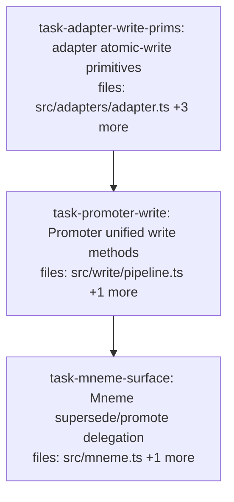

## Context

Implements the **substrate unified write API + write-event log** per `docs/superpowers/specs/2026-05-26-substrate-write-api-extension-design.md`. Adds discrete `supersede`/`promote` beside `commit` on `Promoter`/`Mneme` via a shared atomic write core (transaction-wrapped, DB-derived seq), four new `StorageAdapter` primitives, and an append-only write-event log atomic with each write.

**This plan is intentionally linear** — it's a layered substrate change (adapter → `Promoter` → `Mneme`), so there's no parallelism to exploit; the value is per-task spec+quality review. Bio-gateway routing through this API is a separate follow-on (out of scope, per spec §10).

**Contract-change handling (pre-checked):** the `StorageAdapter` interface gains four required methods — this breaks two inline implementations, so `src/adapters/adapter.test.ts` (a `stub: StorageAdapter`) is in the adapter task's scope, and `src/write/pipeline.test.ts`'s `makeAdapter` mock is in the Promoter task's scope. The `Promoter` constructor's new `corpusId` is **optional** so existing `new Promoter(adapter, schema)` call-sites keep compiling until the Mneme task passes it.

## Tasks

## Task: extend storage adapter with atomic-write primitives

```yaml
id: task-adapter-write-prims
depends_on: []
files:
  - src/adapters/adapter.ts
  - src/adapters/sqlite.ts
  - src/adapters/sqlite.test.ts
  - src/adapters/adapter.test.ts
status: pending
```

Add the four write primitives the shared write core needs — `transaction`, `maxRecordedSeq`, `appendEvent`, `readEvents` — plus the `ClaimEvent` type and an append-only `claim_events` table. Per design spec §3/§7.

## Implementation

```typescript
// src/adapters/adapter.ts — additions
export interface ClaimEvent {
  op: "commit" | "supersede" | "promote";
  corpusId: string;
  writer: string;
  claimId: string;
  deprecatedId?: string;   // supersede
  toStatus?: string;       // promote
  reason?: string;         // promote
  recorded: number;
  recordedSeq: number;
}

export interface StorageAdapter {
  // ...existing methods unchanged...
  transaction<T>(fn: () => T): T;                                   // run fn in a DB transaction; roll back on throw
  maxRecordedSeq(): number;                                          // COALESCE(MAX(recorded_seq), 0)
  appendEvent(e: ClaimEvent): void;                                  // append to claim_events
  readEvents(filter?: { corpusId?: string; claimId?: string; since?: number }): ClaimEvent[];
}
```

```typescript
// src/adapters/sqlite.ts — DDL adds an append-only events table + impls (sketch)
//   CREATE TABLE IF NOT EXISTS claim_events (
//     seq_pk INTEGER PRIMARY KEY AUTOINCREMENT, op TEXT, corpus_id TEXT, writer TEXT,
//     claim_id TEXT, deprecated_id TEXT, to_status TEXT, reason TEXT, recorded REAL, recorded_seq INTEGER );
//   CREATE INDEX IF NOT EXISTS idx_events_claim ON claim_events(claim_id);
transaction<T>(fn: () => T): T { return db.transaction(fn)(); },
maxRecordedSeq(): number {
  return (db.prepare("SELECT COALESCE(MAX(recorded_seq),0) AS m FROM claims").get() as { m: number }).m;
},
appendEvent(e) { eventInsertStmt.run({ ...e, deprecated_id: e.deprecatedId ?? null, to_status: e.toStatus ?? null, reason: e.reason ?? null, corpus_id: e.corpusId, claim_id: e.claimId, recorded_seq: e.recordedSeq }); },
readEvents(filter) { /* WHERE corpus_id/claim_id/recorded since, ORDER BY seq_pk */ },
```

```typescript
// src/adapters/sqlite.test.ts
import { createSqliteAdapter } from "./sqlite.js";

it("transaction rolls back all writes when fn throws", () => {
  const a = createSqliteAdapter();
  expect(() => a.transaction(() => { /* insert a claim, then */ throw new Error("boom"); })).toThrow();
  // assert the claim inserted inside the txn is NOT present afterward.
  expect(a.maxRecordedSeq()).toBe(0);
});
```

## Acceptance criteria

- `StorageAdapter` gains `transaction`, `maxRecordedSeq`, `appendEvent`, `readEvents`; the SQLite adapter implements all four.
- `transaction(fn)` commits on normal return and **rolls back every write** on throw (claims + events).
- `maxRecordedSeq()` returns `COALESCE(MAX(recorded_seq),0)` — `0` on an empty table, the true max otherwise.
- `appendEvent` persists to an append-only `claim_events` table; `readEvents` round-trips events and filters by `corpusId`/`claimId`/`since`.
- `src/adapters/adapter.test.ts`'s `stub: StorageAdapter` is updated to satisfy the extended interface (the four methods added). Existing adapter tests still pass.

Test file: `src/adapters/sqlite.test.ts`.

## Task: Promoter unified write methods

```yaml
id: task-promoter-write
depends_on: [task-adapter-write-prims]
files:
  - src/write/pipeline.ts
  - src/write/pipeline.test.ts
status: pending
```

Refactor `Promoter` onto a shared atomic `write` core and add `supersede`/`promote`. The core wraps each op in `adapter.transaction`, derives `recordedSeq` from `maxRecordedSeq()+1`, appends a `ClaimEvent`, and records idempotency — all inside the transaction. Per design spec §3/§4/§6/§7.

## Implementation

```typescript
// src/write/pipeline.ts — shape (Promoter class)
constructor(private adapter: StorageAdapter, private schema: ClaimSchema, private corpusId = "") {}

private write<T>(idem: { scope: string; key?: string } | undefined,
                 body: (recorded: number, seq: number) => { result: T; id?: string; event: ClaimEvent }): T {
  if (idem?.key) { const prior = checkIdempotent(this.adapter, idem.scope, idem.key, Date.now()); if (prior) return <duplicate>; }
  return this.adapter.transaction(() => {
    const recorded = Date.now();
    const seq = this.adapter.maxRecordedSeq() + 1;          // DB-derived (no in-memory seq)
    const { result, id, event } = body(recorded, seq);
    this.adapter.appendEvent(event);
    if (idem?.key && id) recordIdempotent(this.adapter, idem.scope, idem.key, id, Date.now());
    return result;
  });
}

// commit → refactored onto write() (same external behavior: validateScope + enforce + deprecate + insert)
// supersede(deprecateId, replacement, {writer, idempotencyKey?}):
//   validateScope; new-id replacement gets (recorded, seq); deleteClaim(deprecateId) [best-effort] + insertClaim;
//   NO enforce; event op:"supersede", deprecatedId; returns { id, status:"superseded"|"duplicate" }.
// promote(targetId, to, {writer, reason?, idempotencyKey?}):
//   get target → not_found; forward-only lifecycle → invalid_transition; else insertClaim({...target, status:to})
//   (claim keeps its own recorded/recordedSeq); event op:"promote", toStatus:to, reason, with the core's (recorded, seq).
```

```typescript
// src/write/pipeline.test.ts — makeAdapter mock must now implement transaction/maxRecordedSeq/appendEvent
it("supersede is atomic: a throwing insert rolls back the deprecation too", () => {
  // adapter.transaction(fn) wraps; force insert to throw → assert the deprecateId is NOT marked deprecated
  // and no replacement/event persisted.
});
```

## Acceptance criteria

- `commit` keeps its external contract (`committed`/`rejected`/`duplicate`), now executed via `write` (atomic, DB-derived seq, event-logged).
- `supersede` validates scope, deprecates the named id (best-effort: missing id is a no-op), inserts a fresh-id replacement, runs **no** contradiction enforce, logs a `supersede` event; returns `superseded`/`duplicate`.
- `promote` enforces forward-only transitions (`candidate→provisional→validated`, `any→deprecated`; backward → `invalid_transition`; missing → `not_found`), changes status in place leaving the claim's `recorded`/`recordedSeq` intact, and logs a `promote` event carrying the fresh stamp + `reason`.
- All three are atomic and idempotent; a rolled-back op leaves no claim, no event, and **no idempotency record** (retryable). `recordedSeq` comes from `maxRecordedSeq()+1`, not an in-memory counter (a new `Promoter` on the same adapter continues the sequence).
- `pipeline.test.ts`'s `makeAdapter` mock implements the new adapter methods; existing pipeline tests pass.

Test file: `src/write/pipeline.test.ts`.

## Task: Mneme supersede/promote delegation

```yaml
id: task-mneme-surface
depends_on: [task-promoter-write]
files:
  - src/mneme.ts
  - src/mneme.test.ts
status: pending
```

Expose `supersede`/`promote` on the `Mneme` interface, delegating to the cached `promoterFor(corpusId)`, and pass `corpusId` into the `Promoter` constructor. Additive — `commit`/`query`/`createCorpus` unchanged. Per design spec §5.

## Implementation

```typescript
// src/mneme.ts — additive
// promoterFor: new Promoter(adapter, catalog.getCorpusSchema(corpusId), corpusId)   // now passes corpusId
interface Mneme {
  // ...existing commit/createCorpus/query unchanged...
  supersede(corpusId: string, deprecateId: string, replacement: CandidateClaim,
            opts: { writer: string; idempotencyKey?: string }): { id: string; status: string };
  promote(corpusId: string, targetId: string, to: Status,
          opts: { writer: string; reason?: string; idempotencyKey?: string }): { id: string; status: string };
}
// implementations delegate: return promoterFor(corpusId).supersede(deprecateId, replacement, opts);
//                            return promoterFor(corpusId).promote(targetId, to, opts);
// (no policy resolution; promoterFor throws for unknown corpus via catalog.getCorpusSchema)
```

```typescript
// src/mneme.test.ts
import { createMneme } from "./mneme.js";

it("supersede deprecates the named claim and commits the replacement", () => {
  // createMneme + createCorpus + commit a claim; supersede it; assert old id is deprecated and a new id holds the replacement.
});
```

## Acceptance criteria

- `Mneme` exposes `supersede(corpusId, deprecateId, replacement, opts)` and `promote(corpusId, targetId, to, opts)`, each delegating to `promoterFor(corpusId)`.
- `promoterFor` constructs `Promoter` with `corpusId`; an unknown corpus throws (via `catalog.getCorpusSchema`), same as `commit`.
- Existing `commit`/`query`/`createCorpus` signatures and behavior are unchanged; existing Mneme-level tests pass.
- End-to-end against the real SQLite adapter: `supersede` yields a deprecated old claim + new replacement; `promote` transitions status; a `claim_events` row is recorded for each.

Test file: `src/mneme.test.ts`.
