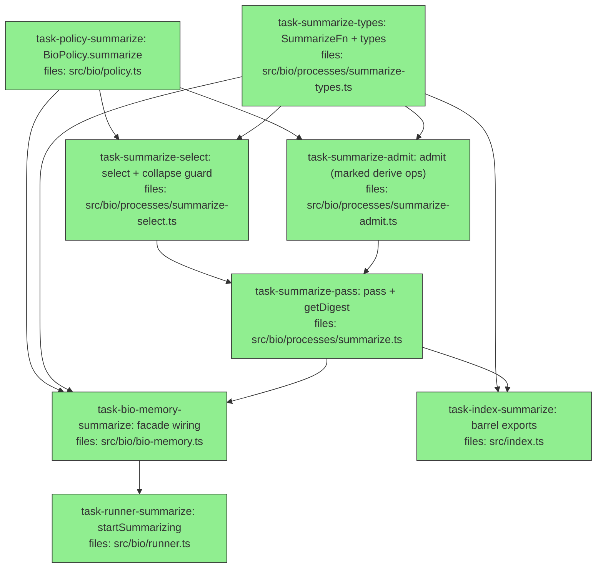

## Context

Implements the **Summarization (`SummarizeFn`) additive-digest** slice — the model-dependent third face of Consolidation. Driving spec: `docs/superpowers/specs/2026-05-26-bio-layer-summarization-design.md` (hardened with the Consolidation ultrareview lessons).

An async `summarize(episode)` pass produces a compact natural-language **digest** ("wake up with") by re-packing the episode's heterogeneous claims. **Additive only** (derive ops; inputs never deprecated). The digest is retrieved by marker via `getDigest(episode)`, carries a fixed-low non-inflating confidence, and is excluded from its own future input (collapse guard, no depth counter needed). Structurally mirrors the Dreaming pass.

**Review lessons baked in from the start** (from PR #1's ultrareview, so this slice never repeats them):
- **Empty-`runIds` guard** before any read (both `summarize` and `getDigest`) — an empty `runIds` query is unfiltered and would read the whole corpus.
- **Identity opKeys** (`…:summarize:derive:<hash(sorted cites)>`), never a positional index — positional keys collide across passes within the idempotency window.
- **Report `admitted` derives from actual apply outcomes** (`AppendResult.results`), not planned ops.
- **`provenance.runId = episode.runIds[0]`** set at admit so the digest is retrievable (the substrate preserves writer-supplied provenance — verified during PR #1).

Builds on the merged Consolidation slice (`BioPolicy`/`resolvePolicy`, the Mneme-backed gateway's derive path + the new per-op `AppendResult.results`, the marker convention). No substrate change.

## Tasks

## Task: BioPolicy summarize sub-policy

```yaml
id: task-policy-summarize
depends_on: []
files:
  - src/bio/policy.ts
  - src/bio/policy.test.ts
status: done
```

Add a `summarize` sub-policy to `BioPolicy` (spec §13): the fixed-low digest prior and the select token bound. Purely additive — existing `evidence`/`dreaming`/`consolidation` knobs and their tests are unaffected.

## Implementation

```typescript
// src/bio/policy.ts  (additive)
export interface BioPolicy {
  // ... existing evidence / dreaming / consolidation ...
  summarize?: { prior?: { alpha?: number; beta?: number }; maxInputClaims?: number };
}

// DEFAULT_BIO_POLICY gains:
//   summarize: { prior: { alpha: 1, beta: 3 }, maxInputClaims: 200 }

// resolvePolicy(p) gains a summarize branch (deep-merge prior like dreaming.prior):
//   summarize: {
//     ...DEFAULT_BIO_POLICY.summarize, ...p?.summarize,
//     prior: { ...DEFAULT_BIO_POLICY.summarize.prior, ...p?.summarize?.prior },
//   }
// (also extend resolvePolicy's explicit return-type annotation to include summarize)
```

```typescript
// src/bio/policy.test.ts  (ADD; existing cases unchanged & green)
import { resolvePolicy, DEFAULT_BIO_POLICY } from "./policy.js";

it("resolves summarize defaults and merges a partial prior", () => {
  expect(resolvePolicy().summarize).toEqual(DEFAULT_BIO_POLICY.summarize);
  const r = resolvePolicy({ summarize: { prior: { alpha: 5 } } });
  expect(r.summarize.prior).toEqual({ alpha: 5, beta: 3 }); // beta kept from default
  expect(r.summarize.maxInputClaims).toBe(200);             // sibling kept
});
```

## Acceptance criteria

- `DEFAULT_BIO_POLICY.summarize` equals `{ prior: { alpha: 1, beta: 3 }, maxInputClaims: 200 }`.
- `resolvePolicy().summarize` deep-equals the default; a partial `{ summarize: { prior: { alpha: 5 } } }` keeps `beta: 3` and `maxInputClaims: 200`.
- All pre-existing `policy.test.ts` cases pass unchanged (additive change).
- `resolvePolicy`'s return type includes `summarize` (typecheck clean).

Test file: `src/bio/policy.test.ts`.

## Task: SummarizeFn port module

```yaml
id: task-summarize-types
depends_on: []
files:
  - src/bio/processes/summarize-types.ts
  - src/bio/processes/summarize-types.test.ts
status: done
```

The consumer-implemented port + structured I/O (spec §4), plus the `"summary"` marker constant and an `isSummary` predicate used by Select and `getDigest`. Mirrors `dreaming-types.ts`.

## Implementation

```typescript
// src/bio/processes/summarize-types.ts
import type { Claim } from "../../core/claim.js";
import type { ClaimId } from "../../core/ids.js";
import type { Key } from "../../core/key.js";
import type { Value } from "../../core/value.js";
import type { Scope } from "../../core/scope.js";
import type { Episode } from "../types.js";

export const SUMMARY_WORKFLOW = "summary";

export type SummarizeFn = (input: SummarizeInput) => Promise<ProposedSummary[]>;
export interface SummarizeInput { episode: Episode; claims: Claim[]; maxSummaries?: number; }
export interface ProposedSummary { key: Key; value: Value; scope?: Scope; cites: ClaimId[]; rationale?: string; }
export interface SummarizeReport { proposed: number; admitted: number; dropped: { key?: string; reason: string }[]; errors: string[]; }

export const isSummary = (c: Claim): boolean => c.provenance.workflow === SUMMARY_WORKFLOW;
```

```typescript
// src/bio/processes/summarize-types.test.ts
import { isSummary, SUMMARY_WORKFLOW } from "./summarize-types.js";

it("isSummary is true only for the summary workflow marker", () => {
  expect(SUMMARY_WORKFLOW).toBe("summary");
  expect(isSummary({ provenance: { workflow: "summary" } } as any)).toBe(true);
  expect(isSummary({ provenance: { workflow: "dream" } } as any)).toBe(false);
  expect(isSummary({ provenance: {} } as any)).toBe(false);
});
```

## Acceptance criteria

- `SUMMARY_WORKFLOW === "summary"`.
- `isSummary(claim)` is `true` iff `claim.provenance.workflow === "summary"` (false for `"dream"`, undefined, or any other).
- `ProposedSummary` requires `cites: ClaimId[]`; has no confidence field (consumer cannot set confidence).
- The port/types typecheck against the core `Key`/`Value`/`Scope`/`Claim`/`Episode` types.

Test file: `src/bio/processes/summarize-types.test.ts`.

## Task: Summarize select stage

```yaml
id: task-summarize-select
depends_on: [task-policy-summarize, task-summarize-types]
files:
  - src/bio/processes/summarize-select.ts
  - src/bio/processes/summarize-select.test.ts
status: done
```

Build the collapse-safe, token-bounded input set (spec §5). Guards empty `runIds` before reading, excludes prior summaries (the complete collapse guard — no depth counter), and caps to `maxInputClaims` by recency-then-confidence. Mirrors `dreaming-select.ts`.

## Implementation

```typescript
// src/bio/processes/summarize-select.ts
import type { Claim } from "../../core/claim.js";
import type { Episode, BioQuery } from "../types.js";
import { isSummary } from "./summarize-types.js";
import { DEFAULT_BIO_POLICY } from "../policy.js";

export interface SummarizeSelectOpts { corpusId?: string; maxInputClaims?: number; }

export function selectSummarizeInput(
  read: (q: BioQuery) => Claim[],
  episode: Episode,
  opts: SummarizeSelectOpts = {}
): Claim[] {
  if (episode.runIds.length === 0) return []; // empty runIds → unfiltered read; guard like Dreaming
  const corpusId = opts.corpusId ?? "bio";
  const max = opts.maxInputClaims ?? DEFAULT_BIO_POLICY.summarize.maxInputClaims;
  const claims = read({ corpusId, runIds: episode.runIds } as BioQuery)
    .filter((c) => c.status !== "deprecated" && !isSummary(c)); // exclude prior summaries (collapse guard)
  // recency-then-confidence, top-N
  return [...claims]
    .sort((a, b) => Number(b.recorded) - Number(a.recorded) || b.confidence.raw - a.confidence.raw)
    .slice(0, max);
}
```

```typescript
// src/bio/processes/summarize-select.test.ts
import { selectSummarizeInput } from "./summarize-select.js";

it("excludes prior summaries and returns [] for an empty-runIds episode", () => {
  const claims = [
    { id: "a", status: "candidate", provenance: { workflow: "summary", runId: "r1" }, recorded: 2, confidence: { raw: 0.5 } },
    { id: "b", status: "candidate", provenance: { workflow: "dream", runId: "r1" }, recorded: 1, confidence: { raw: 0.5 } },
  ] as any[];
  const read = () => claims;
  expect(selectSummarizeInput(read, { id: "e", runIds: ["r1"], startedAt: 0 } as any).map((c) => c.id)).toEqual(["b"]);
  expect(selectSummarizeInput(read, { id: "e", runIds: [], startedAt: 0 } as any)).toEqual([]);
});
```

## Acceptance criteria

- An empty-`runIds` episode returns `[]` **without** calling `read` (guards the unfiltered whole-corpus read).
- Claims with `provenance.workflow === "summary"` are excluded; dreams and grounded claims are retained.
- Deprecated claims are excluded.
- The result is capped to `maxInputClaims` (from opts, else the policy default `200`), ordered recency-then-confidence.

Test file: `src/bio/processes/summarize-select.test.ts`.

## Task: Summarize admit stage

```yaml
id: task-summarize-admit
depends_on: [task-policy-summarize, task-summarize-types]
files:
  - src/bio/processes/summarize-admit.ts
  - src/bio/processes/summarize-admit.test.ts
status: done
```

Materialize validated `ProposedSummary[]` into marked, runId-tagged `derive` ops (spec §6). Validates `cites ⊆ selected`, assigns the fixed-low `SUMMARY_PRIOR`, sets the `"summary"` marker + episode `runId`, and records provenance. Drops invalid proposals. Mirrors `dreaming-admit.ts`.

## Implementation

```typescript
// src/bio/processes/summarize-admit.ts
import type { Claim, CandidateClaim } from "../../core/claim.js";
import type { Instant } from "../../core/time.js";
import type { Episode, AppendOp } from "../types.js";
import { SUMMARY_WORKFLOW, type ProposedSummary } from "./summarize-types.js";
import { DEFAULT_BIO_POLICY } from "../policy.js";

export interface AdmitOpts { prior?: { alpha: number; beta: number }; modelVersion?: string; }

export function admitSummaries(
  proposals: ProposedSummary[],
  selected: Claim[],
  episode: Episode,
  now: Instant,
  opts: AdmitOpts = {}
): { ops: AppendOp[]; dropped: { key?: string; reason: string }[] } {
  const selectedIds = new Set(selected.map((c) => String(c.id)));
  const prior = opts.prior ?? DEFAULT_BIO_POLICY.summarize.prior;
  const runId = episode.runIds[0];
  const ops: AppendOp[] = [];
  const dropped: { key?: string; reason: string }[] = [];
  for (const p of proposals) {
    if (!p.cites?.length || !p.cites.every((id) => selectedIds.has(String(id)))) {
      dropped.push({ key: String(p.key), reason: "cites not in selected set" });
      continue;
    }
    ops.push({ kind: "derive", claim: buildDigest(p, runId, prior, now, opts.modelVersion) });
  }
  return { ops, dropped };
}
// buildDigest: CandidateClaim with status "candidate", source "llm",
// provenance.workflow = SUMMARY_WORKFLOW, provenance.runId = runId,
// confidence = Beta(prior), derivedFrom { inputClaims: p.cites, combinationRule: `summary@${modelVersion}` },
// evidence = cites as claim-refs (+ rationale). (implementer fills in against core types)
```

```typescript
// src/bio/processes/summarize-admit.test.ts
import { admitSummaries } from "./summarize-admit.js";
import { SUMMARY_WORKFLOW } from "./summarize-types.js";

it("admits a valid proposal as a marked, runId-tagged derive and drops unknown cites", () => {
  const selected = [{ id: "x" }] as any[];
  const ep = { id: "e", runIds: ["r1"], startedAt: 0 } as any;
  const good = { key: "session.digest", value: "…", cites: ["x"] } as any;
  const bad = { key: "bad", value: "…", cites: ["nope"] } as any;
  const { ops, dropped } = admitSummaries([good, bad], selected, ep, 1000 as any, { modelVersion: "m1" });
  expect(ops).toHaveLength(1);
  const claim = (ops[0] as any).claim;
  expect(claim.provenance.workflow).toBe(SUMMARY_WORKFLOW);
  expect(claim.provenance.runId).toBe("r1");
  expect(dropped).toHaveLength(1);
});
```

## Acceptance criteria

- A valid proposal yields one `derive` op whose `CandidateClaim` has `status:"candidate"`, `source:"llm"`, `provenance.workflow:"summary"`, `provenance.runId = episode.runIds[0]`, `confidence` = the `SUMMARY_PRIOR` Beta, `derivedFrom.inputClaims = cites`, `combinationRule = "summary@<modelVersion>"`, and evidence claim-refs for the cites.
- A proposal whose `cites` are empty or include an id not in the selected set is dropped (in `dropped`), not admitted.
- The consumer cannot influence confidence — the prior comes from opts/policy only.

Test file: `src/bio/processes/summarize-admit.test.ts`.

## Task: Summarize pass with getDigest retrieval

```yaml
id: task-summarize-pass
depends_on: [task-summarize-select, task-summarize-admit]
files:
  - src/bio/processes/summarize.ts
  - src/bio/processes/summarize.test.ts
status: done
```

The async orchestrator (spec §3, §7) + the marker-based retrieval (§7). `createSummarizePass(gateway, summarizeFn, opts?)` returns `{ summarize(episode, run), getDigest(episode) }`. Single-flight per episode, fail-safe, **identity opKeys**, `admitted` derived from actual apply outcomes.

## Implementation

```typescript
// src/bio/processes/summarize.ts
import type { MnemeGateway } from "../gateway.js";
import type { Claim } from "../../core/claim.js";
import type { Episode, AppendOp } from "../types.js";
import type { BioPolicy } from "../policy.js";
import { resolvePolicy } from "../policy.js";
import { now } from "../../core/time.js";
import { isSummary, type SummarizeFn, type SummarizeReport } from "./summarize-types.js";
import { selectSummarizeInput } from "./summarize-select.js";
import { admitSummaries } from "./summarize-admit.js";

const APPLIED = new Set(["committed", "superseded", "promoted"]);

export function createSummarizePass(
  gateway: MnemeGateway,
  summarizeFn: SummarizeFn,
  opts: { corpusId?: string; summarize?: BioPolicy["summarize"] } = {}
) {
  const inflight = new Set<string>();
  const corpusId = opts.corpusId ?? "bio";
  const pol = resolvePolicy({ summarize: opts.summarize }).summarize;

  return {
    async summarize(episode: Episode, run: { modelVersion: string }): Promise<SummarizeReport> {
      const empty: SummarizeReport = { proposed: 0, admitted: 0, dropped: [], errors: [] };
      if (inflight.has(episode.id)) return { ...empty, errors: ["summarize already in flight for episode"] };
      if (episode.runIds.length === 0) return empty;
      inflight.add(episode.id);
      try {
        const selected = selectSummarizeInput(gateway.read, episode, { corpusId, maxInputClaims: pol.maxInputClaims });
        if (selected.length === 0) return empty;
        const proposals = await summarizeFn({ episode, claims: selected });
        const { ops, dropped } = admitSummaries(proposals, selected, episode, now(), { prior: pol.prior, modelVersion: run.modelVersion });
        if (ops.length === 0) return { ...empty, proposed: proposals.length, dropped };
        const res = gateway.apply(ops, (op) => opKeyFor(episode.id, op));
        const admitted = res.results ? res.results.filter((r) => APPLIED.has(r.status)).length : ops.length;
        return { proposed: proposals.length, admitted, dropped, errors: [] };
      } catch (e) {
        return { ...empty, errors: [String(e)] };
      } finally {
        inflight.delete(episode.id);
      }
    },
    getDigest(episode: Episode): Claim[] {
      if (episode.runIds.length === 0) return [];
      return gateway.read({ corpusId, runIds: episode.runIds } as any).filter(isSummary);
    },
  };
}

function opKeyFor(episodeId: string, op: AppendOp): string {
  if (op.kind === "derive") {
    const cites = [...(op.claim.provenance?.derivedFrom?.inputClaims ?? [])].map(String).sort().join(",");
    return `${episodeId}:summarize:derive:${cites}`;
  }
  return `${episodeId}:summarize:${op.kind}`;
}
```

```typescript
// src/bio/processes/summarize.test.ts
import { createSummarizePass } from "./summarize.js";
import { makeBioMneme } from "../test-support.js";

it("admits a digest, retrievable via getDigest, and is idempotent on re-run", async () => {
  const { mneme, corpusId } = makeBioMneme(/* seed a claim under r1 */);
  const gateway = /* createMnemeGateway(mneme, corpusId) */ undefined as any;
  const fakeFn = async ({ claims }: any) => [{ key: "session.digest", value: "gist", cites: [claims[0].id] }];
  const pass = createSummarizePass(gateway, fakeFn, { corpusId });
  const ep = { id: "e", runIds: ["r1"], startedAt: 0 } as any;
  const r1 = await pass.summarize(ep, { modelVersion: "m1" });
  expect(r1.admitted).toBe(1);
  expect(pass.getDigest(ep)).toHaveLength(1);
  const r2 = await pass.summarize(ep, { modelVersion: "m1" }); // identity opKey → idempotent
  expect(r2.admitted).toBe(0);
});
```

## Acceptance criteria

- `summarize(episode)` selects (excluding prior summaries), calls `summarizeFn`, admits the valid proposals as `derive` ops, and returns `{ proposed, admitted, dropped, errors }` where **`admitted` reflects actually-applied ops** (`res.results`), not planned.
- `getDigest(episode)` returns exactly the `workflow:"summary"` claims for the episode's runIds (candidate status included); returns `[]` for an empty-`runIds` episode.
- Inputs are untouched (additive): a raw read still shows the seeded non-summary claims unchanged.
- Idempotent re-run (same cites) applies nothing (`admitted: 0`) via identity opKeys; a `summarizeFn` throw yields `errors` and applies nothing; single-flight per episode; empty selected set skips the model call.

Test file: `src/bio/processes/summarize.test.ts`.

## Task: Wire summarize into the BioMemory facade

```yaml
id: task-bio-memory-summarize
depends_on: [task-policy-summarize, task-summarize-types, task-summarize-pass]
files:
  - src/bio/bio-memory.ts
  - src/bio/bio-memory.test.ts
status: done
```

Facade wiring (spec §13): `createBioMemory` accepts an optional `summarizeFn`; expose `async summarize(episode, { modelVersion })` and `getDigest(episode)` delegating to the pass. Threads `policy.summarize`. Additive — existing construction and methods unchanged.

## Implementation

```typescript
// src/bio/bio-memory.ts  (additive)
import { createSummarizePass } from "./processes/summarize.js";
import type { SummarizeFn, SummarizeReport } from "./processes/summarize-types.js";

// BioMemoryOpts gains: summarizeFn?: SummarizeFn;
// In createBioMemory, after resolvePolicy(opts.policy):
//   const summarizePass = opts.summarizeFn
//     ? createSummarizePass(gateway, opts.summarizeFn, { corpusId: opts.corpusId, summarize: opts.policy?.summarize })
//     : undefined;
// Methods on the returned facade:
//   async summarize(episode, run: { modelVersion: string }): Promise<SummarizeReport> {
//     const ep = episodes.get(episode);
//     if (!ep) return { proposed: 0, admitted: 0, dropped: [], errors: [UNKNOWN_EPISODE_ERROR] };
//     if (!summarizePass) return { proposed: 0, admitted: 0, dropped: [], errors: ["no summarizeFn configured"] };
//     return summarizePass.summarize(ep, run);
//   }
//   getDigest(episode) { const ep = episodes.get(episode); return ep && summarizePass ? summarizePass.getDigest(ep) : []; }
```

```typescript
// src/bio/bio-memory.test.ts  (ADD; existing cases unchanged & green)
import { createBioMemory } from "./bio-memory.js";

it("summarize(unknownEpisode) returns an unknown-episode error report", async () => {
  const bio = createBioMemory({ mneme, corpusId, summarizeFn: async () => [] });
  expect((await bio.summarize("nope", { modelVersion: "m1" })).errors).toContain("unknown episode");
});
```

## Acceptance criteria

- `createBioMemory({ mneme, corpusId })` and the existing `{ dreamFn }` / `{ policy }` forms still construct and behave as today (existing `bio-memory.test.ts` cases pass unchanged).
- With a `summarizeFn`, `summarize(episode, { modelVersion })` delegates to the pass and `getDigest(episode)` returns the episode's digests.
- `summarize(unknownEpisode)` → `errors: ["unknown episode"]`; with no `summarizeFn` configured → an error report (no throw); `getDigest(unknownEpisode)` → `[]`.
- `policy.summarize` is threaded into the pass.

Test file: `src/bio/bio-memory.test.ts`.

## Task: Runner startSummarizing trigger

```yaml
id: task-runner-summarize
depends_on: [task-bio-memory-summarize]
files:
  - src/bio/runner.ts
  - src/bio/runner.test.ts
status: done
```

Optional sleep-time scheduling (spec §11), mirroring `startDreaming` (async) + `startConsolidating` (timer registration). Calls `memory.summarize` on an interval, guards a missing method, registers a `summarizeTimer` so `runner.stop()` halts it, guards `intervalMs > 0`, and swallows rejections (fail-safe).

## Implementation

```typescript
// src/bio/runner.ts  (additive)
interface SummarizeDriver { summarize(episode: EpisodeId, run: { modelVersion: string }): Promise<unknown>; }
// memory type widens with Partial<SummarizeDriver>; add a module-scoped `summarizeTimer`.

// startSummarizing(opts: { intervalMs: number; episode: EpisodeId; modelVersion: string }): void {
//   if (summarizeTimer) { clearInterval(summarizeTimer); summarizeTimer = undefined; } // no leak
//   if (typeof memory.summarize !== "function") return;                                // no-op guard
//   if (!(opts.intervalMs > 0)) return;
//   summarizeTimer = setInterval(
//     () => { memory.summarize!(opts.episode, { modelVersion: opts.modelVersion }).catch(() => {}); }, // fail-safe
//     opts.intervalMs,
//   );
// }
// stop() also clears summarizeTimer.
```

```typescript
// src/bio/runner.test.ts  (ADD)
it("startSummarizing calls memory.summarize per tick and stop() halts it", () => {
  // vi.useFakeTimers(); fake memory.summarize returning Promise.resolve();
  // advance two ticks → 2 calls; runner.stop(); advance → no more calls.
  expect(true).toBe(true); // implementer fills in mirroring the startConsolidating tests
});
```

## Acceptance criteria

- `startSummarizing({ intervalMs, episode, modelVersion })` invokes `memory.summarize(episode, { modelVersion })` once per tick.
- `runner.stop()` clears the summarize interval (registered like the cycle/dream/consolidate timers); a second `startSummarizing` call does not leak the prior interval; `intervalMs <= 0` is a no-op.
- A memory without a `summarize` method → no-op, no throw.
- A rejected `summarize` promise is swallowed (fail-safe); the interval survives.

Test file: `src/bio/runner.test.ts`.

## Task: Export summarize surface from package root

```yaml
id: task-index-summarize
depends_on: [task-summarize-types, task-summarize-pass]
files:
  - src/index.ts
status: done
is_wiring_task: true
```

Barrel re-exports (spec §13): add the summarize public surface to the package root. Additive only.

## Acceptance criteria

- `import type { SummarizeFn, ProposedSummary, SummarizeInput, SummarizeReport } from "<root>"` resolves.
- `import { SUMMARIZE… }` — `createSummarizePass` (from `./bio/processes/summarize.js`) and `SUMMARY_WORKFLOW` (from `./bio/processes/summarize-types.js`) are exported as values.
- All pre-existing root exports remain unchanged; `tsc --noEmit` clean.

Test file: `src/index.test.ts` (extend the existing barrel smoke test if present; otherwise an import-resolves assertion).
