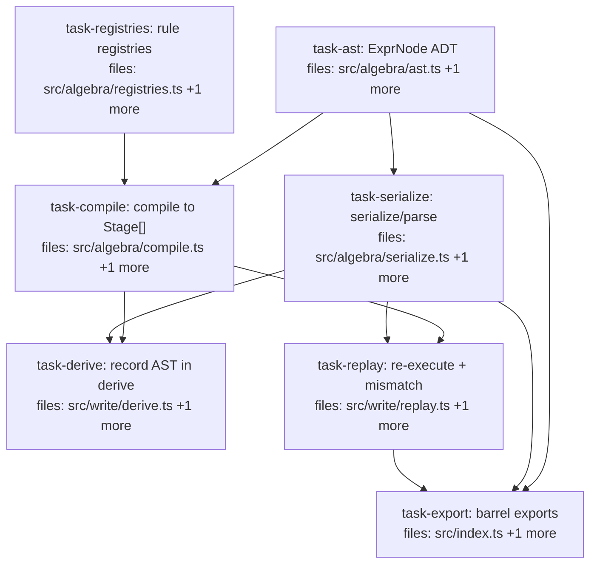

## Context

Implements the replay re-execution engine designed in
`docs/superpowers/specs/2026-05-28-replay-reexecution-engine-design.md` (spec §7.6).

Today `DerivationProvenance.queryExpression` is always `""` and `replayStatus` returns a
`"failed"` placeholder where it should re-execute and verify `"exact"`. This plan lands a
serializable algebra AST (`ExprNode`) as the single source of truth — compiled to the
existing `Stage[]` for execution, JSON-serialized into provenance, and re-executed under the
pinned `evaluationClock` to verify reproducibility. Adds a `mismatch` ReplayStatus and wires
`deriveClaimFrom` to record the AST + `corpusState`. Full operator coverage.

Decisions (from the design): AST-primary (compile to run); ε-tolerant structural match for
`exact`; new additive `mismatch` status. `Value` (from `src/core/value.ts`) is the
JSON-serializable type used for all inline data params.

Contract surface is clean: `deriveClaimFrom` has no production callers (only `derive.test.ts`),
and `replayStatus`/`ReplayStatus` are referenced only by `replay.test.ts` — both in-scope for
their owning task. `index.ts` exports neither today, so the barrel addition is purely additive.

Two roots (`task-ast`, `task-registries`) fan out; a diamond through `task-compile` /
`task-serialize`; then `task-derive` ∥ `task-replay`; then `task-export`.

## Tasks

## Task: Serializable ExprNode AST

```yaml
id: task-ast
depends_on: []
files:
  - src/algebra/ast.ts
  - src/algebra/ast.test.ts
status: pending
```

The serializable algebra AST: a discriminated union `ExprNode` covering the full operator
surface (§4 of the design), with thin node-constructor helpers. Plain JSON-able data — no
behavior. Function-valued params are inline data (`Predicate`, `DecayPolicy`, `Value`) or a
registry-name string (resolution policy, reweight fn).

## Implementation

```typescript
// src/algebra/ast.ts
import type { Predicate } from "./predicate.js";
import type { DecayPolicy } from "../catalog/corpus.js";
import type { Value } from "../core/value.js";
import type { Instant } from "../core/time.js";
import type { Claim } from "../core/claim.js";
import type { Format } from "./composition.js";

export type Field = keyof Claim;

export type ExprNode =
  | { op: "leaf"; corpusId: string }
  | { op: "sigma"; pred: Predicate; src: ExprNode }
  | { op: "tau"; mode: "valid" | "recorded" | "known" | "now"; t?: Instant; src: ExprNode }
  | { op: "delta"; policy: DecayPolicy; src: ExprNode }
  | { op: "pi"; fields: Field[]; src: ExprNode }
  | { op: "rho"; fn: string; query: Value; src: ExprNode }
  | { op: "gamma"; depth: number; src: ExprNode }
  | { op: "kappa"; fmt: Format; maxTokens: number; dedupThreshold?: number; src: ExprNode }
  | { op: "combine"; rule: string; params?: Value; src: ExprNode }
  | { op: "synthesize"; subject: string; key: string; rule: string; params?: Value; src: ExprNode }
  | { op: "resolve"; policy: string; rule?: string; src: ExprNode }
  | { op: "aggregate"; fn: string; reweight?: string; where?: Predicate; groupBy?: string; src: ExprNode };

export const leaf = (corpusId: string): ExprNode => ({ op: "leaf", corpusId });
export const sigma = (pred: Predicate, src: ExprNode): ExprNode => ({ op: "sigma", pred, src });
// ...one thin constructor per variant
```

```typescript
// src/algebra/ast.test.ts
import { leaf, sigma } from "./ast.js";

it("constructors build the discriminated shape", () => {
  const n = sigma({ op: "keyEq", value: "k" }, leaf("c"));
  expect(n).toEqual({ op: "sigma", pred: { op: "keyEq", value: "k" }, src: { op: "leaf", corpusId: "c" } });
});
```

## Acceptance criteria

- `ExprNode` is exported and covers all 12 operator variants from design §4.
- A thin constructor exists per variant; each returns the exact discriminated-union literal.
- Param types reuse existing types verbatim: `Predicate`, `DecayPolicy`, `Value`, `Instant`, `Format`, `Field = keyof Claim`.
- No runtime behavior beyond object construction; `tsc --noEmit` clean.

Test file: `src/algebra/ast.test.ts`.

## Task: Rule-function name registries

```yaml
id: task-registries
depends_on: []
files:
  - src/algebra/registries.ts
  - src/algebra/registries.test.ts
status: pending
```

Name→function registries for the operator families currently exposed only as bare consts, so
the AST can reference them by string and survive serialization (design §5). A shared
`MissingRule` error is thrown on unknown name; the replay path catches it and maps to
`unavailable_models`.

## Implementation

```typescript
// src/algebra/registries.ts
import {
  resolveDeprecateLower, resolveKeepBoth, resolveFlagForReview,
  resolveDeprecateMinority, resolvePromoteConsensus,
} from "./resolution.js";
import { resolveSynthesizeBelief } from "./synthesis.js";
import {
  reweightMultiply, reweightMultiplyMean, reweightWilsonFloor, reweightNormalize, reweightBoost,
} from "./aggregate-join.js";

export class MissingRule extends Error {
  constructor(public readonly family: string, public readonly name: string) {
    super(`missing ${family} rule: ${name}`);
  }
}

const RESOLUTIONS: Record<string, unknown> = {
  resolveDeprecateLower, resolveKeepBoth, resolveFlagForReview,
  resolveDeprecateMinority, resolvePromoteConsensus, resolveSynthesizeBelief,
};
export function resolutionRegistry(name: string) {
  const fn = RESOLUTIONS[name];
  if (!fn) throw new MissingRule("resolution", name);
  return fn;
}
// reweightRegistry(name) mirrors the same shape over REWEIGHTS
```

```typescript
// src/algebra/registries.test.ts
import { resolutionRegistry, reweightRegistry, MissingRule } from "./registries.js";

it("resolves a shipped resolution policy and throws MissingRule on unknown", () => {
  expect(resolutionRegistry("resolveKeepBoth")).toBeTypeOf("function");
  expect(() => resolutionRegistry("nope")).toThrow(MissingRule);
});
```

## Acceptance criteria

- `resolutionRegistry(name)` resolves all six shipped policies (`resolveDeprecateLower`, `resolveKeepBoth`, `resolveFlagForReview`, `resolveDeprecateMinority`, `resolvePromoteConsensus`, `resolveSynthesizeBelief`).
- `reweightRegistry(name)` resolves all five shipped reweight fns (`reweightMultiply`, `reweightMultiplyMean`, `reweightWilsonFloor`, `reweightNormalize`, `reweightBoost`).
- Unknown name throws `MissingRule` carrying `family` and `name`.
- No new rule logic is authored — registries only reference existing exports.

Test file: `src/algebra/registries.test.ts`.

## Task: Canonical ExprNode serialization

```yaml
id: task-serialize
depends_on: [task-ast]
files:
  - src/algebra/serialize.ts
  - src/algebra/serialize.test.ts
status: pending
```

Canonical serialization for `ExprNode`: `serializeExpr` produces a stable JSON string
(sorted object keys), `parseExpr` parses and structurally validates back into an `ExprNode`
(design §3). Because `ExprNode` is plain data, this is `JSON.stringify`/`JSON.parse` plus a
validation walk that rejects unknown `op` values.

## Implementation

```typescript
// src/algebra/serialize.ts
import type { ExprNode } from "./ast.js";

const KNOWN_OPS = new Set([
  "leaf","sigma","tau","delta","pi","rho","gamma","kappa","combine","synthesize","resolve","aggregate",
]);

export function serializeExpr(node: ExprNode): string {
  return JSON.stringify(canonicalize(node)); // canonicalize: recursively sort object keys
}

export function parseExpr(s: string): ExprNode {
  const raw = JSON.parse(s);
  return validateNode(raw); // throws on unknown op / missing required fields, recurses into src
}
```

```typescript
// src/algebra/serialize.test.ts
import { serializeExpr, parseExpr } from "./serialize.js";
import { sigma, leaf } from "./ast.js";

it("round-trips every node and is key-order stable", () => {
  const n = sigma({ op: "keyEq", value: "k" }, leaf("c"));
  expect(parseExpr(serializeExpr(n))).toEqual(n);
  expect(serializeExpr(n)).toBe(serializeExpr(JSON.parse(JSON.stringify(n))));
});
```

## Acceptance criteria

- `parseExpr(serializeExpr(n))` deep-equals `n` for every one of the 12 node variants.
- Output is canonical: serializing two structurally equal nodes with different key insertion order yields byte-identical strings.
- `parseExpr` throws on an unknown `op` and on a node missing a required field.
- Nested `src` chains are validated recursively.

Test file: `src/algebra/serialize.test.ts`.

## Task: compile ExprNode to executable Stage[]

```yaml
id: task-compile
depends_on: [task-ast, task-registries]
files:
  - src/algebra/compile.ts
  - src/algebra/compile.test.ts
status: pending
```

`compile(node): Stage[]` — the interpreter that walks the `src` chain to a flat, leaf-first
stage list, mapping each `ExprNode` to its existing operator closure (design §6). Pure
structural transform; no `EvalContext` at compile time (the context is threaded later by the
unchanged `evaluate`). Registry-name params are resolved here, throwing `MissingRule` on
unknown name.

## Implementation

```typescript
// src/algebra/compile.ts
import type { ExprNode } from "./ast.js";
import { type Stage, leaf as leafStage, liftOp, gammaStage } from "./expression.js";
import { sigma } from "./selection.js";
import { rho } from "./similarity.js";
import { resolutionRegistry } from "./registries.js";

export function compile(node: ExprNode): Stage<any, any>[] {
  switch (node.op) {
    case "leaf":  return [leafStage(node.corpusId)];
    case "sigma": return [...compile(node.src), liftOp(sigma(node.pred))];
    case "rho":   return [...compile(node.src), liftOp(rho(node.fn, node.query))];
    case "gamma": return [...compile(node.src), gammaStage(node.depth)];
    case "resolve": {
      const policy = resolutionRegistry(node.policy);
      return [...compile(node.src), liftOp((c: any) => (policy as any)(/* clusters/rule per resolver arity */)(c))];
    }
    // ...one arm per variant: tau, delta, pi, kappa, combine, synthesize, aggregate
  }
}
```

```typescript
// src/algebra/compile.test.ts
import { compile } from "./compile.js";
import { sigma, leaf } from "./ast.js";
import { MissingRule } from "./registries.js";

it("flattens leaf-first and resolves registry names", () => {
  const stages = compile(sigma({ op: "keyEq", value: "k" }, leaf("c")));
  expect(stages).toHaveLength(2);
  expect(() => compile({ op: "resolve", policy: "nope", src: leaf("c") })).toThrow(MissingRule);
});
```

## Acceptance criteria

- Each of the 12 node variants compiles to the expected stage(s), in leaf-first order.
- A compiled pipeline evaluates (via the existing `evaluate`) to the same result as the hand-built closure pipeline for at least one representative chain (e.g. σ→δ→resolve).
- Unknown registry name (`resolve`/`aggregate` with a bad rule) throws `MissingRule`.
- `compile` reads no `EvalContext`; the clock is still applied at evaluate time.

Test file: `src/algebra/compile.test.ts`.

## Task: Populate derive query provenance

```yaml
id: task-derive
depends_on: [task-compile, task-serialize]
files:
  - src/write/derive.ts
  - src/write/derive.test.ts
status: pending
```

Change `deriveClaimFrom` to take an `ExprNode` instead of a `Stage[]`, compile it internally,
and populate the provenance fields that were placeholders: `queryExpression` (was `""`) and
`corpusState` (was `0`), per design §7. Downstream representative/inputs/version-capture
logic is unchanged. The only caller is `derive.test.ts`, updated in the same task.

## Implementation

```typescript
// src/write/derive.ts (changed signature + provenance population)
import type { ExprNode } from "../algebra/ast.js";
import { compile } from "../algebra/compile.js";
import { serializeExpr } from "../algebra/serialize.js";
import { evaluate, type EvalContext } from "../algebra/expression.js";

export function deriveClaimFrom(
  adapter: StorageAdapter, catalog: Catalog, expr: ExprNode, opts: DeriveOptions
): CandidateClaim {
  const clock = opts.evaluationClock ?? Date.now();
  const ctx: EvalContext = { adapter, catalog, evaluationClock: clock, usedSimilarityVersions: {}, usedEmbeddingModelVersions: {} };
  const result = evaluate<Corpus>(compile(expr), ctx);
  // ...existing rep/inputClaims logic...
  return { /* ... */ provenance: { derivedFrom: {
    queryExpression: serializeExpr(expr),    // was ""
    corpusState: adapter.maxRecordedSeq(),   // was 0
    /* ...combinationRule, inputClaims, versions, evaluationClock as today... */
  } } } as CandidateClaim;
}
```

```typescript
// src/write/derive.test.ts (adapted to ExprNode input)
it("records a non-empty queryExpression and a real corpusState", () => {
  const cand = deriveClaimFrom(adapter, catalog, expr /* ExprNode */, { subject: "t", key: "t.k", scope: {}, evaluationClock: 1234 });
  expect(cand.provenance!.derivedFrom!.queryExpression).not.toBe("");
  expect(cand.provenance!.derivedFrom!.corpusState).toBe(adapter.maxRecordedSeq());
});
```

## Acceptance criteria

- `deriveClaimFrom` accepts an `ExprNode`; it compiles internally and evaluates exactly as before.
- `queryExpression` is the `serializeExpr(expr)` output (never `""`) for any derived claim.
- `corpusState` is `adapter.maxRecordedSeq()` (never `0`).
- Existing `derive.test.ts` assertions (rep selection, empty-pipeline throw, input-claim filtering) still pass, adapted to `ExprNode` inputs.

Test file: `src/write/derive.test.ts`.

## Task: Replay re-execution verification

```yaml
id: task-replay
depends_on: [task-compile, task-serialize]
files:
  - src/write/replay.ts
  - src/write/replay.test.ts
status: pending
```

Extend `replayStatus` to actually re-execute: parse `queryExpression`, compile, evaluate under
the pinned `evaluationClock` against the current adapter, and compare ε-tolerantly to the
recorded claim (design §8). Adds `mismatch` to `ReplayStatus`, a `"rule"` variant to
`MissingDependency.kind`, and a local `claimsEquivalent` helper. The existing degraded-path
checks stay first and unchanged.

## Implementation

```typescript
// src/write/replay.ts (extend)
import { compile } from "../algebra/compile.js";
import { parseExpr } from "../algebra/serialize.js";
import { MissingRule } from "../algebra/registries.js";
import { evaluate } from "../algebra/expression.js";

export type ReplayStatus =
  | "exact" | "mismatch" | "unavailable_models" | "missing_inputs" | "integrity_unknown" | "failed";

function claimsEquivalent(a: Claim, b: Claim, eps = 1e-9): boolean {
  // compares value (deep-equal; numeric leaves within eps) + confidence Beta (alpha,beta within eps)
}

export function replayStatus(claim: Claim, adapter: StorageAdapter): ReplayResult {
  // 1..4: existing integrity_unknown / missing_inputs / unavailable_models checks (unchanged),
  //       plus queryExpression === "" -> integrity_unknown
  // 5: re-execute
  try {
    const recomputed = evaluate<Corpus>(compile(parseExpr(d.queryExpression)), { adapter, catalog, evaluationClock: d.evaluationClock });
    const rep = recomputed.claims[recomputed.claims.length - 1];
    return claimsEquivalent(rep, claim)
      ? { status: "exact", result: rep, missingDependencies: [] }
      : { status: "mismatch", result: rep, missingDependencies: [] };
  } catch (e) {
    if (e instanceof MissingRule) return { status: "unavailable_models", missingDependencies: [{ kind: "rule", id: `${e.family}:${e.name}` }] };
    return { status: "failed", missingDependencies: [] };
  }
}
```

```typescript
// src/write/replay.test.ts (extend)
// Self-contained: build the recorded claim directly via serializeExpr (no deriveClaimFrom
// dependency, so this task stays parallel with task-derive). Insert inputs + a recorded
// claim whose provenance.queryExpression is the serialized AST, then replay.
import { serializeExpr } from "../algebra/serialize.js";

it("returns exact when re-execution reproduces the recorded claim", () => {
  const expr = /* ExprNode over corpus 'c' */;
  const recorded = makeRecordedClaim({ queryExpression: serializeExpr(expr), evaluationClock: 7, inputClaims: [/*ids*/] });
  adapter.insertBatch([/* the input claims */, recorded]);
  expect(replayStatus(recorded, adapter).status).toBe("exact");
});

it("returns mismatch when a contributing claim is perturbed after recording", () => {
  // mutate an input claim's value in the adapter, then replay the original recorded claim
  const res = replayStatus(recorded, adapter);
  expect(res.status).toBe("mismatch");
  expect(res.result).toBeDefined();
});
```

## Acceptance criteria

- `ReplayStatus` gains `"mismatch"`; `MissingDependency.kind` gains `"rule"`.
- A recorded claim whose serialized query re-executes to the same payload returns `exact` with `result` set to the recomputed claim.
- Perturbing a contributing input claim after recording yields `mismatch` with the recomputed claim in `result`.
- A query referencing an unregistered rule yields `unavailable_models` with a `kind:"rule"` missing dependency.
- All pre-existing degraded-path tests (`integrity_unknown`, `missing_inputs`, `unavailable_models` for similarity, the `not exact` scenario) still pass.
- `evaluationClock` from provenance is used for re-execution (no decay drift).

Test file: `src/write/replay.test.ts`.

## Task: barrel-export the replay engine public surface

```yaml
id: task-export
depends_on: [task-ast, task-serialize, task-replay]
files:
  - src/index.ts
  - src/index.test.ts
status: pending
is_wiring_task: true
```

Additive barrel re-exports (spec §13) for the new public surface: the `ExprNode` type and node
constructors, `serializeExpr`/`parseExpr`, and `replayStatus`/`ReplayStatus`/`ReplayResult`.
Pre-existing exports are unchanged.

## Acceptance criteria

- `import type { ExprNode, ReplayStatus, ReplayResult } from "<root>"` resolves.
- The AST node constructors, `serializeExpr`, `parseExpr`, and `replayStatus` are exported as values from the package root.
- All pre-existing root exports remain unchanged; `tsc --noEmit` clean.

Test file: `src/index.test.ts`.
