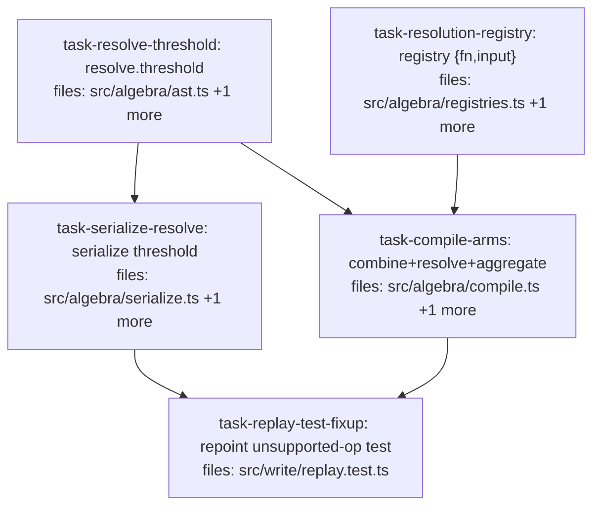

## Context

Implements `docs/superpowers/specs/2026-05-29-compile-dedupe-resolve-design.md`: make the
replay engine's `compile` cover the operators it currently rejects with `UnsupportedExprOp`.

- **`combine`** → implement as `⊕_dedupe` (spec §4.9), mapped to `oplusDedupe(rule, params)`.
  Compile-only; the op keeps its name (documented `combine ≡ ⊕_dedupe`). No rename.
- **`resolve`** → implement (spec §4.8). Add a recorded `threshold` to the node; the
  resolution registry gains per-policy input-kind (`pairs`/`clusters`); compile derives the
  input via `pairsOf`/`clustersOf` and applies the policy.
- **`aggregate`** → stays serializable; compile throws a documented `UnsupportedExprOp`
  (read-time terminal `AggregateResult`, §4.13 — not a replayable claim query).

All operator behavior was empirically audited (8/8) against the real library before this plan:
`oplusDedupe` collapses same-`(subject,key,scope)` claims; all six resolve policies run via the
correct `pairs`/`clusters` input + threshold and return a `Corpus`.

**Shape:** two roots (`task-resolve-threshold`, `task-resolution-registry`) fan out; then
`task-serialize-resolve` ∥ `task-compile-arms`; then `task-replay-test-fixup`. File-disjoint
throughout. The replay-test fixup is required because `src/write/replay.test.ts` uses `resolve`
as its example unsupported op — once `resolve` compiles, it must point at `aggregate` instead.

## Tasks

## Task: Resolve node threshold field

```yaml
id: task-resolve-threshold
depends_on: []
files:
  - src/algebra/ast.ts
  - src/algebra/ast.test.ts
status: pending
```

Add a recorded `threshold: number` to the `resolve` ExprNode so the contradiction
grouping threshold is captured in the serialized query (replay determinism). The `resolve(...)`
constructor defaults it via `DEFAULT_RESOLVE_THRESHOLD` so it is always present. Also add a doc
comment that `combine ≡ ⊕_dedupe` (spec §4.9). No other operators change.

## Implementation

```typescript
// src/algebra/ast.ts
export const DEFAULT_RESOLVE_THRESHOLD = 0.5;

// resolve variant gains a required threshold:
//   | { op: "resolve"; policy: string; threshold: number; rule?: string; src: ExprNode }

export const resolve = (
  policy: string,
  src: ExprNode,
  rule?: string,
  threshold: number = DEFAULT_RESOLVE_THRESHOLD,
): ExprNode =>
  rule !== undefined
    ? { op: "resolve", policy, threshold, rule, src }
    : { op: "resolve", policy, threshold, src };

// combine variant unchanged; add a doc comment above it: `combine` is ⊕_dedupe (§4.9).
```

```typescript
// src/algebra/ast.test.ts — resolve constructor now records threshold
it("resolve records a default threshold", () => {
  expect(resolve("resolveKeepBoth", leaf("c"))).toEqual({
    op: "resolve", policy: "resolveKeepBoth", threshold: 0.5, src: { op: "leaf", corpusId: "c" },
  });
});
```

## Acceptance criteria

- The `resolve` ExprNode variant has a required `threshold: number`.
- `DEFAULT_RESOLVE_THRESHOLD` (= `0.5`) is exported; `resolve(policy, src)` defaults `threshold` to it.
- `resolve(policy, src, rule, threshold)` records the supplied `threshold` and `rule`.
- Existing `ast.test.ts` assertions that build `resolve` nodes are updated to include `threshold`; `tsc --noEmit` clean.

Test file: `src/algebra/ast.test.ts`.

## Task: Resolution registry input-kind metadata

```yaml
id: task-resolution-registry
depends_on: []
files:
  - src/algebra/registries.ts
  - src/algebra/registries.test.ts
status: pending
```

Change `resolutionRegistry(name)` to return `{ fn, input: "pairs" | "clusters" }` so `compile`
knows whether a policy consumes contradiction pairs or clusters. (No current production consumer
— only the registry's own test asserts the old shape, updated here.)

## Implementation

```typescript
// src/algebra/registries.ts
import {
  resolveDeprecateLower, resolveKeepBoth, resolveFlagForReview,
  resolveDeprecateMinority, resolvePromoteConsensus,
} from "./resolution.js";
import { resolveSynthesizeBelief } from "./synthesis.js";

export type ResolutionInput = "pairs" | "clusters";
export interface ResolutionEntry { fn: unknown; input: ResolutionInput; }

const RESOLUTIONS: Record<string, ResolutionEntry> = {
  resolveDeprecateLower:    { fn: resolveDeprecateLower,    input: "pairs" },
  resolveKeepBoth:          { fn: resolveKeepBoth,          input: "pairs" },
  resolveFlagForReview:     { fn: resolveFlagForReview,     input: "pairs" },
  resolveDeprecateMinority: { fn: resolveDeprecateMinority, input: "clusters" },
  resolvePromoteConsensus:  { fn: resolvePromoteConsensus,  input: "clusters" },
  resolveSynthesizeBelief:  { fn: resolveSynthesizeBelief,  input: "clusters" },
};

export function resolutionRegistry(name: string): ResolutionEntry {
  if (!Object.hasOwn(RESOLUTIONS, name)) throw new MissingRule("resolution", name);
  return RESOLUTIONS[name];
}
```

```typescript
// src/algebra/registries.test.ts — updated to the {fn,input} shape
it("resolutionRegistry returns fn + input-kind per policy", () => {
  expect(resolutionRegistry("resolveKeepBoth").input).toBe("pairs");
  expect(resolutionRegistry("resolveDeprecateMinority").input).toBe("clusters");
  expect(typeof resolutionRegistry("resolveSynthesizeBelief").fn).toBe("function");
});
```

## Acceptance criteria

- `resolutionRegistry(name)` returns `{ fn, input }` for all six policies, with `input` = `"pairs"` for `resolveDeprecateLower`/`resolveKeepBoth`/`resolveFlagForReview` and `"clusters"` for `resolveDeprecateMinority`/`resolvePromoteConsensus`/`resolveSynthesizeBelief`.
- Unknown name still throws `MissingRule` (own-property guard via `Object.hasOwn` preserved).
- `registries.test.ts` is updated to the new return shape; `reweightRegistry` and `MissingRule` behavior unchanged.

Test file: `src/algebra/registries.test.ts`.

## Task: Serialize resolve threshold field

```yaml
id: task-serialize-resolve
depends_on: [task-resolve-threshold]
files:
  - src/algebra/serialize.ts
  - src/algebra/serialize.test.ts
status: pending
```

Teach `parseExpr` that a `resolve` node requires `threshold`, so a serialized resolve query
round-trips and a malformed one (missing `threshold`) is rejected. `combine` and `aggregate`
serialization are unchanged.

## Implementation

```typescript
// src/algebra/serialize.ts — REQUIRED_FIELDS for resolve gains "threshold"
//   resolve: ["policy", "threshold", "src"]
// (combine and aggregate entries unchanged; KNOWN_OPS unchanged.)
```

```typescript
// src/algebra/serialize.test.ts
import { resolve, leaf } from "./ast.js";
it("round-trips a resolve node with threshold", () => {
  const n = resolve("resolveKeepBoth", leaf("c"), undefined, 0.3);
  expect(serializeExpr(parseExpr(serializeExpr(n)))).toBe(serializeExpr(n));
});
it("rejects a resolve node missing threshold", () => {
  expect(() => parseExpr('{"op":"resolve","policy":"resolveKeepBoth","src":{"op":"leaf","corpusId":"c"}}')).toThrow();
});
```

## Acceptance criteria

- `REQUIRED_FIELDS["resolve"]` includes `threshold`.
- A `resolve` node (built via the constructor) round-trips through `serializeExpr`/`parseExpr`.
- `parseExpr` throws on a `resolve` object missing `threshold`.
- `combine` and `aggregate` still round-trip (existing assertions preserved).

Test file: `src/algebra/serialize.test.ts`.

## Task: Compile the remaining operator arms

```yaml
id: task-compile-arms
depends_on: [task-resolve-threshold, task-resolution-registry]
files:
  - src/algebra/compile.ts
  - src/algebra/compile.test.ts
status: pending
```

Implement the `combine` arm (→ `oplusDedupe`) and the `resolve` arm (pairs/clusters + threshold
via the registry), and make `aggregate` throw a documented `UnsupportedExprOp`. The
exhaustiveness `default: never` guard stays.

## Implementation

```typescript
// src/algebra/compile.ts (the three arms)
import { oplusDedupe } from "./combination.js";
import { pairsOf, clustersOf } from "./contradiction.js";
import { resolutionRegistry } from "./registries.js";
import type { Corpus } from "./types.js";

    case "combine": // ⊕_dedupe (§4.9): collapse same-(subject,key,scope) claims via the rule
      return [...compile(node.src), liftOp(oplusDedupe(node.rule, node.params))];

    case "resolve": {
      const { fn, input } = resolutionRegistry(node.policy); // throws MissingRule on unknown
      const apply = fn as (g: unknown, rule?: string) => (c: Corpus) => Corpus;
      return [...compile(node.src), (c: Corpus) => {
        const groups = input === "pairs" ? pairsOf(c, node.threshold) : clustersOf(c, node.threshold);
        return apply(groups, node.rule)(c);
      }];
    }

    case "aggregate":
      // read-time terminal (AggregateResult, §4.13) — not a replayable claim query
      throw new UnsupportedExprOp("aggregate");
```

```typescript
// src/algebra/compile.test.ts
import { evaluate } from "./expression.js";
import { combine, resolve, aggregate, leaf } from "./ast.js";
import { oplusDedupe } from "./combination.js";

it("compiles combine to a dedupe pipeline equal to oplusDedupe", () => {
  // seed a corpus with two same-(subject,key,scope) claims; compare evaluate(compile(combine(...)))
  // to evaluate([leafStage, liftOp(oplusDedupe(rule))]) — identical resulting corpus.
});

it("compiles each resolve policy using the correct pairs/clusters input + threshold", () => {
  // for a pairs policy and a clusters policy: evaluate(compile(resolve(policy, leaf(c), rule, t)))
  // equals the hand-built fn(pairsOf|clustersOf(corpus, t), rule)(corpus).
});

it("throws UnsupportedExprOp for aggregate", () => {
  expect(() => compile(aggregate("count", leaf("c")))).toThrow(UnsupportedExprOp);
});
```

## Acceptance criteria

- `combine` compiles to `liftOp(oplusDedupe(rule, params))`; evaluating it equals a hand-built `oplusDedupe` over a seeded corpus.
- Each of the six `resolve` policies compiles; the compiled stage uses `pairsOf` for pairs-policies and `clustersOf` for clusters-policies, threads `node.threshold`, and evaluates equal to the hand-built `fn(groups, rule)(corpus)`.
- `aggregate` throws `UnsupportedExprOp`; the pre-existing `resolve`-throws assertions are removed (resolve now compiles).
- The `default: never` exhaustiveness guard remains; unknown resolve policy throws `MissingRule`.

Test file: `src/algebra/compile.test.ts`.

## Task: Repoint replay unsupported-op test to aggregate

```yaml
id: task-replay-test-fixup
depends_on: [task-compile-arms, task-serialize-resolve]
files:
  - src/write/replay.test.ts
status: pending
```

`replay.test.ts` has a test that uses `resolve` as the example op that `compile` rejects.
Now that `resolve` compiles, repoint that test to `aggregate` (which remains the documented
unsupported op), so it still verifies the `UnsupportedExprOp → "failed"` replay path.

## Implementation

```typescript
// src/write/replay.test.ts — BEFORE (resolve is no longer unsupported)
const qe = JSON.stringify({
  op: "resolve",
  policy: "resolveKeepBoth",
  src: { op: "leaf", corpusId: "c" },
});
```

```typescript
// src/write/replay.test.ts — AFTER (aggregate is the remaining unsupported op)
const qe = JSON.stringify({
  op: "aggregate",
  fn: "count",
  src: { op: "leaf", corpusId: "c" },
});
// (test title/comment updated to name aggregate as the read-terminal op compile rejects)
```

## Acceptance criteria

- The "returns failed when queryExpression encodes an unsupported op" test uses an `aggregate` query (not `resolve`) and still asserts the replay status is `"failed"`.
- No other `resolve` literals in `replay.test.ts` rely on resolve being unsupported.
- Full suite green; `tsc --noEmit` clean.

Test file: `src/write/replay.test.ts`.
