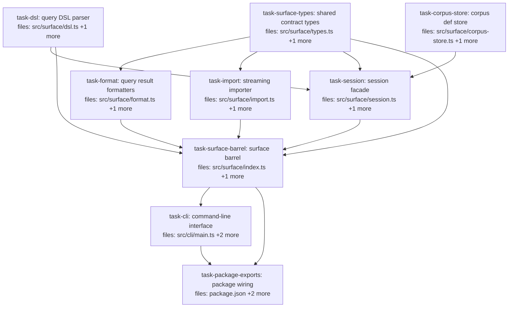

## Context

Driven by `docs/superpowers/specs/2026-05-29-mneme-usable-surface-design.md`
(Approach A: ergonomic core + CLI + bulk importer, single package with subpath
exports, MCP/HTTP deferred as a seam).

Mneme is a feature-complete library but has no hand-drivable surface. This plan
adds two new subsystems under the existing `mneme` package:

- **`mneme/surface`** — a `Session` facade over `createMneme()` plus a query
  DSL, a streaming dataset importer, and result formatters. The reusable asset.
- **`mneme/cli`** — a thin command shell over `mneme/surface`.

Dependency rule is strictly one-way: `cli → surface → core`. Boundaries are
enforced by subpath `exports` in `package.json`, not a monorepo.

**Discovered constraint (load-bearing):** `createMneme` constructs its corpus
catalog in memory (`new Catalog(availableTiers)` in `src/mneme.ts:241`); the
SQLite adapter persists *claims* but not corpus *definitions*. For a persisted
`./mneme.db` driven across separate CLI invocations, corpus defs must be
persisted and re-registered on open. `task-corpus-store` owns that I/O; the
session re-registers on `openSession`.

**Contract ownership:** all cross-module data types (`WriteRecord`,
`ImportStats`, `Session`, `QueryResult`, etc.) live in `src/surface/types.ts`
so `session`, `import`, and `format` share one definition rather than each
inventing its own (avoids drift between parallel implementers).

No new runtime dependencies: the DSL parser is hand-rolled and the CLI uses
`node:util.parseArgs`.

## Tasks

## Task: shared surface contract types

```yaml
id: task-surface-types
depends_on: []
files:
  - src/surface/types.ts
  - src/surface/types.test.ts
status: pending
```

Defines the contract surface every other surface module consumes: the
boilerplate-free `WriteRecord` write input, `ImportStats`, the `Session`
interface, the `QueryResult` union, ergonomic `CorpusSpec`/`SessionOptions`,
and shared default constants. Pure types plus a small defaults helper so the
module has runtime behavior to test. Per spec "Module: session.ts" and
"Contract ownership" note.

## Implementation

```typescript
// src/surface/types.ts
import type { Source, Status, Claim } from "../core/claim.js";
import type { Value } from "../core/value.js";
import type { Confidence } from "../core/confidence.js";
import type { Scope } from "../core/scope.js";
import type { Interval } from "../core/time.js";
import type { Corpus, RankedCorpus, ComposedContext } from "../algebra/types.js";
import type { AggregateResult } from "../algebra/aggregation.js";
import type { Mneme } from "../mneme.js";

/** Boilerplate-free write input; the session fills the rest of CandidateClaim. */
export interface WriteRecord {
  subject: string;
  key: string;
  value: Value;
  confidence?: number | Confidence; // bare number => scalar p
  scope?: Scope;
  valid?: Interval;
  source?: Source;
  status?: Status;
  tags?: string[];
}

export interface WriteOutcome {
  id: string;
  status: "committed" | "rejected" | "duplicate";
}

export interface ImportStats {
  total: number; committed: number; rejected: number; duplicate: number;
  skipped: number; elapsedMs: number; claimsPerSec: number;
}

/** Ergonomic corpus creation input; the session expands it to a full CorpusDef. */
export interface CorpusSpec {
  id: string;
  displayName?: string;
  subjects?: string[];
  scopeFields?: Record<string, unknown>;
  schemaVersion?: string;
}

export interface SessionOptions {
  dbPath?: string; writer?: string; profile?: string;
  workspace?: string; source?: Source;
}

export type QueryResult = Corpus | RankedCorpus | ComposedContext | AggregateResult;

export interface Session {
  readonly mneme: Mneme; // escape hatch to the raw facade
  createCorpus(spec: CorpusSpec): void;
  listCorpora(): { id: string; displayName: string }[];
  inspectCorpus(corpusId: string): unknown;
  write(corpusId: string, rec: WriteRecord): WriteOutcome;
  writeMany(corpusId: string, recs: Iterable<WriteRecord>, opts?: { batchSize?: number }): ImportStats;
  q(corpusId: string, dsl: string): QueryResult;
  inspect(corpusId: string, claimId: string): Claim | undefined;
  replay(corpusId: string, claimId: string): { status: string };
  close(): void;
}

export const SURFACE_DEFAULTS = {
  dbPath: "./mneme.db",
  writer: "cli",
  profile: "cli",
  source: "manual" as Source,
  importSource: "imported" as Source,
  schemaVersion: "1",
  validInterval: { from: 0, to: Infinity } as Interval,
} as const;

/** Default confidence when a WriteRecord omits it: full scalar certainty. */
export function defaultConfidence(): Confidence {
  return { distribution: "scalar", parameters: { p: 1 }, raw: 1 };
}
```

```typescript
// src/surface/types.test.ts
import { describe, it, expect } from "vitest";
import { SURFACE_DEFAULTS, defaultConfidence } from "./types.js";

describe("surface defaults", () => {
  it("defaults to a persisted file db (not :memory:)", () => {
    expect(SURFACE_DEFAULTS.dbPath).toBe("./mneme.db");
  });
  it("defaults confidence to full scalar certainty", () => {
    expect(defaultConfidence()).toEqual({ distribution: "scalar", parameters: { p: 1 }, raw: 1 });
  });
});
```

## Acceptance criteria

- `SURFACE_DEFAULTS.dbPath === "./mneme.db"` (persisted, not `:memory:`).
- `defaultConfidence()` returns `{ distribution: "scalar", parameters: { p: 1 }, raw: 1 }`.
- `WriteRecord`, `ImportStats`, `Session`, `QueryResult`, `CorpusSpec`,
  `SessionOptions`, `WriteOutcome` are exported and resolve against existing
  core/algebra type imports (`tsc --noEmit` passes).

Test file: `src/surface/types.test.ts`.

## Task: query DSL parser

```yaml
id: task-dsl
depends_on: []
files:
  - src/surface/dsl.ts
  - src/surface/dsl.test.ts
status: pending
```

Compiles a terse, pipe-separated DSL string into an evaluable `Stage[]` using
the existing algebra stage builders. `from <corpus>` is implicit (passed as an
argument). Covers the common read shapes from spec "Module: dsl.ts"; exotic
queries fall back to `session.mneme.query(...)`. Parser is hand-rolled, no new
dependency.

## Implementation

```typescript
// src/surface/dsl.ts
import { pipe, leaf, sigma, rho, kappa, delta, tau, alpha } from "../index.js";
import type { Stage } from "../algebra/expression.js";
import type { Predicate } from "../algebra/predicate.js";

const GRAMMAR = `supported clauses:
  where subject = <s> | where key = <k> | where status = <st> | where confidence > <n>
  rank jaccard "<q>" | rank exact "<q>"
  decay exp <halfLifeDays> | decay none
  as markdown <maxTokens> | as xml <n> | as json <n> | as text <n>
  count`;

/** Compile a DSL string against a corpus into an evaluable pipeline. */
export function parseDsl(corpusId: string, dsl: string): Stage<any, any>[] {
  const stages: Stage<any, any>[] = [leaf(corpusId)];
  for (const clause of dsl.split("|").map((s) => s.trim()).filter(Boolean)) {
    stages.push(compileClause(clause));
  }
  return pipe(...stages);
}

function compileClause(clause: string): Stage<any, any> {
  const m = (re: RegExp) => clause.match(re);
  let g: RegExpMatchArray | null;
  if ((g = m(/^where subject\s*=\s*(.+)$/))) return sigma({ op: "subjectEq", value: g[1].trim() });
  if ((g = m(/^where key\s*=\s*(.+)$/)))     return sigma({ op: "keyEq", value: g[1].trim() });
  if ((g = m(/^rank jaccard\s+"(.*)"$/)))     return rho.jaccard(g[1]);
  if ((g = m(/^as markdown\s+(\d+)$/)))       return kappa.markdown(Number(g[1]));
  if ((g = m(/^as text\s+(\d+)$/)))           return kappa.text(Number(g[1]));
  if ((g = m(/^decay exp\s+(\d+(?:\.\d+)?)$/))) return delta.exponential(Number(g[1]));
  if (clause === "count")                     return alpha.count();
  // ... remaining forms per GRAMMAR
  throw new Error(`unknown clause: "${clause}"\n${GRAMMAR}`);
}
```

```typescript
// src/surface/dsl.test.ts
import { describe, it, expect } from "vitest";
import { parseDsl } from "./dsl.js";

describe("parseDsl", () => {
  it("compiles select + rank + compose into leaf + 3 stages", () => {
    const stages = parseDsl("c", `where subject = host:web-01 | rank jaccard "status" | as markdown 2000`);
    expect(stages).toHaveLength(4);
  });
  it("throws with a grammar hint on an unknown clause", () => {
    expect(() => parseDsl("c", "frobnicate x")).toThrow(/unknown clause/i);
  });
});
```

## Acceptance criteria

- `parseDsl("c", "")` returns `[leaf("c")]` (length 1).
- A 3-clause DSL produces a 4-stage pipeline (leaf + one stage per clause).
- `where subject = X` → `sigma({op:"subjectEq",value:"X"})`; `rank jaccard "q"`
  → `rho.jaccard("q")`; `as markdown 2000` → `kappa.markdown(2000)`;
  `count` → `alpha.count()`.
- An unrecognized clause throws an `Error` whose message includes
  `unknown clause` and the supported grammar.

Test file: `src/surface/dsl.test.ts`.

## Task: corpus definition store

```yaml
id: task-corpus-store
depends_on: []
files:
  - src/surface/corpus-store.ts
  - src/surface/corpus-store.test.ts
status: pending
```

Persists corpus definitions to a JSON sidecar next to the SQLite db so they
survive across CLI invocations (the in-memory catalog does not). Isolates all
sidecar file I/O here so the session never touches `fs` directly (separation of
concerns). Per the "Discovered constraint" context note.

## Implementation

```typescript
// src/surface/corpus-store.ts
import { readFileSync, writeFileSync, existsSync } from "node:fs";
import type { CorpusDef } from "../index.js";

const sidecarFor = (dbPath: string): string => `${dbPath}.corpora.json`;

/** Load persisted corpus defs for a db; empty array if the sidecar is absent. */
export function loadCorpora(dbPath: string): CorpusDef[] {
  const p = sidecarFor(dbPath);
  if (!existsSync(p)) return [];
  return JSON.parse(readFileSync(p, "utf8")) as CorpusDef[];
}

/** Persist the full set of corpus defs for a db (atomic overwrite). */
export function saveCorpora(dbPath: string, defs: CorpusDef[]): void {
  writeFileSync(sidecarFor(dbPath), JSON.stringify(defs, null, 2), "utf8");
}
```

```typescript
// src/surface/corpus-store.test.ts
import { describe, it, expect } from "vitest";
import { mkdtempSync } from "node:fs";
import { tmpdir } from "node:os";
import { join } from "node:path";
import { loadCorpora, saveCorpora } from "./corpus-store.js";

describe("corpus-store", () => {
  it("returns [] when no sidecar exists, then round-trips defs", () => {
    const db = join(mkdtempSync(join(tmpdir(), "mneme-")), "t.db");
    expect(loadCorpora(db)).toEqual([]);
    saveCorpora(db, [{ id: "c", displayName: "C" } as CorpusDef]);
    expect(loadCorpora(db).map((d) => d.id)).toEqual(["c"]);
  });
});
```

## Acceptance criteria

- `loadCorpora(db)` returns `[]` when the sidecar file does not exist.
- `saveCorpora(db, defs)` then `loadCorpora(db)` round-trips the defs by `id`.
- The sidecar path is `<dbPath>.corpora.json`.
- No module other than `corpus-store.ts` imports `node:fs` within `src/surface/`.

Test file: `src/surface/corpus-store.test.ts`.

## Task: query result formatters

```yaml
id: task-format
depends_on: [task-surface-types]
files:
  - src/surface/format.ts
  - src/surface/format.test.ts
status: pending
```

Pure functions that render a `QueryResult` (any arm of the union) into a
human-readable string for the CLI: unwrap `ComposedContext` to its content,
pretty-print `AggregateResult` groups, and one-line each `Claim`. Per spec
"Result formatters".

## Implementation

```typescript
// src/surface/format.ts
import type { QueryResult } from "./types.js";
import type { Claim } from "../core/claim.js";
import { pointEstimate } from "../core/confidence.js";

/** Render any QueryResult arm to a human-readable string. */
export function formatQueryResult(r: QueryResult): string {
  if ("content" in r) return r.content;                                   // ComposedContext
  if ("groups" in r) return formatAggregate(r);                           // AggregateResult
  if ("scored" in r) return r.scored.map((s) => formatClaim(s.claim)).join("\n"); // RankedCorpus
  if ("claims" in r) return r.claims.map(formatClaim).join("\n");         // Corpus
  return JSON.stringify(r, null, 2);
}

export function formatClaim(c: Claim): string {
  const conf = pointEstimate(c.confidence).toFixed(3);
  return `${c.subject} ${c.key} = ${JSON.stringify(c.value)}  [${c.status} p=${conf}]`;
}

function formatAggregate(r: QueryResult & { groups: Map<string, { value: unknown }> }): string {
  return [...r.groups.entries()].map(([k, v]) => `${k}: ${JSON.stringify(v.value)}`).join("\n");
}
```

```typescript
// src/surface/format.test.ts
import { describe, it, expect } from "vitest";
import { formatQueryResult } from "./format.js";

describe("formatQueryResult", () => {
  it("unwraps ComposedContext to its content string", () => {
    const out = formatQueryResult({ format: "markdown", content: "# hi", tokenCount: 2 } as never);
    expect(out).toBe("# hi");
  });
  it("renders an empty Corpus as an empty string", () => {
    expect(formatQueryResult({ claims: [] } as never)).toBe("");
  });
});
```

## Acceptance criteria

- A `ComposedContext` formats to exactly its `.content`.
- A `Corpus` formats to one line per claim via `formatClaim`; empty corpus → `""`.
- `formatClaim` includes subject, key, value, status, and point-estimate confidence.
- An `AggregateResult` formats one line per group.

Test file: `src/surface/format.test.ts`.

## Task: streaming dataset importer

```yaml
id: task-import
depends_on: [task-surface-types]
files:
  - src/surface/import.ts
  - src/surface/import.test.ts
status: pending
```

Streams a JSONL file line-by-line (never loading it whole), maps each row to a
`WriteRecord` via a preset or custom mapper, buffers to `batchSize`, flushes
through `session.writeMany`, and accumulates `ImportStats`. Consumes the
`Session` *interface* from `types.ts`, so it builds in parallel with the
session implementation. Per spec "Module: import.ts". Raw ConceptNet/ICEWS
dumps are expected pre-converted to JSONL (one JSON object per line); a one-line
`jq`/`awk` conversion suffices — documented in acceptance.

## Implementation

```typescript
// src/surface/import.ts
import { createReadStream } from "node:fs";
import { createInterface } from "node:readline";
import type { Session, WriteRecord, ImportStats } from "./types.js";

export type RowMapper = (row: unknown) => WriteRecord | null; // null => skip row

const clamp01 = (n: number) => Math.max(0, Math.min(1, n));

export const mappers: Record<"jsonl" | "conceptnet" | "icews", RowMapper> = {
  jsonl: (row) => row as WriteRecord,
  conceptnet: (row) => {
    const r = row as { start: string; rel: string; end: string; weight?: number };
    const p = clamp01(r.weight ?? 1);
    return { subject: r.start, key: r.rel, value: r.end, source: "imported",
      confidence: { distribution: "scalar", parameters: { p }, raw: p } };
  },
  icews: (row) => {
    const r = row as { subject: string; relation: string; object: string; timestamp: number };
    return { subject: r.subject, key: r.relation, value: r.object, source: "imported",
      valid: { from: Number(r.timestamp), to: Infinity } };
  },
};

/** Stream a JSONL file into a corpus; returns accumulated stats. */
export async function importFile(
  session: Session, corpusId: string, filePath: string,
  opts: { format: "jsonl" | "conceptnet" | "icews"; batchSize?: number; map?: RowMapper; onProgress?: (n: number) => void },
): Promise<ImportStats> {
  const map = opts.map ?? mappers[opts.format];
  const batchSize = opts.batchSize ?? 1000;
  const started = Date.now();
  const acc: ImportStats = { total: 0, committed: 0, rejected: 0, duplicate: 0, skipped: 0, elapsedMs: 0, claimsPerSec: 0 };
  let buf: WriteRecord[] = [];
  const flush = () => {
    if (buf.length === 0) return;
    const s = session.writeMany(corpusId, buf);
    acc.committed += s.committed; acc.rejected += s.rejected; acc.duplicate += s.duplicate;
    buf = [];
  };
  const rl = createInterface({ input: createReadStream(filePath, "utf8"), crlfDelay: Infinity });
  for await (const line of rl) {
    if (!line.trim()) continue;
    acc.total++;
    let rec: WriteRecord | null = null;
    try { rec = map(JSON.parse(line)); } catch { acc.skipped++; continue; }
    if (!rec) { acc.skipped++; continue; }
    buf.push(rec);
    if (buf.length >= batchSize) { flush(); opts.onProgress?.(acc.total); }
  }
  flush();
  acc.elapsedMs = Date.now() - started;
  acc.claimsPerSec = acc.elapsedMs > 0 ? Math.round((acc.committed / acc.elapsedMs) * 1000) : 0;
  return acc;
}
```

```typescript
// src/surface/import.test.ts
import { describe, it, expect } from "vitest";
import { mappers } from "./import.js";

describe("preset mappers", () => {
  it("maps a conceptnet row, weight -> scalar confidence", () => {
    const r = mappers.conceptnet({ start: "dog", rel: "IsA", end: "animal", weight: 0.8 });
    expect(r).toMatchObject({ subject: "dog", key: "IsA", value: "animal" });
    expect(r!.confidence).toEqual({ distribution: "scalar", parameters: { p: 0.8 }, raw: 0.8 });
  });
  it("maps an icews row, timestamp -> valid.from", () => {
    const r = mappers.icews({ subject: "A", relation: "meets", object: "B", timestamp: 42 });
    expect(r).toMatchObject({ subject: "A", key: "meets", value: "B", valid: { from: 42, to: Infinity } });
  });
});
```

## Acceptance criteria

- `mappers.conceptnet` maps `{start,rel,end,weight}` → a `WriteRecord` with
  `weight` clamped to `[0,1]` as scalar confidence.
- `mappers.icews` maps `{subject,relation,object,timestamp}` → a record with
  `valid.from = timestamp`.
- `mappers.jsonl` passes a parsed object through unchanged.
- A malformed JSON line increments `skipped` and does not abort the run.
- `importFile` of an N-line fixture returns `total === N` and
  `committed + rejected + duplicate + skipped === N`, with `claimsPerSec`
  computed from `committed / elapsedMs`.
- End-to-end: importing a small JSONL fixture into a corpus makes those claims
  queryable afterward (verified against a real `Session`).

Test file: `src/surface/import.test.ts`.

## Task: session facade

```yaml
id: task-session
depends_on: [task-surface-types, task-dsl, task-corpus-store]
files:
  - src/surface/session.ts
  - src/surface/session.test.ts
status: pending
```

`openSession(opts)` opens a persisted SQLite adapter, re-registers corpus defs
loaded from the sidecar store, and returns a `Session`: ergonomic
`createCorpus`, boilerplate-free `write`/`writeMany` (filling `CandidateClaim`
from session identity + defaults), `q` (via `parseDsl`), and `inspect`/`replay`.
The reusable asset all transports sit on. Per spec "Module: session.ts".

## Implementation

```typescript
// src/surface/session.ts
import { createMneme, createSqliteAdapter } from "../index.js";
import type { CorpusDef, CandidateClaim, Confidence } from "../index.js";
import { parseDsl } from "./dsl.js";
import { loadCorpora, saveCorpora } from "./corpus-store.js";
import { SURFACE_DEFAULTS, defaultConfidence } from "./types.js";
import type {
  Session, SessionOptions, WriteRecord, WriteOutcome, ImportStats, CorpusSpec, QueryResult,
} from "./types.js";

export function openSession(opts: SessionOptions = {}): Session {
  const dbPath = opts.dbPath ?? SURFACE_DEFAULTS.dbPath;
  const writer = opts.writer ?? SURFACE_DEFAULTS.writer;
  const adapter = createSqliteAdapter(dbPath);
  const mneme = createMneme({ adapter, availableTiers: [{ kind: "core" }] });
  const defs: CorpusDef[] = loadCorpora(dbPath);
  for (const d of defs) mneme.createCorpus(d); // re-register persisted corpora
  const versionOf = new Map(defs.map((d) => [d.id, d.schema.version]));

  const toConfidence = (c: WriteRecord["confidence"]): Confidence =>
    c == null ? defaultConfidence()
    : typeof c === "number" ? { distribution: "scalar", parameters: { p: c }, raw: c }
    : c;

  return {
    mneme,
    createCorpus(spec: CorpusSpec) {
      const version = spec.schemaVersion ?? SURFACE_DEFAULTS.schemaVersion;
      const def: CorpusDef = {
        id: spec.id, displayName: spec.displayName ?? spec.id,
        schema: { version, subjects: spec.subjects ?? [], scopeFields: spec.scopeFields ?? {}, required: [], scalarPseudocount: {} },
        defaults: { decayPolicy: { kind: "none" }, confidenceThreshold: 0,
          contradictionPolicy: { kind: "always_accept" }, defaultStatus: ["validated"] },
        requiredTiers: [{ kind: "core" }], metadata: {}, createdAt: 0, updatedAt: 0,
      };
      mneme.createCorpus(def);
      versionOf.set(spec.id, version);
      saveCorpora(dbPath, mneme.listCorpora());
    },
    write(corpusId, rec): WriteOutcome {
      const candidate: CandidateClaim = {
        profile: (opts.profile ?? SURFACE_DEFAULTS.profile) as never,
        workspace: (opts.workspace ?? corpusId) as never,
        subject: rec.subject, key: rec.key, scope: rec.scope ?? {}, value: rec.value,
        confidence: toConfidence(rec.confidence), valid: rec.valid ?? SURFACE_DEFAULTS.validInterval,
        source: rec.source ?? opts.source ?? SURFACE_DEFAULTS.source,
        provenance: {}, evidence: [], tags: rec.tags ?? [],
        schema: `${corpusId}@${versionOf.get(corpusId) ?? SURFACE_DEFAULTS.schemaVersion}`,
        status: rec.status,
      };
      return mneme.commit(corpusId, candidate, { writer }) as WriteOutcome;
    },
    writeMany(corpusId, recs, o): ImportStats { /* chunk -> mneme.commitBatch; tally BatchResult */ return null as never; },
    q(corpusId, dsl): QueryResult { return mneme.query<QueryResult>(corpusId, parseDsl(corpusId, dsl)); },
    listCorpora() { return mneme.listCorpora().map((c) => ({ id: c.id, displayName: c.displayName })); },
    inspectCorpus(corpusId) { return mneme.listCorpora((c) => c.id === corpusId)[0]; },
    inspect(corpusId, claimId) { return mneme.readByIds(corpusId, [claimId as never])[0]; },
    replay(corpusId, claimId) {
      const c = mneme.readByIds(corpusId, [claimId as never])[0];
      return { status: c ? mneme.replay(c).status : "missing" };
    },
    close() { /* adapter handle GC'd; sidecar already flushed on createCorpus */ },
  };
}
```

```typescript
// src/surface/session.test.ts
import { describe, it, expect } from "vitest";
import { mkdtempSync } from "node:fs";
import { tmpdir } from "node:os";
import { join } from "node:path";
import { openSession } from "./session.js";

describe("session persistence", () => {
  it("persists corpora and claims across reopen of the same db", () => {
    const db = join(mkdtempSync(join(tmpdir(), "mneme-")), "s.db");
    const s1 = openSession({ dbPath: db });
    s1.createCorpus({ id: "c", subjects: ["host:a"] });
    const out = s1.write("c", { subject: "host:a", key: "status", value: "healthy" });
    expect(out.status).toBe("committed");
    s1.close();

    const s2 = openSession({ dbPath: db });
    const res = s2.q("c", `where subject = host:a | as text 1000`) as { content: string };
    expect(res.content).toContain("healthy");
  });
});
```

## Acceptance criteria

- `openSession({dbPath})` opens a persisted SQLite file and re-registers any
  corpora found in the sidecar before returning.
- `write` fills `CandidateClaim` from session identity + defaults; a bare-number
  `confidence` becomes scalar `{p}`, omitted confidence becomes full certainty,
  `schema` becomes `<corpusId>@<version>`.
- `writeMany` flushes via `mneme.commitBatch` and returns accurate
  `ImportStats` counts.
- `q` compiles the DSL via `parseDsl` and runs it through `mneme.query`.
- Reopening the same `dbPath` in a fresh session sees previously created
  corpora and committed claims (full round-trip in the test above).

Test file: `src/surface/session.test.ts`.

## Task: surface public barrel

```yaml
id: task-surface-barrel
depends_on: [task-surface-types, task-session, task-dsl, task-format, task-import]
is_wiring_task: true
files:
  - src/surface/index.ts
  - src/surface/index.test.ts
status: pending
```

Re-exports the public `mneme/surface` API from one barrel so the CLI and any
future transport import from a single stable entry point. Internal modules
(`corpus-store`) are intentionally not re-exported.

## Implementation

```typescript
// src/surface/index.ts
export { openSession } from "./session.js";
export { parseDsl } from "./dsl.js";
export { importFile, mappers } from "./import.js";
export type { RowMapper } from "./import.js";
export { formatQueryResult, formatClaim } from "./format.js";
export type {
  Session, SessionOptions, WriteRecord, WriteOutcome, ImportStats, CorpusSpec, QueryResult,
} from "./types.js";
```

## Acceptance criteria

- `import * as surface from "./index.js"` exposes `openSession`, `parseDsl`,
  `importFile`, `mappers`, `formatQueryResult`, `formatClaim` as runtime values.
- The barrel does not re-export `corpus-store` internals.
- `tsc --noEmit` resolves all re-exported types.

Test file: `src/surface/index.test.ts`.

## Task: command-line interface

```yaml
id: task-cli
depends_on: [task-surface-barrel]
files:
  - src/cli/main.ts
  - src/cli/index.ts
  - src/cli/main.test.ts
status: pending
```

Thin command shell over `mneme/surface`. `run(argv)` parses global flags
(`--db`, `--writer`, `--json`) and dispatches subcommands; it returns an exit
code (never calls `process.exit`) so it is unit-testable. Commands: `corpus
create|ls|inspect`, `commit`, `query`, `inspect`, `replay`, and the headline
`import`. Per spec "Module: cli/main.ts". All CLI-only concerns (arg parsing,
exit codes) live here.

## Implementation

```typescript
// src/cli/main.ts
import { parseArgs } from "node:util";
import { openSession, importFile, formatQueryResult } from "../surface/index.js";

/** Parse argv, dispatch a subcommand, return a process exit code. */
export async function run(argv: string[]): Promise<number> {
  const { values, positionals } = parseArgs({
    args: argv, allowPositionals: true,
    options: { db: { type: "string" }, writer: { type: "string" }, json: { type: "boolean" },
      subject: { type: "string" }, key: { type: "string" }, value: { type: "string" },
      as: { type: "string" }, batch: { type: "string" }, help: { type: "boolean" } },
  });
  const session = openSession({ dbPath: values.db, writer: values.writer });
  const [cmd, sub, ...rest] = positionals;
  try {
    switch (cmd) {
      case "query": {
        const out = session.q(sub, rest.join(" "));
        console.log(values.json ? JSON.stringify(out) : formatQueryResult(out));
        return 0;
      }
      case "import": {
        const stats = await importFile(session, sub, rest[0], { format: (values.as ?? "jsonl") as never, batchSize: values.batch ? Number(values.batch) : undefined });
        console.log(`imported ${stats.committed}/${stats.total} in ${stats.elapsedMs}ms (${stats.claimsPerSec}/s; ${stats.rejected} rejected, ${stats.duplicate} dup, ${stats.skipped} skipped)`);
        return 0;
      }
      case "corpus": /* create | ls | inspect */ return runCorpus(session, sub, rest, values);
      case "commit": /* session.write(...) */ return 0;
      case "inspect": console.log(JSON.stringify(session.inspect(sub, rest[0]), null, 2)); return 0;
      case "replay": console.log(session.replay(sub, rest[0]).status); return 0;
      default: console.error(`unknown command: ${cmd ?? "(none)"}\n${USAGE}`); return 1;
    }
  } catch (err) {
    console.error((err as Error).message);
    return 1;
  }
}

const USAGE = `usage: mneme <command> [options]
  corpus create|ls|inspect, commit, query, inspect, replay, import`;
declare function runCorpus(s: ReturnType<typeof openSession>, sub: string, rest: string[], v: Record<string, unknown>): number;
```

```typescript
// src/cli/main.test.ts
import { describe, it, expect, vi } from "vitest";
import { mkdtempSync } from "node:fs";
import { tmpdir } from "node:os";
import { join } from "node:path";
import { run } from "./main.js";

describe("cli run", () => {
  it("returns nonzero on an unknown command", async () => {
    expect(await run(["bogus"])).toBe(1);
  });
  it("creates a corpus, commits, and queries it back", async () => {
    const db = join(mkdtempSync(join(tmpdir(), "mneme-")), "c.db");
    const log = vi.spyOn(console, "log").mockImplementation(() => {});
    expect(await run(["corpus", "create", "c", "--db", db])).toBe(0);
    expect(await run(["commit", "c", "--subject", "host:a", "--key", "status", "--value", "healthy", "--db", db])).toBe(0);
    expect(await run(["query", "c", "where subject = host:a | as text 1000", "--db", db])).toBe(0);
    expect(log.mock.calls.flat().join("\n")).toContain("healthy");
    log.mockRestore();
  });
});
```

## Acceptance criteria

- `run(["bogus"])` prints usage to stderr and returns `1`; `run` never calls
  `process.exit`.
- `corpus create <id>`, `commit <corpus> --subject --key --value`,
  `query <corpus> "<dsl>"`, `inspect <corpus> <id>`, `replay <corpus> <id>`,
  and `import <corpus> <file> --as <fmt>` each dispatch to the matching
  `Session`/`importFile` call and return `0` on success.
- `--db` selects the database path; `--json` switches `query` output to JSON.
- `import` prints throughput + accept/reject/dup/skip counts.
- A thrown domain error is caught, its message printed to stderr, exit `1`.

Test file: `src/cli/main.test.ts`.

## Task: package surface wiring

```yaml
id: task-package-exports
depends_on: [task-surface-barrel, task-cli]
is_wiring_task: true
files:
  - package.json
  - bin/mneme.ts
  - bin/mneme.smoke.test.ts
status: pending
```

Wires the new subsystems into the package: adds the subpath `exports` map
(`.`, `./surface`, `./cli`), the `mneme` `bin` entry, and a `mneme` script. The
`bin/mneme.ts` shim calls `run()` and exits with its code. Per spec
"package.json changes".

## Implementation

```typescript
// bin/mneme.ts
#!/usr/bin/env -S npx tsx
import { run } from "../src/cli/index.js";
run(process.argv.slice(2)).then((code) => process.exit(code));
```

```jsonc
// package.json additions (merge into existing)
{
  "bin": { "mneme": "./bin/mneme.ts" },
  "exports": {
    ".": "./src/index.ts",
    "./surface": "./src/surface/index.ts",
    "./cli": "./src/cli/index.ts"
  },
  "scripts": { "mneme": "tsx bin/mneme.ts" }
}
```

```typescript
// bin/mneme.smoke.test.ts
import { describe, it, expect } from "vitest";
import { execFileSync } from "node:child_process";

describe("cli bin smoke", () => {
  it("runs via tsx and reports a nonzero exit on an unknown command", () => {
    let code = 0;
    try { execFileSync("npx", ["tsx", "bin/mneme.ts", "bogus"], { stdio: "pipe", shell: true }); }
    catch (e) { code = (e as { status?: number }).status ?? 1; }
    expect(code).toBe(1);
  });
});
```

## Acceptance criteria

- `package.json` gains an `exports` map with `.`, `./surface`, `./cli` entries,
  a `bin.mneme` entry, and a `mneme` script — existing fields preserved, valid JSON.
- `npx tsx bin/mneme.ts query <corpus> "<dsl>"` runs the CLI end-to-end against
  a persisted db and prints formatted output.
- `npx tsx bin/mneme.ts bogus` exits nonzero (smoke test above).
- Existing `npm test` / `npm run typecheck` still pass.

Test file: `bin/mneme.smoke.test.ts`.
