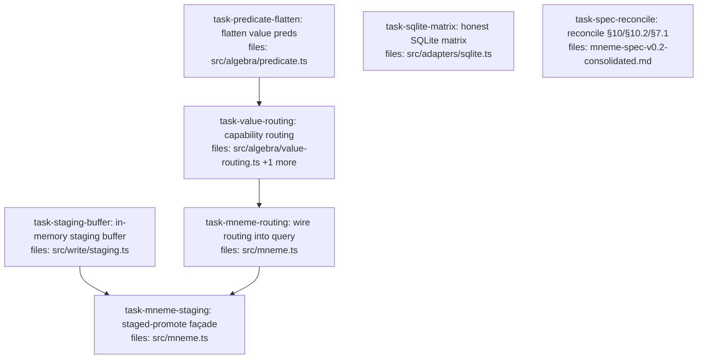

## Context

Implements `docs/superpowers/specs/2026-05-29-routing-staged-promote-design.md` — audit findings #5 (§10 adapter / §10.2 capability routing) and #9 (§7.1 staged-promote). Decisions: spec **serves the reference impl**; routing scope **option A** (capability layer only — no SQL push-down); staged-promote via an **in-memory buffer**; reconcile the spec to bless the closure-txn idiom rather than reshape code. Value predicates are flattened into the `σ` `Predicate` union (prerequisite for routing to act on).

Roots run in parallel: `task-predicate-flatten`, `task-sqlite-matrix`, `task-staging-buffer`, `task-spec-reconcile`. `task-mneme-routing` and `task-mneme-staging` both modify `src/mneme.ts` and therefore serialize (staging `depends_on` routing).

Out of scope (per design): handle-based txn reshape, `ensureIndex`/`dropIndex`, real SQL push-down / `ExecutionPlan` value-predicate extension, true pre-load parse-time rejection (evaluation-entry rejection is used instead). All deferred to v0.3.

## Tasks

## Task: flatten value predicates into the selection union

```yaml
id: task-predicate-flatten
depends_on: []
files:
  - src/algebra/predicate.ts
status: pending
```

Make `ValuePredicate` expressible inside a `σ` predicate by flattening it into the `Predicate` union, with a single `VALUE_PREDICATE_KIND` map driving both the `isValuePredicate` guard and `predicateKindOf` (DRY — the op set is never re-listed). `matches()` delegates value ops to the existing `matchesValue`. Prerequisite for `task-value-routing`.

## Implementation

```typescript
// src/algebra/predicate.ts
import type { Claim } from "../core/claim.js";
import type { ValuePredicate } from "./value-predicate.js";
import { matchesValue } from "./value-predicate.js";
import type { PredicateKind } from "../adapters/adapter.js";

export type Predicate =
  | { op: "subjectEq"; value: string }
  /* …existing base ops (subjectIn, keyEq, scopeEq, statusEq, statusIn,
       confidenceGt, tagIn, validAt, recordedAfter, and, or, not)… */
  | ValuePredicate;

// Single source of truth for the value-op set (DRY): drives BOTH helpers.
export const VALUE_PREDICATE_KIND: Record<ValuePredicate["op"], PredicateKind> = {
  valueEq: "equality",
  valueGt: "range",
  valueIn: "set_membership",
  valueRegex: "regex",
  valueMatches: "structural_pattern",
  valueNull: "null_check",
  valueExists: "null_check",
};

export const isValuePredicate = (p: Predicate): p is ValuePredicate =>
  p.op in VALUE_PREDICATE_KIND;

export const predicateKindOf = (vp: ValuePredicate): PredicateKind =>
  VALUE_PREDICATE_KIND[vp.op];

export function matches(claim: Claim, p: Predicate): boolean {
  if (isValuePredicate(p)) return matchesValue(claim.value, p);
  switch (p.op) {
    /* existing base-op cases unchanged; and/or/not recurse through matches() */
  }
}
```

```typescript
// src/algebra/predicate.test.ts
it("matches a valueEq predicate via the flattened union", () => {
  const claim = makeClaim({ value: { amount: 5 } });
  expect(matches(claim, { op: "valueEq", path: "amount", value: 5 })).toBe(true);
  expect(matches(claim, { op: "valueEq", path: "amount", value: 6 })).toBe(false);
});
```

## Acceptance criteria

- A `valueEq`/`valueGt`/`valueIn`/`valueExists`/`valueRegex`/`valueNull`/`valueMatches` predicate is accepted by `matches(claim, p)` and evaluated via `matchesValue`.
- `predicateKindOf({op:"valueRegex",…})` returns `"regex"`; `predicateKindOf({op:"valueExists",…})` returns `"null_check"` (full table per design §1).
- `isValuePredicate` is `true` for every value op and `false` for every base op (`subjectEq`, `keyEq`, …).
- A value predicate nested inside `and`/`or`/`not` evaluates correctly.
- All pre-existing base-predicate tests still pass (additive change).

Test file: `src/algebra/predicate.test.ts`.

## Task: value-predicate capability routing

```yaml
id: task-value-routing
depends_on: [task-predicate-flatten]
files:
  - src/algebra/value-routing.ts
  - src/algebra/expression.ts
status: pending
```

The §10.2 capability layer (option A): walk a predicate's value predicates, classify each by the adapter's declared `valuePredicateSupport`, **throw** on `unsupported`, **warn** on `fallback_in_memory` over a working-set threshold, proceed otherwise. Also extends `EvalContext` (`expression.ts`) with the `onWarning` delivery channel + threshold that this module's warnings flow through — the routing feature's non-façade infrastructure.

## Implementation

```typescript
// src/algebra/value-routing.ts
import type { Predicate } from "./predicate.js";
import { isValuePredicate, predicateKindOf } from "./predicate.js";
import type { ValuePredicate } from "./value-predicate.js";
import { valuePredicateLevel, type AdapterCapabilities, type PredicateKind } from "../adapters/adapter.js";

export class UnsupportedValuePredicateError extends Error {
  constructor(public readonly predicateKind: PredicateKind, public readonly path?: string) {
    super(`value predicate kind "${predicateKind}"${path ? ` on path "${path}"` : ""} is unsupported by this adapter`);
    this.name = "UnsupportedValuePredicateError";
  }
}

export interface QueryWarning {
  kind: "fallback_in_memory";
  predicateKind: PredicateKind;
  path?: string;
  workingSetSize: number;
  threshold: number;
  message: string;
}

export function collectValuePredicates(p: Predicate): ValuePredicate[] {
  if (isValuePredicate(p)) return [p];
  if (p.op === "and" || p.op === "or") return p.preds.flatMap(collectValuePredicates);
  if (p.op === "not") return collectValuePredicates(p.pred);
  return [];
}

export function routeValuePredicates(
  p: Predicate,
  caps: AdapterCapabilities,
  opts: { workingSetSize: number; threshold: number; onWarning: (w: QueryWarning) => void }
): void {
  for (const vp of collectValuePredicates(p)) {
    const kind = predicateKindOf(vp);
    const level = valuePredicateLevel(caps, kind);
    const path = "path" in vp ? vp.path : undefined;
    if (level === "unsupported") throw new UnsupportedValuePredicateError(kind, path);
    if (level === "fallback_in_memory" && opts.workingSetSize > opts.threshold) {
      opts.onWarning({ kind: "fallback_in_memory", predicateKind: kind, path, workingSetSize: opts.workingSetSize, threshold: opts.threshold, message: `value predicate "${kind}" runs as in-memory fallback over ${opts.workingSetSize} claims (threshold ${opts.threshold})` });
    }
    // native_indexed / native_unindexed → proceed (no push-down this pass; unreachable for the reference SQLite adapter).
  }
}
```

```typescript
// src/algebra/expression.ts — EvalContext gains the warning delivery channel
import type { QueryWarning } from "./value-routing.js";
export interface EvalContext {
  // …existing fields (adapter, catalog, evaluationClock, usedSimilarityVersions, usedEmbeddingModelVersions)…
  onWarning?: (w: QueryWarning) => void;
  fallbackWarnThreshold?: number;   // default applied by the sigma builder (10_000)
}
```

```typescript
// src/algebra/value-routing.test.ts
it("throws UnsupportedValuePredicateError on an unsupported kind", () => {
  const caps = { valuePredicateSupport: { regex: "unsupported" } } as any;
  expect(() => routeValuePredicates({ op: "valueRegex", path: "x", pattern: "a" }, caps,
    { workingSetSize: 1, threshold: 0, onWarning: () => {} })).toThrow(UnsupportedValuePredicateError);
});
```

## Acceptance criteria

- `unsupported` kind → throws `UnsupportedValuePredicateError` naming the kind (and path when present).
- `fallback_in_memory` kind with `workingSetSize > threshold` → calls `onWarning` once with a `QueryWarning` carrying `predicateKind`, `workingSetSize`, `threshold`.
- `fallback_in_memory` at or under threshold, and `native_*` kinds → no warning, no throw.
- `collectValuePredicates` returns value predicates nested inside `and`/`or`/`not`.
- `EvalContext` exposes optional `onWarning` and `fallbackWarnThreshold`.

Test file: `src/algebra/value-routing.test.ts`.

## Task: honest SQLite value-predicate capability matrix

```yaml
id: task-sqlite-matrix
depends_on: []
files:
  - src/adapters/sqlite.ts
status: pending
```

Make the reference SQLite adapter's declared `valuePredicateSupport` match its actual load-all-then-filter execution: every value-predicate kind is `fallback_in_memory`, not `native_unindexed`. This aligns the matrix with reality and activates the §10.2 warn path for SQLite (design §2).

## Implementation

```typescript
// src/adapters/sqlite.ts — capabilities()
capabilities: () => ({
  valuePredicateSupport: {
    equality: "fallback_in_memory",
    range: "fallback_in_memory",
    set_membership: "fallback_in_memory",
    regex: "fallback_in_memory",
    structural_pattern: "fallback_in_memory",
    null_check: "fallback_in_memory",
    // JSON1 push-down (→ native_unindexed) is a v0.3 optimization.
  },
}),
```

```typescript
// src/adapters/sqlite.test.ts
it("declares every value-predicate kind as fallback_in_memory", () => {
  const caps = createSqliteAdapter().capabilities();
  for (const kind of ["equality","range","set_membership","regex","structural_pattern","null_check"] as const) {
    expect(caps.valuePredicateSupport[kind]).toBe("fallback_in_memory");
  }
});
```

## Acceptance criteria

- `createSqliteAdapter().capabilities().valuePredicateSupport[kind]` is `"fallback_in_memory"` for all six `PredicateKind`s.
- No other adapter behavior changes (claim ops, transactions, idempotency unaffected).

Test file: `src/adapters/sqlite.test.ts`.

## Task: in-memory staging buffer

```yaml
id: task-staging-buffer
depends_on: []
files:
  - src/write/staging.ts
status: pending
```

A non-durable, per-instance staging store for the §7.1 staged-promote mode. Owns the buffer mechanics (emit → unique stagingId, take, takeAll, list, discard) so the façade (`task-mneme-staging`) is thin wiring. Separates the staging concern from `mneme.ts` (SoC).

## Implementation

```typescript
// src/write/staging.ts
import type { CandidateClaim } from "../core/claim.js";
import { newClaimId } from "../core/ids.js";

export interface StagedEntry {
  stagingId: string;
  corpusId: string;
  candidate: CandidateClaim;
  idempotencyKey?: string;
}

export class StagingBuffer {
  private readonly entries = new Map<string, StagedEntry>();

  emit(corpusId: string, candidate: CandidateClaim, idempotencyKey?: string): string {
    const stagingId = newClaimId();            // UUID staging handle, distinct from a committed claim id
    this.entries.set(stagingId, { stagingId, corpusId, candidate, idempotencyKey });
    return stagingId;
  }

  take(stagingId: string): StagedEntry | undefined {
    const e = this.entries.get(stagingId);
    if (e) this.entries.delete(stagingId);
    return e;
  }

  takeAll(corpusId: string): StagedEntry[] {
    const out = [...this.entries.values()].filter((e) => e.corpusId === corpusId);
    for (const e of out) this.entries.delete(e.stagingId);
    return out;
  }

  list(corpusId?: string): { stagingId: string; corpusId: string }[] {
    return [...this.entries.values()]
      .filter((e) => corpusId === undefined || e.corpusId === corpusId)
      .map(({ stagingId, corpusId }) => ({ stagingId, corpusId }));
  }

  discard(stagingId: string): boolean {
    return this.entries.delete(stagingId);
  }
}
```

```typescript
// src/write/staging.test.ts
it("emit buffers an entry, list reflects it, take removes it", () => {
  const b = new StagingBuffer();
  const id = b.emit("c1", cand);
  expect(b.list().map((e) => e.stagingId)).toEqual([id]);
  expect(b.take(id)?.corpusId).toBe("c1");
  expect(b.list()).toEqual([]);
});
```

## Acceptance criteria

- `emit` returns a unique `stagingId` and buffers the entry; two emits yield distinct ids.
- `list(corpusId?)` returns buffered entries, filtered by corpus when given.
- `take(id)` returns and removes the entry; returns `undefined` for an unknown id.
- `takeAll(corpusId)` returns and removes all entries for that corpus.
- `discard(id)` removes the entry and returns whether one existed.

Test file: `src/write/staging.test.ts`.

## Task: wire capability routing into the query path

```yaml
id: task-mneme-routing
depends_on: [task-value-routing]
files:
  - src/mneme.ts
status: pending
```

Make the public `sigma` builder capability-aware: at evaluation entry it runs `routeValuePredicates` against the adapter's capabilities over the incoming corpus, then filters as before. Thread `onWarning` + `fallbackWarnThreshold` from `query(...)` opts into the `EvalContext`, defaulting `onWarning` to `console.warn` (never silently swallowed, per §10.2).

## Implementation

```typescript
// src/mneme.ts
import { routeValuePredicates } from "./algebra/value-routing.js";

export const sigma = (p: Predicate): Stage<Corpus, Corpus> => (c, ctx) => {
  routeValuePredicates(p, ctx.adapter.capabilities(), {
    workingSetSize: c.claims.length,
    threshold: ctx.fallbackWarnThreshold ?? 10_000,
    onWarning: ctx.onWarning ?? ((w) => console.warn(w.message)),
  });
  return sigmaOp(p)(c);
};

// query(): opts gains onWarning + fallbackWarnThreshold, threaded into the EvalContext
query<O>(corpusId: string, pipeline: Stage<any, any>[],
  opts?: { evaluationClock?: number; onWarning?: (w: QueryWarning) => void; fallbackWarnThreshold?: number }): O {
  const ctx: EvalContext = { adapter, catalog, evaluationClock: opts?.evaluationClock ?? Date.now(),
    usedSimilarityVersions: {}, usedEmbeddingModelVersions: {},
    onWarning: opts?.onWarning, fallbackWarnThreshold: opts?.fallbackWarnThreshold };
  return evaluate<O>(pipeline, ctx);
}
```

```typescript
// src/mneme.test.ts
it("query invokes onWarning for a fallback value predicate over the threshold", () => {
  const warnings: QueryWarning[] = [];
  m.createCorpus(corpusDef);
  m.commit("workspace:canopy", mk("s","k",{ amount: 1 }), { writer: "w" });
  m.query("workspace:canopy",
    pipe(leaf("workspace:canopy"), sigma({ op: "valueEq", path: "amount", value: 1 })),
    { fallbackWarnThreshold: 0, onWarning: (w) => warnings.push(w) });
  expect(warnings).toHaveLength(1);
});
```

## Acceptance criteria

- A `σ` carrying a `fallback_in_memory` value predicate, with `fallbackWarnThreshold` below the corpus size, invokes the supplied `onWarning` exactly once.
- A `σ` carrying an `unsupported` value predicate causes `query` to throw `UnsupportedValuePredicateError`.
- A `σ` with only base predicates (no value predicate) triggers no warning and no throw.
- Existing `sigma`/`query` behavior for non-value predicates is unchanged (all prior mneme tests pass).

Test file: `src/mneme.test.ts`.

## Task: staged-promote façade methods

```yaml
id: task-mneme-staging
depends_on: [task-staging-buffer, task-mneme-routing]
files:
  - src/mneme.ts
status: pending
```

Expose §7.1 staged-promote on the `Mneme` interface, delegating to a `StagingBuffer` held in the `createMneme` closure. `depends_on task-mneme-routing` because both modify `src/mneme.ts` (serialize) and on `task-staging-buffer` for the `StagingBuffer` contract.

## Implementation

```typescript
// src/mneme.ts
import { StagingBuffer } from "./write/staging.js";
// inside createMneme: const staging = new StagingBuffer();

emitCandidate(corpusId: string, candidate: CandidateClaim, opts?: { idempotencyKey?: string }): { stagingId: string } {
  catalog.getCorpus(corpusId);                       // throws for unknown corpus
  return { stagingId: staging.emit(corpusId, candidate, opts?.idempotencyKey) };
},

promoteStaged(stagingId: string, opts: { writer: string; policy?: ContradictionPolicy; idempotencyKey?: string }): { id: string; status: string } {
  const e = staging.take(stagingId);
  if (!e) throw new Error(`unknown stagingId "${stagingId}"`);
  return this.commit(e.corpusId, e.candidate, { writer: opts.writer, policy: opts.policy, idempotencyKey: opts.idempotencyKey ?? e.idempotencyKey });
},

promoteAllStaged(corpusId: string, opts: { writer: string; policy?: ContradictionPolicy; batchPolicy?: BatchPolicy }): BatchResult {
  const es = staging.takeAll(corpusId);
  return this.commitBatch(corpusId, es.map((e) => ({ ...e.candidate, idempotencyKey: e.idempotencyKey })), opts);
},

listStaged(corpusId?: string) { return staging.list(corpusId); },
discardStaged(stagingId: string): boolean { return staging.discard(stagingId); },
```

```typescript
// src/mneme.test.ts
it("emitCandidate is invisible to reads until promoted, then committed", () => {
  m.createCorpus(corpusDef);
  const { stagingId } = m.emitCandidate("workspace:canopy", mk("s","k","v"), {});
  expect(m.query<AlgCorpus>("workspace:canopy", pipe(leaf("workspace:canopy"))).claims).toHaveLength(0);
  const r = m.promoteStaged(stagingId, { writer: "w" });
  expect(r.status).toBe("committed");
  expect(m.listStaged("workspace:canopy")).toEqual([]);
});
```

## Acceptance criteria

- `emitCandidate` returns `{ stagingId }`; the candidate is invisible to `query`/`read`/`readByIds` until promoted; appears in `listStaged`.
- `promoteStaged` commits via the normal pipeline (status `committed`) and removes the entry from `listStaged`; throws for an unknown `stagingId`.
- `promoteAllStaged` returns a `BatchResult` and empties the corpus's staged entries.
- `discardStaged` drops an entry without committing and returns `true` (or `false` if absent).

Test file: `src/mneme.test.ts`.

## Task: reconcile §10 / §10.2 / §7.1 with the implementation

```yaml
id: task-spec-reconcile
depends_on: []
files:
  - mneme-spec-v0.2-consolidated.md
status: pending
```

Documentation task. Reconcile the normative spec with the reference implementation per the design's "spec serves the impl" decision: bless the closure-`transaction` idiom in §10, make the §10.2 SQLite matrix honest, and document immediate-promote + staged-promote in §7.1. The fenced blocks below show the prose edits (before → after); the gate is `verify-spec.sh`.

## Implementation

```markdown
# §10 StorageAdapter — BEFORE (handle-based txns + index methods listed as required)
  beginTransaction() -> TransactionHandle
  commit(tx) -> Result
  rollback(tx) -> Result
  ensureIndex(spec) -> Result
  dropIndex(id) -> Result

# §10 StorageAdapter — AFTER (closure txn blessed; index methods deferred)
  transaction<T>(fn: () -> T) -> T   -- closure form: unbalanced/leaked transactions are
                                        structurally impossible (the library owns the boundaries)
  -- ensureIndex/dropIndex: deferred to v0.3 (cost-based planner territory), not required in v0.2
  -- richer reference method set also documented: idempotency store, event log, maxRecordedSeq
```

```markdown
# §10.2 SQLite matrix row — BEFORE
| SQLite (JSON1) | native_unindexed | native_unindexed | … |
# §10.2 SQLite matrix row — AFTER (+ footnote)
| SQLite (JSON1) | fallback_in_memory | fallback_in_memory | … |   -- JSON1 push-down → native_unindexed is a v0.3 optimization
# §10.2 — also document: onWarning delivery for fallback_in_memory; unsupported rejected before results

# §7.1 — note: reference impl uses immediate-promote by default; staged-promote provided via an
#         in-memory staging buffer (emit → deferred/batched promote)
```

## Acceptance criteria

- §10 `StorageAdapter` contract shows `transaction<T>(fn)` (not `beginTransaction/commit/rollback`); `ensureIndex`/`dropIndex` are described as deferred to v0.3, not required methods.
- §10.2 SQLite row reads `fallback_in_memory` across value-predicate kinds, with a JSON1-push-down-is-v0.3 footnote; `onWarning` and unsupported-rejection are documented.
- §7.1 documents immediate-promote as the default and staged-promote via the in-memory buffer.
- `bash spec/verify-spec.sh` still reports **39/39 PASS**.

Test file: `spec/verify-spec.sh` (run after editing; must stay 39/39).
