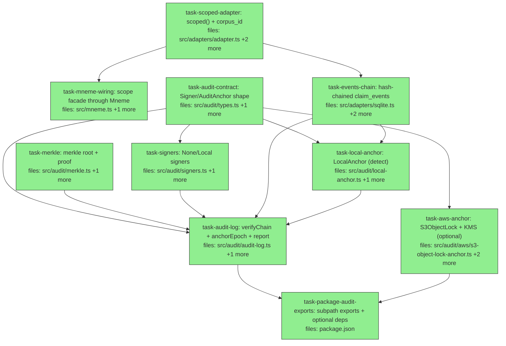

## Context

Fixes a confirmed correctness bug and adds tamper-evidence, in two phases.

**The bug (Phase 1):** corpus isolation is not enforced at query time. The
`claims` table has no `corpus_id` column and `adapter.query(plan)` ignores
`plan.corpusId`, so `leaf(corpus)` / `read(corpus)` / contradiction detection
return **every claim in the store regardless of corpus** (empirically verified:
two corpora, query one, get both). Harmless for single-corpus use; a hard
blocker for `corpus = tenant` multi-tenancy. The 1067-test suite missed it
because each test uses one corpus per fresh adapter.

**Design — isolation as a structural adapter invariant (not a per-query
discipline).** Mechanism: a **scope-bound adapter handle**,
`adapter.scoped({ corpus, profile? })`, whose scope is fixed at construction.
The base adapter is left UNCHANGED (so existing direct-adapter tests keep
passing); all isolation lives in the scoped wrapper, which (a) **force-injects**
`corpus_id = <bound>` on every read (ignoring any caller-supplied `corpusId`, so
it is bypass-proof), and (b) **stamps** `corpus_id` on every write. Mneme
constructs a corpus-scoped adapter per corpus, so commit/query/read/replay and
contradiction detection are all transparently isolated — the `Promoter`,
`enforce()`, and `leaf` do not change; they just receive a scoped adapter.
`corpus` is always bound (the tenant floor); `profile` is an optional second
bind for defense-in-depth. Authorization *policy* is implementor-supplied via a
future `Authorizer` seam; Mneme owns only the structural boundary plus the
`profile`/`audience` primitives. Neither Mneme nor agora owns authz policy. V1
ships none.

**Tamper-evidence (Phase 2) — pluggable, default-zero-dependency.** Mirrors
agora's contract (shared shape, not shared code; Mneme takes no agora deps).
Three layers:

1. **Merkle-per-epoch — always on, in-engine, zero external deps.** The
   `claim_events` log becomes a per-corpus hash chain
   (`entry_hash = sha256(canonical(event) ‖ prev_hash)`); an epoch's
   `entry_hash` leaves Merkle-root to one root. Gives **detection**.
2. **`Signer` seam** — `NoneSigner` / `LocalSigner` in core; `KmsSigner`
   optional.
3. **`AuditAnchor` seam** — `LocalAnchor` (default, `guarantee: "detect"`, in-DB)
   ships working out of the box; `S3ObjectLockAnchor` (`external-immutable`) is a
   one-line swap in an **optional `mneme/audit/aws` subpath** that pulls AWS deps
   only if used; `WitnessAnchor` (`witnessed`) deferred.

**Honesty hook:** the anchor declares its `guarantee`; `verifyChain`'s report
prints the anchor id + tier and licenses the phrase **"tamper-evident" only at
`external-immutable`+** — at `detect` the report says **"tamper-detecting."** So
nobody can run `LocalAnchor` and claim tamper-evidence; the artifact tells the
truth. Cadence is **host-driven** (`anchorEpoch()` called per commitBatch / per
epoch / by the host's cron) — Mneme runs no internal timer; the cadence bounds
the rewritable window.

**Standalone guarantee:** everything in core (`src/audit/*` minus `aws/`) has
zero external deps. AWS lands only via the optional subpath. Mneme stays
shippable and testable entirely on its own.

Verified facts: only one `StorageAdapter` impl (`createSqliteAdapter`);
`claim_events` already carries `corpus_id`; tests using the raw adapter are
unaffected because the base adapter is left unchanged.

## Tasks

## Task: scope-bound adapter handle

```yaml
id: task-scoped-adapter
depends_on: []
files:
  - src/adapters/adapter.ts
  - src/adapters/sqlite.ts
  - src/adapters/sqlite.test.ts
status: done
```

Add a scope-bound adapter handle. `adapter.scoped({corpus, profile?})` returns a
`StorageAdapter` whose reads force `corpus_id = <bound>` (and `profile = <bound>`
when set) and whose writes stamp `corpus_id`. The base adapter is unchanged. Adds
the `corpus_id` column + index + migration. This is the structural isolation
mechanism; closes the leak.

## Implementation

```typescript
// src/adapters/adapter.ts — add to the interface
export interface AdapterScope {
  corpus: string;
  profile?: string;
}
export interface StorageAdapter {
  // ...existing members unchanged...
  /** Return a scope-bound view: reads force corpus (and profile if set); writes stamp corpus. */
  scoped(scope: AdapterScope): StorageAdapter;
}
```

```typescript
// src/adapters/sqlite.ts — inside createSqliteAdapter, after the existing schema:
//   ALTER TABLE claims ADD COLUMN corpus_id TEXT  (idempotent: guard via PRAGMA table_info)
//   CREATE INDEX IF NOT EXISTS idx_claims_corpus ON claims(corpus_id);
// Refactor the existing query() to accept an optional forced scope; base passes none.
function buildQuery(plan: ExecutionPlan, force?: AdapterScope): { sql: string; params: unknown[] } {
  const conds: string[] = []; const params: unknown[] = [];
  if (force) { conds.push("corpus_id = ?"); params.push(force.corpus);
    if (force.profile !== undefined) { conds.push("profile = ?"); params.push(force.profile); } }
  if (plan.subject !== undefined) { conds.push("subject = ?"); params.push(plan.subject); }
  // ...key/status/scopeHash/recordedAtMost/runIds as today...
  const where = conds.length ? `WHERE ${conds.join(" AND ")}` : "";
  return { sql: `SELECT * FROM claims ${where}`, params };
}
function insertRow(c: Claim, corpusId: string | null): void {
  insertStmt.run({ ...toRow(c), corpus_id: corpusId }); // insertStmt + toRow include corpus_id
}
const base: StorageAdapter = {
  insertClaim: (c) => insertRow(c, null),
  query: (plan) => db.prepare(buildQuery(plan).sql).all(...buildQuery(plan).params).map(fromRow),
  // ...rest unchanged..., plus:
  scoped(scope: AdapterScope): StorageAdapter {
    return {
      ...base,
      insertClaim: (c) => insertRow(c, scope.corpus),
      insertBatch: (cs) => cs.forEach((c) => insertRow(c, scope.corpus)),
      query: (plan) => { const q = buildQuery(plan, scope); return db.prepare(q.sql).all(...q.params).map(fromRow); },
      getClaim: (id) => { const c = base.getClaim(id); return c && rowCorpusOf(id) === scope.corpus ? c : undefined; },
      readEvents: (f) => base.readEvents({ ...f, corpusId: scope.corpus }),
      scoped: (s) => base.scoped(s), // re-scoping returns a fresh scope from base
    };
  },
};
return base;
```

```typescript
// src/adapters/sqlite.test.ts — isolation regression at the adapter level
it("scoped query never returns another corpus's claims", () => {
  const a = createSqliteAdapter();
  a.scoped({ corpus: "A" }).insertClaim(makeClaim({ value: "a" }));
  a.scoped({ corpus: "B" }).insertClaim(makeClaim({ value: "b" }));
  expect(a.scoped({ corpus: "A" }).query({}).length).toBe(1);              // not 2
  expect(a.scoped({ corpus: "A" }).query({ corpusId: "B" }).length).toBe(1); // caller corpusId ignored
});
```

## Acceptance criteria

- `adapter.scoped({corpus:"A"}).insertClaim(x)` stores `corpus_id="A"`; the base
  `insertClaim` stores `corpus_id=NULL` (base behavior unchanged).
- `adapter.scoped({corpus:"A"}).query({})` returns ONLY corpus-A claims even
  when two corpora share the store; passing `{corpusId:"B"}` to a corpus-A scope
  still returns only A (force-injection is bypass-proof).
- `scoped({corpus:"A", profile:"p1"}).query({})` returns only A∧p1 claims.
- `scoped({corpus:"A"}).getClaim(idFromB)` returns `undefined`.
- Existing `src/adapters/sqlite.test.ts` round-trip tests (raw adapter) still pass.
- Migration: opening a pre-existing db without `corpus_id` adds the column without error.

Test file: `src/adapters/sqlite.test.ts`.

## Task: scope facade through Mneme

```yaml
id: task-mneme-wiring
depends_on: [task-scoped-adapter]
files:
  - src/mneme.ts
  - src/mneme.test.ts
status: done
```

Make the Mneme facade construct a corpus-scoped adapter per corpus so commit,
query, read, readByIds, replay, and contradiction detection are all isolated.
The `Promoter`, `enforce()`, and `leaf` are unchanged — they receive a scoped
adapter and become transparently corpus-bound.

## Implementation

```typescript
// src/mneme.ts — scope at every corpus entry point
function scopedFor(corpusId: string): StorageAdapter {
  return adapter.scoped({ corpus: corpusId });
}
function promoterFor(corpusId: string): Promoter {
  let p = promoters.get(corpusId);
  if (!p) { p = new Promoter(scopedFor(corpusId), catalog.getCorpusSchema(corpusId), corpusId); promoters.set(corpusId, p); }
  return p;
}
// query(): build the EvalContext with a scoped adapter so leaf(corpus) is forced in-corpus
query<O>(corpusId, pipeline, opts?) {
  catalog.getCorpus(corpusId);
  const ctx: EvalContext = { adapter: scopedFor(corpusId), catalog, evaluationClock: opts?.evaluationClock ?? Date.now(),
    usedSimilarityVersions: {}, usedEmbeddingModelVersions: {} };
  return evaluate<O>(pipeline, ctx);
}
read(corpusId, plan) { catalog.getCorpus(corpusId); return scopedFor(corpusId).query({ ...plan, corpusId }); }
readByIds(corpusId, ids) { const s = scopedFor(corpusId); return ids.map((id) => s.getClaim(id)).filter((c): c is Claim => !!c); }
// replay(claim): scope to the claim's corpus — derive from the recorded query expression's leaf corpusId,
// or accept corpusId. Build the replay ctx with scopedFor(thatCorpus).
```

```typescript
// src/mneme.test.ts — the isolation regression test
it("isolates claims by corpus (the leak fix)", () => {
  const m = createMneme({ adapter: createSqliteAdapter(), availableTiers: [{ kind: "core" }] });
  m.createCorpus(corpusDef("A")); m.createCorpus(corpusDef("B"));
  m.commit("A", candidate({ subject: "x", value: "a-only" }), { writer: "t" });
  m.commit("B", candidate({ subject: "y", value: "b-only" }), { writer: "t" });
  const out = m.query<AggregateResult>("A", pipe(leaf("A"), alpha.count()));
  expect([...out.groups.values()][0].value).toEqual({ kind: "count", n: 1 }); // not 2
});
```

## Acceptance criteria

- Two corpora in one store: `query`/`read`/`readByIds` on corpus A never return
  corpus B's claims; the regression test above asserts `count == 1`, not 2.
- Contradiction detection in corpus A does not see corpus B claims (a same-
  identity claim in B does not block a write in A).
- `replay` re-executes against the claim's own corpus scope.
- Existing `src/mneme.test.ts` single-corpus tests still pass.

Test file: `src/mneme.test.ts`.

## Task: audit contract shape

```yaml
id: task-audit-contract
depends_on: []
files:
  - src/audit/types.ts
  - src/audit/types.test.ts
status: done
```

The shared tamper-evidence contract, mirroring agora verbatim (shared shape, no
shared code). Pure types plus the guarantee-tier ordering used by the honesty hook.

## Implementation

```typescript
// src/audit/types.ts
export type Guarantee = "detect" | "external-immutable" | "witnessed";

/** Rank used by the report to license the "tamper-evident" claim only at >= external-immutable. */
export const GUARANTEE_RANK: Record<Guarantee, number> = { detect: 0, "external-immutable": 1, witnessed: 2 };

export interface Signature { alg: string; bytes: Uint8Array; keyRef?: string; }
export interface AnchorReceipt { anchorId: string; epochId: string; guarantee: Guarantee; at: number; locator?: string; }
export interface AnchoredRoot { epochId: string; root: Uint8Array; signature?: Signature; receipt: AnchorReceipt; }

export interface Signer { sign(rootHash: Uint8Array): Promise<Signature>; readonly keyRef?: string; }

export interface AuditAnchor {
  readonly id: string;
  readonly guarantee: Guarantee;
  anchor(epoch: { epochId: string; root: Uint8Array; signature?: Signature }): Promise<AnchorReceipt>;
  fetch(range: { epochId?: string; since?: string }): Promise<AnchoredRoot[]>;
}
```

```typescript
// src/audit/types.test.ts
import { GUARANTEE_RANK } from "./types.js";
it("ranks guarantee tiers so external-immutable outranks detect", () => {
  expect(GUARANTEE_RANK["external-immutable"]).toBeGreaterThan(GUARANTEE_RANK.detect);
  expect(GUARANTEE_RANK.witnessed).toBeGreaterThan(GUARANTEE_RANK["external-immutable"]);
});
```

## Acceptance criteria

- `Guarantee`, `Signer`, `AuditAnchor`, `Signature`, `AnchorReceipt`,
  `AnchoredRoot` exported with the exact shapes above; `tsc --noEmit` clean.
- `GUARANTEE_RANK` orders `detect < external-immutable < witnessed`.

Test file: `src/audit/types.test.ts`.

## Task: merkle root tree

```yaml
id: task-merkle
depends_on: []
files:
  - src/audit/merkle.ts
  - src/audit/merkle.test.ts
status: done
```

Pure Merkle tree over a list of leaf hashes: deterministic root + inclusion
proof. Zero external deps (`node:crypto`). Used to root an epoch's `entry_hash`
leaves to one anchorable root.

## Implementation

```typescript
// src/audit/merkle.ts
import { createHash } from "node:crypto";
const h = (b: Uint8Array) => new Uint8Array(createHash("sha256").update(b).digest());
const pair = (a: Uint8Array, b: Uint8Array) => h(Buffer.concat([Buffer.from([0x01]), a, b]));

/** Deterministic Merkle root over leaves (empty -> 32 zero bytes; odd level duplicates last). */
export function merkleRoot(leaves: Uint8Array[]): Uint8Array {
  if (leaves.length === 0) return new Uint8Array(32);
  let level = leaves.map((l) => h(Buffer.concat([Buffer.from([0x00]), l])));
  while (level.length > 1) {
    const next: Uint8Array[] = [];
    for (let i = 0; i < level.length; i += 2) next.push(pair(level[i], level[i + 1] ?? level[i]));
    level = next;
  }
  return level[0];
}
```

```typescript
// src/audit/merkle.test.ts
import { merkleRoot } from "./merkle.js";
it("is deterministic and order-sensitive", () => {
  const a = new Uint8Array([1]), b = new Uint8Array([2]);
  expect(merkleRoot([a, b])).toEqual(merkleRoot([a, b]));
  expect(merkleRoot([a, b])).not.toEqual(merkleRoot([b, a]));
  expect(merkleRoot([])).toEqual(new Uint8Array(32));
});
```

## Acceptance criteria

- `merkleRoot` is deterministic, order-sensitive, and distinguishes leaf-set
  membership; empty input → 32 zero bytes.
- Domain-separated (leaf vs internal prefix) to resist second-preimage.
- No external dependency (only `node:crypto`).

Test file: `src/audit/merkle.test.ts`.

## Task: core signers

```yaml
id: task-signers
depends_on: [task-audit-contract]
files:
  - src/audit/signers.ts
  - src/audit/signers.test.ts
status: done
```

Two core `Signer` implementations: `NoneSigner` (no signature) and `LocalSigner`
(ed25519 via `node:crypto`, in-process key). `KmsSigner` is out of scope here
(it lives in the optional aws subpath).

## Implementation

```typescript
// src/audit/signers.ts
import { generateKeyPairSync, sign as nodeSign } from "node:crypto";
import type { Signer, Signature } from "./types.js";

export const NoneSigner: Signer = { async sign() { return { alg: "none", bytes: new Uint8Array(0) }; } };

/** ed25519 local signer — non-repudiation only as strong as local key custody (detect tier). */
export function createLocalSigner(keyRef = "local"): Signer & { publicKey: Buffer } {
  const { privateKey, publicKey } = generateKeyPairSync("ed25519");
  return {
    keyRef,
    publicKey: publicKey.export({ type: "spki", format: "der" }) as Buffer,
    async sign(root: Uint8Array): Promise<Signature> {
      return { alg: "ed25519", bytes: new Uint8Array(nodeSign(null, Buffer.from(root), privateKey)), keyRef };
    },
  };
}
```

```typescript
// src/audit/signers.test.ts
import { verify as nodeVerify, createPublicKey } from "node:crypto";
import { createLocalSigner, NoneSigner } from "./signers.js";
it("LocalSigner produces a verifiable ed25519 signature", async () => {
  const s = createLocalSigner(); const root = new Uint8Array(32).fill(7);
  const sig = await s.sign(root);
  const pub = createPublicKey({ key: Buffer.from(s.publicKey), type: "spki", format: "der" });
  expect(nodeVerify(null, Buffer.from(root), pub, Buffer.from(sig.bytes))).toBe(true);
});
it("NoneSigner returns an empty signature", async () => {
  expect((await NoneSigner.sign(new Uint8Array(32))).alg).toBe("none");
});
```

## Acceptance criteria

- `NoneSigner.sign()` → `{alg:"none", bytes: 0-length}`.
- `createLocalSigner().sign(root)` → an `ed25519` signature that verifies against
  the returned public key.
- No external dependency (only `node:crypto`).

Test file: `src/audit/signers.test.ts`.

## Task: hash-chained claim_events

```yaml
id: task-events-chain
depends_on: [task-scoped-adapter]
files:
  - src/adapters/adapter.ts
  - src/adapters/sqlite.ts
  - src/adapters/sqlite.test.ts
status: done
```

Make `claim_events` a per-corpus hash chain and add an anchor-root store.
`appendEvent` computes `entry_hash = sha256(canonical(event) ‖ prev_hash)` where
`prev_hash` is the previous event's `entry_hash` *for the same corpus*.
`readEvents` returns the hashes. Adds an `audit_anchors` table +
`putAnchoredRoot`/`getAnchoredRoots` for `LocalAnchor` to use. Shares the
adapter files with `task-scoped-adapter`, hence the dependency.

## Implementation

```typescript
// src/adapters/adapter.ts — extend the event + adapter surface
export interface ClaimEvent { /* ...existing... */ entryHash?: string; prevHash?: string; }
export interface AnchoredRootRow { corpusId: string; epochId: string; root: string; signature: string | null; guarantee: string; at: number; }
export interface StorageAdapter {
  // ...existing...
  putAnchoredRoot(row: AnchoredRootRow): void;
  getAnchoredRoots(corpusId: string, range?: { epochId?: string; since?: string }): AnchoredRootRow[];
}
```

```typescript
// src/adapters/sqlite.ts — schema + chained append
//   ALTER TABLE claim_events ADD COLUMN entry_hash TEXT; ADD COLUMN prev_hash TEXT;  (guarded)
//   CREATE TABLE IF NOT EXISTS audit_anchors (corpus_id TEXT, epoch_id TEXT, root TEXT, signature TEXT, guarantee TEXT, at REAL, PRIMARY KEY(corpus_id, epoch_id));
import { createHash } from "node:crypto";
const canon = (e: ClaimEvent) => JSON.stringify([e.op, e.corpusId, e.writer, e.claimId, e.deprecatedId ?? null, e.toStatus ?? null, e.recorded, e.recordedSeq]);
const headHashStmt = db.prepare<[string], { entry_hash: string }>("SELECT entry_hash FROM claim_events WHERE corpus_id = ? ORDER BY seq_pk DESC LIMIT 1");
function appendEvent(e: ClaimEvent): void {
  const prev = headHashStmt.get(e.corpusId)?.entry_hash ?? "";
  const entry = createHash("sha256").update(canon(e) + prev).digest("hex");
  eventInsertStmt.run({ /* ...existing fields..., */ prev_hash: prev, entry_hash: entry });
}
```

```typescript
// src/adapters/sqlite.test.ts — chain + tamper detection at the adapter level
it("chains claim_events per corpus so a mutated event breaks the link", () => {
  const a = createSqliteAdapter();
  const s = a.scoped({ corpus: "c" });
  s.insertClaim(makeClaim()); a.appendEvent(evt("c", "e1")); a.appendEvent(evt("c", "e2"));
  const evs = a.readEvents({ corpusId: "c" });
  expect(evs[1].prevHash).toBe(evs[0].entryHash); // links
});
```

## Acceptance criteria

- `appendEvent` sets `entryHash = sha256(canonical(event) ‖ prevHash)` where
  `prevHash` is the prior event's `entryHash` for the SAME `corpusId` (genesis
  `prevHash = ""`).
- `readEvents` returns `entryHash`/`prevHash`; consecutive same-corpus events link.
- `putAnchoredRoot`/`getAnchoredRoots` round-trip a root row, scoped by corpus.
- Migration adds the columns/table to a pre-existing db without error.
- Existing event tests still pass.

Test file: `src/adapters/sqlite.test.ts`.

## Task: LocalAnchor (detect)

```yaml
id: task-local-anchor
depends_on: [task-audit-contract, task-events-chain]
files:
  - src/audit/local-anchor.ts
  - src/audit/local-anchor.test.ts
status: done
```

The default `AuditAnchor`: stores signed roots in the same db via the adapter's
`putAnchoredRoot`/`getAnchoredRoots`. Declares `guarantee: "detect"` — honest
that head-in-same-DB is detection, not external immutability. Ships working with
zero external deps.

## Implementation

```typescript
// src/audit/local-anchor.ts
import type { AuditAnchor, AnchorReceipt, AnchoredRoot } from "./types.js";
import type { StorageAdapter } from "../adapters/adapter.js";
const hex = (b: Uint8Array) => Buffer.from(b).toString("hex");

export function createLocalAnchor(adapter: StorageAdapter, corpusId: string): AuditAnchor {
  return {
    id: "local",
    guarantee: "detect",
    async anchor({ epochId, root, signature }) {
      const at = Date.now();
      adapter.putAnchoredRoot({ corpusId, epochId, root: hex(root),
        signature: signature ? JSON.stringify({ ...signature, bytes: hex(signature.bytes) }) : null,
        guarantee: "detect", at });
      const receipt: AnchorReceipt = { anchorId: "local", epochId, guarantee: "detect", at };
      return receipt;
    },
    async fetch(range) {
      return adapter.getAnchoredRoots(corpusId, range).map((r) => ({
        epochId: r.epochId, root: Uint8Array.from(Buffer.from(r.root, "hex")),
        signature: r.signature ? reviveSig(r.signature) : undefined,
        receipt: { anchorId: "local", epochId: r.epochId, guarantee: "detect", at: r.at },
      } as AnchoredRoot));
    },
  };
}
```

```typescript
// src/audit/local-anchor.test.ts
import { createSqliteAdapter } from "../adapters/sqlite.js";
import { createLocalAnchor } from "./local-anchor.js";
it("anchors a root and fetches it back, declaring the detect tier", async () => {
  const anchor = createLocalAnchor(createSqliteAdapter(), "c");
  const r = await anchor.anchor({ epochId: "e1", root: new Uint8Array(32).fill(9) });
  expect(r.guarantee).toBe("detect");
  expect((await anchor.fetch({ epochId: "e1" }))[0].root).toEqual(new Uint8Array(32).fill(9));
});
```

## Acceptance criteria

- `createLocalAnchor(adapter, corpus)` implements `AuditAnchor` with
  `guarantee:"detect"`, `id:"local"`.
- `anchor()` persists `(epochId, root, signature?)` via the adapter; `fetch()`
  returns them, corpus-scoped.
- Zero external dependencies.

Test file: `src/audit/local-anchor.test.ts`.

## Task: optional aws audit adapters

```yaml
id: task-aws-anchor
depends_on: [task-audit-contract]
files:
  - src/audit/aws/s3-object-lock-anchor.ts
  - src/audit/aws/kms-signer.ts
  - src/audit/aws/aws.test.ts
status: done
```

The optional strong path, isolated in `src/audit/aws/` so AWS SDKs are only
pulled when used. `S3ObjectLockAnchor` writes the signed root to a versioned,
compliance-mode-locked bucket (`guarantee: "external-immutable"`); `KmsSigner`
signs via a KMS-held key. Imports of `@aws-sdk/*` are dynamic so core never
loads them.

## Implementation

```typescript
// src/audit/aws/s3-object-lock-anchor.ts
import type { AuditAnchor, AnchorReceipt } from "../types.js";
export function createS3ObjectLockAnchor(opts: { bucket: string; prefix: string; region: string }): AuditAnchor {
  return {
    id: `s3:${opts.bucket}`,
    guarantee: "external-immutable",
    async anchor({ epochId, root, signature }) {
      // dynamic + TYPE-ERASED specifier (`as string`) so core `tsc` builds without the SDK installed:
      const { S3Client, PutObjectCommand } = (await import("@aws-sdk/client-s3" as string)) as any;
      const s3 = new S3Client({ region: opts.region });
      const key = `${opts.prefix}/${epochId}.json`;
      await s3.send(new PutObjectCommand({ Bucket: opts.bucket, Key: key,
        Body: JSON.stringify({ epochId, root: Buffer.from(root).toString("hex"), signature }),
        ObjectLockMode: "COMPLIANCE" /* retention configured on the bucket */ }));
      const receipt: AnchorReceipt = { anchorId: `s3:${opts.bucket}`, epochId, guarantee: "external-immutable", at: Date.now(), locator: `s3://${opts.bucket}/${key}` };
      return receipt;
    },
    async fetch() { /* GetObject by epoch/prefix; reverse of anchor() */ return []; },
  };
}
```

```typescript
// src/audit/aws/aws.test.ts — no live AWS: assert shape + lazy import, mock the SDK
import { createS3ObjectLockAnchor } from "./s3-object-lock-anchor.js";
it("declares the external-immutable tier without importing AWS at module load", () => {
  const a = createS3ObjectLockAnchor({ bucket: "b", prefix: "p", region: "us-east-1" });
  expect(a.guarantee).toBe("external-immutable");
  expect(a.id).toBe("s3:b");
});
```

## Acceptance criteria

- `createS3ObjectLockAnchor(...)` implements `AuditAnchor` with
  `guarantee:"external-immutable"`; `createKmsSigner(...)` implements `Signer`.
- `@aws-sdk/*` is imported DYNAMICALLY (inside methods) so importing core Mneme
  never loads it; the test passes with the SDK absent/mocked.
- Lives entirely under `src/audit/aws/`; nothing in core imports it.

Test file: `src/audit/aws/aws.test.ts`.

## Task: audit-log engine

```yaml
id: task-audit-log
depends_on: [task-audit-contract, task-merkle, task-signers, task-events-chain, task-local-anchor]
files:
  - src/audit/audit-log.ts
  - src/audit/audit-log.test.ts
status: done
```

The engine glue: `verifyChain(corpus)` recomputes the per-corpus chain and
reports integrity; `anchorEpoch(corpus, {signer, anchor})` Merkle-roots the
since-last-anchor entries, signs, and hands the root to the anchor;
`auditReport(corpus, anchor)` prints the honesty hook — licensing
**"tamper-evident" only when the anchor's guarantee is `external-immutable`+**,
else **"tamper-detecting."** Defaults: `NoneSigner` + `LocalAnchor`.

## Implementation

```typescript
// src/audit/audit-log.ts
import { createHash } from "node:crypto";
import type { StorageAdapter } from "../adapters/adapter.js";
import type { AuditAnchor, Signer, Guarantee } from "./types.js";
import { GUARANTEE_RANK } from "./types.js";
import { merkleRoot } from "./merkle.js";

export function verifyChain(adapter: StorageAdapter, corpus: string): { intact: boolean; brokenAt?: number } {
  const evs = adapter.readEvents({ corpusId: corpus }); let prev = "";
  for (let i = 0; i < evs.length; i++) {
    const want = createHash("sha256").update(canon(evs[i]) + prev).digest("hex");
    if (evs[i].entryHash !== want || evs[i].prevHash !== prev) return { intact: false, brokenAt: i };
    prev = evs[i].entryHash!;
  }
  return { intact: true };
}

export async function anchorEpoch(adapter: StorageAdapter, corpus: string, epochId: string, opts: { signer: Signer; anchor: AuditAnchor }) {
  const leaves = adapter.readEvents({ corpusId: corpus }).map((e) => Uint8Array.from(Buffer.from(e.entryHash!, "hex")));
  const root = merkleRoot(leaves);
  const signature = await opts.signer.sign(root);
  return opts.anchor.anchor({ epochId, root, signature });
}

export function auditReport(verify: { intact: boolean }, anchorGuarantee: Guarantee): { intact: boolean; guarantee: Guarantee; claim: "tamper-evident" | "tamper-detecting" } {
  const claim = GUARANTEE_RANK[anchorGuarantee] >= GUARANTEE_RANK["external-immutable"] ? "tamper-evident" : "tamper-detecting";
  return { intact: verify.intact, guarantee: anchorGuarantee, claim };
}
```

```typescript
// src/audit/audit-log.test.ts
it("detects a tampered event and reports the honest claim per tier", () => {
  // build a chain via the adapter, mutate one event row, expect verifyChain.intact === false
  // auditReport(..., "detect") -> claim "tamper-detecting"; auditReport(..., "external-immutable") -> "tamper-evident"
});
```

## Acceptance criteria

- `verifyChain` returns `{intact:true}` for an untampered chain and
  `{intact:false, brokenAt:i}` when any event's `entryHash`/`prevHash` is altered.
- `anchorEpoch` Merkle-roots the corpus's entry hashes, signs with the given
  signer, and calls `anchor.anchor(...)`.
- `auditReport` returns `claim:"tamper-evident"` ONLY when the anchor guarantee
  is `external-immutable` or higher; otherwise `claim:"tamper-detecting"`.
- Defaults wire to `NoneSigner` + `createLocalAnchor` (zero external deps).

Test file: `src/audit/audit-log.test.ts`.

## Task: audit package wiring

```yaml
id: task-package-audit-exports
depends_on: [task-audit-log, task-aws-anchor]
is_wiring_task: true
files:
  - package.json
status: done
```

Expose the audit surface and confine AWS to optional deps. Adds `./audit` and
`./audit/aws` subpath exports; declares `@aws-sdk/client-s3` and
`@aws-sdk/client-kms` as `optionalDependencies` (or `peerDependenciesMeta`
optional) so a standalone install never pulls them.

## Acceptance criteria

- `package.json` gains `exports["./audit"] -> ./src/audit/audit-log.ts` (or an
  `src/audit/index.ts` barrel) and `exports["./audit/aws"] -> ./src/audit/aws/index.ts`.
- `@aws-sdk/client-s3` / `@aws-sdk/client-kms` are declared OPTIONAL; `npm install`
  without them still builds core and runs the non-aws suite.
- Existing exports (`.`, `./surface`, `./cli`, `./mcp`) preserved; valid JSON.

Test file: `bin/mneme.smoke.test.ts` (re-run to confirm core still loads without AWS installed).
