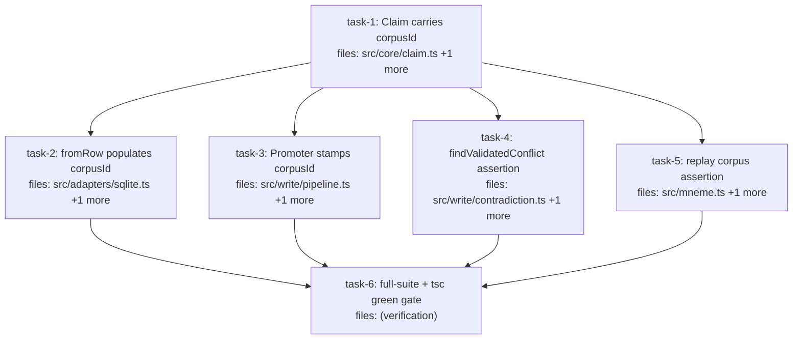

## Context

Drives the design at `docs/superpowers/specs/2026-05-31-claim-corpus-identity-design.md`:
carry the enforced corpus identity on the `Claim` type so isolation-sensitive code can
read a claim's corpus directly instead of falling back to the untrusted `workspace`
field. Follow-up to PRs #13/#14.

Decisions already settled (see spec): `corpusId` is **optional** and **branded
`CorpusId`**, populated-on-read from the enforced `corpus_id` column only — never from
`workspace`. `CandidateClaim` cannot carry it (force-stamped, like `id`/`status`).
Consumers keep their explicit `corpusId` param and gain a defensive agreement assertion.
No migration / no schema-version bump (column + backfill shipped in #14).

**Pre-DAG cascade check (step 3.5):** the only contract change is adding an *optional*
field, which breaks no existing consumer. The secondary risk — `fromRow` now returning
claims *with* `corpusId` breaking whole-claim equality assertions — was grepped: all
read-side claim assertions are `toMatchObject` (partial) or field-level (`confidence`,
`scope`, `value`), and algebra tests use in-memory claims that never pass through
`fromRow`. No cascade; no cleanup task required. `task-6` is the integrated green-suite
gate.

**Parallelism:** `task-1` defines the type; `task-2`–`task-5` are file-disjoint and run
in parallel; each is independently testable (T3 asserts stamping via the existing
`makeAdapter().inserted` capture; T4 via the existing `findValidatedConflict(candidate,
adapter, corpusId)` fake; T5 hand-builds a mismatched claim) so none depends on T2's
read-side change. `task-6` joins them for the suite-wide verification.

## Tasks

## Task: Claim carries corpusId

```yaml
id: task-1
depends_on: []
files:
  - src/core/claim.ts
  - src/core/claim.test.ts
status: pending
```

Add an optional, branded `corpusId?: CorpusId` to the `Claim` interface and exclude it
from `CandidateClaim` (force-stamped, not caller-supplied). Spec §"Changes" item 1.

## Implementation

```typescript
// src/core/claim.ts
import type { ClaimId, ProfileId, WorkspaceId, CorpusId } from "./ids.js";

export interface Claim {
  id: ClaimId;
  profile: ProfileId;
  workspace: WorkspaceId;
  /**
   * Enforced corpus boundary. Populated on read from the corpus_id column (and by the
   * Promoter from its bound corpus). NEVER derived from `workspace`. Absent on pre-persist
   * and base-adapter (unscoped) claims.
   */
  corpusId?: CorpusId;
  subject: Subject;
  // ... rest unchanged ...
}

export type CandidateClaim =
  Omit<Claim, "id" | "recorded" | "recordedSeq" | "scopeHash" | "valueHash" | "status" | "audience" | "corpusId">
  & { status?: Status; audience?: Audience };
```

```typescript
// src/core/claim.test.ts — failing test anchoring the contract
import { describe, it, expect } from "vitest";
import { asCorpusId } from "./ids.js";
import type { Claim, CandidateClaim } from "./claim.js";

it("Claim carries an optional branded corpusId", () => {
  const c = { corpusId: asCorpusId("corpus-a") } as Claim;
  expect(c.corpusId).toBe("corpus-a");
});

it("CandidateClaim cannot carry corpusId (force-stamped)", () => {
  // @ts-expect-error corpusId is enforced, not caller-supplied
  const _cand: CandidateClaim = { corpusId: asCorpusId("x") } as CandidateClaim & { corpusId: unknown };
  expect(true).toBe(true);
});
```

## Acceptance criteria

- `Claim` has `corpusId?: CorpusId` imported from `./ids.js`; existing fields unchanged.
- A `Claim` value may set `corpusId` via `asCorpusId(...)` and read it back equal.
- `corpusId` appears in `CandidateClaim`'s `Omit<...>` list and is NOT re-added in the
  `& {...}` intersection, so assigning `corpusId` to a `CandidateClaim` is a type error
  (guarded by `@ts-expect-error`).
- `npx tsc --noEmit` is clean.

Test file: `src/core/claim.test.ts`.

## Task: fromRow populates corpusId

```yaml
id: task-2
depends_on: [task-1]
files:
  - src/adapters/sqlite.ts
  - src/adapters/sqlite.test.ts
status: pending
```

Populate `corpusId` in `fromRow` from the `corpus_id` column when non-null; leave it
absent for null (base-adapter) rows — never fall back to `workspace`. Spec §"Changes"
item 2 (answer to design Q2).

## Implementation

```typescript
// src/adapters/sqlite.ts — add asCorpusId to the ids import
import { asCorpusId, type CorpusId } from "../core/ids.js";

function fromRow(row: ClaimRow): Claim {
  // ... existing confidence assembly unchanged ...
  return {
    id: row.id as ClaimId,
    // ... all existing fields unchanged ...
    schema: row.schema,
    // Spread-conditional matches conf_effective in this same function. Null corpus_id
    // (base-adapter rows) => field absent. NO workspace fallback.
    ...(row.corpus_id != null ? { corpusId: asCorpusId(row.corpus_id) } : {}),
  };
}
```

```typescript
// src/adapters/sqlite.test.ts — failing test. sqlite.test.ts has no makeClaim helper;
// build the claim the way existing cases in this file already do (inline object or a
// small local fixture). makeClaim(...) below is illustrative shorthand.
it("scoped read carries the enforced corpusId; base read leaves it absent (never workspace)", () => {
  const a = createSqliteAdapter();
  const scoped = a.scoped!({ corpus: "corpus-x" });
  // workspace deliberately != corpus to prove corpusId is not workspace-derived
  scoped.insertClaim(makeClaim({ id: "s1" as ClaimId, workspace: "ws-other" as WorkspaceId }));
  expect(scoped.getClaim("s1" as ClaimId)!.corpusId).toBe("corpus-x");

  a.insertClaim(makeClaim({ id: "b1" as ClaimId, workspace: "ws-other" as WorkspaceId }));
  expect(a.getClaim("b1" as ClaimId)!.corpusId).toBeUndefined();
});
```

## Acceptance criteria

- A claim inserted through a scoped adapter and read back (`getClaim`/`query`) has
  `corpusId` equal to the scope's corpus.
- A claim inserted through the base (unscoped) adapter and read back has `corpusId ===
  undefined` (the `corpus_id` column is null) — and specifically NOT equal to its
  `workspace` when the two differ.
- `asCorpusId` is imported from `../core/ids.js`; no other `fromRow` field changes.
- Existing `src/adapters/sqlite.test.ts` cases stay green.

Test file: `src/adapters/sqlite.test.ts`.

## Task: Promoter stamps corpusId

```yaml
id: task-3
depends_on: [task-1]
files:
  - src/write/pipeline.ts
  - src/write/pipeline.test.ts
status: pending
```

Stamp the Promoter's bound `corpusId` onto the full claims it builds (`commit`'s
`candidateForEnforce`, `supersede`'s `newClaim`, `contradictionArtifact`), guarded on a
non-empty `this.corpusId`. Spec §"Changes" item 3. This never feeds persistence
(`toRow` derives corpus from the scope), so it cannot diverge from the stored boundary.

## Implementation

```typescript
// src/write/pipeline.ts
import { newClaimId, asCorpusId, type ClaimId } from "../core/ids.js";

// commit(): candidateForEnforce gains the enforced corpus
const candidateForEnforce = {
  ...candidate,
  id: claimId,
  ...(this.corpusId ? { corpusId: asCorpusId(this.corpusId) } : {}),
  scopeHash: scopeHash(candidate.scope),
  valueHash: valueHash(candidate.value),
  recorded: 0,
  recordedSeq: 0,
  status: candidate.status ?? "validated",
  audience: candidate.audience ?? {},
} as Claim;

// supersede(): newClaim gains the same spread-conditional corpusId.
// contradictionArtifact(): copy from the accepted claim —
//   ...(accepted.corpusId ? { corpusId: accepted.corpusId } : {})
// promote(): unchanged — it spreads ...target, already carrying corpusId from getClaim.
```

```typescript
// src/write/pipeline.test.ts — failing test (uses the existing makeAdapter().inserted capture)
it("commit stamps the bound corpusId on the persisted claim", () => {
  const adapter = makeAdapter();
  const p = new Promoter(adapter, { scopeFields: {}, scalarPseudocount: {} } as any, "corpus-p");
  p.commit(makeCandidate({ workspace: "ws-other" as WorkspaceId }), { policy: { kind: "always_accept" }, writer: "w" });
  expect(adapter.inserted[0].corpusId).toBe("corpus-p");
});
```

## Acceptance criteria

- After `commit` on a Promoter bound to corpus `C`, the claim handed to
  `adapter.insertClaim` carries `corpusId === C` (asserted via `makeAdapter().inserted`).
- `supersede` stamps `corpusId` on its new claim the same way; the `contradictionArtifact`
  carries the accepted claim's `corpusId`.
- A Promoter constructed with the default empty `corpusId` (`""`) builds claims with
  `corpusId` absent (no empty-string corpus stamped).
- `promote` is unchanged (it inherits `corpusId` via `...target`).
- Existing `src/write/pipeline.test.ts` cases stay green.

Test file: `src/write/pipeline.test.ts`.

## Task: findValidatedConflict corpus-agreement assertion

```yaml
id: task-4
depends_on: [task-1]
files:
  - src/write/contradiction.ts
  - src/write/contradiction.test.ts
status: pending
```

Add a defensive assertion to `findValidatedConflict`: if the candidate carries a
`corpusId` that disagrees with the explicit enforced `corpusId` param, throw. The query
still keys off the explicit param (no regression). Spec §"Changes" item 4.

## Implementation

```typescript
// src/write/contradiction.ts
export function findValidatedConflict(
  candidate: Claim,
  adapter: StorageAdapter,
  corpusId: string
): Claim | undefined {
  // Defense in depth: the candidate's enforced corpus, when present, MUST match the
  // corpus we are enforcing under. A mismatch means a decoupling bug upstream — fail
  // loudly rather than silently scoping the contradiction query to the wrong corpus.
  if (candidate.corpusId !== undefined && candidate.corpusId !== corpusId) {
    throw new Error(
      `corpus mismatch: candidate.corpusId "${candidate.corpusId}" !== enforced corpusId "${corpusId}"`
    );
  }
  return adapter
    .query({
      corpusId,
      subject: candidate.subject,
      key: candidate.key,
      status: ["validated"],
      scopeHash: candidate.scopeHash,
    })
    .find((existing) => existing.valueHash !== candidate.valueHash);
}
```

```typescript
// src/write/contradiction.test.ts — failing test.
// Reuse the file's existing local makeClaim(overrides) helper (contradiction.test.ts:5);
// add asCorpusId to the imports. Shape below is illustrative.
it("findValidatedConflict throws when candidate.corpusId disagrees with the enforced corpusId", () => {
  const candidate = makeClaim({ id: "c1", valueHash: "v", confidence: scalarConfidence(1), status: "candidate", corpusId: asCorpusId("corpus-a") });
  const adapter = { query: () => [] } as any;
  expect(() => findValidatedConflict(candidate, adapter, "corpus-b")).toThrow(/corpus mismatch/);
});

it("findValidatedConflict allows an absent or matching candidate corpusId", () => {
  const adapter = { query: () => [] } as any;
  const matching = makeClaim({ id: "c2", valueHash: "v", confidence: scalarConfidence(1), status: "candidate", corpusId: asCorpusId("corpus-a") });
  expect(() => findValidatedConflict(matching, adapter, "corpus-a")).not.toThrow();
  const absent = makeClaim({ id: "c3", valueHash: "v", confidence: scalarConfidence(1), status: "candidate" }); // no corpusId
  expect(() => findValidatedConflict(absent, adapter, "corpus-a")).not.toThrow();
});
```

## Acceptance criteria

- `findValidatedConflict(candidate, adapter, corpusId)` throws `Error` matching
  `/corpus mismatch/` when `candidate.corpusId` is present and `!== corpusId`.
- It does NOT throw when `candidate.corpusId` is `undefined` or equals `corpusId`.
- The adapter query is still scoped by the explicit `corpusId` param (existing
  "queries the passed corpusId, NOT candidate.workspace" test stays green).
- No change to `enforce` behavior beyond the new throw path.

Test file: `src/write/contradiction.test.ts`.

## Task: replay corpus-agreement assertion

```yaml
id: task-5
depends_on: [task-1]
files:
  - src/mneme.ts
  - src/mneme.test.ts
status: pending
```

Add a defensive assertion to `Mneme.replay(corpusId, claim)`: if the claim carries a
`corpusId` disagreeing with the explicit param, throw before re-execution. Enforcement
still flows through `scopedFor(corpusId)` — the explicit caller-named corpus stays the
contract. Spec §"Changes" item 4 (preserves design Q3's safer contract).

## Implementation

```typescript
// src/mneme.ts — inside replay(corpusId, claim)
replay(corpusId: string, claim: Claim): ReplayResult {
  catalog.getCorpus(corpusId); // existence check — throws for unknown corpus
  // Defense in depth: a claim carrying a different enforced corpus must not be replayed
  // under this corpus. The explicit corpusId remains the enforced boundary; this only
  // catches a caller pairing a claim from corpus A with corpus B.
  if (claim.corpusId !== undefined && claim.corpusId !== corpusId) {
    throw new Error(
      `corpus mismatch: claim.corpusId "${claim.corpusId}" !== enforced corpusId "${corpusId}"`
    );
  }
  return replayStatus(claim, scopedFor(corpusId), catalog);
}
```

```typescript
// src/mneme.test.ts — failing test. Build the corpus def + claim the way existing
// mneme.test.ts cases do (this file has no shared makeClaim/makeCorpusDef helper); the
// shapes below are illustrative. Add asCorpusId to the imports.
it("replay throws when the claim's corpusId disagrees with the enforced corpusId", () => {
  const m = createMneme({ adapter: createSqliteAdapter(), availableTiers: [] });
  m.createCorpus(/* a minimal CorpusDef for "corpus-b", per existing cases */ corpusBDef);
  const foreign = { ...someValidClaim, corpusId: asCorpusId("corpus-a") } as Claim;
  expect(() => m.replay("corpus-b", foreign)).toThrow(/corpus mismatch/);
});
```

## Acceptance criteria

- `Mneme.replay(corpusId, claim)` throws `Error` matching `/corpus mismatch/` when
  `claim.corpusId` is present and `!== corpusId`, after the corpus-existence check.
- It does NOT throw (proceeds to `replayStatus`) when `claim.corpusId` is `undefined`
  or equals `corpusId`.
- Existing replay behavior/statuses for matching/absent corpus are unchanged.

Test file: `src/mneme.test.ts`.

## Task: Integrated green-suite verification gate

```yaml
id: task-6
depends_on: [task-2, task-3, task-4, task-5]
files: []
status: pending
single_threaded: true
is_wiring_task: true
```

Integrated verification gate: with all four leaf changes landed, confirm the whole test
suite and the type-checker are green, and resolve any incidental whole-claim equality
fixture that `fromRow`'s new `corpusId` field perturbs (the pre-DAG grep predicts none,
but this gate is where any straggler is fixed by adding `corpusId` to the expected object
or narrowing to field-level assertions).

## Acceptance criteria

- `npx tsc --noEmit` exits clean (zero errors).
- `npm test` (or the project's vitest runner) passes with the full suite green — at least
  the pre-existing 1131 tests plus the new cases from `task-1`–`task-5`, zero failures.
- If any fixture broke solely because read-side claims now include `corpusId`, it is
  fixed minimally (add `corpusId` to the expected shape or assert specific fields) — no
  production-code changes in this task.

Test file: whole suite (`npm test`).
