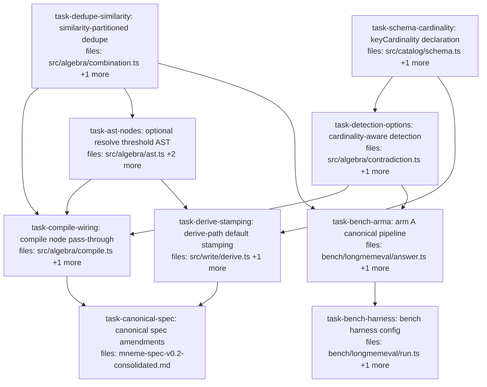

## Context

Driven by `docs/superpowers/specs/2026-06-05-contradiction-detection-composition-design.md`
(post-audit version, commit c61320f). One slice: (1) `ClaimSchema.keyCardinality` +
`cardinalityOf(key, map?)`; (2) detection floor relocated — `clustersOf`/`pairsOf` gain
`DetectionOptions`, threshold = eligibility dial; (3) similarity-partitioned `⊕_dedupe`
merge mode (audit amendment A1); (4) compile path: resolve node threshold optional at
the builder layer, defaults stamped at derive build time from `CorpusDefaults` (audit
A2 — build-time stamping, NOT eval-time catalog reads); (5) bench arm A adopts the
canonical pipeline; (6) canonical-spec amendments.

Key audit facts the implementers rely on:
- `parseExpr` (src/algebra/serialize.ts:69-95) checks REQUIRED fields only — unknown
  optional fields pass through. No serialize.ts changes needed; `REQUIRED_FIELDS["resolve"]`
  keeps `threshold` (stamping guarantees presence in serialized form).
- `oplusDedupe` groups by triple, value-blind (combination.ts:20-26) — similarity mode
  must sub-partition before `combineGroup`, or contradictions get merged away.
- `eff(claim) > threshold` (contradiction.ts:25) — "at or below cannot contest".
- `session.createCorpus` already defaults `confidenceThreshold: 0` (session.ts:78).
- jaccard("NYC", "New York City") = 0 (disjoint token sets) — probe 3 stays
  expected-fail; the new token-overlap probe is the mechanism's green case.

Watch-item (measured dial): jaccard cutoff 0.5 on short values may over-merge distinct
additive facts (dedupe also runs on multi-cardinality keys). The manual-benchmark
regression (60/60, recall@3 ≥ target) is the detector; raising the cutoff is the dial.

Worktree note: branch `algebra/detection-composition` is unpushed — worktree must be
created from `HEAD`, not origin/main. Implementers commit via pathspec
(`git commit -m "<msg>" -- <task files>`; explicit `git add <path>` only for new files).

## Tasks

## Task: keyCardinality declaration

```yaml
id: task-schema-cardinality
depends_on: []
files:
  - src/catalog/schema.ts
  - src/catalog/schema.test.ts
status: pending
```

Add the per-key cardinality map to `ClaimSchema` and the single-source-of-truth default
helper (design §1, audit A3/A4). The helper takes the **map**, not the schema, so the
algebra layer can apply the same default rule without reimplementing it.

## Implementation

```typescript
// src/catalog/schema.ts — field is a sibling of valueSchemas
export interface ClaimSchema {
  // … existing fields unchanged …
  /** Per-key cardinality; undeclared keys are "single" (⊥ eligible). */
  keyCardinality?: Record<string, "single" | "multi">;
}

/**
 * Undeclared keys default to "single". Throws on values outside "single"|"multi"
 * (manual strict check mirroring validateScope — no zod, per design audit A3).
 */
export function cardinalityOf(
  key: string,
  map?: Record<string, "single" | "multi">,
): "single" | "multi" {
  const v = map?.[key];
  if (v === undefined) return "single";
  if (v !== "single" && v !== "multi") {
    throw new Error(
      `invalid keyCardinality "${v}" for key "${key}" (expected "single" | "multi")`,
    );
  }
  return v;
}
```

```typescript
// src/catalog/schema.test.ts
import { cardinalityOf } from "./schema.js";

it("undeclared key defaults to single", () => {
  expect(cardinalityOf("hobby")).toBe("single");
  expect(cardinalityOf("hobby", {})).toBe("single");
});
```

## Acceptance criteria

- `cardinalityOf("k")` and `cardinalityOf("k", {})` return `"single"`.
- `cardinalityOf("k", { k: "multi" })` returns `"multi"`; `{ k: "single" }` returns `"single"`.
- `cardinalityOf("k", { k: "many" as any })` throws with a message matching `/invalid keyCardinality/`.
- A `ClaimSchema` literal with `keyCardinality: { hobby: "multi" }` type-checks; omitting the field type-checks (optional).
- Existing schema tests pass unchanged.

Test file: `src/catalog/schema.test.ts`.

## Task: similarity-partitioned dedupe

```yaml
id: task-dedupe-similarity
depends_on: []
files:
  - src/algebra/combination.ts
  - src/algebra/combination.test.ts
status: pending
```

Opt-in similarity mode on `oplusDedupe` (design §3, audit A1): sub-partition each
`(subject, key, scopeHash)` group by value similarity before merging, so restatements
merge while genuine conflicts survive for `⊥`. Omitted opts ⇒ byte-identical behavior.

## Implementation

```typescript
// src/algebra/combination.ts
import { similarityFn } from "./similarity.js";

/** Shared similarity-config shape — single owner; ast.ts type-imports this (DRY). */
export interface SimilarityConfig {
  fn: string;
  cutoff: number;
}

export interface DedupeOptions {
  /** Sub-partition each (subject, key, scopeHash) group by value similarity before merging. */
  similarity?: SimilarityConfig;
}

export const oplusDedupe =
  (ruleId: string, params?: unknown, opts?: DedupeOptions) =>
  (c: Corpus): Corpus => {
    assertNotDeprecatedRule(ruleId);
    // groups by claimTripleKey as today …
    // for (const group of groups.values())
    //   for (const part of subPartitions(group, opts)) out.push(combineGroup(ruleId, part, params));
  };

/**
 * No similarity configured → [group] (today's behavior, untouched).
 * Similarity mode: single-link clusters (transitive closure over pairwise
 * fn.scoreOne(a.value, b.value) >= cutoff — note >=, boundary scores merge).
 * BOTH sorts happen INSIDE this function (callers pass groups as-is):
 *   1. sort group by id ASC before clustering → deterministic under input reordering;
 *   2. sort each resulting cluster by valid.from DESC (id ASC tie-break) before
 *      returning, so combineGroup's fold rules (weighted_avg, evidence_pooled,
 *      dempster) take the LATEST member as the base/representative ("keep richest"
 *      pinned rule), while max rules still return their true winner (combineGroup
 *      semantics untouched — its own needsSort re-sorts; no chimera claims).
 * Throws: unregistered fn (via similarityFn), cutoff outside [0, 1].
 */
function subPartitions(group: Claim[], opts?: DedupeOptions): Claim[][] { /* … */ }
```

```typescript
// src/algebra/combination.test.ts
it("similarity mode merges token-overlap restatements and keeps dissimilar values separate", () => {
  // same (subject, key, scope); a~b overlap >= 0.5, x disjoint from both
  const a = mk("a", "power bank from Amazon", T0);
  const b = mk("b", "power bank from Amazon ordered Feb 13", T0 + DAY);
  const x = mk("x", "Pixel 8", T0);
  const out = oplusDedupe("rule_weighted_avg", undefined, {
    similarity: { fn: "jaccard", cutoff: 0.5 },
  })(corpusOf([a, b, x]));
  expect(out.claims).toHaveLength(2);
  // representative of the merged pair = b (latest valid.from)
  expect(out.claims.map((c) => c.value)).toContain("power bank from Amazon ordered Feb 13");
  expect(out.claims.map((c) => c.value)).toContain("Pixel 8");
});
```

## Acceptance criteria

- `opts` omitted (or `similarity` absent) ⇒ all existing combination tests pass unchanged; output byte-identical to today.
- Token-overlap restatements (jaccard ≥ cutoff) merge; disjoint values (jaccard 0) survive separately in the same triple group.
- Single-link transitivity: chain A~B, B~C with sim(A,C) < cutoff still forms ONE cluster of three.
- Representative: merged claim carries the latest-`valid.from` member's value/id (fold rules); equal `valid.from` ⇒ lexicographically-smaller id wins; `rule_max_mean`/`rule_max_concentration` still return the true winner claim.
- Deterministic: reversing input claim order produces identical output.
- `{ fn: "nonexistent", cutoff: 0.5 }` throws `/no similarity fn/`; cutoff `-0.1` or `1.1` throws.
- Confidence of a merged sub-partition equals `combineGroup` fold over its members (weighted_avg semantics unchanged).

Test file: `src/algebra/combination.test.ts`.

## Task: optional resolve threshold AST

```yaml
id: task-ast-nodes
depends_on: [task-dedupe-similarity]
files:
  - src/algebra/ast.ts
  - src/algebra/ast.test.ts
  - src/algebra/serialize.test.ts
status: pending
```

AST shape changes (design §4, audit A2/A5): resolve node `threshold` becomes optional
and gains `keyCardinality`; combine node gains `similarity`; `DEFAULT_RESOLVE_THRESHOLD`
is removed (builder no longer silently stamps 0.5). serialize.ts itself is UNCHANGED —
`parseExpr` passes unknown optional fields through and `REQUIRED_FIELDS["resolve"]`
keeps `threshold` (the derive path stamps it before serialization).

## Implementation

```typescript
// src/algebra/ast.ts
import type { SimilarityConfig } from "./combination.js"; // type-only — no runtime dep, no cycle

export type ExprNode =
  // … unchanged variants …
  | { op: "combine"; rule: string; params?: Value; similarity?: SimilarityConfig; src: ExprNode }
  | { op: "resolve"; policy: string; threshold?: number; rule?: string;
      keyCardinality?: Record<string, "single" | "multi">; src: ExprNode };

// DEFAULT_RESOLVE_THRESHOLD deleted (audit A5). Builders omit undefined fields
// (house style — see tau/kappa/aggregate):
export const combine = (rule: string, src: ExprNode, params?: Value,
  similarity?: SimilarityConfig): ExprNode => { /* omit-undefined build */ };

export const resolve = (policy: string, src: ExprNode, rule?: string,
  threshold?: number, keyCardinality?: Record<string, "single" | "multi">): ExprNode =>
  { /* omit-undefined build — NO default threshold */ };
```

```typescript
// src/algebra/serialize.test.ts
it("round-trips resolve.keyCardinality and combine.similarity", () => {
  const expr = resolve(
    "resolveDeprecateOlder",
    combine("rule_weighted_avg", leaf("c"), undefined, { fn: "jaccard", cutoff: 0.5 }),
    undefined,
    0,
    { hobby: "multi" },
  );
  const parsed = parseExpr(serializeExpr(expr));
  expect(serializeExpr(parsed)).toBe(serializeExpr(expr));
});
```

## Acceptance criteria

- `resolve("p", leaf("c"))` produces a node with NO `threshold` key (not `undefined`-valued — absent, matching the omit-undefined house style).
- `resolve("p", leaf("c"), undefined, 0.3)` produces `threshold: 0.3`; the 5th arg produces `keyCardinality`.
- `combine("r", leaf("c"), undefined, { fn: "jaccard", cutoff: 0.5 })` produces the `similarity` field; omitting it produces no key.
- `DEFAULT_RESOLVE_THRESHOLD` no longer exported; the ast.test.ts assertion of it (ast.test.ts:150) and its import (ast.test.ts:1) are removed.
- serialize round-trip of nodes carrying the new optional fields is byte-stable (`serializeExpr(parseExpr(s)) === s` canonical form).
- Existing serialize.test.ts case "rejects a resolve node missing threshold" (serialize.test.ts:162) still passes UNCHANGED — parse-level requirement stays.
- serialize.ts has zero diff in this task.

Test file: `src/algebra/ast.test.ts` (builder shapes) and `src/algebra/serialize.test.ts` (round-trip).

## Task: cardinality-aware detection

```yaml
id: task-detection-options
depends_on: [task-schema-cardinality]
files:
  - src/algebra/contradiction.ts
  - src/algebra/contradiction.test.ts
status: pending
```

`clustersOf`/`pairsOf` gain `DetectionOptions` (design §2): keys mapped `"multi"` are
excluded at grouping time via `cardinalityOf`; threshold re-documented as the
eligibility floor (existing `eff > threshold` check unchanged).

## Implementation

```typescript
// src/algebra/contradiction.ts
import { cardinalityOf } from "../catalog/schema.js";

export interface DetectionOptions {
  /** Keys mapped "multi" are excluded from cluster formation entirely. */
  keyCardinality?: Record<string, "single" | "multi">;
}

/** threshold is the confidence ELIGIBILITY floor: claims with eff(claim) <= threshold
 *  cannot contest (recommended default 0 — all contest; callers supply
 *  CorpusDefaults.confidenceThreshold on the read path). */
export function clustersOf(corpus: Corpus, threshold: number, opts?: DetectionOptions): ContradictionCluster[] {
  const aboveThreshold = corpus.claims.filter(
    (claim) =>
      eff(claim) > threshold &&
      cardinalityOf(claim.key, opts?.keyCardinality) === "single",
  );
  // … remainder unchanged …
}

export const pairsOf = (corpus: Corpus, threshold: number, opts?: DetectionOptions): ContradictionPair[] =>
  derivedPairs(clustersOf(corpus, threshold, opts));
```

```typescript
// src/algebra/contradiction.test.ts
it("keys declared multi never form clusters even with distinct values", () => {
  const c1 = mk("c1", "hobby", "painting landscapes");
  const c2 = mk("c2", "hobby", "running marathons");
  const clusters = clustersOf(corpusOf([c1, c2]), 0, { keyCardinality: { hobby: "multi" } });
  expect(clusters).toHaveLength(0);
});
```

## Acceptance criteria

- Multi-declared key with ≥2 distinct values produces zero clusters and zero pairs.
- Mixed corpus: a multi key coexisting with a single key — only the single key clusters.
- `threshold: 0` admits a low-confidence claim (eff 0.4) to contest a high-confidence one (probe-6 shape); the same corpus at threshold 0.5 produces no cluster.
- `opts` omitted ⇒ every existing contradiction test passes unchanged.
- Docstrings on both functions state the eligibility-floor semantics ("at or below cannot contest", recommended default 0).

Test file: `src/algebra/contradiction.test.ts`.

## Task: compile node pass-through

```yaml
id: task-compile-wiring
depends_on: [task-detection-options, task-dedupe-similarity, task-ast-nodes]
files:
  - src/algebra/compile.ts
  - src/algebra/compile.test.ts
status: pending
```

Wire the new node fields through compile (design §4): resolve throws on missing
threshold (explicitness — only the derive path auto-defaults) and forwards
`keyCardinality` as `DetectionOptions`; combine forwards `similarity` as `DedupeOptions`.
Note: any `resolve(...)` builder calls in compile.test.ts that relied on the removed
0.5 default must now pass an explicit threshold — they are in this task's scope.

## Implementation

```typescript
// src/algebra/compile.ts
case "combine":
  return [...compile(node.src), liftOp(oplusDedupe(node.rule, node.params,
    node.similarity ? { similarity: node.similarity } : undefined))];

case "resolve": {
  const { policy, threshold, rule: resolveRule, keyCardinality } = node;
  if (threshold === undefined) {
    throw new Error(
      "resolve node has no threshold — stamp corpus defaults via the derive path or pass one explicitly",
    );
  }
  const detectionOpts = keyCardinality ? { keyCardinality } : undefined;
  return [...compile(node.src), (c: Corpus) => {
    const { fn, input } = resolutionRegistry(policy);
    const apply = fn as (g: unknown, rule?: string) => (c: Corpus) => Corpus;
    const groups = input === "pairs"
      ? pairsOf(c, threshold, detectionOpts)
      : clustersOf(c, threshold, detectionOpts);
    return apply(groups, resolveRule)(c);
  }];
}
```

```typescript
// src/algebra/compile.test.ts
it("compiling a resolve node without threshold throws", () => {
  expect(() => compile(resolve("resolveDeprecateOlder", leaf("c")))).toThrow(/no threshold/);
});
```

## Acceptance criteria

- `compile(resolve("p", leaf("c")))` (no threshold) throws `/no threshold/` at compile time, not evaluate time.
- A compiled resolve node carrying `keyCardinality: { hobby: "multi" }` leaves two distinct-value hobby claims undeprecated; without the field they deprecate (existing behavior).
- A compiled combine node carrying `similarity` produces output equal to hand-built `oplusDedupe(rule, params, { similarity })` over a seeded corpus (extends the existing equivalence tests at compile.test.ts:440-476).
- Combine node without `similarity` compiles to today's exact behavior.
- Explicit threshold on the node is used verbatim (no defaulting anywhere in compile).

Test file: `src/algebra/compile.test.ts`.

## Task: derive-path default stamping

```yaml
id: task-derive-stamping
depends_on: [task-ast-nodes, task-schema-cardinality]
files:
  - src/write/derive.ts
  - src/write/derive.test.ts
status: pending
```

The build-time stamping pass (design §4, audit A2): before compile+serialize,
`deriveClaimFrom` normalizes the expression — resolve nodes lacking `threshold` get the
leaf corpus's `defaults.confidenceThreshold`; resolve nodes lacking `keyCardinality` get
the leaf corpus schema's `keyCardinality` (when declared). The STAMPED expression is
serialized into provenance, so replay re-evaluates exactly the values that influenced
the original evaluation — determinism by construction.

## Implementation

```typescript
// src/write/derive.ts
/**
 * Pure normalization: rebuild the src-chain, stamping corpus defaults onto resolve
 * nodes that lack them. Explicit node values always win.
 *
 * ASSUMES linear expression chains — every non-leaf ExprNode has exactly one `src`
 * (verified for all 12 variants); the leaf corpus is found by walking `src` down to
 * the leaf and calling catalog.getCorpus(leaf.corpusId). If non-linear expressions
 * are ever introduced, stamping semantics must be revisited.
 */
export function stampResolveDefaults(expr: ExprNode, catalog: Catalog): ExprNode {
  // resolve node: threshold ?? corpus.defaults.confidenceThreshold;
  //   keyCardinality ?? corpus.schema.keyCardinality — OMIT the field entirely when
  //   corpus.schema.keyCardinality is undefined (field-absent, not undefined-valued)
  // all other nodes: rebuild with stamped src; input expression never mutated
}

export function deriveClaimFrom(adapter, catalog, expr, opts): CandidateClaim {
  // …
  const stamped = stampResolveDefaults(expr, catalog);
  const result = evaluate<Corpus>(compile(stamped), ctx);
  // … provenance.derivedFrom.queryExpression: serializeExpr(stamped)
}
```

```typescript
// src/write/derive.test.ts
it("stamps corpus confidenceThreshold and keyCardinality onto an unstamped resolve node", () => {
  // test-corpus declares defaults.confidenceThreshold 0.5 and schema.keyCardinality { hobby: "multi" }
  const cand = deriveClaimFrom(adapter, catalog,
    resolve("resolveDeprecateOlder", leaf("test-corpus")), baseOpts);
  const expr = JSON.parse(cand.provenance!.derivedFrom!.queryExpression);
  expect(expr.threshold).toBe(0.5);
  expect(expr.keyCardinality).toEqual({ hobby: "multi" });
});
```

## Acceptance criteria

- Unstamped resolve node: serialized `queryExpression` carries the corpus's `confidenceThreshold` as `threshold` and the schema's `keyCardinality` (when declared).
- Schema without `keyCardinality`: the stamped node has NO `keyCardinality` key at all (`"keyCardinality" in parsed === false`), and `threshold` is still stamped.
- Explicit node values win: `resolve("p", leaf("c"), undefined, 0.9, { k: "single" })` serializes with `threshold: 0.9` and that exact map — corpus defaults NOT applied.
- The stamped expression `parseExpr`s cleanly (threshold present satisfies REQUIRED_FIELDS).
- Replay determinism (testable in derive.test.ts, no replayStatus needed): after deriving, mutate the corpus's `confidenceThreshold`; `parseExpr(queryExpression).threshold` still equals the ORIGINAL stamped value, and `evaluate(compile(parseExpr(queryExpression)), ctx)` with the recorded `evaluationClock` reproduces the original result claims — the stamped value drives replay, not the live default.
- Old-format expressions (threshold present, no keyCardinality) evaluate identically before and after this change.
- `stampResolveDefaults` is pure: input expression object is not mutated (deep-equal before/after snapshot).

Test file: `src/write/derive.test.ts`.

## Task: arm A canonical pipeline

```yaml
id: task-bench-arma
depends_on: [task-detection-options, task-dedupe-similarity]
files:
  - bench/longmemeval/answer.ts
  - bench/longmemeval/answer.test.ts
status: pending
```

Arm A adopts the canonical composition (design §5): dedupe stage (similarity mode,
jaccard) before detection; floor default drops 0.5 → 0 (mirroring the corpus default
set by `session.createCorpus`); `keyCardinality` flows in via `AnswerOpts`. Existing
answer.test.ts cases that asserted floor-0.5 behavior are updated to the new
default-0 semantics — they are in this task's scope.

## Implementation

```typescript
// bench/longmemeval/answer.ts
import { oplusDedupe } from "../../src/algebra/combination.js";

export interface AnswerOpts {
  k: number;
  /** ⊥ eligibility floor; default 0 = corpus default (session.createCorpus). */
  conflictThreshold?: number;
  /** Per-key cardinality map forwarded to detection (additive keys never contest). */
  keyCardinality?: Record<string, "single" | "multi">;
  /** Jaccard cutoff for the dedupe stage — a measured dial. */
  dedupeCutoff?: number;
}

export function answerArmA(session, corpusId, q, opts): AnswerResult {
  const t = evaluationInstant(q);
  const threshold = opts.conflictThreshold ?? 0;
  const cutoff = opts.dedupeCutoff ?? 0.5;
  const stages = pipe(
    leaf(corpusId),
    tau.valid(t),
    (c: Corpus) => oplusDedupe("rule_weighted_avg", undefined,
      { similarity: { fn: "jaccard", cutoff } })(c),
    (c: Corpus) => resolveDeprecateOlder(
      pairsOf(c, threshold, { keyCardinality: opts.keyCardinality }))(c),
    (c: Corpus) => filterCorpus(c, (cl) => cl.status !== "deprecated" && cl.key !== CONTRADICTION_FLAG_KEY),
    rho.jaccard(q.question),
  );
  // … unchanged query + takeTopK …
}
```

```typescript
// bench/longmemeval/answer.test.ts
it("keeps both values of a key declared multi (probe-1 shape)", () => {
  seedTwoHobbies(session, corpusId); // painting day 0, running day 30
  const a = answerArmA(session, corpusId, q, { k: 5, keyCardinality: { hobby: "multi" } });
  expect(a.claims.map((c) => c.value)).toEqual(
    expect.arrayContaining(["painting landscapes", "running marathons"]));
});
```

## Acceptance criteria

- Probe-1 shape: with `keyCardinality: { hobby: "multi" }`, both hobby claims returned; without the map, the older one is deprecated (existing behavior preserved as the undeclared default).
- Probe-6 shape: fresh p=0.4 claim contests stale p=1.0 at default floor 0; `resolveDeprecateOlder` returns the fresh value; passing `conflictThreshold: 0.5` reproduces the old hidden-challenger behavior.
- Token-overlap paraphrase (same triple, jaccard ≥ 0.5): merged before ⊥ — result contains ONE claim for the triple, value = latest member, nothing deprecated, no flag artifact.
- Acronym paraphrase (NYC / "New York City"): NOT merged (jaccard 0) — behavior identical to today (older deprecated by recency).
- Arm B untouched; all updated answer.test.ts cases green.

Test file: `bench/longmemeval/answer.test.ts`.

## Task: bench harness config

```yaml
id: task-bench-harness
depends_on: [task-bench-arma]
files:
  - bench/longmemeval/run.ts
  - bench/longmemeval/manual/adversarial-probe.ts
status: pending
is_wiring_task: true
```

Wire the new `AnswerOpts` config through the two harness entry points: `run.ts` passes
the manual-sample cardinality map; the adversarial probe declares per-probe maps,
updates expectation strings to the post-slice reality, and adds the token-overlap
restatement probe (probe 7).

```typescript
// bench/longmemeval/run.ts — module-level const, passed at the answerArmA call (run.ts:252)
const MANUAL_KEY_CARDINALITY: Record<string, "single" | "multi"> = {
  cooking_interest: "multi", work_tasks: "multi", activity: "multi",
  sculpture_materials_interest: "multi", next_trip_plan: "multi", occupation_activity: "multi",
};
// resultA = answerArmA(session, corpusId, q, { k: maxK, keyCardinality: MANUAL_KEY_CARDINALITY });

// bench/longmemeval/manual/adversarial-probe.ts
// - Probe interface gains keyCardinality?: Record<string, "single" | "multi">,
//   forwarded into the answerArmA opts.
// - Probe 1: keyCardinality { hobby: "multi" }; expectation → "FIXED: both hobbies kept".
// - Probe 3: expectation → "expected-fail under jaccard (acronym, token sets disjoint);
//   embedding slice acceptance case — older paraphrase deprecated, fact survives".
// - Probe 6: expectation → "FIXED: floor 0 — Pixel contests; recency rule decides".
// - Probe 7 (new): token-overlap paraphrase, e.g. notes "power bank from Amazon" day 0 /
//   "power bank from Amazon ordered Feb 13" day 30, same key; expectation: merged by
//   dedupe — single claim, latest wording, no deprecation.
```

## Acceptance criteria

- `npx tsx bench/longmemeval/manual/adversarial-probe.ts` runs clean; probe 1 arm A prints both hobby values; probe 6 arm A prints "Pixel 8"; probe 7 arm A prints the single merged Feb-13 wording; probes 2/4/5 output unchanged; probe 3 unchanged with the expected-fail expectation string.
- Probe-2 note (verified at plan audit): jaccard("Initech", "Initech again") = 1/2 = 0.5, which MEETS the ≥0.5 cutoff — those two claims now merge (representative "Initech again", latest) before Globex contests and loses by recency. The printed arm A output is identical to today; the unchanged-output expectation means merge-then-recency, not no-merge.
- `npx tsx bench/longmemeval/run.ts --file bench/longmemeval/manual/data/manual_sample.json --claims bench/longmemeval/manual/data/manual-claims.jsonl --k 1,3,10` → checks 60/60, KU updateCorrect ≥ 0.9, arm A recall@3 ≥ arm A's previous 0.7 (target ≥ 0.9).
- `npm run eval:lme:fixture` exits 0 (9/9).

Test file: `bench/longmemeval/run.test.ts` (existing — must stay green; no new cases required).

## Task: canonical spec amendments

```yaml
id: task-canonical-spec
depends_on: [task-compile-wiring, task-derive-stamping]
files:
  - mneme-spec-v0.2-consolidated.md
status: pending
is_wiring_task: true
```

Surgical inserts into the canonical spec per design §6 (style precedent: commit
3561e48). Four amendments, all ADD-framed: §3.2 `keyCardinality` field (sibling of
`valueSchemas`, undeclared-default rule, accumulation ≠ conflict rationale, manual
strict validation); §4.8 eligibility-floor semantics (clarifies "above the threshold"
≡ `eff > threshold`, "at or below cannot contest", recommended default 0, policy lives
in resolution rules), multi-valued exemption (applied at grouping time), and the
canonical read-pipeline composition note (similarity-mode `⊕_dedupe` before `⊥`);
§4.9 similarity-partitioned merge mode (opt-in generalization — omitted ⇒ existing
whole-group semantics verbatim; single-link determinism + latest-`valid.from`
representative pinned); §3.3 note that `confidenceThreshold` is the resolve node's
build-time default on the derive path.

## Acceptance criteria

- §3.2 ClaimSchema struct gains `keyCardinality` with the undeclared-default sentence; surrounding fields untouched.
- §4.8 gains the eligibility clarification + multi-valued-exemption paragraph + pipeline note; the existing three-point conflict definition text is not deleted, only clarified.
- §4.9 gains the similarity-mode subsection stating omitted-config ⇒ current semantics verbatim.
- §3.3 gains the one-sentence wiring note after the CorpusDefaults struct.
- No other section modified; diff is insert-only apart from the §4.8 clarifying sentence.

Test file: none (documentation task — spec-reviewer verifies against design doc §6).
