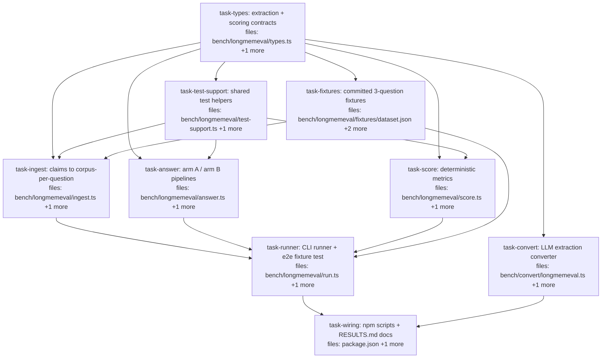

## Context

Driven by `docs/superpowers/specs/2026-06-05-longmemeval-bench-design.md`: a
deterministic LongMemEval_S retrieval benchmark in `bench/` testing the algebra read
path (recall + `⊥`/resolve + `τ_known`, arm A) against plain recall (arm B) on the
knowledge-update / temporal-reasoning / abstention question categories. LLM only at
the edge (one-time cached extraction via injected `llm` fn). Zero `src/` changes.

Confirmed seams (read during planning, do not re-derive): `tau.known(t)` is a public
`Stage` from `src/index.ts`; `pairsOf` (`src/algebra/contradiction.ts`),
`resolveDeprecateLower` (`src/algebra/resolution.ts`), `filterCorpus`
(`src/algebra/types.ts`) are exported; `session.mneme.query<O>(corpusId, pipeline,
opts)` is the DSL escape hatch (`src/mneme.ts:211`); `Session.writeMany` takes
`WriteRecord { subject, key, value, confidence?, valid?, tags? }`
(`src/surface/types.ts`). There is no latest-wins resolver in `src/algebra/resolution.ts`;
the bench defines a local `resolveDeprecateOlder` (candidate to upstream as its own
spec'd slice later).

Corpora are written under `contradictionPolicy: { kind: "always_accept" }` so
contradictions are *retained* at write time; arm A resolves them at read time. That is
the experiment.

## Tasks

## Task: extraction and scoring contracts

```yaml
id: task-types
depends_on: []
files:
  - bench/longmemeval/types.ts
  - bench/longmemeval/types.test.ts
status: pending
```

Single contracts module every other task imports: zod schemas for the normalized
dataset shape, the extracted-claim JSONL row, the extraction-cache header, plus the
category mapper and the shared `AnswerResult` shape. Raw HuggingFace JSON field names
(`haystack_sessions`, `haystack_dates`, `answer_session_ids`, …) are mapped into the
normalized shape by `normalizeQuestion`; the implementer MUST verify exact raw field
names against the downloaded `longmemeval_s.json` rather than trusting this sketch.

## Implementation

```typescript
// bench/longmemeval/types.ts
import { z } from "zod";
import type { Claim } from "../../src/core/claim.js";

export const LmeTurn = z.object({
  role: z.enum(["user", "assistant"]),
  content: z.string(),
  has_answer: z.boolean().optional(), // turn-level evidence label
});
export const LmeSession = z.object({
  sessionId: z.string(),
  date: z.string(),
  turns: z.array(LmeTurn),
});
export const LmeQuestion = z.object({
  question_id: z.string(),
  question_type: z.string(),
  question: z.string(),
  question_date: z.string(),
  answer: z.unknown().optional(),
  sessions: z.array(LmeSession),            // the haystack
  answer_session_ids: z.array(z.string()),  // session-level evidence labels
});
export type LmeQuestionT = z.infer<typeof LmeQuestion>;

/** Map one raw HF record (verify field names against the real file) → normalized. */
export function normalizeQuestion(raw: unknown): LmeQuestionT { /* … */ }

export type Category = "knowledge-update" | "temporal-reasoning" | "abstention" | "other";
/** `_abs`-suffixed question_ids are abstention; otherwise map question_type. */
export function categoryOf(q: LmeQuestionT): Category { /* … */ }

/** One extracted claim = one JSONL row. Provenance tags are the scoring linchpin. */
export const ClaimRecord = z.object({
  subject: z.string(),
  key: z.string(),
  value: z.string(),
  validFrom: z.number(), // epoch ms of source session date
  confidence: z.number().min(0).max(1).optional(),
  tags: z.array(z.string()),
}).refine(
  (r) => r.tags.some((t) => t.startsWith("session:")) && r.tags.some((t) => t.startsWith("turn:")),
  { message: "claim missing session:/turn: provenance tags" },
);
export type ClaimRecordT = z.infer<typeof ClaimRecord>;

/** First line of the extraction cache; mismatch ⇒ hard refuse, never silent mixing. */
export const CacheHeader = z.object({
  kind: z.literal("lme-extraction-header"),
  model: z.string(),
  promptVersion: z.string(),
});

/** What one arm returns for one question. */
export interface AnswerResult {
  arm: "A" | "B";
  claims: Claim[];   // top-k, provenance tags intact
  abstained: boolean;
}
```

```typescript
// bench/longmemeval/types.test.ts
import { describe, it, expect } from "vitest";
import { ClaimRecord } from "./types.js";

it("rejects a claim record without provenance tags", () => {
  const r = ClaimRecord.safeParse({
    subject: "user", key: "city", value: "Paris", validFrom: 1, tags: ["session:s1"],
  });
  expect(r.success).toBe(false); // no turn: tag
});
```

## Acceptance criteria

- `ClaimRecord.safeParse` fails when `tags` lacks a `session:` or `turn:` entry; passes with both.
- `categoryOf` returns `"abstention"` for an `_abs`-suffixed `question_id`, and maps the knowledge-update and temporal-reasoning `question_type` values per the real dataset's vocabulary.
- `CacheHeader.safeParse` rejects an object whose `kind` is not `"lme-extraction-header"`.
- `normalizeQuestion` round-trips a hand-built raw record into a shape that `LmeQuestion.parse` accepts.

Test file: `bench/longmemeval/types.test.ts`.

## Task: committed three-question fixtures

```yaml
id: task-fixtures
depends_on: [task-types]
files:
  - bench/longmemeval/fixtures/dataset.json
  - bench/longmemeval/fixtures/claims.jsonl
  - bench/longmemeval/fixtures/fixtures.test.ts
status: pending
```

Tiny hand-written dataset committed to the repo so the full pipeline runs in CI with
no network and no downloads: one knowledge-update question (a fact superseded across
two sessions), one temporal-reasoning question (evidence before and after the question
date), one abstention question (no evidence present). `claims.jsonl` is the
"pre-extracted" cache for it (header line + claim rows with correct provenance tags),
in **normalized** shape (`LmeQuestion`-conformant — fixtures skip `normalizeQuestion`).

## Implementation

```jsonc
// bench/longmemeval/fixtures/dataset.json (excerpt — one of three questions)
[
  {
    "question_id": "fx-ku-1",
    "question_type": "knowledge-update",
    "question": "Where does Alice work now?",
    "question_date": "2023/06/01 (Thu) 10:00",
    "answer": "Globex",
    "answer_session_ids": ["fx-s1", "fx-s2"],
    "sessions": [
      { "sessionId": "fx-s1", "date": "2023/04/01 (Sat) 09:00",
        "turns": [{ "role": "user", "content": "I started at Initech this week.", "has_answer": true }] },
      { "sessionId": "fx-s2", "date": "2023/05/15 (Mon) 09:00",
        "turns": [{ "role": "user", "content": "I left Initech and joined Globex.", "has_answer": true }] }
    ]
  }
]
```

```typescript
// bench/longmemeval/fixtures/fixtures.test.ts
import { describe, it, expect } from "vitest";
import { readFileSync } from "node:fs";
import { LmeQuestion, ClaimRecord, CacheHeader } from "../types.js";

it("every fixture question parses under the normalized schema", () => {
  const qs = JSON.parse(readFileSync(new URL("./dataset.json", import.meta.url), "utf8"));
  for (const q of qs) expect(LmeQuestion.safeParse(q).success).toBe(true);
});
```

## Acceptance criteria

- `dataset.json` contains exactly 3 questions — one per category (knowledge-update, temporal-reasoning, abstention) — each parsing under `LmeQuestion`.
- `claims.jsonl` line 1 parses under `CacheHeader`; every subsequent line parses under `ClaimRecord`.
- The knowledge-update fixture has two claims with the same `subject`+`key`, different `value`, different `validFrom` (superseding pair).
- The temporal fixture includes at least one claim whose `validFrom` is *after* its question's `question_date` (so `τ_known` has something to exclude).
- The abstention fixture's `answer_session_ids` is empty and no claim in `claims.jsonl` carries its session tags.

Test file: `bench/longmemeval/fixtures/fixtures.test.ts`.

## Task: shared test helpers

```yaml
id: task-test-support
depends_on: [task-types]
files:
  - bench/longmemeval/test-support.ts
  - bench/longmemeval/test-support.test.ts
status: pending
```

Single owner for the helpers the score/answer/ingest/runner test suites all need —
without this task each suite would invent its own (the S7 fragmentation risk). Mirrors
the `src/bio/test-support.ts` precedent. Pure construction helpers plus the tmp-DB
session; no assertions, no I/O beyond the tmp dir.

## Implementation

```typescript
// bench/longmemeval/test-support.ts
import { mkdtempSync, rmSync } from "node:fs";
import { tmpdir } from "node:os";
import { join } from "node:path";
import { openSession, type Session } from "../../src/surface/index.js";
import type { Claim } from "../../src/core/claim.js";
import type { LmeQuestionT, AnswerResult, ClaimRecordT } from "./types.js";

/** Tmp-DB session + best-effort cleanup. Callers MUST call close() in afterEach. */
export function openTmpSession(): { session: Session; close: () => void } {
  const dir = mkdtempSync(join(tmpdir(), "mneme-lme-"));
  const session = openSession({ dbPath: join(dir, "lme.db"), writer: "lme-test", source: "imported" });
  return { session, close: () => { session.close(); try { rmSync(dir, { recursive: true, force: true }); } catch { /* best-effort */ } } };
}

/** Question builders — one per category, evidence session ids overridable. */
export function kuQuestion(opts?: { evidence?: string[]; questionDate?: string }): LmeQuestionT { /* … */ }
export function temporalQuestion(opts?: { evidence?: string[] }): LmeQuestionT { /* … */ }
export function abstentionQuestion(): LmeQuestionT { /* … */ }

/** Claim/record builders with provenance tags. */
export function claimTagged(sessionTag: string, turnTag: string, over?: Partial<Claim>): Claim { /* … */ }
export function claimRecord(over?: Partial<ClaimRecordT>): ClaimRecordT { /* … */ }
export function armResult(arm: "A" | "B", claims: Claim[], abstained = false): AnswerResult { /* … */ }

/** Corpus seeded with a superseding pair ("Initech" then "Globex", same subject/key). */
export function seedSupersedingPair(): { session: Session; close: () => void; corpusId: string; q: LmeQuestionT } { /* … */ }

/** Path into the committed fixtures dir (used by run.test.ts). */
export function fixturePath(name: string): string { /* … */ }
```

```typescript
// bench/longmemeval/test-support.test.ts
import { describe, it, expect } from "vitest";
import { openTmpSession, claimRecord } from "./test-support.js";
import { ClaimRecord } from "./types.js";

it("claimRecord builds a record that passes the ClaimRecord schema", () => {
  expect(ClaimRecord.safeParse(claimRecord()).success).toBe(true);
});

it("openTmpSession yields a usable session and close() releases the db dir", () => {
  const { session, close } = openTmpSession();
  session.createCorpus({ id: "t" });
  expect(session.listCorpora().map((c) => c.id)).toContain("t");
  close(); // must not throw on Windows (EBUSY regression — see bench/RESULTS.md finding 2)
});
```

## Acceptance criteria

- `claimRecord()` and `claimTagged()` outputs pass `ClaimRecord.parse` / carry `session:`+`turn:` tags respectively, with overrides applied.
- `openTmpSession().close()` closes the adapter and removes the tmp dir without throwing on Windows.
- `seedSupersedingPair()` commits exactly two claims sharing subject+key with different values and ascending `valid.from`.
- Builders are pure (same inputs → deep-equal outputs) and make no network calls.

Test file: `bench/longmemeval/test-support.test.ts`.

## Task: LLM extraction converter

```yaml
id: task-convert
depends_on: [task-types]
files:
  - bench/convert/longmemeval.ts
  - bench/convert/longmemeval.test.ts
status: pending
```

Sessions → claims JSONL, LLM at the edge only. Core is pure and takes an injected
`llm: (prompt: string) => Promise<string>` (why this abstraction: the spec requires
network-free unit tests; the thin CLI shell owns `fetch` + `ANTHROPIC_API_KEY`).
Cache is per-session and resumable; header line pins model + prompt version and a
mismatch on resume is a hard refusal with instructions. Crash-mid-append is handled:
on resume, a partial/corrupted trailing JSONL line is detected and truncated, and its
session is treated as not-yet-extracted (re-prompted) — resume never reads through a
torn write. Malformed LLM output is retried with backoff, then counted `skipped` —
never silently dropped.

## Implementation

```typescript
// bench/convert/longmemeval.ts
import { z } from "zod";
import { ClaimRecord, type ClaimRecordT, type LmeQuestionT, CacheHeader } from "../longmemeval/types.js";

export const EXTRACTION_MODEL = "claude-sonnet-4-6";
export const PROMPT_VERSION = "lme-extract-v1";

export interface ExtractDeps {
  llm: (prompt: string) => Promise<string>;
  maxRetries?: number; // default 2, exponential backoff
}
export interface ExtractCache {
  has(sessionId: string): boolean;       // already extracted (resume support)
  emit(rec: ClaimRecordT): void;         // append one JSONL row
  markSkipped(sessionId: string): void;
}
export interface ExtractStats { sessions: number; extracted: number; skipped: number; claims: number }

/** Pure core: prompts per session, zod-validates, enforces provenance tags. */
export async function extractClaims(
  questions: LmeQuestionT[], cache: ExtractCache, deps: ExtractDeps,
): Promise<ExtractStats> { /* … */ }

export function buildPrompt(q: LmeQuestionT, sessionId: string): string { /* … */ }

// CLI shell (only place fetch/fs/env appear):
//   npx tsx bench/convert/longmemeval.ts --in <dataset.json> --out <claims.jsonl>
// Args via node:util parseArgs (bench/dataset.ts convention, not the bare-argv style
// of the simpler converters). Writes CacheHeader as line 1 on fresh runs; on resume,
// refuses if the existing header's model/promptVersion differ from the pinned
// constants, and truncates a partial trailing line before indexing extracted sessions.
```

```typescript
// bench/convert/longmemeval.test.ts
import { describe, it, expect } from "vitest";
import { extractClaims } from "./longmemeval.js";

it("counts a session as skipped after retries exhaust on malformed output", async () => {
  const llm = async () => "not json at all";
  const emitted: unknown[] = []; const skipped: string[] = [];
  const stats = await extractClaims([oneQuestionFixture()], {
    has: () => false, emit: (r) => emitted.push(r), markSkipped: (id) => skipped.push(id),
  }, { llm, maxRetries: 1 });
  expect(stats.skipped).toBeGreaterThan(0);
  expect(stats.extracted + stats.skipped).toBe(stats.sessions); // conservation
});
```

## Acceptance criteria

- Conservation: `extracted + skipped === sessions` on every run, asserted in tests for the all-good, all-bad, and mixed cases.
- Resume: sessions where `cache.has(id)` is true are neither prompted nor recounted; a second run over a complete cache makes zero `llm` calls.
- Every emitted record passes `ClaimRecord.parse` (including `session:`/`turn:` provenance tags and `validFrom` derived from the session date).
- Malformed LLM output retries up to `maxRetries` then increments `skipped`; valid-after-retry output is emitted, not skipped.
- Header pinning: resuming against a cache whose header model or promptVersion differs from the pinned constants throws with a message naming both values; it never appends mixed-provenance rows.
- Torn-write recovery: resuming against a cache whose final line is not valid JSON truncates that line and re-extracts its session — asserted with a deliberately truncated cache fixture in the test.

Test file: `bench/convert/longmemeval.test.ts`.

## Task: deterministic metrics

```yaml
id: task-score
depends_on: [task-types, task-test-support]
files:
  - bench/longmemeval/score.ts
  - bench/longmemeval/score.test.ts
status: pending
```

Pure functions from `(question, AnswerResult)` to per-question scores, plus the
category × arm aggregation. Evidence matching goes through provenance tags only —
`session:<id>` membership in `answer_session_ids` (turn-level via `turn:<n>` when
`has_answer` labels are present). No I/O, no LLM, no judge.

## Implementation

```typescript
// bench/longmemeval/score.ts
import { categoryOf, type Category, type LmeQuestionT, type AnswerResult } from "./types.js";

export interface QuestionScore {
  questionId: string;
  category: Category;
  arm: "A" | "B";
  evidenceRecallAt: Record<number, number>; // k → fraction of evidence sessions covered in top-k
  updateCorrect?: boolean;     // KU only: top surviving claim traces to the LATEST evidence session
  temporalCorrect?: boolean;   // temporal only: no retrieved claim postdates question_date AND right-period evidence present
  abstentionCorrect?: boolean; // abstention only: result.abstained === true
}

export function scoreQuestion(q: LmeQuestionT, r: AnswerResult, ks: number[]): QuestionScore { /* … */ }

export interface ScoreRow { category: Category; arm: "A" | "B"; metric: string; value: number; n: number }
export function aggregate(rows: QuestionScore[], ks: number[]): ScoreRow[] { /* … */ }

/** session tag helper shared by the metrics */
export function evidenceSessionsHit(r: AnswerResult, q: LmeQuestionT): Set<string> { /* … */ }
```

```typescript
// bench/longmemeval/score.test.ts
import { describe, it, expect } from "vitest";
import { scoreQuestion } from "./score.js";

it("updateCorrect is false when the top claim traces to the superseded session", () => {
  const q = kuQuestion({ evidence: ["s-old", "s-new"] }); // s-new is latest by date
  const r = armResult("A", [claimTagged("session:s-old", "turn:0")]);
  expect(scoreQuestion(q, r, [1]).updateCorrect).toBe(false);
});
```

## Acceptance criteria

- `evidenceRecallAt[k]` = |evidence sessions represented in top-k| / |evidence sessions|; 1.0 when all covered at k, 0 when none; asserted at k = 1 and 3 on hand-built fixtures. (k = 10 is the real-run default via the runner's `--k` arg; it is computed but not asserted against 3-question fixtures.)
- `updateCorrect` true iff the top non-deprecated claim carries the session tag of the *latest-dated* evidence session; false when it traces to a superseded one; `undefined` for non-KU categories.
- `temporalCorrect` false when any returned claim's session date postdates `question_date`; true when right-period evidence is hit and wrong-period excluded; `undefined` for non-temporal categories.
- `abstentionCorrect` true iff `abstained === true` on abstention questions; `undefined` otherwise.
- `aggregate` produces one row per (category × arm × metric) with `value` = mean and `n` = question count; the test builds a 4-question set (2 KU, 1 temporal, 1 abstention) via test-support builders and asserts the rows against pre-computed expected means hardcoded in the test.

Test file: `bench/longmemeval/score.test.ts`.

## Task: claims to corpus-per-question

```yaml
id: task-ingest
depends_on: [task-types, task-fixtures, task-test-support]
files:
  - bench/longmemeval/ingest.ts
  - bench/longmemeval/ingest.test.ts
status: pending
```

Extracted claims → one corpus per question via `Session.writeMany`, under
`contradictionPolicy: { kind: "always_accept" }` so contradictions are retained for
arm A's read-time resolution. Supports oracle mode (only claims from evidence
sessions). Conservation enforced: `committed === records`.

## Implementation

```typescript
// bench/longmemeval/ingest.ts
import type { Session, ImportStats, WriteRecord } from "../../src/surface/index.js";
import type { ClaimRecordT, LmeQuestionT } from "./types.js";

export function corpusIdFor(questionId: string): string { return `lme-${questionId}`; }

/** Filter the claims cache to one question's haystack (or evidence-only when oracle). */
export function claimsFor(q: LmeQuestionT, all: ClaimRecordT[], opts?: { oracle?: boolean }): ClaimRecordT[] { /* … */ }

/**
 * ClaimRecordT → WriteRecord, exported in RowMapper shape so a future direct-file
 * path can reuse src/surface/import.ts importFile without re-mapping. Note: ingest
 * itself does NOT re-implement file streaming/batching — writeMany already batches.
 */
export function mapClaimRecord(rec: ClaimRecordT): WriteRecord { /* value, valid: { from: validFrom, to: Infinity }, tags, confidence */ }

/** Create corpus + writeMany(records.map(mapClaimRecord)). Throws IngestConservationError if committed !== records. */
export function ingestQuestion(
  session: Session, q: LmeQuestionT, records: ClaimRecordT[],
): ImportStats { /* … */ }
```

```typescript
// bench/longmemeval/ingest.test.ts
import { describe, it, expect } from "vitest";
import { openSession } from "../../src/surface/index.js";
import { ingestQuestion, corpusIdFor, claimsFor } from "./ingest.js";
// fixture loading per fixtures.test.ts pattern

it("commits every fixture claim for the KU question and both contradictory values survive", () => {
  const session = openTmpSession();
  const stats = ingestQuestion(session, kuFixtureQuestion, kuFixtureClaims);
  expect(stats.committed).toBe(kuFixtureClaims.length);
  const all = session.q(corpusIdFor("fx-ku-1"), "") as { claims: unknown[] };
  expect(all.claims.length).toBe(kuFixtureClaims.length); // always_accept retains the contradiction
});
```

## Acceptance criteria

- `ingestQuestion` creates corpus `lme-<question_id>` with `always_accept` policy; both claims of the fixture superseding pair are present after ingest (contradiction retained, not resolved at write).
- Conservation: `committed === records.length` or a thrown `IngestConservationError` naming the question id and the delta — never a silent shortfall.
- Provenance tags and `validFrom` survive the round trip: a claim read back from the corpus carries its `session:`/`turn:` tags and `valid.from`.
- `claimsFor(q, all, { oracle: true })` returns only claims whose session tag is in `q.answer_session_ids`; default mode returns all haystack claims for that question.

Test file: `bench/longmemeval/ingest.test.ts`.

## Task: arm A and arm B answer pipelines

```yaml
id: task-answer
depends_on: [task-types, task-test-support]
files:
  - bench/longmemeval/answer.ts
  - bench/longmemeval/answer.test.ts
status: pending
```

The experiment's two read paths, both hand-built `Stage[]` through
`session.mneme.query`. Arm B is the vanilla-memory baseline (recall only — the stage
form of the DSL's `rank jaccard`, avoiding its quote-interpolation hazard); arm A adds
`τ_known` + read-time contradiction resolution on top of the same recall. Includes the bench-local
`resolveDeprecateOlder` (latest-wins by `valid.from`, ties by lexicographic id —
same `ContradictionPair[] → Corpus` shape as its `src/algebra/resolution.ts`
siblings; candidate to upstream as its own spec'd slice).

## Implementation

```typescript
// bench/longmemeval/answer.ts
import { leaf, pipe, rho, tau } from "../../src/index.js";
import { pairsOf, type ContradictionPair } from "../../src/algebra/contradiction.js";
import { filterCorpus, type Corpus, type RankedCorpus } from "../../src/algebra/types.js";
import type { Session } from "../../src/surface/index.js";
import type { LmeQuestionT, AnswerResult } from "./types.js";

/**
 * conflictThreshold is the confidence floor for ⊥ DETECTION (claims at or below it are
 * ignored by pairsOf/clustersOf — see src/algebra/contradiction.ts:24). It is NOT an
 * abstention threshold: abstention is structural — no claim survives the pipeline.
 */
export interface AnswerOpts { k: number; conflictThreshold?: number }

/** Bench-local latest-wins resolver (candidate to upstream into src/algebra/resolution.ts). */
export const resolveDeprecateOlder =
  (pairs: ContradictionPair[]) => (corpus: Corpus): Corpus => { /* deprecate the earlier valid.from; tie → higher id */ };

/**
 * Parse question_date → epoch ms. V8's Date.parse happens to accept the dataset's
 * "(Thu)"-style parenthetical (treated as a comment) but that is NON-STANDARD —
 * guard with Number.isNaN and throw naming the raw string (bench/convert/icews.ts:53
 * pattern), with an explicit test pinning the fixture format.
 */
export function questionInstant(q: LmeQuestionT): number { /* … */ }

/** top-k is bench-local and trivial: ranked.scored.slice(0, k).map(s => s.claim). */
function takeTopK(ranked: RankedCorpus, k: number): Claim[] { /* … */ }

/**
 * Arm B: plain recall, no resolution. Built as a minimal Stage[] (leaf → rho.jaccard)
 * via mneme.query rather than DSL string interpolation — a question containing a
 * trailing `"` breaks the DSL's `rank jaccard "…"` regex, and the stage form is
 * semantically identical to the DSL path. Never abstains; superseded values surface
 * alongside current ones.
 */
export function answerArmB(session: Session, corpusId: string, q: LmeQuestionT, opts: AnswerOpts): AnswerResult {
  const ranked = session.mneme.query<RankedCorpus>(corpusId, pipe(leaf(corpusId), rho.jaccard(q.question)));
  return { arm: "B", claims: takeTopK(ranked, opts.k), abstained: false };
}

/** Arm A: τ_known(question date) → ⊥ detect → latest-wins resolve → drop deprecated → rank → top-k. */
export function answerArmA(session: Session, corpusId: string, q: LmeQuestionT, opts: AnswerOpts): AnswerResult {
  const t = questionInstant(q);
  const stages = pipe(
    leaf(corpusId),
    tau.known(t),
    (c: Corpus) => resolveDeprecateOlder(pairsOf(c, opts.conflictThreshold ?? 0.5))(c),
    (c: Corpus) => filterCorpus(c, (cl) => cl.status !== "deprecated"),
    rho.jaccard(q.question),
  );
  const ranked = session.mneme.query<RankedCorpus>(corpusId, stages, { evaluationClock: t });
  const top = takeTopK(ranked, opts.k);
  return { arm: "A", claims: top, abstained: top.length === 0 };
}
```

```typescript
// bench/longmemeval/answer.test.ts
import { describe, it, expect } from "vitest";
import { answerArmA, answerArmB } from "./answer.js";

it("arm A resolves a superseding pair to the later value; arm B returns both", () => {
  const { session, corpusId, q } = seedSupersedingPair(); // same subject/key, "Initech" then "Globex"
  const a = answerArmA(session, corpusId, q, { k: 5 });
  const b = answerArmB(session, corpusId, q, { k: 5 });
  expect(a.claims.map(valueOf)).toEqual(["Globex"]);
  expect(b.claims.map(valueOf)).toEqual(expect.arrayContaining(["Initech", "Globex"]));
});
```

## Acceptance criteria

- Superseding pair (same subject/key, different value, different `valid.from`): arm A's results contain only the later value; arm B's contain both.
- `τ_known`: a claim with `valid.from` after the question date is excluded by arm A and returned by arm B.
- Abstention: arm A returns `abstained: true` when no claim survives the pipeline; arm B always returns `abstained: false`.
- `resolveDeprecateOlder` deprecates the earlier-`valid.from` claim of each pair and breaks `valid.from` ties by deprecating the lexicographically-higher id (mirroring `resolveDeprecateLower`'s tie rule).
- Both arms return claims with provenance tags intact (scoring depends on it).
- `questionInstant` parses the dataset's `"2023/06/01 (Thu) 10:00"` format to epoch ms (explicit test pinning the format) and throws — naming the raw string — on an unparseable date rather than propagating `NaN`.
- A question containing a double quote (embedded or trailing) flows through both arms without error.

Test file: `bench/longmemeval/answer.test.ts`.

## Task: CLI runner with fixture e2e

```yaml
id: task-runner
depends_on: [task-ingest, task-answer, task-score, task-fixtures]
files:
  - bench/longmemeval/run.ts
  - bench/longmemeval/run.test.ts
status: pending
```

Orchestrates the deterministic path end-to-end, `bench/dataset.ts`-style: load dataset
+ claims cache, filter to the three target categories, temp DB, per question ingest →
arm A + arm B → score; aggregate to a markdown table; report `checks N/M`; exit
nonzero on any conservation/integrity failure. `main()` is exported and takes argv so
the fixture e2e test runs it in-process.

## Implementation

```typescript
// bench/longmemeval/run.ts
//   npx tsx bench/longmemeval/run.ts --file <dataset.json> --claims <claims.jsonl> [--k 1,3,10] [--oracle] [--raw]
import { parseArgs } from "node:util";
import { mkdtempSync, rmSync, readFileSync } from "node:fs";
import { openSession } from "../../src/surface/index.js";
import { markdownTable } from "../lib/measure.js";
import { LmeQuestion, ClaimRecord, CacheHeader, categoryOf, normalizeQuestion } from "./types.js";
import { ingestQuestion, claimsFor, corpusIdFor } from "./ingest.js";
import { answerArmA, answerArmB } from "./answer.js";
import { scoreQuestion, aggregate } from "./score.js";

export async function main(argv: string[]): Promise<number> {
  // parse args; --raw applies normalizeQuestion (HF download), default expects normalized (fixtures)
  // validate claims cache header BEFORE creating any state
  // const dir = mkdtempSync(join(tmpdir(), "mneme-lme-")); openSession
  // try {
  //   loop questions in the 3 target categories:
  //     ingest → answerArmA/B → scoreQuestion (both arms)
  //   aggregate → markdownTable(category × arm × metric); checks:
  //     [cache header valid, per-question ingest conservation, every question scored × 2 arms]
  //   print `checks N/M`; return 0 only if N === M
  // } finally { session.close(); rmSync(dir, { recursive: true, force: true }) /* best-effort, dataset.ts pattern */ }
}
```

```typescript
// bench/longmemeval/run.test.ts
import { describe, it, expect } from "vitest";
import { main } from "./run.js";

it("fixture e2e: exits 0 and scores 3 categories × 2 arms", async () => {
  const code = await main([
    "--file", fixturePath("dataset.json"),
    "--claims", fixturePath("claims.jsonl"),
    "--k", "1,3",
  ]);
  expect(code).toBe(0); // conservation + scoring checks all pass, table printed
});
```

## Acceptance criteria

- Fixture e2e passes in-process with no network and no `bench/datasets/` downloads: exit code 0, one aggregate row for every (category × arm × metric) applicable to the 3 fixture questions.
- On the KU fixture, arm A's `updateCorrect` mean is 1.0 and arm B's is 0.0 (the designed separation — proves the pipeline measures what the spec claims).
- A corrupted claims cache (bad header) yields a nonzero exit and an error naming the header mismatch, before any ingest.
- `--oracle` restricts ingest to evidence-session claims (visible as smaller per-question committed counts on the fixtures).
- `checks N/M` line printed; any failed check ⇒ nonzero exit (verified by feeding a claims file with a missing row to break conservation).
- The temp DB directory is removed after the run (best-effort `finally`, including on failure paths) — the fixture e2e asserts the dir is gone afterward.

Test file: `bench/longmemeval/run.test.ts`.

## Task: npm scripts and RESULTS.md docs

```yaml
id: task-wiring
depends_on: [task-runner, task-convert]
files:
  - package.json
  - bench/RESULTS.md
status: pending
is_wiring_task: true
```

Expose the suite per repo convention: `eval:lme:extract` (network, one-time),
`eval:lme` (deterministic run over downloaded dataset), `eval:lme:fixture`
(network-free CI smoke). Document the LongMemEval_S + oracle download `curl` commands
and the extract→run sequence in `bench/RESULTS.md` "How to run", same convention as
icews14/ConceptNet (datasets land in the already-gitignored `bench/datasets/`).

```jsonc
// package.json (scripts additions)
"eval:lme:extract": "tsx bench/convert/longmemeval.ts --in bench/datasets/longmemeval/longmemeval_s.json --out bench/datasets/longmemeval/longmemeval-claims.jsonl",
"eval:lme": "tsx bench/longmemeval/run.ts --raw --file bench/datasets/longmemeval/longmemeval_s.json --claims bench/datasets/longmemeval/longmemeval-claims.jsonl",
"eval:lme:fixture": "tsx bench/longmemeval/run.ts --file bench/longmemeval/fixtures/dataset.json --claims bench/longmemeval/fixtures/claims.jsonl"
```

## Acceptance criteria

- `npm run eval:lme:fixture` exits 0 and prints the aggregate table with no network access and no files outside the repo + temp dir.
- `bench/RESULTS.md` "How to run" gains the LongMemEval download commands (HuggingFace URLs for `longmemeval_s` and the oracle variant) and the extract→run sequence, matching the icews14 documentation style.
- `npm run eval:lme` and `npm run eval:lme:extract` resolve (scripts exist and point at files this plan created); they are NOT required to succeed without the downloaded dataset — absent dataset must fail fast with a clear message.

Test file: none new — verified by running `npm run eval:lme:fixture` (exit 0) and `npm test` (existing suites still green).
