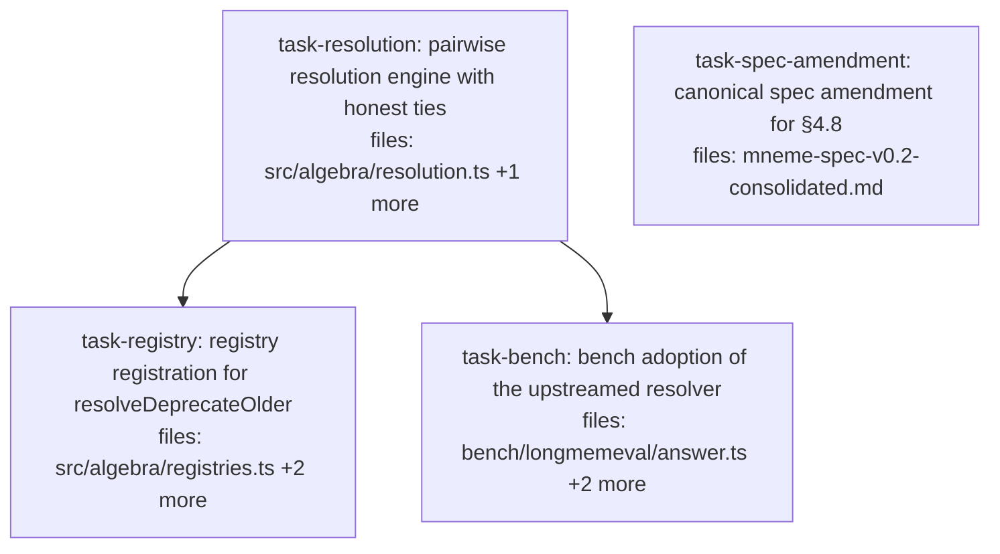

## Context

Driven by `docs/superpowers/specs/2026-06-05-resolve-deprecate-older-design.md`
(slice 1 of 4 from the LongMemEval adversarial-probe findings): upstream a
latest-wins pairwise resolver (`resolveDeprecateOlder`) and pin honest tie semantics
(exact tie ⇒ keep both + flag artifact) for BOTH pairwise deprecation resolvers via a
single shared engine. This is a **specification addition** (tie semantics were never
spec-pinned); §4.9's `⊕` tie-breaks and cluster-level tie-breaks are explicitly
untouched; the write path (`src/write/contradiction.ts:enforce()`) is independent and
unaffected.

Confirmed seams (audited; do not re-derive): registry shape
`{ fn, input: "pairs" }` (`src/algebra/registries.ts:29-36`); registry name-list test
(`src/algebra/registries.test.ts:4-10`); compile coverage pattern
(`src/algebra/compile.test.ts:496-569`); artifact construction inline in
`resolveFlagForReview` (`src/algebra/resolution.ts:71-101`, status `"candidate"`);
the lexicographic tie test to rewrite (`src/algebra/resolution.test.ts:48-57`);
`makeClaim` test-stub bug `valid: { start: null, end: null }`
(`src/algebra/resolution.test.ts:~26`); bench-local resolver to delete
(`bench/longmemeval/answer.ts:22-49`).

## Tasks

## Task: pairwise resolution engine with honest ties

```yaml
id: task-resolution
depends_on: []
files:
  - src/algebra/resolution.ts
  - src/algebra/resolution.test.ts
status: pending
```

The slice's core, one cohesive module reshape per spec §1–§3: shared
`deprecatePairwise` engine, `flagArtifactFor` helper + `CONTRADICTION_FLAG_KEY`
constant, new `resolveDeprecateOlder`, and `resolveDeprecateLower` reduced to a
comparator with the new tie semantics. `resolveFlagForReview` refactors onto the
helper with unchanged behavior. Public signatures stay `(pairs) => (corpus) => Corpus`.

## Implementation

```typescript
// src/algebra/resolution.ts (reshaped — load-bearing shapes)
export const CONTRADICTION_FLAG_KEY = "contradiction.flag";

/**
 * Extracted from resolveFlagForReview; one artifact per pair, status "candidate".
 * NOTE: carry over the existing `as any` casts on branded Claim fields (profile,
 * workspace, subject, key, scope, valid) from the current implementation (lines 74-99).
 */
const flagArtifactFor = (p: ContradictionPair): Claim => { /* … key: CONTRADICTION_FLAG_KEY … */ };

/**
 * Engine: partition pairs by loserOf; deprecate losers; for tied pairs whose members
 * BOTH survive this pass, append one flag artifact each. Tied pairs with a member
 * deprecated by a decided pair emit nothing (conflict already resolved).
 */
const deprecatePairwise =
  (pairs: ContradictionPair[], loserOf: (p: ContradictionPair) => string | "tie") =>
  (corpus: Corpus): Corpus => {
    const losers = new Set<string>();
    const tied: ContradictionPair[] = [];
    for (const p of pairs) {
      const l = loserOf(p);
      if (l === "tie") tied.push(p);
      else losers.add(l);
    }
    const artifacts = tied
      .filter((p) => !losers.has(p.left.id) && !losers.has(p.right.id))
      .map(flagArtifactFor);
    const next = deprecate(corpus, losers);
    return artifacts.length ? corpusOf([...next.claims, ...artifacts]) : next;
  };

/** Confidence comparator: lower pointEstimate loses; exact tie ⇒ "tie". */
export const resolveDeprecateLower = (pairs: ContradictionPair[]) =>
  deprecatePairwise(pairs, (p) => {
    const l = pointEstimate(p.left.confidence);
    const r = pointEstimate(p.right.confidence);
    return l < r ? p.left.id : r < l ? p.right.id : "tie";
  });

/** Recency comparator: earlier valid.from loses; exact tie ⇒ "tie". [C] */
export const resolveDeprecateOlder = (pairs: ContradictionPair[]) =>
  deprecatePairwise(pairs, (p) => {
    const l = p.left.valid.from;
    const r = p.right.valid.from;
    return l < r ? p.left.id : r < l ? p.right.id : "tie";
  });

/** Unchanged behavior, now built on flagArtifactFor. */
export const resolveFlagForReview = (pairs: ContradictionPair[]) =>
  (corpus: Corpus): Corpus => corpusOf([...corpus.claims, ...pairs.map(flagArtifactFor)]);
```

```typescript
// src/algebra/resolution.test.ts — failing test anchoring the new tie semantics
it("resolveDeprecateLower with tie keeps both claims and adds one flag artifact", () => {
  const claimA = makeClaim("claim-aaa", 5, 5, "validated"); // equal pointEstimate
  const claimB = makeClaim("claim-bbb", 5, 5, "validated");
  const out = resolveDeprecateLower([{ left: claimA, right: claimB, conflictReason: "value-difference" }])(
    corpusOf([claimA, claimB]),
  );
  const statuses = out.claims.filter((c) => c.key !== CONTRADICTION_FLAG_KEY).map((c) => c.status);
  expect(statuses).toEqual(["validated", "validated"]); // neither deprecated
  expect(out.claims.filter((c) => c.key === CONTRADICTION_FLAG_KEY)).toHaveLength(1);
});

// Property anchor: artifact count == tied pairs whose members both survive.
it("emits artifacts only for tied-surviving pairs across a mixed pair set", () => {
  // 4 pairs: (A,B) decided; (C,D) decided; (E,F) tied (both survive) ⇒ 1 artifact;
  // (B,G) tied but B was deprecated by the (A,B) pair ⇒ NO artifact.
  const out = resolveDeprecateOlder(mixedPairs)(corpusOf([a, b, c, d, e, f, g]));
  expect(out.claims.filter((cl) => cl.key === CONTRADICTION_FLAG_KEY)).toHaveLength(1);
});
```

PRE-STEP — **CRITICAL BLOCKER, do this first**: fix `makeClaim` to build
`valid: { from: 0, to: Infinity }` with an overridable `from` (the current
`{ start: null, end: null }` stub has wrong Interval field names — the recency tests
reference `valid.from`, which does not exist on the current stub; without this fix
every recency comparison is `undefined < undefined`).

## Acceptance criteria

- `resolveDeprecateOlder`: later `valid.from` survives per pair; earlier becomes
  `"deprecated"`; 3-way chain (A<B<C across pairs) leaves only C live.
- Exact `valid.from` tie ⇒ both claims keep their status and exactly one artifact per
  tied-surviving pair is appended (property: artifact count == tied pairs whose
  members both survive).
- Deprecation-beats-tie: when a decided pair deprecates a member of a tied pair, that
  tied pair emits NO artifact.
- `resolveDeprecateLower`: the lexicographic tie test (resolution.test.ts:48–57) is
  rewritten to the new expectation (both live + one artifact); all non-tie tests pass
  unchanged.
- `resolveFlagForReview`: existing tests pass unchanged; asserts now reference
  `CONTRADICTION_FLAG_KEY`.
- Immutability: after the call, the INPUT corpus object and its claims (array contents
  and each claim's status) are unchanged — the resolver returns a NEW corpus; asserted
  by capturing the input's claim statuses before the call and comparing after.
- Artifacts carry `key === CONTRADICTION_FLAG_KEY`, `subject "contradiction"`,
  `status "candidate"`, and both conflicting claim ids.

Test file: `src/algebra/resolution.test.ts`.

## Task: canonical spec amendment for §4.8

```yaml
id: task-spec-amendment
depends_on: []
files:
  - mneme-spec-v0.2-consolidated.md
status: pending
is_wiring_task: true
```

Registers the new operator and the now-pinned tie semantics in the canonical spec, per
design §5. In §4.8's resolution-operator list (~line 752): add
`resolve_deprecate_older : Set<ContradictionPair> × Corpus → Corpus` (unbadged, like
the other pairwise resolvers — implicitly core per §0.2) with recency semantics
(later `valid.from` survives). Add a short tie-semantics paragraph covering BOTH
pairwise deprecation resolvers: exact tie ⇒ keep both + one `contradiction.flag`
artifact; inline rationale (a tie means the ordering criterion cannot decide; a silent
arbitrary pick masquerades as a resolution); note this pins previously-unspecified
semantics; note cluster-level tie-breaks and §4.9 `⊕` tie-breaks are unchanged (the
latter are load-bearing for idempotence/associativity); note a per-corpus
`tieBehavior` override would belong in CorpusDefaults (§3.3) if ever needed. Match the
surrounding section's prose style and operator-listing format exactly.

## Acceptance criteria

- §4.8 lists `resolve_deprecate_older` with the signature above, adjacent to the other
  pairwise resolvers, in matching format.
- The tie-semantics paragraph covers both pairwise deprecation resolvers, the
  rationale, the spec-addition framing, and the explicit §4.9/cluster non-changes.
- The rationale prose matches the design spec's §5 wording ("a tie means the ordering
  criterion cannot decide; a silent arbitrary pick masquerades as a resolution").
- No other normative text altered (diff touches only the §4.8 vicinity).

Test file: none new — verified by reading the diff (`git diff -- mneme-spec-v0.2-consolidated.md`) and `npm test` staying green (no code referenced).

## Task: registry registration for resolveDeprecateOlder

```yaml
id: task-registry
depends_on: [task-resolution]
files:
  - src/algebra/registries.ts
  - src/algebra/registries.test.ts
  - src/algebra/compile.test.ts
status: pending
```

Wire the new resolver into the name-keyed registry that replay/serialization consume,
plus coverage in both test surfaces.

## Implementation

```typescript
// src/algebra/registries.ts — one import + one entry
import { resolveDeprecateOlder /* … existing … */ } from "./resolution.js";

const RESOLUTIONS: Record<string, ResolutionEntry> = {
  /* … existing six … */
  resolveDeprecateOlder: { fn: resolveDeprecateOlder, input: "pairs" },
};
```

```typescript
// src/algebra/registries.test.ts — failing test
it("resolutionRegistry resolves resolveDeprecateOlder as a pairs resolver", () => {
  expect(resolutionRegistry("resolveDeprecateOlder").input).toBe("pairs");
});
// and add "resolveDeprecateOlder" to the names validation list (lines 4–10).
```

Compile/replay coverage — exact shape (mirrors compile.test.ts:496–516, the pairs
pattern):

```typescript
// src/algebra/compile.test.ts
it("compiles resolve(resolveDeprecateOlder) [pairs] and evaluates equal to hand-built fn(pairsOf(...))", () => {
  const { hi, lo } = makeConflictingPair(); // give them distinct valid.from (lo earlier)
  const ctx = makeCtx([hi, lo]);
  const compiled = evaluate<Corpus>(
    compile(resolve("resolveDeprecateOlder", leaf("c"), undefined, 0.0)),
    ctx,
  );
  const corpus = corpusOf([hi, lo]);
  const { fn, input } = resolutionRegistry("resolveDeprecateOlder");
  expect(input).toBe("pairs");
  const handBuilt = (fn as any)(pairsOf(corpus, 0.0))(corpus);
  expect(compiled.claims).toHaveLength(handBuilt.claims.length);
  // the older claim is deprecated in both paths
});
```

## Acceptance criteria

- `resolutionRegistry("resolveDeprecateOlder")` returns `{ fn, input: "pairs" }`.
- The registry name-list test includes the new name (7 resolvers).
- Compile/replay round trip executes the new resolver and deprecates the older claim.

Test file: `src/algebra/registries.test.ts` (plus the case in `src/algebra/compile.test.ts`).

## Task: bench adoption of the upstreamed resolver

```yaml
id: task-bench
depends_on: [task-resolution]
files:
  - bench/longmemeval/answer.ts
  - bench/longmemeval/answer.test.ts
  - bench/longmemeval/manual/adversarial-probe.ts
status: pending
```

Pay down the documented bench-local debt: delete the local copy, import the upstreamed
resolver and key constant, and align tests/probe with the new tie semantics.

## Implementation

```typescript
// bench/longmemeval/answer.ts
import { resolveDeprecateOlder, CONTRADICTION_FLAG_KEY } from "../../src/algebra/resolution.js";
// DELETE the local resolveDeprecateOlder (lines ~22–49) and its JSDoc.

// arm A post-resolve filter gains the artifact exclusion:
(c: Corpus) => filterCorpus(c, (cl) => cl.status !== "deprecated" && cl.key !== CONTRADICTION_FLAG_KEY),
```

```typescript
// bench/longmemeval/answer.test.ts — BENCH-LAYER tie test (failing first).
// NOTE: the existing resolver UNIT tests (answer.test.ts:89–133) are DELETED, not
// rewritten — that coverage now lives in src/algebra/resolution.test.ts
// (task-resolution). The bench layer tests the arm A PIPELINE behavior:
it("arm A returns both tied values and no flag artifact in ranked results", () => {
  const { session, close, corpusId, q } = seedTiedPair(); // same valid.from, conflicting values, seeded via session.write
  const a = answerArmA(session, corpusId, q, { k: 5 });
  expect(a.claims.map(valueOf)).toEqual(expect.arrayContaining(["flat white", "cortado"])); // both survive
  expect(a.claims.some((c) => c.key === CONTRADICTION_FLAG_KEY)).toBe(false); // artifact filtered out
  close();
});
```

Probe text: `bench/longmemeval/manual/adversarial-probe.ts` case 5's `expectation`
string becomes "tie ⇒ both values returned + flagged for review (no arbitrary
winner)" — and verify by running the probe that arm A now returns both coffee values.

## Acceptance criteria

- No local `resolveDeprecateOlder` remains in bench (grep clean); imports come from
  `src/algebra/resolution.js`.
- The former resolver UNIT tests (answer.test.ts:89–133, incl. the lexicographic tie
  test) are deleted — that coverage belongs to src (task-resolution); bench tests the
  pipeline layer only.
- Arm A pipeline on a tied pair returns BOTH values and never a `contradiction.flag`
  artifact (asserted via `answerArmA` end-to-end with a seeded tied pair).
- Probe 5 run output shows arm A returning both tied values; expectation text updated.
- `npm run eval:lme:fixture` still exits 0 (no fixture data has ties — regression
  guard).

Test file: `bench/longmemeval/answer.test.ts`.
