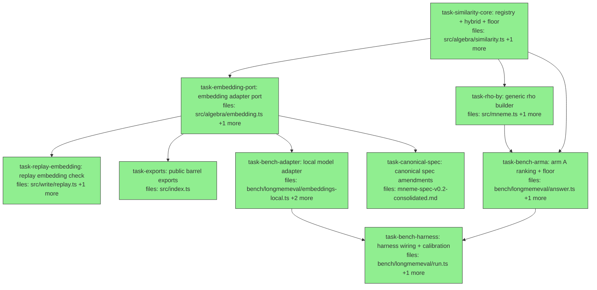

## Context

Driven by `docs/superpowers/specs/2026-06-05-similarity-slice-design.md` (post-audit
version, commit 4bd7674). One slice: embedding capability (injected `EmbeddingAdapter`
port, local model as bench devDependency — zero API spend), hybrid ranking
(`hybridMax`, composition-first — `rho` operator untouched), relevance abstention
(`relevanceFloor`), replay `embedding_version` check un-deferred. Audit-binding
constraints (spec "Audit amendments" B1–B7): `cosineOver` is THROW-ONLY (no
fallback/onWarning); `SimilarityFn.version` is math-only with model identity
exclusively in `embeddingVersions`; `answerArmA` STAYS SYNC (caller-side warm-up);
`relevanceFloor` colocates in similarity.ts; registry lookup error message
`/no similarity fn/` unchanged; this port is the repo's ONLY embedding abstraction.

Key code facts (verified):
- `rho.jaccard`/`rho.exact` builders hardcoded at src/mneme.ts:105-120, each records
  `ctx.usedSimilarityVersions[name]`. Consumers of `rho.*`: mcp/tools.ts:83,96,
  surface/dsl.ts:98,103, bench answer.ts — `.by` is additive, none break.
- similarity registry: static const Record + `similarityFn(name)` throwing plain
  Error `/no similarity fn/` (similarity.ts:34-43; tests assert the message).
- replay: deferral comment at replay.ts:14-15; similarity arm at :125-139 iterates
  `d.similarityVersions`, exact `===` compare, pushes `{kind, id}` into missing,
  early-returns `unavailable_models`. `MissingDependency.kind` union at :13-20.
- `EvalContext.usedEmbeddingModelVersions` + provenance `embeddingModelVersions`
  already exist (expression.ts:16-17, core/provenance.ts:17) — this slice populates.
- `canonicalizeValue` at src/core/value.ts:5-9; jaccard's tokens() uses it.
- Targets (manual benchmark): KU recall@3 ≥0.9 (5 named receipt questions),
  updateCorrect 1.0 HARD no-regression, abstention ≥0.6 with ZERO false abstentions
  on KU/temporal, probe 3 flips green, probes 1/2/4/5/6/7 semantically unchanged.
- CI constraint (hard): `eval:lme:fixture` + all unit tests = zero network, zero
  model; FakeEmbeddingAdapter with hand-fixed vectors for unit coverage.

Worktree/concurrency: create worktree from local HEAD (`git worktree add
.claude/worktrees/sim-slice -b algebra/similarity-slice-exec HEAD` — main is ahead
of origin, HEAD-based creation REQUIRED). Implementers commit via pathspec
(`git commit -m "<msg>" -- <task files>`; explicit `git add <path>` only for new
files; never `git add -A`). task-bench-adapter runs `npm install --save-dev`
(rewrites node_modules) → it is `single_threaded: true`.

Plan-audit notes (binding): vitest's default per-file isolation keeps module-global
registries (similarity, embedding) separate across test files — no reset machinery
needed. `updateCorrect = 1.0` is a MERGE-BLOCKING criterion enforced by the
controller at end-of-run verification (the manual benchmark is deliberately
non-CI; CI = fixture only). The `?? {}` in the replay arm is deliberate defense for
stored claims written before the field existed, even though the current type
requires it.

## Tasks

## Task: similarity registry extensions

```yaml
id: task-similarity-core
depends_on: []
files:
  - src/algebra/similarity.ts
  - src/algebra/similarity.test.ts
status: done  # 24f460f+c8fa182+fb77fcc — registry+hybridMax(NaN-guarded)+relevanceFloor; spec+quality approved
```

The similarity.ts surface grows four additive pieces (spec §2/§4, audit B5/B6):
`embeddingVersions` metadata on `SimilarityFn`, dynamic `registerSimilarity`,
the `hybridMax` combinator, and the `relevanceFloor` stage. Built-ins and the
lookup error message are byte-unchanged.

## Implementation

```typescript
// src/algebra/similarity.ts
export interface SimilarityFn {
  scoreOne(value: Value, query: Value): number;
  isPure: boolean;
  version: string; // math-only, e.g. "jaccard@1", "cosine@1" (audit B2)
  /** EmbeddingModelId → version; present only on embedding-backed fns (audit B2). */
  embeddingVersions?: Record<string, string>;
}

/** Throws a descriptive plain Error on collision with a DIFFERENT fn; same-object
 *  re-register is a no-op. Lookup error message `/no similarity fn/` unchanged. */
export function registerSimilarity(name: string, fn: SimilarityFn): void {
  const existing = registry[name];
  if (existing && existing !== fn) {
    throw new Error(`similarity fn "${name}" already registered with a different implementation`);
  }
  registry[name] = fn;
}

export const hybridMax = (a: SimilarityFn, b: SimilarityFn): SimilarityFn => ({
  isPure: a.isPure && b.isPure,
  version: `hybrid-max@1[${a.version},${b.version}]`,
  ...(a.embeddingVersions || b.embeddingVersions
    ? { embeddingVersions: { ...a.embeddingVersions, ...b.embeddingVersions } }
    : {}),
  scoreOne: (v, q) => Math.max(a.scoreOne(v, q), b.scoreOne(v, q)),
});

/** Filters RankedCorpus.scored to score >= minScore (order preserved). Empty
 *  survivors ⇒ caller's structural abstention. Throws if minScore outside [0,1]. */
export const relevanceFloor = (minScore: number): ((r: RankedCorpus) => RankedCorpus) => { /* … */ };
```

```typescript
// src/algebra/similarity.test.ts
it("hybridMax takes the max of both scores and merges embeddingVersions", () => {
  const semantic: SimilarityFn = {
    isPure: true, version: "cosine@1", embeddingVersions: { "fake-model": "v1" },
    scoreOne: () => 0.9,
  };
  const h = hybridMax(simJaccard, semantic);
  expect(h.scoreOne("NYC", "New York City")).toBe(0.9); // jaccard 0, semantic wins
  expect(h.version).toBe("hybrid-max@1[jaccard@1,cosine@1]");
  expect(h.embeddingVersions).toEqual({ "fake-model": "v1" });
});
```

## Acceptance criteria

- `registerSimilarity("x", fn)` then `similarityFn("x")` returns fn; re-register same object is a no-op; different object throws `/already registered/`; `similarityFn("nope")` still throws `/no similarity fn/` (existing tests unchanged).
- `hybridMax` scores `max(a, b)` both directions (lexical-win and semantic-win cases); `isPure` is AND; version string exact; `embeddingVersions` merged, and the key absent when neither operand has it.
- `relevanceFloor(0.5)` keeps entries with score `>= 0.5` (boundary inclusive), preserves order, returns empty `scored` when nothing clears; `relevanceFloor(-0.1)` and `(1.1)` throw.
- `SimilarityFn.embeddingVersions` is optional: `simJaccard`/`simExact` unchanged (no key).
- All existing similarity tests pass unchanged.

Test file: `src/algebra/similarity.test.ts`.

## Task: embedding adapter port

```yaml
id: task-embedding-port
depends_on: [task-similarity-core]
files:
  - src/algebra/embedding.ts
  - src/algebra/embedding.test.ts
status: done  # 763fd9e+9f2dc7b — adapter port+cache+warm+cosineOver(zero-vector fix); spec+quality approved
```

NEW module (spec §1/§3): the `EmbeddingAdapter` protocol, `EmbeddingCache`,
`warmEmbeddings`, throw-only `cosineOver` (audit B1), and the adapter registry
(`registerEmbeddingAdapter`/`embeddingAdapter`) that replay will consult. This is
the repo's ONLY embedding abstraction (audit B7).

## Implementation

```typescript
// src/algebra/embedding.ts
import type { SimilarityFn } from "./similarity.js";
import { canonicalizeValue } from "../core/value.js";

export interface EmbeddingAdapter {
  embed(texts: string[]): Promise<number[][]>; // batched, one vector per text
  id: string;        // EmbeddingModelId, e.g. "bge-small-en-v1.5"
  version: string;   // pinned revision, e.g. "q8@1"
  dim: number;
}

export class EmbeddingCache {
  // backing Map keyed `${id}@${version}␟${canonicalText}`
  get(adapter: { id: string; version: string }, text: string): Float32Array | undefined { /* … */ }
  set(adapter: { id: string; version: string }, text: string, v: Float32Array): void { /* … */ }
}

/** Batched; skips cache hits; validates dim + finiteness here (fail BEFORE queries). */
export async function warmEmbeddings(adapter: EmbeddingAdapter, cache: EmbeddingCache, texts: string[]): Promise<void> { /* … */ }

/** version "cosine@1" (math-only); embeddingVersions { [adapter.id]: adapter.version };
 *  scoreOne = sync cache lookups + cosine mapped to [0,1] via (1+cos)/2;
 *  cache miss ALWAYS throws naming the text + "run warmEmbeddings" (throw-only v1, audit B1). */
export function cosineOver(adapter: EmbeddingAdapter, cache: EmbeddingCache): SimilarityFn { /* … */ }

/** Registry keyed adapter.id — replay consults it. Collision semantics mirror registerSimilarity. */
export function registerEmbeddingAdapter(adapter: EmbeddingAdapter): void { /* … */ }
export function embeddingAdapter(id: string): EmbeddingAdapter { /* throws `no embedding adapter "${id}"` */ }
```

```typescript
// src/algebra/embedding.test.ts — FakeEmbeddingAdapter, zero network
const fake: EmbeddingAdapter = {
  id: "fake-model", version: "v1", dim: 2,
  embed: async (texts) => texts.map((t) => (t.includes("york") || t === "nyc" ? [1, 0] : [0, 1])),
};

it("cosineOver scores cached texts and throws on a miss", async () => {
  const cache = new EmbeddingCache();
  await warmEmbeddings(fake, cache, ["nyc", "new york city"]);
  const sim = cosineOver(fake, cache);
  expect(sim.scoreOne("nyc", "new york city")).toBeCloseTo(1); // same direction → cos 1 → 1.0
  expect(() => sim.scoreOne("unwarmed", "nyc")).toThrow(/warmEmbeddings/);
});
```

## Acceptance criteria

- `warmEmbeddings`: embeds only cache misses (fake adapter call-count assertion); throws on wrong-length vector (`dim` mismatch) and on non-finite values; idempotent on re-run.
- `cosineOver`: `version === "cosine@1"`; `embeddingVersions` equals `{ [adapter.id]: adapter.version }`; `isPure === true`; identical-direction vectors score 1, opposite score 0 (the (1+cos)/2 mapping); non-string values canonicalized via `canonicalizeValue` before lookup (parity test with an object value); cache miss throws `/warmEmbeddings/` — NO fallback path exists.
- `EmbeddingCache`: hit returns the stored vector; different adapter version is a distinct key.
- Registry: `registerEmbeddingAdapter` + `embeddingAdapter(id)` round-trip; unknown id throws `/no embedding adapter/`; collision with different object throws; same-object re-register no-op.
- Zero network/model in this task's tests.

Test file: `src/algebra/embedding.test.ts`.

## Task: generic rho builder

```yaml
id: task-rho-by
depends_on: [task-similarity-core]
files:
  - src/mneme.ts
  - src/mneme.test.ts
status: done  # 65688e0+46c1504 — rho.by + delegation refactor (.jaccard/.exact now delegate); spec+quality approved
```

`rho.by(name, query)` (spec §3): the generic Stage builder for any registered
similarity fn — records `usedSimilarityVersions[name]` AND merges
`fn.embeddingVersions` into `usedEmbeddingModelVersions`. Existing `.jaccard`/`.exact`
builders untouched (back-compat); `.by` sits beside them on the same `rho` object.

## Implementation

```typescript
// src/mneme.ts — beside the existing rho.jaccard/rho.exact builders (mneme.ts:105-120)
export const rho = {
  // … jaccard, exact unchanged …
  by: (name: string, query: Value): Stage<Corpus, RankedCorpus> =>
    (c, ctx) => {
      const fn = similarityFn(name); // throws /no similarity fn/ for unknown names
      if (ctx.usedSimilarityVersions) ctx.usedSimilarityVersions[name] = fn.version;
      if (fn.embeddingVersions && ctx.usedEmbeddingModelVersions) {
        Object.assign(ctx.usedEmbeddingModelVersions, fn.embeddingVersions);
      }
      return rhoOp(name, query)(c);
    },
};
```

```typescript
// src/mneme.test.ts
it("rho.by records both similarity and embedding versions in provenance accumulators", () => {
  registerSimilarity("fake-semantic", {
    isPure: true, version: "cosine@1", embeddingVersions: { "fake-model": "v1" },
    scoreOne: () => 0.5,
  });
  // run a query via mneme.query with rho.by("fake-semantic", …) and assert the
  // EvalContext accumulators (observable via a derive provenance or ctx capture)
});
```

## Acceptance criteria

- `rho.by("jaccard", q)` ranks identically to `rho.jaccard(q)` and records `usedSimilarityVersions["jaccard"] = "jaccard@1"`.
- `rho.by` over a registered fn carrying `embeddingVersions` merges them into `usedEmbeddingModelVersions`; a fn without the field leaves the accumulator untouched.
- Unknown name surfaces the existing `/no similarity fn/` throw at evaluate time.
- A `deriveClaimFrom`-path query through `rho.by` lands the versions in `provenance.derivedFrom.similarityVersions` / `.embeddingModelVersions` (the existing plumbing — assert via the candidate's provenance).
- `rho` is already exported via the barrel (src/index.ts:3 re-exports from mneme.js) — `.by` rides along; NO src/index.ts change in this task.
- Existing mneme tests pass unchanged.

Test file: `src/mneme.test.ts`.

## Task: replay embedding-version check

```yaml
id: task-replay-embedding
depends_on: [task-embedding-port]
files:
  - src/write/replay.ts
  - src/write/replay.test.ts
status: done  # 69dbef3 — embedding_version replay arm; spec+quality approved
```

Un-defer the documented deferral (spec §3, audit B3): `MissingDependency.kind`
gains `"embedding_version"`, and a mirrored availability arm checks each recorded
`embeddingModelVersions` entry against the adapter registry.

## Implementation

```typescript
// src/write/replay.ts — kind union (replace the deferral comment at :14-15)
export interface MissingDependency {
  kind: "input" | "similarity_version" | "embedding_version" | "rule";
  id: string;
}

// mirrored arm, after the similarity loop (:125-139 shape):
for (const [id, ver] of Object.entries(d.embeddingModelVersions ?? {})) {
  let available = false;
  try {
    available = embeddingAdapter(id).version === ver;
  } catch {
    available = false;
  }
  if (!available) missing.push({ kind: "embedding_version", id: `${id}@${ver}` });
}
```

```typescript
// src/write/replay.test.ts
it("reports unavailable_models with kind:embedding_version when the adapter is absent or version drifted", () => {
  // derivedFrom.embeddingModelVersions: { "fake-model": "v1" } with no registered adapter
  expect(result.status).toBe("unavailable_models");
  expect(result.missingDependencies[0].kind).toBe("embedding_version");
});
```

## Acceptance criteria

- Recorded embedding entry + registered adapter with MATCHING version ⇒ no missing dependency (proceeds to re-execution).
- Absent adapter ⇒ `unavailable_models` with `kind: "embedding_version"`, id `"<id>@<ver>"`; registered adapter with DIFFERENT version ⇒ same.
- Claims with empty/absent `embeddingModelVersions` behave exactly as before (all existing replay tests pass unchanged).
- Similarity-version arm untouched — model drift reports ONLY through the embedding arm (audit B2 separation).

Test file: `src/write/replay.test.ts`.

## Task: public barrel exports

```yaml
id: task-exports
depends_on: [task-embedding-port]
files:
  - src/index.ts
status: done  # 032a800 — barrel exports; spec+quality approved
is_wiring_task: true
```

Wire the new public surface through the barrel (spec decisions 2/5): values
`registerSimilarity`, `hybridMax`, `relevanceFloor`, `warmEmbeddings`, `cosineOver`,
`registerEmbeddingAdapter`, `embeddingAdapter`, `EmbeddingCache`; types
`SimilarityFn`, `EmbeddingAdapter`. (`rho` is already exported via mneme.js — `.by`
rides along.)

## Acceptance criteria

- Each symbol above is importable from `"mneme"` root (`src/index.ts`); `npx tsc --noEmit` clean.
- No other export lines touched; existing import sites unaffected.

Test file: none (barrel wiring — typecheck is the gate; spec-reviewer verifies the export list against spec §1/§2/§4).

## Task: local embedding adapter

```yaml
id: task-bench-adapter
depends_on: [task-embedding-port]
files:
  - bench/longmemeval/embeddings-local.ts
  - package.json
  - package-lock.json
status: done  # e1cd659+ea7c144 — local bge adapter + warmForQuestion; smoke: NYC-NYCity 0.950 vs unrelated 0.702; spec+quality approved
is_wiring_task: true
single_threaded: true
```

Reference adapter wiring (spec §5): `@huggingface/transformers` as a devDependency
(Transformers.js v3 — the official successor to `@xenova/transformers`; the
Xenova-namespace ONNX model ids remain the standard hub ids, so the pairing
`@huggingface/transformers` + model `"Xenova/bge-small-en-v1.5"` quantized is the
intended one; if the exact id is unavailable, resolve the equivalent ONNX export
and REPORT the exact package+model ids used); ~30MB one-time download, offline
after. `createLocalEmbeddingAdapter()` plus the caller-side warm-up helper
`warmForQuestion(adapter, cache, records, question)` (audit B4) that canonicalizes
record values + question and delegates to `warmEmbeddings`. SINGLE-THREADED: the
`npm install --save-dev @huggingface/transformers` rewrites node_modules — no
concurrent implementers during this task.

```typescript
// bench/longmemeval/embeddings-local.ts (shape)
export async function createLocalEmbeddingAdapter(): Promise<EmbeddingAdapter> { /* pipeline("feature-extraction", "Xenova/bge-small-en-v1.5", { quantized: true }) */ }
export async function warmForQuestion(adapter, cache, records: { value: unknown }[], question: string): Promise<void> { /* canonicalizeValue each record value + question → warmEmbeddings */ }
```

## Acceptance criteria

- `npm install` succeeds; `@huggingface/transformers` appears in devDependencies ONLY (dependencies untouched — core stays 3-dep).
- A smoke script run (`npx tsx -e` or a non-CI test file) proves: adapter creates, `embed(["hello"])` returns one finite vector of length `dim`, and `cosineOver` scores `"NYC"` vs `"New York City"` HIGHER than `"NYC"` vs `"jerk seasoning"` after warm-up — report the two scores.
- `warmForQuestion` warms every record value + the question (cache-hit assertions via a fake adapter are acceptable for the unit-level check).
- Full unit suite still green (no CI test imports the new module).

Test file: none in CI (model-backed; smoke evidence reported in the task output — spec-reviewer verifies the wiring shape).

## Task: arm A rank-floor adoption

```yaml
id: task-bench-arma
depends_on: [task-rho-by, task-similarity-core]
files:
  - bench/longmemeval/answer.ts
  - bench/longmemeval/answer.test.ts
status: done  # fde31dc — rankFn+relevanceFloor in arm A (sync); spec+quality approved
```

Arm A adopts `rho.by` + `relevanceFloor` (spec §6, audit B4): new `AnswerOpts`
fields, pipeline tail swap, SIGNATURE STAYS SYNC — no warm-up inside arm A. Default
`rankFn` resolution PINNED (plan audit): `opts.rankFn ?? "jaccard"` — arm A never
probes the registry (probing would couple its behavior to global registration
state); callers that want hybrid register it AND pass `rankFn: "hybrid"`
explicitly. Document with a comment above the line.

## Implementation

```typescript
// bench/longmemeval/answer.ts
import { relevanceFloor } from "../../src/algebra/similarity.js";

export interface AnswerOpts {
  k: number;
  conflictThreshold?: number;
  keyCardinality?: Record<string, "single" | "multi">;
  dedupeCutoff?: number;
  /** Registered similarity fn for ranking; default "jaccard" — never probes the registry. */
  rankFn?: string;
  /** Relevance floor for structural abstention; default 0 = disabled (filter is >=). */
  relevanceFloor?: number;
}

// pipeline tail (replaces rho.jaccard(q.question)):
//   rho.by(rankFn, q.question),
//   (r: RankedCorpus) => relevanceFloor(opts.relevanceFloor ?? 0)(r),
```

```typescript
// bench/longmemeval/answer.test.ts — sync, fake-fn-backed (no model)
it("arm A abstains when no claim clears the relevance floor", () => {
  registerSimilarity("fake-low", { isPure: true, version: "fake@1", scoreOne: () => 0.1 });
  const a = answerArmA(session, corpusId, q, { k: 5, rankFn: "fake-low", relevanceFloor: 0.5 });
  expect(a.abstained).toBe(true);
  expect(a.claims).toHaveLength(0);
});
```

## Acceptance criteria

- Default behavior (`rankFn` unspecified ⇒ `"jaccard"`, no registry probe) is byte-identical to today: all existing answer.test.ts cases pass unchanged and stay synchronous.
- `relevanceFloor(...)` composes in the pipe as a unary stage (TS permits the unary fn where `Stage<RankedCorpus, RankedCorpus>` is expected; ctx ignored).
- `rankFn: "fake-low"` + `relevanceFloor: 0.5` ⇒ `abstained: true`, zero claims; floor 0 ⇒ never abstains on a non-empty ranked corpus.
- `rankFn` with a registered fake semantic fn changes ranking order accordingly (deterministic fake scores).
- Arm B untouched; `answerArmA` signature remains synchronous (no Promise anywhere in answer.ts).

Test file: `bench/longmemeval/answer.test.ts`.

## Task: harness calibration wiring

```yaml
id: task-bench-harness
depends_on: [task-bench-arma, task-bench-adapter]
files:
  - bench/longmemeval/run.ts
  - bench/longmemeval/manual/adversarial-probe.ts
status: done  # 3ff3960+0017368+0924362 — two-knob recalibration ABSTAIN_TOP=0.808/floor=0; spec lazy-import finding overruled (transformers import already dynamic in adapter; CI offline-proven); quality approved
is_wiring_task: true
```

Wire the real model through both entry points (spec §6, audit B4) and calibrate the
floor: run.ts creates the adapter+cache once, registers `cosine` =
`cosineOver(adapter, cache)` and `hybrid` = `hybridMax(simJaccard, cosine)`, calls
`warmForQuestion` per question before the (sync) `answerArmA`, passes
`rankFn: "hybrid"` + the calibrated `relevanceFloor`. Probe harness mirrors it;
probe 3 expectation flips to "FIXED: hybrid ranking — cosine sees NYC ≡ New York
City". Calibration procedure: run the manual benchmark sweeping `relevanceFloor`
(e.g. 0 / 0.4 / 0.45 / 0.5 / 0.55) and pick the value meeting abstention ≥0.6 with
ZERO false abstentions and recall targets; record the chosen value + sweep table in
the task report.

## Acceptance criteria

- `npx tsx bench/longmemeval/run.ts --file bench/longmemeval/manual/data/manual_sample.json --claims bench/longmemeval/manual/data/manual-claims.jsonl --k 1,3,10` → checks 60/60; KU recall@3 ≥ 0.9 **with per-question coverage confirmed for all 5 named receipts (6aeb4375, 852ce960, d7c942c3, 71315a70, ce6d2d27)** — report per-question top-3 gold coverage; KU updateCorrect = 1.0 (merge-blocking); recall@10 = 1.0; temporal green; abstention ≥ 0.6 with false-abstention counts reported SEPARATELY for KU and temporal — both must be 0. REPORT the printed metrics + the floor sweep table verbatim.
- The calibrated `relevanceFloor` value is committed as a named const in run.ts with a comment recording the sweep result (durable measured dial, per spec Measurement).
- `npx tsx bench/longmemeval/manual/adversarial-probe.ts` — probe 3 arm A returns "New York City" with expectation string updated to: "FIXED: hybrid ranking — cosine sees NYC ≡ New York City; embedding slice acceptance case closed"; probes 1/2/4/5/6/7 semantically unchanged (same value sets).
- `npm run eval:lme:fixture` exits 0 (9/9) — fixture path untouched (jaccard default, no registration, no network).
- `npx vitest run bench/longmemeval/run.test.ts` stays green (READ-ONLY file; fixture uses the jaccard default — `rankFn` unspecified, "hybrid" never registered there).

Test file: `bench/longmemeval/run.test.ts` (existing — must stay green; no new CI cases).

## Task: canonical spec amendments

```yaml
id: task-canonical-spec
depends_on: [task-embedding-port]
files:
  - mneme-spec-v0.2-consolidated.md
status: done  # 87e4066 — Appendix B + §4.6 inserts; spec+quality approved
is_wiring_task: true
```

Two ADD-framed surgical inserts (spec §8; style precedent: the detection-composition
amendments): (1) Appendix B — row for the `sim_cosine` reference implementation
(adapter + cache-backed, warm-up contract, [0,1] mapping, throw-on-miss); (2) §4.6 —
note that similarity functions compose at the `SimilarityFn` level (combinators such
as hybrid-max) with machine-generated component version strings recorded in
provenance, and that embedding-model identity is recorded separately in
`embeddingModelVersions` per §2.7. Read the actual sections first; match surrounding
normative style; insert-only.

## Acceptance criteria

- Appendix B gains the `sim_cosine` row consistent with the existing table format; §4.6 gains the composition note after the existing SimilarityFn protocol text.
- No other section modified; diff is insert-only (no deletions of existing normative text).
- The §4.6 note does not contradict §2.7's version-capture mandate or §7's replay stratification (it implements them).

Test file: none (documentation — spec-reviewer verifies against design spec §8 and B2 separation).

## Task: top-score abstention stage

```yaml
id: task-abstain-stage
depends_on: [task-similarity-core, task-exports]
files:
  - src/algebra/similarity.ts
  - src/algebra/similarity.test.ts
  - src/index.ts
status: done  # d246269 — abstainBelowTop stage+export; reviews approved (NaN doc-test 9559496)
```

AMENDMENT (calibration finding, user-ratified two-knob design — see spec
"Calibration amendment"): `abstainBelowTop(minTopScore)` colocated with
relevanceFloor — empty `scored` when the TOP score < minTopScore (already-empty
stays empty), identity otherwise, throws outside [0,1]; barrel export. NOTE:
reuses files of DONE tasks — execution is sequential-solo at this point, no
file-scope race exists.

## Acceptance criteria

- `abstainBelowTop(0.8)` on top=0.79 ⇒ empty scored; top=0.80 ⇒ identity (boundary: abstain only when STRICTLY below); empty input ⇒ empty (no throw); out-of-range throws; order preserved on pass-through.
- relevanceFloor untouched; exported from barrel; tsc clean.

Test file: src/algebra/similarity.test.ts.

## Task: arm A abstention knob

```yaml
id: task-abstain-knob
depends_on: [task-abstain-stage, task-bench-arma]
files:
  - bench/longmemeval/answer.ts
  - bench/longmemeval/answer.test.ts
status: done  # 4c99816+9559496 — AnswerOpts knob + ordering contract; reviews approved
```

AMENDMENT: `AnswerOpts.abstainBelowTop?: number` (default 0 = off); pipeline
tail becomes `rho.by → abstainBelowTop(opts.abstainBelowTop ?? 0) →
relevanceFloor(opts.relevanceFloor ?? 0) → top-k`. Sync preserved; defaults
byte-identical.

## Acceptance criteria

- Defaults (both knobs 0) byte-identical: all existing answer tests pass unchanged, sync.
- fake fn top-score 0.7 + abstainBelowTop 0.8 ⇒ abstained true, zero claims; abstainBelowTop 0.6 ⇒ full results (no entry filtered — distinguishes from relevanceFloor).
- Both knobs together: abstainBelowTop passes, relevanceFloor filters entries below it.

Test file: bench/longmemeval/answer.test.ts.
