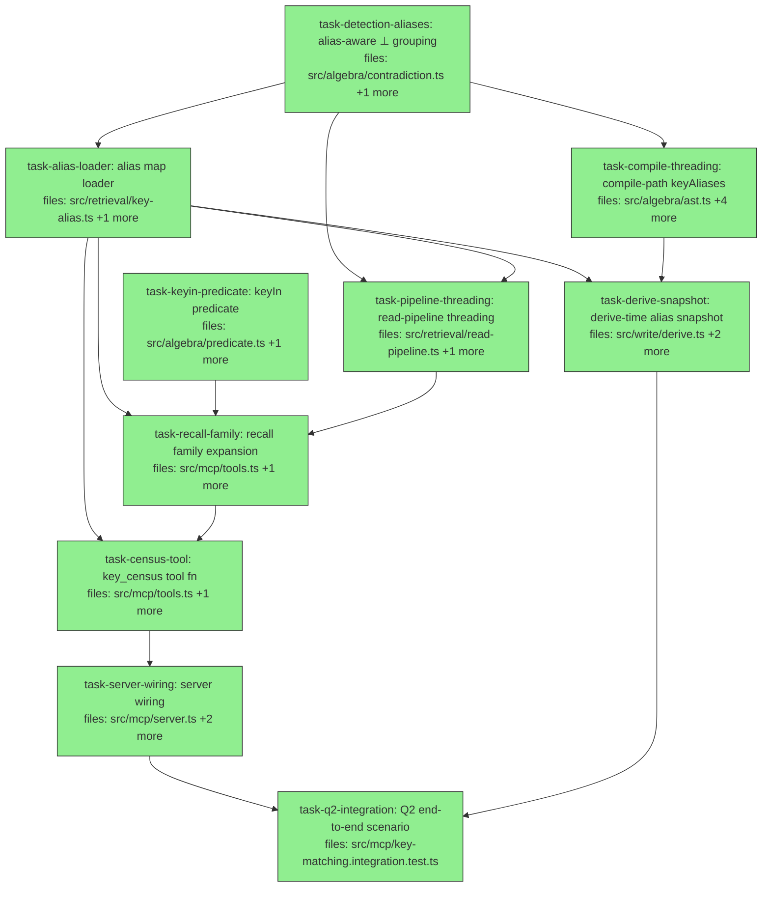

## Context

Executes the audited spec `docs/superpowers/specs/2026-06-06-key-matching-design.md` (key-matching slice: detect → declare → contest for near-duplicate claim keys). Driven by dogfood protocol Q2. Approach A1: alias map as a declarative input threaded through the established options transport (`keyCardinality` precedent, audit C3); aliases live in-corpus as claims; reach = ⊥ grouping + σ key filters; `key_census` MCP tool automates detection. Spec audit amendments A1–A13 are binding — notably: shape predicate has ONE owner (`isKeyAliasShaped` in key-alias.ts, A4); no schema auto-stamp (A5); `KeyAliasMap` declared in algebra (A3); derive-time snapshot computed by `deriveClaimFrom`, never stamped from corpus schema (A2); loader recipe deliberately diverges from canonicalReadStages for three documented reasons (A7).

Layering rule: algebra never imports retrieval; retrieval imports algebra; mcp/write import retrieval (write→retrieval is a new but acyclic direction — retrieval imports nothing from write; implementers verify no cycle).

Baseline: main @ 3b8a7e8, 1,528 tests green. Acceptance criterion 4: empty/absent alias map is a behavioral no-op — no existing test expectation edits.

## Tasks

## Task: keyIn predicate

```yaml
id: task-keyin-predicate
depends_on: []
files:
  - src/algebra/predicate.ts
  - src/algebra/predicate.test.ts
status: done
```

Add a `keyIn` member to the σ `Predicate` union, mirroring the existing `subjectIn` (spec A13). Additive: a union member plus one `matches` case. No sqlite pushdown work — non-value predicates evaluate in memory.

## Implementation

```typescript
// src/algebra/predicate.ts — union gains:
| { op: "keyIn"; values: string[] }
// matches() switch gains:
case "keyIn":
  return p.values.includes(claim.key);
```

```typescript
// src/algebra/predicate.test.ts
it("keyIn matches any key in the set", () => {
  const c = makeClaim({ key: "preferred_editor" });
  expect(matches(c, { op: "keyIn", values: ["editor", "preferred_editor"] })).toBe(true);
  expect(matches(c, { op: "keyIn", values: ["editor"] })).toBe(false);
});
```

## Acceptance criteria

- `matches(claim, { op: "keyIn", values })` returns true iff `claim.key` is in `values`; empty `values` matches nothing.
- `keyIn` composes under `and`/`or`/`not` like every other predicate.
- Existing predicate tests unmodified and green.

Test file: `src/algebra/predicate.test.ts`.

## Task: alias-aware contradiction grouping

```yaml
id: task-detection-aliases
depends_on: []
files:
  - src/algebra/contradiction.ts
  - src/algebra/contradiction.test.ts
status: done
```

Declare `KeyAliasMap` in algebra (spec A3) and extend `DetectionOptions` with `keyAliases`. Grouping and cardinality consult the canonical key: `canonical(k) = keyAliases?.[k] ?? k`. Flag artifacts and `cluster.triple.key` carry the canonical key (spec Decision 3). The map arrives flat and pre-resolved — no chains, cycles, or meta-aliases reach algebra.

## Implementation

```typescript
// src/algebra/contradiction.ts (additive)
export type KeyAliasMap = Record<string, string>; // variant → canonical; flat, pre-resolved

export interface DetectionOptions {
  keyCardinality?: Record<string, "single" | "multi">;
  keyAliases?: KeyAliasMap; // NEW
}

const canonicalKeyOf = (key: string, aliases?: KeyAliasMap): string => aliases?.[key] ?? key;

// clustersOf: cardinality check (currently contradiction.ts:43) and the
// claimTripleKey grouping (currently :48-49) both use canonicalKeyOf(claim.key, opts?.keyAliases).
```

```typescript
// src/algebra/contradiction.test.ts
it("aliased keys contest: one pair across editor/preferred_editor", () => {
  const a = makeClaim({ subject: "user", key: "editor", value: "vim" });
  const b = makeClaim({ subject: "user", key: "preferred_editor", value: "emacs" });
  expect(pairsOf(corpusOf([a, b]), 0, { keyAliases: { preferred_editor: "editor" } })).toHaveLength(1);
  expect(pairsOf(corpusOf([a, b]), 0, {})).toHaveLength(0); // absent map = today's behavior
});
```

## Acceptance criteria

- Two claims with same subject/scope, different stored keys, and a `keyAliases` entry mapping one to the other form a contest pair; without the map they do not.
- `cluster.triple.key` carries the canonical key; flag artifacts pair claims that were grouped under the canonical key (their leftId/rightId may span stored keys — the artifact value carries claim ids, not keys, per `resolution.ts` flagArtifactFor).
- `cardinalityOf` consults the canonical key: cardinality `"multi"` declared on the canonical exempts variant-key claims from clustering.
- `keyAliases: undefined` and `keyAliases: {}` are byte-for-byte identical to current behavior (no existing test expectation changes).

Test file: `src/algebra/contradiction.test.ts`.

## Task: alias map loader

```yaml
id: task-alias-loader
depends_on: [task-detection-aliases]
files:
  - src/retrieval/key-alias.ts
  - src/retrieval/key-alias.test.ts
status: done
```

The single owner of the alias shape (spec A4) and the claims→map recipe (spec §2). Pass 1 is alias-blind and deliberately NOT `canonicalReadStages` — three documented divergences (A7): the serving filter would drop alias claims; no ⊕_dedupe (jaccard@0.5 could merge same-variant claims pointing at token-similar but different canonicals, corrupting the map); cardinality forced all-single ignoring project config. Pass 2 resolves chains to fixpoint with deterministic degradation. Pure: warnings are returned, never printed. (Barrel export of the new module lands in task-server-wiring, which owns `src/index.ts`.)

## Implementation

```typescript
// src/retrieval/key-alias.ts
import type { Claim } from "../core/claim.js";
import type { KeyAliasMap } from "../algebra/contradiction.js";
export type { KeyAliasMap } from "../algebra/contradiction.js";

export const KEY_ALIAS_KEY = "alias-of";
export const KEY_SUBJECT_PREFIX = "key:";

export function isKeyAliasShaped(c: Claim): boolean {
  return c.key === KEY_ALIAS_KEY && c.subject.startsWith(KEY_SUBJECT_PREFIX);
}

export interface AliasLoadResult {
  map: KeyAliasMap;     // flat variant → canonical
  selfAliases: string[]; // active identity mappings (un-ratified keys), for census observability
  warnings: string[];   // cycles / ties / meta-aliases / malformed values, human-readable
}

/**
 * Pass 1: filter isKeyAliasShaped → τ_valid(evaluationInstant) → ⊥ +
 * resolveDeprecateOlder (all-single, NO dedupe) → drop deprecated + flag artifacts.
 * Reuses the same algebra imports read-pipeline.ts uses (tauValid, pairsOf,
 * resolveDeprecateOlder) — small parallel recipe, divergences documented above.
 * Pass 2: variant = subject minus KEY_SUBJECT_PREFIX, canonical = String(value);
 * fixpoint chain resolution; case-sensitive exact strings throughout (A12).
 * Takes Claim[] (what every call site has — session.mneme.read / adapter.query
 * return Claim[]); wraps with corpusOf internally for the algebra stages.
 * Deliberate deviation from spec §2's Corpus-typed sketch.
 * LAYERING: this module imports algebra/core ONLY — never ../mneme.js
 * (read-pipeline's rho import is NOT a precedent here; importing mneme.js
 * would close a real cycle once write/derive.ts imports this module).
 */
export function aliasMapOf(claims: readonly Claim[], opts: { evaluationInstant: number }): AliasLoadResult;

/** Family = all variants sharing key's canonical + the canonical itself; [key] when unmapped. Works from variant or canonical input. */
export function keyFamilyOf(key: string, map: KeyAliasMap): string[];
```

```typescript
// src/retrieval/key-alias.test.ts
it("resolves chains to fixpoint and drops cycles with a warning", () => {
  const claims = [
    aliasClaim("a", "b"), aliasClaim("b", "c"),   // chain: a→c, b→c
    aliasClaim("x", "y"), aliasClaim("y", "x"),   // cycle: dropped
  ];
  const { map, warnings } = aliasMapOf(claims, { evaluationInstant: NOW });
  expect(map).toEqual({ a: "c", b: "c" });
  expect(warnings.some((w) => w.includes("cycle"))).toBe(true);
});
```

## Acceptance criteria

- Chains resolve to fixpoint (`a→b, b→c` yields `a→c, b→c`); diamonds (`a→c, b→c`) pass through.
- Cycles: all members dropped, one warning naming them. Ties for one variant: variant dropped, warning. Meta-aliases (variant or canonical is `alias-of` or `key:`-prefixed): dropped, warning. Malformed values (non-string/empty): ignored, warning. Never throws on bad data.
- Self-aliases excluded from `map`, listed in `selfAliases` (un-ratify, A12).
- Supersession among alias claims honored: a newer `alias-of` write for the same variant wins; the loader sees only resolved survivors.
- `keyFamilyOf("editor", {preferred_editor: "editor"})` and `keyFamilyOf("preferred_editor", ...)` both return `["editor", "preferred_editor"]` (order-stable); unmapped key returns `[key]`.
- `isKeyAliasShaped` rejects near-misses (`alias-of` key with non-`key:` subject; `key:` subject with other key).

Test file: `src/retrieval/key-alias.test.ts`.

## Task: read-pipeline threading

```yaml
id: task-pipeline-threading
depends_on: [task-detection-aliases, task-alias-loader]
files:
  - src/retrieval/read-pipeline.ts
  - src/retrieval/read-pipeline.test.ts
status: done
```

`ReadPipelineOpts` gains `keyAliases?: KeyAliasMap`, forwarded into the resolve stage's `DetectionOptions` (the keyCardinality path, currently read-pipeline.ts:64). The post-resolve serving filter (a retrieval Stage closure — NOT compiled, spec A1) additionally drops `isKeyAliasShaped` claims.

## Implementation

```typescript
// src/retrieval/read-pipeline.ts
import { isKeyAliasShaped } from "./key-alias.js"; // same-layer sibling
export interface ReadPipelineOpts {
  // ...existing...
  keyAliases?: KeyAliasMap; // NEW — forwarded to DetectionOptions like keyCardinality
}
// resolve stage: pairsOf(c, threshold, { keyCardinality: opts.keyCardinality, keyAliases: opts.keyAliases })
// serving filter gains: && !isKeyAliasShaped(cl)
```

```typescript
// src/retrieval/read-pipeline.test.ts
it("serving filter drops alias-shaped claims; aliased stale loser deprecated", () => {
  const stages = canonicalReadStages({ evaluationInstant: NOW, keyAliases: { preferred_editor: "editor" } });
  const out = applyStages(stages, [oldEditorClaim, newPreferredEditorClaim, aliasClaim("preferred_editor", "editor")]);
  expect(out.map((c) => c.key)).toEqual(["preferred_editor"]); // newer wins; alias claim filtered
});
```

## Acceptance criteria

- With a `keyAliases` map, an older claim under the canonical key and a newer claim under a variant key contest; only the newer serves.
- Alias-shaped claims never appear in pipeline output, with or without a map.
- Without `keyAliases`, output is identical to current behavior (existing pipeline tests untouched and green — acceptance criterion 4 of the spec).

Test file: `src/retrieval/read-pipeline.test.ts`.

## Task: compile-path keyAliases threading

```yaml
id: task-compile-threading
depends_on: [task-detection-aliases]
files:
  - src/algebra/ast.ts
  - src/algebra/compile.ts
  - src/algebra/ast.test.ts
  - src/algebra/compile.test.ts
  - src/algebra/serialize.test.ts
status: done
```

The resolve `ExprNode` gains an optional `keyAliases` field (additive, spec A2); `compile.ts` threads it into the `detectionOpts` passed to `pairsOf`/`clustersOf` (parallel to `keyCardinality`, currently compile.ts:106-112). Serialization is free via the generic canonicalizer — but round-trip is explicitly tested.

## Implementation

```typescript
// src/algebra/ast.ts — resolve node (additive field), AND the resolve() builder
// (ast.ts ~:90-102, positional optionals ending in keyCardinality) gains a
// trailing optional keyAliases param — serialize tests construct via the builder.
keyAliases?: Record<string, string>;

// src/algebra/compile.ts — detectionOpts build (mirror keyCardinality):
const detectionOpts =
  keyCardinality !== undefined || keyAliases !== undefined
    ? { keyCardinality, keyAliases }
    : undefined;
```

```typescript
// src/algebra/serialize.test.ts
it("round-trips keyAliases on a resolve node", () => {
  const node = resolveNode({ keyAliases: { preferred_editor: "editor" } });
  expect(deserializeExpr(serializeExpr(node))).toEqual(node);
});
```

## Acceptance criteria

- A compiled expression whose resolve node carries `keyAliases` produces the same contest pairs as the interpreted path with equivalent `DetectionOptions` (compile-equivalence, house pattern in compile.test.ts).
- `serializeExpr`/parse round-trip preserves `keyAliases` exactly; nodes without the field serialize unchanged (no golden-string churn in existing serialize tests).
- Resolve nodes without `keyAliases` compile to `detectionOpts` identical to today.

Test file: `src/algebra/compile.test.ts` (equivalence), `src/algebra/serialize.test.ts` (round-trip).

## Task: derive-time alias snapshot

```yaml
id: task-derive-snapshot
depends_on: [task-alias-loader, task-compile-threading]
files:
  - src/write/derive.ts
  - src/write/derive.test.ts
  - src/write/replay.test.ts
status: done
```

Spec A2 mechanism: `deriveClaimFrom` — which holds the adapter — computes `aliasMapOf` over the corpus at `evaluationClock` and sets `keyAliases` explicitly on any resolve node that lacks it. `stampResolveDefaults` preserves an explicit field (explicit-wins, like `threshold`) and NEVER stamps aliases from corpus schema (aliases are claims; C3). The serialized `queryExpression` therefore snapshots the active map; replay re-executes the node, not the live map. write→retrieval import is acyclic (retrieval imports nothing from write).

## Implementation

```typescript
// src/write/derive.ts
import { KEY_ALIAS_KEY, aliasMapOf } from "../retrieval/key-alias.js";

// (a) stampResolveDefaults rebuilds resolve nodes FIELD-BY-FIELD (derive.ts:49-76)
//     and would silently drop keyAliases — add the carry-through to the rebuild:
//       if (expr.keyAliases !== undefined) newNode.keyAliases = expr.keyAliases;
// (b) ORDER MATTERS: stamp FIRST, then walk the STAMPED tree. In deriveClaimFrom:
const aliasClaims = adapter.query({ corpusId: findLeafCorpusId(expr), key: KEY_ALIAS_KEY });
const { map } = aliasMapOf(aliasClaims, { evaluationInstant: evaluationClock });
// walk the stamped tree (same linear src-chain walk stampResolveDefaults uses):
// for each resolve node with keyAliases === undefined and a non-empty map,
// set keyAliases = map. Explicit keyAliases always wins (including explicit {}).
```

```typescript
// src/write/replay.test.ts
it("replays exact after the alias is re-pointed post-derivation", () => {
  // derive with alias preferred_editor→editor active; then write a superseding
  // alias claim re-pointing preferred_editor→ide; replayStatus must be "exact".
  expect(replayStatus(derived, adapter, catalog).status).toBe("exact");
});
```

## Acceptance criteria

- A derived claim's `queryExpression` contains the alias map active at `evaluationClock`; an explicit `keyAliases` on the node (including `{}`) is never overwritten.
- Explicit `keyAliases` survives `stampResolveDefaults` (carry-through in the resolve-node rebuild — extend the existing stampResolveDefaults describe block in `derive.test.ts`).
- Empty resolved map ⇒ no field set (serialized expression byte-identical to pre-slice derivations).
- Replay returns `exact` after a post-derivation alias re-point or un-ratify (the snapshot isolates).
- Existing derive/replay tests green unmodified.

Test file: `src/write/derive.test.ts`, `src/write/replay.test.ts`.

## Task: recall family expansion

```yaml
id: task-recall-family
depends_on: [task-alias-loader, task-pipeline-threading, task-keyin-predicate]
files:
  - src/mcp/tools.ts
  - src/mcp/tools.test.ts
status: done
```

MCP `recall` becomes alias-aware (spec §4): fetch alias claims (adapter plan `{ corpusId, key: KEY_ALIAS_KEY }`, index-backed) → `aliasMapOf` → thread `map` into `ReadPipelineOpts`; expand the `key` argument to its family via `keyIn`; warm-up reads use the SAME expanded family (A8 — otherwise cross-family claims silently degrade to jaccard); emit variant-declared-cardinality warnings (A11). `recall` stays pure: warnings are returned on the result for the server layer to surface.

## Implementation

```typescript
// src/mcp/tools.ts — recall()
import { KEY_ALIAS_KEY, aliasMapOf, keyFamilyOf } from "../retrieval/key-alias.js";

const aliasClaims = session.mneme.read(args.corpus, { corpusId: args.corpus, key: KEY_ALIAS_KEY });
const { map, warnings } = aliasMapOf(aliasClaims, { evaluationInstant: now });
const family = args.key ? keyFamilyOf(args.key, map) : undefined;
// claims read: one adapter read per family key, concatenated (preserves index pushdown)
// σ: family && family.length > 1 ? { op: "keyIn", values: family } : existing keyEq
// warm-up read scope: the same family keys (A8)
// canonicalReadStages({ evaluationInstant: now, keyCardinality, keyAliases: map })
// A11: for each k in deps.keyCardinality where map[k] exists → warning
return { ...result, warnings: allWarnings.length ? allWarnings : undefined };
```

```typescript
// src/mcp/tools.test.ts
it("recall by canonical key retrieves the surviving variant-key claim", async () => {
  // editor (old, vim) + preferred_editor (new, emacs) + ratified alias in fake adapter
  const r = await recall(session, { about: "editor", key: "editor", corpus: "c" }, deps);
  expect(r.matches.map((m) => m.key)).toEqual(["preferred_editor"]);
});
```

## Acceptance criteria

- `key: "editor"` and `key: "preferred_editor"` (variant direction) both retrieve across the family; the stale loser is absent.
- Warm-up covers family-expanded claims: with a hybrid-capable fake, a variant-key claim is cosine-scored, not jaccard-fallback.
- Loader warnings and variant-cardinality warnings appear on the result's `warnings` field; no stderr writes from `tools.ts`.
- Zero alias claims ⇒ behavior identical to today (existing tools tests green unmodified); alias-claim fetch failure ⇒ degrade alias-less with a warning, recall succeeds (spec §7).

Test file: `src/mcp/tools.test.ts`.

## Task: key_census tool function

```yaml
id: task-census-tool
depends_on: [task-alias-loader, task-recall-family]
files:
  - src/mcp/tools.ts
  - src/mcp/tools.test.ts
status: done
```

Read-only census (spec §5) as a pure function over `Session` in `tools.ts` (house structure): distinct keys + counts; O(K²) candidate pairs scored by the registered rank fn (hybrid when loaded — key strings warmed via `warmValues` first — jaccard fallback), sorted desc, truncated to `limit`, `rankFn` reported like recall; resolved alias map; `selfAliases` listed as un-ratified; loader + variant-cardinality warnings; ready-to-paste `remember` ratification shape in the composed text. **Census population (pinned):** counts non-deprecated claims valid at `evaluationInstant`, EXCLUDING `isKeyAliasShaped` claims and `CONTRADICTION_FLAG_KEY` artifacts; pairs are scored over that key set only (alias/flag infrastructure keys never appear as candidates). Census never writes and never logs to the recall-log. Depends on task-recall-family for file-scope serialization on `tools.ts` (and reuses its alias-load block — extract a small shared private helper rather than duplicating).

## Implementation

```typescript
// src/mcp/tools.ts
export interface CensusArgs { corpus?: string; limit?: number } // corpus defaults at server layer (A6)
export interface CensusResult {
  corpus: string;
  keys: { key: string; claims: number }[];
  candidates: { a: string; b: string; score: number }[]; // sorted desc, truncated to limit
  aliases: Record<string, string>;
  unratified: string[];
  warnings: string[];
  rankFn: string;
  content: string; // composed text incl. remember-shape ratification affordance
}
export async function keyCensus(session: Session, args: CensusArgs, deps: RecallDeps): Promise<CensusResult>;
```

```typescript
// src/mcp/tools.test.ts
it("census scores key pairs with jaccard fallback and reports rankFn", async () => {
  const r = await keyCensus(session, { corpus: "c", limit: 5 }, jaccardDeps);
  expect(r.rankFn).toBe("jaccard");
  expect(r.candidates[0]).toMatchObject({ a: "editor", b: "preferred_editor" });
  expect(r.candidates.length).toBeLessThanOrEqual(5);
});
```

## Acceptance criteria

- Distinct keys + per-key claim counts for the target corpus (non-deprecated, valid at evaluationInstant; alias-shaped claims and flag artifacts excluded from keys AND candidate pairs); unknown corpus ⇒ empty report, no corpus created (spec §7).
- All key pairs scored, sorted descending, truncated to `limit`; `rankFn` reflects the actual scorer (hybrid vs jaccard fallback).
- Resolved aliases, un-ratified self-aliases, and all warnings present in the structured result; composed `content` includes the `remember` ratification shape.
- Census performs zero writes and zero recall-log appends.

Test file: `src/mcp/tools.test.ts`.

## Task: server wiring

```yaml
id: task-server-wiring
depends_on: [task-census-tool]
files:
  - src/mcp/server.ts
  - src/mcp/server.integration.test.ts
  - src/index.ts
status: done
is_wiring_task: true
```

Register `key_census` with a Zod schema following the sibling tools' pattern (`corpus` defaulting to the server's `defaultCorpus` — A6; `limit` default 20); surface `warnings` returned by `recall`/`keyCensus` on stderr (house convention: tools stay pure, the server does I/O); barrel-export the key-alias module from `src/index.ts`. **Recall registration delta (explicit):** the recall `outputSchema` gains `warnings: z.array(z.string()).optional()` and the `structuredContent` literal passes it through — both enumerate fields explicitly, so omitting either silently drops the field. Recall-log behavior unchanged (census never logs).

## Acceptance criteria

- `key_census` is callable over MCP after server start; omitted `corpus` censuses the server's `defaultCorpus`, not `"knowledge"`.
- Warnings from recall and census land on stderr exactly once per call; tool results still carry them structurally.
- `aliasMapOf`, `keyFamilyOf`, `isKeyAliasShaped`, `KEY_ALIAS_KEY`, `KEY_SUBJECT_PREFIX`, `KeyAliasMap` reachable from the package barrel (`src/index.ts`).
- Existing server integration tests green; `remember`/`recall`/`list_corpora` registration untouched.

Test file: `src/mcp/server.integration.test.ts`.

## Task: Q2 end-to-end scenario

```yaml
id: task-q2-integration
depends_on: [task-server-wiring, task-derive-snapshot]
files:
  - src/mcp/key-matching.integration.test.ts
status: done
```

The spec's acceptance criterion 1 as one integration test file exercising the full detect → declare → contest loop at the MCP boundary (house pattern: server.integration.test.ts style harness, fake or real-temp adapter).

## Implementation

```typescript
// src/mcp/key-matching.integration.test.ts — scenario skeleton
// 1. remember(editor=vim), remember(preferred_editor=emacs, later) → recall: BOTH serve (drift shown)
// 2. census → candidates include {a/b: editor/preferred_editor}, no aliases yet
// 3. remember({ subject: "key:preferred_editor", key: "alias-of", value: "editor" })  // ratify
// 4. recall(key: "editor") AND recall(key: "preferred_editor") → only emacs claim; vim claim deprecated, not deleted
// 5. census → resolved alias present; pair no longer "undeclared"
// 6. remember self-alias → census lists preferred_editor as un-ratified
```

```typescript
it("ratification flips drift into supersession without deleting the loser", async () => {
  // step 4 assertion + direct adapter read: vim claim still in store with status "deprecated"
});
```

## Acceptance criteria

- Pre-ratification: both drifted claims serve and census surfaces the scored pair.
- Post-ratification: both key directions retrieve only the newest claim; the loser exists in the store with status `deprecated` (non-destructive — the wedge).
- Un-ratify via self-alias restores both-serve behavior and census lists the key as un-ratified.
- Full suite green at slice end (≥1,528 baseline, no expectation edits to pre-existing tests).

Test file: `src/mcp/key-matching.integration.test.ts`.
