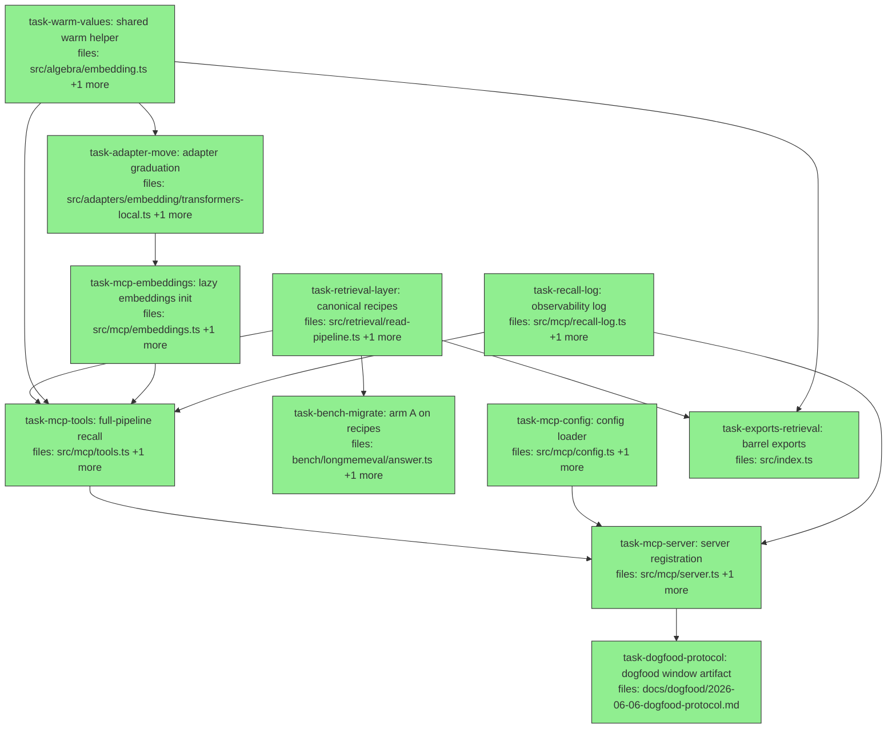

## Context

Driven by `docs/superpowers/specs/2026-06-06-mcp-dogfood-upgrade-design.md` (post-audit,
commit adac36a). One slice: `src/retrieval/` as a first-class layer (canonicalReadStages
+ rankedTailStages — the pipeline front-and-center per user elevation); embeddings
graduate to `src/adapters/embedding/` (dynamic import, graceful jaccard fallback —
server never dies modelless); MCP recall runs the FULL algebra with both knobs +
observability (topScore/abstained/rankFn + `.mneme/recall-log.jsonl`);
`.mneme/config.json` keyCardinality (read-time DetectionOptions — NOT corpus schema);
remember gains scope/validFrom; bench arm A migrates to the recipes (behavior-identity
proof = PR #21's exact benchmark numbers, merge-blocking, controller-verified at
close-out).

Key verified facts:
- `WriteRecord` already has `scope?: Scope` and `valid?: Interval` (surface/types.ts:12-22);
  `CorpusSpec.scopeFields` exists (types.ts:34-43); `query` accepts `evaluationClock`
  (mneme.ts:330). `ensureDir` creates `.mneme/` (corpus-store.ts:12-15); gitignored.
- embeddings-local importers: bench run.ts:44, adversarial-probe.ts:16 — both keep
  importing from `bench/longmemeval/embeddings-local.ts`, which becomes a thin re-export
  + `warmForQuestion` over the shared `warmValues` (NO bench harness churn).
- recall handler in server.ts:75-123 is async; `tools.recall` becomes async (awaits
  warm-up) — consumers: the server handler (already async) + tools.test.ts (in scope).
- Existing MCP tests assert nothing about the new fields (additive-safe, verified).
- Audit-binding: C1-C7 in the spec (rankedTailStages, warmValues, config→DetectionOptions
  transport, init-failure permanence + test reset, topScore pre-knob semantics,
  dedupe.rule reserved, scalarPseudocount landmine deferred to bio slice).
- CI constraint (hard): zero network/model in all tests — FakeEmbeddingAdapter only;
  integration tests stay jaccard-fallback path.

Worktree/concurrency: `git worktree add .claude/worktrees/dogfood -b mcp/dogfood-upgrade-exec HEAD`
(main is ahead of origin — HEAD-based creation REQUIRED). Pathspec commits only
(`git commit -m "<msg>" -- <task files>`; explicit `git add <path>` for new files;
never `git add -A`).

Plan-audit rulings (binding): (1) PR#21 benchmark equivalence stays NON-CI —
controller enforces at close-out (merge-blocking; do NOT add CI benchmark tasks).
(2) bench imports retrieval DIRECTLY (`../../src/retrieval/read-pipeline.js`,
pairsOf precedent) — no exports→bench edge. (3) recall executes the pipeline ONCE
(σ→canonical→rho.by), extracts topScore, then applies abstain/floor/κ stages
IN-MEMORY (they're pure RankedCorpus functions) — no second query. (4) tools stay
PURE: the recall log is appended by the SERVER handler after recall returns;
RecallDeps does NOT carry dbPath. (5) the existing `await recall(...)` in
tools.test.ts is legal on today's sync fn — the async migration won't churn it.

## Tasks

## Task: canonical retrieval recipes

```yaml
id: task-retrieval-layer
depends_on: []
files:
  - src/retrieval/read-pipeline.ts
  - src/retrieval/read-pipeline.test.ts
status: done  # 10796a3+05f7d18 — canonicalReadStages+rankedTailStages; spec+quality approved
```

NEW LAYER (spec §1, user elevation): named compositions of algebra operators.
`canonicalReadStages` (τ_valid → dedupe → ⊥/resolve → drop) + `rankedTailStages`
(rho.by → abstainBelowTop → relevanceFloor, audit C1). Adds NO math — pure
composition. Layering: algebra NEVER imports retrieval.

## Implementation

```typescript
// src/retrieval/read-pipeline.ts
import type { Stage } from "../algebra/expression.js";
import type { Corpus, RankedCorpus } from "../algebra/types.js";
import type { Value } from "../core/value.js";
import { tauValid } from "../algebra/temporal.js";
import { oplusDedupe } from "../algebra/combination.js";
import { pairsOf } from "../algebra/contradiction.js";
import { resolveDeprecateOlder, CONTRADICTION_FLAG_KEY } from "../algebra/resolution.js";
import { filterCorpus } from "../algebra/types.js";
import { abstainBelowTop, relevanceFloor } from "../algebra/similarity.js";
import { rho } from "../mneme.js"; // rho.by builder (records provenance versions)

export interface ReadPipelineOpts {
  evaluationInstant: number;
  keyCardinality?: Record<string, "single" | "multi">;
  conflictThreshold?: number;            // default 0
  dedupe?: { fn: string; cutoff: number; rule?: string }; // defaults jaccard/0.5/rule_weighted_avg; rule RESERVED (C6)
}
export function canonicalReadStages(opts: ReadPipelineOpts): Stage<Corpus, Corpus>[] { /* … */ }

export interface RankedTailOpts {
  rankFn: string;
  query: Value;
  abstainBelowTop?: number;  // default 0
  relevanceFloor?: number;   // default 0
}
/** Ordering contract: abstention decided on the RAW ranked corpus, before the floor. */
export function rankedTailStages(opts: RankedTailOpts): Stage<any, any>[] { /* … */ }
```

```typescript
// src/retrieval/read-pipeline.test.ts
it("canonicalReadStages resolves supersession and keeps multi-declared keys", () => {
  // corpus: phone=iPhone(day0) + phone=Pixel(day30); hobby=paint(day0)+run(day30) with hobby:multi
  const out = evalStages([leafStage("c"), ...canonicalReadStages({
    evaluationInstant: T30, keyCardinality: { hobby: "multi" },
  })]);
  expect(values(out, "phone")).toEqual(["Pixel"]);     // older deprecated + dropped
  expect(values(out, "hobby").sort()).toEqual(["paint", "run"]);
});
```

## Acceptance criteria

- Supersession resolved (older same-key value deprecated and dropped); multi-declared key keeps both; flag artifacts dropped; token-overlap restatements merged by the dedupe stage; τ_valid excludes future claims.
- Defaults: conflictThreshold 0, dedupe jaccard@0.5/rule_weighted_avg.
- rankedTailStages: ranks via the named fn (jaccard works without registration), abstains only when top STRICTLY below threshold, floors per-entry AFTER the abstain decision; both knobs default off.
- Stage-equivalence test: `[...canonicalReadStages(o), ...rankedTailStages(t)]` over a seeded corpus equals the hand-rolled stage list (the pre-migration arm-A shape) claim-for-claim.
- Layering: no imports from surface/ or mcp/; `npx tsc --noEmit` clean.

Test file: `src/retrieval/read-pipeline.test.ts`.

## Task: shared warm helper

```yaml
id: task-warm-values
depends_on: []
files:
  - src/algebra/embedding.ts
  - src/algebra/embedding.test.ts
status: done  # bdb0f19+a839c3c — warmValues over toText; approved
```

Audit C2: ONE canonicalization loop in the repo. `warmValues` sits beside
`warmEmbeddings` and applies cosineOver's exact text rule.

## Implementation

```typescript
// src/algebra/embedding.ts (additive)
/** Canonicalizes values (string pass-through; non-string → canonicalizeValue — the
 *  EXACT rule cosineOver uses), appends extra strings, delegates to warmEmbeddings. */
export async function warmValues(
  adapter: EmbeddingAdapter, cache: EmbeddingCache,
  values: unknown[], extra: string[] = [],
): Promise<void> { /* … */ }
```

```typescript
// src/algebra/embedding.test.ts
it("warmValues canonicalizes non-strings exactly like cosineOver and warms extras", async () => {
  await warmValues(fake, cache, ["plain", { a: 1 }], ["the query"]);
  const sim = cosineOver(fake, cache);
  expect(() => sim.scoreOne({ a: 1 }, "the query")).not.toThrow(); // both cached under matching keys
});
```

## Acceptance criteria

- String values pass through; non-strings canonicalize; resulting cache keys satisfy cosineOver lookups (no miss-throw) — parity asserted via scoreOne not throwing.
- Extra strings warmed; empty values/extra fine; existing embedding tests unchanged.

Test file: `src/algebra/embedding.test.ts`.

## Task: adapter graduation

```yaml
id: task-adapter-move
depends_on: [task-warm-values]
files:
  - src/adapters/embedding/transformers-local.ts
  - bench/longmemeval/embeddings-local.ts
status: done  # d6fe61b — adapter graduated to src/adapters/embedding; approved (+1692030 skipLibCheck controller fix)
is_wiring_task: true
```

Spec decision 1: `createLocalEmbeddingAdapter` moves to NEW `src/adapters/embedding/`
(directory — future models become sibling files). The transformers import stays
DYNAMIC inside the function (verbatim move incl. the version-bump obligation
comment and load-failure error wrap). `bench/longmemeval/embeddings-local.ts`
becomes: re-export of `createLocalEmbeddingAdapter` from the new home +
`warmForQuestion` reimplemented as a thin call to `warmValues(adapter, cache,
records.map(r => r.value), [question])` — bench importers (run.ts:44,
adversarial-probe.ts:16) need NO changes.

## Acceptance criteria

- `src/adapters/embedding/transformers-local.ts` contains the adapter verbatim (id "bge-base-en-v1.5", version "q8@1", dim 768, dynamic import, error wrap, version-bump comment).
- bench file = re-export + warmForQuestion-over-warmValues only; `grep -rn "embeddings-local" bench/` importers compile unchanged; `npx tsc --noEmit` clean.
- No static `@huggingface/transformers` import anywhere in src/ (dynamic only); dependencies in package.json untouched.

Test file: none (move/wiring — typecheck + spec-reviewer verify; behavior covered by existing bench usage and the close-out benchmark).

## Task: config loader

```yaml
id: task-mcp-config
depends_on: []
files:
  - src/mcp/config.ts
  - src/mcp/config.test.ts
status: done  # b7a5da0+f39f563 — loader + ENOENT-only fallback; approved
```

Spec §6 + audit C3: load `config.json` from dbPath's directory.

## Implementation

```typescript
// src/mcp/config.ts
export interface MnemeConfig {
  keyCardinality?: Record<string, "single" | "multi">;
}
/** dbPath ./.mneme/store.db ⇒ ./.mneme/config.json. Absent ⇒ {}. Malformed JSON or
 *  invalid cardinality value ⇒ throw (loud startup error — never silently all-single).
 *  Unknown top-level keys ⇒ console.warn, ignored. */
export function loadMnemeConfig(dbPath: string): MnemeConfig { /* readFileSync + validate */ }
```

```typescript
// src/mcp/config.test.ts
it("rejects invalid cardinality values loudly", () => {
  writeFileSync(cfg, JSON.stringify({ keyCardinality: { decision: "many" } }));
  expect(() => loadMnemeConfig(db)).toThrow(/keyCardinality/);
});
```

## Acceptance criteria

- Valid file parsed; absent file ⇒ {}; malformed JSON throws naming the path; invalid cardinality value throws naming key+value; unknown top-level key warns and is dropped.
- Path derivation: sibling of the db file.

Test file: `src/mcp/config.test.ts`.

## Task: observability log

```yaml
id: task-recall-log
depends_on: []
files:
  - src/mcp/recall-log.ts
  - src/mcp/recall-log.test.ts
status: done  # 0abbab5 — appendRecallLog; approved
```

Spec §5: best-effort JSONL appender — the knob-calibration dataset.

## Implementation

```typescript
// src/mcp/recall-log.ts
export interface RecallLogEntry {
  ts: string; corpus: string; about: string;
  topScore?: number; matchCount: number; abstained: boolean; rankFn: string;
}
/** Appends one JSON line to <dbDir>/recall-log.jsonl. Best-effort: any failure
 *  goes to console.error and is swallowed — NEVER throws into the tool path. */
export function appendRecallLog(dbPath: string, entry: RecallLogEntry): void { /* … */ }
```

```typescript
// src/mcp/recall-log.test.ts
it("append failure is swallowed (unwritable dir) and logged to stderr", () => {
  expect(() => appendRecallLog("Z:/nonexistent/store.db", entry)).not.toThrow();
});
```

## Acceptance criteria

- Two appends produce two parseable JSONL lines beside the db; failure path never throws (stderr only); entry shape exact.

Test file: `src/mcp/recall-log.test.ts`.

## Task: lazy embeddings init

```yaml
id: task-mcp-embeddings
depends_on: [task-adapter-move]
files:
  - src/mcp/embeddings.ts
  - src/mcp/embeddings.test.ts
status: done  # 78eef06+94bbe48 — lazy singleton + promise-cache race fix; approved
```

Spec §3 + audit C4: lazy singleton; success registers cosine+hybrid; ANY failure ⇒
ONE stderr warning + jaccard, cached permanently (Known Limitation: restart to retry).

## Implementation

```typescript
// src/mcp/embeddings.ts
import type { EmbeddingAdapter } from "../algebra/embedding.js";
export interface EmbeddingState {
  rankFn: "hybrid" | "jaccard";
  adapter?: EmbeddingAdapter;
  cache?: EmbeddingCache;
}
/** Default factory dynamic-imports ../adapters/embedding/transformers-local.js.
 *  On success: registerEmbeddingAdapter + registerSimilarity("cosine", cosineOver(...))
 *  + registerSimilarity("hybrid", hybridMax(simJaccard, cosine)). Idempotent re-init
 *  returns the cached state. */
export function initEmbeddings(factory?: () => Promise<EmbeddingAdapter>): Promise<EmbeddingState> { /* … */ }
/** TEST-ONLY: clears the cached state (vitest sequential cases). */
export function _resetEmbeddingsForTest(): void { /* … */ }
```

```typescript
// src/mcp/embeddings.test.ts — fake factory, zero network
it("failure path warns once, serves jaccard, and caches the failure", async () => {
  const s1 = await initEmbeddings(async () => { throw new Error("no model"); });
  const s2 = await initEmbeddings(async () => { throw new Error("should not be called"); });
  expect(s1.rankFn).toBe("jaccard");
  expect(s2).toBe(s1); // cached — factory not retried
});
```

## Acceptance criteria

- Success path: state.rankFn "hybrid"; "cosine"/"hybrid" registered (similarityFn resolves both); adapter registered (embeddingAdapter(id) resolves); repeat init returns cached state without re-running the factory.
- Failure path: rankFn "jaccard"; exactly ONE warning; failure cached (factory not retried); reset helper restores fresh-init behavior.
- Test suite uses a `beforeEach(() => _resetEmbeddingsForTest())` hook — and because fresh cosine/hybrid fns are constructed per init, the reset MUST also handle the registry collision (either init re-registers the SAME cached fn objects, or document/handle the collision path explicitly with a test).
- CI zero-network guard: `grep -rn "transformers-local" src/mcp/*.test.ts` returns empty (only the fake factory is used in tests).

Test file: `src/mcp/embeddings.test.ts`.

## Task: arm A on recipes

```yaml
id: task-bench-migrate
depends_on: [task-retrieval-layer]
files:
  - bench/longmemeval/answer.ts
  - bench/longmemeval/answer.test.ts
status: done  # fbbbbbf — arm A on recipes + equivalence pin; approved
```

Spec §2: arm A's hand-rolled middle + tail replaced by `canonicalReadStages` +
`rankedTailStages` (imports from `../../src/retrieval/read-pipeline.js`).
Behavior-identity is the contract: ALL existing answer tests pass unchanged;
the manual benchmark equivalence (PR #21 exact numbers) is verified by the
controller at close-out (merge-blocking).

## Implementation

```typescript
// bench/longmemeval/answer.ts — pipeline body becomes:
const stages = pipe(
  leaf(corpusId),
  ...canonicalReadStages({
    evaluationInstant: t,
    keyCardinality: opts.keyCardinality,
    dedupe: { fn: "jaccard", cutoff: opts.dedupeCutoff ?? 0.5 },
  }),
  ...rankedTailStages({
    rankFn, query: q.question,
    abstainBelowTop: opts.abstainBelowTop, relevanceFloor: opts.relevanceFloor,
  }),
);
```

```typescript
// bench/longmemeval/answer.test.ts — one new regression pin:
it("recipe-based arm A matches the hand-rolled stage list claim-for-claim", () => {
  // seeded corpus incl. supersession + multi key + paraphrase; compare against an
  // inline copy of the OLD stage construction
});
```

## Acceptance criteria

- ALL existing answer.test.ts cases pass byte-unchanged (the regression contract).
- The hand-rolled middle/tail construction is gone from answer.ts (grep: no direct oplusDedupe/pairsOf/resolveDeprecateOlder/abstainBelowTop imports remain — only retrieval imports).
- The claim-for-claim equivalence pin passes.

Test file: `bench/longmemeval/answer.test.ts`.

## Task: full-pipeline recall

```yaml
id: task-mcp-tools
depends_on: [task-retrieval-layer, task-warm-values, task-mcp-embeddings]
files:
  - src/mcp/tools.ts
  - src/mcp/tools.test.ts
  - src/mcp/test-support.ts
status: done  # 76c9650+0df6858 — full-pipeline async recall + remember scope/validFrom; scope violation (server.ts compile bridge) logged+sanctioned; spec+quality approved
```

Spec §4/§7: recall composes σ → canonicalReadStages → rho.by, becomes ASYNC
(awaits warm-up when embeddings active), returns topScore (pre-knob max, present
even when abstained — audit C5) / abstained / rankFn. remember gains scope +
validFrom; ensureCorpus declares default scopeFields for NEW corpora. Tools stay
PURE over the Session (the file's load-bearing docstring): NO fs side effects —
the recall log belongs to the server (plan-audit ruling 4). Shared test fixtures
(freshSession, jaccardDeps, hybridDeps-with-fake-adapter) live in NEW
src/mcp/test-support.ts (bench test-support precedent).

## Implementation

```typescript
// src/mcp/tools.ts (shape)
export interface RecallDeps {
  embeddings: EmbeddingState;                           // from initEmbeddings (server-threaded)
  keyCardinality?: Record<string, "single" | "multi">; // from config (C3: read-time DetectionOptions)
  // NOTE: keyCardinality arrives PRE-LOADED from the server; tools never import
  // config.ts or any MCP internals (audit ruling 4 — purity preserved).
}
export interface RecallArgs { /* existing + abstainBelowTop?: number; relevanceFloor?: number */ }
export interface RecallResult { /* existing + topScore?: number; abstained: boolean; rankFn: string */ }

export async function recall(session: Session, args: RecallArgs, deps: RecallDeps): Promise<RecallResult> {
  // unknown corpus → empty (read-only contract: NOT created; abstained: false, rankFn from deps)
  // if deps.embeddings.rankFn === "hybrid": await warmValues(adapter, cache, claimValues, [args.about])
  // SINGLE query execution (audit ruling 3):
  //   ranked = session.mneme.query<RankedCorpus>(corpus,
  //     pipe(leaf, ...sigmas, ...canonicalReadStages({ evaluationInstant: now, keyCardinality }),
  //          rho.by(deps.embeddings.rankFn, args.about)), { evaluationClock: now })
  //   topScore = ranked.scored[0]?.score          // pre-knob; present even when abstained (C5)
  // IN-MEMORY knob + compose (pure RankedCorpus fns — no second query):
  //   knobbed = relevanceFloor(args.relevanceFloor ?? 0)(abstainBelowTop(args.abstainBelowTop ?? 0)(ranked))
  //   matches = knobbed.scored.slice(0, limit)…; composed = kappaOp(fmt, maxTokens)(knobbed)
  //   (verify the kappa op import shape from algebra/composition.js — it is RankedCorpus → ComposedContext)
}

export function remember(session, args /* + scope?: Record<string,string>; validFrom?: string */) {
  // ensureCorpus declares scopeFields { project: "string", person: "string", context: "string" } for NEW corpora
  // validFrom ISO → valid: { from: Date.parse(validFrom), to: Infinity }
}
```

```typescript
// src/mcp/tools.test.ts
it("recall resolves supersession through the canonical pipeline", async () => {
  remember(session, { ...base, key: "editor", value: "vim", validFrom: "2026-01-01T00:00:00Z" });
  remember(session, { ...base, key: "editor", value: "helix", validFrom: "2026-03-01T00:00:00Z" });
  const r = await recall(session, { about: "editor", corpus }, jaccardDeps);
  expect(r.matches.map((m) => m.value)).toEqual(["helix"]); // older deprecated + dropped
});
```

## Acceptance criteria

- Supersession scenario returns ONLY the newer value; multi-declared key (via deps.keyCardinality) returns both; paraphrase restatements merged (single match).
- `abstainBelowTop` arg: weak top (fake fn) ⇒ `abstained: true`, empty matches/content, `topScore` still present (C5); `relevanceFloor` filters entries without abstaining; topScore extracted AFTER canonical resolution, BEFORE either knob.
- Hybrid deps (fake adapter): warm-up runs before query (no cache-miss throw); `rankFn: "hybrid"` in result. Jaccard deps: no warm-up, `rankFn: "jaccard"`.
- Exactly ONE `session.mneme.query` call per recall (the κ/knob application is in-memory — assert via a session spy or query-count wrapper).
- remember: `scope` round-trips on the claim (new corpus has default scopeFields); `validFrom` sets valid.from; both optional with today's behavior when absent.
- EXPLICIT test: recall on unknown corpus ⇒ empty matches/content, `abstained: false`, corpus NOT created (listCorpora unchanged).
- NO fs side effects in tools.ts (no recall-log import — grep clean); `grep -n "keyCardinality" src/algebra/types.ts` and CorpusSpec remain untouched (C3 guard).
- Fixtures (freshSession, jaccardDeps, fake-adapter hybridDeps) defined ONCE in src/mcp/test-support.ts; existing tools tests pass with minimal churn (the pre-existing `await recall(...)` lines work unchanged).

Test file: `src/mcp/tools.test.ts`.

## Task: barrel exports

```yaml
id: task-exports-retrieval
depends_on: [task-retrieval-layer, task-warm-values]
files:
  - src/index.ts
status: done  # 13bdb42 — barrel exports; approved
is_wiring_task: true
```

Wire the new public surface: values `canonicalReadStages`, `rankedTailStages`,
`warmValues`; types `ReadPipelineOpts`, `RankedTailOpts`. (Adapter impl is reached
via dynamic import — NOT barrel-exported; MCP internals are not public surface.)

## Acceptance criteria

- The five symbols importable from the root barrel; `npx tsc --noEmit` clean; no other export lines touched.

Test file: none (typecheck is the gate).

## Task: server registration

```yaml
id: task-mcp-server
depends_on: [task-mcp-tools, task-mcp-config, task-recall-log]
files:
  - src/mcp/server.ts
  - src/mcp/server.integration.test.ts
status: done  # ebf7268 — full shell wiring + 5 integration tests; spec+quality approved
is_wiring_task: true
```

Wire it all at the shell: load config at startup — `loadMnemeConfig` is called
WITHOUT a continuing try/catch; a bad config must prevent the server from reaching
ready state (never silently all-single). `initEmbeddings()` kicked off lazily
(first recall awaits it — server boot stays instant). Recall handler threads
`RecallDeps`, then — the SERVER owns the side effect (audit ruling 4) — calls
`appendRecallLog(dbPath, { ts, corpus, about, topScore: r.topScore, matchCount:
r.matches.length, abstained: r.abstained, rankFn: r.rankFn })` after recall
returns. New zod fields (recall inputSchema: abstainBelowTop/relevanceFloor;
outputSchema: topScore/abstained/rankFn — `.optional()` where absence is legal;
remember inputSchema: scope/validFrom); structuredContent passes the new fields
through. Integration tests gain: full-pipeline round-trip on the jaccard fallback
path (zero network), new-field presence in structuredContent, config-driven
multi-key behavior, bad-config startup rejection, recall-log file assertion.

## Acceptance criteria

- `npm test` green incl. updated integration tests (jaccard path only — CI never loads the model; `grep -rn "transformers-local" src/mcp/server.integration.test.ts` empty); typecheck clean.
- Bad config: integration test asserts server construction/startup THROWS (matching /keyCardinality|config/) — never swallowed; absent config behaves as today.
- recall structuredContent includes topScore/abstained/rankFn; remember accepts scope/validFrom over MCP; recall-log JSONL line appended beside the db after a recall (assert the file contents).
- Existing tool annotations (readOnlyHint etc.) unchanged.

Test file: `src/mcp/server.integration.test.ts`.

## Task: dogfood window artifact

```yaml
id: task-dogfood-protocol
depends_on: [task-mcp-server]
files:
  - docs/dogfood/2026-06-06-dogfood-protocol.md
status: done  # 0bb6e33 — 2-week protocol artifact; approved
is_wiring_task: true
```

The spec §8 experiment design becomes a durable, actionable artifact (plan-audit
gap): the 2-week window protocol — copy-paste-ready memory-instruction text
(store durable decisions/preferences/facts via `remember`; consult `recall` when
prior context matters), the four pre-registered falsification questions EACH
mapped to an evidence source + how-to-check procedure (Q1 supersession →
recall-log + write events for same subject/key across dates; Q2 key drift →
corpus key census vs detection groupings; Q3 abstention → recall-log topScore
distribution + dial procedure; Q4 friction → usage notes), the evidence-collection
checklist (recall-log.jsonl path, write-event log, provenance), the real-server
smoke procedure (remember+recall round-trip with the real model, report topScore),
and the window-end review template.

## Acceptance criteria

- Document contains: memory-instruction text block, Q1–Q4 each with evidence source + check procedure, evidence checklist with file paths, smoke procedure, dated review template.
- Consistent with spec §8 and the knobs-off-until-calibrated decision.

Test file: none (documentation — spec-reviewer verifies against spec §8).
