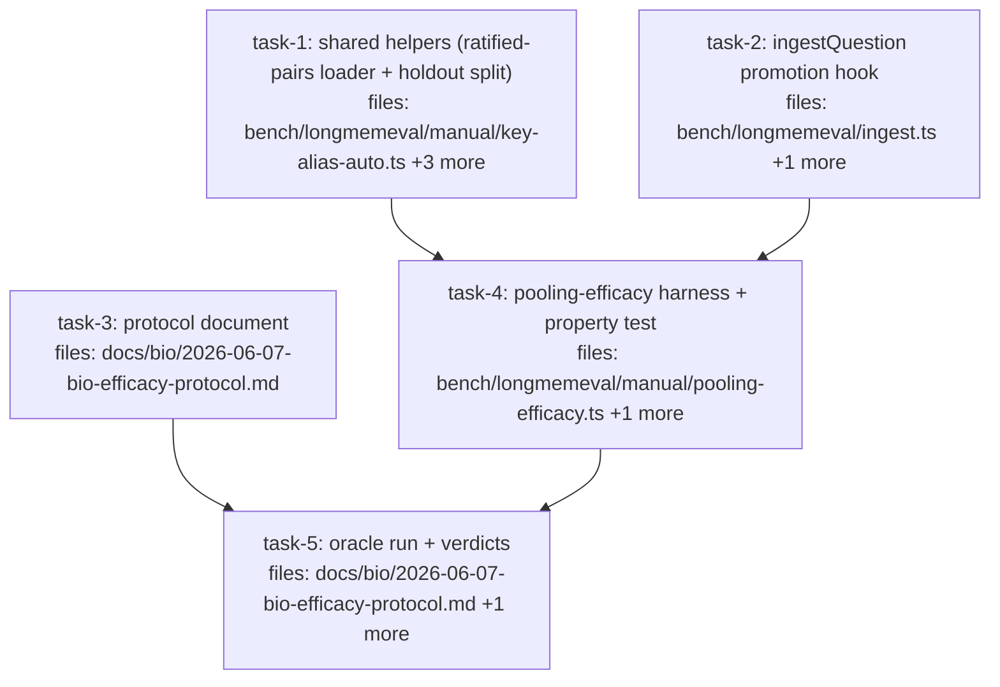

## Context

Executes `docs/superpowers/specs/2026-06-07-bio-efficacy-instrument-design.md`
(founder-approved, dual-audit-amended). Branch: `bench/bio-efficacy-instrument`
(carries C7). The spec is BINDING on measurement-path details — notably decision 4:
pooling is computed HARNESS-SIDE via `bindingFor("beta").combine(RULE.EVIDENCE_POOLED,…)`
because the read pipeline never surfaces pooled confidence and consensus groups never
cluster (`src/algebra/contradiction.ts:74`). The source-string constant is
`"imported"` and must be identical in three places (session/write source, override
key, `betaFromRaw` arg).

Constraints: zero substrate edits (the only shared-module change is task-2's optional
hook in bench ingest); no production dial changes; dogfood corpus untouched; protocol
gates/thresholds are FROZEN as written in the spec — implementers transcribe, never
reinterpret.

**Per-task verification is SCOPED** (parallel tasks share the tree): tasks 1/2/4 run
`npx vitest run bench/longmemeval`; task-3 is doc-only (no gate); task-5 runs the
harness itself. **Final gate (executor, after all tasks): `npm test` (≥1,672 + new)
and `npx tsc --noEmit` clean** (note: bench is outside tsconfig include — vitest
transpiles it; tsc guards `src/**` only).

**Working-tree hazard:** `bench/RESULTS.md` carries UNCOMMITTED foreign edits from a
concurrent session. Task-5 appends its section but must NOT stage/commit
`bench/RESULTS.md` — the controller resolves staging at PR assembly. No other task
may touch that file.

Cascade grep done: `ingestQuestion` callers are bench-internal (run.ts + manual
scripts + ingest.test.ts); the hook is optional with no-opts behavior identical, so
no caller changes. `key-alias-auto.ts` exports gain two names; no existing import
breaks.

## Tasks

## Task: shared manual-bench helpers

```yaml
id: task-1
depends_on: []
files:
  - bench/longmemeval/manual/key-alias-auto.ts
  - bench/longmemeval/manual/key-alias-auto.test.ts
  - bench/longmemeval/manual/holdout.ts
  - bench/longmemeval/manual/holdout.test.ts
status: pending
```

Hoist two judgment-bearing helpers the harness needs (principles-audit DRY findings
2 and 3). The ratified-pairs parser is at copy #5 across manual scripts; the
deterministic train/holdout split must be shared by construction so "the deep-dive's
exact methodology" is enforced by import, not transcription. Existing scripts keep
their inline copies (snapshot convention) — do NOT migrate call sites.

## Implementation

```typescript
// bench/longmemeval/manual/key-alias-auto.ts — ADD (alongside autoRatify):
export const pairKey = (a: string, b: string): string =>
  a < b ? `${a}\x1f${b}` : `${b}\x1f${a}`;

/** Parse a ratify-judge judgments JSONL into the set of APPROVED pair keys.
 *  Judgment lines are distinguished from header lines by `kind === undefined`
 *  and carry {a, b, same}; only same===true pairs are ratified.
 *  (Hoisted from the 4 inline copies — abstention-signals/calibrate/capstone/sweep;
 *  replicate their exact filter semantics.) */
export function loadRatifiedPairs(path: string): Set<string> {
  // read JSONL, filter judgment lines, return new Set(pairKey(a, b) for same===true)
}
```

```typescript
// bench/longmemeval/manual/holdout.ts — NEW:
import { createHash } from "node:crypto";

/** Deterministic 50/50 split by question id — byte-identical to the inline
 *  expression in abstention-signals.ts (the deep-dive split). The efficacy
 *  protocol cites THIS function as the split definition.
 *  The exact expression (audit-quoted from abstention-signals.ts:156):
 *  parseInt(createHash("sha256").update(questionId).digest("hex").slice(0, 8), 16) % 2 === 0 */
export function isTrain(questionId: string): boolean {
  // the expression above, verbatim
}

/** Cross-fit folds: every item is evaluated held-out exactly once. */
export function splitFolds<T>(items: T[], idOf: (t: T) => string): { A: T[]; B: T[] } {
  // A = isTrain true, B = isTrain false
}
```

```typescript
// bench/longmemeval/manual/holdout.test.ts — minimum-viable failing test
import { createHash } from "node:crypto";
import { isTrain, splitFolds } from "./holdout.js";

it("matches the deep-dive inline split expression exactly", () => {
  for (const qid of ["q-1", "q-2", "abc_abs", "5f3e", "x"]) {
    const inline = /* the exact sha256 expression copied from abstention-signals.ts */;
    expect(isTrain(qid)).toBe(inline);
  }
});
```

## Acceptance criteria

- `isTrain` reproduces abstention-signals.ts's inline split expression exactly —
  pinned by a test computing both for a fixed qid sample (read the inline
  expression from abstention-signals.ts and copy it into the test as the oracle).
- `splitFolds` partitions: every item in exactly one fold; A = isTrain.
- `loadRatifiedPairs` on the committed
  `bench/longmemeval/manual/data/key-ratify-judgments-min094.jsonl` returns a
  non-empty set; a synthetic JSONL fixture test pins the filter semantics (header
  lines skipped via `kind === undefined` logic; `same: false` excluded;
  pairKey order-insensitive: loadRatifiedPairs of {a:"x",b:"y"} contains
  pairKey("y","x")).
- `pairKey` exported and order-insensitive.
- Existing key-alias-auto tests stay green; NO existing call sites migrated.
- Scoped gate: `npx vitest run bench/longmemeval`.

Test file: `bench/longmemeval/manual/holdout.test.ts` (+ additions to
`key-alias-auto.test.ts`).

## Task: ingestQuestion promotion hook

```yaml
id: task-2
depends_on: []
files:
  - bench/longmemeval/ingest.ts
  - bench/longmemeval/ingest.test.ts
status: pending
```

Extend `ingestQuestion` with an optional hook so the harness can create corpora with
a `scalarPseudocount` override and promote each record's confidence to Beta at write
time — extension, not fork: the `AlreadyIngestedError`/`IngestConservationError`
guards stay load-bearing, and no-opts behavior is byte-identical (spec Deliverable 2,
fact-audit finding 2/12 reconciliation).

## Implementation

```typescript
// bench/longmemeval/ingest.ts — extend the signature:
export interface IngestHooks {
  /** Per-corpus schema override threaded into session.createCorpus. */
  scalarPseudocount?: Partial<Record<Source, number>>;
  /** Map the default WriteRecord before write — e.g. promote confidence to Beta.
   *  Receives the base record built by mapClaimRecord; returns the record to write. */
  mapRecord?: (rec: ClaimRecordT, base: WriteRecord) => WriteRecord;
}

// Source type: import from src/index.js (root barrel) or src/core/claim.js — NOT
// the surface barrel (it doesn't re-export Source). No new src exports needed.
export function ingestQuestion(
  session: Session,
  question: LmeQuestionT,
  claims: ClaimRecordT[],
  hooks?: IngestHooks
): ImportStats {  // actual existing return type — `IngestReport` does not exist
  // createCorpus({ id, contradictionPolicy, ...(hooks?.scalarPseudocount && { scalarPseudocount: hooks.scalarPseudocount }) })
  // PRESERVE the writeMany-based conservation path (plan-audit finding 5 — the real
  // ingest maps all records then calls session.writeMany once, and conservation
  // checks the returned ImportStats; per-record session.write would change duplicate
  // semantics and break the stats):
  //   const writeRecords = records.map((rec) => {
  //     const base = mapClaimRecord(rec);
  //     return hooks?.mapRecord ? hooks.mapRecord(rec, base) : base;
  //   });
  //   const stats = session.writeMany(corpusId, writeRecords);
  // conservation + AlreadyIngestedError guards UNCHANGED
}
```

```typescript
// bench/longmemeval/ingest.test.ts — minimum-viable failing test
it("mapRecord hook promotes confidence to Beta and scalarPseudocount reaches the schema", () => {
  // openSession over tmp db; ingestQuestion(..., { scalarPseudocount: { imported: 5 },
  //   mapRecord: (rec, base) => ({ ...base,
  //     confidence: betaFromRaw(1, "imported", { scalarPseudocount: { imported: 5 } } as unknown as ClaimSchema) }) });
  //   (no `schemaOf` helper exists; build the schema literal — the source-weight.test.ts cast precedent —
  //    or cast inspectCorpus's `unknown` return to CorpusDef and use .schema)
  // assert a written claim's confidence.distribution === "beta"
  // assert (session.inspectCorpus(corpusId) as CorpusDef).schema.scalarPseudocount.imported === 5
});
```

## Acceptance criteria

- `ingestQuestion(session, q, claims)` with NO hooks: behavior byte-identical
  (existing ingest tests green unmodified).
- `scalarPseudocount` hook reaches the created corpus schema (verify via
  `inspectCorpus`); merge semantics are the surface's (override merges over
  DEFAULT_SCALAR_PSEUDOCOUNT).
- `mapRecord` hook receives `(rec, base)` and its return is what gets written;
  a Beta `Confidence` object passes through to the stored claim
  (distribution === "beta").
- `AlreadyIngestedError` still thrown on duplicate corpus ingest WITH hooks.
- Conservation check unchanged and still enforced with hooks present.
- Scoped gate: `npx vitest run bench/longmemeval`.

Test file: `bench/longmemeval/ingest.test.ts`.

## Task: protocol document

```yaml
id: task-3
depends_on: []
files:
  - docs/bio/2026-06-07-bio-efficacy-protocol.md
status: pending
is_wiring_task: true
```

Author the pre-registered protocol per spec **Deliverable 1** — transcribe the
gates, thresholds, decision rule, ownership paragraph, and out-of-scope list
EXACTLY as the spec states them (the spec is the ratified registration; this task
formats it as the standalone protocol artifact, dogfood-protocol style). Verdict
slots are literal `PENDING — filled by the oracle run` placeholders. Evidence
sections contain anchor-link placeholders to bench/RESULTS.md (dated headings),
never copied tables. Arm-D inline pins are ONLY the four gate numbers
(0.556 / 0.931 / 0.979 / 0.528); the band-agreement table is anchor-referenced.

## Acceptance criteria

- Sections present: pre-registration header (status, date, derived-from spec link),
  Arm P (P0 exact parameters with the registered float64 footnote — rational
  targets 21/5, 9/5, 11/5, 19/5; "exact" = exact float64 determinism of the
  substrate's fold expressions, agreeing-case β lands 1 ulp below 1.8 — and
  bracketing invariant; P1 cross-fit gates in counts — ≥4 residual TP, precision ≥62.5%
  (FP ≤ ⌊0.6·TP⌋), ≤9/199 false abstentions, paired dominance primary,
  UNDERPOWERED floor; P2 exact 3-decimal equality via --expect convention;
  dial sweep {2,5,10} with the three-places-one-constant source note), Arm D
  (gate pins + anchor refs + reproduction gate + methodology note), Decision rule
  (all five branches verbatim from the spec), Ownership paragraph, Out-of-scope.
- The split definition cites `bench/longmemeval/manual/holdout.ts` `isTrain`.
- The attribution argument (single process, shared embedding cache → P1 deltas
  attributable to confidence alone) is stated.
- No measured-number tables copied from RESULTS.md anywhere in the doc.
- The string "PENDING" appears in every verdict slot (grep-checkable).

Test file: none (doc artifact; verified by the spec-reviewer against Deliverable 1).

## Task: pooling-efficacy harness

```yaml
id: task-4
depends_on: [task-1, task-2]
files:
  - bench/longmemeval/manual/pooling-efficacy.ts
  - bench/longmemeval/manual/pooling-efficacy.test.ts
status: pending
```

The arm-P instrument per spec **Deliverable 2**. Modeled on TWO templates:
`abstention-signals.ts` for P1 machinery (CLI shape, citable config, coverage
classification) and `key-matching-sweep.ts` for P2 scoring (`answerArmA` —
already accepts `evidencePoolingRule` — + `scoreQuestion`/`aggregate` +
`--expect-*` abort). Pooling computed HARNESS-SIDE (spec decision 4).

## Implementation

```typescript
// bench/longmemeval/manual/pooling-efficacy.ts — load-bearing shape:
const SOURCE = "imported" as const; // ONE constant, THREE uses: session source,
                                    // scalarPseudocount override key, betaFromRaw arg
const PSEUDOCOUNTS = [2, 5, 10];    // --pseudocounts override

// per sweep point: fresh tmp DB (mkdtempSync + finally rmSync) — AlreadyIngestedError contract
//   openSession({ dbPath, source: SOURCE })
//   ingestQuestion(session, q, claims, {
//     scalarPseudocount: { [SOURCE]: pc },
//     mapRecord: (rec, base) => ({ ...base, confidence: betaFromRaw(base.confidence ?? 1, SOURCE, schema) }),
//   })
// ONE EmbeddingCache + ONE warmEmbeddings pass shared across all sweep points (attribution)
// per question (citable config: loadRatifiedPairs(min094) -> autoRatify alias map; hybridMax):
//   POOLING-RULE BRANCH (plan-audit finding 2 — scalar binding THROWS on EVIDENCE_POOLED):
//     promoted Beta corpora -> evidencePoolingRule: RULE.EVIDENCE_POOLED (config fidelity; inert for serving)
//     unpromoted scalar BASELINE pass -> RULE.MAX_MEAN (the recorded config, key-matching-sweep precedent)
//   pooled top-1 signal: group survivors by (subject, canonicalKey(aliasMap), valueHash);
//     take top-ranked claim's group; fold via bindingFor("beta").combine(RULE.EVIDENCE_POOLED, ...)
//   baseline row: scalar path (no promotion) MAX_MEAN top-1 confidence
// cross-fit via splitFolds/isTrain (holdout.ts): threshold on A -> eval B; swap; pool held-out
//   (cross-fit LOOP lives here in the harness; only the split is hoisted — registered note)
// residual class: abstention-labeled && coverageOf does NOT flag
// P2 (plan-audit finding 3 — do NOT copy the template's gate placement, it guards the
//   no-alias jaccard baseline 0.403): run the CITABLE cell — ratified aliases + hybrid rank —
//   over the promoted pc=2 corpus via answerArmA(evidencePoolingRule branch as above) +
//   scoreQuestion + aggregate; THREE new flags --expect-update-correct/--expect-recall3/
//   --expect-recall10 wired to 0.556/0.931/0.979 at r3 precision, template abort convention.
// SMOKE is a CLI mode of THIS script (plan-audit finding 4): fixture paths + the synthetic
//   residual-class case, jaccard rank acceptable, exits nonzero — run via npx tsx during
//   verification. The .test.ts file stays substrate-only (never imports this script).
// output: markdown table per sweep point (P0 status; P1 counts TP/FP/precision/falseAbst for pooled + baseline; P2 row)
// exit nonzero on any integrity failure
```

```typescript
// bench/longmemeval/manual/pooling-efficacy.test.ts — P0 property (CI-safe):
// MUST NOT import embeddings-local.ts (statically or transitively); alias maps are literals.
import { bindingFor } from "../../../src/distribution/registry.js"; // (or the actual export site — resolve from src)
import { RULE } from "../../../src/distribution/rules.js";
import { betaFromRaw } from "../../../src/write/source-weight.js";

it("P0: agreeing 0.8 inputs pool to the exact float64 fold values", () => {
  const schema = { scalarPseudocount: { imported: 2 } } as unknown as ClaimSchema;
  const x = betaFromRaw(0.8, "imported", schema); // Beta(2.6, 1.4) — float-exact
  const pooled = bindingFor("beta").combine(RULE.EVIDENCE_POOLED, x.parameters, x.parameters);
  expect(pooled.alpha).toBe(4.2);          // rational 21/5, float-exact
  expect(pooled.beta).toBe(1.4 + 1.4 - 1); // rational 9/5; float64 = 1.7999999999999998 (1 ulp low)
  // "exact" = exact float64 determinism of the substrate's fold expressions (registered footnote)
});

it("P0 below-prior: raw 0.3 pools to exactly Beta(2.2, 3.8) and brackets", () => {
  // mean(pooled) strictly between 0.3 and mean(input); concentration strictly increases
});

it("P0 in-substrate: a contrived CONTESTED cluster's combinedConfidences matches the binding-level fold", () => {
  // three claims: two same-value (drifted keys, ratified alias literal), one different value
  // clustersOf(...) -> cluster exists; combinedConfidences for the majority valueHash === binding fold
});
```

## Acceptance criteria

- P0 tests: exact float64 parameters (α 4.2 exactly, β `1.4 + 1.4 - 1` =
  1.7999999999999998 for the agreeing case; 2.2/3.8 float-exact below-prior),
  bracketing invariant strict both ends, concentration increase both cases,
  contested-cluster `clustersOf` agreement — all green in CI with NO
  embeddings-local import (verify: grep the test file's import graph; the audit
  confirmed the chain registry/rules/source-weight/contradiction pulls no
  @huggingface/transformers).
- Harness implements: per-sweep-point tmp DB; single shared embedding cache/warm
  pass; SOURCE constant used in exactly the three specced places; pooled top-1
  computed harness-side per the spec's grouping; scalar/MAX_MEAN baseline row;
  cross-fit via holdout.ts (NOT a reimplemented split); residual-class
  classification via coverageOf; P1 counts output (TP/FP/precision/false-abst,
  pooled AND baseline, per sweep point); P2 via answerArmA/scoreQuestion/aggregate
  with --expect-* abort wired to 0.556/0.931/0.979; UNDERPOWERED detection (<4
  total flags) printed as a distinct outcome.
- Smoke path (network-free): a CLI mode of pooling-efficacy.ts itself (NOT the
  .test.ts file — the sweep-test precedent of importing the script would pull
  embeddings transitively), run via `npx tsx` during verification against the
  committed fixture PLUS a synthetic residual-class case (abstention-labeled
  question whose entity tokens appear in claims but whose attribute is missing —
  the committed fixture alone cannot exercise the residual class); jaccard rank
  acceptable for the smoke; exits nonzero on integrity failure.
- P2 gate wired to the CITABLE cell (ratified aliases + hybrid over promoted pc=2)
  — NOT the template's no-alias jaccard baseline placement (which would abort at
  0.403); three new --expect flags at r3 precision.
- No writes to bench/RESULTS.md from this task (that is task-5's run).
- Scoped gate: `npx vitest run bench/longmemeval`.

Test file: `bench/longmemeval/manual/pooling-efficacy.test.ts`.

## Task: oracle run with verdict recording

```yaml
id: task-5
depends_on: [task-3, task-4]
files:
  - docs/bio/2026-06-07-bio-efficacy-protocol.md
  - bench/RESULTS.md
status: pending
is_wiring_task: true
```

Execute the instrument once at oracle scale and record the pre-registered outcome.
Run `pooling-efficacy.ts` with the local oracle dataset
(`bench/datasets/longmemeval/longmemeval-oracle-claims.jsonl` + oracle target file —
local-data-dependent, NOT in git), default sweep {2,5,10}. Append the results
section to `bench/RESULTS.md` under a dated heading; replace every `PENDING` verdict
slot in the protocol with PASS / FAIL / UNDERPOWERED per the pre-registered decision
rule; evidence links point at the new RESULTS.md anchor.

**Staging restriction (controller-enforced):** commit ONLY the protocol doc.
`bench/RESULTS.md` carries uncommitted foreign edits from a concurrent session —
append your section at file end, leave the file UNSTAGED, and report its diff
summary; the controller resolves staging at PR assembly.

## Acceptance criteria

- Oracle run completes with integrity checks passing (nonzero exit otherwise);
  if the local oracle dataset is absent, STOP and report BLOCKED (do not
  synthesize data).
- `bench/RESULTS.md` gains one dated section: per-sweep-point P1 count table
  (pooled + baseline rows), P2 row, P0 status, UNDERPOWERED flags if any — and is
  left unstaged.
- Protocol doc: zero `PENDING` strings remain; every verdict cites the decision
  rule branch applied; no number tables copied (anchor links only).
- The verdicts follow the decision rule MECHANICALLY — no narrative softening of
  a FAIL/UNDERPOWERED outcome; exploratory observations (if any) are labeled
  exploratory.
- Commit contains ONLY docs/bio/2026-06-07-bio-efficacy-protocol.md.

Test file: none (run task; the harness's own integrity checks are the gate).
