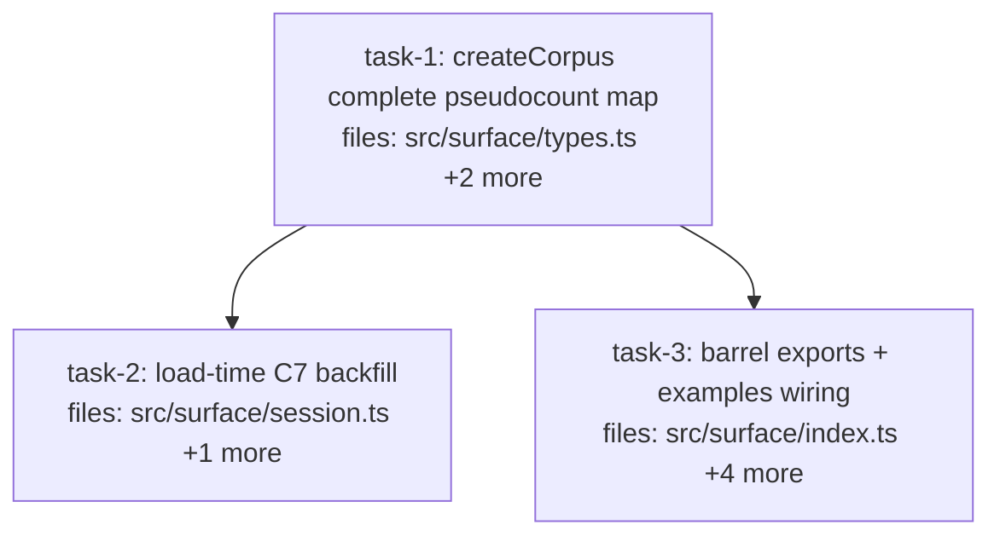

## Context

Executes `docs/superpowers/specs/2026-06-07-c7-scalar-pseudocount-surface-design.md`
(founder-approved, audit-amended). C7: `session.createCorpus` hardcodes
`scalarPseudocount: {}` while `pseudocountFor` (substrate, §3.2 MUST) throws on any
missing source — armed landmine for the bio promotion slice. Fix is surface-only:
declared A.1 default map + `CorpusSpec` override (undefined-stripped merge), loud
load-time backfill (absent-OR-empty predicate) with single repair persist.

Constraints carried from the spec:
- Substrate untouched: `pseudocountFor`/`betaFromRaw`/`ClaimSchema` must not change.
- Behavior-inert for the dogfood window: no read path consults the map today
  (verified: `betaFromRaw` has zero production callers).
- Bio's flat `evidence.scalarPseudocount: 2` stays — promotion slice territory.
- Baseline: 1,661 tests + tsc clean (audit-verified). Full suite + tsc must be green
  before PR.

Cascade grep done at planning time: no existing test asserts sidecar contents or
corpus schema shape (`inspectCorpus` test checks `.id` only; corpus-store tests never
call `openSession`; MCP tests have no scalarPseudocount/sidecar assertions). No
cleanup tasks expected.

**Per-task verification is SCOPED** (tasks 2 and 3 run in parallel in a shared tree —
repo-wide gates would see each other's in-flight edits): task-1/task-2 run
`npx vitest run src/surface src/mcp`; task-3 runs the two examples only. **Final gate
(executor, after all tasks done): `npm test` (≥1,661 passing + the new tests) and
`npx tsc --noEmit` clean — this is spec test 8.**

## Tasks

## Task: createCorpus complete pseudocount map

```yaml
id: task-1
depends_on: []
files:
  - src/surface/types.ts
  - src/surface/session.ts
  - src/surface/session.test.ts
status: pending
```

Declare `DEFAULT_SCALAR_PSEUDOCOUNT` (Appendix A.1 trust tiers) in
`src/surface/types.ts`, add the optional `CorpusSpec.scalarPseudocount` override, and
make `session.createCorpus` build schemas with the undefined-stripped merge — so every
surface-created corpus persists a complete six-source map (spec Changes 1–2 + the
complete-map invariant).

## Implementation

```typescript
// src/surface/types.ts — alongside SURFACE_DEFAULTS / defaultConfidence
/**
 * Per-source pseudocounts for scalar→Beta coercion, from canonical Appendix A.1
 * trust tiers. Spec-authored priors, UNCALIBRATED — the bio efficacy instrument
 * sweeps this dial (flat-2 vs tiered is one config via the CorpusSpec override).
 * An explicit surface declaration: §3.2's no-silent-default MUST stays intact at
 * the substrate (pseudocountFor still throws on missing sources).
 */
export const DEFAULT_SCALAR_PSEUDOCOUNT: Record<Source, number> = {
  manual: 10,
  verification: 10,
  workflow: 5,
  heuristic: 5,
  llm: 2,
  imported: 2,
};

// CorpusSpec gains (matches ClaimSchema.scalarPseudocount, catalog/schema.ts:14):
export interface CorpusSpec {
  // ...existing fields...
  /** Per-source scalar→Beta pseudocounts; merged over DEFAULT_SCALAR_PSEUDOCOUNT. */
  scalarPseudocount?: Partial<Record<Source, number>>;
}
```

```typescript
// src/surface/session.ts — createCorpus; replaces `scalarPseudocount: {}` (line 74)
// Strip explicit-undefined entries BEFORE spreading: a naive spread copies
// `{ llm: undefined }` over the default (re-arming pseudocountFor's throw) and
// JSON.stringify then drops the key — persisting a 5-key NON-EMPTY map the
// task-2 backfill predicate can never repair. (Spec audit finding 2.5.)
// Validate override VALUES before merging (principles-audit finding 13):
// NaN/Infinity survive the undefined-strip but JSON.stringify persists them as
// null — a non-empty map the backfill can't repair, slipping pseudocountFor's
// `=== undefined` check; negatives survive round-trip and produce negative α/β.
// 0 is legal (trust-the-prior-only, well-defined in scalarToBeta).
for (const [src, v] of Object.entries(spec.scalarPseudocount ?? {})) {
  if (v !== undefined && (!Number.isFinite(v) || v < 0)) {
    throw new Error(
      `invalid scalarPseudocount for source "${src}": ${v} (must be a finite number >= 0)`
    );
  }
}
const pcOverrides = Object.fromEntries(
  Object.entries(spec.scalarPseudocount ?? {}).filter(([, v]) => v !== undefined)
);
// in the schema literal:
scalarPseudocount: { ...DEFAULT_SCALAR_PSEUDOCOUNT, ...pcOverrides },
```

```typescript
// src/surface/session.test.ts — minimum-viable failing test (spec test 1)
import { betaFromRaw } from "../write/source-weight.js";
import type { ClaimSchema } from "../catalog/schema.js";

it("surface-created corpus supports scalar→Beta promotion for every source", () => {
  const db = join(mkdtempSync(join(tmpdir(), "mneme-")), "t.db");
  const s = openSession({ dbPath: db });
  s.createCorpus({ id: "pc", subjects: [] });
  const def = s.inspectCorpus("pc") as { schema: ClaimSchema };
  const sources = ["manual", "verification", "workflow", "heuristic", "llm", "imported"] as const;
  for (const src of sources) {
    expect(() => betaFromRaw(0.8, src, def.schema)).not.toThrow();
  }
});
```

## Acceptance criteria

- Spec test 1: `betaFromRaw(0.8, src, schema)` succeeds for all six `Source` values
  on a surface-created corpus (no override).
- Spec test 2: `createCorpus({ scalarPseudocount: { llm: 4 } })` → schema has llm 4
  and the other five at A.1 defaults (manual 10, verification 10, workflow 5,
  heuristic 5, imported 2).
- Spec test 3 (complete-map invariant): after `createCorpus`, the persisted sidecar
  (`${dbPath}.corpora.json`) entry for the corpus has a `scalarPseudocount` with
  exactly six keys, all finite numbers. Pins against partial-persist refactors.
- Spec test 3b (strip): `createCorpus({ scalarPseudocount: { llm: undefined } })` →
  schema llm is 2 (the default), and the persisted map has six numeric values.
- Spec test 3c (value validation): `createCorpus` throws for overrides
  `{ llm: NaN }`, `{ llm: Infinity }`, `{ llm: -1 }` (message names the source and
  value); `{ llm: 0 }` is accepted and persists as 0.
- A.1 values exactly as in the spec: `{ manual: 10, verification: 10, workflow: 5,
  heuristic: 5, llm: 2, imported: 2 }`; doc-comment notes "uncalibrated spec priors,
  efficacy instrument sweeps this dial".
- Cross-reference comment (principles-audit finding 1): the
  `DEFAULT_SCALAR_PSEUDOCOUNT` doc-comment points at `src/core/source-trust.ts`
  ("sibling A.1 tables — SOURCE_WEIGHT / HALF_LIFE_DAYS — independently
  calibrated; an A.1 retune touches both files"). The reverse pointer in
  `source-trust.ts` belongs to task-3 (H3: src/core/ is outside this task's
  subsystem).
- No change to `src/catalog/schema.ts`, `src/write/source-weight.ts`, or
  `src/mcp/tools.ts` (ensureCorpus inherits).
- Existing surface tests stay green (`npx vitest run src/surface src/mcp` — scoped;
  full suite is the executor's final gate).

Import housekeeping (audit finding 3): extend `session.test.ts` line-2 `node:fs`
import with `readFileSync, writeFileSync` (tests 3/3b read the sidecar); extend
`session.ts` line-6 `./types.js` import with `DEFAULT_SCALAR_PSEUDOCOUNT`.

Test file: `src/surface/session.test.ts`.

## Task: load-time C7 backfill

```yaml
id: task-2
depends_on: [task-1]
files:
  - src/surface/session.ts
  - src/surface/session.test.ts
status: pending
```

In `openSession`'s corpus re-registration loop, repair persisted defs carrying the C7
bug signature (absent-OR-empty `scalarPseudocount`) with the default map, emit one
stderr line per repaired corpus, and persist the upgraded defs once after the loop —
never on healthy loads (spec Change 3, amendments A1 + A2).

## Implementation

```typescript
// src/surface/session.ts — openSession; replaces ONLY lines 24-26 (the load +
// plain re-registration loop). Keep the versionOf map construction (line ~29)
// intact — it reads only schema.version, which the backfill never touches.
const defs: CorpusDef[] = loadCorpora(dbPath);
let repaired = false;
for (const d of defs) {
  const pc = d.schema.scalarPseudocount;
  if (pc == null || Object.keys(pc).length === 0) {
    // C7 bug signature: surface used to persist {} (and older sidecars may lack
    // the field). Post-task-1, createCorpus always persists a complete map, so
    // this predicate stays forever-unambiguous.
    d.schema.scalarPseudocount = { ...DEFAULT_SCALAR_PSEUDOCOUNT };
    console.error(
      `${dbPath}.corpora.json: backfilled scalarPseudocount for '${d.id}' (C7 repair, A.1 defaults)`
    );
    repaired = true;
  }
  mneme.createCorpus(d);
}
if (repaired) saveCorpora(dbPath, mneme.listCorpora());
```

```typescript
// src/surface/session.test.ts — minimum-viable failing test (spec test 4)
it("backfills an empty scalarPseudocount on load, persists, and announces", () => {
  const db = join(mkdtempSync(join(tmpdir(), "mneme-")), "t.db");
  const s1 = openSession({ dbPath: db });
  s1.createCorpus({ id: "legacy", subjects: [] });
  s1.close();
  // Simulate the pre-fix bug state in the sidecar.
  const sidecar = `${db}.corpora.json`;
  const defs = JSON.parse(readFileSync(sidecar, "utf8"));
  defs[0].schema.scalarPseudocount = {};
  writeFileSync(sidecar, JSON.stringify(defs), "utf8");

  const errSpy = vi.spyOn(console, "error").mockImplementation(() => {});
  openSession({ dbPath: db }).close();
  expect(errSpy).toHaveBeenCalledTimes(1);
  expect(errSpy.mock.calls[0][0]).toContain("C7 repair");
  const persisted = JSON.parse(readFileSync(sidecar, "utf8"));
  expect(Object.keys(persisted[0].schema.scalarPseudocount)).toHaveLength(6);
  errSpy.mockRestore();
});
```

## Acceptance criteria

- Spec test 4: sidecar with `scalarPseudocount: {}` → re-open → in-memory schema AND
  persisted sidecar carry the full six-source A.1 map. **Idempotency pin
  (principles-audit finding 9): a third open after the repair emits no stderr and
  leaves the sidecar bytes unchanged** — pins the predicate/repair pair against
  drift (a future repair writing a map the predicate still matches).
- Spec test 5 (A2): sidecar def with the field **deleted entirely** → same repair.
- Spec test 6: stderr fires exactly once per repaired corpus with the message shape
  `<sidecar-path>: backfilled scalarPseudocount for '<id>' (C7 repair, A.1 defaults)`;
  a healthy load (post-fix corpus) emits **no** stderr and does **not** rewrite the
  sidecar (assert content equality before/after re-open).
- Spec test 7: persisted non-empty map (e.g. `{ workflow: 4, manual: 8 }`) loads
  verbatim — no merge, no rewrite, no stderr.
- `saveCorpora` is called at most once per `openSession`, only when ≥1 def was
  repaired.
- Existing surface + MCP integration tests stay green (fresh corpora are created
  complete by task-1, so no backfill fires in them). Scoped gate:
  `npx vitest run src/surface src/mcp`; full suite is the executor's final gate.

Import housekeeping (audit finding 3): add `vi` to the `session.test.ts` vitest
import (the file uses explicit imports, not globals-style, despite globals being
enabled).

Test file: `src/surface/session.test.ts`.

## Task: barrel exports + examples wiring

```yaml
id: task-3
depends_on: [task-1]
files:
  - src/surface/index.ts
  - src/index.ts
  - src/core/source-trust.ts
  - examples/quickstart.ts
  - examples/bio-quickstart.ts
status: pending
is_wiring_task: true
```

Re-export `DEFAULT_SCALAR_PSEUDOCOUNT` through the surface barrel and the root barrel
(load-bearing: examples import exclusively from `../src/index.js`, modeling the
published package), then update both examples — which build raw `CorpusDef`s with
`scalarPseudocount: {}`, modeling the C7 bug — to spread the default. No behavior
change (examples never promote scalars).

```typescript
// src/index.ts (and src/surface/index.ts re-exports from ./types.js)
export { DEFAULT_SCALAR_PSEUDOCOUNT } from "./surface/types.js";

// examples/quickstart.ts:45 and examples/bio-quickstart.ts:36
scalarPseudocount: { ...DEFAULT_SCALAR_PSEUDOCOUNT },
```

## Acceptance criteria

- `import { DEFAULT_SCALAR_PSEUDOCOUNT } from "../src/index.js"` resolves (root
  barrel) and the same name is exported from `src/surface/index.ts`.
- `grep "scalarPseudocount: {}" examples/` returns zero matches.
- `npx tsx examples/quickstart.ts` and `npx tsx examples/bio-quickstart.ts` both run
  to completion with exit code 0 (examples are NOT tsc-included — `tsconfig.json`
  includes `src/**` only — so running them is the verification; both use
  `:memory:` adapters, no artifacts/network).
- `DEFAULT_SCALAR_PSEUDOCOUNT` is added to the examples' **value** import block
  (quickstart.ts:9-20, bio-quickstart.ts:13), NOT the `import type` block — tsx
  erases type imports, which would make the spread a runtime ReferenceError
  (audit finding 6).
- Reverse cross-reference comment added in `src/core/source-trust.ts` above
  SOURCE_WEIGHT/HALF_LIFE_DAYS: one line naming
  `DEFAULT_SCALAR_PSEUDOCOUNT` (src/surface/types.ts) as the sibling A.1 table,
  independently calibrated (comment-only; principles-audit finding 1).
- tsc is NOT this task's gate (parallel task-2 edits src/ concurrently); the
  executor's final gate covers `npx tsc --noEmit`.

Test file: none new — verification is the two example runs + tsc + existing suite
(the barrel re-export is type-checked by tsc; surface-barrel consumers unchanged).
