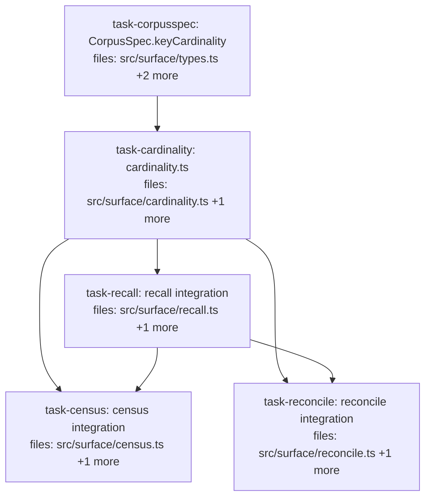

## Context

Drives the cardinality-declaration spec (`docs/superpowers/specs/2026-07-01-cardinality-declaration-design.md`,
Cluster C). Two parts: (A) expose `keyCardinality` on the ergonomic `CorpusSpec` → persist into
the existing `ClaimSchema.keyCardinality` slot; resolve it per-corpus, merged over the
deps/global map (declaration wins). (B) recall-time safety warning when a `single`-cardinality
`(subject,key)` holds ≥2 distinct values, reusing `clustersOf`. No algebra change; write path +
MCP declaration untouched (deferred). No new public barrel exports — the helpers are
surface-internal and `CorpusSpec` is already exported.

**Shared contract** (defined in `task-cardinality`, consumed by `task-recall`/`task-census`/`task-reconcile`):
`resolveKeyCardinality(session, corpus, depsCardinality?) → Record<...> | undefined` and
`cardinalitySafetyWarnings(corpus, effectiveCardinality, aliasMap) → string[]` in
`src/surface/cardinality.ts`.

**Serialization note:** `task-census`/`task-reconcile` depend on `task-recall` NOT for its code but
to avoid a shared-working-tree read-during-write hazard — both import the hoisted `loadAliasContext`
(stable) from `recall.ts`, which `task-recall` rewrites; ordering them after `task-recall` avoids a
concurrent typecheck observing a mid-edit `recall.ts`. `task-census` ∥ `task-reconcile` are
write-disjoint and run in parallel.

**Repo facts verified:** `ClaimSchema.keyCardinality` exists (`catalog/schema.ts:16`) and the
corpus-store round-trips the full schema (`corpus-store.ts` JSON.stringify). `clustersOf`
(`algebra/contradiction.ts:54`, exported) already excludes `"multi"` keys and returns ONLY
clusters with `valueGroups.size >= 2` (line 74), each carrying `triple.{subject,key(canonical),
scopeHash}` + `distinctValues`. `createCorpus` already has a fail-fast `scalarPseudocount`
validation loop to mirror. Test harness `src/surface/test-support.ts` (`freshSession`/`jaccardDeps`).

## Tasks

## Task: CorpusSpec.keyCardinality declaration

```yaml
id: task-corpusspec
depends_on: []
files:
  - src/surface/types.ts
  - src/surface/session.ts
  - src/surface/session.test.ts
status: pending
```

Expose `keyCardinality` on the ergonomic `CorpusSpec` and have `createCorpus` validate it
(fail-fast) and persist it into `schema.keyCardinality`. Spec §"Part A".

## Implementation

```typescript
// src/surface/types.ts — add to the CorpusSpec interface
  /** Per-key cardinality declaration. Undeclared keys default to "single" (⊥-eligible).
   *  Persisted into ClaimSchema.keyCardinality; honored per-corpus by the read path. */
  keyCardinality?: Record<string, "single" | "multi">;
```

```typescript
// src/surface/session.ts — in createCorpus, BEFORE building `def` (mirror the scalarPseudocount
// validation loop already present):
for (const [k, v] of Object.entries(spec.keyCardinality ?? {})) {
  if (v !== "single" && v !== "multi") {
    throw new Error(`invalid keyCardinality for key "${k}": ${v} (expected "single" | "multi")`);
  }
}
// ...and in the schema object literal, set the field only when provided (keep undeclared
// defs byte-identical):
//   scalarPseudocount: { ...DEFAULT_SCALAR_PSEUDOCOUNT, ...pcOverrides },
//   ...(spec.keyCardinality ? { keyCardinality: spec.keyCardinality } : {}),
```

```typescript
// src/surface/session.test.ts — failing tests (reuse the freshSession-style temp db already used here)
it("createCorpus persists keyCardinality and round-trips across reopen", () => {
  const s1 = openSession({ dbPath: db });
  s1.createCorpus({ id: "c", keyCardinality: { status: "single", tags: "multi" } });
  s1.close();
  const s2 = openSession({ dbPath: db });
  const def = s2.inspectCorpus("c") as { schema: { keyCardinality?: Record<string, string> } };
  expect(def.schema.keyCardinality).toEqual({ status: "single", tags: "multi" });
  s2.close();
});
it("createCorpus rejects an invalid cardinality value", () => {
  const s = openSession({ dbPath: db });
  expect(() => s.createCorpus({ id: "x", keyCardinality: { k: "many" as "single" } }))
    .toThrow(/invalid keyCardinality/);
  s.close();
});
```

## Acceptance criteria

- `CorpusSpec` has an optional `keyCardinality?: Record<string, "single" | "multi">`.
- `createCorpus` writes it to `schema.keyCardinality` when provided; the field is ABSENT from the
  persisted schema when the spec omits it (undeclared defs unchanged).
- It round-trips across a session reopen (via the corpus-store sidecar).
- An invalid value (not `"single"`/`"multi"`) throws at `createCorpus` (fail-fast).
- Full suite + `tsc --noEmit` green.

Test file: `src/surface/session.test.ts`.

## Task: cardinality resolution + safety detection

```yaml
id: task-cardinality
depends_on: [task-corpusspec]
files:
  - src/surface/cardinality.ts
  - src/surface/cardinality.test.ts
status: pending
```

The shared cardinality module (SRP): resolve effective per-corpus cardinality (declaration over
deps) and detect single-cardinality mass-deprecation via `clustersOf`. Spec §"Module structure".

## Implementation

```typescript
// src/surface/cardinality.ts
import type { Session, ReadDeps } from "./types.js";
import type { Corpus } from "../algebra/types.js";
import type { KeyAliasMap } from "../retrieval/key-alias.js";
import { clustersOf } from "../algebra/contradiction.js";

/** Effective per-key cardinality: the corpus's stored schema.keyCardinality merged OVER the
 *  deps/global map (per-key, corpus declaration wins). undefined when the merged map is empty. */
export function resolveKeyCardinality(
  session: Session, corpus: string, depsCardinality?: Record<string, "single" | "multi">,
): Record<string, "single" | "multi"> | undefined {
  const def = session.mneme.listCorpora((c) => c.id === corpus)[0] as
    | { schema?: { keyCardinality?: Record<string, "single" | "multi"> } } | undefined;
  const merged = { ...(depsCardinality ?? {}), ...(def?.schema?.keyCardinality ?? {}) };
  return Object.keys(merged).length > 0 ? merged : undefined;
}

/** Advisory warnings for single-cardinality (subject, canonical key) groups holding ≥2 distinct
 *  values. Reuses clustersOf (excludes multi keys; returns only >=2-distinct clusters) — the
 *  cluster former behind pairsOf. `corpus` MUST be the pre-⊥ corpus (τ_valid + ⊕_dedupe applied). */
export function cardinalitySafetyWarnings(
  corpus: Corpus, effectiveCardinality: Record<string, "single" | "multi"> | undefined,
  aliasMap: KeyAliasMap,
): string[] {
  const clusters = clustersOf(corpus, 0, { keyCardinality: effectiveCardinality, keyAliases: aliasMap });
  return clusters
    .filter((c) => c.distinctValues >= 2) // clustersOf already guarantees this; explicit + safe
    .map((c) =>
      `single-cardinality (subject:${c.triple.subject}, key:${c.triple.key}) holds ${c.distinctValues}` +
      ` distinct values — recall serves only the latest; declare keyCardinality:"multi" if they should coexist.`,
    );
}
```

```typescript
// src/surface/cardinality.test.ts — failing tests
import { freshSession, jaccardDeps } from "./test-support.js";
import { corpusOf } from "../algebra/types.js"; // or the repo's claim/corpus test helper
import { resolveKeyCardinality, cardinalitySafetyWarnings } from "./cardinality.js";

it("resolveKeyCardinality: corpus declaration wins over deps map", () => {
  const s = freshSession();
  s.createCorpus({ id: "c", keyCardinality: { status: "single", tags: "multi" } });
  // deps says tags:single, but the corpus declares tags:multi → declaration wins
  expect(resolveKeyCardinality(s, "c", { tags: "single", other: "multi" }))
    .toEqual({ tags: "multi", other: "multi", status: "single" });
  s.close();
});
it("resolveKeyCardinality: undeclared corpus returns the deps map; both empty → undefined", () => {
  const s = freshSession();
  s.createCorpus({ id: "c" });
  expect(resolveKeyCardinality(s, "c", { k: "multi" })).toEqual({ k: "multi" });
  expect(resolveKeyCardinality(s, "c", undefined)).toBeUndefined();
  s.close();
});
it("cardinalitySafetyWarnings: single key with 3 distinct values → one warning; multi → none", () => {
  // build a pre-⊥ Corpus with 3 distinct-value claims on (subject s, key status)
  const corpus = corpusOf([/* claim(s,status,"a"), claim(s,status,"b"), claim(s,status,"c") */]);
  expect(cardinalitySafetyWarnings(corpus, undefined, {})).toHaveLength(1);
  expect(cardinalitySafetyWarnings(corpus, { status: "multi" }, {})).toHaveLength(0);
});
```

## Acceptance criteria

- `resolveKeyCardinality` merges the corpus's `schema.keyCardinality` over `depsCardinality` with
  the corpus declaration winning per-key; returns the deps map when undeclared; `undefined` when
  the merged map is empty.
- `cardinalitySafetyWarnings` emits exactly one warning per single-cardinality cluster with ≥2
  distinct values, naming subject, canonical key, and count; zero when the key is `multi` or the
  group has <2 distinct values.
- No import of `entities.ts` (no cycle); imports only `types`, `algebra`, `retrieval/key-alias`.
- Full suite + `tsc --noEmit` green.

Test file: `src/surface/cardinality.test.ts`.

## Task: recall integration (effective cardinality + safety warning)

```yaml
id: task-recall
depends_on: [task-cardinality]
files:
  - src/surface/recall.ts
  - src/surface/recall.test.ts
status: pending
quality_reviewer_hint: opus
```

Make `recall` resolve effective cardinality per-corpus and surface the safety warning in its
existing `warnings[]`. Spec §"Part A step 4" + §"Part B → recall". recall is the hot path — keep
the change localized; the safety check is one extra lightweight query (no ranking/warm-up).

## Implementation

```typescript
// src/surface/recall.ts
// 1. import at top:
import { resolveKeyCardinality, cardinalitySafetyWarnings } from "./cardinality.js";
import { pipe, leaf } from "../mneme.js"; // (leaf/pipe already imported; ensure available)

// 2. replace `const keyCardinality = deps.keyCardinality;` (recall.ts:213) with the resolved map,
//    so both loadAliasContext and canonicalReadStages use the per-corpus effective cardinality:
const keyCardinality = resolveKeyCardinality(session, args.corpus, deps.keyCardinality);

// 3. capture the canonical stages so the prefix can be reused (like explainRecall does):
const canon = canonicalReadStages({
  evaluationInstant: now, keyCardinality, keyAliases: aliasMap,
  evidencePoolingRule: MCP_EVIDENCE_POOLING_RULE,
});
// ...use `...canon` where recall currently spreads canonicalReadStages(...) into the main query...

// 4. after building allWarnings (best-effort — never throw into recall):
try {
  const preContra = session.mneme.query<import("../algebra/types.js").Corpus>(
    args.corpus, pipe(leaf(args.corpus), ...sigmas, canon[0], canon[1]), { evaluationClock: now },
  );
  allWarnings.push(...cardinalitySafetyWarnings(preContra, keyCardinality, aliasMap));
} catch (e) {
  allWarnings.push(`cardinality-safety check failed: ${e instanceof Error ? e.message : String(e)}`);
}
```

```typescript
// src/surface/recall.test.ts — failing test (reuse test-support harness)
it("recall warns when a single-cardinality key holds >=2 distinct values, and multi suppresses it", async () => {
  const s = freshSession();
  s.createCorpus({ id: "c", keyCardinality: { plan: "single" } });
  s.write("c", { subject: "proj", key: "plan", value: "v1", valid: { from: 1, to: Infinity } });
  s.write("c", { subject: "proj", key: "plan", value: "v2", valid: { from: 2, to: Infinity } });
  const single = await recall(s, { about: "plan", corpus: "c" }, jaccardDeps);
  expect(single.warnings?.some((w) => /single-cardinality.*plan.*distinct values/.test(w))).toBe(true);

  const s2 = freshSession();
  s2.createCorpus({ id: "c", keyCardinality: { plan: "multi" } });
  s2.write("c", { subject: "proj", key: "plan", value: "v1", valid: { from: 1, to: Infinity } });
  s2.write("c", { subject: "proj", key: "plan", value: "v2", valid: { from: 2, to: Infinity } });
  const multi = await recall(s2, { about: "plan", corpus: "c" }, jaccardDeps);
  expect(multi.warnings?.some((w) => /single-cardinality/.test(w))).toBeFalsy();
  expect(multi.matches.length).toBe(2); // both coexist
});
```

## Acceptance criteria

- `recall` resolves effective cardinality via `resolveKeyCardinality` (declaration honored per-corpus),
  using it for both `loadAliasContext` and `canonicalReadStages`.
- A single-cardinality `(subject,key)` with ≥2 distinct values produces a safety warning in
  `recall(...).warnings`; declaring that key `multi` (on the corpus) suppresses the warning AND
  serves all distinct values.
- The safety check is best-effort (a failure appends a warning, never throws); `recall`'s served
  result (matches/content/scores) is otherwise unchanged for corpora with no single-cardinality
  contested groups.
- Full suite + `tsc --noEmit` green.

Test file: `src/surface/recall.test.ts`.

## Task: census integration (effective cardinality + keyCensus warning)

```yaml
id: task-census
depends_on: [task-cardinality, task-recall]
files:
  - src/surface/census.ts
  - src/surface/census.test.ts
status: pending
```

`censusCore` resolves effective cardinality (so all census axes honor per-corpus declarations),
and `keyCensus` surfaces the same safety warning over the full corpus. Spec §"Part A step 4" +
§"Part B → keyCensus". (`subjectCensus` is unchanged behaviorally beyond the resolved live-set.)

## Implementation

```typescript
// src/surface/census.ts
import { resolveKeyCardinality, cardinalitySafetyWarnings } from "./cardinality.js";
import { pipe, leaf } from "../mneme.js";
import { canonicalReadStages } from "../retrieval/read-pipeline.js";

// In censusCore: resolve once, use for loadAliasContext AND thread into distinctEntities via deps.
// Return the effective map so keyCensus can build its warning.
//   const effective = resolveKeyCardinality(session, corpus, deps.keyCardinality);
//   const aliasContext = loadAliasContext(session, corpus, now, effective);
//   const entities = distinctEntities(session, corpus, axis, { ...deps, keyCardinality: effective }, aliasContext.aliasMap, now);
//   return { ...prev, effective };  // add `effective` to the returned object

// In keyCensus: after censusCore, append the safety warning over the pre-⊥ full corpus.
//   const preContra = session.mneme.query<Corpus>(corpus,
//     pipe(leaf(corpus), ...canonicalReadStages({ evaluationInstant: now, keyCardinality: core.effective,
//       keyAliases: core.aliasContext.aliasMap, evidencePoolingRule: MCP_EVIDENCE_POOLING_RULE }).slice(0, 2)),
//     { evaluationClock: now });
//   warnings.push(...cardinalitySafetyWarnings(preContra, core.effective, core.aliasContext.aliasMap));
// (best-effort try/catch, mirroring recall)
```

```typescript
// src/surface/census.test.ts — failing test
import { freshSession, jaccardDeps } from "./test-support.js";
import { keyCensus } from "./census.js";
it("keyCensus warns on a single-cardinality key with >=2 distinct values", async () => {
  const s = freshSession();
  s.createCorpus({ id: "c", keyCardinality: { plan: "single" } });
  s.write("c", { subject: "proj", key: "plan", value: "v1", valid: { from: 1, to: Infinity } });
  s.write("c", { subject: "proj", key: "plan", value: "v2", valid: { from: 2, to: Infinity } });
  const r = await keyCensus(s, { corpus: "c" }, jaccardDeps);
  expect(r.warnings.some((w) => /single-cardinality.*plan/.test(w))).toBe(true);
  s.close();
});
```

## Acceptance criteria

- `censusCore` resolves effective cardinality via `resolveKeyCardinality` and threads it into
  `loadAliasContext` and `distinctEntities` (so `keyCensus`/`subjectCensus` live-sets honor the
  per-corpus declaration).
- `keyCensus` surfaces the single-cardinality mass-deprecation warning in its `warnings`
  (best-effort); `subjectCensus` behavior is otherwise unchanged.
- Existing `keyCensus` tests stay green (warning is additive; no shape change).
- Full suite + `tsc --noEmit` green.

Test file: `src/surface/census.test.ts`.

## Task: reconcile integration (effective cardinality)

```yaml
id: task-reconcile
depends_on: [task-cardinality, task-recall]
files:
  - src/surface/reconcile.ts
  - src/surface/reconcile.test.ts
status: pending
```

`reconcile` resolves effective cardinality so its live-entity enumeration honors per-corpus
declarations. No safety warning (reconcile scores external candidates; it is not a serving
surface for stored facts). Spec §"Module structure → reconcile.ts".

## Implementation

```typescript
// src/surface/reconcile.ts
import { resolveKeyCardinality } from "./cardinality.js";

// In reconcile: resolve once, use for loadAliasContext and thread into distinctEntities via deps.
//   const effective = resolveKeyCardinality(session, args.corpus, deps.keyCardinality);
//   const aliasMap = known ? loadAliasContext(session, args.corpus, now, effective).aliasMap : {};
//   ...distinctEntities(session, args.corpus, axis, { ...deps, keyCardinality: effective }, aliasMap, now)...
```

```typescript
// src/surface/reconcile.test.ts — failing test
import { freshSession, jaccardDeps } from "./test-support.js";
import { reconcile } from "./reconcile.js";
it("reconcile's live-entity set honors a multi-cardinality declaration", async () => {
  const s = freshSession();
  s.createCorpus({ id: "c", keyCardinality: { plan: "multi" } });
  // two distinct values coexist under (proj, plan) because plan is multi
  s.write("c", { subject: "proj", key: "plan", value: "alpha", valid: { from: 1, to: Infinity } });
  s.write("c", { subject: "proj", key: "plan", value: "beta", valid: { from: 2, to: Infinity } });
  // reconcile a candidate KEY against existing keys: "plan" exists → reuse
  const r = await reconcile(s, { corpus: "c", keys: ["plans"] }, jaccardDeps);
  // "plan" is present as an existing key (both plan-claims live under multi), so it's a suggestion
  expect(r.keys[0].suggestions.some((sg) => sg.existing === "plan")).toBe(true);
  s.close();
});
```

## Acceptance criteria

- `reconcile` resolves effective cardinality via `resolveKeyCardinality` and threads it into
  `loadAliasContext` + `distinctEntities` (live-entity enumeration honors the per-corpus declaration).
- `reconcile` emits NO cardinality safety warning (unchanged warnings behavior otherwise).
- Existing `reconcile` tests stay green.
- Full suite + `tsc --noEmit` green.

Test file: `src/surface/reconcile.test.ts`.
