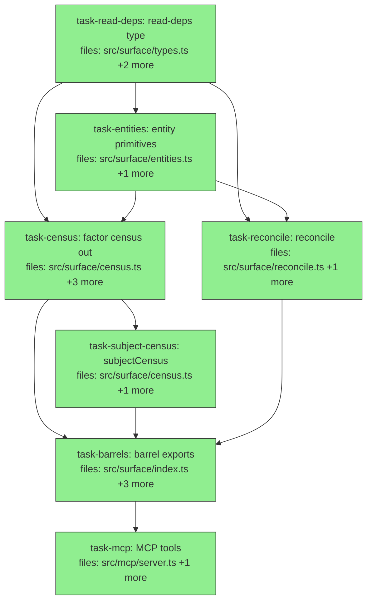

## Context

Drives the ingestion-canonicalization spec (`docs/superpowers/specs/2026-07-01-ingestion-canonicalization-design.md`,
Cluster B). Adds a recall-before-write primitive (`reconcile`) + a `subjectCensus`, both
pure surface ops, and factors census out of `recall.ts` into its own module (SRP/SoC). No
algebra change; `recall()` untouched. Public exports stay byte-identical (re-pointed barrels +
back-compat test) — the external `integrations/openclaw/memory-mneme` consumer and
`src/mcp/index.ts` import `keyCensus` via the surface barrel, which keeps exporting it.

**Shared contract** (defined in `task-read-deps` / `task-entities`, consumed downstream):
`ReadDeps { embeddings: EmbeddingState; keyCardinality? }` (neutral deps type in
`surface/types.ts`); `EntityAxis = "subject" | "key"`; `DistinctEntity { value; claims }`;
`distinctEntities(session, corpus, axis, deps, aliasMap)`; `entityScorer(strings, deps)`.

**Invariant:** every read-time transform is observable — reconcile suggestions carry scores;
nothing is silently merged. `reconcile` never mutates and never force-merges (over-anchoring
guard: weak matches return `new`/`uncertain`).

**Cycle notes (deliberate, safe):** (1) `types.ts` ↔ `recall.ts` is a *type-only* mutual
import (`ReadDeps` uses `EmbeddingState`; `RecallDeps = ReadDeps`) — erased, no runtime edge.
(2) During execution, `recall.ts` temporarily re-exports `keyCensus` from `census.ts` (shim)
while `census.ts` imports the hoisted `loadAliasContext` function from `recall.ts` — a value
cycle that is safe (function declaration, called only at runtime). `task-barrels` removes the
shim, leaving a clean one-directional `census.ts → recall.ts` edge.

## Tasks

## Task: Promote read-deps type to types.ts

```yaml
id: task-read-deps
depends_on: []
files:
  - src/surface/types.ts
  - src/surface/recall.ts
  - src/surface/types.test.ts
status: done
model_hint: cheap
```

Promote the shared read-op deps shape `{ embeddings; keyCardinality? }` from `recall.ts`
(where it is `RecallDeps`) to the neutral surface types home as `ReadDeps`, and make
`RecallDeps` a back-compat alias. Removes the SoC smell of census/reconcile depending on a
recall-named type. Spec §"Module structure".

## Implementation

```typescript
// src/surface/types.ts — add (EmbeddingState imported type-only: erased, no runtime cycle)
import type { EmbeddingState } from "./recall.js";

/** Shared read-op deps: embeddings state + optional per-key cardinality.
 *  Neutral home for the deps shape used by recall, census, and reconcile. */
export interface ReadDeps {
  embeddings: EmbeddingState;
  keyCardinality?: Record<string, "single" | "multi">;
}
```

```typescript
// src/surface/recall.ts — replace the `export interface RecallDeps {...}` block with:
import type { ReadDeps } from "./types.js";
/** @deprecated prefer ReadDeps; retained as a byte-compatible alias. */
export type RecallDeps = ReadDeps;
```

```typescript
// src/surface/types.test.ts — failing test (fails until the alias exists)
import { expectTypeOf, it } from "vitest";
import type { ReadDeps } from "./types.js";
import type { RecallDeps } from "./recall.js";

it("RecallDeps is a byte-compatible alias of ReadDeps", () => {
  expectTypeOf<RecallDeps>().toEqualTypeOf<ReadDeps>();
});
```

## Acceptance criteria

- `ReadDeps` is exported from `src/surface/types.ts` with fields `embeddings: EmbeddingState`
  and optional `keyCardinality?: Record<string, "single" | "multi">`.
- `RecallDeps` in `recall.ts` is `= ReadDeps` (alias); `expectTypeOf<RecallDeps>().toEqualTypeOf<ReadDeps>()` passes.
- `EmbeddingState` stays defined/exported from `recall.ts` (unchanged); the `types.ts` import of it is `import type` (no runtime cycle).
- Full suite + `tsc --noEmit` stay green (recall/explain unchanged behavior — `RecallDeps` consumers still compile).

Test file: `src/surface/types.test.ts`.

## Task: Shared entity primitives

```yaml
id: task-entities
depends_on: [task-read-deps]
files:
  - src/surface/entities.ts
  - src/surface/entities.test.ts
status: done
```

The shared read primitive consumed by both census and reconcile (DRY): enumerate the
corpus's **live** distinct subjects/keys over `canonicalReadStages`, and a warm-then-score
helper. This is the enumerate+score logic currently inlined in `keyCensus`, extracted.
Spec §"Module structure → entities.ts".

## Implementation

```typescript
// src/surface/entities.ts
import type { Session, ReadDeps } from "./types.js";
import type { Claim } from "../core/claim.js";
import type { Corpus } from "../algebra/types.js";
import type { EvalContext } from "../algebra/expression.js";
import type { KeyAliasMap } from "../retrieval/key-alias.js";
import { canonicalReadStages } from "../retrieval/read-pipeline.js";
import { similarityFn } from "../algebra/similarity.js";
import { warmValues } from "../algebra/embedding.js";
import { MCP_EVIDENCE_POOLING_RULE } from "./recall.js";

export type EntityAxis = "subject" | "key";
export interface DistinctEntity { value: string; claims: number }

/** Live distinct entities on `axis`, over canonicalReadStages (same live-set semantics as
 *  keyCensus). `aliasMap` AND `now` are passed in (not recomputed) so a single evaluation
 *  instant is shared with the caller's alias load — matching keyCensus's single-`now`
 *  behavior (recall.ts:397); recomputing `Date.now()` here would diverge on a tauValid
 *  boundary and break the byte-identical guarantee. */
export function distinctEntities(
  session: Session, corpus: string, axis: EntityAxis, deps: ReadDeps, aliasMap: KeyAliasMap, now: number,
): DistinctEntity[] {
  let live: Corpus = { claims: session.mneme.read(corpus, { corpusId: corpus }) as Claim[] };
  for (const stage of canonicalReadStages({
    evaluationInstant: now, keyCardinality: deps.keyCardinality,
    keyAliases: aliasMap, evidencePoolingRule: MCP_EVIDENCE_POOLING_RULE,
  })) live = stage(live, {} as EvalContext) as Corpus;

  const counts = new Map<string, number>();
  for (const c of live.claims) {
    const v = axis === "subject" ? c.subject : c.key;
    counts.set(v, (counts.get(v) ?? 0) + 1);
  }
  return [...counts.entries()]
    .map(([value, claims]) => ({ value, claims }))
    .sort((a, b) => b.claims - a.claims || a.value.localeCompare(b.value));
}

/** Warm the given strings (hybrid) then return a scorer; jaccard fallback on warm failure. */
export async function entityScorer(
  strings: string[], deps: ReadDeps,
): Promise<{ rankFn: string; warnings: string[]; scoreOne: (a: string, b: string) => number }> {
  const warnings: string[] = [];
  let rankFn = deps.embeddings.rankFn;
  let scorer = similarityFn(rankFn);
  if (rankFn !== "jaccard" && deps.embeddings.adapter && deps.embeddings.cache) {
    try {
      await warmValues(deps.embeddings.adapter, deps.embeddings.cache, strings as unknown[], []);
    } catch (e) {
      warnings.push(`entity warm-up failed — jaccard fallback: ${e instanceof Error ? e.message : String(e)}`);
      scorer = similarityFn("jaccard"); rankFn = "jaccard";
    }
  }
  return { rankFn, warnings, scoreOne: (a, b) => scorer.scoreOne(a, b) };
}
```

```typescript
// src/surface/entities.test.ts — failing test.
// Reuse the OWNED shared harness (src/surface/test-support.ts), as recall.test.ts does —
// do NOT hand-roll session/deps setup.
import { freshSession, jaccardDeps } from "./test-support.js";
import { distinctEntities } from "./entities.js";
it("distinctEntities returns live distinct subjects with per-subject counts", () => {
  // seed: 2 claims on subject "s1", 1 on "s2"; aliasMap {}; single now
  const got = distinctEntities(session, "c", "subject", jaccardDeps, {}, Date.now());
  expect(got.find((e) => e.value === "s1")?.claims).toBe(2);
  expect(got.find((e) => e.value === "s2")?.claims).toBe(1);
});
```

## Acceptance criteria

- `distinctEntities(…, "subject", …)` returns one entry per distinct **live** subject with a
  correct claim count; `axis: "key"` does the same on keys.
- Deprecated / dedupe-merged / alias-shaped claims are excluded (same live-set as `keyCensus`,
  because it runs `canonicalReadStages`).
- Results are deterministic: sorted by count desc, then value asc.
- `distinctEntities` uses the **caller-supplied `now`** for the pipeline instant (no internal
  `Date.now()`), so a caller can share one instant across alias load + enumeration.
- `entityScorer` returns `rankFn: "jaccard"` + a warning when warm-up throws; otherwise the
  registered rank fn with `scoreOne(a,b)` symmetric.
- Tests reuse `src/surface/test-support.ts` (`freshSession`/`jaccardDeps`), not hand-rolled setup.

Test file: `src/surface/entities.test.ts`.

## Task: Factor census into census.ts

```yaml
id: task-census
depends_on: [task-read-deps, task-entities]
files:
  - src/surface/census.ts
  - src/surface/census.test.ts
  - src/surface/recall.ts
  - src/surface/recall.test.ts
status: done
quality_reviewer_hint: opus
```

Create `census.ts` with `censusCore(axis)` (built on `distinctEntities` + `entityScorer`) and
move `keyCensus` + `CensusArgs`/`CensusResult` here verbatim, delegating enumerate+score to
`censusCore` and keeping the key-specific alias report. Leave a temporary re-export shim in
`recall.ts` so the barrels stay valid (removed by `task-barrels`). Extract the `keyCensus`
`describe` blocks from `recall.test.ts` into `census.test.ts` byte-identical. Spec §"Module
structure → census.ts". The `census.ts → recall.ts` import of the hoisted `loadAliasContext`
function is the permanent (safe) direction; the shim is transient.

## Implementation

```typescript
// src/surface/census.ts
import { distinctEntities, entityScorer, type EntityAxis } from "./entities.js";
import { loadAliasContext } from "./recall.js"; // hoisted fn; runtime-only call → cycle-safe
import type { Session, ReadDeps } from "./types.js";

export interface CensusArgs { corpus?: string; limit?: number }
export interface CensusResult {
  corpus: string; keys: { key: string; claims: number }[];
  candidates: { a: string; b: string; score: number }[];
  aliases: Record<string, string>; unratified: string[];
  warnings: string[]; rankFn: string; content: string;
}

/** Enumerate + score the axis; returns the shared census core + the single alias load. */
export async function censusCore(
  axis: EntityAxis, session: Session, corpus: string, deps: ReadDeps, limit: number,
) {
  const now = Date.now(); // ONE instant, shared by alias load + enumeration (matches keyCensus)
  const aliasContext = loadAliasContext(session, corpus, now, deps.keyCardinality);
  const entities = distinctEntities(session, corpus, axis, deps, aliasContext.aliasMap, now);
  const { rankFn, warnings, scoreOne } = await entityScorer(entities.map((e) => e.value), deps);
  const pairs: { a: string; b: string; score: number }[] = [];
  for (let i = 0; i < entities.length; i++)
    for (let j = i + 1; j < entities.length; j++)
      pairs.push({ a: entities[i].value, b: entities[j].value, score: scoreOne(entities[i].value, entities[j].value) });
  pairs.sort((x, y) => y.score - x.score || x.a.localeCompare(y.a) || x.b.localeCompare(y.b));
  return { entities, candidates: pairs.slice(0, limit), rankFn,
           warnings: [...aliasContext.warnings, ...warnings], aliasContext };
}

// keyCensus MOVED here from recall.ts: delegates to censusCore("key", …), then builds its
// alias report (aliases / unratified / ratification `content`) from `aliasContext`. Behavior
// and signature unchanged.
export async function keyCensus(
  session: Session, args: CensusArgs & { corpus: string }, deps: ReadDeps,
): Promise<CensusResult> { /* moved verbatim; enumerate+score via censusCore */ }
```

```typescript
// src/surface/recall.ts — remove keyCensus/CensusArgs/CensusResult; add transient shim:
export { keyCensus } from "./census.js";
export type { CensusArgs, CensusResult } from "./census.js";
```

```typescript
// src/surface/census.test.ts — the keyCensus describe blocks EXTRACTED from recall.test.ts,
// byte-identical, with imports repointed: keyCensus from ./census.js, harness still from
// ./test-support.js (freshSession/jaccardDeps/makeFakeHybridDeps — extraction preserves these).
// This proves the move is behavior-preserving.
import { freshSession, jaccardDeps } from "./test-support.js";
import { keyCensus } from "./census.js";
it("keyCensus reports distinct keys with counts (moved, unchanged)", async () => {
  const r = await keyCensus(session, { corpus: "c" }, jaccardDeps);
  expect(r.keys.find((k) => k.key === "status")?.claims).toBeGreaterThan(0);
});
```

## Acceptance criteria

- `census.ts` exports `censusCore`, `keyCensus`, `CensusArgs`, `CensusResult`; `keyCensus`
  behavior + signature are byte-identical to the pre-move version (same result shape: `keys`,
  `candidates`, `aliases`, `unratified`, `warnings`, `rankFn`, `content`).
- The `keyCensus` `describe` blocks are moved out of `recall.test.ts` into `census.test.ts`
  with assertions unchanged; `recall.test.ts` retains only recall tests.
- `recall.ts` no longer defines `keyCensus`/`CensusArgs`/`CensusResult` but re-exports them
  from `./census.js` (transient shim) so `surface/index.ts` and the root barrel still resolve.
- `censusCore` loads alias context exactly once and returns it; `keyCensus` builds its alias
  report from that single load (no second `loadAliasContext` call).
- Full suite + `tsc --noEmit` green.

Test file: `src/surface/census.test.ts`.

## Task: Add subjectCensus

```yaml
id: task-subject-census
depends_on: [task-census]
files:
  - src/surface/census.ts
  - src/surface/census.test.ts
status: done
```

Add `subjectCensus` on the subject axis via `censusCore("subject", …)` — symmetric to
`keyCensus` but with **advisory** content (no `alias-of` ratification shape, because there is
no subject-alias mechanism). Spec §"Component 2 — subjectCensus".

## Implementation

```typescript
// src/surface/census.ts — add
export interface SubjectCensusResult {
  corpus: string;
  subjects: { subject: string; claims: number }[];
  candidates: { a: string; b: string; score: number }[];
  rankFn: string; warnings: string[]; content: string;
}

export async function subjectCensus(
  session: Session, args: CensusArgs & { corpus: string }, deps: ReadDeps,
): Promise<SubjectCensusResult> {
  const limit = args.limit ?? 20;
  if (!session.listCorpora().some((c) => c.id === args.corpus))
    return { corpus: args.corpus, subjects: [], candidates: [], rankFn: deps.embeddings.rankFn, warnings: [], content: "" };
  const core = await censusCore("subject", session, args.corpus, deps, limit);
  const subjects = core.entities.map((e) => ({ subject: e.value, claims: e.claims }));
  // advisory content: name near-duplicate pairs, point at reconcile as the ingest-time fix.
  const content = /* markdown: "subjects that look like one entity — canonicalize at ingest via reconcile" */ "";
  return { corpus: args.corpus, subjects, candidates: core.candidates, rankFn: core.rankFn, warnings: core.warnings, content };
}
```

```typescript
// src/surface/census.test.ts — failing test (reuse the owned harness, not hand-rolled setup)
import { freshSession, jaccardDeps } from "./test-support.js";
import { subjectCensus } from "./census.js";
it("subjectCensus scores fragmented subjects and stays advisory", async () => {
  // seed near-dup subjects "project:crewtracks" and "project:crewTracks-liner-build"
  const r = await subjectCensus(session, { corpus: "c" }, jaccardDeps);
  expect(r.subjects.length).toBeGreaterThanOrEqual(2);
  expect(r.candidates[0].score).toBeGreaterThan(0);
  expect(r.content).not.toContain("alias-of"); // advisory, not a ratification shape
});
```

## Acceptance criteria

- `subjectCensus` returns distinct live subjects + counts (desc), near-duplicate subject
  pairs scored desc (≤ `limit`), `rankFn`, `warnings`.
- `content` is advisory (names the fragmented pair, points at `reconcile`); it contains no
  `alias-of` ratification shape.
- Unknown corpus → empty result, corpus NOT created.

Test file: `src/surface/census.test.ts`.

## Task: Add reconcile primitive

```yaml
id: task-reconcile
depends_on: [task-read-deps, task-entities]
files:
  - src/surface/reconcile.ts
  - src/surface/reconcile.test.ts
status: done
```

The recall-before-write primitive (the differentiated slice): score candidate subjects/keys
against the corpus's live distinct entities, assign `reuse | uncertain | new` via thresholds.
Never mutates, never force-merges. Spec §"Component 1 — reconcile".

## Implementation

```typescript
// src/surface/reconcile.ts
import { distinctEntities, entityScorer, type EntityAxis } from "./entities.js";
import { loadAliasContext } from "./recall.js";
import type { Session, ReadDeps } from "./types.js";

export interface ReconcileArgs {
  corpus: string; subjects?: string[]; keys?: string[];
  limit?: number; reuseThreshold?: number; newThreshold?: number;
}
export type ReconcileDisposition = "reuse" | "uncertain" | "new";
export interface EntitySuggestion { existing: string; score: number }
export interface ReconcileMatch { candidate: string; suggestions: EntitySuggestion[]; disposition: ReconcileDisposition }
export interface ReconcileResult {
  corpus: string; subjects: ReconcileMatch[]; keys: ReconcileMatch[];
  rankFn: string; warnings: string[]; content: string;
}

export async function reconcile(session: Session, args: ReconcileArgs, deps: ReadDeps): Promise<ReconcileResult> {
  const limit = args.limit ?? 5;
  const reuseAt = args.reuseThreshold ?? 0.9;   // provisional, not calibrated (spec)
  const newAt = args.newThreshold ?? 0.5;
  const known = session.listCorpora().some((c) => c.id === args.corpus);
  const warnings: string[] = [];
  const now = Date.now(); // ONE instant, shared by alias load + both axis enumerations
  const aliasMap = known ? loadAliasContext(session, args.corpus, now, deps.keyCardinality).aliasMap : {};

  const matchAxis = async (candidates: string[] | undefined, axis: EntityAxis): Promise<{ matches: ReconcileMatch[]; rankFn: string }> => {
    if (!candidates?.length) return { matches: [], rankFn: deps.embeddings.rankFn };
    const existing = known ? distinctEntities(session, args.corpus, axis, deps, aliasMap, now).map((e) => e.value) : [];
    const { rankFn, warnings: w, scoreOne } = await entityScorer([...candidates, ...existing], deps);
    warnings.push(...w);
    const matches = candidates.map((candidate) => {
      const suggestions = existing.map((existing) => ({ existing, score: scoreOne(candidate, existing) }))
        .sort((a, b) => b.score - a.score || a.existing.localeCompare(b.existing)).slice(0, limit);
      const top = suggestions[0]?.score ?? 0;
      const disposition: ReconcileDisposition = top >= reuseAt ? "reuse" : top <= newAt ? "new" : "uncertain";
      return { candidate, suggestions, disposition };
    });
    return { matches, rankFn };
  };

  const s = await matchAxis(args.subjects, "subject");
  const k = await matchAxis(args.keys, "key");
  if (!known) warnings.push(`corpus "${args.corpus}" does not exist — all candidates are new`);
  const content = /* markdown: per candidate, disposition + top suggestion */ "";
  return { corpus: args.corpus, subjects: s.matches, keys: k.matches, rankFn: s.rankFn, warnings, content };
}
```

```typescript
// src/surface/reconcile.test.ts — failing tests (reuse the owned harness, not hand-rolled setup)
import { freshSession, jaccardDeps } from "./test-support.js";
import { reconcile } from "./reconcile.js";
it("reuses a near-duplicate subject and mints a genuinely-new one", async () => {
  // existing subject "project:crewtracks" seeded in corpus "c"
  const r = await reconcile(session, {
    corpus: "c", subjects: ["project:crewTracks", "division:traffic-control"],
  }, jaccardDeps);
  expect(r.subjects[0].disposition).toBe("reuse");
  expect(r.subjects[0].suggestions[0].existing).toBe("project:crewtracks");
  expect(r.subjects[1].disposition).toBe("new"); // over-anchoring guard
});
```

## Acceptance criteria

- A candidate whose top score ≥ `reuseThreshold` → `disposition: "reuse"` with the matched
  existing entity named; ≤ `newThreshold` → `"new"`; strictly between → `"uncertain"`.
- Genuinely-new entity (low similarity to all existing) → `"new"`, never folded (over-anchoring guard).
- `subjects` and `keys` reconcile independently and symmetrically; each match carries scored
  `suggestions` (top-`limit`, desc) — nothing silent.
- Unknown/empty corpus → every candidate `"new"` with no suggestions + a warning; corpus NOT created.
- Never writes (read-only).

Test file: `src/surface/reconcile.test.ts`.

## Task: Export Cluster B ops from the public barrels

```yaml
id: task-barrels
depends_on: [task-census, task-subject-census, task-reconcile]
files:
  - src/surface/index.ts
  - src/index.ts
  - src/surface/recall.ts
  - src/surface/index.test.ts
status: done
model_hint: cheap
review_mode: merged
is_wiring_task: true
```

Finalize the public surface for Cluster B: re-point `keyCensus`/`CensusArgs`/`CensusResult`
to `./census.js` in both barrels, add `reconcile`/`subjectCensus`/`ReadDeps` (+ their types),
and remove the transient shim from `recall.ts` (leaving the clean one-directional
`census.ts → recall.ts` edge). Root barrel imports from `./surface/census.js`/`./surface/reconcile.js`
DIRECTLY (cycle-safe pattern, mirroring the existing `recall`/`keyCensus` root export).

## Acceptance criteria

- `mneme/surface` (`src/surface/index.ts`) and `mneme` (`src/index.ts`) export: `reconcile`
  (+ `ReconcileArgs`/`ReconcileResult`/`ReconcileMatch`/`EntitySuggestion`/`ReconcileDisposition`),
  `subjectCensus` (+ `SubjectCensusResult`), and `ReadDeps`.
- `keyCensus`/`CensusArgs`/`CensusResult` are still exported from both barrels (now re-pointed
  to `./census.js`); the transient shim in `recall.ts` is removed.
- Back-compat: an `index.test.ts` assertion confirms `keyCensus` is still importable from
  `mneme/surface` (protecting `src/mcp/index.ts` + the `integrations/openclaw/memory-mneme`
  consumer, which import it via the barrel).
- `src/surface/layering.test.ts` green (no `src/mcp` imports); full suite + `tsc --noEmit` green.

Test file: `src/surface/index.test.ts`.

## Task: Expose ingestion-canonicalization ops via MCP

```yaml
id: task-mcp
depends_on: [task-barrels]
files:
  - src/mcp/server.ts
  - src/mcp/server.integration.test.ts
status: done
is_wiring_task: true
```

Register two read-only MCP tools — `subject_census` and `reconcile` — mirroring the existing
`key_census` tool exactly (annotations `readOnlyHint/idempotentHint/openWorldHint`, deps
`{ embeddings: await initEmbeddings(), keyCardinality }`, non-fatal warnings to stderr as
`[mneme/<tool>]`, surface op stays pure). Imports `subjectCensus`/`reconcile` from
`../surface/index.js`. Spec §"Surfaces → MCP".

## Acceptance criteria

- `subject_census` tool: inputs `{ corpus?, limit? }`; returns `SubjectCensusResult` fields in
  `structuredContent`; `readOnlyHint: true`; warnings routed to stderr; no writes.
- `reconcile` tool: inputs `{ corpus?, subjects?: string[], keys?: string[], limit?,
  reuseThreshold?, newThreshold? }`; returns `ReconcileResult` fields; `readOnlyHint: true`;
  no writes.
- Both mirror the `key_census` registration shape (annotations + `initEmbeddings`/`keyCardinality`
  deps + stderr warning convention).
- `src/mcp/backcompat.test.ts` stays green (existing tools unchanged); integration test drives
  both new tools end-to-end and asserts read-only.

Test file: `src/mcp/server.integration.test.ts`.
