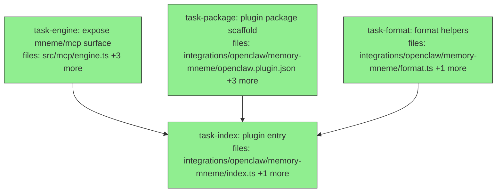

## Context

Driven by `docs/superpowers/specs/2026-07-01-openclaw-mneme-memory-plugin-design.md`
(brainstormed + audited). Goal: make mneme OpenClaw's **direct memory backend** — a native
memory-slot plugin (`plugins.slots.memory = "memory-mneme"`) that drives mneme's engine
**in-process** against its SQLite DB. Auto-recall injects resolved memory before each turn;
writes are **explicit typed claims only** (no free-text auto-capture).

Decomposition: three file-disjoint roots run in parallel — the one mneme-side change
(`task-engine`), the plugin's declarative package (`task-package`), and the pure formatting
helpers (`task-format`) — then `task-index` joins all three to build the plugin entry.

**R1 — RESOLVED (2026-07-01), no DAG task needed.** OpenClaw's plugin loader is
`createJiti(import.meta.url, { interopDefault: true, extensions: [".ts", ".tsx", ".mts",
".cts", …] })` (verified in `openclaw` v2026.2.25 `dist/reply-*.js`). jiti transpiles every
module it loads by extension — node_modules included — so `import … from "mneme/mcp"`
(resolving to `node_modules/mneme/src/mcp/index.ts` via mneme's `exports`) is transpiled
along with the whole TS tree. Confirmed empirically: a probe using that exact `createJiti`
config imported the real `mneme/mcp` + `mneme/surface`, loaded `better-sqlite3`, and
committed two `remember` writes to SQLite (`SPIKE_OK`). The `tsc`-build fallback is therefore
**not needed**; `task-engine` keeps mneme's TS-source `exports` as-is.

**R2 — native binding.** `better-sqlite3` must be built for the host Node ABI; documented
as a prerequisite in the plugin README (`task-package`).

**No contract cascade.** `keyCensus` is re-exported from the `mneme/mcp` barrel additively
(existing consumers import it from `./tools.js` directly — unaffected); `openMnemeEngine` is
net-new. `createMnemeMcpServer`'s public behavior is preserved and guarded by the existing
`server.test.ts` / `server.integration.test.ts` suites.

## Tasks

## Task: expose plugin-facing mneme/mcp surface

```yaml
id: task-engine
depends_on: []
files:
  - src/mcp/engine.ts
  - src/mcp/engine.test.ts
  - src/mcp/index.ts
  - src/mcp/server.ts
status: done
```

Extract the engine bootstrap the plugin (and the MCP server) both need into a single
reusable `openMnemeEngine`, and expose it plus `keyCensus` from the `mneme/mcp` barrel. Per
spec §"One mneme-side addition — a shared engine bootstrap": this is a genuine DRY extraction
of the `loadMnemeConfig` + `openSession` sequence currently inlined in
`createMnemeMcpServer`, which is refactored to consume it, preserving lazy embeddings.

## Implementation

```typescript
// src/mcp/engine.ts
import { basename } from "node:path";
import { openSession } from "../surface/index.js";
import type { Session } from "../surface/types.js";
import { loadMnemeConfig } from "./config.js";
import { initEmbeddings } from "./embeddings.js";

export interface OpenEngineOptions {
  dbPath?: string;
  corpus?: string;
  /** Provenance writer id for session writes. Defaults to "mcp". */
  writer?: string;
}

export interface MnemeEngine {
  session: Session;
  dbPath: string;
  defaultCorpus: string;
  keyCardinality: ReturnType<typeof loadMnemeConfig>["keyCardinality"];
  /** Memoized lazy embedding loader — NOT called here; first recall pays the cost. */
  initEmbeddings: typeof initEmbeddings;
}

export function openMnemeEngine(opts: OpenEngineOptions = {}): MnemeEngine {
  const dbPath = opts.dbPath ?? process.env.MNEME_DB ?? "./.mneme/store.db";
  const projectDir = process.env.CLAUDE_PROJECT_DIR || process.cwd();
  const defaultCorpus =
    opts.corpus ?? process.env.MNEME_CORPUS ?? (basename(projectDir) || "default");
  const config = loadMnemeConfig(dbPath); // throws on bad config — intentionally unwrapped
  const session = openSession({ dbPath, writer: opts.writer ?? "mcp" });
  return { session, dbPath, defaultCorpus, keyCardinality: config.keyCardinality, initEmbeddings };
}
```

```typescript
// src/mcp/engine.test.ts
import { mkdtempSync } from "node:fs";
import { tmpdir } from "node:os";
import { join } from "node:path";
import { openMnemeEngine } from "./engine.js";
import { remember, recall } from "./tools.js";

it("openMnemeEngine round-trips a claim (embeddings loaded lazily on recall)", async () => {
  const dbPath = join(mkdtempSync(join(tmpdir(), "mneme-engine-")), "store.db");
  const eng = openMnemeEngine({ dbPath, corpus: "test" });
  remember(eng.session, { subject: "project:mneme", key: "status", value: "green", corpus: "test" });
  const r = await recall(eng.session, { about: "mneme status", corpus: "test" },
    { embeddings: await eng.initEmbeddings(), keyCardinality: eng.keyCardinality });
  expect(r.content).toContain("green");
});
```

Also add to `src/mcp/index.ts` (additive re-exports):
`export { openMnemeEngine } from "./engine.js";`, `export type { MnemeEngine, OpenEngineOptions } from "./engine.js";`,
and add `keyCensus` to the existing `export { remember, recall, listCorpora, ensureCorpus } from "./tools.js";`
line. Refactor `createMnemeMcpServer` in `src/mcp/server.ts` to obtain
`{ session, dbPath, defaultCorpus, keyCardinality, initEmbeddings }` from `openMnemeEngine(opts)`
instead of the inline `loadMnemeConfig`/`openSession` calls; handlers use `keyCardinality`
and `await initEmbeddings()` exactly as before.

## Acceptance criteria

- `openMnemeEngine({ dbPath, corpus })` returns `{ session, dbPath, defaultCorpus, keyCardinality, initEmbeddings }`, and a `remember`→`recall` round-trip via `engine.session` returns the written value in `recall().content`.
- `import { openMnemeEngine, keyCensus } from "mneme/mcp"` resolves (both are on the `src/mcp/index.ts` barrel); `MnemeEngine` / `OpenEngineOptions` types are exported.
- `createMnemeMcpServer` contains no direct `openSession(` or `loadMnemeConfig(` call — it consumes `openMnemeEngine` (single bootstrap path).
- `openMnemeEngine` does not invoke `initEmbeddings` (embeddings stay lazy — the model loads on first recall, not at engine open).
- Existing `src/mcp/server.test.ts` and `src/mcp/server.integration.test.ts` pass unchanged.

Test file: `src/mcp/engine.test.ts`.

## Task: plugin package scaffold

```yaml
id: task-package
depends_on: []
files:
  - integrations/openclaw/memory-mneme/openclaw.plugin.json
  - integrations/openclaw/memory-mneme/package.json
  - integrations/openclaw/memory-mneme/README.md
  - integrations/openclaw/memory-mneme/manifest.test.ts
status: done
is_wiring_task: true
model_hint: cheap
review_mode: merged
```

Declare the OpenClaw plugin package: the memory-slot manifest, the npm package metadata
(entry + dependencies), and the install/config README. Load-bearing artifact is the
declarative package structure per spec §"Plugin architecture" and §"Config schema"; a small
shape test guards the manifest/package contract.

The manifest declares `id: "memory-mneme"`, `kind: "memory"`, the `configSchema` (`dbPath`,
`corpus`, `autoRecall`, `recallLimit`, `relevanceFloor`, `defaultScope`), and the four tools
(`memory_recall`, `memory_remember`, `memory_key_census`, `memory_corpora`). `package.json`
sets `"type": "module"`, `"openclaw": { "extensions": ["./index.ts"] }`, and dependencies
`{ "mneme": "file:../../..", "@sinclair/typebox": "^0.34.0" }`. The README documents slot
selection (`plugins.slots.memory = "memory-mneme"`), the config table, and the
`better-sqlite3` host-ABI prerequisite (R2).

```json
{
  "id": "memory-mneme",
  "name": "Mneme Memory",
  "kind": "memory",
  "configSchema": { "dbPath": { "type": "string" }, "corpus": { "type": "string", "default": "openclaw" } },
  "tools": [
    { "name": "memory_recall" }, { "name": "memory_remember" },
    { "name": "memory_key_census" }, { "name": "memory_corpora" }
  ]
}
```

## Acceptance criteria

- `openclaw.plugin.json` parses and has `kind === "memory"`, a `configSchema` object containing keys `dbPath`, `corpus`, `autoRecall`, `recallLimit`, `relevanceFloor`, `defaultScope`, and a `tools` array whose `name`s are exactly `memory_recall`, `memory_remember`, `memory_key_census`, `memory_corpora`.
- `package.json` parses with `type === "module"`, `openclaw.extensions` equal to `["./index.ts"]`, and dependencies including `mneme` (a `file:` spec) and `@sinclair/typebox`.
- `README.md` contains the string `plugins.slots.memory` and a `better-sqlite3` prerequisite note.
- `manifest.test.ts` asserts the two bullets above (manifest shape + package shape) and passes.

Test file: `integrations/openclaw/memory-mneme/manifest.test.ts`.

## Task: format helpers

```yaml
id: task-format
depends_on: []
files:
  - integrations/openclaw/memory-mneme/format.ts
  - integrations/openclaw/memory-mneme/format.test.ts
status: done
```

Two pure helpers the plugin entry consumes, kept separate so they are testable without a
live `api`. Per spec §"F1 (DRY)": `wrapMemories` wraps mneme's own `recall().content` in the
`<relevant-memories>` envelope (it does NOT re-render matches); `mergeScope` overlays a
per-write scope on the plugin's configured `defaultScope`.

## Implementation

```typescript
// integrations/openclaw/memory-mneme/format.ts
const OPEN = "<relevant-memories>";
const CLOSE = "</relevant-memories>";

/** Wrap mneme's ComposedContext for context injection. Blank content → "" (no envelope). */
export function wrapMemories(content: string): string {
  const trimmed = content.trim();
  if (!trimmed) return "";
  return `${OPEN}\nRelevant facts from long-term memory:\n${trimmed}\n${CLOSE}`;
}

/** Overlay a per-write scope on the configured default (write keys win). */
export function mergeScope(
  defaultScope: Record<string, string> | undefined,
  scope: Record<string, string> | undefined,
): Record<string, string> | undefined {
  if (!defaultScope && !scope) return undefined;
  return { ...(defaultScope ?? {}), ...(scope ?? {}) };
}
```

```typescript
// integrations/openclaw/memory-mneme/format.test.ts
import { wrapMemories, mergeScope } from "./format.js";

it("emits no envelope for blank content", () => {
  expect(wrapMemories("   ")).toBe("");
});
it("wraps non-empty content in exactly one tag pair", () => {
  const out = wrapMemories("project:mneme status = green");
  expect(out.startsWith("<relevant-memories>")).toBe(true);
  expect(out.trim().endsWith("</relevant-memories>")).toBe(true);
  expect(out).toContain("green");
});
```

## Acceptance criteria

- `wrapMemories("")` and whitespace-only input return `""` (no tags emitted).
- `wrapMemories("fact")` returns a string containing `"fact"` bounded by a single `<relevant-memories>` … `</relevant-memories>` pair.
- `mergeScope({ project: "x" }, { context: "y" })` → `{ project: "x", context: "y" }`; write key overrides default: `mergeScope({ a: "1" }, { a: "2" })` → `{ a: "2" }`; `mergeScope(undefined, undefined)` → `undefined`.

Test file: `integrations/openclaw/memory-mneme/format.test.ts`.

## Task: plugin entry — register, tools, hook

```yaml
id: task-index
depends_on: [task-engine, task-package, task-format]
files:
  - integrations/openclaw/memory-mneme/index.ts
  - integrations/openclaw/memory-mneme/index.test.ts
status: done
```

The plugin default export and its `register(api)` wiring: resolve config, open the mneme
engine once, register the four tools and the `before_agent_start` auto-recall hook. Explicit
typed-claim writes only — no `agent_end` hook (spec §"Non-goals" / §"Lifecycle hooks"). Keep
`index.ts` to wiring + logging (`[memory-mneme]` stderr prefix); pure logic lives in
`./format.js`.

## Implementation

```typescript
// integrations/openclaw/memory-mneme/index.ts
import { Type } from "@sinclair/typebox";
import { openMnemeEngine, remember, recall, listCorpora, keyCensus } from "mneme/mcp";
import { wrapMemories, mergeScope } from "./format.js";

interface MnemeMemoryConfig {
  dbPath: string; corpus: string; autoRecall: boolean;
  recallLimit: number; relevanceFloor: number;
  defaultScope?: Record<string, string>;
}

function resolveConfig(raw: any): MnemeMemoryConfig {
  const v = raw ?? {};
  return {
    dbPath: v.dbPath ?? process.env.MNEME_DB ?? "~/.mneme/knowledge.db",
    corpus: v.corpus ?? process.env.MNEME_CORPUS ?? "openclaw",
    autoRecall: v.autoRecall !== false,
    recallLimit: v.recallLimit ?? 5,
    relevanceFloor: v.relevanceFloor ?? 0,
    defaultScope: v.defaultScope,
  };
}

export default {
  id: "memory-mneme",
  name: "Mneme Memory",
  kind: "memory" as const,
  register(api: any) {
    const cfg = resolveConfig(api.pluginConfig);
    const engine = openMnemeEngine({ dbPath: cfg.dbPath, corpus: cfg.corpus, writer: "openclaw" });
    const deps = async () => ({ embeddings: await engine.initEmbeddings(), keyCardinality: engine.keyCardinality });

    api.registerTool({
      name: "memory_recall",
      parameters: Type.Object({ about: Type.String(), limit: Type.Optional(Type.Number()), relevanceFloor: Type.Optional(Type.Number()) }),
      async execute(_id: string, p: any) {
        const r = await recall(engine.session,
          { about: p.about, corpus: cfg.corpus, limit: p.limit ?? cfg.recallLimit, relevanceFloor: p.relevanceFloor ?? cfg.relevanceFloor },
          await deps());
        return { content: [{ type: "text" as const, text: r.content || `No relevant memories for "${p.about}"` }] };
      },
    }, { name: "memory_recall" });

    api.registerTool({
      name: "memory_remember",
      parameters: Type.Object({ subject: Type.String(), key: Type.String(), value: Type.String(), confidence: Type.Optional(Type.Number()), tags: Type.Optional(Type.Array(Type.String())), scope: Type.Optional(Type.Record(Type.String(), Type.String())) }),
      async execute(_id: string, p: any) {
        const r = remember(engine.session, { subject: p.subject, key: p.key, value: p.value, corpus: cfg.corpus, confidence: p.confidence, tags: p.tags, scope: mergeScope(cfg.defaultScope, p.scope) });
        return { content: [{ type: "text" as const, text: `${r.status} ${r.id}` }] };
      },
    }, { name: "memory_remember" });

    // memory_key_census → keyCensus(engine.session, {corpus}, await deps());
    // memory_corpora    → listCorpora(engine.session);

    if (cfg.autoRecall) {
      api.on("before_agent_start", async (event: any) => {
        const prompt = event.prompt ?? "";
        if (!prompt.trim()) return;
        const r = await recall(engine.session, { about: prompt, corpus: cfg.corpus, limit: cfg.recallLimit, relevanceFloor: cfg.relevanceFloor }, await deps());
        const block = wrapMemories(r.content);
        if (!block) return;
        return { prependContext: block };
      });
    }
    console.error(`[memory-mneme] registered (autoRecall=${cfg.autoRecall}, corpus=${cfg.corpus})`);
  },
};
```

```typescript
// integrations/openclaw/memory-mneme/index.test.ts
import { mkdtempSync } from "node:fs";
import { tmpdir } from "node:os";
import { join } from "node:path";
import plugin from "./index.js";

it("remember then recall round-trips through the mneme engine", async () => {
  const dbPath = join(mkdtempSync(join(tmpdir(), "memory-mneme-")), "store.db");
  const tools: Record<string, any> = {};
  const api = { pluginConfig: { dbPath, corpus: "test" }, registerTool: (d: any) => { tools[d.name] = d; }, registerCli() {}, on() {} };
  plugin.register(api);
  await tools["memory_remember"].execute("1", { subject: "project:mneme", key: "status", value: "green", confidence: 0.8 });
  const out = await tools["memory_recall"].execute("2", { about: "mneme status" });
  expect(out.content[0].text).toContain("green");
});
```

## Acceptance criteria

- `plugin.register(stubApi)` registers tools named `memory_recall`, `memory_remember`, `memory_key_census`, `memory_corpora`, and — when `autoRecall` is not `false` — one `before_agent_start` handler; no `agent_end` handler is ever registered.
- A `memory_remember` → `memory_recall` round-trip against a temp SQLite corpus returns the written value in the recall tool's text output.
- The `before_agent_start` handler returns `undefined` when `recall().content` is blank, and `{ prependContext }` wrapping `recall().content` (via `wrapMemories`) when non-empty; it never re-renders matches itself.
- `memory_remember` passes `mergeScope(cfg.defaultScope, params.scope)` as the claim scope (configured `defaultScope` applied, per-call `scope` keys override).

Test file: `integrations/openclaw/memory-mneme/index.test.ts`.
