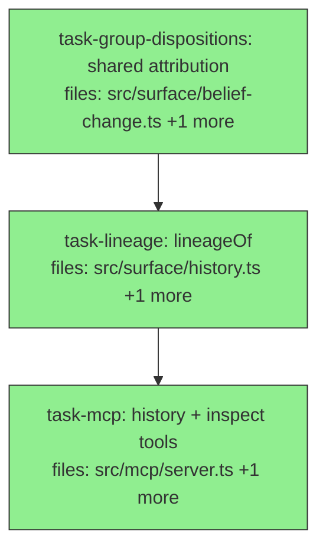

## Context

Child **belief-change-history** (#1) of the belief-change-visibility charter
(`docs/superpowers/specs/2026-07-02-belief-change-visibility-charter.md`; spec
`docs/superpowers/specs/2026-07-02-belief-change-history-design.md`). Surfaces the
non-destructive ledger at MCP: `history` (full lineage of a (subject,key) incl. deprecated/merged
versions + why) + `inspect` (raw claim by id). Store is append-only (deprecation is read-time), so
history = all committed claims attributed via a shared `groupDispositions`. No algebra change; reuses
the child-#1 `DispositionReason` vocabulary + `dedupeGroups`/`pairsOf` (charter I4), embeddings-free.
Defers replay/derive.

**Charter invariants (inlined):** I1 non-destructive — `history` REVEALS deprecated versions still
in the ledger, and `history`/`inspect` never write. I4 one vocabulary — entries use `DispositionReason`.

## Tasks

## Task: shared groupDispositions attribution

```yaml
id: task-group-dispositions
depends_on: []
files:
  - src/surface/belief-change.ts
  - src/surface/belief-change.test.ts
status: done
quality_reviewer_hint: opus
```

Extract the per-claim attribution (τ_valid → ⊕_dedupe → ⊥) into `groupDispositions`, returning
EVERY claim's disposition, and rewire `supersessionOutcome` to use it (behavior-preserving; DRY —
one attribution implementation for both supersession and lineage). Spec §"Module structure".

## Implementation

```typescript
// src/surface/belief-change.ts — add
export type GroupDisposition = "served" | "deprecated" | "merged" | "tau-invalid";

/** Disposition of EVERY claim in a (subject,key) group at `now`, via the read pipeline's
 *  precedence τ_valid → ⊕_dedupe → ⊥. `claims` are RAW group claims (pre-τ). */
export function groupDispositions(
  claims: Claim[], keyCardinality: Record<string, "single" | "multi"> | undefined,
  aliasMap: KeyAliasMap, now: number,
): Map<string, { disposition: GroupDisposition; reason: DispositionReason }> {
  const out = new Map<string, { disposition: GroupDisposition; reason: DispositionReason }>();
  const tau = tauValid(now)(corpusOf(claims));
  const tauIds = new Set(tau.claims.map((c) => c.id));
  for (const c of claims) if (!tauIds.has(c.id)) out.set(c.id, { disposition: "tau-invalid", reason: { kind: "tau-invalid" } });
  const { survivors, mergedInto } = dedupeGroups(DEDUPE_DEFAULTS.rule, undefined,
    { similarity: { fn: DEDUPE_DEFAULTS.fn, cutoff: DEDUPE_DEFAULTS.cutoff } })(tau);
  for (const [lost, target] of mergedInto) out.set(lost, { disposition: "merged", reason: { kind: "merged-into", targetId: target } });
  const pairs = pairsOf(survivors, 0, { keyCardinality, keyAliases: aliasMap, evidencePoolingRule: MCP_EVIDENCE_POOLING_RULE });
  const deprecatedBy = new Map<string, string>();
  for (const p of pairs) {
    if (p.left.valid.from === p.right.valid.from) continue;
    const [older, newer] = p.left.valid.from < p.right.valid.from ? [p.left, p.right] : [p.right, p.left];
    if (!deprecatedBy.has(older.id)) deprecatedBy.set(older.id, newer.id);
  }
  for (const [id, byId] of deprecatedBy) out.set(id, { disposition: "deprecated", reason: { kind: "deprecated-by", byId, via: "single-cardinality" } });
  for (const c of survivors.claims) if (!out.has(c.id)) out.set(c.id, { disposition: "served", reason: { kind: "served" } });
  return out;
}
```

Then rewire `supersessionOutcome` to derive its `action` from `groupDispositions`: look up the
written claim's disposition — `merged` → `merged`/`duplicate` (via valueHash vs the survivor);
otherwise collect `deprecatedIds` = claims whose disposition is `deprecated` with `reason.byId ===
claimId` → `superseded`; else `committed`. (Keeps supersessionOutcome's observable behavior +
existing tests green.)

```typescript
// src/surface/belief-change.test.ts — add
it("groupDispositions attributes every claim in a group", () => {
  const s = freshSession();
  s.createCorpus({ id: "c", keyCardinality: { plan: "single" } });
  const a = s.write("c", { subject: "p", key: "plan", value: "alpha", valid: { from: 1, to: Infinity } });
  const b = s.write("c", { subject: "p", key: "plan", value: "bravo", valid: { from: 2, to: Infinity } });
  const claims = s.mneme.read("c", { corpusId: "c", subject: "p", key: "plan" });
  const disp = groupDispositions(claims, { plan: "single" }, {}, Date.now());
  expect(disp.get(b.id)!.disposition).toBe("served");
  expect(disp.get(a.id)!.disposition).toBe("deprecated");
  s.close();
});
```

## Acceptance criteria

- `groupDispositions(claims, keyCardinality, aliasMap, now)` returns a disposition for EVERY input
  claim: `tau-invalid` (invalid at now), `merged` (`merged-into`), `deprecated` (`deprecated-by`),
  or `served`, matching the read pipeline's τ→dedupe→⊥ precedence. `GroupDisposition` exported.
- `supersessionOutcome` rewired to use it; its existing tests stay green (behavior-preserving) —
  superseded/merged/duplicate/committed all unchanged.
- Full suite + `tsc --noEmit` green.

Test file: `src/surface/belief-change.test.ts`.

## Task: lineageOf (surface)

```yaml
id: task-lineage
depends_on: [task-group-dispositions]
files:
  - src/surface/history.ts
  - src/surface/history.test.ts
status: done
```

`lineageOf` — the full non-destructive lineage of one (subject,key), every version + its
disposition at `asOf`, ordered by time. Spec §"Component 1".

## Implementation

```typescript
// src/surface/history.ts
import type { Session } from "./types.js";
import type { Claim } from "../core/claim.js";
import { pointEstimate } from "../core/confidence.js";
import { groupDispositions, type DispositionReason, type GroupDisposition } from "./belief-change.js";
import { resolveKeyCardinality } from "./cardinality.js";
import { loadAliasContext, parseAsOf } from "./recall.js";
import { keyFamilyOf } from "../retrieval/key-alias.js";

export interface LineageEntry {
  id: string; value: unknown; confidence: number; valid: { from: number; to: number };
  recordedSeq: number; tags: string[]; disposition: GroupDisposition; reason: DispositionReason;
}
export interface LineageResult {
  corpus: string; subject: string; key: string; asOf: number; entries: LineageEntry[]; content: string;
}

export function lineageOf(session: Session, args: { corpus: string; subject: string; key: string; asOf?: string | number }): LineageResult {
  const empty: LineageResult = { corpus: args.corpus, subject: args.subject, key: args.key, asOf: 0, entries: [], content: "" };
  if (!session.listCorpora().some((c) => c.id === args.corpus)) return empty;
  const now = parseAsOf(args.asOf) ?? Date.now();
  const keyCardinality = resolveKeyCardinality(session, args.corpus, undefined);
  const { aliasMap } = loadAliasContext(session, args.corpus, now, keyCardinality);
  const family = keyFamilyOf(args.key, aliasMap);
  const seen = new Set<string>();
  const claims: Claim[] = [];
  for (const k of family)
    for (const c of session.mneme.read(args.corpus, { corpusId: args.corpus, subject: args.subject, key: k }) as Claim[])
      if (!seen.has(c.id)) { seen.add(c.id); claims.push(c); }
  const disp = groupDispositions(claims, keyCardinality, aliasMap, now);
  const entries: LineageEntry[] = claims.map((c) => {
    const d = disp.get(c.id) ?? { disposition: "served" as GroupDisposition, reason: { kind: "served" as const } };
    return { id: c.id, value: c.value, confidence: pointEstimate(c.confidence), valid: { from: c.valid.from, to: c.valid.to },
             recordedSeq: c.recordedSeq, tags: [...c.tags], disposition: d.disposition, reason: d.reason };
  }).sort((a, b) => a.valid.from - b.valid.from || a.recordedSeq - b.recordedSeq);
  const content = /* markdown timeline: one line per entry with valid.from, value, disposition */ "";
  return { corpus: args.corpus, subject: args.subject, key: args.key, asOf: now, entries, content };
}
```

```typescript
// src/surface/history.test.ts — failing tests (reuse test-support)
import { freshSession } from "./test-support.js";
import { lineageOf } from "./history.js";
it("lineageOf returns the full non-destructive lineage: deprecated versions retained + attributed", () => {
  const s = freshSession();
  s.createCorpus({ id: "c", keyCardinality: { plan: "single" } });
  s.write("c", { subject: "p", key: "plan", value: "alpha", valid: { from: 1, to: Infinity } });
  s.write("c", { subject: "p", key: "plan", value: "bravo", valid: { from: 2, to: Infinity } });
  s.write("c", { subject: "p", key: "plan", value: "gamma", valid: { from: 3, to: Infinity } });
  const r = lineageOf(s, { corpus: "c", subject: "p", key: "plan" });
  expect(r.entries).toHaveLength(3);                                  // ledger retained ALL
  expect(r.entries.at(-1)!.disposition).toBe("served");              // latest served
  expect(r.entries.filter((e) => e.disposition === "deprecated")).toHaveLength(2);
  expect(r.entries[0].valid.from).toBeLessThan(r.entries[1].valid.from); // ordered
  s.close();
});
```

## Acceptance criteria

- `lineageOf` returns ALL committed claims for the (subject,key family), ordered by `valid.from`
  then `recordedSeq`, each with `disposition` + `reason` (from `groupDispositions`) at `asOf`
  (default now) — **including deprecated/merged/tau-invalid** (the non-destructive ledger, I1).
- Honors per-corpus cardinality + key aliases; embeddings-free; read-only (no writes; unknown
  corpus → empty, not created).
- Tested: 3-value single-cardinality chain → 3 entries (latest served, 2 deprecated); token-similar
  restatement → merged; future-dated → tau-invalid; multi key → all served.
- Full suite + `tsc --noEmit` green; `layering.test.ts` green.

Test file: `src/surface/history.test.ts`.

## Task: history + inspect MCP tools

```yaml
id: task-mcp
depends_on: [task-lineage]
files:
  - src/mcp/server.ts
  - src/mcp/server.integration.test.ts
status: done
is_wiring_task: true
```

Register read-only `history` (lineage) and `inspect` (raw claim) MCP tools. Spec §"Component 1/2".

## Acceptance criteria

- `history` tool: input `{ corpus?, subject, key, asOf? }`; `readOnlyHint:true, idempotentHint:true`;
  returns `LineageResult` fields (`corpus, subject, key, asOf, entries, content`); imports `lineageOf`
  from `../surface/history.js`. End-to-end: a superseded (subject,key) returns all versions with the
  latest `served` and older `deprecated` (the deprecated ones PRESENT — I1).
- `inspect` tool: input `{ corpus?, claimId }`; `readOnlyHint:true, idempotentHint:true`; returns the
  raw claim's fields (`id, subject, key, value, confidence, valid, recordedSeq, source, tags, status`)
  via `session.inspect`, or a `{ found: false }` result for a missing id.
- Both read-only (no writes; unknown corpus not created). `backcompat.test.ts` green.
- Full suite + `tsc --noEmit` green.

Test file: `src/mcp/server.integration.test.ts`.
