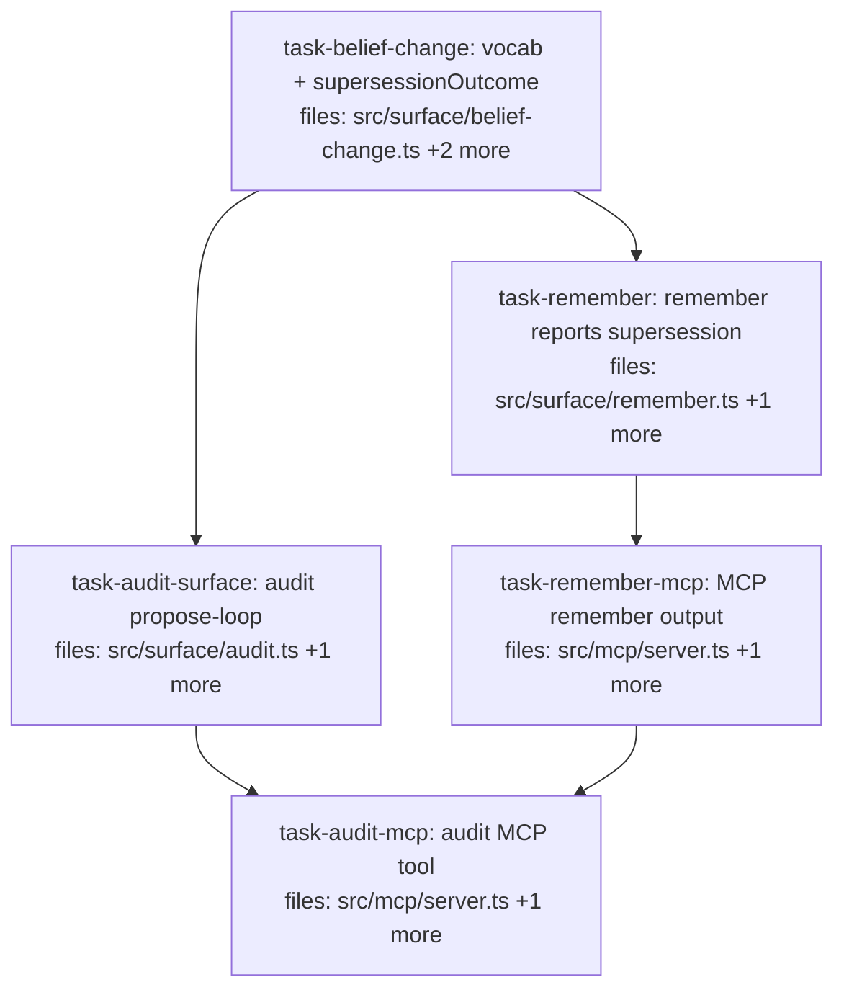

## Context

Child **belief-change-maintainable** of the Belief-change visibility charter
(`docs/superpowers/specs/2026-07-02-belief-change-visibility-charter.md`). Combines gap #2
(supersession-aware `remember` response — the per-write belief-change detector) and gap #4
(an `audit` propose-loop — the whole-corpus detector). No algebra change; reuses `dedupeGroups`
(merge attributions), `pairsOf`/`resolveDeprecateOlder` (deprecations), `resolveKeyCardinality`,
and the census/reconcile surface ops.

**Charter contract (inlined into tasks):** the ONE belief-change vocabulary is Cluster A's
`DispositionReason` (`merged-into{targetId}`, `deprecated-by{byId,via}`, …). Per Charter
§Interfaces, the first cross-module importer promotes it to a neutral home — done here in
`task-belief-change` (move to `src/surface/belief-change.ts`, `explain.ts` re-exports). No child
mints a parallel supersession/proposal shape (Charter I4).

**Charter invariants (inlined):**
- **I2 — every belief-change observable:** `remember` reports what its write did (supersede /
  merge / duplicate / committed); an unreported supersession is a defect.
- **I3 — propose-never-apply:** `audit` ONLY proposes declarations; it never writes an alias,
  never declares cardinality, never deprecates. Applying is a separate explicit
  `remember`/`declare_cardinality` call by the agent/human. An `audit` that mutates is a defect.
- **I1 — non-destructive:** nothing here deletes a claim.

**Serialization note:** `task-remember-mcp` and `task-audit-mcp` both write `src/mcp/server.ts` +
`server.integration.test.ts` → serialized (audit-mcp after remember-mcp). `task-remember` ∥
`task-audit-surface` are write-disjoint (they only READ the stable `belief-change.ts`) and run in
parallel after `task-belief-change`.

## Tasks

## Task: belief-change module (vocabulary + supersessionOutcome)

```yaml
id: task-belief-change
depends_on: []
files:
  - src/surface/belief-change.ts
  - src/surface/belief-change.test.ts
  - src/surface/explain.ts
status: pending
quality_reviewer_hint: opus
```

Create the shared belief-change module: move `DispositionReason` here (charter vocabulary home;
`explain.ts` re-exports for back-compat), and add `supersessionOutcome` — a focused, embeddings-free
attribution of what a just-written claim did to its `(subject,key)` group, reusing `dedupeGroups`
+ `pairsOf`/`resolveDeprecateOlder`. Charter §Interfaces + §I2.

## Implementation

```typescript
// src/surface/belief-change.ts
import type { Session } from "./types.js";
import type { Claim } from "../core/claim.js";
import { corpusOf } from "../algebra/types.js";
import { tauValid } from "../algebra/temporal.js";
import { dedupeGroups } from "../algebra/combination.js";
import { pairsOf } from "../algebra/contradiction.js";
import { resolveKeyCardinality } from "./cardinality.js";
import { loadAliasContext, MCP_EVIDENCE_POOLING_RULE } from "./recall.js";
import { DEDUPE_DEFAULTS } from "../retrieval/read-pipeline.js";

// MOVED from explain.ts (charter vocabulary home). explain.ts now re-exports this.
export type DispositionReason =
  | { kind: "served" }
  | { kind: "merged-into"; targetId: string }
  | { kind: "deprecated-by"; byId: string; via: "single-cardinality" }
  | { kind: "tau-invalid" }
  | { kind: "below-floor"; score: number; floor: number }
  | { kind: "abstained"; topScore: number; threshold: number }
  | { kind: "over-limit"; rank: number; limit: number }
  | { kind: "alias-or-flag" };

export interface SupersessionOutcome {
  action: "committed" | "superseded" | "merged" | "duplicate";
  /** ids of live claims this write deprecated (action="superseded"). */
  deprecatedIds: string[];
  /** for action="merged": the surviving claim this write was absorbed into. */
  mergedInto?: string;
  /** vocabulary-aligned reason (deprecated-by / merged-into), when applicable. */
  reason?: DispositionReason;
}

/** What did the just-written claim `claimId` do to its (subject,key) group? Embeddings-free:
 *  reads the group, applies τ_valid + ⊕_dedupe + ⊥(effective cardinality) and attributes the
 *  new claim. Best-effort — callers wrap; never throws into the write. */
export function supersessionOutcome(
  session: Session, corpus: string, claimId: string,
): SupersessionOutcome {
  const now = Date.now();
  const keyCardinality = resolveKeyCardinality(session, corpus, undefined);
  const { aliasMap } = loadAliasContext(session, corpus, now, keyCardinality);
  const written = session.mneme.read(corpus, { corpusId: corpus }).find((c) => c.id === claimId);
  if (!written) return { action: "committed", deprecatedIds: [] };
  // group = same (subject, key) family, τ_valid
  const group = tauValid(now)(corpusOf(
    session.mneme.read(corpus, { corpusId: corpus, subject: written.subject, key: written.key }) as Claim[],
  ));
  // ⊕_dedupe: was the written claim absorbed (not a survivor)?
  const { mergedInto } = dedupeGroups(DEDUPE_DEFAULTS.rule, undefined,
    { similarity: { fn: DEDUPE_DEFAULTS.fn, cutoff: DEDUPE_DEFAULTS.cutoff } })(group);
  if (mergedInto.has(claimId)) {
    const target = mergedInto.get(claimId)!;
    // same valueHash as target ⇒ duplicate; else a restatement merge
    const targetClaim = group.claims.find((c) => c.id === target);
    const action = targetClaim && targetClaim.valueHash === written.valueHash ? "duplicate" : "merged";
    return { action, deprecatedIds: [], mergedInto: target, reason: { kind: "merged-into", targetId: target } };
  }
  // ⊥: which live claims does the written (newer) claim deprecate?
  const pairs = pairsOf(group, 0, { keyCardinality, keyAliases: aliasMap, evidencePoolingRule: MCP_EVIDENCE_POOLING_RULE });
  const deprecatedIds: string[] = [];
  for (const p of pairs) {
    if (p.left.valid.from === p.right.valid.from) continue;
    const [older, newer] = p.left.valid.from < p.right.valid.from ? [p.left, p.right] : [p.right, p.left];
    if (newer.id === claimId) deprecatedIds.push(older.id);
  }
  if (deprecatedIds.length)
    return { action: "superseded", deprecatedIds, reason: { kind: "deprecated-by", byId: claimId, via: "single-cardinality" } };
  return { action: "committed", deprecatedIds: [] };
}
```

```typescript
// src/surface/explain.ts — REPLACE the inline `DispositionReason` union with a re-export:
export type { DispositionReason } from "./belief-change.js";
// (import it where explain.ts uses it internally, from ./belief-change.js)
```

```typescript
// src/surface/belief-change.test.ts — failing tests (reuse test-support)
import { freshSession } from "./test-support.js";
import { supersessionOutcome } from "./belief-change.js";
it("supersessionOutcome reports superseded on a single-cardinality distinct-value write", () => {
  const s = freshSession();
  s.createCorpus({ id: "c", keyCardinality: { plan: "single" } });
  const a = s.write("c", { subject: "p", key: "plan", value: "alpha", valid: { from: 1, to: Infinity } });
  const b = s.write("c", { subject: "p", key: "plan", value: "bravo", valid: { from: 2, to: Infinity } });
  const out = supersessionOutcome(s, "c", b.id);
  expect(out.action).toBe("superseded");
  expect(out.deprecatedIds).toContain(a.id);
  s.close();
});
```

## Acceptance criteria

- `DispositionReason` lives in `src/surface/belief-change.ts`; `explain.ts` re-exports it (existing
  explain imports/tests unchanged — back-compat). No parallel vocabulary defined (Charter I4).
- `supersessionOutcome(session, corpus, claimId)` returns `action ∈ {committed,superseded,merged,duplicate}`
  with `deprecatedIds` (superseded), `mergedInto` (merged/duplicate), and a vocabulary-aligned
  `reason`. Embeddings-free; reuses `dedupeGroups`/`pairsOf`. Honors per-corpus cardinality
  (`resolveKeyCardinality`) and aliases.
- Tested: single-cardinality distinct write → `superseded` naming the older id; token-similar write →
  `merged` (targetId); identical value → `duplicate`; multi-cardinality distinct write → `committed`.
- Full suite + `tsc --noEmit` green; `layering.test.ts` green.

Test file: `src/surface/belief-change.test.ts`.

## Task: remember reports supersession

```yaml
id: task-remember
depends_on: [task-belief-change]
files:
  - src/surface/remember.ts
  - src/surface/remember.test.ts
status: pending
```

Extend `RememberResult` with the belief-change outcome and populate it best-effort after the write.
Charter §I2 (every write's belief-change observable).

## Implementation

```typescript
// src/surface/remember.ts
import { supersessionOutcome, type SupersessionOutcome } from "./belief-change.js";

export interface RememberResult {
  id: string;
  status: string;
  corpus: string;
  supersession?: SupersessionOutcome; // what this write did to the belief state (best-effort)
}

// in remember(), after `const out = session.write(...)` and before returning, when committed:
let supersession: SupersessionOutcome | undefined;
if (out.status === "committed") {
  try { supersession = supersessionOutcome(session, args.corpus, out.id); }
  catch { /* best-effort: never fail the write */ }
}
return { id: out.id, status: out.status, corpus: args.corpus, supersession };
```

```typescript
// src/surface/remember.test.ts — failing test
it("remember reports superseding an older single-cardinality value", () => {
  const s = freshSession();
  s.createCorpus({ id: "c", keyCardinality: { plan: "single" } });
  remember(s, { subject: "p", key: "plan", value: "alpha", corpus: "c", validFrom: "2026-01-01T00:00:00Z" });
  const r = remember(s, { subject: "p", key: "plan", value: "bravo", corpus: "c", validFrom: "2026-02-01T00:00:00Z" });
  expect(r.supersession?.action).toBe("superseded");
  expect(r.supersession?.deprecatedIds.length).toBeGreaterThan(0);
  s.close();
});
```

## Acceptance criteria

- `RememberResult.supersession?: SupersessionOutcome`, populated on a committed write via
  `supersessionOutcome`, best-effort (a failure leaves it undefined, never throws).
- A distinct-value write under a single-cardinality key reports `action:"superseded"` + the
  deprecated id; a coexisting (multi) write reports `committed`.
- Existing `remember` tests stay green (the field is additive/optional).
- Full suite + `tsc --noEmit` green.

Test file: `src/surface/remember.test.ts`.

## Task: audit propose-loop (surface)

```yaml
id: task-audit-surface
depends_on: [task-belief-change]
files:
  - src/surface/audit.ts
  - src/surface/audit.test.ts
status: pending
quality_reviewer_hint: opus
```

`audit(session, args, deps)` — the whole-corpus detector. Composes `keyCensus` (alias candidates),
`subjectCensus` (subject fragmentation), and single-cardinality collisions into ONE ranked list of
**proposed declarations**. Charter §I3: PROPOSE ONLY — never applies.

## Implementation

```typescript
// src/surface/audit.ts
import type { Session, ReadDeps } from "./types.js";
import { keyCensus, subjectCensus } from "./census.js";

export type ProposalKind = "key-alias" | "subject-fragmentation" | "cardinality-declare";
export interface AuditProposal {
  kind: ProposalKind;
  /** the entities involved (key pair / subject pair / (subject,key)). */
  entities: string[];
  score?: number;                 // similarity for alias/fragmentation proposals
  claimsAffected: number;         // ranking signal
  /** ready-to-apply action the AGENT/HUMAN runs to confirm (never auto-run here). */
  suggestedAction: string;        // e.g. remember({key:"...",value:"..."}) or declare_cardinality(...)
  detail: string;
}
export interface AuditResult {
  corpus: string;
  proposals: AuditProposal[];     // ranked desc by claimsAffected then score
  rankFn: string;
  warnings: string[];
  content: string;                // human-readable maintenance report
}

export async function audit(session: Session, args: { corpus: string; limit?: number }, deps: ReadDeps): Promise<AuditResult> {
  // Compose the existing detectors (NO writes — propose only):
  //  - keyCensus.candidates + keyCensus alias ratification shape → "key-alias" proposals
  //  - subjectCensus.candidates → "subject-fragmentation" proposals (advisory; reconcile-at-ingest)
  //  - keyCensus.warnings (single-cardinality collisions) → "cardinality-declare" proposals
  // Rank by claimsAffected desc, then score desc. Build `content` as a maintenance report.
  // Returns proposals only; the agent applies via remember(alias-of)/declare_cardinality.
}
```

```typescript
// src/surface/audit.test.ts — failing tests
import { freshSession, jaccardDeps } from "./test-support.js";
import { audit } from "./audit.js";
it("audit proposes a cardinality-declare for a single-cardinality collision and NEVER applies it", async () => {
  const s = freshSession();
  s.createCorpus({ id: "c", keyCardinality: { plan: "single" } });
  s.write("c", { subject: "p", key: "plan", value: "alpha", valid: { from: 1, to: Infinity } });
  s.write("c", { subject: "p", key: "plan", value: "bravo", valid: { from: 2, to: Infinity } });
  const before = s.mneme.read("c", { corpusId: "c" }).length;
  const r = await audit(s, { corpus: "c" }, jaccardDeps);
  expect(r.proposals.some((p) => p.kind === "cardinality-declare")).toBe(true);
  // I3: proposing must not mutate — claim count + schema unchanged.
  expect(s.mneme.read("c", { corpusId: "c" }).length).toBe(before);
  expect((s.inspectCorpus("c") as { schema: { keyCardinality: Record<string,string> } }).schema.keyCardinality)
    .toEqual({ plan: "single" }); // NOT flipped to multi
  s.close();
});
```

## Acceptance criteria

- `audit` returns a ranked `proposals` list unifying key-alias candidates (from `keyCensus`),
  subject-fragmentation candidates (from `subjectCensus`), and single-cardinality collisions,
  each with a ready-to-apply `suggestedAction` string and `claimsAffected` ranking.
- **Charter I3 (hard):** `audit` performs NO writes — no alias claim, no cardinality declaration,
  no deprecation. The test asserts claim count AND schema are unchanged after `audit`.
- Read-only; unknown corpus → empty proposals, corpus not created.
- Full suite + `tsc --noEmit` green; `layering.test.ts` green.

Test file: `src/surface/audit.test.ts`.

## Task: MCP remember surfaces supersession

```yaml
id: task-remember-mcp
depends_on: [task-remember]
files:
  - src/mcp/server.ts
  - src/mcp/server.integration.test.ts
status: pending
is_wiring_task: true
```

Surface `RememberResult.supersession` in the MCP `remember` tool output (structuredContent + the
human-readable text). Charter §I2.

## Acceptance criteria

- The `remember` tool `outputSchema` gains an optional `supersession` object
  (`{action, deprecatedIds, mergedInto?, reason?}`); the handler passes `r.supersession` through;
  the text block notes it when present (e.g. "superseded 1 earlier claim").
- End-to-end: writing a distinct value under a single-cardinality key returns
  `structuredContent.supersession.action === "superseded"` with a non-empty `deprecatedIds`.
- `backcompat.test.ts` green (field is additive/optional; fast path unchanged when absent).
- Full suite + `tsc --noEmit` green.

Test file: `src/mcp/server.integration.test.ts`.

## Task: audit MCP tool

```yaml
id: task-audit-mcp
depends_on: [task-audit-surface, task-remember-mcp]
files:
  - src/mcp/server.ts
  - src/mcp/server.integration.test.ts
status: pending
is_wiring_task: true
```

Register the read-only `audit` MCP tool (mirrors `key_census`/`subject_census`), and reference it
in `MNEME_WRITE_SCHEMA` as the periodic maintenance pass. Charter §I3.

## Acceptance criteria

- `audit` tool: input `{ corpus?, limit? }`; `readOnlyHint:true, idempotentHint:true`; returns
  `AuditResult` fields (`corpus`, `proposals`, `rankFn`, `warnings`, `content`); warnings→stderr per house convention.
- End-to-end: on a corpus with a single-cardinality collision, the tool returns a
  `cardinality-declare` proposal; a follow-up `declare_cardinality` (the agent applying it) then
  clears it on re-audit. The tool itself writes nothing (Charter I3 — assert claim count unchanged).
- `MNEME_WRITE_SCHEMA` gains a line: run `audit` periodically to review proposed canonicalizations
  (aliases / cardinality) — propose-then-confirm, never auto-applied.
- `backcompat.test.ts` green.
- Full suite + `tsc --noEmit` green.

Test file: `src/mcp/server.integration.test.ts`.
