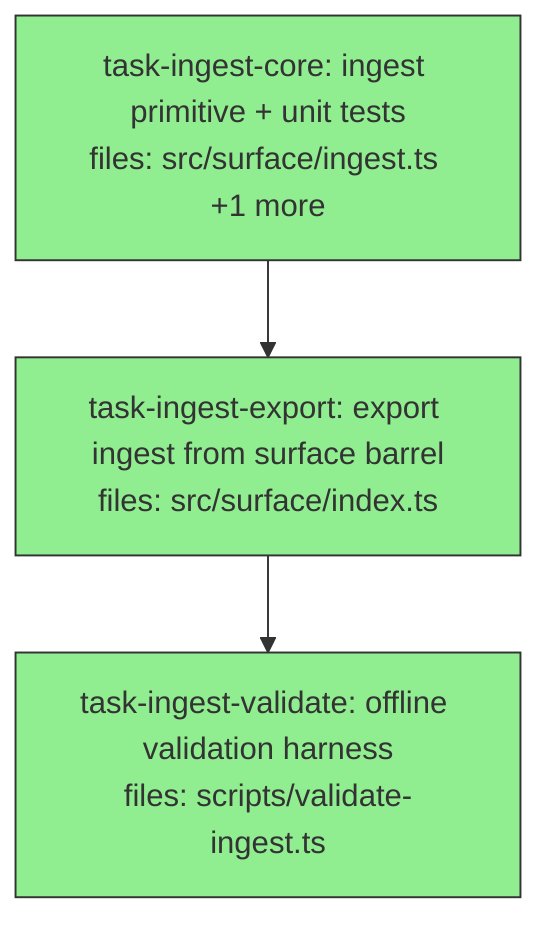

## Context

Phase 1 of the ingest-loop SDK, per `docs/superpowers/specs/2026-07-02-ingest-loop-sdk-design.md`.
Builds `ingest(session, args, deps) → IngestReport`, a **pure composition** of already-shipped
primitives (`reconcile`, `keyCensus`/`subjectCensus`, supersession-aware `remember`, `audit`,
`session.declareCardinality`) that wires the recall-before-write ingestion loop the 2026-07-01
Fireflies dogfood proved necessary — no new algebra. Phase 2 (an optional `ingest` MCP tool) is
out of scope for this plan.

The three tasks are file-disjoint. The DAG is near-linear because the surface barrel export
(`task-ingest-export`) must see `ingest.ts` before it can re-export it, and the validation harness
imports from the public barrel (`../src/surface/index.js`, matching the two existing
`validate-*.ts` harnesses) so it must see the export.

All work is offline and deterministic: with `{ embeddings: { rankFn: "jaccard" } }` and a pure
`extract` callback, the whole loop is LLM-free (the extractor is the only non-deterministic seam,
and it is injected). No API spend at any point.

## Tasks

## Task: ingest primitive + unit tests

```yaml
id: task-ingest-core
depends_on: []
files:
  - src/surface/ingest.ts
  - src/surface/ingest.test.ts
status: done
```

Implement the `ingest` primitive and its unit-test suite together (TDD). The loop gathers the
corpus's live canonical entities, runs the caller-injected `extract` callback WITH that canon,
reconciles the candidates, auto-remaps only high-confidence (`reuse`) matches while routing
`uncertain` matches to a ratify bucket (the over-anchoring guard), writes each remapped candidate
via supersession-aware `remember`, and composes `audit` for propose-only maintenance suggestions.
Per spec §3–§7.

## Implementation

```typescript
// src/surface/ingest.ts
import type { Session, ReadDeps } from "./types.js";
import type { ReconcileDisposition } from "./reconcile.js";
import type { SupersessionOutcome } from "./belief-change.js";
import type { AuditProposal } from "./audit.js";
import { reconcile } from "./reconcile.js";
import { remember } from "./remember.js";
import { keyCensus, subjectCensus } from "./census.js";
import { audit } from "./audit.js";

export interface CandidateClaim {
  subject: string; key: string; value: string;
  validFrom?: string; confidence?: number;
  tags?: string[]; scope?: Record<string, string>;
}
export interface IngestContext {
  corpus: string; canonicalSubjects: string[]; canonicalKeys: string[]; canonPrompt: string;
}
export interface IngestArgs {
  corpus: string;
  extract: (ctx: IngestContext) => CandidateClaim[] | Promise<CandidateClaim[]>;
  reuseThreshold?: number; newThreshold?: number;
  autoDeclareCardinality?: boolean; dryRun?: boolean;
}
export interface IngestedClaim {
  candidate: CandidateClaim;
  subject: { final: string; disposition: ReconcileDisposition; remappedFrom?: string };
  key: { final: string; disposition: ReconcileDisposition; remappedFrom?: string };
  write?: { id: string; status: string; supersession?: SupersessionOutcome };
}
export interface IngestReport {
  corpus: string; dryRun: boolean; claims: IngestedClaim[];
  counts: {
    extracted: number; reusedSubjects: number; mintedSubjects: number;
    uncertain: number; superseded: number; duplicates: number; written: number;
  };
  proposals: AuditProposal[]; rankFn: string; warnings: string[]; content: string;
}

export async function ingest(session: Session, args: IngestArgs, deps: ReadDeps): Promise<IngestReport> {
  const known = session.listCorpora().some((c) => c.id === args.corpus);
  if (!known) {
    const ctx = { corpus: args.corpus, canonicalSubjects: [], canonicalKeys: [], canonPrompt: "" };
    const candidates = await args.extract(ctx); // still allow extraction; all will be "new"
    // ... reconcile against empty existing → every disposition "new"; write per !dryRun ...
  }
  // 1. gather canon
  const [scen, kcen] = await Promise.all([
    subjectCensus(session, { corpus: args.corpus }, deps),
    keyCensus(session, { corpus: args.corpus }, deps),
  ]);
  const canonicalSubjects = scen.subjects.map((s) => s.subject);
  const canonicalKeys = kcen.keys.map((k) => k.key);
  // 2. extract WITH canon (recall-before-write edge)
  // 3. reconcile candidate subjects/keys
  // 4. remap: reuse → suggestions[0].existing; uncertain → keep (surface); new → mint
  // 5. remember each (unless dryRun), capture supersession
  // 6. audit → proposals (propose-only unless autoDeclareCardinality applies cardinality-declare)
  // ... assemble IngestReport ...
  throw new Error("stub — implement per spec §4");
}
```

```typescript
// src/surface/ingest.test.ts
import { describe, it, expect } from "vitest";
import { mkdtempSync } from "node:fs";
import { tmpdir } from "node:os";
import { join } from "node:path";
import { openSession } from "./session.js";
import { ingest } from "./ingest.js";

const deps = { embeddings: { rankFn: "jaccard" as const } };
const tmpDb = () => join(mkdtempSync(join(tmpdir(), "mneme-ingest-")), "store.db");

it("auto-remaps a reuse-match candidate to the canonical subject instead of minting", async () => {
  const s = openSession({ dbPath: tmpDb(), writer: "t" });
  s.createCorpus({ id: "c" });
  s.write("c", { subject: "project:crewtracks", key: "status", value: "active",
    valid: { from: 1, to: Infinity }, source: "llm", confidence: 0.8 });
  const report = await ingest(s, {
    corpus: "c",
    extract: () => [{ subject: "project:crewtracks", key: "status", value: "shipping",
      validFrom: "2026-02-01T00:00:00Z" }],
  }, deps);
  const claim = report.claims[0];
  expect(claim.subject.final).toBe("project:crewtracks");
  expect(claim.subject.disposition).toBe("reuse");
  s.close();
});
```

## Acceptance criteria

- `ingest(session, {corpus, extract}, deps)` returns an `IngestReport` whose `claims[]` records, per
  candidate, both a subject and key `{ final, disposition, remappedFrom? }` and (when not dryRun) a
  `write` with `id`/`status`/`supersession`.
- `extract` receives an `IngestContext` carrying `canonicalSubjects`/`canonicalKeys` drawn from the
  live corpus (via `subjectCensus`/`keyCensus`) — verified by a test asserting the callback sees a
  pre-seeded canonical subject.
- A candidate whose subject scores `reuse` (≥ `reuseThreshold`, default 0.9) is written under the
  canonical existing subject with `remappedFrom` set — NOT minted.
- A genuinely-distinct candidate (no shared tokens) lands `new`/`uncertain` and is written under its
  own subject (over-anchoring guard — `uncertain` is never auto-folded).
- A second distinct value under a single-cardinality key reports `write.supersession.action ===
  "superseded"` with the older claim id in `deprecatedIds`.
- `dryRun: true` performs extract + reconcile + audit but writes nothing: corpus claim count is
  unchanged and every `claims[i].write` is `undefined`, while `proposals` is still populated.
- `autoDeclareCardinality: false` (default) never mutates schema; `audit` proposals of kind
  `cardinality-declare` are surfaced in `proposals` but not applied.
- Unknown corpus degrades gracefully: returns a well-formed report with `counts.extracted` reflecting
  the callback and no thrown error.

Test file: `src/surface/ingest.test.ts`.

## Task: export ingest from surface barrel

```yaml
id: task-ingest-export
depends_on: [task-ingest-core]
files:
  - src/surface/index.ts
status: done
is_wiring_task: true
```

Re-export the `ingest` function and its public types from the surface barrel so consumers (and the
validation harness) import from `../src/surface/index.js`, matching the existing `reconcile`/
`remember`/`explainRecall` export lines.

## Acceptance criteria

- `import { ingest } from "../src/surface/index.js"` resolves and is the function defined in
  `task-ingest-core`.
- `import type { IngestArgs, IngestContext, CandidateClaim, IngestedClaim, IngestReport } from
  "../src/surface/index.js"` resolves (types re-exported).
- `npx tsc --noEmit` stays green after the export is added.

Test file: `src/surface/ingest.test.ts` (existing suite continues to pass; no new test file — this is a re-export wiring task).

## Task: offline validation harness

```yaml
id: task-ingest-validate
depends_on: [task-ingest-export]
files:
  - scripts/validate-ingest.ts
status: done
```

A third durable offline harness alongside `validate-shipped-dogfood.ts` and
`validate-belief-change.ts` (same temp-DB, jaccard-deps, no-LLM style), driving `ingest` through the
public barrel with a **pure** `extract` callback to reproduce the spec §9 predicted effects and print
`PASS`/`GAP` per effect.

## Implementation

```typescript
// scripts/validate-ingest.ts
import { mkdtempSync } from "node:fs";
import { tmpdir } from "node:os";
import { join } from "node:path";
import { openSession, ingest } from "../src/surface/index.js";

const deps = { embeddings: { rankFn: "jaccard" as const } };
const tmpDb = () => join(mkdtempSync(join(tmpdir(), "mneme-vingest-")), "store.db");
const results: { effect: string; ok: boolean; detail: string }[] = [];
const check = (effect: string, ok: boolean, detail: string) => {
  results.push({ effect, ok, detail });
  console.log(`${ok ? "PASS" : "GAP "}  ${effect}\n        ${detail}`);
};

// Reuse-remap: pre-seed canonical subject, extract an exact match under a new value → remapped, superseded.
{
  const s = openSession({ dbPath: tmpDb(), writer: "vi" });
  s.createCorpus({ id: "c", keyCardinality: { status: "single" } });
  s.write("c", { subject: "project:crewtracks", key: "status", value: "active",
    valid: { from: 1, to: Infinity }, source: "llm", confidence: 0.8 });
  const r = await ingest(s, { corpus: "c",
    extract: (ctx) => {
      const sawCanon = ctx.canonicalSubjects.includes("project:crewtracks");
      return [{ subject: "project:crewtracks", key: "status", value: "shipping",
        validFrom: "2026-02-01T00:00:00Z", tags: sawCanon ? [] : ["MISSING-CANON"] }];
    } }, deps);
  const c = r.claims[0];
  check("reuse-remap + supersession (extractor saw canon, exact match remapped, older superseded)",
    c.subject.disposition === "reuse" && c.subject.final === "project:crewtracks"
      && c.write?.supersession?.action === "superseded",
    `disposition=${c.subject.disposition}, final=${c.subject.final}, action=${c.write?.supersession?.action}`);
  s.close();
}

// dryRun writes nothing but still proposes; over-anchoring guard keeps a distinct subject "new".
// ... additional checks per spec §9 ...

const passed = results.filter((r) => r.ok).length;
console.log(`\n${"=".repeat(60)}\n${passed}/${results.length} ingest-loop effects verified.`);
process.exit(0);
```

```typescript
// scripts/validate-ingest.ts — the over-anchoring-guard effect (a distinct candidate is NOT folded)
{
  const s = openSession({ dbPath: tmpDb(), writer: "vi" });
  s.createCorpus({ id: "c" });
  s.write("c", { subject: "client:liner-division", key: "status", value: "active",
    valid: { from: 1, to: Infinity }, source: "llm", confidence: 0.8 });
  const r = await ingest(s, { corpus: "c",
    extract: () => [{ subject: "division:traffic-control", key: "status", value: "active",
      validFrom: "2026-02-01T00:00:00Z" }] }, deps);
  const c = r.claims[0];
  check("over-anchoring guard — genuinely-distinct subject is NOT folded into the canonical one",
    c.subject.final === "division:traffic-control" && c.subject.disposition !== "reuse",
    `final=${c.subject.final}, disposition=${c.subject.disposition}`);
  s.close();
}
```

## Acceptance criteria

- `npx tsx scripts/validate-ingest.ts` runs offline (no LLM/network), prints a `PASS`/`GAP` line per
  effect and a final `N/N` count, and exits 0.
- Reproduces the **reuse-remap** effect: an exact-match candidate is written under the canonical
  subject (disposition `reuse`) AND the older claim is `superseded`.
- Reproduces the **over-anchoring guard**: a genuinely-distinct candidate (no shared tokens) is NOT
  folded — its `subject.final` stays the minted subject and disposition is not `reuse`.
- Reproduces the **propose-only / dryRun** effect: `dryRun:true` leaves the corpus claim count
  unchanged yet returns a non-empty `proposals` array.
- The harness asserts the extractor actually received canon (the seeded canonical subject appears in
  `IngestContext.canonicalSubjects`), so a broken feedback edge shows as a GAP.
- All effects PASS (the script prints the full count with no GAP lines).

Test file: `scripts/validate-ingest.ts` (the harness is itself the executable check; asserted by running it).
