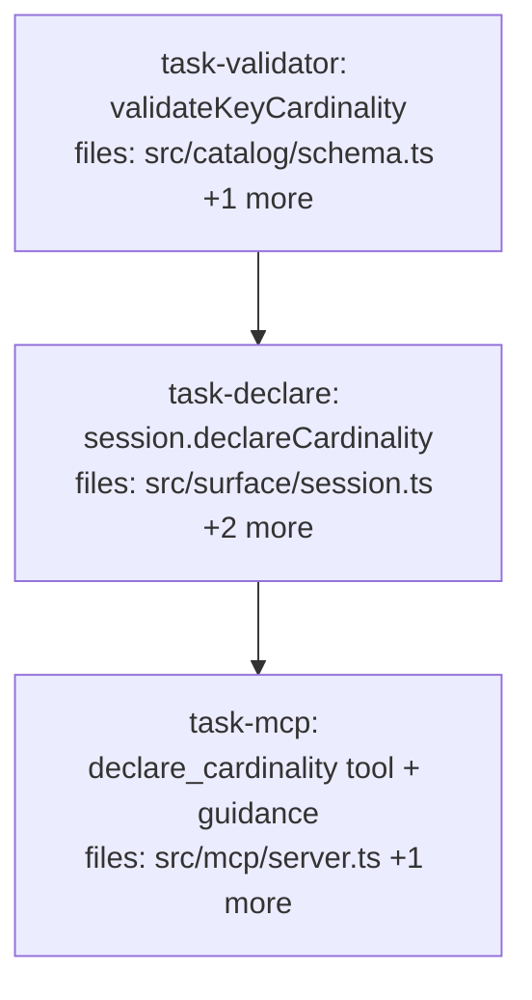

## Context

Drives the MCP cardinality-declaration spec (`docs/superpowers/specs/2026-07-02-mcp-cardinality-declaration-design.md`).
Closes the MCP utilization gap for Clusters A/B/C: a `declare_cardinality` tool (so the safety
warning is actionable) + write-discipline guidance routing the agent through
`reconcile`/`subject_census`/`explain`. Linear chain: shared validator → surface method →
MCP transport. No algebra/read-path change (`resolveKeyCardinality` already merges schema over
global). Verified: `Catalog.createCorpus` overwrites (`corpora.set`, no throw); claims live
separately from the def, so re-creating the def to patch `schema.keyCardinality` leaves claims intact.

## Tasks

## Task: validateKeyCardinality shared validator

```yaml
id: task-validator
depends_on: []
files:
  - src/catalog/schema.ts
  - src/catalog/schema.test.ts
status: pending
```

Extract the per-key cardinality validation into a shared, reusable validator in the
schema-validation home (next to `validateScope`/`cardinalityOf`). Spec §"Module structure".

## Implementation

```typescript
// src/catalog/schema.ts — add
/** Throws if any value in the map is not "single" | "multi" (fail-fast at declaration).
 *  Shared by createCorpus and declareCardinality (surface). */
export function validateKeyCardinality(map: Record<string, "single" | "multi">): void {
  for (const [k, v] of Object.entries(map)) {
    if (v !== "single" && v !== "multi") {
      throw new Error(`invalid keyCardinality for key "${k}": ${v} (expected "single" | "multi")`);
    }
  }
}
```

```typescript
// src/catalog/schema.test.ts — failing tests
import { validateKeyCardinality } from "./schema.js";
it("validateKeyCardinality accepts single/multi and throws on anything else", () => {
  expect(() => validateKeyCardinality({ a: "single", b: "multi" })).not.toThrow();
  expect(() => validateKeyCardinality({ a: "many" as "single" })).toThrow(/invalid keyCardinality/);
});
```

## Acceptance criteria

- `validateKeyCardinality(map)` throws with a clear message on any value ∉ `{"single","multi"}`;
  no-ops on a valid (or empty) map.
- Exported from `src/catalog/schema.ts`.
- Full suite + `tsc --noEmit` green.

Test file: `src/catalog/schema.test.ts`.

## Task: session.declareCardinality (create-or-patch, merge)

```yaml
id: task-declare
depends_on: [task-validator]
files:
  - src/surface/session.ts
  - src/surface/types.ts
  - src/surface/session.test.ts
status: pending
quality_reviewer_hint: opus
```

Add `declareCardinality` to the `Session` facade (create-or-patch, merge; claims untouched),
and rewire `createCorpus`'s inline cardinality validation to the shared `validateKeyCardinality`.
Spec §"Part 1 → Surface".

## Implementation

```typescript
// src/surface/types.ts — add to the Session interface
  /** Declare per-key cardinality for a corpus (create-or-patch, merge). Validates values;
   *  creates the corpus if absent, else merges into schema.keyCardinality and re-persists the
   *  def (claims untouched). Returns the effective keyCardinality map after the merge. */
  declareCardinality(corpusId: string, cardinality: Record<string, "single" | "multi">): Record<string, "single" | "multi">;
```

```typescript
// src/surface/session.ts
// 1. import the shared validator:
import { validateKeyCardinality } from "../catalog/schema.js";

// 2. in createCorpus, REPLACE the inline keyCardinality validation loop (added in Cluster C) with:
if (spec.keyCardinality) validateKeyCardinality(spec.keyCardinality);

// 3. add the method to the returned `session` object (same closure — has mneme, dbPath, saveCorpora):
    declareCardinality(corpusId, cardinality) {
      validateKeyCardinality(cardinality);
      const existing = mneme.listCorpora((c) => c.id === corpusId)[0] as CorpusDef | undefined;
      if (!existing) {
        session.createCorpus({ id: corpusId, keyCardinality: cardinality });
        return { ...cardinality };
      }
      const merged = { ...(existing.schema.keyCardinality ?? {}), ...cardinality };
      // Overwrite the DEF only (Catalog.createCorpus is corpora.set) — claims are stored
      // separately in the adapter and are NOT touched.
      mneme.createCorpus({ ...existing, schema: { ...existing.schema, keyCardinality: merged } });
      saveCorpora(dbPath, mneme.listCorpora());
      return merged;
    },
```

```typescript
// src/surface/session.test.ts — failing tests (reuse the file's temp-db pattern)
it("declareCardinality merges into an existing corpus and preserves claims + other schema fields", () => {
  const db = tmpDb();
  const s = openSession({ dbPath: db, writer: "test" });
  s.createCorpus({ id: "c", subjects: ["client:x"], keyCardinality: { status: "single" } });
  s.write("c", { subject: "client:x", key: "plan", value: "alpha" });
  const eff = s.declareCardinality("c", { plan: "multi" });
  expect(eff).toEqual({ status: "single", plan: "multi" }); // merged, not replaced
  const def = s.inspectCorpus("c") as { schema: { keyCardinality: Record<string,string>; subjects: string[] } };
  expect(def.schema.keyCardinality).toEqual({ status: "single", plan: "multi" });
  expect(def.schema.subjects).toEqual(["client:x"]); // other schema fields intact
  // claim survives the def re-create:
  const claims = s.mneme.read("c", { corpusId: "c" });
  expect(claims.some((cl) => cl.value === "alpha")).toBe(true);
  s.close();
});
it("declareCardinality creates the corpus when absent; invalid value throws", () => {
  const s = openSession({ dbPath: tmpDb(), writer: "test" });
  s.declareCardinality("fresh", { plan: "multi" });
  expect((s.inspectCorpus("fresh") as { schema: { keyCardinality: Record<string,string> } }).schema.keyCardinality)
    .toEqual({ plan: "multi" });
  expect(() => s.declareCardinality("fresh", { k: "many" as "single" })).toThrow(/invalid keyCardinality/);
  s.close();
});
```

## Acceptance criteria

- `declareCardinality(corpusId, cardinality)` (on `Session`): validates fail-fast; on an existing
  corpus **merges** into `schema.keyCardinality` (preserving other declared keys AND other schema
  fields like `subjects`/`scalarPseudocount`); on an absent corpus creates it; returns the effective map.
- Claims written before declaring **survive** the def re-create.
- Idempotent (declaring the same map twice yields the same schema); round-trips across reopen.
- `createCorpus` now uses `validateKeyCardinality` (behavior unchanged — invalid still throws).
- Full suite + `tsc --noEmit` green.

Test file: `src/surface/session.test.ts`.

## Task: declare_cardinality MCP tool + write-discipline guidance

```yaml
id: task-mcp
depends_on: [task-declare]
files:
  - src/mcp/server.ts
  - src/mcp/server.integration.test.ts
status: pending
```

Register the `declare_cardinality` tool, and update the session instructions / `remember`
description / `recall` content footer to route the agent through the shipped tools. Spec
§"Part 1 → MCP tool" + §"Part 2".

## Implementation

```typescript
// src/mcp/server.ts — register declare_cardinality (mutating, idempotent)
server.registerTool(
  "declare_cardinality",
  {
    title: "Declare key cardinality",
    description:
      "Declare which keys hold multiple coexisting values ('multi') vs a single latest value ('single'). " +
      "Use after a recall/key_census cardinality warning to stop a single-cardinality key from silently " +
      "deprecating distinct facts. Merges into any existing declaration; never touches stored claims.",
    inputSchema: {
      corpus: z.string().optional().describe(`corpus to declare on; defaults to '${defaultCorpus}'`),
      cardinality: z.record(z.string(), z.enum(["single", "multi"]))
        .describe("per-key cardinality map, e.g. { requirement: 'multi', status: 'single' }"),
    },
    annotations: { readOnlyHint: false, destructiveHint: false, idempotentHint: true, openWorldHint: false },
    outputSchema: {
      corpus: z.string(),
      keyCardinality: z.record(z.string()).describe("the effective per-key cardinality after the merge"),
    },
  },
  async (a) => {
    const resolvedCorpus = a.corpus ?? defaultCorpus;
    const keyCardinality = session.declareCardinality(resolvedCorpus, a.cardinality);
    return {
      content: [{ type: "text" as const, text: `declared on '${resolvedCorpus}': ${JSON.stringify(keyCardinality)}` }],
      structuredContent: { corpus: resolvedCorpus, keyCardinality },
    };
  },
);
```

Also (text/wiring only):
- Extend `MNEME_WRITE_SCHEMA` with three bullets: (a) reconcile entities before minting a new
  subject/key (`reconcile` + `subject_census`); (b) if recall/key_census warns a single-cardinality
  key holds distinct values that should coexist, `declare_cardinality` it multi; (c) pass
  `explain: true` to recall to audit dispositions.
- Add to the `remember` tool `description`: "Reconcile the subject/key first (`reconcile`) to avoid
  fragmenting claims across near-duplicate entities."
- In the `recall` handler, when `r.warnings?.length`, append `"\n\n## ⚠ Warnings\n" + r.warnings.map(w => "- " + w).join("\n")` to the human-readable `text` block.

```typescript
// src/mcp/server.integration.test.ts — failing test (mirror the file's client/tool harness)
it("declare_cardinality makes a single-cardinality key coexist and clears the warning", async () => {
  // remember two distinct values under (proj, plan) in a fresh corpus
  await callTool("remember", { subject: "proj", key: "plan", value: "alpha", corpus: "cc" });
  await callTool("remember", { subject: "proj", key: "plan", value: "bravo", corpus: "cc" });
  const before = await callTool("recall", { about: "plan", subject: "proj", key: "plan", corpus: "cc" });
  expect(before.structuredContent.warnings?.some((w: string) => /single-cardinality/.test(w))).toBe(true);

  const decl = await callTool("declare_cardinality", { corpus: "cc", cardinality: { plan: "multi" } });
  expect(decl.structuredContent.keyCardinality).toMatchObject({ plan: "multi" });

  const after = await callTool("recall", { about: "plan", subject: "proj", key: "plan", corpus: "cc" });
  expect(after.structuredContent.matches.length).toBe(2); // both coexist
  expect(after.structuredContent.warnings?.some((w: string) => /single-cardinality/.test(w))).toBeFalsy();
});
```

## Acceptance criteria

- `declare_cardinality` tool: input `{ corpus?, cardinality }`; calls `session.declareCardinality`;
  returns `{ corpus, keyCardinality }`; annotations `readOnlyHint:false, idempotentHint:true`.
- End-to-end: two distinct values under a single-cardinality key → `recall` warns; `declare_cardinality {key:"multi"}` → `recall` serves both AND the warning is gone.
- `MNEME_WRITE_SCHEMA` routes the write loop through `reconcile`/`subject_census`, references
  `declare_cardinality` for the warning, and nudges `explain:true`; `remember` description points
  to `reconcile`.
- `recall`'s human-readable `content` text includes a `⚠ Warnings` section when warnings exist.
- `src/mcp/backcompat.test.ts` stays green (existing tools/output shapes unchanged; additive only).
- Full suite + `tsc --noEmit` green.

Test file: `src/mcp/server.integration.test.ts`.
