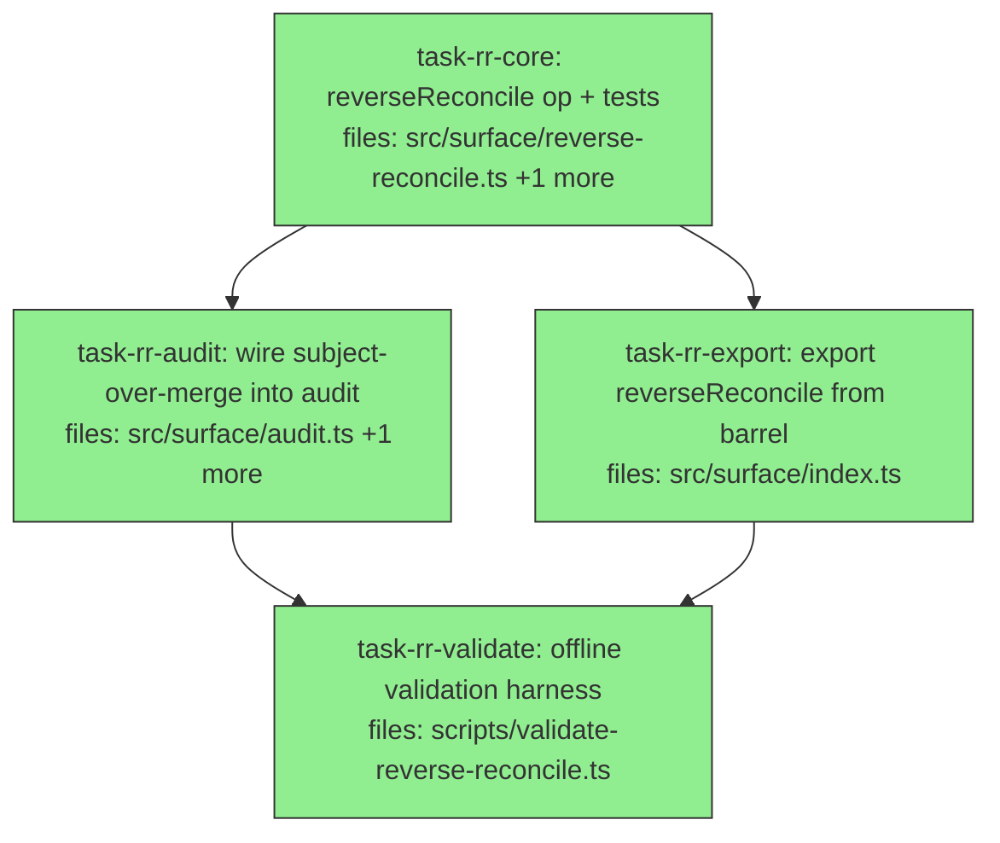

## Context

Phase 1.5 of the ingest-loop SDK, per `docs/superpowers/specs/2026-07-02-reverse-reconcile-over-anchoring-design.md`.
Adds `reverseReconcile` — a **propose-only** detector for the OVER-folding failure the real-LLM A/B
exposed (17 distinct entities collapsed onto 2 subjects), the symmetric counterpart to
`reconcile`/`subjectCensus` which only catch UNDER-folding. v1 ships approaches **A** (subject-cohesion
audit, low confidence) + **B** (value→subject re-attribution, medium confidence) in one op; approach C
(dual-pass shadow extraction) is documented in the spec as a deferred cost-gated escalation and is NOT
built here.

Composition-first (no new algebra): reuses `distinctEntities`/`entityScorer` (`src/surface/entities.ts`)
and `clustersOf` (`src/algebra/contradiction.ts`). Hard invariants inherited from the belief-change
charter: **I3 propose-never-apply** (no auto-split, ever) and **confidence honesty** (the type forbids
`"high"`; "fewer subjects = good" is a banned framing).

`task-rr-audit` and `task-rr-export` are file-disjoint and both depend only on `task-rr-core`, so they
run in parallel. All work is offline/deterministic with jaccard deps.

## Tasks

## Task: reverseReconcile op + tests

```yaml
id: task-rr-core
depends_on: []
files:
  - src/surface/reverse-reconcile.ts
  - src/surface/reverse-reconcile.test.ts
status: done
```

Implement `reverseReconcile` and its unit tests together (TDD). It surfaces subjects that likely hold
claims from MULTIPLE entities (over-folds), as propose-only `OverFoldProposal[]`. Two internal detectors
per spec §3: **A** — cluster each subject's live claim VALUES; a subject whose values form ≥2
well-separated clusters is flagged `confidence:"low"`. **B** — for each claim, score its value's cohesion
to its own subject's value-set vs every other subject's; if it coheres more with a different subject,
flag `confidence:"medium"` with `betterSubject`. Reuses `entityScorer`/`clustersOf`; NEVER writes.

## Implementation

```typescript
// src/surface/reverse-reconcile.ts
import type { Session, ReadDeps } from "./types.js";
import type { Claim } from "../core/claim.js";
import { distinctEntities, entityScorer } from "./entities.js";
import { loadAliasContext } from "./recall.js";
import { resolveKeyCardinality } from "./cardinality.js";

export interface OverFoldProposal {
  kind: "subject-over-merge";
  subject: string;                 // the over-anchored subject
  claim?: string;                  // (B) the specific suspect claim id
  betterSubject?: string;          // (B) the subject its value coheres with more
  cohesion?: number;               // score gap driving the flag
  confidence: "low" | "medium";    // A=low, B=medium — NEVER "high"
  detail: string;                  // "possible over-merge — review", never asserted
}

export interface ReverseReconcileResult {
  corpus: string;
  proposals: OverFoldProposal[];   // ranked: medium (B) before low (A)
  rankFn: string;
  content: string;
}

export async function reverseReconcile(
  session: Session,
  args: { corpus: string; minClaims?: number },
  deps: ReadDeps,
): Promise<ReverseReconcileResult> {
  // guard unknown corpus → empty result (like audit/reconcile)
  // gather live claims, group by subject; per-subject value lists
  // A: cluster each subject's values (entityScorer pairwise / clustersOf); >=2 separated clusters → low
  // B: per claim, cohesion(value, own-subject values) vs cohesion(value, other-subject values);
  //    if a different subject wins by a margin → medium, betterSubject set
  // rank medium before low; render content; NEVER write
  throw new Error("stub — implement per spec §3/§5");
}
```

```typescript
// src/surface/reverse-reconcile.test.ts
import { it, expect } from "vitest";
import { mkdtempSync } from "node:fs";
import { tmpdir } from "node:os";
import { join } from "node:path";
import { openSession } from "./session.js";
import { reverseReconcile } from "./reverse-reconcile.js";

const deps = { embeddings: { rankFn: "jaccard" as const } };
const tmpDb = () => join(mkdtempSync(join(tmpdir(), "mneme-rr-")), "s.db");

it("flags an over-merged subject (two token-disjoint value clusters), not a cohesive one", async () => {
  const s = openSession({ dbPath: tmpDb(), writer: "t" });
  s.createCorpus({ id: "c" });
  // over-merged: one subject carrying two unrelated entity's claims
  s.write("c", { subject: "project:x", key: "capability", value: "payroll export csv adp", valid: { from: 1, to: Infinity }, source: "llm", confidence: 0.8 });
  s.write("c", { subject: "project:x", key: "capability", value: "payroll timesheet approval flow", valid: { from: 2, to: Infinity }, source: "llm", confidence: 0.8 });
  s.write("c", { subject: "project:x", key: "capability", value: "geofencing biometric clock gate", valid: { from: 3, to: Infinity }, source: "llm", confidence: 0.8 });
  s.write("c", { subject: "project:x", key: "capability", value: "geofencing location perimeter alerts", valid: { from: 4, to: Infinity }, source: "llm", confidence: 0.8 });
  // cohesive control
  s.write("c", { subject: "project:y", key: "capability", value: "scheduling shift calendar", valid: { from: 5, to: Infinity }, source: "llm", confidence: 0.8 });
  s.write("c", { subject: "project:y", key: "capability", value: "scheduling shift roster", valid: { from: 6, to: Infinity }, source: "llm", confidence: 0.8 });
  const r = await reverseReconcile(s, { corpus: "c" }, deps);
  expect(r.proposals.some((p) => p.subject === "project:x")).toBe(true);
  expect(r.proposals.some((p) => p.subject === "project:y")).toBe(false);
  s.close();
});
```

## Acceptance criteria

- `reverseReconcile(session, {corpus}, deps)` returns `{corpus, proposals: OverFoldProposal[], rankFn, content}`; every proposal has `kind:"subject-over-merge"` and `confidence` in `{"low","medium"}` — NEVER `"high"`.
- Approach A: a subject whose live claim values form ≥2 well-separated (low cross-similarity) clusters above `minClaims` (default e.g. 3) is flagged with `confidence:"low"`; a subject with cohesive values is NOT flagged.
- Approach B: a claim whose value coheres more with a DIFFERENT subject than its own is flagged `confidence:"medium"` with `betterSubject` set to that subject and `claim` set to the claim id.
- Proposals are ranked medium-before-low; `detail` uses hedged language ("possible over-merge — review"), never an assertion that the subject IS over-merged.
- `reverseReconcile` performs NO writes: corpus claim count is unchanged after the call (I3).
- Unknown corpus → empty `proposals`, no throw, no corpus created.

Test file: `src/surface/reverse-reconcile.test.ts`.

## Task: wire subject-over-merge into audit

```yaml
id: task-rr-audit
depends_on: [task-rr-core]
files:
  - src/surface/audit.ts
  - src/surface/audit.test.ts
status: done
```

Extend `audit` to surface over-fold proposals alongside its existing kinds. Add `"subject-over-merge"`
to `ProposalKind`, call `reverseReconcile` inside `audit`, and map each `OverFoldProposal` to an
`AuditProposal`, ranked BELOW the existing high-confidence kinds (these are low/medium confidence).

## Implementation

```typescript
// src/surface/audit.ts — additions
import { reverseReconcile, type OverFoldProposal } from "./reverse-reconcile.js";

export type ProposalKind = "key-alias" | "subject-fragmentation" | "cardinality-declare" | "subject-over-merge";

// inside audit(), after the existing proposals are built:
const over = await reverseReconcile(session, { corpus }, deps);
for (const p of over.proposals) {
  proposals.push({
    kind: "subject-over-merge",
    entities: p.betterSubject ? [p.subject, p.betterSubject] : [p.subject],
    claimsAffected: 0, // low/medium confidence — do NOT rank among the high-confidence kinds
    suggestedAction: `// review — possible over-merge of \`${p.subject}\`; split into distinct subjects if they are different entities (never auto-applied)`,
    detail: `${p.detail} (confidence: ${p.confidence})`,
  });
}
// existing sort keeps high-confidence (claimsAffected>0) kinds first; over-merge (claimsAffected=0) sink to the end.
```

```typescript
// src/surface/audit.test.ts — additional case
it("surfaces subject-over-merge proposals from reverseReconcile, ranked after the high-confidence kinds", async () => {
  // seed an over-merged subject (two disjoint value clusters) + a normal fragmentation pair;
  // assert audit().proposals includes a kind:"subject-over-merge" entry AND it sorts after the
  // claimsAffected>0 kinds.
});
```

## Acceptance criteria

- `ProposalKind` includes `"subject-over-merge"`; `audit` calls `reverseReconcile` and appends its proposals.
- Given a corpus with an over-merged subject, `audit(session,{corpus},deps).proposals` contains at least one `kind:"subject-over-merge"` entry whose `detail` names the confidence level.
- Over-merge proposals rank AFTER every `claimsAffected>0` proposal (they carry `claimsAffected:0` so the existing sort sinks them last) — verified by asserting the last proposal(s) are the over-merge kind when higher-confidence kinds exist.
- `audit` still performs NO writes (I3): claim count and schema unchanged after the call.

Test file: `src/surface/audit.test.ts`.

## Task: export reverseReconcile from barrel

```yaml
id: task-rr-export
depends_on: [task-rr-core]
files:
  - src/surface/index.ts
status: done
is_wiring_task: true
```

Re-export `reverseReconcile` and its public types from the surface barrel, mirroring the adjacent
`reconcile`/`ingest` export lines.

## Acceptance criteria

- `import { reverseReconcile } from "../src/surface/index.js"` resolves to the function from `task-rr-core`.
- `import type { OverFoldProposal, ReverseReconcileResult } from "../src/surface/index.js"` resolves.
- `npx tsc --noEmit` stays green.

Test file: `src/surface/reverse-reconcile.test.ts` (existing suite continues to pass; this is a re-export wiring task, no new test).

## Task: offline validation harness

```yaml
id: task-rr-validate
depends_on: [task-rr-audit, task-rr-export]
files:
  - scripts/validate-reverse-reconcile.ts
status: done
```

A durable offline harness (jaccard deps, temp DB, no LLM) reproducing the over-fold detection through
the public surface + `audit`, printing `PASS`/`GAP` per effect — the sibling of `validate-ingest.ts`.

## Implementation

```typescript
// scripts/validate-reverse-reconcile.ts
import { mkdtempSync } from "node:fs";
import { tmpdir } from "node:os";
import { join } from "node:path";
import { openSession, reverseReconcile } from "../src/surface/index.js";
import { audit } from "../src/surface/audit.js";

const deps = { embeddings: { rankFn: "jaccard" as const } };
const tmpDb = () => join(mkdtempSync(join(tmpdir(), "mneme-vrr-")), "s.db");
const check = (effect: string, ok: boolean, detail: string) =>
  console.log(`${ok ? "PASS" : "GAP "}  ${effect}\n        ${detail}`);

// Seed an over-merged subject (two token-disjoint value clusters) + a cohesive control.
function seed() {
  const s = openSession({ dbPath: tmpDb(), writer: "vrr" });
  s.createCorpus({ id: "c" });
  const w = (subject: string, value: string, from: number) =>
    s.write("c", { subject, key: "capability", value, valid: { from, to: Infinity }, source: "llm", confidence: 0.8 });
  w("project:x", "payroll export csv adp", 1); w("project:x", "payroll timesheet approval", 2);
  w("project:x", "geofencing biometric clock", 3); w("project:x", "geofencing perimeter alerts", 4);
  w("project:y", "scheduling shift calendar", 5); w("project:y", "scheduling shift roster", 6);
  return s;
}

// Effect 1 — reverseReconcile flags the over-merge, not the cohesive control; and writes nothing.
{
  const s = seed();
  const before = s.mneme.read("c", { corpusId: "c" }).length;
  const r = await reverseReconcile(s, { corpus: "c" }, deps);
  const after = s.mneme.read("c", { corpusId: "c" }).length;
  const flagged = r.proposals.some((p) => p.subject === "project:x");
  const controlClean = !r.proposals.some((p) => p.subject === "project:y");
  const noHigh = r.proposals.every((p) => p.confidence !== ("high" as unknown));
  check("reverseReconcile flags over-merge (not control), no writes, no high-confidence",
    flagged && controlClean && before === after && noHigh,
    `flagged x=${flagged}, control clean=${controlClean}, writes=${after - before}`);
  s.close();
}

// Effect 2 — audit surfaces the subject-over-merge proposal, ranked after high-confidence kinds.
{
  const s = seed();
  const a = await audit(s, { corpus: "c" }, deps);
  const has = a.proposals.some((p) => p.kind === "subject-over-merge");
  check("audit surfaces subject-over-merge (propose-only)", has,
    `subject-over-merge present=${has}, total proposals=${a.proposals.length}`);
  s.close();
}
process.exit(0);
```

## Acceptance criteria

- `npx tsx scripts/validate-reverse-reconcile.ts` runs offline (no LLM/network), prints `PASS`/`GAP` per effect, exits 0.
- Reproduces detection: `reverseReconcile` flags `project:x` (the two-cluster over-merge) and NOT `project:y` (cohesive), performs zero writes, and emits no `"high"` confidence.
- Reproduces integration: `audit(...).proposals` contains a `kind:"subject-over-merge"` entry.
- Both effects PASS (the script prints them with no GAP lines).

Test file: `scripts/validate-reverse-reconcile.ts` (the harness IS the executable check).
