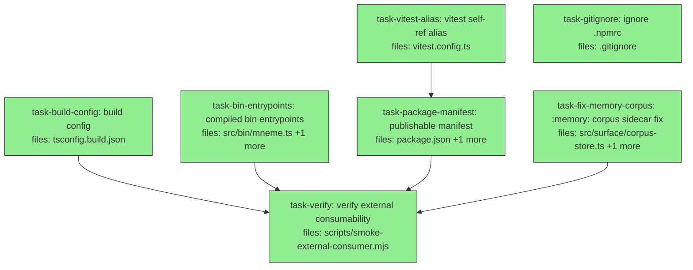

## Context

Drives spec `docs/superpowers/specs/2026-07-03-mneme-publishable-package-design.md` (brainstormed + spec-audited 2026-07-03). Goal: make mneme a built, version-pinnable, **private-npm** package `@quarry-systems/mneme` so sibling repo **ai-os** can depend on it externally (prereq for ai-os "George v2, Child 1, Slice 3 — the Mneme belief spoke").

**Key coupling (audit A4):** flipping `package.json` `exports` from `./src/*.ts` to `./dist/*.js` re-points the in-repo package self-reference `from "mneme/mcp"` (used by `integrations/openclaw/memory-mneme/{index,index.test}.ts`) to unbuilt `dist`, which would break the test suite. So `task-package-manifest` **depends on `task-vitest-alias`** — the vitest `resolve.alias` must pin `mneme/mcp` → `src/mcp/index.ts` *before* the exports flip, keeping the ~3286-test suite green at every step. No two tasks share a file; the only non-file edge is this ordering constraint.

**Proven during spec-audit (not assumed):** the build config emits all six subpaths cleanly with `types: ["node"]`; `tsc` preserves the `#!/usr/bin/env node` shebang; `@huggingface/transformers` stays out of the public type graph.

**Out of DAG scope (gated post-plan steps):** the actual `npm publish` (needs the user's `@quarry-systems` npm token — a credential no subagent holds) and the ai-os-side `.npmrc`/pin snippet (reported to the user, per spec §3.5). The DAG delivers a **publish-ready, smoke-proven** package; publishing is the terminal gated step.

## Tasks

## Task: build config for dist emit

```yaml
id: task-build-config
depends_on: []
files:
  - tsconfig.build.json
status: done
```

Add a dedicated `tsconfig.build.json` that extends the base config and emits `dist` with `.d.ts` + declaration/source maps, excluding the 123 colocated test files and swapping `vitest/globals` types for `node` (spec §3.1; audit A1 — `types: []` breaks the build because non-test `src` has ~54 bare Node-global uses).

## Implementation

```jsonc
// tsconfig.build.json
{
  "extends": "./tsconfig.json",
  "compilerOptions": {
    "noEmit": false,
    "declaration": true,
    "declarationMap": true,
    "sourceMap": true,
    "types": ["node"]        // audit A1: keep @types/node ambient, drop vitest/globals
  },
  "include": ["src/**/*.ts"],
  "exclude": ["**/*.test.ts"] // audit A3: bench/examples aren't in include; *.property.test.ts already matches
}
```

```bash
# minimum-viable check: build emits all six subpath .d.ts and leaks zero test files
npx tsc -p tsconfig.build.json
test -f dist/index.d.ts && test -f dist/surface/index.d.ts && test -f dist/mcp/index.d.ts \
  && test -f dist/cli/index.d.ts && test -f dist/audit/index.d.ts && test -f dist/audit/aws/index.d.ts
test "$(find dist -name '*.test.*' | wc -l)" -eq 0    # no test files in dist
rm -rf dist                                            # dist is gitignored; leave tree clean
```

## Acceptance criteria

- `npx tsc -p tsconfig.build.json` exits 0.
- After the build, all six exist: `dist/{index,surface/index,cli/index,mcp/index,audit/index,audit/aws/index}.d.ts` (and the matching `.js`).
- `find dist -name '*.test.*'` is empty (no colocated test files emitted).
- `dist/index.d.ts` has a matching `dist/index.d.ts.map` (declarationMap on).
- Config inherits `skipLibCheck: true`, `outDir: dist`, `rootDir: src` from the base (not re-declared).

Test file: verified via the shell block above (no vitest unit test — this is a compiler-config task; the build invocation is the test).

## Task: compiled bin entrypoints

```yaml
id: task-bin-entrypoints
depends_on: []
files:
  - src/bin/mneme.ts
  - src/bin/mneme-mcp.ts
status: done
```

Add `node`-shebang bin sources under `src/bin/` (so they compile to `dist/bin/*.js` under `rootDir: src`) that the published `package.json` `bin` will point at. The existing tsx-dev `bin/*.ts` (used by the repo `.mcp.json` and the user's global MCP config) are left untouched — these are the compiled twins (spec §3.3).

## Implementation

```typescript
// src/bin/mneme.ts — compiled entrypoint (dist/bin/mneme.js). tsx-dev twin: /bin/mneme.ts.
#!/usr/bin/env node
import { run } from "../cli/index.js";
run(process.argv.slice(2))
  .then((code) => process.exit(code))
  .catch((err) => {
    console.error(err instanceof Error ? err.message : err);
    process.exit(1);
  });
```

```typescript
// src/bin/mneme-mcp.ts — compiled entrypoint (dist/bin/mneme-mcp.js). tsx-dev twin: /bin/mneme-mcp.ts.
#!/usr/bin/env node
import { runStdio } from "../mcp/index.js";
runStdio().catch((err) => {
  console.error(err);
  process.exit(1);
});
```

```bash
# minimum-viable failing test: the new CLI entry runs and a bogus command exits nonzero
# (self-contained via tsx — resolves ../cli/index.js to src; no build needed for this check)
npx tsx src/bin/mneme.ts bogus; test $? -ne 0
```

## Acceptance criteria

- `src/bin/mneme.ts` and `src/bin/mneme-mcp.ts` exist with first line exactly `#!/usr/bin/env node`.
- They import from `../cli/index.js` and `../mcp/index.js` respectively (rootDir-relative, resolve to the pre-existing `src/cli` / `src/mcp`).
- `npx tsx src/bin/mneme.ts bogus` prints an error and exits nonzero (mirrors `bin/mneme.smoke.test.ts`).
- `npx tsx src/bin/mneme-mcp.ts` starts and prints the MCP stdio banner without throwing (kill after banner).
- The existing `bin/mneme.ts`, `bin/mneme-mcp.ts` are unchanged.

Test file: verified via the shell block above (entrypoint smoke; mirrors existing `bin/mneme.smoke.test.ts`).

## Task: vitest alias for package self-reference

```yaml
id: task-vitest-alias
depends_on: []
files:
  - vitest.config.ts
status: done
```

Pin the package self-reference `mneme/mcp` to `src/mcp/index.ts` in vitest's resolver so the openclaw integration tests keep resolving to source after `package.json` `exports` flips to `dist` (audit A4). Must land before `task-package-manifest`. Uses `fileURLToPath(new URL(...))` because `__dirname` is undefined in this ESM (`"type": "module"`) config.

## Implementation

```typescript
// vitest.config.ts
import { defineConfig } from "vitest/config";
import { fileURLToPath } from "node:url";

export default defineConfig({
  test: {
    globals: true,
    include: ["src/**/*.test.ts", "test/**/*.test.ts", "examples/**/*.test.ts", "bin/**/*.test.ts", "bench/**/*.test.ts", "integrations/**/*.test.ts"],
  },
  resolve: {
    alias: {
      // audit A4: keep the `from "mneme/mcp"` self-reference resolving to src,
      // independent of the published exports (which point at dist post-manifest).
      "mneme/mcp": fileURLToPath(new URL("./src/mcp/index.ts", import.meta.url)),
    },
  },
});
```

```bash
# minimum-viable failing test: the openclaw test that imports `from "mneme/mcp"` resolves + passes
npx vitest run integrations/openclaw/memory-mneme/index.test.ts
```

## Acceptance criteria

- `vitest.config.ts` adds a `resolve.alias` mapping the exact key `"mneme/mcp"` to the absolute path of `src/mcp/index.ts` via `fileURLToPath(new URL("./src/mcp/index.ts", import.meta.url))`.
- The `test.include` globs are unchanged.
- `npx vitest run integrations/openclaw/memory-mneme/index.test.ts` passes (it imports `from "mneme/mcp"`).
- No `__dirname` usage (would be a ReferenceError under ESM).

Test file: `integrations/openclaw/memory-mneme/index.test.ts` (existing; the alias is what keeps it resolvable once exports move to dist).

## Task: gitignore the npmrc

```yaml
id: task-gitignore
depends_on: []
files:
  - .gitignore
status: done
model_hint: cheap
review_mode: merged
```

Add `.npmrc` to `.gitignore` so a publish-time auth token (written into a local `.npmrc`) can never be committed (spec §3.8; audit A7). `dist/` and `node_modules/` are already ignored.

## Implementation

```gitignore
node_modules/
dist/
.npmrc
```

```bash
# minimum-viable failing test: a local .npmrc is ignored by git
printf '//registry.npmjs.org/:_authToken=FAKE\n' > .npmrc
git check-ignore .npmrc            # exits 0 and prints ".npmrc" when ignored
rm -f .npmrc
```

## Acceptance criteria

- `.gitignore` contains a line `.npmrc`.
- `git check-ignore .npmrc` prints `.npmrc` and exits 0.
- Existing `node_modules/` and `dist/` ignores are preserved.

Test file: verified via the `git check-ignore` block above.

## Task: publishable package manifest

```yaml
id: task-package-manifest
depends_on: [task-vitest-alias]
files:
  - package.json
  - package-lock.json
status: done
```

Turn `package.json` into a publishable manifest: scoped name/version/license/engines, `main`/`types`/`exports` pointed at `dist` (each subpath gets `types`+`import`), `@types/better-sqlite3` promoted devDeps→deps, `bin`→`dist/bin`, `files` allowlist, `repository`, `publishConfig` (private npm), and `build`/`clean`/`prepack` scripts (spec §3.2/§3.4). Depends on `task-vitest-alias` so the exports flip doesn't break the self-reference tests. Regenerate `package-lock.json` via `npm install`.

## Implementation

```jsonc
// package.json — changed/added fields (unchanged fields elided)
{
  "name": "@quarry-systems/mneme",
  "version": "0.1.0",
  "license": "UNLICENSED",
  "type": "module",
  "engines": { "node": ">=18" },
  "main": "./dist/index.js",
  "types": "./dist/index.d.ts",
  "bin": { "mneme": "./dist/bin/mneme.js", "mneme-mcp": "./dist/bin/mneme-mcp.js" },
  "files": ["dist", "src", "bin", "README.md"],
  "repository": { "type": "git", "url": "git+https://github.com/BrettNye/Mneme.git" },
  "publishConfig": { "registry": "https://registry.npmjs.org", "access": "restricted" },
  "exports": {
    ".":           { "types": "./dist/index.d.ts",           "import": "./dist/index.js" },
    "./surface":   { "types": "./dist/surface/index.d.ts",   "import": "./dist/surface/index.js" },
    "./cli":       { "types": "./dist/cli/index.d.ts",       "import": "./dist/cli/index.js" },
    "./mcp":       { "types": "./dist/mcp/index.d.ts",        "import": "./dist/mcp/index.js" },
    "./audit":     { "types": "./dist/audit/index.d.ts",      "import": "./dist/audit/index.js" },
    "./audit/aws": { "types": "./dist/audit/aws/index.d.ts",  "import": "./dist/audit/aws/index.js" }
  },
  "scripts": {
    "build": "tsc -p tsconfig.build.json",
    "clean": "node -e \"require('fs').rmSync('dist',{recursive:true,force:true})\"",
    "prepack": "npm run clean && npm run build"
    // ...existing scripts (test, typecheck, mneme, mneme-mcp, eval, pressure) preserved
  },
  "dependencies": {
    "@modelcontextprotocol/sdk": "^1.29.0",
    "better-sqlite3": "^11.0.0",
    "zod": "^3.23.0",
    "@types/better-sqlite3": "^7.6.0"   // promoted from devDependencies (audit #3)
  }
  // devDependencies: @types/better-sqlite3 removed; @huggingface/transformers, @types/node,
  // fast-check, tsx, typescript, vitest stay. peerDependencies (aws) unchanged.
}
```

```bash
# minimum-viable failing test: manifest asserts as a publishable, dist-pointed, correctly-scoped package
npm install    # regenerates package-lock.json for the dep move
node -e "const p=require('./package.json'); const a=require('node:assert'); \
  a.equal(p.name,'@quarry-systems/mneme'); a.ok(p.version); a.equal(p.license,'UNLICENSED'); \
  a.equal(p.exports['.'].types,'./dist/index.d.ts'); a.equal(p.exports['./surface'].import,'./dist/surface/index.js'); \
  a.ok(p.dependencies['@types/better-sqlite3']); a.ok(!(p.devDependencies||{})['@types/better-sqlite3']); \
  a.equal(p.bin.mneme,'./dist/bin/mneme.js'); a.equal(p.publishConfig.access,'restricted');"
```

## Acceptance criteria

- `name` is `@quarry-systems/mneme`; `version` is `0.1.0`; `license` is `UNLICENSED`; `engines.node` is `>=18`.
- `main`=`./dist/index.js`, `types`=`./dist/index.d.ts`; all six `exports` subpaths are `{types,import}` objects pointing at `dist` (`types` key first).
- `@types/better-sqlite3` is in `dependencies` and absent from `devDependencies`; `better-sqlite3`/`zod`/`@modelcontextprotocol/sdk` remain deps; `@huggingface/transformers` remains a devDep.
- `bin` points at `./dist/bin/mneme.js` and `./dist/bin/mneme-mcp.js`; `files` is `["dist","src","bin","README.md"]`; `repository` + `publishConfig{registry,access:"restricted"}` present.
- `scripts` gains `build`, `clean`, `prepack`; all pre-existing scripts preserved verbatim.
- `package-lock.json` regenerated and consistent (`npm install` clean, no errors).
- The `node -e` assertion block above exits 0.

Test file: verified via the `node -e` assertion block above (manifest is JSON config; assertion is the test).

## Task: verify external consumability

```yaml
id: task-verify
depends_on: [task-build-config, task-bin-entrypoints, task-package-manifest, task-fix-memory-corpus]
files:
  - scripts/smoke-external-consumer.mjs
status: done
spec_reviewer_hint: opus
quality_reviewer_hint: opus
```

Author and run a committed smoke harness that proves an **external** consumer can install the built package and use the exact ai-os API. Independent of publishing (uses `npm pack` + a scratch install outside the repo). Also confirms the full suite stays green and the bins run from the build (spec §3.6; acceptance gate).

## Implementation

```javascript
// scripts/smoke-external-consumer.mjs — run with: node scripts/smoke-external-consumer.mjs
// Proves @quarry-systems/mneme is externally consumable: pack -> install in a scratch dir
// OUTSIDE this repo -> tsc --noEmit (strict) -> runtime openSession->remember->recall.
import { execFileSync } from "node:child_process";
import { mkdtempSync, writeFileSync, readdirSync } from "node:fs";
import { tmpdir } from "node:os";
import { join } from "node:path";

const repo = process.cwd();
const run = (cmd, args, cwd) => execFileSync(cmd, args, { cwd, stdio: "inherit", shell: true });

run("npm", ["run", "build"], repo);
run("npm", ["pack"], repo); // -> quarry-systems-mneme-<version>.tgz in repo root
const tgz = readdirSync(repo).find((f) => f.startsWith("quarry-systems-mneme-") && f.endsWith(".tgz"));

const scratch = mkdtempSync(join(tmpdir(), "mneme-smoke-"));
writeFileSync(join(scratch, "package.json"), JSON.stringify({ name: "smoke", private: true, type: "module" }));
writeFileSync(join(scratch, "tsconfig.json"), JSON.stringify({
  compilerOptions: { module: "NodeNext", moduleResolution: "NodeNext", target: "ES2022", strict: true, noEmit: true, skipLibCheck: true },
  include: ["consumer.ts"],
}));
// consumer.ts imports the exact ai-os API. The @quarry-systems/mneme import resolves to the
// packed tarball installed below (artifact under test), not to this repo's deps.
writeFileSync(join(scratch, "consumer.ts"), [
  'import { openSession } from "@quarry-systems/mneme/surface";',
  'import type { Session } from "@quarry-systems/mneme/surface";',
  'import { remember, recall, ensureCorpus, createSqliteAdapter, createMneme } from "@quarry-systems/mneme";',
  'import type { RememberArgs, RememberResult, RecallArgs, RecallResult, RecallDeps, RecallMatch, Claim } from "@quarry-systems/mneme";',
  'void (createSqliteAdapter); void (createMneme);',
  'async function main() {',
  '  const session: Session = openSession({ dbPath: ":memory:" });',
  '  ensureCorpus(session, "smoke");',
  '  const w: RememberResult = remember(session, { corpus: "smoke", subject: "project:x", key: "status", value: "green" } as RememberArgs);',
  '  void w;',
  '  const deps: RecallDeps = { embeddings: { rankFn: undefined } } as unknown as RecallDeps;',
  '  const r: RecallResult = await recall(session, { corpus: "smoke", about: "status of project x" } as RecallArgs, deps);',
  '  const hit = (r.matches as RecallMatch[]).some((m: RecallMatch) => JSON.stringify(m).includes("green"));',
  '  if (!hit) { console.error("SMOKE FAIL: written belief not recalled", JSON.stringify(r)); process.exit(1); }',
  '  console.log("SMOKE OK: recalled the written belief");',
  '}',
  'main();',
].join("\n"));

run("npm", ["install", join(repo, tgz)], scratch); // installs @quarry-systems/mneme + better-sqlite3 (native) + types
run("npx", ["tsc", "--noEmit"], scratch);           // type-check gate: external consumer types resolve
run("npx", ["tsx", "consumer.ts"], scratch);        // runtime gate: openSession->remember->recall
console.log("external-consumer smoke PASSED");
```

```bash
# minimum-viable failing test: the smoke harness passes end-to-end
node scripts/smoke-external-consumer.mjs
```

## Acceptance criteria

- `npm run build` produces `dist` including `dist/bin/mneme.js` (shebang `#!/usr/bin/env node`) and `dist/bin/mneme-mcp.js`.
- `node scripts/smoke-external-consumer.mjs` prints `external-consumer smoke PASSED` (packs, installs the tarball in a temp dir outside the repo, `tsc --noEmit` passes, runtime prints `SMOKE OK: recalled the written belief`).
- The `consumer.ts` type-checks under strict NodeNext importing `openSession`/`Session` from `@quarry-systems/mneme/surface` and `remember`/`recall`/`ensureCorpus`/`createSqliteAdapter`/`createMneme` + `RememberArgs`/`RememberResult`/`RecallArgs`/`RecallResult`/`RecallDeps`/`RecallMatch`/`Claim` from `@quarry-systems/mneme` — with `better-sqlite3` types resolving (no "could not find a declaration file").
- The full existing suite is green: `npm test` passes (~3286 tests; the openclaw self-reference still resolves via the vitest alias).
- Running the built MCP bin loads: `node dist/bin/mneme-mcp.js` prints the stdio banner without throwing.
- The exact recall-deps shape used by `consumer.ts` is adjusted to the real `RecallDeps` signature at implementation time (read `src/surface/recall.ts`); the harness asserts a written belief is recalled, not a specific internal shape.

Test file: `scripts/smoke-external-consumer.mjs` (the harness is the test; run via the shell block above).

## Task: memory corpus sidecar fix

```yaml
id: task-fix-memory-corpus
depends_on: []
files:
  - src/surface/corpus-store.ts
  - src/surface/corpus-store.test.ts
status: done
```

Pre-existing mneme bug surfaced by the external-consumer smoke (acceptance gate requires `openSession({ dbPath: ":memory:" })`). `ensureDir` special-cases the `":memory:"` sentinel but `saveCorpora`/`loadCorpora` do not, so `ensureCorpus` on an in-memory session writes a `:memory:.corpora.json` sidecar — invalid path (ENOENT) on Windows, and a stray junk file in cwd on Linux/Mac. An in-memory DB is ephemeral, so it must not persist/read a sidecar at all.

## Implementation

```typescript
// src/surface/corpus-store.ts — no-op sidecar for the in-memory sentinel (mirror ensureDir)
export function loadCorpora(dbPath: string): CorpusDef[] {
  if (dbPath === ":memory:") return [];           // ephemeral DB: nothing persisted
  const p = sidecarFor(dbPath);
  if (!existsSync(p)) return [];
  // ...unchanged...
}

export function saveCorpora(dbPath: string, defs: CorpusDef[]): void {
  if (dbPath === ":memory:") return;              // ephemeral DB: do not write a sidecar
  const sidecar = sidecarFor(dbPath);
  // ...unchanged...
}
```

```typescript
// src/surface/corpus-store.test.ts — the in-memory sentinel must not touch the filesystem
it("saveCorpora is a no-op for :memory: (writes no sidecar, does not throw)", () => {
  expect(() => saveCorpora(":memory:", [/* a valid CorpusDef */] as any)).not.toThrow();
  expect(existsSync(":memory:.corpora.json")).toBe(false);
  expect(loadCorpora(":memory:")).toEqual([]);
});
```

## Acceptance criteria

- `saveCorpora(":memory:", defs)` returns without throwing and writes NO `:memory:.corpora.json` file.
- `loadCorpora(":memory:")` returns `[]` without touching the filesystem.
- Non-`:memory:` behavior is unchanged (existing corpus-store persistence tests still pass).
- `openSession({ dbPath: ":memory:" })` followed by `ensureCorpus(session, "x")` no longer throws (regression the smoke depends on).
- Full suite green: `npm test` passes; no stray `:memory:.corpora.json` left in the repo root after the run.

Test file: `src/surface/corpus-store.test.ts`.
