```mermaid
flowchart TD
    task-deps["task-deps: pg + testcontainers provisioning<br/>files: package.json"]
    task-pg-test-support["task-pg-test-support: shared pg container/pool fixture<br/>files: src/adapters/postgres/test-support.ts +1 more"]
    task-adapter-types["task-adapter-types: extract shared value types<br/>files: src/adapters/adapter-types.ts +2 more"]
    task-async-iface["task-async-iface: AsyncStorageAdapter interface<br/>files: src/adapters/async-adapter.ts +1 more"]
    task-contradiction-split["task-contradiction-split: split enforce into decideContradiction<br/>files: src/write/contradiction.ts +1 more"]
    task-claim-build["task-claim-build: extract pure claim/event builders<br/>files: src/write/claim-build.ts +2 more"]
    task-catalog-facade["task-catalog-facade: shared catalog/staging facade<br/>files: src/catalog/catalog-facade.ts +1 more"]
    task-pg-sql["task-pg-sql: provider-agnostic SQL builders<br/>files: src/adapters/postgres/sql.ts +1 more"]
    task-pg-schema["task-pg-schema: DDL + migration runner<br/>files: src/adapters/postgres/schema.ts +1 more"]
    task-tenant-router["task-tenant-router: TenantRouter routing seam<br/>files: src/adapters/postgres/tenant-router.ts +1 more"]
    task-pg-adapter["task-pg-adapter: createPostgresAdapter<br/>files: src/adapters/postgres/index.ts +1 more"]
    task-async-eval["task-async-eval: async evaluation stages<br/>files: src/algebra/async-expression.ts +2 more"]
    task-async-idempotency["task-async-idempotency: async idempotency helpers<br/>files: src/write/idempotency.ts +1 more"]
    task-async-promoter["task-async-promoter: AsyncPromoter write path<br/>files: src/write/async-pipeline.ts +1 more"]
    task-mneme-async["task-mneme-async: createMnemeAsync surface<br/>files: src/mneme-async.ts +1 more"]
    task-exports["task-exports: public barrel exports<br/>files: src/index.ts +1 more"]
    task-pg-conformance["task-pg-conformance: adapter conformance suite on pg<br/>files: src/adapters/adapter-contract.ts +1 more"]
    task-concurrency-tests["task-concurrency-tests: advisory-lock concurrency tests<br/>files: src/adapters/postgres/concurrency.pg.test.ts"]
    task-parity-harness["task-parity-harness: sync/async cross-backend parity<br/>files: src/adapters/postgres/parity.pg.test.ts"]

    task-adapter-types --> task-async-iface
    task-adapter-types --> task-pg-sql
    task-deps --> task-pg-test-support
    task-deps --> task-pg-schema
    task-deps --> task-tenant-router
    task-deps --> task-pg-adapter
    task-pg-schema --> task-pg-test-support
    task-pg-test-support --> task-tenant-router
    task-pg-test-support --> task-pg-adapter
    task-pg-test-support --> task-pg-conformance
    task-pg-test-support --> task-concurrency-tests
    task-pg-test-support --> task-parity-harness
    task-async-iface --> task-pg-adapter
    task-async-iface --> task-async-eval
    task-async-iface --> task-async-idempotency
    task-async-iface --> task-async-promoter
    task-async-iface --> task-mneme-async
    task-async-iface --> task-pg-conformance
    task-pg-sql --> task-pg-adapter
    task-pg-schema --> task-pg-adapter
    task-tenant-router --> task-pg-adapter
    task-tenant-router --> task-exports
    task-contradiction-split --> task-async-promoter
    task-claim-build --> task-async-promoter
    task-async-idempotency --> task-async-promoter
    task-catalog-facade --> task-mneme-async
    task-async-promoter --> task-mneme-async
    task-async-eval --> task-mneme-async
    task-pg-adapter --> task-exports
    task-pg-adapter --> task-pg-conformance
    task-pg-adapter --> task-concurrency-tests
    task-pg-adapter --> task-parity-harness
    task-mneme-async --> task-exports
    task-mneme-async --> task-parity-harness
    task-mneme-async --> task-concurrency-tests

    classDef done fill:#90ee90,stroke:#333
    classDef ready fill:#fffacd,stroke:#333
    classDef running fill:#87ceeb,stroke:#333
    classDef failed fill:#ffb6c1,stroke:#333
    classDef skipped fill:#d3d3d3,stroke:#333,stroke-dasharray: 5 5
```

## Context

Driven by `docs/superpowers/specs/2026-07-05-postgres-async-adapter-design.md` (post-audit,
commit b0299aa). One deliverable: a parallel **async** storage surface (Postgres) beside the
untouched **sync** SQLite surface. The algebra is pure/in-memory, so async is confined to the
I/O seams; pure logic is shared. Binding audit amendments (spec §"Audit amendments" A1–A15)
are inlined into the tasks below.

Key code facts (verified):
- Sync `StorageAdapter` at `src/adapters/adapter.ts:67-88` (16 members, 12 required). Shared value
  types + `valuePredicateLevel` helper live at `adapter.ts:4-94`; `Claim`/`ClaimId` come from `core/`.
- `enforce()` at `src/write/contradiction.ts:41-74` = `findValidatedConflict` (adapter.query) →
  policy switch → `ContradictionOutcome { decision, deprecateIds?, markArtifact?, conflictId? }`.
- `Promoter.write<T>` at `src/write/pipeline.ts:66-88`; `contradictionArtifact` at `:96-126`; inline
  claim/event construction in `commit`/`supersede`/`promote` (`:128-337`).
- **A1 seam set is FOUR**: `leaf` (`expression.ts:37` adapter.query) + **`gammaStage`
  (`expression.ts:53-55` adapter.getClaim)** + `override`/`join` (transitive — they re-`evaluate` a
  sub-pipeline). `sigma` reads `adapter.capabilities()` (sync — fine).
- `createMneme` at `src/mneme.ts:281-456`; catalog/staging methods (`createCorpus`, `deleteCorpus`,
  `listCorpora`, `emitCandidate`, `promoteStaged`, `promoteAllStaged`, `listStaged`, `discardStaged`)
  are backend-agnostic; `replay`/`derive` are NOT in the async surface v1 (A11).
- Idempotency helpers `src/write/idempotency.ts`: `idempotencyScope` (pure), `checkIdempotent`,
  `recordIdempotent`. `src/index.ts` is the public barrel (`createMneme`, `createSqliteAdapter`, …).
- `pg`, `@types/pg`, `testcontainers` are ABSENT from package.json (task-deps provisions them; `pg` as an
  OPTIONAL peerDependency mirroring the existing `aws-sdk` optional-peer entry — SQLite-only consumers stay
  pg-free). No `pg-mem` — SQL-builder tests use pure string assertions.

Binding correctness invariants (fold into the named tasks):
- **A6** advisory lock `pg_advisory_xact_lock(hashtextextended($corpusId,0))` is the FIRST statement
  after BEGIN; READ COMMITTED is sufficient (xact lock releases at COMMIT).
- **A7** `maxRecordedSeq` is corpus-scoped; `recordedSeq` monotonic per corpus; no Postgres SEQUENCE.
- **A3** `*_json` stored as `text` (jsonb does not round-trip); **A4** `id TEXT COLLATE "C"` and
  `ORDER BY recorded_seq ASC, id COLLATE "C" ASC`.
- **A5** idempotency check moves INSIDE the tx (after the lock) + `INSERT … ON CONFLICT DO NOTHING`.
- **A2** schema-per-tenant uses validated schema-qualified identifiers (never `SET search_path` on a
  pooled client); unknown/invalid tenant throws.
- **A8** transaction client threaded via `AsyncLocalStorage` with mandatory `try/catch(ROLLBACK)/
  finally(release)`, poisoned-client `release(err)`, reentrant-join, `getStore() ?? pool` for
  autocommit reads.

Worktree/concurrency: create the worktree from local HEAD (main may be ahead of origin). Implementers
commit via pathspec (`git commit -m "<msg>" -- <task files>`; explicit `git add <path>` for new files;
never `git add -A`). `task-deps` runs `npm install` (rewrites node_modules) → `single_threaded: true`.
Docker-requiring tests use the `*.pg.test.ts` suffix (files: `test-support.pg.test.ts`, `schema.pg.test.ts`,
`tenant-router.pg.test.ts`, `index.pg.test.ts`, `conformance.pg.test.ts`, `concurrency.pg.test.ts`,
`parity.pg.test.ts`) and run only under `test:pg`; every other `*.test.ts` (incl. `sql.test.ts`) runs in the
zero-Docker default suite.

Plan-audit notes (binding):
- `pg` is provisioned by `task-deps`; every task importing `pg` (Pool/PoolClient) or the testcontainers
  fixture declares `depends_on: [task-deps]` (directly or transitively) so H8 external-import resolution
  holds once that task lands.
- The Postgres adapter authors its OWN `toRow`/`fromRow`/`canonicalEvent` (SQLite's are module-private,
  `sqlite.ts:82,113,304`); they are not shared. Because a corpus lives in ONE backend, per-backend
  hash chains need not byte-match — but `task-parity-harness` asserts cross-backend `entryHash` equality
  anyway (identical `canonicalEvent` field order) as the drift guard, and `task-pg-sql` owns no row mapping.
- Pure operators are reused as the math CORES (`sigmaOp`/`tauNowOp`/`deltaOp`/`rhoOp`/`kappaOp`/aggregation
  ops), NOT the sync `Stage` builders in `mneme.ts` (those close over the sync `EvalContext`); `task-async-eval`
  provides async `Stage` builders that re-thread `AsyncEvalContext` around the same cores (A12).

## Tasks

## Task: pg + testcontainers provisioning

```yaml
id: task-deps
depends_on: []
files:
  - package.json
status: pending
single_threaded: true
is_wiring_task: true
```

Provision Postgres tooling in `package.json` and a `test:pg` script that runs the Docker-gated
testcontainers suites separately from the zero-Docker default `npm test`. `pg` is an **optional
`peerDependency`** (`peerDependenciesMeta.pg.optional = true`), mirroring the existing `aws-sdk` optional-peer
pattern and the 3-dep-core intent — SQLite-only consumers (MCP server, SDK, bench) must not be forced to
install it. `@types/pg` + `testcontainers` are `devDependencies` (pg-mem is NOT needed — the SQL-builder
tests use pure string assertions). Docker-requiring test files use the `*.pg.test.ts` suffix so the default
glob excludes them by name. Runs `npm install`, so it holds the tick alone.

## Acceptance criteria

- `pg` is declared under `peerDependencies` with `peerDependenciesMeta.pg.optional = true`; `@types/pg` and `testcontainers` are `devDependencies`; no `pg-mem`.
- A `test:pg` script runs exactly the Docker suites via the `**/*.pg.test.ts` glob; the default `test` script excludes `*.pg.test.ts` (so pure unit tests, incl. `sql.test.ts`, stay in the default run).
- `npm install` completes; `npm run build` (tsc) passes with the new types resolvable.
- `npm test` (default) stays green with zero Docker required.

Test file: `package.json` (verified via `npm run build` + `npm test` staying green; no unit test file).

## Task: shared pg container/pool fixture

```yaml
id: task-pg-test-support
depends_on: [task-deps, task-pg-schema]
files:
  - src/adapters/postgres/test-support.ts
  - src/adapters/postgres/test-support.pg.test.ts
status: pending
```

The single owner of the Postgres test fixture that every testcontainers suite imports — a `withPostgres`
helper that boots one container, applies the migrations, hands out a fresh scoped pool/client, and provides
the sample-claim factory. Hoisting it here (rather than re-bootstrapping a container in each of the six
Postgres test files) is the DRY fix for the shared-fixture smell (plan-quality S7).

## Implementation

```typescript
// src/adapters/postgres/test-support.ts  (NEW — sole owner of pg test bootstrap)
import { PostgreSqlContainer, type StartedPostgreSqlContainer } from "testcontainers";
import { Pool } from "pg";
import { migrate, MIGRATIONS } from "./schema.js";

/** Low-level primitive the suites consume directly: a migrated pool + explicit teardown handle. */
export async function startPg(): Promise<{ pool: Pool; stop: () => Promise<void> }> {
  const container = await new PostgreSqlContainer("postgres:16").start();
  const pool = new Pool({ connectionString: container.getConnectionUri() });
  const c = await pool.connect(); try { await migrate(c, "", MIGRATIONS); } finally { c.release(); }
  return { pool, stop: async () => { await pool.end(); await container.stop(); } };
}
/** Callback sugar over startPg() for the simple suites. */
export async function withPostgres(fn: (pool: Pool) => Promise<void>): Promise<void> {
  const { pool, stop } = await startPg(); try { await fn(pool); } finally { await stop(); }
}
/** Deterministic sample claim for round-trip / chain assertions. */
export function sampleClaim(over: Partial<Claim> = {}): Claim { /* … minimal valid Claim … */ }
```

```typescript
// src/adapters/postgres/test-support.pg.test.ts
it("startPg yields a queryable, migrated pool", async () => {
  const { pool, stop } = await startPg();
  try { const { rows } = await pool.query("SELECT to_regclass('claims') AS t"); expect(rows[0].t).toBe("claims"); }
  finally { await stop(); }
});
```

## Acceptance criteria

- `startPg()` boots exactly one container, applies `MIGRATIONS` to the public schema, and returns `{ pool, stop }`; `withPostgres(fn)` is callback sugar over it; both always tear down in a `finally`.
- `sampleClaim(over?)` returns a minimal valid `Claim` with overridable fields, used across the pg suites.
- The self-test confirms the `claims` table exists after `startPg` (migrations ran).
- Runs under `test:pg` (Docker required).

Test file: `src/adapters/postgres/test-support.pg.test.ts`.

## Task: extract shared adapter value types

```yaml
id: task-adapter-types
depends_on: []
files:
  - src/adapters/adapter-types.ts
  - src/adapters/adapter.ts
  - src/adapters/adapter.test.ts
status: pending
```

Move the backend-agnostic value types (`ClaimEvent`, `ExecutionPlan`, `AdapterCapabilities`,
`IdempotencyRecord`, `AnchoredRootRow`, `AdapterScope`, `PredicateKind`, `ValuePredicateLevel`) and the
`valuePredicateLevel` helper out of `adapter.ts` into a neutral `adapter-types.ts`, so the sync and
async adapter contracts share one definition and cannot drift (spec §1, A15). `adapter.ts` re-exports
them for byte-compatibility with existing importers (`sqlite.ts`, `pipeline.ts`, `mneme.ts`, etc.).

## Implementation

```typescript
// src/adapters/adapter-types.ts  (NEW — moved verbatim from adapter.ts)
export interface AdapterScope { corpus: string; profile?: string; }
export interface ClaimEvent { op: "commit" | "supersede" | "promote"; corpusId: string; /* … */ }
export interface ExecutionPlan { corpusId: string; subject?: string; /* … */ }
export type PredicateKind = "equality" | "range" | "set_membership" | "regex" | "structural_pattern" | "null_check";
export type ValuePredicateLevel = "native_indexed" | "native_unindexed" | "fallback_in_memory" | "unsupported";
export interface AdapterCapabilities { valuePredicateSupport: Record<PredicateKind, ValuePredicateLevel>; }
export interface IdempotencyRecord { result: string; createdAt: number; }
export interface AnchoredRootRow { corpusId: string; epochId: string; root: string; signature: string | null; guarantee: string; at: number; }
export const valuePredicateLevel = (c: AdapterCapabilities, k: PredicateKind): ValuePredicateLevel =>
  c.valuePredicateSupport[k];
```

```typescript
// src/adapters/adapter.ts  (MOD — StorageAdapter stays; types now re-exported)
export type { ClaimEvent, ExecutionPlan, AdapterCapabilities, IdempotencyRecord,
  AnchoredRootRow, AdapterScope, PredicateKind, ValuePredicateLevel } from "./adapter-types.js";
export { valuePredicateLevel } from "./adapter-types.js";
// StorageAdapter interface unchanged, now importing the moved types.
```

```typescript
// src/adapters/adapter.test.ts (add)
import { valuePredicateLevel } from "./adapter.js";       // still resolves via re-export
import type { ExecutionPlan } from "./adapter-types.js";  // resolves at the new home
it("re-exports valuePredicateLevel byte-compatibly", () => {
  expect(valuePredicateLevel({ valuePredicateSupport: { equality: "unsupported" } as any }, "equality"))
    .toBe("unsupported");
});
```

## Acceptance criteria

- All 8 value types + `valuePredicateLevel` are defined in `adapter-types.ts`; `adapter.ts` defines none of them directly but re-exports all 8 types and the helper.
- `import { valuePredicateLevel } from "./adapter.js"` and `import type { ExecutionPlan } from "./adapter.js"` both still resolve (existing importers unbroken).
- `npm run build` passes; the full existing test suite stays green (no behavior change).

Test file: `src/adapters/adapter.test.ts`.

## Task: AsyncStorageAdapter interface

```yaml
id: task-async-iface
depends_on: [task-adapter-types]
files:
  - src/adapters/async-adapter.ts
  - src/adapters/async-adapter.test.ts
status: pending
```

Define the async twin of `StorageAdapter`: every storage method returns a `Promise`; `capabilities()`
stays synchronous (static metadata); `transaction` takes an explicit `corpusId` + async body; and
`maxRecordedSeq` takes a `corpusId` (corpus-scoped — A7). Imports the shared value types from
`adapter-types.ts` (spec §1).

## Implementation

```typescript
// src/adapters/async-adapter.ts  (NEW)
import type { Claim } from "../core/claim.js";
import type { ClaimId } from "../core/ids.js";
import type { ExecutionPlan, AdapterCapabilities, IdempotencyRecord, ClaimEvent,
  AnchoredRootRow, AdapterScope } from "./adapter-types.js";

export interface AsyncStorageAdapter {
  insertClaim(claim: Claim): Promise<void>;
  getClaim(id: ClaimId): Promise<Claim | undefined>;
  deleteClaim(id: ClaimId): Promise<void>;
  insertBatch(claims: Claim[]): Promise<void>;
  query(plan: ExecutionPlan): Promise<Claim[]>;
  getIdempotencyRecord(scope: string, key: string): Promise<IdempotencyRecord | undefined>;
  putIdempotencyRecord(scope: string, key: string, rec: IdempotencyRecord): Promise<void>;
  capabilities(): AdapterCapabilities;                          // sync
  transaction<T>(corpusId: string, fn: () => Promise<T>): Promise<T>;  // corpusId explicit (A6/A8)
  maxRecordedSeq(corpusId: string): Promise<number>;            // corpus-scoped (A7)
  appendEvent(e: ClaimEvent): Promise<void>;
  readEvents(filter?: { corpusId?: string; claimId?: string; since?: number }): Promise<ClaimEvent[]>;
  putAnchoredRoot?(row: AnchoredRootRow): Promise<void>;
  getAnchoredRoots?(corpusId: string, range?: { epochId?: string; since?: number }): Promise<AnchoredRootRow[]>;
  scoped?(scope: AdapterScope): AsyncStorageAdapter;
  close?(): Promise<void>;
}
```

```typescript
// src/adapters/async-adapter.test.ts
import type { AsyncStorageAdapter } from "./async-adapter.js";
it("a Promise-returning object structurally satisfies AsyncStorageAdapter", () => {
  const stub = { transaction: async (_c: string, f: () => Promise<unknown>) => f() } as Partial<AsyncStorageAdapter>;
  expect(typeof stub.transaction).toBe("function");
});
```

## Acceptance criteria

- `AsyncStorageAdapter` declares all 12 required methods as `Promise`-returning, with `capabilities()` synchronous, `transaction(corpusId, fn)` and `maxRecordedSeq(corpusId)` carrying an explicit `corpusId`, and `putAnchoredRoot?`/`getAnchoredRoots?`/`scoped?`/`close?` optional — a member-for-member async mirror of `StorageAdapter`.
- The interface imports its value types from `adapter-types.ts` (not re-declared).
- `npm run build` typechecks the interface.

Test file: `src/adapters/async-adapter.test.ts`.

## Task: split enforce into a pure decideContradiction

```yaml
id: task-contradiction-split
depends_on: []
files:
  - src/write/contradiction.ts
  - src/write/contradiction.test.ts
status: pending
```

Refactor `enforce()` so the policy decision is a pure function `decideContradiction(candidate, existing,
policy, corpusId)` that both the sync `Promoter` (via the thin `enforce` = query → decide) and the async
`AsyncPromoter` can call (spec §2, A9). Behavior of `enforce()` is unchanged — its existing tests are the
regression guard.

## Implementation

```typescript
// src/write/contradiction.ts  (MOD)
export interface ContradictionOutcome {
  decision: "accept" | "reject";
  deprecateIds?: string[];
  markArtifact?: boolean;
  conflictId?: string;
}

/** PURE: decide accept/reject/mark from the already-loaded validated group. No I/O.
 *  Includes the valueHash-inequality filter and corpus-mismatch guard formerly inside
 *  findValidatedConflict. */
export function decideContradiction(
  candidate: Claim, existing: Claim[], policy: ContradictionPolicy, corpusId: string,
): ContradictionOutcome { /* policy switch lifted verbatim from enforce() */ }

/** enforce = I/O (adapter.query for the validated (corpus,subject,key,scope) group) → decide. */
export function enforce(candidate: Claim, policy: ContradictionPolicy, adapter: StorageAdapter, corpusId: string): ContradictionOutcome {
  const existing = adapter.query({ corpusId, subject: candidate.subject, key: candidate.key, status: ["validated"], scopeHash: candidate.scopeHash });
  return decideContradiction(candidate, existing, policy, corpusId);
}
```

```typescript
// src/write/contradiction.test.ts (add — pure-decision golden case)
it("decideContradiction: reject_incoming keeps the existing validated conflict", () => {
  const out = decideContradiction(candidateB, [validatedA], { kind: "reject_incoming" }, "c1");
  expect(out.decision).toBe("reject");
});
```

## Acceptance criteria

- `decideContradiction` is exported, pure (no `adapter` parameter, no I/O), and reproduces the exact `ContradictionOutcome` `enforce()` produced for each policy kind (golden cases lifted from the existing contradiction tests, incl. the `valueHash !== candidate.valueHash` conflict filter and corpus-mismatch guard).
- `enforce()` retains its signature and behavior (query → `decideContradiction`); all existing `contradiction.test.ts` and `pipeline.test.ts` cases stay green.
- `npm run build` passes.

Test file: `src/write/contradiction.test.ts`.

## Task: extract pure claim/event builders

```yaml
id: task-claim-build
depends_on: []
files:
  - src/write/claim-build.ts
  - src/write/pipeline.ts
  - src/write/claim-build.test.ts
status: pending
```

Lift the inline claim/event construction and the `contradictionArtifact` out of `Promoter` into pure
builders in `claim-build.ts`, and rewire the sync `Promoter` to call them — so the async write path shares
identical construction (spec §2, A9). Also give `Promoter` an additive, defaulted `clock: () => number =
Date.now` constructor param (A13) so both promoters are deterministic under test. Sync behavior is unchanged
(default `clock` = `Date.now`); `pipeline.test.ts` is the guard.

## Implementation

```typescript
// src/write/claim-build.ts  (NEW — pure)
export function buildCommittedClaim(candidateForEnforce: Claim, recorded: number, seq: number): Claim {
  return { ...candidateForEnforce, recorded, recordedSeq: seq };
}
export function contradictionArtifact(accepted: Claim, conflictId: string, recorded: number, seq: number): Claim { /* moved verbatim from Promoter */ }
export function buildCommitEvent(corpusId: string, writer: string, claimId: string, recorded: number, seq: number): ClaimEvent { /* … */ }
export function buildSupersedeEvent(corpusId: string, writer: string, claimId: string, deprecatedId: string, recorded: number, seq: number): ClaimEvent { /* … */ }
export function buildPromoteEvent(corpusId: string, writer: string, claimId: string, toStatus: string, reason: string | undefined, recorded: number, seq: number): ClaimEvent { /* … */ }
```

```typescript
// src/write/pipeline.ts  (MOD — Promoter uses the shared builders instead of inline literals)
import { buildCommittedClaim, contradictionArtifact, buildCommitEvent } from "./claim-build.js";
// commit() accept path: const claim = buildCommittedClaim(candidateForEnforce, recorded, seq);
//                        const event = buildCommitEvent(this.corpusId, opts.writer, claim.id, recorded, seq);
```

```typescript
// src/write/claim-build.test.ts
it("contradictionArtifact carries the conflicting pair and validated status", () => {
  const art = contradictionArtifact(accepted, "conflict-id", 100, 7);
  expect(art.value).toEqual({ leftId: accepted.id, rightId: "conflict-id" });
  expect(art.status).toBe("validated");
});
```

## Acceptance criteria

- `claim-build.ts` exports `buildCommittedClaim`, `contradictionArtifact`, `buildCommitEvent`, `buildSupersedeEvent`, `buildPromoteEvent`, all pure (object-literal constructors, no adapter/I/O).
- The sync `Promoter` (`commit`/`supersede`/`promote`) constructs its claim/event/artifact via these builders — no remaining inline duplicate of the moved shapes.
- `Promoter`'s constructor gains a defaulted `clock: () => number = Date.now`; `recorded` timestamps read from it. Existing callers (which omit it) are unaffected.
- All existing `pipeline.test.ts` cases stay green (identical committed-claim and event shapes); `npm run build` passes.

Test file: `src/write/claim-build.test.ts`.

## Task: shared catalog/staging facade

```yaml
id: task-catalog-facade
depends_on: []
files:
  - src/catalog/catalog-facade.ts
  - src/catalog/catalog-facade.test.ts
status: pending
```

Provide `createCatalogFacade(catalog, staging)` — the backend-agnostic corpus-catalog + staging methods —
as a shared module `createMnemeAsync` spreads, so the async surface doesn't re-inline them (spec §8, A10).
Placed under `src/catalog/` per repo convention (only `mneme.ts`/`index.ts` live at `src/` root). The sync
`createMneme` is left BYTE-UNCHANGED this round (it keeps its ~6 inline catalog delegations — a deliberately
accepted micro-duplication to honor decision 2's "sync path untouched"; a later cleanup can spread the facade
into `createMneme` too).

## Implementation

```typescript
// src/catalog/catalog-facade.ts  (NEW)
export function createCatalogFacade(catalog: Catalog, staging: StagingBuffer) {
  return {
    createCorpus: (c: CorpusDef) => catalog.createCorpus(c),
    deleteCorpus: (id: string) => catalog.deleteCorpus(id),
    listCorpora: (f?: (c: CorpusDef) => boolean) => catalog.listCorpora(f),
    emitCandidate: (id: string, cand: CandidateClaim, opts?: { idempotencyKey?: string }) => { catalog.getCorpus(id); return { stagingId: staging.emit(id, cand, opts?.idempotencyKey) }; },
    listStaged: (id?: string) => staging.list(id),
    discardStaged: (id: string) => staging.discard(id),
    // takeStaged/takeAllStaged exposed for the surface-specific promote glue
  };
}
```

```typescript
// src/catalog/catalog-facade.test.ts
it("emitCandidate throws for an unknown corpus and stages for a known one", () => {
  const f = createCatalogFacade(catalog, staging);
  f.createCorpus(demoCorpus);
  expect(() => f.emitCandidate("nope", cand)).toThrow();
  expect(f.emitCandidate(demoCorpus.id, cand).stagingId).toBeTruthy();
});
```

## Acceptance criteria

- `createCatalogFacade` returns the catalog+staging methods (`createCorpus`, `deleteCorpus`, `listCorpora`, `emitCandidate`, `listStaged`, `discardStaged`, and the staged-take accessors the promote glue needs), each delegating to `Catalog`/`StagingBuffer` with the same existence-check behavior as `createMneme` today.
- `src/mneme.ts` is NOT modified (sync `createMneme` unchanged); the module lives at `src/catalog/catalog-facade.ts`.
- `npm run build` passes and the new unit test is green.

Test file: `src/catalog/catalog-facade.test.ts`.

## Task: provider-agnostic SQL builders

```yaml
id: task-pg-sql
depends_on: [task-adapter-types]
files:
  - src/adapters/postgres/sql.ts
  - src/adapters/postgres/sql.test.ts
status: pending
```

Pure SQL-string builders (no DB handle) that mirror SQLite's `executeQuery`/insert/event/anchor/idempotency
statements with Postgres syntax: `$n` params, a `schemaPrefix` prepended to table identifiers, an optional
`tenantPredicate` appended to WHERE, `ORDER BY recorded_seq ASC, id COLLATE "C" ASC` (A4), and `ON CONFLICT`
upserts (A5/A14). Tested with pure string assertions — no DB, runs in the default suite (spec §6).

## Implementation

```typescript
// src/adapters/postgres/sql.ts  (NEW)
export interface SqlText { text: string; params: unknown[]; }
export function buildQuery(prefix: string, plan: ExecutionPlan, force?: AdapterScope,
  tenantPredicate?: { sql: string; params: unknown[] }): SqlText {
  // forced corpus_id first, then plan predicates; conditions.push("corpus_id = $"+n) …
  // ORDER BY recorded_seq ASC, id COLLATE "C" ASC
}
export function insertClaimSql(prefix: string): string { /* INSERT … ON CONFLICT (id) DO UPDATE */ }
export function appendEventSql(prefix: string): string; // + headHashSql(prefix)
export function putIdempotencySql(prefix: string): string; // ON CONFLICT (scope,key) DO NOTHING (A5)
export function putAnchorSql(prefix: string): string;      // ON CONFLICT (corpus_id,epoch_id) DO UPDATE
```

```typescript
// src/adapters/postgres/sql.test.ts  (pure string assertions — no DB, runs in the default suite)
it("buildQuery forces corpus_id first and orders by id COLLATE \"C\"", () => {
  const { text, params } = buildQuery("", { corpusId: "c1", subject: "s" });
  expect(text).toMatch(/corpus_id = \$1[\s\S]*subject = \$2/);
  expect(text).toMatch(/order by recorded_seq asc, id collate "C" asc/i);
  expect(params).toEqual(["c1", "s"]);
});
```

## Acceptance criteria

- `buildQuery` emits parameterized SQL with the forced `corpus_id` predicate first, plan predicates (`subject`/`key`/`scopeHash`/`recordedAtMost`/`status IN`/`runIds IN`) next, the optional `tenantPredicate` appended, and `ORDER BY recorded_seq ASC, id COLLATE "C" ASC`.
- `schemaPrefix` (e.g. `"tenant_a."` or `""`) is prepended to every table identifier.
- Idempotency insert uses `ON CONFLICT (scope,key) DO NOTHING`; anchor/claim upserts use `ON CONFLICT … DO UPDATE` on the stated conflict targets.
- Pure-string tests (no DB, default suite) cover the WHERE ordering and param binding; `npm run build` passes.

Test file: `src/adapters/postgres/sql.test.ts`.

## Task: Postgres DDL + migration runner

```yaml
id: task-pg-schema
depends_on: [task-deps]
files:
  - src/adapters/postgres/schema.ts
  - src/adapters/postgres/schema.pg.test.ts
status: pending
model_hint: opus
```

The versioned DDL (tables mirroring SQLite with `*_json` as `text`, numerics `double precision`,
`recorded_seq bigint`, `seq_pk BIGSERIAL`, `id TEXT COLLATE "C"`, indexes incl. `(corpus_id,subject,key,
scope_hash)` and `(corpus_id,seq_pk)`) and a `migrate(client, schemaPrefix, migrations)` runner that takes a
fixed-key **session** advisory lock so concurrent booting instances serialize DDL, tracked in
`mneme_migrations(version int primary key, applied_at)` (spec §6/§7, A3/A4/A14). Testcontainers-backed —
this task's test boots its OWN raw container (it must NOT use `task-pg-test-support`'s `withPostgres`, which
itself calls `migrate`; that is the fixture this task validates).

## Implementation

```typescript
// src/adapters/postgres/schema.ts  (NEW)
export interface Migration { version: number; up: (prefix: string) => string; }
export const MIGRATIONS: Migration[] = [{ version: 1, up: (p) => `
  CREATE TABLE IF NOT EXISTS ${p}claims (
    id text COLLATE "C" PRIMARY KEY, corpus_id text, subject text, key text, scope_hash text,
    value_json text, value_hash text, /* … */ recorded double precision, recorded_seq bigint );
  CREATE INDEX IF NOT EXISTS idx_claims_corpus_identity ON ${p}claims(corpus_id, subject, key, scope_hash);
  CREATE TABLE IF NOT EXISTS ${p}claim_events ( seq_pk BIGSERIAL PRIMARY KEY, corpus_id text, /* … */ );
  CREATE INDEX IF NOT EXISTS idx_events_corpus_seq ON ${p}claim_events(corpus_id, seq_pk); /* + idempotency, audit_anchors */`}];

const MIGRATION_LOCK_KEY = 0x6d6e656d; // fixed
export async function migrate(client: PoolClient, schemaPrefix: string, migrations = MIGRATIONS): Promise<void> {
  await client.query("SELECT pg_advisory_lock($1)", [MIGRATION_LOCK_KEY]);
  try { /* ensure mneme_migrations; apply un-applied versions in order */ }
  finally { await client.query("SELECT pg_advisory_unlock($1)", [MIGRATION_LOCK_KEY]); }
}
```

```typescript
// src/adapters/postgres/schema.pg.test.ts  (testcontainers — boots its OWN raw container, not startPg)
it("migrate is idempotent across two concurrent runners", async () => {
  await Promise.all([migrate(c1, ""), migrate(c2, "")]);
  const { rows } = await c1.query("SELECT count(*) FROM mneme_migrations");
  expect(Number(rows[0].count)).toBe(MIGRATIONS.length);   // no double-apply
});
```

## Acceptance criteria

- DDL creates `claims`/`idempotency`/`claim_events`/`audit_anchors` with `*_json` as `text`, `id TEXT COLLATE "C"`, `recorded_seq bigint`, `seq_pk BIGSERIAL`, and the `(corpus_id,subject,key,scope_hash)` + `(corpus_id,seq_pk)` indexes.
- `migrate` takes the session advisory lock before applying, records applied versions in `mneme_migrations`, and applying twice (or two concurrent runners) yields exactly `MIGRATIONS.length` rows with no error.
- Runs against a real Postgres (testcontainers) under `test:pg`.

Test file: `src/adapters/postgres/schema.pg.test.ts`.

## Task: TenantRouter routing seam

```yaml
id: task-tenant-router
depends_on: [task-deps, task-pg-test-support]
files:
  - src/adapters/postgres/tenant-router.ts
  - src/adapters/postgres/tenant-router.pg.test.ts
status: pending
```

The routing seam: `resolve(tenantId)` returns a `ResolvedConnection { connect(), schemaPrefix,
tenantPredicate? }` for `rowLevelRouter` (empty prefix + `tenant_id = $` predicate), `schemaPerTenantRouter`
(validated schema-qualified prefix from a whitelist map — never `SET search_path`, A2), and
`dbPerTenantRouter` (per-tenant pool, empty prefix). Unknown/invalid tenant throws. Routing only — migration
is `schema.ts`'s concern (A13). Testcontainers-backed for the isolation proof.

## Implementation

```typescript
// src/adapters/postgres/tenant-router.ts  (NEW)
export interface ResolvedConnection { connect(): Promise<PoolClient>; schemaPrefix: string; tenantPredicate?: { sql: string; params: unknown[] }; }
export interface TenantRouter { resolve(tenantId: string): ResolvedConnection; closeAll(): Promise<void>; }

export function rowLevelRouter(pool: Pool): TenantRouter { /* prefix ""; tenantPredicate = { sql: "tenant_id = $", params:[tenantId] } */ }
export function schemaPerTenantRouter(pool: Pool, schemaFor: (t: string) => string): TenantRouter {
  return { resolve(t) { const schema = schemaFor(t); if (!/^[a-z_][a-z0-9_]*$/.test(schema)) throw new Error(`invalid schema for tenant ${t}`);
    return { connect: () => pool.connect(), schemaPrefix: `${schema}.` }; }, closeAll: () => pool.end() };
}
export function dbPerTenantRouter(poolFor: (t: string) => Pool): TenantRouter { /* per-tenant pool; prefix "" */ }
```

```typescript
// src/adapters/postgres/tenant-router.pg.test.ts  (testcontainers)
it("schemaPerTenant rejects an unmapped/invalid tenant and yields a validated prefix", async () => {
  const r = schemaPerTenantRouter(pool, (t) => ({ acme: "tenant_acme" }[t] ?? ""));
  expect(() => r.resolve("intruder")).toThrow();
  expect(r.resolve("acme").schemaPrefix).toBe("tenant_acme.");
});
```

## Acceptance criteria

- `rowLevelRouter` yields `schemaPrefix === ""` and a `tenantPredicate` binding `tenant_id`; `schemaPerTenantRouter` yields a validated `"<schema>."` prefix and throws on an unmapped/invalid tenant name (no raw-`tenantId` interpolation, no `SET search_path`); `dbPerTenantRouter` routes to the tenant's pool with an empty prefix.
- Row-level isolation is proven end-to-end: a testcontainers test writing as tenant A reads nothing as tenant B through the injected `tenantPredicate`.
- Schema-per-tenant and db-per-tenant are asserted at the ROUTING level only (validated prefix / correct pool selection + throw-on-unknown); their end-to-end write/read isolation proof lands with the deferred multi-tenant migration slice (spec slice 4), since it needs `CREATE SCHEMA`/second-DB provisioning not budgeted here.
- `resolve` on an unknown tenant throws; `closeAll` releases pools.

Test file: `src/adapters/postgres/tenant-router.pg.test.ts`.

## Task: createPostgresAdapter

```yaml
id: task-pg-adapter
depends_on: [task-deps, task-pg-test-support, task-async-iface, task-pg-sql, task-pg-schema, task-tenant-router]
files:
  - src/adapters/postgres/index.ts
  - src/adapters/postgres/index.pg.test.ts
status: pending
model_hint: opus
quality_reviewer_hint: opus
```

`createPostgresAdapter({ router, tenantId })` implements `AsyncStorageAdapter` over the SQL builders,
schema, and router. The load-bearing piece is `transaction(corpusId, fn)`: check out ONE client, `BEGIN`,
take `pg_advisory_xact_lock(hashtextextended($corpusId,0))` as the FIRST statement (A6), run the body with
that client carried through `AsyncLocalStorage` (A8), `COMMIT`, and always `release` in `finally` (destroy
poisoned clients). `maxRecordedSeq(corpusId)` is corpus-scoped (A7). READ COMMITTED (spec §4). Authors its
OWN `toRow`/`fromRow`/`canonicalEvent` (SQLite's are module-private, not shared; `canonicalEvent` field
order must match SQLite's — guarded by the parity harness entryHash assertion) and sets `lock_timeout` +
`statement_timeout` defaults per connection (A14) so a wedged lock surfaces as a retryable error; TLS is the
caller's `Pool` responsibility.

## Implementation

```typescript
// src/adapters/postgres/index.ts  (NEW)
import { AsyncLocalStorage } from "node:async_hooks";
const txClient = new AsyncLocalStorage<PoolClient>();

export function createPostgresAdapter(opts: { router: TenantRouter; tenantId: string }): AsyncStorageAdapter {
  const rc = opts.router.resolve(opts.tenantId);           // throws on invalid tenant
  const run = () => txClient.getStore();                    // in-tx client or undefined
  async function withConn<T>(f: (c: PoolClient) => Promise<T>): Promise<T> {
    const existing = run(); if (existing) return f(existing);           // autocommit reads reuse tx client
    const c = await rc.connect(); try { return await f(c); } finally { c.release(); }
  }
  return {
    capabilities: () => ({ valuePredicateSupport: { equality: "fallback_in_memory", /* … all fallback */ } }),
    async transaction(corpusId, fn) {
      if (run()) return fn();                                // reentrant-join, no second client
      const c = await rc.connect();
      try {
        await c.query("BEGIN");
        await c.query("SELECT pg_advisory_xact_lock(hashtextextended($1,0))", [corpusId]); // FIRST (A6)
        const r = await txClient.run(c, fn);
        await c.query("COMMIT"); return r;
      } catch (e) { try { await c.query("ROLLBACK"); c.release(); } catch { c.release(e as Error); } throw e; }
      finally { /* released above on both paths */ }
    },
    async maxRecordedSeq(corpusId) { return withConn(async (c) => Number((await c.query(
      `SELECT COALESCE(MAX(recorded_seq),0) m FROM ${rc.schemaPrefix}claims WHERE corpus_id=$1`, [corpusId])).rows[0].m)); },
    query: (plan) => withConn(async (c) => (await c.query(buildQuery(rc.schemaPrefix, plan, undefined, rc.tenantPredicate))).rows.map(fromRow)),
    // insertClaim/appendEvent/idempotency/anchors/readEvents/scoped/close … via sql.ts on withConn
  } as AsyncStorageAdapter;
}
```

```typescript
// src/adapters/postgres/index.pg.test.ts  (testcontainers)
it("a leaf query round-trips a committed claim through the async adapter", async () => {
  const a = createPostgresAdapter({ router: rowLevelRouter(pool), tenantId: "t1" }).scoped!({ corpus: "c1" });
  await a.transaction("c1", async () => { await a.insertClaim(sampleClaim); });
  expect((await a.query({ corpusId: "c1", subject: sampleClaim.subject })).map(c => c.id)).toContain(sampleClaim.id);
});
```

## Acceptance criteria

- `createPostgresAdapter` returns an `AsyncStorageAdapter`; `transaction` runs the body on a single client with the advisory lock as the first post-BEGIN statement, `ROLLBACK`+destroy on throw, and `release` on every path; reentrant `transaction` calls join the active client (no second checkout).
- `maxRecordedSeq(corpusId)` is corpus-scoped SQL; `capabilities()` returns all-`fallback_in_memory`; `scoped()` force-stamps/queries `corpus_id` like SQLite; row-level appends the tenant predicate.
- The adapter owns its `toRow`/`fromRow`/`canonicalEvent` (round-trips a claim through `insertClaim`→`getClaim` byte-exactly), and sets `lock_timeout` + `statement_timeout` defaults on each connection.
- A committed claim round-trips through `insertClaim`→`query` against a real Postgres (testcontainers) under `test:pg`.

Test file: `src/adapters/postgres/index.pg.test.ts`.

## Task: async evaluation stages

```yaml
id: task-async-eval
depends_on: [task-async-iface]
files:
  - src/algebra/async-expression.ts
  - src/algebra/provenance-traversal.ts
  - src/algebra/async-expression.test.ts
status: pending
```

`evaluateAsync(pipeline, ctx)` awaits the FOUR I/O-touching stage kinds — `leafAsync` (`adapter.query`),
`gammaAsync` (`adapter.getClaim` — A1), `overrideAsync`/`joinAsync` (await the right sub-pipeline via
`evaluateAsync`, then call the pre-existing pure combine fns `overrideOp`/`joinScope|Subject|Evidence`) —
and runs the MATH of every pure operator unchanged. Crucially, the pure math lives in the operator CORES
(`sigmaOp`/`tauNowOp`/`deltaOp`/`rhoOp`/`kappaOp`/aggregation ops), NOT the sync `Stage` builders in
`mneme.ts` (those close over the sync `EvalContext` and are not assignable to `AsyncEvalContext`). This task
provides async `Stage` builders that re-thread `AsyncEvalContext` (clock, warnings, version accumulators)
around those cores (A12). For γ it adds an async traversal variant `gammaAsyncTraverse` to
`provenance-traversal.ts` (whose `ClaimLookup` is sync-only), since `gammaAsync` must `await getClaim`
mid-BFS — the sync `gamma`/`gammaStage` are untouched.

## Implementation

```typescript
// src/algebra/provenance-traversal.ts  (MOD — add an async-lookup BFS variant alongside the sync one)
export type AsyncClaimLookup = (id: ClaimId) => Promise<Claim | undefined>;
export async function gammaAsyncTraverse(rc: RankedCorpus, depth: number, lookup: AsyncClaimLookup): Promise<RankedCorpus> {
  /* same BFS shape as the sync `gamma`, but `const cited = await lookup(e.claimId)` */
}
```

```typescript
// src/algebra/async-expression.ts  (NEW)
export interface AsyncEvalContext { adapter: AsyncStorageAdapter; catalog: Catalog; evaluationClock?: number;
  usedSimilarityVersions?: Record<string,string>; usedEmbeddingModelVersions?: Record<string,string>;
  onWarning?: (w: QueryWarning) => void; fallbackWarnThreshold?: number; }
export type AsyncStage<I, O> = (input: I, ctx: AsyncEvalContext) => Promise<O> | O;

export async function evaluateAsync<O>(stages: AsyncStage<any, any>[], ctx: AsyncEvalContext): Promise<O> {
  let acc: unknown = undefined;
  for (const s of stages) acc = await s(acc, ctx);        // seam stages await; pure-core wrappers return sync
  return acc as O;
}
export const leafAsync = (corpusId: string): AsyncStage<void, Corpus> =>
  async (_c, ctx) => ({ claims: await ctx.adapter.query({ corpusId }) });
export const gammaAsync = (depth: number): AsyncStage<RankedCorpus, RankedCorpus> =>
  (rc, ctx) => gammaAsyncTraverse(rc, depth, (id) => ctx.adapter.getClaim(id));   // A1
// async Stage builders wrapping the PURE cores (no sync-ctx capture):
export const asyncSigma = (p: Predicate): AsyncStage<Corpus, Corpus> => (c, ctx) => { /* route capabilities()+warn, then */ return sigmaOp(p)(c); };
export const asyncTauNow = (): AsyncStage<Corpus, Corpus> => (c, ctx) => tauNowOp(() => ctx.evaluationClock ?? 0)(c);
// asyncDelta/asyncRho/asyncKappa/asyncAlpha … same shape. override/join await sub-pipeline then overrideOp/joinScope.
```

```typescript
// src/algebra/async-expression.test.ts
it("evaluateAsync(leafAsync → asyncSigma) matches sync evaluate on the same claims", async () => {
  const out = await evaluateAsync<Corpus>([leafAsync("c1"), asyncSigma(pred)], asyncCtx);
  expect(out.claims.map(c => c.id)).toEqual(syncEvaluated.claims.map(c => c.id));
});
it("gammaAsync matches sync gamma on an identical evidence graph", async () => {
  const a = await evaluateAsync<RankedCorpus>([/* … */, gammaAsync(2)], asyncCtx);
  expect(a.scored.map(s => s.claim.id)).toEqual(syncGammaOut.scored.map(s => s.claim.id));
});
```

## Acceptance criteria

- `evaluateAsync` awaits `leafAsync`, `gammaAsync`, `overrideAsync`, `joinAsync`; the async `σ/τ/δ/ρ/κ/α` stage builders wrap the pure operator cores (`sigmaOp`/`tauNowOp`/…) and re-thread `AsyncEvalContext`, so the pure math is reused (not reimplemented) and no sync `EvalContext`-closured builder is used.
- `gammaAsync` awaits `adapter.getClaim` via `gammaAsyncTraverse` (new async variant in `provenance-traversal.ts`); the sync `gamma`/`gammaStage` are unchanged, and `gammaAsync` produces the SAME ranked output as sync `gamma` on an identical evidence graph (drift guard for the duplicated BFS).
- For `leafAsync → asyncσ → asyncτ → asyncρ → asyncκ` (and one with `override`/`join`), `evaluateAsync` produces results identical to sync `evaluate` on the same in-memory data.
- The async stage builders never require the full `StorageAdapter`/`AsyncStorageAdapter` on the pure cores — only `capabilities()` (sync) is read by `asyncSigma`.

Test file: `src/algebra/async-expression.test.ts`.

## Task: async idempotency helpers

```yaml
id: task-async-idempotency
depends_on: [task-async-iface]
files:
  - src/write/idempotency.ts
  - src/write/idempotency.test.ts
status: pending
```

Add async siblings `checkIdempotentAsync` / `recordIdempotentAsync` that take an `AsyncStorageAdapter`,
mirroring the sync helpers' 24h-window semantics; the pure `idempotencyScope` is reused unchanged (spec §3).
These are called INSIDE the async write transaction (A5), so `record` relies on the SQL `ON CONFLICT DO
NOTHING` for the race.

## Implementation

```typescript
// src/write/idempotency.ts  (MOD — add async siblings; sync fns + idempotencyScope unchanged)
export async function checkIdempotentAsync(adapter: AsyncStorageAdapter, scope: string, key: string, nowMs: number): Promise<string | undefined> {
  const rec = await adapter.getIdempotencyRecord(scope, key);
  return rec && nowMs - rec.createdAt < WINDOW_MS ? rec.result : undefined;
}
export async function recordIdempotentAsync(adapter: AsyncStorageAdapter, scope: string, key: string, result: string, nowMs: number): Promise<void> {
  await adapter.putIdempotencyRecord(scope, key, { result, createdAt: nowMs });   // ON CONFLICT DO NOTHING at SQL layer
}
```

```typescript
// src/write/idempotency.test.ts (add)
it("checkIdempotentAsync returns the prior result inside the window and undefined after it", async () => {
  const a = fakeAsyncAdapter({ "s|k": { result: "id-1", createdAt: 1_000 } });
  expect(await checkIdempotentAsync(a, "s", "k", 1_000 + WINDOW_MS - 1)).toBe("id-1");
  expect(await checkIdempotentAsync(a, "s", "k", 1_000 + WINDOW_MS + 1)).toBeUndefined();
});
```

## Acceptance criteria

- `checkIdempotentAsync` / `recordIdempotentAsync` reproduce the sync helpers' behavior over an `AsyncStorageAdapter`, using the same `WINDOW_MS` and the shared `idempotencyScope`.
- The sync `checkIdempotent`/`recordIdempotent` and `idempotencyScope` are unchanged (existing tests green).
- `npm run build` passes.

Test file: `src/write/idempotency.test.ts`.

## Task: AsyncPromoter write path

```yaml
id: task-async-promoter
depends_on: [task-async-iface, task-contradiction-split, task-claim-build, task-async-idempotency]
files:
  - src/write/async-pipeline.ts
  - src/write/async-pipeline.test.ts
status: pending
model_hint: opus
quality_reviewer_hint: opus
```

`AsyncPromoter` mirrors `Promoter`'s public methods (`commit`, `commitBatch`, `supersede`, `promote`) over an
`AsyncStorageAdapter`, reusing `decideContradiction` + `claim-build.ts`. Its atomic `write<T>` puts the
idempotency check/record INSIDE `transaction(corpusId, …)` after the advisory lock (A5), reads corpus-scoped
`maxRecordedSeq`, and takes an injected `clock` for determinism (spec §3).

## Implementation

```typescript
// src/write/async-pipeline.ts  (NEW)
export class AsyncPromoter {
  constructor(private adapter: AsyncStorageAdapter, private schema: ClaimSchema, private corpusId = "", private clock: () => number = Date.now) {}
  private write<T>(idem: { scope: string; key?: string } | undefined, body: (recorded: number, seq: number) => { result: T; id?: string; event?: ClaimEvent }): Promise<T> {
    return this.adapter.transaction(this.corpusId, async () => {          // advisory lock is 1st stmt in adapter (A6)
      if (idem?.key) { const prior = await checkIdempotentAsync(this.adapter, idem.scope, idem.key, this.clock());
        if (prior) return { id: prior, status: "duplicate" } as unknown as T; }
      const recorded = this.clock(); const seq = (await this.adapter.maxRecordedSeq(this.corpusId)) + 1;
      const { result, id, event } = body(recorded, seq);
      if (event) await this.adapter.appendEvent(event);
      if (idem?.key && id) await recordIdempotentAsync(this.adapter, idem.scope, idem.key, id, this.clock());
      return result;
    });
  }
  async commit(candidate, opts) { /* validateScope → build candidateForEnforce → existing = await query(group)
     → decideContradiction → reject|write(buildCommittedClaim + buildCommitEvent + contradictionArtifact) */ }
}
```

```typescript
// src/write/async-pipeline.test.ts  (fake in-memory AsyncStorageAdapter)
it("commit returns duplicate for a repeated idempotencyKey and writes exactly one event", async () => {
  const a = fakeAsyncAdapter();
  const p = new AsyncPromoter(a, schema, "c1", () => 1_000);
  const r1 = await p.commit(cand, { policy, writer: "w", idempotencyKey: "k1" });
  const r2 = await p.commit(cand, { policy, writer: "w", idempotencyKey: "k1" });
  expect(r2).toEqual({ id: r1.id, status: "duplicate" });
  expect((await a.readEvents({ corpusId: "c1" })).length).toBe(1);
});
```

## Acceptance criteria

- `AsyncPromoter.commit/commitBatch/supersede/promote` reproduce the sync `Promoter`'s outcomes over an async adapter, reusing `decideContradiction` and the `claim-build.ts` builders (no re-inlined construction).
- The idempotency check AND record happen inside the transaction; a repeated `idempotencyKey` yields `status: "duplicate"` and exactly one claim + one event.
- `maxRecordedSeq` is read corpus-scoped; the injected `clock` is used for `recorded` (deterministic tests).

Test file: `src/write/async-pipeline.test.ts`.

## Task: createMnemeAsync surface

```yaml
id: task-mneme-async
depends_on: [task-catalog-facade, task-async-promoter, task-async-eval, task-async-iface]
files:
  - src/mneme-async.ts
  - src/mneme-async.test.ts
status: pending
```

`createMnemeAsync({ adapter, availableTiers })` returns `AsyncMneme` — the async twin of `Mneme` for
storage-touching methods (`commit`, `commitBatch`, `query`, `supersede`, `promote`, `read`, `readByIds`,
staged-*), each a one-line delegation to an `AsyncPromoter` / `evaluateAsync`. It spreads
`createCatalogFacade` for the sync catalog/staging methods and builds a full 7-field async `EvalContext`
with the capabilities re-stamp. `replay`/`derive` are OMITTED in v1 (A11, spec §8).

## Implementation

```typescript
// src/mneme-async.ts  (NEW)
export interface AsyncMneme { /* catalog methods (sync) + commit/query/... returning Promise; NO replay/derive */ }
export function createMnemeAsync({ adapter, availableTiers }: { adapter: AsyncStorageAdapter; availableTiers: TierRequirement[] }): AsyncMneme {
  const catalog = new Catalog(availableTiers); const staging = new StagingBuffer();
  const facade = createCatalogFacade(catalog, staging);
  const scopedFor = (id: string) => { const s = adapter.scoped!({ corpus: id }); return { ...s, capabilities: () => adapter.capabilities() }; };
  const promoterFor = (id: string) => new AsyncPromoter(scopedFor(id), catalog.getCorpusSchema(id), id);
  return {
    ...facade,
    async query(id, pipeline, opts) { catalog.getCorpus(id); return evaluateAsync(pipeline, {
      adapter: scopedFor(id), catalog, evaluationClock: opts?.evaluationClock ?? Date.now(),
      usedSimilarityVersions: {}, usedEmbeddingModelVersions: {}, onWarning: opts?.onWarning, fallbackWarnThreshold: opts?.fallbackWarnThreshold }); },
    async commit(id, cand, opts) { const d = catalog.getCorpus(id); return promoterFor(id).commit(cand, { policy: opts.policy ?? d.defaults.contradictionPolicy, writer: opts.writer, idempotencyKey: opts.idempotencyKey }); },
    // supersede/promote/read/readByIds/commitBatch + staged-promote glue …
  };
}
```

```typescript
// src/mneme-async.test.ts  (fake in-memory AsyncStorageAdapter)
it("commit then query round-trips through the async surface", async () => {
  const m = createMnemeAsync({ adapter: fakeAsyncAdapter(), availableTiers });
  m.createCorpus(demoCorpus);
  const { id } = await m.commit(demoCorpus.id, cand, { writer: "w" });
  const out = await m.query<Corpus>(demoCorpus.id, [leafAsync(demoCorpus.id)]);
  expect(out.claims.map(c => c.id)).toContain(id);
});
```

## Acceptance criteria

- `AsyncMneme` exposes async `commit`/`commitBatch`/`query`/`supersede`/`promote`/`read`/`readByIds` + staged methods, spreads the sync catalog facade, and does NOT expose `replay`/`derive`.
- `query` builds the full 7-field async `EvalContext` (adapter, catalog, evaluationClock, usedSimilarityVersions, usedEmbeddingModelVersions, onWarning, fallbackWarnThreshold) and keeps the `scopedFor` capabilities re-stamp.
- A commit-then-query round-trips through the surface against a fake async adapter.

Test file: `src/mneme-async.test.ts`.

## Task: public barrel exports

```yaml
id: task-exports
depends_on: [task-mneme-async, task-pg-adapter, task-tenant-router]
files:
  - src/index.ts
  - src/index.test.ts
status: pending
is_wiring_task: true
```

Export the new async surface from the public barrel alongside the existing sync exports:
`createMnemeAsync`, `createPostgresAdapter`, the three tenant routers, and the `AsyncStorageAdapter` /
`AsyncMneme` types. Purely additive — existing exports unchanged.

## Acceptance criteria

- `src/index.ts` re-exports `createMnemeAsync` (+ `AsyncMneme` type), `createPostgresAdapter`, `rowLevelRouter`/`schemaPerTenantRouter`/`dbPerTenantRouter` (+ `TenantRouter`/`ResolvedConnection` types), and the `AsyncStorageAdapter` type.
- Every existing export (createMneme, createSqliteAdapter, …) is still present; `npm run build` typechecks the barrel.
- `import { createMnemeAsync, createPostgresAdapter, rowLevelRouter } from "../src/index.js"` resolves in a smoke test.

Test file: `src/index.test.ts`.

## Task: adapter conformance suite on Postgres

```yaml
id: task-pg-conformance
depends_on: [task-async-iface, task-pg-adapter, task-pg-test-support]
files:
  - src/adapters/adapter-contract.ts
  - src/adapters/postgres/conformance.pg.test.ts
status: pending
```

Factor the backend-agnostic async-adapter behaviors into a reusable `adapter-contract.ts` (parameterized over
a factory that yields a fresh scoped `AsyncStorageAdapter`) and run it against the Postgres adapter — the
linchpin drift guard for the async contract (spec §Testing). SQLite keeps its existing sync `adapter.test.ts`;
cross-backend equivalence is proven separately by `task-parity-harness`. Testcontainers-backed.

## Implementation

```typescript
// src/adapters/adapter-contract.ts  (NEW — shared, backend-agnostic)
export function runAsyncAdapterContract(name: string, make: () => Promise<AsyncStorageAdapter>) {
  describe(`${name} conformance`, () => {
    it("insert then getClaim returns the claim", async () => { const a = await make();
      await a.transaction("c1", async () => a.insertClaim(sample)); expect((await a.getClaim(sample.id))?.id).toBe(sample.id); });
    it("appendEvent chains entryHash from prevHash", async () => { /* … */ });
    // query ordering, idempotency get/put, scoped isolation, maxRecordedSeq monotonic per corpus …
  });
}
```

```typescript
// src/adapters/postgres/conformance.pg.test.ts  (testcontainers)
const { pool, stop } = await startPg(); afterAll(stop);
runAsyncAdapterContract("postgres", async () =>
  createPostgresAdapter({ router: rowLevelRouter(pool), tenantId: "t1" }).scoped!({ corpus: "c1" }));
```

## Acceptance criteria

- `adapter-contract.ts` exports `runAsyncAdapterContract(name, make)` covering insert/get, query ordering, idempotency get/put, scoped corpus isolation, event-chain integrity, and per-corpus `maxRecordedSeq` monotonicity.
- The Postgres adapter passes the full contract against a real Postgres (testcontainers) under `test:pg`.

Test file: `src/adapters/postgres/conformance.pg.test.ts`.

## Task: advisory-lock concurrency tests

```yaml
id: task-concurrency-tests
depends_on: [task-pg-adapter, task-mneme-async, task-pg-test-support]
files:
  - src/adapters/postgres/concurrency.pg.test.ts
status: pending
model_hint: opus
quality_reviewer_hint: opus
```

Prove the advisory-lock design under real concurrency: N parallel same-corpus commits produce an unforked,
verifiable hash chain; concurrent identical idempotent requests yield exactly one write; cross-corpus writers
proceed without contending (spec §4/§Testing, A5/A6/A7). Real Postgres only (advisory locks + MVCC).

## Implementation

```typescript
// src/adapters/postgres/concurrency.pg.test.ts  (testcontainers)
it("N parallel commits to one corpus yield an unforked hash chain", async () => {
  const m = createMnemeAsync({ adapter: createPostgresAdapter({ router: rowLevelRouter(pool), tenantId: "t1" }), availableTiers });
  m.createCorpus(demoCorpus);
  await Promise.all(Array.from({ length: 20 }, (_, i) => m.commit(demoCorpus.id, candFor(i), { writer: "w" })));
  const events = await scoped.readEvents({ corpusId: demoCorpus.id });
  let prev = ""; for (const e of events) { expect(e.prevHash).toBe(prev); prev = e.entryHash!; }   // chain intact
  expect(new Set(events.map(e => e.recordedSeq)).size).toBe(events.length);                        // no dup seq
});
```

```typescript
it("concurrent identical idempotent commits write exactly one claim + one event", async () => {
  const [a, b] = await Promise.all([m.commit(id, cand, { writer: "w", idempotencyKey: "k" }),
                                    m.commit(id, cand, { writer: "w", idempotencyKey: "k" })]);
  expect(a.id).toBe(b.id);
  expect((await scoped.readEvents({ corpusId: id })).length).toBe(1);
});
```

## Acceptance criteria

- 20 parallel same-corpus commits produce a chain where each event's `prevHash` equals the prior `entryHash` (recomputable), with no duplicate `recordedSeq`.
- Two concurrent identical `idempotencyKey` commits resolve to the same id and leave exactly one claim + one event.
- Writers to two different corpora proceed concurrently (no cross-corpus lock contention observed).

Test file: `src/adapters/postgres/concurrency.pg.test.ts`.

## Task: sync/async cross-backend parity

```yaml
id: task-parity-harness
depends_on: [task-pg-adapter, task-mneme-async, task-pg-test-support]
files:
  - src/adapters/postgres/parity.pg.test.ts
status: pending
model_hint: opus
```

The correctness proof that the two backends agree: the same corpus + write sequence + query pipeline through
sync-SQLite (`createMneme`) and async-Postgres (`createMnemeAsync`) yields identical claims and bit-identical
confidence; the `id COLLATE "C"` tiebreaker matches SQLite binary order on a same-`recorded_seq` pair; and
`text` storage round-trips float/large-int/duplicate-key values exactly (spec §Testing, A3/A4). Single corpus
so `recordedSeq` values coincide (A7). Testcontainers-backed.

## Implementation

```typescript
// src/adapters/postgres/parity.pg.test.ts  (testcontainers)
it("sync SQLite and async Postgres agree on served claims and confidence", async () => {
  const seq = buildWriteSequence();
  const sqliteOut = runSync(createMneme({ adapter: createSqliteAdapter(), availableTiers }), seq);
  const pgOut = await runAsync(createMnemeAsync({ adapter: pgAdapter, availableTiers }), seq);
  expect(pgOut.map(strip)).toEqual(sqliteOut.map(strip));                          // identical claims
  expect(pgOut.map(c => c.confidence.raw)).toEqual(sqliteOut.map(c => c.confidence.raw)); // bit-identical
});
```

```typescript
it("text columns round-trip float / large-int / duplicate-key values exactly", async () => {
  const c = claimWithValue({ n: 1.0, big: 9007199254740993, dup: { a: 1 } });
  await pgScoped.transaction("c1", async () => pgScoped.insertClaim(c));
  expect((await pgScoped.getClaim(c.id))!.value).toEqual(c.value);   // would fail on jsonb
});
```

## Acceptance criteria

- The same write+query sequence through sync-SQLite and async-Postgres produces identical claim sets and bit-identical `confidence.raw` (single corpus).
- The two backends produce the same event log for the shared sequence: identical event op/order/count AND identical per-event `entryHash` chain (guards the mirrored `AsyncPromoter.write<T>` orchestration and the independently-authored `canonicalEvent`); a repeated `idempotencyKey` yields the same duplicate outcome on both.
- An accepted+contradiction-artifact pair sharing one `recorded_seq`, with ids that sort differently under a libc locale vs binary, produces identical fold confidence on both backends (proves `COLLATE "C"`).
- A value containing a float, a >2^53 int, and duplicate-ish keys round-trips byte-exactly through `text` storage (would fail under jsonb).

Test file: `src/adapters/postgres/parity.pg.test.ts`.
```
