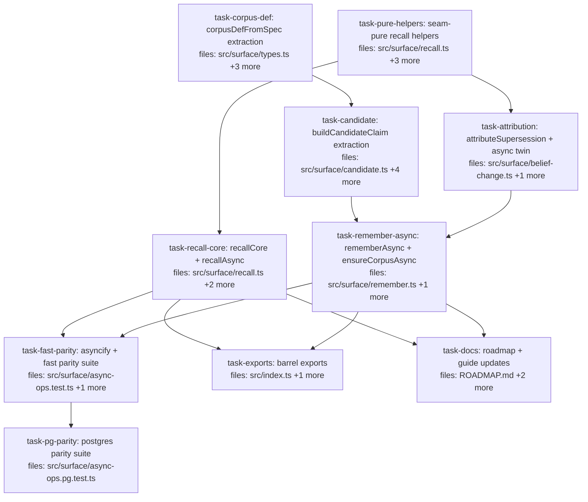

## Context

Executes `docs/superpowers/specs/2026-07-06-async-recall-remember-design.md` (audited;
amendments B1–B15 folded). Goal: `recallAsync`/`rememberAsync`/`ensureCorpusAsync` for the
async/Postgres surface via ONE shared `recallCore` over a two-method read seam
(`listCorpora` + `read`) that both `Mneme` and `AsyncMneme` satisfy structurally. The sync
surface's behavior and signatures are unchanged; `replay`/`derive` stay out (A11).

Plan-level notes:

- **The zero-edit gate.** Re-basing sync `recall` onto `recallCore` must leave
  `recall-golden.test.ts`, `pushdown.property.test.ts` (assertions), `recall.test.ts`,
  `explain.test.ts`, and the full suite green with NO test-body edits — they pin sync
  byte-identity across the refactor. The one sanctioned edit is the stale two-reads
  COMMENT in `pushdown.property.test.ts` (B15; assertions untouched).
- **`session.ts` and `test-support.ts` are shared files** — serialized:
  `task-corpus-def` → `task-candidate` (both edit session.ts/session.test.ts);
  `task-candidate` → … → `task-fast-parity` (both edit test-support.ts; path exists via
  `task-remember-async`). `recall.ts` chain: `task-pure-helpers` → `task-recall-core`.
- **Parity determinism rules (B3/B7), binding on both parity tasks:** every recall arm
  pins `asOf`; remember fixtures pin explicit pairwise-distinct `validFrom` values and
  reset the deterministic UUID stub to the same sequence before each store's write run.
- **asyncifyAdapter transaction is a documented no-op passthrough (B2)** — delegating to
  the sync transaction would COMMIT empty around an async fn (better-sqlite3 runs fn
  synchronously). Test helper only; no atomicity claim.

## Tasks

## Task: corpusDefFromSpec extraction

```yaml
id: task-corpus-def
depends_on: []
files:
  - src/surface/types.ts
  - src/surface/types.test.ts
  - src/surface/session.ts
  - src/surface/session.test.ts
status: pending
```

Extract the CorpusSpec→CorpusDef expansion from `session.createCorpus`
(`session.ts:78-128`) into pure `corpusDefFromSpec(spec): CorpusDef` in `types.ts` beside
`CorpusSpec` (spec §3.2/B11). The extraction carries ALL of: scalarPseudocount validation
(finite, >= 0 — principles-audit finding 13), the explicit-`undefined` strip BEFORE
spreading (spec audit finding 2.5), `validateKeyCardinality`, and the exact CorpusDef
literal (defaults, requiredTiers, timestamps). `session.createCorpus` becomes FOUR steps
(B1 — binding): `corpusDefFromSpec` → `mneme.createCorpus` → `versionOf.set(spec.id,
version)` → `saveCorpora`.

## Implementation

```typescript
// src/surface/types.ts — beside CorpusSpec; move the validation + expansion verbatim
import { validateKeyCardinality } from "../catalog/schema.js";

/** Pure CorpusSpec→CorpusDef expansion — the ONE home for corpus-shape defaults.
 *  Throws on invalid scalarPseudocount overrides (finite, >= 0) and bad keyCardinality. */
export function corpusDefFromSpec(spec: CorpusSpec): CorpusDef {
  for (const [src, v] of Object.entries(spec.scalarPseudocount ?? {})) {
    if (v !== undefined && (!Number.isFinite(v) || v < 0)) {
      throw new Error(`invalid scalarPseudocount for source "${src}": ${v} (must be a finite number >= 0)`);
    }
  }
  const pcOverrides = Object.fromEntries(
    Object.entries(spec.scalarPseudocount ?? {}).filter(([, v]) => v !== undefined));
  if (spec.keyCardinality) validateKeyCardinality(spec.keyCardinality);
  const version = spec.schemaVersion ?? SURFACE_DEFAULTS.schemaVersion;
  return { /* the exact literal currently built in session.ts:100-124 */ } as CorpusDef;
}
```

```typescript
// src/surface/types.test.ts
it("corpusDefFromSpec strips explicit-undefined pseudocounts BEFORE merging over defaults", () => {
  const def = corpusDefFromSpec({ id: "c", scalarPseudocount: { llm: undefined } });
  expect(def.schema.scalarPseudocount.llm).toBe(DEFAULT_SCALAR_PSEUDOCOUNT.llm); // not undefined
  expect(Object.keys(def.schema.scalarPseudocount)).toHaveLength(6);
});
```

## Acceptance criteria

- `corpusDefFromSpec` output is deep-equal to what `session.createCorpus` built before
  the refactor for: defaults-only spec, custom schemaVersion, keyCardinality,
  pseudocount overrides, explicit-undefined pseudocount (strip verified), and it throws
  the exact `invalid scalarPseudocount for source ...` text for NaN/negative overrides.
- `session.createCorpus` delegates and RETAINS `versionOf.set` (B1): a session-created
  corpus with `schemaVersion: "7"` then `session.write` stamps `schema: "c@7"` — new
  round-trip test in `session.test.ts`.
- Existing `session.test.ts` + `corpus-store` suites pass with zero behavioral edits.

Test file: `src/surface/types.test.ts` and `src/surface/session.test.ts`.

## Task: buildCandidateClaim extraction

```yaml
id: task-candidate
depends_on: [task-corpus-def]
files:
  - src/surface/candidate.ts
  - src/surface/candidate.test.ts
  - src/surface/session.ts
  - src/surface/session.test.ts
  - src/surface/test-support.ts
status: pending
```

Extract `session.ts`'s `buildCandidate` closure (`session.ts:56-73`) into pure
`buildCandidateClaim(rec, ctx)` in NEW `src/surface/candidate.ts` (spec §3.1) —
WriteRecord→CandidateClaim shaping only. `session.write`/`writeMany` delegate;
`test-support.ts`'s divergent third copy (`profile: "test"`) delegates too (B11), killing
the fork.

## Implementation

```typescript
// src/surface/candidate.ts
import type { WriteRecord } from "./types.js";
import { SURFACE_DEFAULTS, defaultConfidence } from "./types.js";
import { scalarConfidence } from "../core/confidence.js";

export interface CandidateContext {
  corpusId: string;
  schemaVersion: string;   // resolver rule: def.schema.version ?? SURFACE_DEFAULTS.schemaVersion (B5)
  profile?: string;        // default SURFACE_DEFAULTS.profile
  workspace?: string;      // default corpusId
  source?: Source;         // default SURFACE_DEFAULTS.source
}

export function buildCandidateClaim(rec: WriteRecord, ctx: CandidateContext): CandidateClaim {
  return {
    profile: (ctx.profile ?? SURFACE_DEFAULTS.profile) as never,
    workspace: (ctx.workspace ?? ctx.corpusId) as never,
    subject: rec.subject as never,
    key: rec.key as never,
    scope: rec.scope ?? {},
    value: rec.value,
    confidence: rec.confidence == null ? defaultConfidence()
      : typeof rec.confidence === "number" ? scalarConfidence(rec.confidence) : rec.confidence,
    valid: rec.valid ?? SURFACE_DEFAULTS.validInterval,
    source: rec.source ?? ctx.source ?? SURFACE_DEFAULTS.source,
    provenance: {}, evidence: [], tags: rec.tags ?? [],
    schema: `${ctx.corpusId}@${ctx.schemaVersion}`,
    status: rec.status,
  };
}
```

```typescript
// src/surface/candidate.test.ts
it("builds the identical candidate session.write built (schema string, defaults, coercion)", () => {
  const c = buildCandidateClaim({ subject: "s", key: "k", value: "v", confidence: 0.7 },
    { corpusId: "work", schemaVersion: "1" });
  expect(c.schema).toBe("work@1");
  expect(c.confidence).toEqual(scalarConfidence(0.7));
  expect(c.workspace).toBe("work");
});
```

## Acceptance criteria

- `buildCandidateClaim` output deep-equals the pre-refactor `session.write` candidate for:
  bare-number confidence (scalar coercion), Confidence object passthrough, omitted
  confidence (defaultConfidence), custom profile/workspace/source, default valid interval,
  and the `${corpusId}@${schemaVersion}` schema string.
- `session.write`/`writeMany` delegate (versionOf lookup unchanged); full `session.test.ts`
  + `import.test.ts` suites green with zero behavioral edits.
- `test-support.ts`'s local `buildCandidate` delegates with a test `CandidateContext`
  (`profile: "test"` preserved); `recall.test.ts` / `explain.test.ts` /
  `recall-golden.test.ts` / `pushdown.property.test.ts` all green unchanged.

Test file: `src/surface/candidate.test.ts`.

## Task: seam-pure recall helpers

```yaml
id: task-pure-helpers
depends_on: []
files:
  - src/surface/recall.ts
  - src/surface/recall.test.ts
  - src/surface/cardinality.ts
  - src/surface/cardinality.test.ts
status: pending
```

Zero-behavior-change extractions behind the read seam (spec §2), sync signatures
untouched: (1) `RecallSource` seam type; (2) `aliasContextFrom(aliasClaims, now,
keyCardinality)` — the pure post-read part of `loadAliasContext`, which keeps its exact
signature/try-catch/warning text and delegates; (3) `effectiveKeyCardinality(source,
corpus, override)` in cardinality.ts — `resolveKeyCardinality(session, ...)` delegates
with `session.mneme`; (4) `buildFilterPlan` switches its sigmas to PURE `sigmaOp(p)`
stages (B4 — byte-safe: value-predicate routing is a no-op for subjectEq/keyEq/keyIn, and
arity-1 fns stay assignable to `Stage`, so explain's pipelines are zero-edit); (5)
`buildRecallRankerPure(args, rankFn, now)` — the ONE home for the alpha/half-life dials
(B10); the exported Stage `buildRecallRanker` becomes a one-line ctx wrapper over it;
(6) `warmRecallValuesOver(source, args, embeddings, family)` — sync `warmRecallValues`
delegates.

## Implementation

```typescript
// src/surface/recall.ts — the seam + two of the six extractions (shapes)
import { sigma as sigmaOp } from "../algebra/selection.js";
import { rho as rhoOp } from "../algebra/similarity.js";
import { rankBlend } from "../algebra/ranking.js";

/** Minimal read seam recall needs. Satisfied structurally by BOTH Mneme and AsyncMneme. */
export interface RecallSource {
  listCorpora(filter?: (c: CorpusDefLike) => boolean): CorpusDefLike[];
  read(corpusId: string, plan: ExecutionPlan): Claim[] | Promise<Claim[]>;
}

export function buildRecallRankerPure(
  args: RecallArgs, rankFn: string, now: number,
): (c: Corpus) => RankedCorpus {
  return args.recencyAlpha === 1
    ? rhoOp(rankFn, args.about)
    : rankBlend(rankFn, args.about,
        { alpha: args.recencyAlpha ?? 0.5, halfLifeDays: args.recencyHalfLifeDays ?? 90 }, now);
}
/** Stage wrapper — explain.ts keeps consuming this unchanged. */
export function buildRecallRanker(args: RecallArgs, rankFn: string): Stage<Corpus, RankedCorpus> {
  return (c, ctx) => buildRecallRankerPure(args, rankFn, ctx.evaluationClock ?? Date.now())(c);
}
```

```typescript
// src/surface/recall.test.ts
it("buildFilterPlan sigmas are pure (apply without ctx) and unchanged in effect", () => {
  const { sigmas } = buildFilterPlan({ about: "q", corpus: "c", subject: "a" });
  const filtered = sigmas.reduce((acc, s) => (s as (c: Corpus) => Corpus)(acc), corpusOf(mixed));
  expect(filtered.claims.every((cl) => cl.subject === "a")).toBe(true);
});
```

## Acceptance criteria

- All six extraction targets exist with the spec'd signatures; each sync wrapper
  (`loadAliasContext`, `resolveKeyCardinality`, `buildFilterPlan`, `buildRecallRanker`,
  `warmRecallValues`) keeps its EXACT current signature.
- `aliasContextFrom` preserves the `alias load failed — proceeding without alias
  expansion:` warning text path in the sync wrapper (existing alias-failure test green).
- The Stage `buildRecallRanker` no longer records similarity versions into ctx
  accumulators — this is intentional and unobservable (recall and explain both create
  and discard those accumulators per query); the check is behavioral: `explain.test.ts`
  and `recall.test.ts` full suites green with zero behavioral edits.
- Zero-edit gate: `recall-golden.test.ts`, `pushdown.property.test.ts`,
  `explain.test.ts`, `belief-change.test.ts`, full `src/surface` suite + typecheck green.

Test file: `src/surface/recall.test.ts` and `src/surface/cardinality.test.ts`.

## Task: recallCore with recallAsync

```yaml
id: task-recall-core
depends_on: [task-pure-helpers]
files:
  - src/surface/recall.ts
  - src/surface/recall.test.ts
  - src/surface/pushdown.property.test.ts
status: pending
```

The centerpiece (spec §2): move recall's orchestration into `recallCore(source, args,
deps)`; sync `recall(session, args, deps)` becomes `recallCore(session.mneme, args,
deps)` (signature unchanged); export `recallAsync(source, args, deps)` =
`recallCore(source, ...)`. Inside the core the two `mneme.query` calls become ONE hinted
read + pure stages: `corpusOf(await source.read(corpus, { corpusId: corpus, ...hints }))`
→ pure sigmas → canon[0..1] (= preContra) → buffered cardinality warnings → canon[2..3] →
`buildRecallRankerPure(args, rankFn, now)` — preserving read order alias → warm → prefix
(B13), the warnings order alias → coverage → cardinality, the unknown-corpus early return
BEFORE any read, and ranker construction position/throw-timing (B10). Also refresh the
stale two-reads hydration-smoke COMMENT (B15 — comment only, assertions untouched).

## Implementation

```typescript
// src/surface/recall.ts — core skeleton (order + purity are the load-bearing parts)
async function recallCore(source: RecallSource, args: RecallArgs, deps: RecallDeps): Promise<RecallResult> {
  const keyCardinality = effectiveKeyCardinality(source, args.corpus, deps.keyCardinality);
  // ... entities/emptyResult verbatim ...
  if (!source.listCorpora().some((c) => c.id === args.corpus)) { /* early return verbatim */ }
  const now = parseAsOf(args.asOf) ?? Date.now();
  // 1. alias read (try/catch → exact sync warning text) then pure aliasContextFrom
  // 2. warm read via warmRecallValuesOver(source, ...)
  // 3. prefix: corpusOf(await source.read(args.corpus, { corpusId: args.corpus, ...hints }))
  //    → sigmas.reduce → canon[0] → canon[1]  (= preContra)
  // 4. buffered cardinalitySafetyWarnings(preContra, ...) in its own try/catch
  // 5. canon[2] → canon[3] → buildRecallRankerPure(args, embeddings.rankFn, now)
  // 6. topScore/coverage/knobs/matches/kappa — verbatim from today's body
}
export async function recall(session: Session, args: RecallArgs, deps: RecallDeps) {
  return recallCore(session.mneme, args, deps);
}
/** Async twin. NOTE (B8): the async catalog is in-memory per-process — recall against a
 *  populated pg corpus never re-declared this process returns EMPTY, not an error. */
export async function recallAsync(source: RecallSource, args: RecallArgs, deps: RecallDeps) {
  return recallCore(source, args, deps);
}
```

```typescript
// src/surface/recall.test.ts — the async twin smoke over the seam (full parity lives downstream)
it("recallAsync over an async source serves the same matches as sync recall", async () => {
  const { session } = makeSpySession();
  seedClaims(session, mixedFixture());
  const sync = await recall(session, ARGS, jaccardDeps);
  const viaSeam = await recallAsync(
    { listCorpora: (f) => session.mneme.listCorpora(f),
      read: async (c, p) => session.mneme.read(c, p) },
    ARGS, jaccardDeps);
  expect(viaSeam).toEqual(sync);
});
```

## Acceptance criteria

- ZERO-EDIT GATE: `recall-golden.test.ts` (byte-identical incl. 3-warning order),
  `pushdown.property.test.ts` assertions (100-run differential + hydration ≤10),
  `recall.test.ts` existing cases (incl. "exactly ONE non-alias adapter query"),
  `explain.test.ts`, full `src/surface` + `src/mcp` suites, `npm run typecheck` — all
  green with no test-body edits (B15 comment refresh excepted).
- `recallAsync` exported; the in-file seam smoke passes (deep-equal vs sync).
- Read order alias → warm → prefix asserted via `plansSeen` order (one new test).
- The core never touches `mneme.query`/`leaf` (grep recall.ts: no `leaf(` import usage
  remains in the recall path; `fromCorpus` import dropped if unused).

Test file: `src/surface/recall.test.ts`.

## Task: attributeSupersession with async twin

```yaml
id: task-attribution
depends_on: [task-pure-helpers]
files:
  - src/surface/belief-change.ts
  - src/surface/belief-change.test.ts
status: pending
```

Extract the pure attribution block of `supersessionOutcome` (`belief-change.ts:108-134`)
into `attributeSupersession(written, group, dispositions): SupersessionOutcome` (spec
§3.3); sync `supersessionOutcome(session, ...)` keeps its exact signature = sync reads +
pure core. New `supersessionOutcomeAsync(source, corpus, claimId)` = awaited reads + the
SAME pure core, using `readByIds(corpus, [claimId])` to locate the written claim (B8 —
outcome-identical, avoids a per-write O(corpus) pg read; the async seam here is
`RecallSource & { readByIds }`).

## Implementation

```typescript
// src/surface/belief-change.ts
export function attributeSupersession(
  written: Claim, group: Claim[],
  dispositions: Map<string, { disposition: GroupDisposition; reason: DispositionReason }>,
): SupersessionOutcome { /* body = current lines 108-134, verbatim */ }

export async function supersessionOutcomeAsync(
  source: RecallSource & { readByIds(corpusId: string, ids: ClaimId[]): Promise<Claim[]> | Claim[] },
  corpus: string, claimId: string,
): Promise<SupersessionOutcome> {
  const now = Date.now();
  const keyCardinality = effectiveKeyCardinality(source, corpus, undefined);
  // alias read + aliasContextFrom (same try-less shape as sync: loadAliasContext's core)
  const written = (await source.readByIds(corpus, [claimId as ClaimId]))[0];
  if (!written) return { action: "committed", deprecatedIds: [] };
  const group = await source.read(corpus, { corpusId: corpus, subject: written.subject, key: written.key });
  return attributeSupersession(written, group as Claim[],
    groupDispositions(group as Claim[], keyCardinality, aliasMap, now));
}
```

```typescript
// src/surface/belief-change.test.ts
it("async attribution equals sync attribution for the same store state", async () => {
  const { session } = makeSpySession();
  // seed a supersession pair with distinct validFrom values (B3)
  const syncOut = supersessionOutcome(session, CORPUS, newestId);
  const asyncOut = await supersessionOutcomeAsync(
    { listCorpora: (f) => session.mneme.listCorpora(f),
      read: async (c, p) => session.mneme.read(c, p),
      readByIds: async (c, ids) => session.mneme.readByIds(c, ids) },
    CORPUS, newestId);
  expect(asyncOut).toEqual(syncOut);
});
```

## Acceptance criteria

- `attributeSupersession` is pure (no session/mneme/Date.now inside) and sync
  `supersessionOutcome` delegates to it — existing `belief-change.test.ts` suite green
  with zero behavioral edits.
- `supersessionOutcomeAsync` equals sync attribution for: superseded (distinct
  validFroms), merged/duplicate, committed (no group), written-not-found (foreign id →
  `{action: "committed", deprecatedIds: []}`).
- The async twin locates the written claim via `readByIds`, not a full-corpus read
  (spy-asserted plan shapes).

Test file: `src/surface/belief-change.test.ts`.

## Task: rememberAsync with ensureCorpusAsync

```yaml
id: task-remember-async
depends_on: [task-candidate, task-attribution]
files:
  - src/surface/remember.ts
  - src/surface/remember.test.ts
status: pending
```

`ensureCorpusAsync(mneme, corpusId, spec?)` — sync-returning, first-declaration-wins
(B12: exists → return, spec IGNORED; Catalog.createCorpus overwrites, the exists-check is
the guard — JSDoc states this and the no-sidecar/re-declare-at-boot caveat). Defaults
mirror sync `ensureCorpus` (`scopeFields: {project, person, context}`).
`rememberAsync(mneme, args, opts?)` mirrors sync `remember` exactly (spec §3.3):
ensure → validFrom parse (same error text, `valid: {from: validFrom ?? Date.now(), to:
Infinity}`) → `buildCandidateClaim` with schemaVersion per the B5 rule
(`def.schema.version ?? SURFACE_DEFAULTS.schemaVersion` from `listCorpora`) →
`await mneme.commit(corpus, candidate, { writer })` → attribution **gated on
`status === "committed"`** (B6), best-effort never-throws → RememberResult.

## Implementation

```typescript
// src/surface/remember.ts
export interface RememberAsyncOptions {
  writer?: string; profile?: string; workspace?: string; source?: Source;
}

export function ensureCorpusAsync(
  mneme: { createCorpus(def: CorpusDef): CorpusDef; listCorpora(filter?: (c: { id: string }) => boolean): { id: string }[] },
  corpusId: string, spec?: Omit<CorpusSpec, "id">,
): void {
  if (mneme.listCorpora().some((c) => c.id === corpusId)) return; // first-declaration-wins (B12)
  mneme.createCorpus(corpusDefFromSpec({
    id: corpusId,
    scopeFields: { project: "string", person: "string", context: "string" },
    ...spec,
  }));
}

export async function rememberAsync(
  mneme: AsyncRememberSource, args: RememberArgs, opts: RememberAsyncOptions = {},
): Promise<RememberResult> {
  ensureCorpusAsync(mneme, args.corpus);
  // validFrom parse — EXACT sync error text (remember.ts:44-53)
  // schemaVersion per B5; buildCandidateClaim; await mneme.commit(..., { writer: opts.writer ?? SURFACE_DEFAULTS.writer })
  // if (out.status === "committed") try { supersession = await supersessionOutcomeAsync(mneme, ...) } catch {}
}
```

```typescript
// src/surface/remember.test.ts
it("rememberAsync over asyncified store equals sync remember (status + supersession)", async () => {
  // two stores, same UUID-stub sequence reset per store (B3), distinct pinned validFroms
  const s1 = syncRemember(); const s2 = await asyncRemember();
  expect(pick(s2, "status", "supersession")).toEqual(pick(s1, "status", "supersession"));
});
```

## Acceptance criteria

- `ensureCorpusAsync`: creates once with the sync-default scopeFields; second call with a
  DIFFERENT spec is a no-op (first-declaration-wins asserted); pseudocount validation
  throws via `corpusDefFromSpec` (exact error text).
- `rememberAsync`: invalid `validFrom` throws the exact sync error text
  (`remember: validFrom "..." is not a valid ISO-8601 date string`); duplicates get
  `supersession: undefined` (B6 gate asserted); attribution failure never fails the write
  (inject a throwing readByIds → result still returned).
- Parity smoke vs sync `remember` on the same logical writes (pinned distinct validFroms,
  per-store UUID-stub reset): equal `status` and `supersession` (action + deprecatedIds).
- Full existing `remember.test.ts` suite green (sync path untouched).

Test file: `src/surface/remember.test.ts`.

## Task: asyncifyAdapter with fast parity suite

```yaml
id: task-fast-parity
depends_on: [task-recall-core, task-remember-async]
files:
  - src/surface/async-ops.test.ts
  - src/surface/test-support.ts
status: pending
```

The no-Docker parity harness (spec §5.2/§5.3). `asyncifyAdapter(sync: StorageAdapter):
AsyncStorageAdapter` in `test-support.ts` per the B2 member rules: `transaction` = no-op
passthrough `async (_corpusId, fn) => fn()` (documented: NO atomicity, single-threaded
test helper only — sync delegation would commit empty around an async fn);
`maxRecordedSeq(corpusId)` → sync `maxRecordedSeq()`; `capabilities()` stays SYNC;
promisify the rest; `scoped()` recurses; optional members defined only when present.
Then `async-ops.test.ts`: sync `recall` over `createMneme(sqlite)` vs `recallAsync` over
`createMnemeAsync(asyncifyAdapter(sameSqlite))` — full `RecallResult` deep-equal.

## Implementation

```typescript
// src/surface/test-support.ts
/** Test-only StorageAdapter→AsyncStorageAdapter wrapper. transaction() is a NO-OP
 *  passthrough (no atomicity): better-sqlite3 transactions are synchronous — wrapping an
 *  async fn would COMMIT empty at its first await. Single-threaded tests only. */
export function asyncifyAdapter(sync: StorageAdapter): AsyncStorageAdapter { /* B2 rules */ }
```

```typescript
// src/surface/async-ops.test.ts — one matrix arm (all arms pin asOf, B7)
it("parity: subject+key scoped recall — sync sqlite vs async(asyncified sqlite)", async () => {
  const { syncMneme, asyncMneme } = sameStorePair(); // one sqlite adapter, two facades, same corpus def via corpusDefFromSpec
  seed(syncMneme);
  const s = await recall(sessionOf(syncMneme), { ...ARGS, asOf: T0 }, jaccardDeps);
  const a = await recallAsync(asyncMneme, { ...ARGS, asOf: T0 }, jaccardDeps);
  expect(a).toEqual(s); // matches incl ids, content, warnings + order, coverage, topScore, abstained, rankFn
});
```

## Acceptance criteria

- Matrix arms (each `asOf`-pinned, full-result deep-equal): subject / key / subject+key /
  alias-family / no-filter / unknown-corpus / `recencyAlpha: 1` / abstained
  (`abstainBelowTop` high) / existing-but-empty corpus / the golden three-warning fixture
  recipe (alias → coverage → cardinality warnings order asserted) — 10 arms (B14).
- Remember parity: same write sequence into two stores (pinned pairwise-distinct
  validFroms, UUID stub reset to the same sequence per store — B3): equal status +
  supersession (action, deprecatedIds).
- `asyncifyAdapter` unit: `capabilities()` sync passthrough; optional-member
  presence/absence preserved (wrap an adapter without `close` → wrapper lacks `close`);
  transaction passthrough executes the async fn's awaited writes (observable in store).
- Runs in the DEFAULT suite (`npm test` — filename is not `*.pg.test.ts`).

Test file: `src/surface/async-ops.test.ts`.

## Task: postgres parity suite

```yaml
id: task-pg-parity
depends_on: [task-fast-parity]
files:
  - src/surface/async-ops.pg.test.ts
status: pending
```

The linchpin gate (spec §5.4): sync `recall` (SQLite) vs `recallAsync`
(`createMnemeAsync(createPostgresAdapter(...))` built per `parity.pg.test.ts`'s
`dbPerTenantRouter` testcontainers pattern) — same seeded logical claims with FIXED ids
(COLLATE-"C" pattern), same corpus defs via `corpusDefFromSpec`, deep-equal
`RecallResult` across the same matrix. A recall that isn't parity-proven is not done.

## Implementation

```typescript
// src/surface/async-ops.pg.test.ts — Docker-gated; mirror parity.pg.test.ts's harness
it("parity: scoped recall — sync sqlite vs async postgres", async () => {
  const sq = sessionOverSqlite(); const pg = await asyncMnemeOverPg();
  for (const claim of FIXED_ID_CLAIMS) { seedSync(sq, claim); await seedPg(pg, claim); }
  const s = await recall(sq, { ...ARGS, asOf: T0 }, jaccardDeps);
  const a = await recallAsync(pg, { ...ARGS, asOf: T0 }, jaccardDeps);
  expect(a).toEqual(s);
});
```

```typescript
// same file — remember on pg
it("rememberAsync on pg attributes supersession identically to sync-on-sqlite", async () => {
  // same write sequence, pinned distinct validFroms, UUID stub reset per store (B3)
  expect(pick(pgOut, "status", "supersession")).toEqual(pick(sqliteOut, "status", "supersession"));
});
```

## Acceptance criteria

- Recall parity arms (pinned `asOf`): subject+key scoped / alias-family / no-filter /
  the three-warning fixture (warnings order asserted) — deep-equal `RecallResult`
  sync-sqlite vs async-pg.
- Remember parity on pg per the B3 pinning rules: equal status + supersession.
- Uses fixed ids + `scoped`/direct seeding per the COLLATE-"C" precedent so deep-equality
  is well-defined; runs ONLY under Docker (`*.pg.test.ts`, `npm run test:pg`).

Test file: `src/surface/async-ops.pg.test.ts`.

## Task: barrel exports

```yaml
id: task-exports
depends_on: [task-recall-core, task-remember-async]
files:
  - src/index.ts
  - src/surface/index.ts
status: pending
is_wiring_task: true
```

Export `recallAsync`, `rememberAsync`, `ensureCorpusAsync`, `corpusDefFromSpec` and types
(`RecallSource`, `RememberAsyncOptions`) from the surface barrel and the root barrel.
Convention (B9): root `index.ts` imports from the DEFINING modules directly
(`./surface/recall.js`, `./surface/remember.js`, `./surface/types.js`), never from
`./surface/index.js`.

## Acceptance criteria

- Both barrels export exactly: `recallAsync`, `rememberAsync`, `ensureCorpusAsync`,
  `corpusDefFromSpec`, `type RecallSource`, `type RememberAsyncOptions` — 6 new export
  entries, root-barrel imports pointing at the DEFINING modules (`./surface/recall.js`,
  `./surface/remember.js`, `./surface/types.js`), never `./surface/index.js` (B9).
- `npm run typecheck` and `npm run build` green.
- No existing export removed or changed; `createMnemeAsync` stays exported.

Test file: (wiring — `npm run typecheck` + `npm run build`).

## Task: roadmap with guide updates

```yaml
id: task-docs
depends_on: [task-recall-core, task-remember-async]
files:
  - ROADMAP.md
  - docs/postgres-async-adapter.md
  - docs/superpowers/specs/2026-07-05-postgres-async-adapter-design.md
status: pending
is_wiring_task: true
model_hint: cheap
review_mode: merged
```

Docs delivery (spec §7): ROADMAP — under "MCP server backend configurable", mark the
surface-ops prerequisite delivered (async `recall`/`remember`/corpus-ensure, citing the
2026-07-06 async-recall-remember spec); the async `replay`/`derive` item stays open
verbatim. `docs/postgres-async-adapter.md` — add a short "Surface ops" subsection with a
`recallAsync`/`rememberAsync`/`ensureCorpusAsync` usage snippet (including the
re-declare-corpora-at-boot caveat). 2026-07-05 postgres design doc §8 — one-paragraph
addendum noting the async surface ops shipped and where.

## Acceptance criteria

- ROADMAP's MCP-backend item names the delivered prerequisite and cites the spec file;
  the replay/derive deferred item is byte-unchanged.
- The usage guide snippet compiles conceptually against the real signatures
  (`recallAsync(mneme, { about, corpus, ... }, deps)`) and states the in-memory-catalog
  caveat.
- The 2026-07-05 design doc addendum does not alter any existing section content.

Test file: (docs — no test; `npm run typecheck` unaffected).
