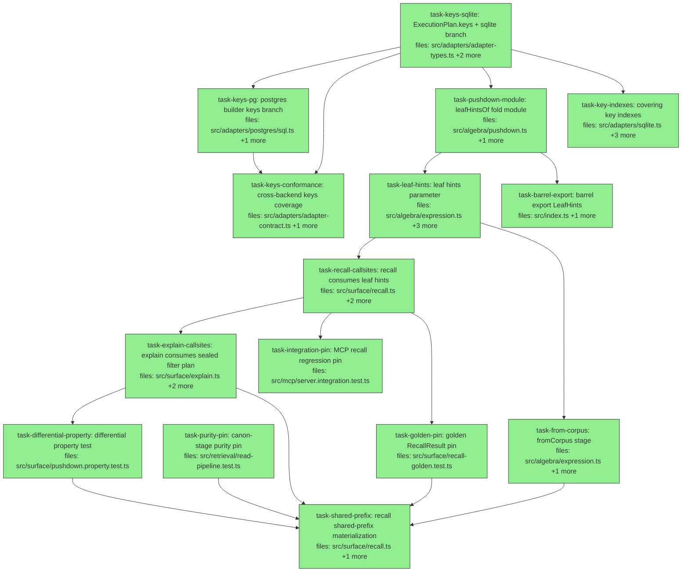

## Context

Executes `docs/superpowers/specs/2026-07-06-read-path-pushdown-design.md` (audited; amendments
A1–A12 folded). Goal: fold subject/key identity predicates from the algebra read path into the
adapters' existing `ExecutionPlan` pushdown, so `recall` (2 full-corpus queries today) and
`explainRecall` (5) hydrate only matching rows. σ stages are retained everywhere
(belt-and-braces) — results must be byte-identical; the differential property test with a
pinned `asOf` is the safety net. Phase 2 (`task-from-corpus` → `task-shared-prefix`) collapses
recall's two queries into one materialization behind golden/purity/differential pins.

Plan-level notes:

- **Transitional delegate.** The spec retires `buildFilterSigmas` outright; consumer grep shows
  `explain.ts` (and no test file) imports it, so a hard removal in `task-recall-callsites`
  would leave the tree red between tasks. Instead: `task-recall-callsites` re-implements it as
  a deprecated one-line delegate over `buildFilterPlan` (zero drift — it IS the sealed pair),
  and `task-explain-callsites` migrates explain and deletes the delegate. Net effect = spec.
- **Spy-session helper has ONE owner.** Four tasks need a plan-capturing/row-counting session
  over a wrapped adapter. `openSession` hardcodes `createSqliteAdapter`
  (`src/surface/session.ts:18-23`) — there is no adapter-injection seam — and the repo's
  convention for shared surface-test helpers is `src/surface/test-support.ts` (`freshSession`,
  `jaccardDeps`, `makeFakeHybridDeps`). `task-recall-callsites` owns the new `makeSpySession`
  helper there; `task-explain-callsites`, `task-differential-property`, `task-golden-pin`, and
  `task-shared-prefix` import it (they do NOT modify test-support.ts). Note: `jaccardDeps` is a
  **const**, not a factory — pass it bare or spread it.
- **Mirrored adapters are deliberate.** `task-keys-sqlite` and `task-keys-pg` have
  intentionally similar bodies — `src/adapters/postgres/sql.ts:1-4` documents that the pg
  builder byte-mirrors sqlite's `executeQuery`; a shared builder is a non-goal. `task-keys-pg`
  depends on `task-keys-sqlite` because the parity contract fixes the new condition's position
  relative to sqlite's final shape (and `ExecutionPlan.keys` is defined there).
- **`recall.ts` three-way serialization.** `task-recall-callsites` →
  `task-explain-callsites` (deletes the delegate in `recall.ts`) → `task-shared-prefix`
  (restructures `recall.ts`). File-overlap edges are exactly this chain.
- **Pins order-matter.** `task-golden-pin` captures the post-Phase-1, pre-Phase-2
  `RecallResult` (including `warnings` array order) — it MUST land after
  `task-recall-callsites` and before `task-shared-prefix`. `task-purity-pin` pins today's
  canon-stage purity and is a root. `task-shared-prefix` additionally depends on
  `task-differential-property` — the spec's Phase 2 gate (§11: "6 depends on 4") includes the
  differential safety net.
- **Plan audit (2026-07-06), two parallel lenses (code-reality; decomposition), findings
  folded:** differential→shared-prefix edge added; spy-session helper given a single owner in
  test-support.ts; conformance/parity sketches rewritten against the real
  `runAsyncAdapterContract` / COLLATE-"C"-style harnesses (the originals were vacuous or
  impossible); forced-scope `keys` case added to the contract; `subjectIn` added to the
  non-foldable assertions; sqlite order-assertion seeded with distinct `recordedSeq`; sqlite
  index test rewritten (adapter exposes no db handle — reopen a tmp file); golden fixture
  concretized (meta-alias trigger, token-dissimilar collision values, run-once-pin-literal);
  integration sketch aligned to the `connected()`/`client.callTool` harness; purity pin uses
  the file's existing `stubCtx`/`applyStages`; delegate-correctness AC is by-construction (no
  dedicated test).

## Tasks

## Task: ExecutionPlan.keys with sqlite branch

```yaml
id: task-keys-sqlite
depends_on: []
files:
  - src/adapters/adapter-types.ts
  - src/adapters/sqlite.ts
  - src/adapters/sqlite.test.ts
status: done
```

Add the `keys?: string[]` field to `ExecutionPlan` (spec §3.1) and compile it in sqlite's
`executeQuery`, positioned immediately after the `plan.key` branch. Empty array emits no
condition (mirrors `status`/`runIds`); `key` and `keys` both set AND together. The existing
`params.flatMap` flattening is spread-compatible (same shape as the `status` branch).

## Implementation

```typescript
// src/adapters/adapter-types.ts — inside ExecutionPlan
export interface ExecutionPlan {
  corpusId: string;
  subject?: string;
  key?: string;
  /** Match claims whose key is in this set (SQL: key IN (...)). May be combined
   *  with `key` — all plan fields AND together. CAUTION: an EMPTY array emits NO
   *  condition (matches everything, mirroring status/runIds), whereas the in-memory
   *  σ predicate keyIn([]) matches NOTHING — hint builders must OMIT the field
   *  instead of passing []. */
  keys?: string[];
  status?: string[];
  scopeHash?: string;
  recordedAtMost?: number;
  runIds?: string[];
}
```

```typescript
// src/adapters/sqlite.ts — executeQuery, directly after the plan.key branch
if (plan.keys !== undefined && plan.keys.length > 0) {
  const placeholders = plan.keys.map(() => "?").join(", ");
  conditions.push(`key IN (${placeholders})`);
  params.push(...plan.keys);
}
```

```typescript
// src/adapters/sqlite.test.ts — uses the file's makeValidatedClaim factory; give the
// three claims DISTINCT recordedSeq (factory defaults all to 1, and ties break on
// random UUID id — the order assertion would be flaky otherwise).
it("query({keys}) returns exactly the claims whose key is in the set, in recorded_seq order", () => {
  const adapter = createSqliteAdapter(":memory:");
  ["k1", "k2", "k3"].forEach((key, i) =>
    adapter.insertClaim(makeValidatedClaim({ subject: "s", key, recordedSeq: i + 1 })));
  const rows = adapter.query({ corpusId: "c", keys: ["k1", "k3"] });
  expect(rows.map((r) => r.key)).toEqual(["k1", "k3"]);
});
```

## Acceptance criteria

- `query({ corpusId, keys: ["k1","k3"] })` returns only k1/k3 claims, ordered by
  `recorded_seq ASC, id ASC` (seed distinct `recordedSeq` values so the order assertion is
  deterministic).
- `query({ corpusId, keys: [] })` returns the same rows as `query({ corpusId })` (empty array
  = no condition; assert equality of the two result sets).
- `query({ corpusId, key: "k1", keys: ["k1","k2"] })` returns only k1 claims (both-set ANDing).
- `keys` composes with `subject` and with a `scoped()` forced corpus: a scoped adapter with
  `keys` never returns another corpus's claims (extend the existing scoped test fixture).
- The `keys` field's doc comment states the empty-array divergence from σ `keyIn([])` verbatim
  (per spec §3.1 A5).

Test file: `src/adapters/sqlite.test.ts`.

## Task: postgres builder keys branch

```yaml
id: task-keys-pg
depends_on: [task-keys-sqlite]
files:
  - src/adapters/postgres/sql.ts
  - src/adapters/postgres/sql.test.ts
status: done
```

Mirror the sqlite `keys` branch in `buildQuery` — same position (after `key`, before
`scopeHash`) so the documented sqlite↔pg condition ordering stays aligned; update the
`buildQuery` JSDoc (sql.ts:12-19) that enumerates the ordering (spec §3.1).

## Implementation

```typescript
// src/adapters/postgres/sql.ts — buildQuery, directly after the plan.key branch
if (plan.keys !== undefined && plan.keys.length > 0) {
  const placeholders = plan.keys.map(() => `$${next()}`).join(", ");
  conditions.push(`key IN (${placeholders})`);
  params.push(...plan.keys);
}
```

```typescript
// src/adapters/postgres/sql.test.ts
it("compiles keys as key IN (...) positioned after key and before scope_hash", () => {
  const { text, params } = buildQuery("", { corpusId: "c", key: "k0", keys: ["k1", "k2"], scopeHash: "h" }, undefined, "t");
  expect(text).toMatch(/key = \$\d+ AND key IN \(\$\d+, \$\d+\) AND scope_hash = \$\d+/);
  expect(params).toEqual(["t", "k0", "k1", "k2", "h"]); // tenant_id is always $1
});
```

## Acceptance criteria

- `buildQuery` emits `key IN ($n, ...)` for non-empty `keys`, with `$n` placeholders numbered
  continuously and params in `keys` order (tenant_id first, per the fixture above).
- The condition appears after the `key` condition and before `scope_hash` (position asserted
  via the SQL text).
- Empty `keys` array emits no condition (SQL text identical to the same plan without `keys`).
- The `buildQuery` doc comment's condition-ordering enumeration includes `keys` in its
  position (subject, key, keys, scopeHash, recordedAtMost, status, runIds).

Test file: `src/adapters/postgres/sql.test.ts`.

## Task: cross-backend keys coverage

```yaml
id: task-keys-conformance
depends_on: [task-keys-sqlite, task-keys-pg]
files:
  - src/adapters/adapter-contract.ts
  - src/adapters/postgres/parity.pg.test.ts
status: done
```

Extend the shared backend-agnostic adapter contract (invoked by `conformance.pg.test.ts`)
with `keys` cases, and extend the sqlite↔pg parity suite with a `keys` plan (spec §8.2).
Harness reality: each contract case calls `await make()` (a fresh SCOPED adapter with its own
corpus) and seeds its own data via the file's `fixtureClaim()` inside `adapter.transaction`;
`plan.corpusId` is dead in both builders (the file's convention passes
`"unused-by-scoped-adapters"`). Parity cannot byte-compare mneme-written data (ids are minted
fresh per backend) — mirror the COLLATE "C" test's pattern: fixed ids via `sampleClaim`,
inserted through `adapter.scoped!({ corpus })` handles.

## Implementation

```typescript
// src/adapters/adapter-contract.ts — inside runAsyncAdapterContract, new cases
it("keys plan equals the in-memory keyIn filter for non-empty keys", async () => {
  const adapter = await make();
  await adapter.transaction(async () => {
    for (const [i, key] of ["k1", "k2", "k3"].entries()) {
      await adapter.insertClaim(fixtureClaim({ key, recordedSeq: i + 1 }));
    }
  });
  const all = await adapter.query({ corpusId: "unused-by-scoped-adapters" });
  const filtered = await adapter.query({ corpusId: "unused-by-scoped-adapters", keys: ["k1", "k3"] });
  expect(filtered).toEqual(all.filter((c) => ["k1", "k3"].includes(c.key)));
});
```

```typescript
// src/adapters/postgres/parity.pg.test.ts — mirror the COLLATE "C" test's shape:
// per-test adapters, FIXED ids via sampleClaim, scoped handles, direct insertClaim.
it("sqlite and pg return identical results for a keys plan", async () => {
  const sq = createSqliteAdapter(":memory:").scoped!({ corpus });
  const pg = (await makePgAdapter()).scoped({ corpus });
  for (const [i, key] of ["k1", "k2", "k3"].entries()) {
    const claim = sampleClaim({ id: `id-${i}`, key, recordedSeq: i + 1 });
    sq.insertClaim(claim);
    await pg.insertClaim(claim);
  }
  const plan = { corpusId: corpus, subject: sampleClaim({}).subject, keys: ["k1", "k2"] };
  expect(await pg.query(plan)).toEqual(sq.query(plan));
});
```

## Acceptance criteria

- Contract case: for non-empty `keys`, the scoped `query({..., keys})` equals the in-memory
  `keyIn` filter of the unfiltered query, order preserved — self-seeded via `fixtureClaim`
  in a transaction (the empty-`keys` case is asserted as EQUAL TO the unfiltered query, not
  keyIn-equivalent — plan-level `[]` = no condition per spec §3.1).
- Contract case: `keys` composes with `subject` and with `key` (both-set ANDing) — result
  equals the conjunction filter.
- Contract case (forced scope, spec §8.2): two scoped adapters over the same store — a `keys`
  query through corpus A's scope never returns corpus B's claims.
- Parity case: sqlite and pg identical for at least one plan carrying `keys` (+ subject),
  using fixed ids + scoped handles so full deep-equality is well-defined — same rows, same
  order, same field bytes.

Test file: `src/adapters/adapter-contract.ts` (cases; executed via
`src/adapters/postgres/conformance.pg.test.ts`) and `src/adapters/postgres/parity.pg.test.ts`.

## Task: leafHintsOf fold module

```yaml
id: task-pushdown-module
depends_on: [task-keys-sqlite]
files:
  - src/algebra/pushdown.ts
  - src/algebra/pushdown.test.ts
status: done
```

New pure module (spec §3.3): `LeafHints` + `leafHintsOf`, the single derivation point from a
predicate list to a plan fragment. Imports only `predicate.ts` + adapter types — respects the
layering contract (algebra never imports retrieval/surface). The `Pick<ExecutionPlan, ...>`
is deliberate (a hand-copied interface would silently drift if plan-field semantics change);
this module exists so the fold logic has exactly one home rather than being re-derived per
caller — the drift channel the audit's A1 closed.

## Implementation

```typescript
// src/algebra/pushdown.ts
import type { Predicate } from "./predicate.js";
import type { ExecutionPlan } from "../adapters/adapter-types.js";

export type LeafHints = Pick<ExecutionPlan, "subject" | "key" | "keys">;

/** Fold the top-level conjunction of σ predicates into an adapter plan fragment.
 *  INVARIANT: the hint is broader than or equal to the conjunction, never narrower —
 *  σ stages re-filter in memory, so an over-broad hint is harmless. */
export function leafHintsOf(preds: Predicate[]): LeafHints {
  const hints: LeafHints = {};
  const fold = (p: Predicate): void => {
    switch (p.op) {
      case "subjectEq": if (hints.subject === undefined) hints.subject = p.value; break;
      case "keyEq":     if (hints.key === undefined) hints.key = p.value; break;
      case "keyIn":
        if (p.values.length === 1) { if (hints.key === undefined) hints.key = p.values[0]; }
        else if (p.values.length > 1 && hints.keys === undefined) hints.keys = [...p.values];
        break; // empty keyIn contributes NOTHING (plan-level [] would mean "no condition")
      case "and": for (const q of p.preds) fold(q); break;
      default: break; // subjectIn/or/not/value/tag/status/scope/confidence/temporal: σ-only
    }
  };
  for (const p of preds) fold(p);
  return hints;
}
```

```typescript
// src/algebra/pushdown.test.ts
import { leafHintsOf } from "./pushdown.js";

it("keyEq ∧ keyIn sets BOTH key and keys (AND-intersection contract)", () => {
  expect(leafHintsOf([{ op: "keyEq", value: "a" }, { op: "keyIn", values: ["b", "c"] }]))
    .toEqual({ key: "a", keys: ["b", "c"] });
});

it("empty keyIn contributes nothing — field omitted, not keys: []", () => {
  expect(leafHintsOf([{ op: "keyIn", values: [] }])).toEqual({});
});
```

## Acceptance criteria

- `subjectEq` → `subject`; `keyEq` → `key`; multi-element `keyIn` → `keys`; one-element
  `keyIn` → `key`; `and` recurses into conjuncts.
- Empty `keyIn` → field omitted (`{}`, not `{ keys: [] }`) — per spec §3.1/A5.
- `keyEq` ∧ `keyIn` → both `key` and `keys` set (cross-field double-binding, spec §3.3/A4).
- Every non-foldable op contributes nothing, each asserted: `subjectIn` (deferred per spec
  §10), `or`, `not`, `statusEq`, `statusIn`, `scopeEq`, `tagIn`, `confidenceGt`, `validAt`,
  `recordedAfter`, plus one value predicate (`valueEq`) — 11 assertions.
- Same-field conflicting conjuncts (two different `subjectEq`) → first wins.
- Empty input → `{}`.

Test file: `src/algebra/pushdown.test.ts`.

## Task: leaf hints parameter

```yaml
id: task-leaf-hints
depends_on: [task-pushdown-module]
files:
  - src/algebra/expression.ts
  - src/algebra/expression.test.ts
  - src/algebra/async-expression.ts
  - src/algebra/async-expression.test.ts
status: done
```

`leaf(corpusId, hints?)` and `leafAsync(corpusId, hints?)` spread the optional `LeafHints`
into the adapter plan (spec §3.2). Additive — every existing call site, the AST/replay path
(`astLeaf`, `compile.ts`), and the DSL are untouched and behave byte-identically. Test-file
reality: the expression test files build ctx objects INLINE (no `makeCtx` helper) and their
local claim factory is positional `makeClaim(subject, value)` — follow those idioms.

## Implementation

```typescript
// src/algebra/expression.ts
import type { LeafHints } from "./pushdown.js";

export function leaf(corpusId: string, hints?: LeafHints): Stage<void, Corpus> {
  return (_input, ctx) => {
    ctx.catalog.getCorpus(corpusId); // throws for unknown corpus (unchanged)
    return corpusOf(ctx.adapter.query({ corpusId, ...hints }));
  };
}
// leafAsync in async-expression.ts: identical optional parameter, awaited query.
```

```typescript
// src/algebra/expression.test.ts — inline ctx, following the file's existing pattern
it("leaf passes hints into the adapter plan; no-hints call passes corpusId only", () => {
  const plans: ExecutionPlan[] = [];
  const adapter = { ...stubAdapter, query: (p: ExecutionPlan) => { plans.push(p); return []; } };
  const ctx = { adapter, catalog } as EvalContext; // built inline per file convention
  leaf("c", { subject: "s", keys: ["k1", "k2"] })(undefined, ctx);
  leaf("c")(undefined, ctx);
  expect(plans[0]).toEqual({ corpusId: "c", subject: "s", keys: ["k1", "k2"] });
  expect(plans[1]).toEqual({ corpusId: "c" });
});
```

## Acceptance criteria

- `leaf("c", hints)` calls `adapter.query({ corpusId: "c", ...hints })`; `leaf("c")` calls
  `adapter.query({ corpusId: "c" })` exactly as today (spy-asserted plan bytes, both sync and
  async twins — 4 assertions total).
- Unknown corpus still throws from the catalog check before any adapter call (existing test
  stays green; add the hinted variant).
- Existing pipelines through `leaf` are unmodified: the full `src/algebra` suite passes with
  zero test-body edits outside the two test files in scope (the only existing plan-shape
  assertion is a `toMatchObject({ corpusId })`, which the optional parameter cannot break).

Test file: `src/algebra/expression.test.ts` and `src/algebra/async-expression.test.ts`.

## Task: barrel export LeafHints

```yaml
id: task-barrel-export
depends_on: [task-pushdown-module]
files:
  - src/index.ts
  - src/algebra/pushdown.test.ts
status: done
is_wiring_task: true
```

Expose the new public surface from the root barrel: `export type { LeafHints }` and
`export { leafHintsOf }` from `./algebra/pushdown.js`, so library consumers building custom
pipelines can construct hints without deep imports (spec §11 task 3).

## Acceptance criteria

- `import { leafHintsOf, type LeafHints } from "../index.js"` resolves and typechecks — one
  test case in `pushdown.test.ts` imports via the barrel and asserts
  `leafHintsOf([{ op: "subjectEq", value: "s" }])` equals `{ subject: "s" }`.
- `npm run typecheck` passes.

Test file: `src/algebra/pushdown.test.ts` (barrel-import case).

## Task: recall consumes leaf hints

```yaml
id: task-recall-callsites
depends_on: [task-leaf-hints]
files:
  - src/surface/recall.ts
  - src/surface/recall.test.ts
  - src/surface/test-support.ts
status: done
```

The sealed pair (spec §4, amendment A1): `buildFilterPlan(args, family)` derives σ stages AND
hints from one predicate list; both recall queries (main ranked + cardinality-safety) pass
the hints to `leaf`; `warmRecallValues` collapses its per-key fan-out to one `keys` read
(amendment A9). `buildFilterSigmas` becomes a deprecated one-line delegate (explain.ts still
imports it; deleted by `task-explain-callsites`). This task ALSO owns the shared
`makeSpySession` helper in `test-support.ts` that all downstream pushdown tests import —
`openSession` hardcodes its adapter, so the helper hand-builds a Session over
`createMneme({ adapter: wrapped, availableTiers })` (recall/explain use only `session.mneme`
and `session.listCorpora`; mirror `freshSession`'s corpus setup in the same file).

## Implementation

```typescript
// src/surface/recall.ts
import { leafHintsOf, type LeafHints } from "../algebra/pushdown.js";

export interface FilterPlan { sigmas: Stage<Corpus, Corpus>[]; hints: LeafHints }

/** σ stages + leaf hints from ONE predicate list — the sealed pair (spec §4 A1):
 *  a hint narrower than σ is unrepresentable by construction. */
export function buildFilterPlan(args: RecallArgs, family?: string[]): FilterPlan {
  const preds: Predicate[] = [];
  if (args.subject) preds.push({ op: "subjectEq", value: args.subject });
  if (family && family.length > 1) preds.push({ op: "keyIn", values: family });
  else if (args.key) preds.push({ op: "keyEq", value: args.key });
  return { sigmas: preds.map((p) => sigma(p)), hints: leafHintsOf(preds) };
}

/** @deprecated transitional delegate — deleted once explain.ts migrates to buildFilterPlan. */
export function buildFilterSigmas(args: RecallArgs, family?: string[]): Stage<Corpus, Corpus>[] {
  return buildFilterPlan(args, family).sigmas;
}

// recall(): const { sigmas, hints } = buildFilterPlan(args, family);
//   main:   pipe(leaf(args.corpus, hints), ...sigmas, ...canon, ranker)
//   safety: pipe(leaf(args.corpus, hints), ...sigmas, canon[0], canon[1])
// warmRecallValues(): one read replaces the per-key loop + manual id-dedup:
//   const plan = family && family.length > 1
//     ? { corpusId: args.corpus, subject: args.subject, keys: family }
//     : { corpusId: args.corpus, subject: args.subject, key: args.key };
//   rawClaims.push(...session.mneme.read(args.corpus, plan));
```

```typescript
// src/surface/test-support.ts — the ONE spy-session helper (downstream tasks import this)
export interface SpySession {
  session: Session;
  /** Every ExecutionPlan the wrapped adapter saw, in call order. */
  plansSeen: ExecutionPlan[];
  /** Rows returned by plans matching the filter (default: all plans). */
  rowsHydrated(match?: (p: ExecutionPlan) => boolean): number;
}
/** Session over createMneme({ adapter: spyWrap(createSqliteAdapter(":memory:")) }).
 *  opts.transformPlan rewrites each plan before execution — pass
 *  (p) => ({ corpusId: p.corpusId }) to strip hints (the differential's hints-off arm). */
export function makeSpySession(opts?: {
  transformPlan?: (p: ExecutionPlan) => ExecutionPlan;
}): SpySession { /* mirror freshSession's corpus setup; wrap query() to record + tally */ }
```

```typescript
// src/surface/recall.test.ts
it("scoped recall serves identical results while hydrating only matching rows", async () => {
  const { session, plansSeen, rowsHydrated } = makeSpySession();
  seedClaims(session, [{ subject: "a", key: "k" }, { subject: "b", key: "k" }, { subject: "b", key: "x" }]);
  const res = await recall(session, { about: "k", corpus: CORPUS, subject: "a", key: "k", asOf: T0 }, jaccardDeps);
  expect(res.matches.map((m) => m.subject)).toEqual(["a"]);
  expect(plansSeen.filter((p) => p.key !== KEY_ALIAS_KEY).every((p) => p.subject === "a")).toBe(true);
});
```

## Acceptance criteria

- `buildFilterPlan` returns `{ sigmas, hints }` where hints for a >1-element family are
  `{ subject?, keys: family }` and for a single key `{ subject?, key }` — unit-asserted for
  the 4 arg combinations (subject only / key only / subject+key / subject+family).
- Both recall queries pass hints: every plan issued by a subject+key-scoped `recall` carries
  that subject (except the alias read, which carries `key: KEY_ALIAS_KEY`) — no plan is
  `{ corpusId }`-only.
- `warmRecallValues` issues exactly ONE read for a family of N keys (spy-counted; was N),
  carrying `keys: family`; scoring results unchanged (existing hybrid warm-up test green).
- Delegate correctness is by construction (one-line delegate over `buildFilterPlan`) — do
  NOT add a dedicated `buildFilterSigmas` test; existing suites green is the check.
- `makeSpySession` lands in `test-support.ts` with `plansSeen`, `rowsHydrated`, and
  `transformPlan` per the shape above (downstream tasks import it unchanged).
- Full existing `recall.test.ts` suite passes without behavioral edits.

Test file: `src/surface/recall.test.ts`.

## Task: explain consumes sealed filter plan

```yaml
id: task-explain-callsites
depends_on: [task-recall-callsites]
files:
  - src/surface/explain.ts
  - src/surface/explain.test.ts
  - src/surface/recall.ts
status: done
```

Migrate `explainRecall`'s five stage-re-derivation queries to `buildFilterPlan` + hinted
`leaf` (spec §4), then delete the deprecated `buildFilterSigmas` delegate from `recall.ts`
(grep-verified: explain.ts is its only remaining consumer; no test file references it).

## Implementation

```typescript
// src/surface/explain.ts — replace the buildFilterSigmas import + call
import { buildFilterPlan, loadAliasContext, warmRecallValues, ... } from "./recall.js";

const { sigmas, hints } = buildFilterPlan(args, family);
// all five queries: pipe(leaf(args.corpus, hints), ...sigmas, <stage prefix>)
```

```typescript
// src/surface/explain.test.ts — imports makeSpySession from ./test-support.js
it("all five explain queries carry the subject hint for a subject-scoped explain", async () => {
  const { session, plansSeen } = makeSpySession();
  seedClaims(session, mixedFixture());
  await explainRecall(session, { about: "q", corpus: CORPUS, subject: "a", key: "k", asOf: T0 }, jaccardDeps);
  const pipelinePlans = plansSeen.filter((p) => p.key !== KEY_ALIAS_KEY);
  expect(pipelinePlans.length).toBeGreaterThanOrEqual(5);
  expect(pipelinePlans.every((p) => p.subject === "a")).toBe(true);
});
```

## Acceptance criteria

- All five `explainRecall` pipelines pass the same hints (spy-asserted: ≥5 non-alias plans,
  each carrying the scoped subject).
- `buildFilterSigmas` no longer exists in `recall.ts` (grep of `src/` returns zero matches)
  and `explain.ts` imports `buildFilterPlan` instead.
- Existing `explain.test.ts` disposition/trace assertions pass unchanged — `candidateCount`
  still equals `|afterSigma|` for the scoped fixtures.
- `npm run typecheck` passes (no dangling imports).

Test file: `src/surface/explain.test.ts`.

## Task: differential property test

```yaml
id: task-differential-property
depends_on: [task-explain-callsites]
files:
  - src/surface/pushdown.property.test.ts
status: done
```

The spec's safety net (§8.3, amendment A3): with a **pinned `asOf`**, recall/explain results
are byte-equal with hints reaching the adapter vs. hints stripped. Hints-off is
`makeSpySession({ transformPlan: (p) => ({ corpusId: p.corpusId }) })` (from
`test-support.ts`, owned by task-recall-callsites) — identical code path, no reconstruction
of recall internals. Plan-stripping is semantics-safe even for the alias read: `aliasMapOf`
self-filters alias-shaped claims. Naming follows the repo's only property suites
(`src/distribution/*.property.test.ts`). `jaccardDeps` is a const — pass it bare.

## Implementation

```typescript
// src/surface/pushdown.property.test.ts
import fc from "fast-check";
import { makeSpySession, jaccardDeps } from "./test-support.js";

it("recall is byte-equal with hints on vs stripped (pinned asOf)", async () => {
  await fc.assert(fc.asyncProperty(corpusArb, recallArgsArb, async (claims, args) => {
    const on = makeSpySession();
    const off = makeSpySession({ transformPlan: (p) => ({ corpusId: p.corpusId }) });
    for (const s of [on, off]) seedClaims(s.session, claims);
    const full = await recall(on.session, { ...args, asOf: T0 }, jaccardDeps);
    const stripped = await recall(off.session, { ...args, asOf: T0 }, jaccardDeps);
    expect(stripped).toEqual(full); // matches, content, warnings, coverage, topScore — all fields
  }), { numRuns: 100 });
});
```

```typescript
// hydration-count smoke (same file)
it("a (subject,key)-scoped recall hydrates only matching rows", async () => {
  const { session, rowsHydrated } = makeSpySession();
  seedClaims(session, mixedCorpus(50, /* matching (s0,k0) */ 5));
  await recall(session, { about: "q", corpus: CORPUS, subject: "s0", key: "k0", asOf: T0 }, jaccardDeps);
  expect(rowsHydrated((p) => p.key !== KEY_ALIAS_KEY)).toBeLessThanOrEqual(5); // was 50
});
```

## Acceptance criteria

- Property (≥100 runs, seeded): random corpora × random `RecallArgs` (subject / key /
  alias-family / neither), pinned `asOf` — `recall` full result deep-equals the
  plan-stripped run, including `warnings` array order and `coverage`.
- Same property for `explainRecall` (trace entries, dispositions, candidateCount deep-equal).
- Hydration smoke: a `(subject, key)`-scoped recall over a 50-claim corpus with 5 matching
  rows hydrates ≤5 rows on the pipeline plans (alias reads excluded from the tally).
- Uses `jaccard` deps (no embedding model) so the suite runs offline and deterministic.

Test file: `src/surface/pushdown.property.test.ts`.

## Task: MCP recall regression pin

```yaml
id: task-integration-pin
depends_on: [task-recall-callsites]
files:
  - src/mcp/server.integration.test.ts
status: done
```

One end-to-end pin through the MCP server (spec §8.4): a subject+key-scoped `recall` tool
call against a corpus seeded with other-subject claims returns the same structured result as
the unscoped-equivalent expectation — guarding the wired path (server → surface → hinted
leaf → adapter). Harness reality: the file's pattern is `const { client } = await
connected(...)` then `client.callTool({ name, arguments })`.

## Implementation

```typescript
// src/mcp/server.integration.test.ts — the file's existing connected() harness
it("scoped recall serves identical structuredContent after pushdown", async () => {
  const { client } = await connected();
  const remember = (arguments_: object) => client.callTool({ name: "remember", arguments: arguments_ });
  await remember({ subject: "project:a", key: "status", value: "green" });
  await remember({ subject: "project:b", key: "status", value: "red" });
  await remember({ subject: "project:b", key: "owner", value: "kim" });
  const res = await client.callTool({ name: "recall", arguments: { about: "status", subject: "project:a", key: "status" } });
  expect(res.structuredContent.matches).toEqual([
    expect.objectContaining({ subject: "project:a", key: "status", value: "green" }),
  ]);
});
```

```typescript
// same file — coverage/warnings shape unchanged for the scoped path
it("scoped recall still reports coverage over the sigma-scoped survivors", async () => {
  const { client } = await connected();
  const res = await client.callTool({ name: "recall", arguments: { about: "owner budget", subject: "project:a" } });
  expect(res.structuredContent.warnings?.join(" ")).toContain("no claim available");
});
```

## Acceptance criteria

- Scoped recall returns exactly the project:a match (1 match; project:b never served).
- `coverage`/`warnings` behavior for scoped recalls is unchanged (missing-entity warning
  still fires when the question names an entity with no claim in the σ scope).
- The full existing `server.integration.test.ts` suite passes with zero edits to existing
  cases.

Test file: `src/mcp/server.integration.test.ts`.

## Task: covering key indexes

```yaml
id: task-key-indexes
depends_on: [task-keys-sqlite]
files:
  - src/adapters/sqlite.ts
  - src/adapters/sqlite.test.ts
  - src/adapters/postgres/schema.ts
  - src/adapters/postgres/schema.pg.test.ts
status: done
```

Key-only pushed queries have no covering index (spec §7): add
`idx_claims_corpus_key(corpus_id, key)` to sqlite (idempotent, at open, alongside the
existing index creations) and `idx_claims_tenant_corpus_key(tenant_id, corpus_id, key)` as a
new versioned `MIGRATIONS` entry — real shape `{ version, up: (prefix) => string }`, next
version = 3; tenant-first because `tenant_id` is always the first query condition. Also makes
the already-pushed-down warm-up/alias reads index-backed for key-only recalls. The sqlite
adapter exposes no db handle — the test reopens the file with `new Database(...)` (already
imported in the test file).

## Implementation

```typescript
// src/adapters/sqlite.ts — with the existing idempotent index creations
db.exec("CREATE INDEX IF NOT EXISTS idx_claims_corpus_key ON claims(corpus_id, key)");
```

```typescript
// src/adapters/postgres/schema.ts — new MIGRATIONS entry
{
  version: 3,
  up: (prefix: string) => `
    CREATE INDEX IF NOT EXISTS idx_claims_tenant_corpus_key ON ${prefix}claims(tenant_id, corpus_id, key);
  `,
}
```

```typescript
// src/adapters/sqlite.test.ts — tmp file, open twice (idempotence), inspect via a raw handle
it("creates idx_claims_corpus_key idempotently", () => {
  const file = join(mkdtempSync(join(tmpdir(), "mneme-idx-")), "s.db");
  createSqliteAdapter(file).close!();
  createSqliteAdapter(file).close!(); // second open must not throw
  const names = new Database(file).pragma("index_list(claims)").map((r: { name: string }) => r.name);
  expect(names).toContain("idx_claims_corpus_key");
});
```

## Acceptance criteria

- SQLite: `pragma index_list(claims)` (via a raw `Database` handle on a tmp file) contains
  `idx_claims_corpus_key`; opening the same file twice does not error (idempotent).
- Postgres: after `migrate()`, `pg_indexes` contains `idx_claims_tenant_corpus_key` on
  `(tenant_id, corpus_id, key)`; applying `migrate()` twice yields exactly
  `MIGRATIONS.length` schema_migrations rows (extend the file's existing idempotence test to
  the new count).
- The migration is a NEW versioned entry (version 3) — existing entries' version numbers and
  DDL are byte-unchanged.
- Adapter query results are unaffected (index-only change): existing sqlite + pg suites
  green.

Test file: `src/adapters/sqlite.test.ts` and `src/adapters/postgres/schema.pg.test.ts`.

## Task: canon-stage purity pin

```yaml
id: task-purity-pin
depends_on: []
files:
  - src/retrieval/read-pipeline.test.ts
status: done
```

Regression pin for the audited purity facts Phase 2 relies on (spec §5, amendment A6): the
four `canonicalReadStages` do not mutate their input corpus or claims, and
`cardinalitySafetyWarnings` is read-only. Freeze the **claim objects themselves**, not just
the corpus array — `corpusOf` freezes only the array, and stage outputs share claim
references with inputs. The file already has `stubCtx` and `applyStages` helpers — use them
(the canon stages are arity-1 closures that ignore ctx). Independent of all other tasks
(pins today's source).

## Implementation

```typescript
// src/retrieval/read-pipeline.test.ts — uses the file's existing stubCtx/applyStages
import { cardinalitySafetyWarnings } from "../surface/cardinality.js";

const deepFreezeClaims = (claims: Claim[]) =>
  corpusOf(claims.map((c) => Object.freeze({
    ...c,
    confidence: Object.freeze({ ...c.confidence }),
    valid: Object.freeze({ ...c.valid }),
    tags: Object.freeze([...c.tags]),
  })));

it("canonical stages never mutate a frozen input corpus (strict-mode throw = mutation)", () => {
  const frozen = deepFreezeClaims(contradictingFixture()); // ≥2 same-(subject,key) claims so ⊥ fires
  applyStages(canonicalReadStages({ evaluationInstant: T0 }), frozen); // must not throw
  expect(frozen.claims.map((cl) => cl.status)).toEqual(contradictingFixture().map((cl) => cl.status));
});
```

```typescript
// same file
it("cardinalitySafetyWarnings is read-only over a frozen corpus", () => {
  const frozen = deepFreezeClaims(collidingSingleCardinalityFixture());
  expect(() => cardinalitySafetyWarnings(frozen, { k: "single" }, {})).not.toThrow();
});
```

## Acceptance criteria

- Running all 4 canonical stages over a corpus of frozen claims (fixture with ≥2
  contradicting same-`(subject,key)` claims so ⊥/resolve actually exercises deprecation)
  neither throws (strict mode) nor changes any input claim's `status`/`confidence` bytes.
- `cardinalitySafetyWarnings` over a frozen colliding-single-cardinality corpus returns its
  warnings without throwing.
- Freezing covers the claim objects plus their `confidence`, `valid`, and `tags` — not only
  the corpus array.

Test file: `src/retrieval/read-pipeline.test.ts`.

## Task: golden RecallResult pin

```yaml
id: task-golden-pin
depends_on: [task-recall-callsites]
files:
  - src/surface/recall-golden.test.ts
status: done
```

Captures the full post-Phase-1 `RecallResult` — including the `warnings` array ORDER
(alias → coverage → cardinality) — as a golden fixture before the Phase 2 restructure
(spec §5/§8.6, amendment A2 binding). Workflow: build the fixture, run it ONCE, pin the
observed literal as `GOLDEN` (do not hand-guess the literal). `jaccardDeps` is a const —
pass it bare.

Fixture recipe (all three warnings, deterministic, one recall call):

1. **Alias-loader warning** — seed one META-ALIAS claim: an alias-shaped claim whose
   canonical value is itself `"alias-of"` (subject `key:variant`, key `alias-of`, value
   `"alias-of"`) — `aliasMapOf` deterministically emits its meta-alias loader warning.
2. **Coverage warning** — `about: "status budget"` where no claim mentions `budget`.
3. **Cardinality warning** — two claims on the same `(subject, "status")` with
   TOKEN-DISSIMILAR values (jaccard < 0.5, e.g. `"green light everywhere"` vs
   `"totally broken outage"`) so ⊕_dedupe does NOT merge them; the key is UNDECLARED
   (undeclared = treated single), and the recall is scoped `key: "status"` so the collision
   is inside the σ scope.

## Implementation

```typescript
// src/surface/recall-golden.test.ts
import { makeSpySession, jaccardDeps } from "./test-support.js";

it("golden: full RecallResult bytes for the three-warning fixture", async () => {
  const { session } = makeSpySession();
  seedGoldenFixture(session); // recipe steps 1-3 above, fixed recordedSeq
  const res = await recall(session, { about: "status budget", corpus: CORPUS, key: "status", asOf: T0 }, jaccardDeps);
  expect(res).toEqual(GOLDEN);             // full literal: matches, content, topScore, coverage
  expect(res.warnings?.length).toBe(3);
});
```

```typescript
// same file — the order assertion, explicit and separate so a reorder names itself
it("warnings order is alias → coverage → cardinality", () => {
  expect(GOLDEN.warnings.map(kindOf)).toEqual(["alias", "coverage", "cardinality"]);
});
```

## Acceptance criteria

- The fixture yields exactly 3 warnings, in the order: meta-alias loader warning first,
  `question entities with no claim available to this recall: 'budget'` second,
  cardinality-safety (single key holding ≥2 distinct values) third.
- `GOLDEN` is a full literal `RecallResult` (matches, content, topScore, abstained, rankFn,
  coverage, warnings) — deep-equal, not field-sampled — captured by running the fixture once
  and pinning the observed output.
- Deterministic offline: bare `jaccardDeps`, pinned `asOf`, fixed `recordedSeq` seeding, no
  cardinality declarations (undeclared-single is part of what's pinned).

Test file: `src/surface/recall-golden.test.ts`.

## Task: fromCorpus stage

```yaml
id: task-from-corpus
depends_on: [task-leaf-hints]
files:
  - src/algebra/expression.ts
  - src/algebra/expression.test.ts
status: done
```

`fromCorpus(c): Stage<void, Corpus>` — a physical seam that starts a pipeline from an
already-materialized corpus (spec §5, amendment A7). Lives in algebra next to `leaf` (a
surface module must not own an algebra primitive; `explain.ts`'s five pipelines are the
obvious second consumer). Not a new operator: it is `leaf` with the I/O already done — no
new algebra semantics, which is why it needs no AST node and never appears in replay
provenance. Test-file idioms: inline ctx objects, positional `makeClaim(subject, value)`
factory, `sigma` imported from `selection.js`.

## Implementation

```typescript
// src/algebra/expression.ts
/** Start a pipeline from an already-materialized corpus (physical seam — not an
 *  algebra operator; no AST node, never serialized into replay provenance). */
export function fromCorpus(c: Corpus): Stage<void, Corpus> {
  return () => c;
}
```

```typescript
// src/algebra/expression.test.ts — inline ctx + the file's positional makeClaim
import { sigma } from "./selection.js";

it("fromCorpus starts a pipeline from the given corpus without touching the adapter", () => {
  const queries: unknown[] = [];
  const adapter = { ...stubAdapter, query: (p: unknown) => { queries.push(p); return []; } };
  const ctx = { adapter, catalog } as EvalContext;
  const c = corpusOf([makeClaim("s", "v")]);
  const out = evaluate<Corpus>(pipe(fromCorpus(c), liftOp(sigma({ op: "subjectEq", value: "s" }))), ctx);
  expect(out.claims).toHaveLength(1);
  expect(queries).toHaveLength(0);
});
```

## Acceptance criteria

- `evaluate(pipe(fromCorpus(c), ...stages), ctx)` produces the same result as running the
  stages over `c` directly; the adapter's `query` is called zero times (spy-asserted).
- Returns the corpus by reference (no copy — downstream stages already treat inputs as
  immutable, pinned by `task-purity-pin`).
- Works in both `evaluate` and `evaluateAsync` pipelines (one async case).

Test file: `src/algebra/expression.test.ts`.

## Task: recall shared-prefix materialization

```yaml
id: task-shared-prefix
depends_on: [task-explain-callsites, task-from-corpus, task-golden-pin, task-purity-pin, task-differential-property]
files:
  - src/surface/recall.ts
  - src/surface/recall.test.ts
status: done
```

Phase 2 (spec §5): evaluate `leaf(hints) → σ → canon[0] → canon[1]` once; compute the
cardinality-safety warnings from that shared `preContra` FIRST (own try/catch, buffered);
then run `fromCorpus(preContra) → canon[2] → canon[3] → ranker` for the main result. One
I/O pass instead of two. Snapshot consistency is an intended improvement: warnings and
ranked result now derive from one read instead of two racing reads. Today's warnings
assembly order — alias (`recall.ts:249`) → coverage (`:300-302`) → cardinality (`:314`,
inside its own try/catch at `:308-317`) — must survive byte-identically.

## Implementation

```typescript
// src/surface/recall.ts — replacing the two-query section
const preContra = session.mneme.query<Corpus>(
  args.corpus,
  pipe(leaf(args.corpus, hints), ...sigmas, canon[0], canon[1]),
  { evaluationClock: now },
);

let safetyWarnings: string[] = [];   // buffered — appended AFTER the coverage warning
try {
  safetyWarnings = cardinalitySafetyWarnings(preContra, keyCardinality, aliasMap);
} catch (e) {
  safetyWarnings = [`cardinality-safety check failed: ${e instanceof Error ? e.message : String(e)}`];
}

const ranked = session.mneme.query<RankedCorpus>(
  args.corpus,
  pipe(fromCorpus(preContra), canon[2], canon[3], ranker),
  { evaluationClock: now },
);
// ... topScore / coverage unchanged; then, preserving today's order:
// allWarnings = [...aliasWarnings]; push coverage warning; THEN allWarnings.push(...safetyWarnings)
```

```typescript
// src/surface/recall.test.ts — imports makeSpySession from ./test-support.js
it("recall issues exactly one pipeline query after the shared-prefix restructure", async () => {
  const { session, plansSeen } = makeSpySession();
  seedClaims(session, mixedFixture());
  await recall(session, { about: "q", corpus: CORPUS, subject: "s0", key: "k0", asOf: T0 }, jaccardDeps);
  const pipelinePlans = plansSeen.filter((p) => p.key !== KEY_ALIAS_KEY);
  expect(pipelinePlans).toHaveLength(1); // was 2 (jaccard deps ⇒ no warm-up reads)
});
```

## Acceptance criteria

- Exactly one non-alias adapter query per `recall` call under jaccard deps (spy-counted;
  was 2).
- The golden test from `task-golden-pin` passes byte-identically — including the 3-warning
  order alias → coverage → cardinality (the safety warnings are buffered and appended after
  the coverage warning, never at computation time).
- A `cardinalitySafetyWarnings` throw still degrades to the
  `cardinality-safety check failed: ...` warning (own try/catch preserved); the main result
  is still served.
- `ranked`/`topScore`/`coverage` computation paths unchanged — full `recall.test.ts` +
  `pushdown.property.test.ts` suites green.

Test file: `src/surface/recall.test.ts`.
